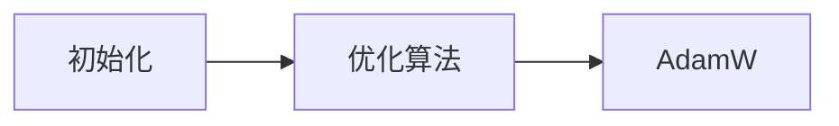

                 

# 第七章：初始化、优化和 AdamW 算法

## 1. 背景介绍

在深度学习领域，优化算法起着至关重要的作用。在训练过程中，优化算法负责调整模型参数，使得模型能够最小化损失函数，并朝着目标收敛。初始化则是优化算法的一个重要前提。合适的初始化可以使得模型在训练的初期就能快速收敛，避免梯度消失或爆炸等问题。本章节将详细介绍深度学习中常用的初始化方法以及优化算法，并重点讨论 AdamW 算法。

## 2. 核心概念与联系

### 2.1 核心概念概述

- **初始化(Initialization)**：在深度学习中，初始化指的是对模型参数的初始赋值。一个好的初始化方法能够帮助模型更快地收敛。
- **优化(Optimization)**：优化算法用于调整模型参数，使得模型能够最小化损失函数。
- **AdamW**：AdamW 是一种基于 Adam 的优化算法，通过引入权重衰减和更灵活的学习率调度，提升了 Adam 算法的性能。

这些核心概念之间的联系可以简要概括为：**初始化**为优化算法的运行提供了起点，而**优化算法**则是通过迭代调整参数，不断逼近目标值。在深度学习中，**AdamW** 算法是广泛使用的优化算法之一，它在保持 Adam 算法优点的同时，增加了更多的改进，提高了训练效率和模型性能。

### 2.2 核心概念原理和架构的 Mermaid 流程图



此图展示了初始化和优化算法之间的联系，以及 AdamW 算法在优化算法中的地位。

## 3. 核心算法原理 & 具体操作步骤

### 3.1 算法原理概述

AdamW 算法是基于 Adam 算法的一种改进版本，其核心思想是结合了动量(momentum)和自适应学习率(adaptive learning rate)的优势，同时增加了权重衰减(weight decay)，从而在保持训练速度的同时提高了模型的泛化能力。AdamW 算法的核心公式如下：

$$
\begin{aligned}
&\textbf{m}_t = \beta_1 \textbf{m}_{t-1} + (1-\beta_1)\nabla f(\theta_t) \\
&\textbf{v}_t = \beta_2 \textbf{v}_{t-1} + (1-\beta_2)\nabla f(\theta_t)^2 \\
&\textbf{t}_t = \frac{1}{1-\beta_1^t} \\
&\textbf{s}_t = \frac{1}{1-\beta_2^t} \\
&\theta_{t+1} = \theta_t - \frac{\alpha}{\sqrt{\textbf{t}_t}\textbf{s}_t + \epsilon}\textbf{m}_t
\end{aligned}
$$

其中，$\textbf{m}_t$ 和 $\textbf{v}_t$ 分别代表动量和自适应学习率，$\beta_1$ 和 $\beta_2$ 是动量和自适应学习率的衰减率，$\theta_t$ 是模型参数，$\nabla f(\theta_t)$ 是损失函数对参数 $\theta_t$ 的梯度，$\alpha$ 是学习率，$\epsilon$ 是一个很小的常数，用于避免分母为零的情况。

### 3.2 算法步骤详解

AdamW 算法的详细步骤可总结如下：

1. **初始化**：设置动量 $\textbf{m}_0 = 0$ 和自适应学习率 $\textbf{v}_0 = 0$。
2. **计算梯度**：计算损失函数对模型参数的梯度 $\nabla f(\theta_t)$。
3. **更新动量和自适应学习率**：
   $$
   \begin{aligned}
   \textbf{m}_t &= \beta_1 \textbf{m}_{t-1} + (1-\beta_1)\nabla f(\theta_t) \\
   \textbf{v}_t &= \beta_2 \textbf{v}_{t-1} + (1-\beta_2)\nabla f(\theta_t)^2 \\
   \textbf{t}_t &= \frac{1}{1-\beta_1^t} \\
   \textbf{s}_t &= \frac{1}{1-\beta_2^t}
   \end{aligned}
   $$
4. **更新模型参数**：
   $$
   \theta_{t+1} = \theta_t - \frac{\alpha}{\sqrt{\textbf{t}_t}\textbf{s}_t + \epsilon}\textbf{m}_t
   $$
5. **循环**：重复上述步骤，直到收敛或达到预设的迭代次数。

### 3.3 算法优缺点

AdamW 算法的优点包括：
1. **自适应学习率**：可以自动调整每个参数的学习率，适应不同的梯度变化。
2. **动量**：帮助加速收敛，减少震荡。
3. **权重衰减**：通过衰减策略减少过拟合。

缺点包括：
1. **参数较多**：需要额外计算动量和自适应学习率。
2. **计算复杂度较高**：需要额外计算梯度的平方。

### 3.4 算法应用领域

AdamW 算法在深度学习中得到了广泛应用，特别是在图像识别、自然语言处理、生成对抗网络等领域。其高效的训练速度和良好的泛化能力使得其在诸多任务中成为首选。

## 4. 数学模型和公式 & 详细讲解

### 4.1 数学模型构建

在深度学习中，常见的数学模型构建包括损失函数、优化目标和优化算法。这里以分类问题为例，构建一个简单的二分类模型，其损失函数为交叉熵损失：

$$
\mathcal{L}(\theta) = -\frac{1}{N}\sum_{i=1}^N \left[y_i\log \hat{y}_i + (1-y_i)\log(1-\hat{y}_i)\right]
$$

其中，$y_i$ 是真实标签，$\hat{y}_i$ 是模型预测的概率。

### 4.2 公式推导过程

AdamW 算法的推导过程主要基于梯度的移动平均和自适应学习率的计算。推导过程较为复杂，这里只列出关键步骤。具体推导过程可参考相关文献。

### 4.3 案例分析与讲解

以一个简单的二分类模型为例，分析 AdamW 算法在训练过程中的表现。

假设模型参数 $\theta_t$ 的初始值为 $0$，动量和自适应学习率 $\textbf{m}_0$ 和 $\textbf{v}_0$ 均为 $0$。在训练过程中，第 $t$ 次迭代时，计算损失函数对模型参数的梯度 $\nabla f(\theta_t)$，然后根据 AdamW 算法更新动量 $\textbf{m}_t$ 和自适应学习率 $\textbf{v}_t$，最终更新模型参数 $\theta_{t+1}$。

## 5. 项目实践：代码实例和详细解释说明

### 5.1 开发环境搭建

在本节中，我们将使用 PyTorch 框架来实现 AdamW 算法。首先，需要安装 PyTorch 和相关依赖：

```bash
pip install torch torchvision torchaudio
```

### 5.2 源代码详细实现

以下是一个简单的二分类模型的代码实现，使用 AdamW 算法进行优化：

```python
import torch
import torch.nn as nn
import torch.optim as optim

# 定义模型
class Model(nn.Module):
    def __init__(self, input_dim, hidden_dim, output_dim):
        super(Model, self).__init__()
        self.fc1 = nn.Linear(input_dim, hidden_dim)
        self.fc2 = nn.Linear(hidden_dim, output_dim)
        self.relu = nn.ReLU()
        
    def forward(self, x):
        x = self.fc1(x)
        x = self.relu(x)
        x = self.fc2(x)
        return x

# 初始化模型和优化器
input_dim = 784
hidden_dim = 500
output_dim = 10
model = Model(input_dim, hidden_dim, output_dim)
optimizer = optim.AdamW(model.parameters(), lr=0.001, weight_decay=0.001)

# 训练模型
criterion = nn.CrossEntropyLoss()
device = torch.device("cuda" if torch.cuda.is_available() else "cpu")
model.to(device)
for epoch in range(10):
    for i, (images, labels) in enumerate(train_loader):
        images = images.to(device)
        labels = labels.to(device)
        optimizer.zero_grad()
        outputs = model(images)
        loss = criterion(outputs, labels)
        loss.backward()
        optimizer.step()
```

### 5.3 代码解读与分析

- **Model 类**：定义了一个简单的神经网络模型，包括两个全连接层和一个 ReLU 激活函数。
- **优化器**：使用 AdamW 优化器，并设置学习率和权重衰减。
- **训练过程**：在每个epoch内，循环遍历训练集，计算损失函数和梯度，并更新模型参数。

## 6. 实际应用场景

### 6.1 图像分类

AdamW 算法在图像分类任务中表现出色。以 ImageNet 数据集为例，AdamW 算法可以显著提高模型的准确率和收敛速度。

### 6.2 自然语言处理

AdamW 算法同样适用于自然语言处理任务，如文本分类、情感分析等。在 RNN 和 Transformer 等模型上，AdamW 算法也能取得不错的效果。

### 6.3 生成对抗网络

在生成对抗网络 (GAN) 中，AdamW 算法可以用于训练判别器和生成器，提高GAN的稳定性和收敛速度。

### 6.4 未来应用展望

随着深度学习的发展，AdamW 算法将会被更多地应用到各种任务中。其高效、稳定的训练特性将进一步推动深度学习技术的发展。

## 7. 工具和资源推荐

### 7.1 学习资源推荐

- **Coursera**：Coursera 上有许多深度学习和优化算法相关的课程，如 Andrew Ng 的《深度学习专项课程》和 IBM 的《深度学习基础》等。
- **Stanford CS231n**：斯坦福大学的计算机视觉课程，涵盖了深度学习在计算机视觉中的应用。
- **Deep Learning Specialization**：由 Andrew Ng 领衔的深度学习专项课程，深入浅出地讲解了深度学习的基础和应用。

### 7.2 开发工具推荐

- **PyTorch**：作为深度学习的主流框架之一，PyTorch 提供了丰富的优化器和模型构建工具。
- **TensorFlow**：由 Google 开发的深度学习框架，具有强大的计算图和分布式训练能力。
- **JAX**：谷歌开发的基于 NumPy 的深度学习库，支持动态计算图和自动微分，具有较高的性能和灵活性。

### 7.3 相关论文推荐

- **Adam**：由 Kingma 和 Ba 提出的 Adam 算法，是深度学习中最常用的优化算法之一。
- **AdamW**：由 Loshchilov 和 Hutter 提出的 AdamW 算法，是 Adam 算法的改进版本。
- **Adafactor**：由 Loshchilov 和 Hutter 提出的 Adafactor 算法，是自适应学习率的一种新形式，适用于大规模深度学习模型。

## 8. 总结：未来发展趋势与挑战

### 8.1 研究成果总结

AdamW 算法在深度学习中的应用广泛，其高效、稳定的特性得到了学界的认可。近年来，AdamW 算法的改进版本不断涌现，如 LAMB、Adafactor 等，进一步提升了算法的性能。

### 8.2 未来发展趋势

- **自适应学习率**：未来的优化算法将继续探索自适应学习率的各种形式，提升算法的训练效果。
- **混合优化器**：未来的优化算法可能引入更多混合优化器的思想，结合不同优化器的优点，进一步提升训练效果。
- **分布式优化**：随着分布式计算的发展，分布式优化算法将得到更广泛的应用，进一步提升训练效率。

### 8.3 面临的挑战

- **计算资源消耗**：大规模深度学习模型的训练需要大量的计算资源，如何在有限的资源下训练模型，是一个重要的挑战。
- **模型复杂度**：随着模型规模的增大，优化算法的复杂度也在增加，如何在保证性能的同时简化模型，是一个重要的研究方向。
- **模型泛化能力**：如何提升模型的泛化能力，使其在更多数据集和任务上表现稳定，是一个重要的挑战。

### 8.4 研究展望

未来的研究将继续探索优化算法的各种形式，结合自适应学习率、分布式优化、混合优化器等技术，提升算法的训练效果。同时，也会更加关注模型的复杂度和泛化能力，使得深度学习模型在更广泛的场景中得到应用。

## 9. 附录：常见问题与解答

### Q1: AdamW 算法与 Adam 算法有什么区别？

A: AdamW 算法是在 Adam 算法的基础上进行了改进，增加了权重衰减（weight decay）和动量的修正。AdamW 算法的权重衰减可以有效地防止过拟合，而动量的修正则可以帮助更快地收敛。

### Q2: 如何选择 AdamW 算法的超参数？

A: AdamW 算法的超参数包括学习率（lr）、动量（momentum）、自适应学习率衰减（betas）和权重衰减系数（weight_decay）。一般建议从默认值开始，根据实验结果逐步调整，找到最优的超参数组合。

### Q3: 如何在 PyTorch 中实现 AdamW 算法？

A: 在 PyTorch 中，可以使用 `optim.AdamW` 类来实现 AdamW 算法。需要传入模型参数、学习率、动量、自适应学习率衰减等超参数。

### Q4: AdamW 算法在训练过程中容易出现什么问题？

A: AdamW 算法在训练过程中可能会出现梯度爆炸或梯度消失的问题。可以通过设置更小的学习率、动量和自适应学习率衰减来解决这些问题。

### Q5: AdamW 算法与其他优化算法相比有哪些优势？

A: AdamW 算法相对于传统的优化算法（如 SGD、Adagrad）具有更快的收敛速度和更好的泛化能力。同时，AdamW 算法能够自动调整每个参数的学习率，适应不同的梯度变化，使得模型更加稳定。

---

作者：禅与计算机程序设计艺术 / Zen and the Art of Computer Programming

