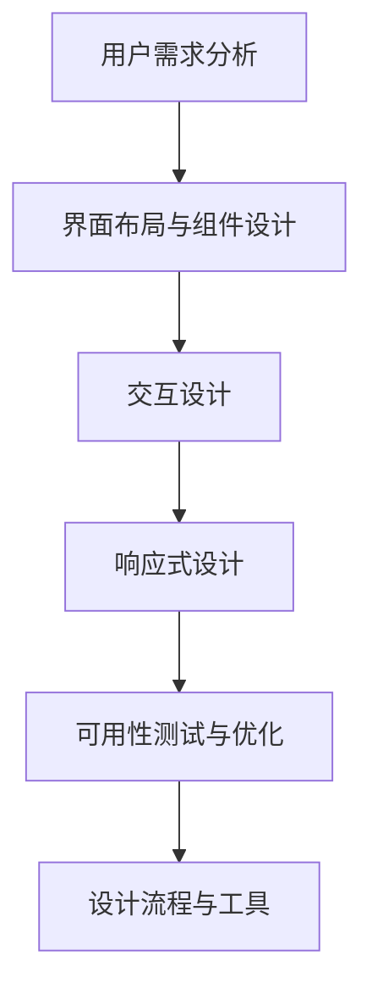

                 

# 第十章：人机交互界面设计

> 关键词：用户界面(UI)设计,用户交互体验,可用性设计,响应式设计,自适应布局

## 1. 背景介绍

### 1.1 问题由来

人机交互界面设计（UI/UX设计）是人机交互(Human-Computer Interaction, HCI)领域的关键环节，直接影响到用户对系统的使用体验和满意度。随着信息技术的迅猛发展，软件应用场景愈加多样化，设计出既有视觉美感又易用易用的界面，已经成为应用开发的关键。无论是在移动端、Web端还是在桌面端，界面设计都是评价一款产品成功与否的重要标准之一。

然而，现代软件系统越来越复杂，用户在不同设备、不同场景下的交互需求也不断变化。如何在快速迭代和更新的需求中，始终保持界面的可用性、可访问性和一致性，是UI设计师面临的巨大挑战。本书将重点讨论人机交互界面设计的核心概念与设计原则，力求提供一套通用的设计方法，帮助开发者构建出高质量的用户界面。

### 1.2 问题核心关键点

本章将从以下几个核心关键点深入探讨人机交互界面设计：

- **用户需求分析**：理解用户的使用场景和任务目标，分析用户在不同设备上的交互需求。
- **界面布局与组件设计**：选择合适的布局风格和组件类型，确保界面直观易懂、操作便捷。
- **交互设计**：设计高效直观的交互方式，提升用户操作体验。
- **响应式设计**：保证界面在不同设备上的自适应性和一致性。
- **可用性测试与优化**：通过用户测试收集反馈，持续改进界面设计。
- **设计流程与工具**：介绍设计流程和常用工具，帮助设计师提高工作效率。

## 2. 核心概念与联系

### 2.1 核心概念概述

为更好地理解人机交互界面设计，本节将介绍几个关键概念，并阐明它们之间的联系：

- **用户界面(UI)设计**：指界面元素的视觉设计，包括颜色、字体、图标等视觉元素。UI设计旨在为用户提供美观直观的界面，增强用户对系统的认知和操作。
- **用户交互体验(UX)设计**：关注用户在使用系统时的感受和体验，通过设计高效直观的交互方式，提升用户满意度。
- **可用性设计(Usability)**：衡量界面设计的易用性、易学性和效率性，通常通过用户测试和指标评估。
- **响应式设计(Response Design)**：设计在不同设备和屏幕尺寸下的界面布局和组件适应性，保证一致的用户体验。
- **自适应布局(Adaptive Layout)**：根据设备屏幕尺寸和方向，自动调整界面布局和组件位置，提供更好的用户体验。

这些概念之间的逻辑关系可以通过以下Mermaid流程图来展示：



这个流程图展示了从需求分析到用户测试的设计流程：

1. 首先从用户需求出发，进行界面布局和组件设计。
2. 在布局和组件设计的基础上，进一步优化交互方式，提升用户体验。
3. 引入响应式设计，确保界面在不同设备上的适应性和一致性。
4. 通过可用性测试和优化，不断改进界面设计，提高用户满意度。
5. 借助设计流程和工具，提高设计效率，实现快速迭代。

## 3. 核心算法原理 & 具体操作步骤

### 3.1 算法原理概述

人机交互界面设计的核心算法原理主要基于用户体验和认知心理学。设计目标是在满足用户需求的同时，尽可能提升界面的可用性和可访问性。以下是基于用户体验和认知心理学的主要设计原则：

- **易用性（Usability）**：界面应该直观、易于理解和操作。用户应该能够在没有详细指导的情况下，快速掌握如何使用系统。
- **一致性（Consistency）**：界面元素应保持一致的样式和行为，以便用户形成固定的操作习惯。
- **反馈性（Feedback）**：用户操作后应立即得到系统响应，以确认其操作是否成功。
- **可访问性（Accessibility）**：界面应尽可能适应不同能力和需求的用户，包括色盲、视觉障碍等用户。
- **可控性（Controllability）**：用户应该能够控制界面元素的行为，如调整大小、改变颜色等。

### 3.2 算法步骤详解

基于用户体验和认知心理学的设计原则，界面设计的步骤大致包括以下几个关键环节：

**Step 1: 用户需求分析**
- 与用户沟通，了解他们的需求和任务目标。
- 进行用户角色建模，识别不同角色的用户需求。
- 绘制用户流程图，分析用户在不同设备上的操作流程。
- 进行用户场景模拟，识别可能出现的问题和瓶颈。

**Step 2: 界面布局与组件设计**
- 选择合适的布局风格，如栅格布局、流式布局等。
- 设计界面的基本组件，如按钮、文本框、滚动条等。
- 确定组件的样式和大小，保持一致性。
- 引入视觉层次，使用颜色、阴影、大小等区分不同的元素。
- 设计界面布局，确保布局清晰、紧凑。

**Step 3: 交互设计**
- 定义交互方式，如点击、拖拽、滚动等。
- 设计交互状态和过渡效果，提升用户体验。
- 使用手势和触摸交互，优化移动设备上的用户体验。
- 引入动画和过渡效果，增强用户操作的反馈性。
- 设计可访问的交互方式，考虑色盲用户、视觉障碍用户等。

**Step 4: 响应式设计**
- 使用CSS媒体查询，根据设备屏幕尺寸和方向调整布局。
- 实现组件自适应，在不同设备上保持一致的视觉和交互效果。
- 引入流式布局和弹性盒子布局，实现界面自适应。
- 设计可调整的元素大小和位置，适应不同设备的屏幕尺寸。

**Step 5: 可用性测试与优化**
- 进行用户测试，收集用户反馈。
- 分析测试数据，识别问题和瓶颈。
- 根据用户反馈，优化界面设计。
- 进行多轮迭代，持续改进界面可用性。
- 引入设计评估指标，如任务完成率、操作时间等。

**Step 6: 设计流程与工具**
- 设计流程大致包括需求分析、布局设计、交互设计、响应式设计等环节。
- 设计工具包括Sketch、Adobe XD、Figma等。
- 使用版本控制工具，如Git，进行版本管理和团队协作。
- 引入自动化测试工具，如Selenium，确保界面设计的稳定性。

### 3.3 算法优缺点

人机交互界面设计具有以下优点：
1. 提升用户体验：通过直观的布局和交互方式，提高用户满意度和操作效率。
2. 增强可用性：界面设计遵循易用性和一致性原则，减少用户的学习成本。
3. 提高可访问性：通过响应式设计和可访问性优化，满足不同用户的需求。
4. 促进一致性：保持界面元素的视觉和交互一致，提升用户的操作习惯。

然而，界面设计也存在一些缺点：
1. 设计复杂：界面设计涉及多方面，如视觉设计、交互设计、响应式设计等，需要综合考虑。
2. 主观性强：界面设计受设计师个人经验和审美影响较大，难以量化评估。
3. 迭代成本高：设计流程复杂，每次迭代需要大量时间和人力成本。
4. 缺乏标准化：不同设计师和团队可能采用不同的设计规范和工具，难以统一。

尽管存在这些缺点，但用户界面设计仍是应用开发中不可或缺的一环。通过不断优化设计流程和工具，降低设计成本，提升设计效率，界面设计将不断进步，为软件应用带来更好的用户体验。

### 3.4 算法应用领域

人机交互界面设计广泛应用于以下领域：

- **移动应用**：手机、平板等移动设备上的应用界面设计，如微信、支付宝、美团等。
- **Web应用**：网页界面设计，如电商、新闻、社交媒体等。
- **桌面应用**：Windows、macOS等操作系统上的应用界面设计，如Office、Photoshop等。
- **增强现实**：AR设备上的界面设计，如Snapchat、Facebook等。
- **虚拟现实**：VR设备上的界面设计，如Oculus、HTC Vive等。
- **游戏界面**：电子游戏界面设计，如DOTA2、《塞尔达传说》等。

这些领域的应用，均需要良好的界面设计，以提升用户体验和操作效率。

## 4. 数学模型和公式 & 详细讲解 & 举例说明

### 4.1 数学模型构建

为了更好地理解用户界面的布局和组件设计，本节将使用数学模型来描述界面元素的位置和大小。设界面元素 $E_i$ 的位置坐标为 $(x_i, y_i)$，大小为 $(w_i, h_i)$。

### 4.2 公式推导过程

根据布局需求，界面元素的位置和大小可以通过以下公式推导：

- 栅格布局：将界面划分为若干网格，每个网格放置一个元素，根据网格大小和位置计算元素坐标。
- 流式布局：元素随屏幕尺寸动态调整大小和位置，确保界面紧凑且美观。
- 弹性盒子布局：使用CSS Flexbox实现自适应布局，根据容器和子元素的大小关系计算位置。

### 4.3 案例分析与讲解

以栅格布局为例，假设有6个元素，界面宽度为600像素，高度为400像素，每个元素高度为80像素，网格高度为100像素。根据栅格布局的规则，每个元素的位置和大小可以计算如下：

- 第一个元素：
  $$
  x_1 = 0, \quad y_1 = 0
  $$
  $$
  w_1 = 600 - 0 - 0 = 600
  $$
  $$
  h_1 = 400 - 0 - 0 = 400
  $$

- 第二个元素：
  $$
  x_2 = 600 - 600 = 0
  $$
  $$
  y_2 = 100 - 0 = 100
  $$
  $$
  w_2 = 600 - 0 - 0 = 600
  $$
  $$
  h_2 = 400 - 100 - 0 = 300
  $$

- 第三个元素：
  $$
  x_3 = 600 - 600 = 0
  $$
  $$
  y_3 = 2 \times 100 - 0 = 200
  $$
  $$
  w_3 = 600 - 0 - 0 = 600
  $$
  $$
  h_3 = 400 - 200 - 0 = 200
  $$

依此类推，计算其他元素的位置和大小，得到完整的界面布局。

## 5. 项目实践：代码实例和详细解释说明

### 5.1 开发环境搭建

在进行界面设计实践前，我们需要准备好开发环境。以下是使用HTML/CSS/JS进行Web界面设计的开发环境配置流程：

1. 安装Node.js：从官网下载并安装Node.js，用于运行npm等包管理工具。

2. 安装npm：在Node.js环境下，运行 `npm install -g npm` 安装全局npm。

3. 安装前端框架：选择合适的前端框架，如React、Vue、Angular等，使用npm安装：
```bash
npm install react --save
npm install react-dom --save
```

4. 创建项目目录：
```bash
mkdir webapp
cd webapp
```

5. 初始化项目：
```bash
npm init -y
```

6. 安装和配置开发工具：
- 使用Visual Studio Code作为编辑器，安装插件如ESLint、Prettier等，提高代码质量。
- 使用Webpack作为打包工具，配置开发和生产环境。
- 使用Git作为版本控制工具，进行代码管理和团队协作。

完成上述步骤后，即可在项目环境中开始界面设计实践。

### 5.2 源代码详细实现

下面我们以一个简单的登录界面为例，给出使用React进行Web界面设计的完整代码实现。

```javascript
import React, { useState } from 'react';
import './App.css';

function App() {
  const [username, setUsername] = useState('');
  const [password, setPassword] = useState('');
  const [loggedIn, setLoggedIn] = useState(false);

  const handleLogin = () => {
    // 模拟登录逻辑
    if (username === 'admin' && password === '123456') {
      setLoggedIn(true);
    } else {
      alert('Invalid username or password');
    }
  };

  return (
    <div className="App">
      <h1>Login</h1>
      <div className="form">
        <label>
          Username:
          <input type="text" value={username} onChange={(e) => setUsername(e.target.value)} />
        </label>
        <br />
        <label>
          Password:
          <input type="password" value={password} onChange={(e) => setPassword(e.target.value)} />
        </label>
        <br />
        <button onClick={handleLogin}>Login</button>
      </div>
      {loggedIn ? <p>Welcome to the app!</p> : null}
    </div>
  );
}

export default App;
```

以上代码实现了简单的登录界面，包含用户名和密码输入框、登录按钮和欢迎提示。使用React的状态钩子实现了状态管理。

### 5.3 代码解读与分析

让我们再详细解读一下关键代码的实现细节：

- `useState`：React的状态钩子，用于管理界面的状态。
- `handleLogin`：处理登录事件的函数，用于模拟登录逻辑。
- `return`：返回渲染的DOM结构，包括标题、表单、按钮等。
- `className`：CSS类名，用于应用样式。
- 样式文件 `App.css`：包含界面的基本样式，如字体、颜色等。

在实际项目中，还需要考虑更多因素，如表单验证、错误处理、页面导航等，才能构建出完整、实用的Web界面。

### 5.4 运行结果展示

运行项目，在浏览器中查看结果：

```bash
npm start
```

打开浏览器，访问 `http://localhost:3000`，即可看到上述实现的登录界面。

## 6. 实际应用场景

### 6.1 智能客服系统

智能客服系统是一种典型的人机交互应用，通过自动应答和人工干预，提升客户咨询的效率和体验。用户界面设计的目标是确保界面直观、易用，同时具备高度的自适应性，适应不同设备。

在智能客服系统中，可以使用响应式设计和流式布局，确保界面在不同设备上保持一致。引入动画和过渡效果，增强用户的操作反馈。通过用户测试收集反馈，不断优化界面设计，提升用户满意度。

### 6.2 企业管理系统

企业管理系统用于管理企业的人力资源、财务、库存等业务流程，界面设计的目标是提供高效、易用的操作界面，提升企业员工的效率。

在企业管理系统设计中，可以采用栅格布局和弹性盒子布局，确保界面元素的大小和位置适应不同屏幕尺寸。引入可访问性设计，确保界面的可用性。通过用户测试和可用性评估，不断优化界面设计，提升员工的工作效率。

### 6.3 电商购物系统

电商购物系统涉及商品展示、购物车、结算等环节，界面设计的目标是提升用户的购物体验，提高转化率。

在电商购物系统中，可以使用响应式设计和流式布局，确保界面在不同设备上保持一致。引入动画和过渡效果，增强用户的操作反馈。通过用户测试收集反馈，不断优化界面设计，提升用户的购物体验。

## 7. 工具和资源推荐

### 7.1 学习资源推荐

为了帮助开发者系统掌握人机交互界面设计的理论基础和实践技巧，这里推荐一些优质的学习资源：

1. 《设计心理学》系列书籍：著名设计师Don Norman的经典之作，探讨了认知心理学在人机交互设计中的应用。
2. 《响应式设计基础》系列课程：Udacity提供的响应式设计课程，涵盖HTML、CSS、JS等技术。
3. 《UX设计全指南》书籍：一本系统全面的UX设计指南，涵盖用户研究、原型设计、交互设计等。
4. 《React官方文档》：React的官方文档，详细介绍了React的用法和最佳实践。
5. 《Google Design》：Google的设计团队编写的设计手册，涵盖设计原则、流程、工具等。
6. 《Sketch官方教程》：Sketch官方提供的教程，涵盖界面设计、原型设计、用户测试等。

通过对这些资源的学习实践，相信你一定能够快速掌握人机交互界面设计的精髓，并用于解决实际的UI设计问题。

### 7.2 开发工具推荐

高效的开发离不开优秀的工具支持。以下是几款用于人机交互界面设计的常用工具：

1. Sketch：苹果公司推出的矢量绘图工具，广泛用于UI设计。
2. Adobe XD：Adobe推出的原型设计工具，支持多种平台和设备。
3. Figma：在线协作的UI设计工具，支持实时协作和版本控制。
4. InVision：在线原型和设计协作工具，支持用户测试和数据分析。
5. Selenium：自动化测试工具，用于界面设计的自动化测试。
6. Git：版本控制工具，用于团队协作和版本管理。

合理利用这些工具，可以显著提升人机交互界面设计的效率，加快创新迭代的步伐。

### 7.3 相关论文推荐

人机交互界面设计的研究源于学界的持续研究。以下是几篇奠基性的相关论文，推荐阅读：

1. Tufte, Edward R. (1987). The Visual Display of Quantitative Information. Graphics Press.
2. Nielsen, Jakob. (2003). Don't Make Me Think. O'Reilly Media.
3. Norman, Donald A. (2004). Emotional Design: Why We Love (or Hate) Everyday Things. Basic Books.
4. Buxton, Bill. (2012). Sketching User Experiences: The Essential Guide to User-Centered Interaction Design. O'Reilly Media.
5. Witcomb, Jason. (2013). User Experience for the Web. O'Reilly Media.
6. Spencer, Chris. (2014). Human Factors of Computer Systems. Prentice Hall.

这些论文代表了大规模语言模型微调技术的发展脉络。通过学习这些前沿成果，可以帮助研究者把握学科前进方向，激发更多的创新灵感。

## 8. 总结：未来发展趋势与挑战

### 8.1 总结

本文对人机交互界面设计的核心概念与设计原则进行了全面系统的介绍。首先阐述了界面设计的重要性及其对用户体验的影响，明确了界面设计的目标和设计原则。其次，从原理到实践，详细讲解了用户需求分析、界面布局与组件设计、交互设计、响应式设计、可用性测试与优化、设计流程与工具等方面的内容，给出了界面设计任务的完整代码实例。同时，本文还广泛探讨了界面设计在智能客服、企业管理系统、电商购物等多个行业领域的应用前景，展示了界面设计的巨大潜力。

通过本文的系统梳理，可以看到，人机交互界面设计正在成为应用开发中不可或缺的一环。通过不断优化设计流程和工具，降低设计成本，提升设计效率，界面设计将不断进步，为软件应用带来更好的用户体验。

### 8.2 未来发展趋势

展望未来，人机交互界面设计将呈现以下几个发展趋势：

1. 自动化设计工具：随着AI和机器学习技术的发展，自动化设计工具将逐步普及，帮助设计师快速生成界面原型，减少手工设计的时间成本。
2. 用户驱动设计：借助用户反馈和行为数据，界面设计将更加注重用户的主观体验和个性化需求。
3. 数据可视化设计：利用数据可视化技术，增强用户对数据的理解和感知，提升界面的交互性和互动性。
4. 跨设备设计：界面设计将更加注重跨设备一致性，确保界面在不同设备上的兼容性和可用性。
5. 增强现实设计：随着增强现实技术的发展，界面设计将结合AR技术，提供更加丰富的视觉和交互体验。
6. 多感官设计：未来的人机交互界面设计将结合视觉、听觉、触觉等多种感官，提升用户的综合体验。

以上趋势凸显了人机交互界面设计的广阔前景。这些方向的探索发展，必将进一步提升软件系统的用户界面设计水平，为用户的交互体验带来质的飞跃。

### 8.3 面临的挑战

尽管人机交互界面设计已经取得了显著成就，但在迈向更加智能化、普适化应用的过程中，它仍面临着诸多挑战：

1. 设计复杂度高：界面设计涉及多方面，如视觉设计、交互设计、响应式设计等，需要综合考虑。
2. 用户需求多样化：不同用户群体的需求差异较大，设计时需要兼顾多样性。
3. 设计流程繁琐：界面设计涉及多轮迭代和测试，耗时长，成本高。
4. 设计一致性难以保证：界面设计在不同设备、不同团队之间的一致性难以保证。
5. 可用性评估难度大：界面设计的可用性评估需要大量用户测试数据，难以量化评估。
6. 设计规范缺乏统一标准：不同设计师和团队可能采用不同的设计规范和工具，难以统一。

尽管存在这些挑战，但用户界面设计仍是应用开发中不可或缺的一环。通过不断优化设计流程和工具，降低设计成本，提升设计效率，界面设计将不断进步，为软件应用带来更好的用户体验。

### 8.4 研究展望

面对人机交互界面设计所面临的种种挑战，未来的研究需要在以下几个方面寻求新的突破：

1. 探索自动化设计工具：通过AI技术，自动生成界面设计方案，提高设计效率。
2. 研究用户驱动设计方法：利用用户行为数据，生成个性化的设计方案，提升用户体验。
3. 开发数据可视化工具：结合数据可视化技术，增强用户对数据的理解和感知。
4. 改进跨设备设计方法：设计通用的界面布局和组件，确保跨设备一致性。
5. 引入增强现实设计技术：结合AR技术，提供更加丰富的视觉和交互体验。
6. 开发多感官设计工具：结合视觉、听觉、触觉等多种感官，提升用户的综合体验。

这些研究方向的探索，必将引领人机交互界面设计技术迈向更高的台阶，为软件应用带来更好的用户体验。面向未来，人机交互界面设计需要与其他人工智能技术进行更深入的融合，如自然语言处理、计算机视觉等，多路径协同发力，共同推动人机交互系统的发展。只有勇于创新、敢于突破，才能不断拓展用户界面的边界，让人机交互更加高效、愉悦、智能。

## 9. 附录：常见问题与解答

**Q1：用户界面设计是否需要关注用户心理和行为？**

A: 是的，用户界面设计需要深入理解用户的心理和行为，以提供更好的用户体验。设计师需要了解用户的目标、需求和情感，在设计中体现这些元素，才能设计出符合用户期望的界面。

**Q2：用户界面设计是否需要考虑视觉设计？**

A: 是的，视觉设计是用户界面设计的重要组成部分，影响用户对界面的认知和感受。设计师需要考虑颜色、字体、图标等视觉元素，确保界面美观且易于阅读。

**Q3：用户界面设计是否需要考虑交互设计？**

A: 是的，交互设计是用户界面设计的核心，决定了用户如何与系统互动。设计师需要考虑界面的响应性、反馈性和可控性，确保用户的操作直观且易于掌握。

**Q4：用户界面设计是否需要考虑响应式设计？**

A: 是的，响应式设计是确保界面在不同设备上保持一致性的关键。设计师需要考虑不同设备的屏幕尺寸和方向，使用CSS媒体查询等技术，实现自适应布局。

**Q5：用户界面设计是否需要考虑可用性测试？**

A: 是的，可用性测试是评估界面设计的重要手段。设计师需要借助用户测试和可用性评估，不断优化界面设计，确保用户的操作高效且易用。

**Q6：用户界面设计是否需要考虑设计流程和工具？**

A: 是的，设计流程和工具是提高设计效率和协作能力的重要保障。设计师需要选择合适的设计工具，遵循设计流程，确保设计工作的有序进行。

---

作者：禅与计算机程序设计艺术 / Zen and the Art of Computer Programming

