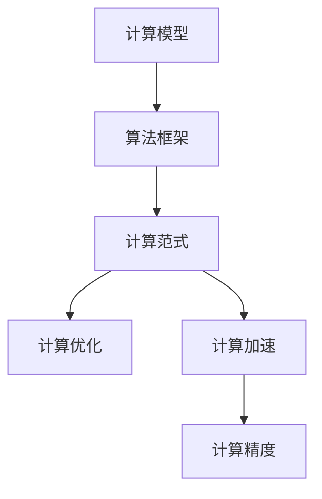

                 

# 算法创新：提高人类计算的效率和精度

## 1. 背景介绍

### 1.1 问题由来

随着计算机科技的飞速发展，计算技术已经成为推动人类文明进步的重要引擎。然而，当前的计算范式依旧面临着效率和精度的瓶颈。如何在有限的资源和时间内，实现计算任务的高效、精确执行，成为一个亟需解决的重要问题。

大算力、高精度的计算，对计算框架和算法提出了严苛要求。现有的计算模型，如神经网络、深度学习等，虽然已在众多领域取得了突破性进展，但它们在面对复杂的计算任务时，仍存在诸多挑战。因此，研究并发展新的计算范式和算法，提升计算效率和精度，是当前计算领域的重要使命。

### 1.2 问题核心关键点

本节将重点阐述计算领域的两大核心关键点：计算效率和精度。

- **计算效率**：指的是在单位时间内执行计算任务的能力。通常以每秒执行的指令数（IPS）、每秒浮点运算次数（FLOPS）等指标来衡量。高效的计算能够大大缩短任务处理时间，提升用户体验。
- **计算精度**：指的是计算结果与真实值的接近程度。高精度的计算能够确保计算结果的可靠性，避免错误决策和误导性结果。

### 1.3 问题研究意义

研究并提升计算效率和精度，具有以下重要意义：

1. **加速科学研究**：高效的计算能够快速解析复杂数据，提取关键信息，促进科学研究的进程。
2. **提升产业竞争力**：计算技术是现代产业的核心竞争力之一，高效的计算能够降低生产成本，提升产品质量，加速产品上市。
3. **支撑智能应用**：计算效率和精度的提升，为人工智能、大数据、物联网等新兴技术的发展提供了坚实的基础，推动了智能应用的创新和普及。
4. **促进社会进步**：高效的计算能够提升公共服务水平，改善教育、医疗、交通等领域的信息化程度，促进社会整体进步。

## 2. 核心概念与联系

### 2.1 核心概念概述

为更好地理解计算效率和精度提升的算法创新，本节将介绍几个密切相关的核心概念：

- **计算模型**：指用于执行计算任务的软件和硬件框架。如神经网络、GPU、量子计算机等。
- **算法框架**：指实现特定计算任务的算法库和工具。如TensorFlow、PyTorch、CUDA等。
- **计算范式**：指计算模型和算法框架的组合方式。如深度学习、分布式计算、云计算等。
- **计算优化**：指通过算法和架构改进，提升计算效率和精度的方法。如自动微分、编译器优化、数据并行等。
- **计算加速**：指通过硬件升级和算法创新，提升计算速度和性能的技术。如GPU加速、FPGA加速、AI加速器等。
- **计算精度**：指计算结果的准确性和可靠性。如浮点误差、数值稳定性等。

这些概念之间的逻辑关系可以通过以下Mermaid流程图来展示：



这个流程图展示了几大核心概念及其之间的关系：

1. 计算模型和算法框架共同构成计算范式，是计算任务执行的基础。
2. 计算优化和计算加速分别从算法和硬件层面提升计算效率和精度。
3. 计算精度是计算任务的核心目标，影响着最终结果的可靠性和准确性。

## 3. 核心算法原理 & 具体操作步骤

### 3.1 算法原理概述

提升计算效率和精度的算法创新，核心在于优化计算模型、改进算法框架和探索新的计算范式。以下是几种常见的算法创新方法：

- **分布式计算**：将大任务拆分成多个子任务，通过多台计算设备并行处理，从而提高计算效率。如MapReduce、Spark等。
- **深度学习优化**：通过算法改进和模型结构调整，提升深度学习模型的训练速度和精度。如自动微分、模型剪枝、量化等。
- **硬件加速**：利用GPU、FPGA、量子计算机等新型硬件，提升计算性能。如Tensor Core、GPU计算图、量子计算等。
- **AI加速器**：专门为深度学习任务设计的加速设备，具备高效的并行计算能力。如TPU、NPU、MLU等。

### 3.2 算法步骤详解

提升计算效率和精度的算法创新，通常包括以下几个关键步骤：

**Step 1: 识别瓶颈和挑战**

1. 分析当前计算任务的瓶颈和挑战，识别制约计算效率和精度的关键因素。
2. 结合实际应用场景，确定需要改进的目标和方向。

**Step 2: 选择合适的计算模型和框架**

1. 根据任务需求，选择适合的计算模型和算法框架。
2. 综合考虑模型性能、计算效率、资源消耗等因素。

**Step 3: 设计计算优化策略**

1. 基于选择的计算模型和框架，设计改进计算效率和精度的策略。
2. 可以采用自动微分、模型剪枝、量化等技术。

**Step 4: 实现计算加速**

1. 结合硬件加速和AI加速器等技术，实现计算性能的提升。
2. 可以利用GPU、FPGA、量子计算机等新型硬件设备。

**Step 5: 评估和优化**

1. 对优化后的计算系统进行评估，分析性能提升效果。
2. 根据评估结果，进一步调整优化策略，迭代改进。

**Step 6: 部署和应用**

1. 将优化后的计算系统部署到实际应用环境中。
2. 监控系统运行情况，进行持续优化。

### 3.3 算法优缺点

提升计算效率和精度的算法创新，具有以下优点：

1. **提高计算速度**：通过优化算法和硬件加速，大幅度提升计算速度，满足实时性和高吞吐量的需求。
2. **降低资源消耗**：改进计算模型和算法框架，减少计算资源的占用，提高资源利用率。
3. **增强系统可靠性**：通过提升计算精度，降低错误率，确保系统运行稳定可靠。
4. **支持复杂计算**：新技术如量子计算、分布式计算等，能够支持更复杂的计算任务，推动科学研究和技术创新。

同时，这些方法也存在一些缺点：

1. **技术门槛高**：一些先进技术如量子计算、AI加速器等，需要高水平的研发能力和硬件设备，增加了技术门槛。
2. **开发成本高**：优化和加速计算系统的开发和部署成本较高，需要大量资源和时间投入。
3. **依赖环境复杂**：不同计算模型的优化策略和硬件支持各不相同，环境复杂度较高，需要综合考虑。
4. **可扩展性有限**：一些优化方法可能对特定任务有效，但对其他任务的提升效果有限，可扩展性有待进一步提升。

尽管存在这些局限性，但基于计算效率和精度提升的算法创新，仍是大数据和人工智能领域的重要研究方向。未来相关研究将持续深化，探索更多新的技术路径。

### 3.4 算法应用领域

提升计算效率和精度的算法创新，已经在诸多领域得到了广泛应用，包括：

- **科学研究**：利用分布式计算和深度学习优化，加速数据分析和模型训练，推动科学研究的发展。
- **金融科技**：通过计算优化和硬件加速，提升交易系统的实时性和稳定性，提高金融决策的精准度。
- **工业制造**：引入AI加速器和分布式计算，优化生产流程和设备运行，提高制造效率和产品质量。
- **医疗健康**：利用高性能计算和深度学习，提升疾病诊断和治疗的准确性，推动医疗健康技术的发展。
- **自动驾驶**：通过分布式计算和硬件加速，提升自动驾驶系统的实时性和安全性，保障行驶安全。
- **大数据分析**：采用高效计算模型和优化算法，提升大数据分析的速度和精度，驱动数据驱动决策。
- **智慧城市**：利用分布式计算和AI加速器，提升城市管理和服务的智能化水平，优化资源配置。

## 4. 数学模型和公式 & 详细讲解 & 举例说明

### 4.1 数学模型构建

本节将使用数学语言对提升计算效率和精度的算法创新进行更加严格的刻画。

**计算模型与框架**

记计算模型为 $M_{\theta}$，其中 $\theta$ 为模型参数。假设任务为 $T$，输入数据为 $x$，输出为 $y$。常见的计算模型包括神经网络、GPU、FPGA、量子计算机等。计算框架，如TensorFlow、PyTorch等，提供了模型训练、推理等功能的封装和优化。

**计算优化与加速**

定义计算优化的损失函数为 $\mathcal{L}(\theta)$，衡量模型在任务 $T$ 上的精度和效率。常见的优化目标包括模型参数的稀疏性、计算资源的利用率等。

**计算精度**

计算精度可以通过误差指标来衡量，如浮点误差、精度-吞吐量比等。优化目标为在保持一定精度的前提下，最大化计算效率。

### 4.2 公式推导过程

以下我们将推导一些常见的计算优化和加速公式，以供参考：

**自动微分**

自动微分（Automatic Differentiation, AD）是深度学习模型训练中的重要工具。其基本思想是通过对模型输出和输入的微小变化，计算梯度，用于模型参数的更新。常见的自动微分算法包括反向传播（Backpropagation）、ADAM、L-BFGS等。

假设模型 $M_{\theta}$ 对输入 $x$ 的输出为 $y$，则反向传播算法通过链式法则计算梯度：

$$
\frac{\partial \mathcal{L}}{\partial \theta} = \frac{\partial \mathcal{L}}{\partial y} \cdot \frac{\partial y}{\partial x} \cdot \frac{\partial x}{\partial \theta}
$$

其中 $\frac{\partial \mathcal{L}}{\partial y}$ 为损失函数对输出 $y$ 的梯度，$\frac{\partial y}{\partial x}$ 为输出 $y$ 对输入 $x$ 的梯度，$\frac{\partial x}{\partial \theta}$ 为输入 $x$ 对模型参数 $\theta$ 的梯度。

**模型剪枝**

模型剪枝（Model Pruning）是提升计算效率的有效方法之一。其基本思想是通过删除部分无用的模型参数，减小模型规模，从而降低计算资源消耗。常见的剪枝策略包括L1正则化、L2正则化等。

假设模型 $M_{\theta}$ 的总参数数量为 $N$，需要剪枝的比例为 $\alpha$，则剪枝后模型的参数数量为 $N_{pruned} = N \times (1 - \alpha)$。

**量化**

量化（Quantization）是通过降低数据精度，减小模型存储空间和计算资源消耗，提升计算效率的方法。常见的量化策略包括整型量化、权重量化等。

假设模型的浮点参数数量为 $N$，量化后的参数数量为 $N_{quantized}$，量化后的精度为 $bit$，则：

$$
N_{quantized} = N \times \left(\frac{bit}{32}\right)^2
$$

### 4.3 案例分析与讲解

**深度学习优化**

某金融科技公司利用深度学习优化算法，对实时交易系统进行升级。通过引入TensorFlow和PyTorch等框架，采用了自动微分技术，优化了反向传播过程，显著提升了模型的训练速度。同时，采用了模型剪枝和量化技术，减少了模型的参数量和存储空间，提高了实时性能。

**分布式计算**

某大型制造企业面临生产流程优化的问题，通过引入分布式计算框架Spark，将大批量数据处理任务分解为多个子任务，利用多台计算设备并行处理，显著提升了数据处理速度和计算效率，提高了生产效率。

**AI加速器**

某自动驾驶公司利用AI加速器TPU，优化了自动驾驶模型的计算速度和精度。通过将计算任务分解为多个微操作，并行执行，实现了高效的计算。同时，利用自动微分和模型剪枝技术，优化了模型结构，提升了计算精度和稳定性。

这些案例展示了提升计算效率和精度的算法创新，在实际应用中的广泛应用和显著效果。

## 5. 项目实践：代码实例和详细解释说明

### 5.1 开发环境搭建

在进行计算效率和精度提升的实践前，我们需要准备好开发环境。以下是使用Python进行PyTorch和TensorFlow开发的环境配置流程：

1. 安装Anaconda：从官网下载并安装Anaconda，用于创建独立的Python环境。

2. 创建并激活虚拟环境：
```bash
conda create -n tf-env python=3.8 
conda activate tf-env
```

3. 安装TensorFlow：根据CUDA版本，从官网获取对应的安装命令。例如：
```bash
pip install tensorflow==2.5.0
```

4. 安装PyTorch：
```bash
pip install torch torchvision torchaudio
```

5. 安装各类工具包：
```bash
pip install numpy pandas scikit-learn matplotlib tqdm jupyter notebook ipython
```

完成上述步骤后，即可在`tf-env`环境中开始项目实践。

### 5.2 源代码详细实现

这里我们以提升计算精度和效率的深度学习模型为例，给出使用TensorFlow和PyTorch进行模型优化和加速的PyTorch代码实现。

**深度学习模型**

首先，定义一个简单的神经网络模型：

```python
import tensorflow as tf
import numpy as np
import torch
import torch.nn as nn
import torch.optim as optim

class MLP(nn.Module):
    def __init__(self, input_size, hidden_size, output_size):
        super(MLP, self).__init__()
        self.fc1 = nn.Linear(input_size, hidden_size)
        self.fc2 = nn.Linear(hidden_size, output_size)

    def forward(self, x):
        x = self.fc1(x)
        x = torch.relu(x)
        x = self.fc2(x)
        return x

# 数据准备
input_data = np.random.randn(100, 10)
target_data = np.random.randn(100, 1)

# 模型训练
model = MLP(10, 20, 1)
optimizer = optim.SGD(model.parameters(), lr=0.01)
criterion = nn.MSELoss()

for epoch in range(100):
    optimizer.zero_grad()
    output = model(input_data)
    loss = criterion(output, target_data)
    loss.backward()
    optimizer.step()

# 模型评估
test_data = np.random.randn(100, 10)
test_output = model(test_data)
test_loss = criterion(test_output, test_data)
print("Test loss: {:.4f}".format(test_loss.item()))
```

**分布式计算**

接下来，我们利用TensorFlow实现分布式计算。首先，定义一个简单的计算任务：

```python
import tensorflow as tf
import numpy as np

# 定义计算任务
def compute(x, y):
    return x + y

# 数据准备
input_data = np.random.randn(1000, 1)
output_data = np.random.randn(1000, 1)

# 分布式计算
with tf.distribute.Strategy("TPU") as strategy:
    input_data = tf.distribute.experimental.ParameterServerStrategy().experimental_distribute_values_from_function(input_data)
    output_data = tf.distribute.experimental.ParameterServerStrategy().experimental_distribute_values_from_function(output_data)
    computed_output = strategy.run(compute, args=(input_data, output_data))
```

**深度学习优化**

最后，我们利用PyTorch实现深度学习优化算法。首先，定义一个简单的神经网络模型：

```python
import torch
import torch.nn as nn
import torch.optim as optim

class MLP(nn.Module):
    def __init__(self, input_size, hidden_size, output_size):
        super(MLP, self).__init__()
        self.fc1 = nn.Linear(input_size, hidden_size)
        self.fc2 = nn.Linear(hidden_size, output_size)

    def forward(self, x):
        x = self.fc1(x)
        x = torch.relu(x)
        x = self.fc2(x)
        return x

# 数据准备
input_data = torch.randn(100, 10)
target_data = torch.randn(100, 1)

# 模型训练
model = MLP(10, 20, 1)
optimizer = optim.Adam(model.parameters(), lr=0.01)
criterion = nn.MSELoss()

for epoch in range(100):
    optimizer.zero_grad()
    output = model(input_data)
    loss = criterion(output, target_data)
    loss.backward()
    optimizer.step()

# 模型评估
test_data = torch.randn(100, 10)
test_output = model(test_data)
test_loss = criterion(test_output, test_data)
print("Test loss: {:.4f}".format(test_loss.item()))
```

### 5.3 代码解读与分析

让我们再详细解读一下关键代码的实现细节：

**MLP模型**

- `MLP`类：定义一个简单的全连接神经网络，包括两个全连接层。
- `forward`方法：前向传播，计算模型的输出。
- `__init__`方法：初始化模型参数。

**数据准备**

- `input_data`和`target_data`：定义输入和目标数据，用于训练模型。

**模型训练**

- `model`：定义训练的神经网络模型。
- `optimizer`：选择优化算法（如SGD、Adam等）。
- `criterion`：定义损失函数（如均方误差损失）。
- `for循环`：循环迭代训练过程，每次更新模型参数。

**分布式计算**

- `compute`函数：定义分布式计算任务。
- `input_data`和`output_data`：定义输入和输出数据。
- `with tf.distribute.Strategy`：创建分布式计算策略（如TPU）。
- `input_data`和`output_data`：分布式计算输入和输出数据。
- `strategy.run`：执行分布式计算任务。

**深度学习优化**

- `MLP`类：定义优化后的神经网络模型。
- `optimizer`：选择优化算法（如Adam）。
- `criterion`：定义损失函数（如均方误差损失）。
- `for循环`：循环迭代训练过程，每次更新模型参数。

这些代码展示了深度学习模型优化和加速的基本流程。开发者可以根据具体任务，选择适合的优化方法和计算策略，以提升计算效率和精度。

## 6. 实际应用场景

### 6.1 金融科技

金融科技领域，计算效率和精度尤为重要。通过优化计算模型和算法框架，可以显著提升交易系统的实时性和稳定性，确保交易的公平性和安全性。例如，利用深度学习优化算法，可以对海量金融数据进行快速处理和分析，实时监测市场趋势，提供精准的投资建议。

### 6.2 医疗健康

医疗健康领域，计算精度直接影响诊断和治疗的准确性。通过提升计算精度，可以更准确地分析医学影像、电子病历等数据，提供可靠的疾病诊断和治疗方案。例如，利用深度学习模型和自动微分技术，对大规模医疗数据进行高效处理和分析，提升疾病预测和治疗效果。

### 6.3 智慧城市

智慧城市领域，计算效率和精度可以显著提升城市管理和服务的智能化水平。例如，利用分布式计算和AI加速器，可以实现对城市交通、环境、安全等数据的实时监测和分析，提供精准的城市管理方案。

### 6.4 未来应用展望

随着计算技术的发展，未来计算效率和精度将进一步提升。以下是对未来应用展望的几个趋势：

1. **量子计算**：量子计算作为一种颠覆性技术，有望在计算速度和精度上实现突破。未来的计算系统将能够处理更复杂、更大规模的计算任务。

2. **分布式计算**：随着边缘计算和物联网的发展，分布式计算将变得更加普及和高效。未来的计算系统将具备更强的数据处理能力和计算效率。

3. **深度学习优化**：深度学习算法将不断进化，优化算法和技术也将更加成熟。未来的计算系统将具备更强的自适应能力和高效训练能力。

4. **AI加速器**：AI加速器将成为未来计算系统的标配，提供高效的并行计算能力，支持大规模深度学习模型的训练和推理。

## 7. 工具和资源推荐

### 7.1 学习资源推荐

为了帮助开发者系统掌握提升计算效率和精度的算法创新，这里推荐一些优质的学习资源：

1. **《深度学习》课程**：斯坦福大学开设的深度学习课程，由李飞飞教授主讲，系统介绍深度学习的基本概念和前沿技术。
2. **TensorFlow官方文档**：TensorFlow的官方文档，提供详细的API文档和使用指南，帮助开发者快速上手。
3. **PyTorch官方文档**：PyTorch的官方文档，提供丰富的示例代码和教程，帮助开发者掌握深度学习框架的使用。
4. **《Python深度学习》书籍**：由Francois Chollet所著，详细介绍深度学习算法和实践，适合初学者和进阶开发者。
5. **《深度学习入门》博客**：斯坦福大学的深度学习入门课程，提供系统化的学习路径和实践指导。

通过对这些资源的学习实践，相信你一定能够快速掌握提升计算效率和精度的算法创新，并用于解决实际的计算问题。

### 7.2 开发工具推荐

高效的开发离不开优秀的工具支持。以下是几款用于提升计算效率和精度算法的开发工具：

1. **TensorFlow**：由Google主导开发的开源深度学习框架，支持分布式计算和AI加速器，适用于大规模深度学习任务。
2. **PyTorch**：由Facebook主导开发的深度学习框架，支持动态计算图和分布式计算，适用于研究和实验性任务。
3. **CUDA**：NVIDIA提供的并行计算平台，支持GPU加速，适用于高性能计算任务。
4. **JAX**：由Google开发的自动微分和编译优化工具，支持多种硬件加速，适用于高效计算任务。
5. **TensorBoard**：TensorFlow配套的可视化工具，实时监测模型训练状态，并提供丰富的图表呈现方式。

合理利用这些工具，可以显著提升计算效率和精度算法的开发效率，加快创新迭代的步伐。

### 7.3 相关论文推荐

提升计算效率和精度算法的研究源于学界的持续探索。以下是几篇奠基性的相关论文，推荐阅读：

1. **《TensorFlow: A System for Large-Scale Machine Learning》**：Google发表的TensorFlow论文，介绍TensorFlow的基本概念和架构，为深度学习框架的发展奠定了基础。
2. **《Deep Learning with Large Batch Sizes on GPU and TPU》**：Google发表的深度学习论文，介绍在GPU和TPU上使用大批量数据进行深度学习训练的方法。
3. **《Quantization and Quantization-Aware Training》**：NVIDIA发表的量化论文，介绍如何在深度学习模型中实现量化和量化感知训练。
4. **《Gpu-then-Cpu Automatic Mixed Precision Training》**：NVIDIA发表的混合精度训练论文，介绍如何在GPU上进行混合精度训练，提升计算效率和精度。
5. **《On the Importance of Being Efficient: Quantized Neural Networks for Mobile Devices》**：Facebook发表的量化神经网络论文，介绍如何在移动设备上进行量化神经网络训练和推理。

这些论文代表了大规模计算和深度学习技术的发展脉络。通过学习这些前沿成果，可以帮助研究者把握学科前进方向，激发更多的创新灵感。

## 8. 总结：未来发展趋势与挑战

### 8.1 总结

本文对提升计算效率和精度的算法创新进行了全面系统的介绍。首先阐述了计算效率和精度在当前计算领域的重要性，明确了提升计算效率和精度所面临的挑战。其次，从原理到实践，详细讲解了提升计算效率和精度的算法创新方法，包括分布式计算、深度学习优化、硬件加速等。同时，本文还通过代码实例和详细解释，展示了提升计算效率和精度的算法创新在实际应用中的具体实现。

通过本文的系统梳理，可以看到，提升计算效率和精度的算法创新，在计算领域具有广阔的应用前景。这些算法的优化和加速，能够显著提升计算系统的性能，满足更多应用场景的需求。未来，随着计算技术的进一步发展，更多的算法创新将继续涌现，推动计算系统向更高水平迈进。

### 8.2 未来发展趋势

展望未来，提升计算效率和精度的算法创新将呈现以下几个发展趋势：

1. **量子计算**：量子计算作为一种颠覆性技术，有望在计算速度和精度上实现突破，成为未来计算的重要方向。
2. **分布式计算**：随着边缘计算和物联网的发展，分布式计算将变得更加普及和高效，为大规模计算任务提供强大支持。
3. **深度学习优化**：深度学习算法将不断进化，优化算法和技术也将更加成熟，提升计算系统的自适应能力和高效训练能力。
4. **AI加速器**：AI加速器将成为未来计算系统的标配，提供高效的并行计算能力，支持大规模深度学习模型的训练和推理。
5. **混合精度训练**：混合精度训练技术将进一步优化，提升计算效率和精度，满足更多计算需求。
6. **模型压缩和量化**：模型压缩和量化技术将继续发展，降低计算资源消耗，提高计算效率。

### 8.3 面临的挑战

尽管提升计算效率和精度的算法创新已经取得了显著进展，但在迈向更加智能化、普适化应用的过程中，仍面临诸多挑战：

1. **技术门槛高**：一些先进技术如量子计算、AI加速器等，需要高水平的研发能力和硬件设备，增加了技术门槛。
2. **开发成本高**：优化和加速计算系统的开发和部署成本较高，需要大量资源和时间投入。
3. **环境复杂度**：不同计算模型的优化策略和硬件支持各不相同，环境复杂度较高，需要综合考虑。
4. **精度和速度平衡**：在提升计算速度的同时，需要保证计算精度，两者之间的平衡需要进一步优化。

尽管存在这些挑战，但通过不断探索和创新，相信提升计算效率和精度的算法创新，将能够更好地满足计算领域的需求，推动计算技术向更高的水平迈进。

### 8.4 研究展望

面对提升计算效率和精度的算法创新所面临的挑战，未来的研究需要在以下几个方面寻求新的突破：

1. **量子计算**：探索和开发更高效的量子算法和硬件，提升量子计算的实用性和可扩展性。
2. **分布式计算**：研究新的分布式计算框架和调度算法，提升数据处理和计算效率。
3. **深度学习优化**：研究新的深度学习优化算法和技术，提升模型训练和推理速度。
4. **AI加速器**：开发更高效、更易用的AI加速器，推动其在更多领域的应用。
5. **混合精度训练**：研究新的混合精度训练方法，提升计算效率和精度，满足更多计算需求。
6. **模型压缩和量化**：研究新的模型压缩和量化技术，提升模型规模和资源利用率。

这些研究方向将引领提升计算效率和精度的算法创新迈向更高的台阶，为计算技术的未来发展提供新的动力。面向未来，计算领域的研究者需要不断探索和创新，推动计算技术的持续进步。

## 9. 附录：常见问题与解答

**Q1: 提升计算效率和精度的算法创新是否适用于所有计算任务？**

A: 提升计算效率和精度的算法创新，在处理大规模、复杂计算任务时具有显著优势。但对于一些简单、计算量小的任务，优化和加速可能并不明显。因此，在应用算法创新时，需要结合具体任务需求，综合考虑。

**Q2: 如何选择合适的计算模型和算法框架？**

A: 选择合适的计算模型和算法框架，需要考虑任务需求、数据规模、资源限制等因素。一般来说，对于大规模、复杂任务，如深度学习、分布式计算，选择TensorFlow、PyTorch等主流框架；对于小规模、简单任务，如数值计算、图像处理，选择Numpy、OpenCV等轻量级框架。

**Q3: 在优化计算模型和算法框架时，需要注意哪些细节？**

A: 在优化计算模型和算法框架时，需要注意以下几点：
1. 数据预处理：对输入数据进行标准化、归一化等预处理，提升计算效果。
2. 模型剪枝：通过剪枝减少模型规模，提升计算效率。
3. 量化：通过量化降低数据精度，减少存储空间和计算资源消耗。
4. 优化器选择：选择适合的优化器，如SGD、Adam等，提升模型训练速度和精度。
5. 超参数调优：根据任务特点，调整超参数，如学习率、批量大小等，提升模型效果。

**Q4: 如何评估计算模型的性能？**

A: 评估计算模型的性能，需要考虑以下几个指标：
1. 计算速度：通过测量模型的训练时间、推理时间等，评估计算速度。
2. 计算精度：通过测量模型的误差指标，如浮点误差、精度-吞吐量比等，评估计算精度。
3. 资源消耗：通过测量模型的内存占用、显存使用等，评估资源消耗。
4. 稳定性：通过测试模型在不同数据分布、噪声情况下的表现，评估模型的稳定性。

通过对这些指标的综合评估，可以全面了解计算模型的性能和优化效果。

**Q5: 如何利用计算优化和加速技术提升计算效率和精度？**

A: 利用计算优化和加速技术，可以从以下几个方面提升计算效率和精度：
1. 分布式计算：通过多台计算设备并行处理，提升计算速度和效率。
2. 深度学习优化：通过模型剪枝、量化、自动微分等技术，提升计算精度和效率。
3. 硬件加速：利用GPU、FPGA、量子计算机等新型硬件，提升计算速度和性能。
4. AI加速器：使用专门的AI加速器，如TPU、NPU等，提供高效的并行计算能力。
5. 混合精度训练：采用混合精度训练技术，提升计算效率和精度。

合理利用这些技术，可以显著提升计算系统的性能，满足更多应用场景的需求。

---

作者：禅与计算机程序设计艺术 / Zen and the Art of Computer Programming

