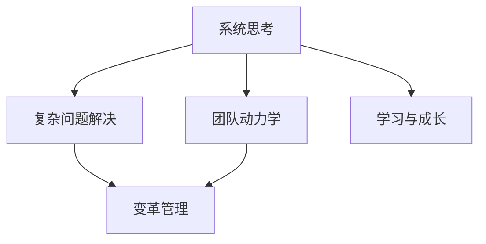

                 

# 管理者修炼手册:思维、行动与学习

> 关键词：管理者,领导力,团队管理,决策,变革管理,学习与成长

## 1. 背景介绍

在当今这个快速变化的时代，管理者在企业中的角色变得更加复杂和多样化。传统的管理理论和方法已经难以应对新的挑战和机遇。因此，管理者需要不断学习和适应，提升自身能力，以引领团队和组织走向成功。《管理者修炼手册:思维、行动与学习》将深入探讨管理者在思维、行动和学习的各个方面应如何修炼，以提高管理效能和组织绩效。

### 1.1 问题由来

现代企业的管理者面临着前所未有的挑战。新技术、新市场、新客户的需求不断涌现，外部环境的不确定性也日益增加。管理者需要具备更强的适应能力、创新能力和跨界合作能力。然而，现有的管理理论和实践往往停留在20世纪的管理范式上，无法有效应对这些新变化。

### 1.2 问题核心关键点

管理者的核心职责在于指导、激励和协调团队，实现组织目标。但如何有效地进行这些职责，需要管理者具备一系列的软技能和硬技能。以下几方面是管理者需要特别关注的核心关键点：

- 思维模式：管理者需要具备系统思考和复杂问题解决的能力。
- 决策能力：如何在复杂多变的环境中做出高效且合理的决策。
- 团队管理：如何激发团队潜能，提升团队绩效。
- 变革管理：如何在组织中进行有效的变革，推动组织发展。
- 学习与成长：如何在个人和组织层面进行持续学习，适应新环境。

## 2. 核心概念与联系

### 2.1 核心概念概述

为更好地理解管理者修炼的各个方面，本节将介绍几个密切相关的核心概念：

- 系统思考(Systems Thinking)：一种全面、动态地看待系统内部及系统间关系的方法，强调系统各要素之间的相互依赖和整体效应。
- 复杂问题解决(Complex Problem Solving)：通过系统分析和协同工作，找到复杂问题的最佳解决方案。
- 团队动力学(Team Dynamics)：研究团队成员之间的相互作用及其对团队绩效的影响。
- 变革管理(Change Management)：指导组织从当前状态到目标状态的转型过程，包括变革规划、执行和评估。
- 学习与成长(Learning and Growth)：通过反思、学习和实践，管理者不断提升自身能力和组织绩效。

这些核心概念之间的逻辑关系可以通过以下Mermaid流程图来展示：



这个流程图展示了一系列核心概念及其之间的关系：

1. 系统思考是理解复杂系统的基础。
2. 复杂问题解决在系统思考的基础上，寻找系统最佳解决方案。
3. 团队动力学关注团队成员的互动及其对团队的影响。
4. 变革管理通过协同工作和系统思考，推动组织转型。
5. 学习与成长是个持续的过程，贯穿于管理者的整个职业生涯。

## 3. 核心算法原理 & 具体操作步骤

### 3.1 算法原理概述

管理者的修炼需要围绕其核心职责，系统地提升思维、行动和学习能力。以下是一些核心算法原理：

- **系统思考**：通过构建系统模型，识别系统各要素及其相互关系，理解系统行为和动态。
- **复杂问题解决**：利用系统分析方法和协同工作，识别问题本质，找到最优解决方案。
- **团队动力学**：通过团队角色分析、团队建设、沟通协调等手段，提升团队协作和绩效。
- **变革管理**：通过变革评估、变革规划、变革执行等步骤，推动组织转型和创新。
- **学习与成长**：通过反思、学习和实践，持续提升自身能力和组织绩效。

### 3.2 算法步骤详解

基于上述核心算法原理，管理者修炼的基本步骤包括：

1. **识别与定义问题**：通过系统思考和数据收集，准确识别和定义管理问题。
2. **设计解决方案**：运用复杂问题解决方法和团队协作，设计解决方案。
3. **执行与实施**：通过变革管理技巧，实施解决方案，推动组织变革。
4. **持续学习与改进**：通过学习与成长，反思执行效果，不断改进管理方法。

### 3.3 算法优缺点

管理者修炼的算法具有以下优点：

- **系统性**：通过系统思考和复杂问题解决，全面、动态地分析和管理问题。
- **协同性**：通过团队协作和变革管理，调动各方资源，实现管理目标。
- **持续性**：通过学习与成长，管理者不断提升自身能力，适应新环境。

同时，该方法也存在一定的局限性：

- **复杂度**：系统思考和复杂问题解决要求较高的分析能力，对管理者的要求较高。
- **成本**：变革管理通常需要较大的人力和时间投入，成本较高。
- **不确定性**：变革过程中，不确定性和风险因素较多，难以完全预测。

### 3.4 算法应用领域

管理者修炼的算法适用于各种组织环境和管理任务。例如：

- 企业战略规划：通过系统思考和复杂问题解决，制定企业发展战略。
- 项目管理：运用变革管理技巧，推动项目按时按质完成。
- 人才管理：通过团队动力学，培养和激励优秀人才。
- 组织文化建设：通过学习与成长，塑造积极向上的组织文化。

## 4. 数学模型和公式 & 详细讲解 & 举例说明

### 4.1 数学模型构建

为了更好地进行管理者修炼，本节将使用数学模型来描述和分析管理问题的解决过程。

假设管理者面临的问题为 $P$，涉及的系统要素为 $S=\{s_1, s_2, ..., s_n\}$，其中 $s_i$ 表示第 $i$ 个要素。系统的状态为 $X$，动态关系为 $F(X)$。目标为 $G(X)$，即系统理想状态。

管理者需要识别系统要素间的关联 $R=\{r_1, r_2, ..., r_m\}$，并理解系统的整体动态。通过构建系统模型 $M(X)$，描述系统的结构和动态关系。最终目标是找到最优解 $X^*$，满足 $G(X^*)$。

### 4.2 公式推导过程

以下以一个简单的系统为例，推导求解最优解的数学公式。

假设系统要素为两个变量 $x$ 和 $y$，动态关系为 $F(x,y) = (x, 2y)$。目标为 $G(x,y) = x + y$。

构建系统模型 $M(x,y)$，其中 $x$ 和 $y$ 的动态关系为 $F(x,y) = (x, 2y)$，即 $x$ 增加 $x$，$y$ 增加 $2y$。系统状态变化为 $X_{t+1} = (x_{t+1}, y_{t+1}) = (x_t, 2y_t)$。

通过迭代法，可以求解系统的最优解。假设初始状态为 $X_0 = (x_0, y_0)$，经过 $k$ 次迭代后，系统状态变为 $X_k = (x_k, y_k)$。

迭代公式为：
$$
x_{k+1} = x_k + x_k
$$
$$
y_{k+1} = 2y_k
$$

假设迭代到 $k$ 次时，达到目标状态 $G(x_k, y_k) = x_k + y_k$。

### 4.3 案例分析与讲解

假设一个企业的战略目标是增加市场份额。管理团队通过系统思考，识别了影响市场份额的主要要素：广告投入、产品创新、客户满意度、竞争对手策略等。

构建系统模型，描述各要素间的动态关系。通过复杂问题解决，设计了一套综合方案，包括增加广告投入、提升产品创新速度、改善客户服务体验、分析竞争对手策略等。

执行方案后，通过变革管理，推动组织实施。最终，通过持续学习与改进，评估方案效果，进行微调，实现了市场份额的显著提升。

## 5. 项目实践：代码实例和详细解释说明

### 5.1 开发环境搭建

在进行管理者修炼的实践前，我们需要准备好开发环境。以下是使用Python进行数据分析的开发环境配置流程：

1. 安装Anaconda：从官网下载并安装Anaconda，用于创建独立的Python环境。

2. 创建并激活虚拟环境：
```bash
conda create -n manager-env python=3.8 
conda activate manager-env
```

3. 安装必要的Python库：
```bash
pip install pandas numpy matplotlib scikit-learn
```

4. 安装Jupyter Notebook：
```bash
conda install jupyterlab
```

5. 安装Jupyter Notebook插件：
```bash
conda install ipywidgets
```

完成上述步骤后，即可在`manager-env`环境中开始管理者修炼的实践。

### 5.2 源代码详细实现

下面以一个简单的管理者修炼项目为例，展示如何通过数据分析和建模来解决实际问题。

假设管理团队需要评估员工绩效，构建了以下系统模型：

- 输入：员工工作时间、任务完成度、创新成果。
- 输出：员工绩效。
- 动态关系：工作时间与任务完成度呈正相关，创新成果与任务完成度呈正相关。
- 目标：最大化员工绩效。

使用Sympy库进行数学建模：

```python
from sympy import symbols, Eq, solve

# 定义变量
x, y, z = symbols('x y z')

# 建立方程
eq1 = Eq(x, 2*y)  # 工作时间与任务完成度
eq2 = Eq(z, 2*y)  # 创新成果与任务完成度

# 求解方程
sol = solve([eq1, eq2], (x, z))
```

通过解方程，可以计算出员工绩效与任务完成度之间的关系。进一步分析，可以提出提升员工绩效的解决方案。

### 5.3 代码解读与分析

让我们再详细解读一下关键代码的实现细节：

**变量定义**：
- `x`、`y`、`z` 分别代表工作时间、任务完成度、创新成果。

**方程建立**：
- `eq1` 和 `eq2` 分别表示工作时间与任务完成度、创新成果与任务完成度之间的关系。

**方程求解**：
- `solve` 函数用于解方程组，得到员工绩效与任务完成度之间的关系。

**结果输出**：
- `sol` 包含了员工绩效与任务完成度之间的关系，即 `x=2y` 和 `z=2y`。

通过这个简单的例子，我们可以看到如何利用数学模型和编程工具来分析和解决管理问题。

## 6. 实际应用场景

### 6.1 企业战略规划

管理者可以通过系统思考和复杂问题解决，制定企业发展战略。构建系统模型，分析各要素间的关系，制定综合性的战略方案。

### 6.2 项目管理

运用变革管理技巧，推动项目按时按质完成。通过系统分析，识别项目中的关键环节，制定详细的执行计划，并及时调整应对变化。

### 6.3 人才管理

通过团队动力学，培养和激励优秀人才。识别团队成员的优势和不足，通过个性化培训和激励措施，提升团队整体绩效。

### 6.4 组织文化建设

通过学习与成长，塑造积极向上的组织文化。定期进行员工满意度调查，建立反馈机制，不断改进组织文化。

## 7. 工具和资源推荐

### 7.1 学习资源推荐

为了帮助管理者全面提升自身能力，以下是一些优质的学习资源：

1. **《管理学原理》(原书第13版) - 斯蒂芬·P·罗宾斯**：系统介绍管理学的基本概念和理论，是管理者的必读书籍。

2. **《领导力21法则》 - 约翰·C·马克斯威尔**：通过21条法则，提升领导力水平，实现个人和组织目标。

3. **《变革管理》 - 约翰·库马克**：深入探讨变革管理的各个方面，提供实用的工具和方法。

4. **《复杂系统》 - 斯特凡·哈克**：全面介绍复杂系统的基本理论和分析方法，提升系统思考能力。

5. **Coursera - 管理课程**：提供系统、全面的管理学习课程，涵盖各管理领域。

通过这些资源的学习，管理者可以系统地提升自己的管理能力，更好地应对复杂多变的管理挑战。

### 7.2 开发工具推荐

高效的开发离不开优秀的工具支持。以下是几款用于管理者修炼的开发工具：

1. **Jupyter Notebook**：强大的数据可视化工具，支持多种编程语言，方便进行数据分析和建模。

2. **Tableau**：数据可视化工具，支持复杂数据处理和可视化，提升数据分析效率。

3. **GitLab**：项目管理工具，支持团队协作和代码版本控制，便于团队管理。

4. **Slack**：沟通协作工具，提升团队沟通效率，构建高效的沟通机制。

5. **Google Drive**：云存储和协作工具，方便数据共享和团队协作。

合理利用这些工具，可以显著提升管理者修炼的效率，促进个人和团队的共同成长。

### 7.3 相关论文推荐

管理者的修炼源于学界的持续研究。以下是几篇奠基性的相关论文，推荐阅读：

1. **《管理的科学与艺术》 - 亨利·法约尔**：经典管理学著作，阐述管理的科学和艺术。

2. **《系统动力学》 - 杰弗里·R·钱德勒**：全面介绍系统动力学的基本理论和应用方法，提升系统思考能力。

3. **《复杂问题解决》 - 约翰·K·加尔布雷思**：探讨复杂问题解决的科学方法和实际案例，提升问题解决能力。

4. **《组织行为学》 - 斯蒂芬·P·罗宾斯**：系统介绍组织行为学的基本理论和应用方法，提升团队管理能力。

5. **《变革管理：实现战略转变》 - 约翰·库马克**：深入探讨变革管理的各个方面，提供实用的工具和方法。

这些论文代表了大语言模型微调技术的发展脉络。通过学习这些前沿成果，可以帮助管理者把握学科前进方向，激发更多的创新灵感。

## 8. 总结：未来发展趋势与挑战

### 8.1 总结

本文对管理者在思维、行动和学习的各个方面进行了全面系统的介绍。首先阐述了管理者修炼的背景和意义，明确了管理者在思维、决策、团队管理、变革管理、学习与成长等方面应如何修炼，以提高管理效能和组织绩效。

通过本文的系统梳理，可以看到，管理者修炼是一个全面、系统、持续的过程，需要管理者不断学习和实践。管理者的修炼不仅提升了自身的管理能力，也为组织的发展带来了显著的效益。

### 8.2 未来发展趋势

展望未来，管理者修炼将呈现以下几个发展趋势：

1. **数字化转型**：管理者需要具备数字化思维和能力，运用大数据和人工智能技术，提升管理效率和决策质量。

2. **全球化视野**：在全球化背景下，管理者需要具备跨文化管理能力和全球视角，应对国际市场和团队的多样性。

3. **可持续发展**：管理者需要关注社会和环境责任，推动组织的可持续发展，实现经济效益与社会效益的双赢。

4. **创新能力**：管理者需要具备创新思维和能力，推动组织不断创新，保持竞争力。

5. **数据驱动决策**：管理者需要掌握数据驱动决策的方法，利用数据和分析工具，提升决策的科学性和准确性。

6. **个人品牌建设**：管理者需要通过个人品牌建设，提升个人影响力和组织形象，增强领导力和影响力。

以上趋势凸显了管理者修炼的方向和要求，管理者需要不断学习新知识，提升新技能，适应新环境，才能在未来市场中占据优势。

### 8.3 面临的挑战

尽管管理者修炼在实践中取得了显著成效，但在迈向更加智能化、普适化应用的过程中，仍面临诸多挑战：

1. **时间管理**：管理者需要在繁忙的工作中，合理安排时间，进行持续学习和修炼。

2. **组织支持**：管理者需要获得组织支持，进行相应的培训和资源配置，才能顺利推进修炼计划。

3. **知识更新**：管理环境不断变化，管理者需要不断更新知识，适应新情况。

4. **心理压力**：高强度的管理任务和压力，可能影响管理者的学习和修炼效果。

5. **文化差异**：不同文化背景的管理者，可能存在差异化的修炼路径和方法。

6. **资源限制**：缺乏资源和工具，可能影响管理者的学习和实践。

正视这些挑战，积极应对并寻求突破，将是大语言模型微调走向成熟的必由之路。相信随着学界和产业界的共同努力，这些挑战终将一一被克服，管理者修炼必将在构建人机协同的智能时代中扮演越来越重要的角色。

### 8.4 研究展望

面对管理者修炼所面临的种种挑战，未来的研究需要在以下几个方面寻求新的突破：

1. **数字化管理工具**：开发更加智能化、高效的管理工具，提升管理效率和决策质量。

2. **跨文化管理研究**：深入研究跨文化管理的方法和工具，提升管理者的全球化视野和能力。

3. **可持续发展管理**：研究如何在管理中实现经济效益与社会效益的双赢，推动组织的可持续发展。

4. **创新管理方法**：探索更多创新的管理方法和工具，提升管理者的创新能力和组织创新水平。

5. **数据驱动管理**：深入研究数据驱动管理的方法和工具，提升管理的科学性和准确性。

6. **个人品牌建设**：研究如何通过个人品牌建设，提升管理者的影响力和组织形象。

这些研究方向的探索，必将引领管理者修炼技术迈向更高的台阶，为构建安全、可靠、可解释、可控的智能系统铺平道路。面向未来，管理者修炼技术还需要与其他人工智能技术进行更深入的融合，如知识表示、因果推理、强化学习等，多路径协同发力，共同推动自然语言理解和智能交互系统的进步。只有勇于创新、敢于突破，才能不断拓展管理者的边界，让智能技术更好地造福人类社会。

## 9. 附录：常见问题与解答

**Q1：管理者如何平衡工作与学习？**

A: 管理者需要在繁忙的工作中，合理安排时间，进行持续学习和修炼。可以制定详细的学习计划，利用碎片时间进行学习，如阅读书籍、参加培训、参与讨论等。同时，管理者还需要获得组织的支持，提供相应的学习资源和激励措施。

**Q2：管理者如何进行系统思考？**

A: 系统思考要求管理者全面、动态地看待系统内部及系统间关系，理解系统行为和动态。可以通过构建系统模型，分析各要素间的关系，找出系统的关键要素和动态关系。同时，管理者需要培养系统思考的习惯，不断反思和总结，提升系统思考能力。

**Q3：管理者如何进行复杂问题解决？**

A: 复杂问题解决要求管理者通过系统分析和协同工作，找到复杂问题的最佳解决方案。可以运用系统分析方法和团队协作，识别问题本质，设计解决方案，并进行试点验证和优化。同时，管理者需要具备创新思维和问题解决能力，不断提升复杂问题解决的能力。

**Q4：管理者如何进行团队管理？**

A: 团队管理要求管理者通过团队角色分析、团队建设、沟通协调等手段，提升团队协作和绩效。可以识别团队成员的优势和不足，通过个性化培训和激励措施，提升团队整体绩效。同时，管理者需要具备沟通能力和协调能力，建立高效的团队沟通机制。

**Q5：管理者如何进行变革管理？**

A: 变革管理要求管理者通过变革评估、变革规划、变革执行等步骤，推动组织转型和创新。可以制定详细的变革计划，明确变革目标和步骤，进行变革试点和优化。同时，管理者需要具备变革管理的能力，应对变革中的各种挑战和风险。

这些问题的解答，可以帮助管理者更好地理解和管理修炼的方法和技巧，提升管理能力和组织绩效。

---

作者：禅与计算机程序设计艺术 / Zen and the Art of Computer Programming

