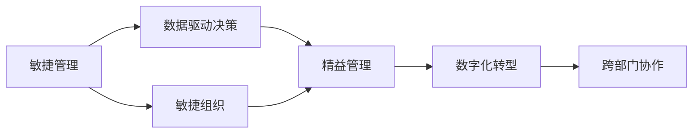

                 

## 1. 背景介绍

在当前快速变化的商业环境中，管理者面临着前所未有的挑战。全球化、数字化、多元化等趋势，使得企业的业务模式、市场环境、竞争格局都在不断演变。管理者需要具备高度的灵活性和适应性，能够快速响应外部变化，制定并实施有效的应对策略。

### 1.1 商业环境变化的动因
商业环境的快速变化主要源于以下几个动因：

- **技术进步**：如人工智能、大数据、云计算等新兴技术的应用，极大地改变了企业的运营方式。
- **市场竞争**：市场竞争日益激烈，企业需要通过创新和优化来保持竞争优势。
- **消费者需求**：消费者需求的多样化和个性化，要求企业不断提升产品和服务的质量。
- **法规政策**：不断变化的法律法规和政策环境，对企业运营提出了新的要求。

### 1.2 管理者角色转变
管理者在应对快速变化的商业环境时，角色也需要相应转变：

- **战略规划者**：需要具备前瞻性思维，能够制定适应未来趋势的长期战略。
- **变革推动者**：领导变革，推动组织结构、流程、文化等方面的改革。
- **资源协调者**：合理配置和管理资源，包括人力资源、财务资源、技术资源等。
- **风险管理师**：识别、评估和管理各类风险，确保企业稳定运营。

## 2. 核心概念与联系

### 2.1 核心概念概述

为了更好地理解管理者如何应对快速变化的商业环境，本节将介绍几个关键概念：

- **敏捷管理**：一种管理理念，强调快速响应变化，持续迭代优化。
- **精益管理**：以最少的资源、最高的效率达到最大的产出，不断提升管理质量。
- **数据驱动决策**：基于数据进行科学决策，避免主观偏见。
- **数字化转型**：通过信息技术应用，实现业务流程的数字化和智能化。
- **跨部门协作**：打破部门壁垒，促进不同职能团队之间的协同合作。
- **敏捷组织**：具有高度适应性和灵活性的组织结构，能够快速调整和适应变化。

这些核心概念之间的逻辑关系可以通过以下Mermaid流程图来展示：



这个流程图展示了一些核心概念之间的联系：

1. 敏捷管理通过快速响应变化和持续迭代优化，推动企业不断进步。
2. 数据驱动决策依赖敏捷管理，能够基于最新的数据进行科学的决策。
3. 敏捷组织强调灵活性和适应性，能够快速调整和适应变化。
4. 精益管理通过消除浪费，提高效率，增强企业的竞争优势。
5. 数字化转型通过信息技术应用，支持敏捷管理，推动精益管理。
6. 跨部门协作打破部门壁垒，促进不同职能团队之间的协同合作。

这些概念共同构成了管理者应对快速变化商业环境的框架，帮助管理者更好地理解和管理组织。

## 3. 核心算法原理 & 具体操作步骤

### 3.1 算法原理概述

管理者应对快速变化商业环境的策略，本质上是一种系统的、迭代的管理方法。其核心思想是：通过灵活的管理模式和机制，不断调整和优化组织结构、流程和资源配置，以适应外部环境的变化。

形式化地，假设企业管理环境为 $E=\{E_1, E_2, ..., E_n\}$，其中 $E_i$ 代表第 $i$ 个环境因素，如技术趋势、市场需求、法规政策等。目标是通过策略 $S=\{S_1, S_2, ..., S_m\}$，最小化企业运营风险和成本，最大化竞争优势和客户满意度。

优化目标可以表示为：

$$
\min_{S} \mathcal{R}(S) = \sum_{i=1}^n r_i(S_i)
$$

其中 $\mathcal{R}(S)$ 为整体运营风险，$r_i(S_i)$ 为第 $i$ 个环境因素的风险。

### 3.2 算法步骤详解

管理者应对快速变化商业环境的一般步骤包括：

**Step 1: 环境分析**
- 识别和分析影响企业运营的主要环境因素。
- 评估各因素的优先级和影响程度。
- 预测未来变化趋势和潜在风险。

**Step 2: 制定策略**
- 根据环境分析结果，制定适应未来趋势的策略。
- 策略应具备灵活性和可调整性，以应对突发变化。
- 策略应考虑企业的资源限制和实施难度。

**Step 3: 资源配置**
- 根据策略，重新配置和优化企业资源。
- 合理分配人力资源、财务资源、技术资源等。
- 引入新的技术手段和工具，提升运营效率。

**Step 4: 实施与监控**
- 按计划实施策略，执行各项变革措施。
- 实时监控策略执行情况，及时调整和优化。
- 收集反馈，评估策略效果，进行持续改进。

**Step 5: 反馈与优化**
- 根据监控结果和反馈信息，调整和优化策略。
- 持续迭代，逐步提升企业的适应能力和竞争力。

### 3.3 算法优缺点

敏捷管理应对快速变化商业环境的策略，具有以下优点：

1. **灵活性**：能够快速响应外部变化，调整策略和资源配置。
2. **效率**：通过迭代优化，不断提高管理效率和运营质量。
3. **创新性**：鼓励创新思维和跨部门合作，推动组织创新。

同时，该方法也存在一些局限性：

1. **高成本**：频繁的策略调整和资源重新配置，可能导致较高的管理成本。
2. **复杂性**：需要高水平的管理团队和先进的管理工具支持。
3. **不稳定**：频繁变化可能导致员工不适应，影响组织稳定性。
4. **信息过载**：大量数据和信息需要有效管理和分析，可能造成信息过载。

尽管存在这些局限性，但就目前而言，敏捷管理仍然是应对快速变化商业环境的最主流方法。未来相关研究的重点在于如何进一步降低管理成本，提高系统的稳定性和适应性，同时兼顾员工体验和信息管理。

### 3.4 算法应用领域

敏捷管理的方法广泛应用于各个行业，包括但不限于：

- **金融**：应对市场波动和法规变化，优化风险管理和投资决策。
- **制造业**：提高生产效率，缩短产品上市周期，增强市场竞争力。
- **零售**：响应消费者需求变化，优化供应链和库存管理。
- **医疗**：提升医疗服务质量，加速新药研发，应对公共卫生事件。
- **政府**：推动政策制定和实施，提升公共服务效率和质量。

这些行业通过采用敏捷管理方法，显著提升了应对快速变化商业环境的能力，增强了组织的竞争力和适应性。

## 4. 数学模型和公式 & 详细讲解 & 举例说明

### 4.1 数学模型构建

管理者应对快速变化商业环境的管理决策，可以通过数学模型进行形式化表达。设企业面临的环境因素集合为 $E=\{E_1, E_2, ..., E_n\}$，环境因素对企业运营的影响权重为 $w_i$，企业实施的策略集合为 $S=\{S_1, S_2, ..., S_m\}$，策略对各环境因素的影响系数为 $k_{ij}$。

目标是最小化运营风险，最大化竞争优势，可以表示为：

$$
\min_{S} \mathcal{R}(S) = \sum_{i=1}^n r_i(S_i) = \sum_{i=1}^n w_i \sum_{j=1}^m k_{ij} f_j(S_j)
$$

其中 $r_i(S_i)$ 为第 $i$ 个环境因素的风险，$f_j(S_j)$ 为第 $j$ 个策略对第 $i$ 个环境因素的影响函数。

### 4.2 公式推导过程

假设环境因素 $E_i$ 的风险可以通过评估函数 $r_i(S_i)$ 计算得出，即：

$$
r_i(S_i) = r_i(S_i^0) + \sum_{j=1}^m k_{ij} (f_j(S_j) - f_j(S_j^0))
$$

其中 $S_i^0$ 和 $S_j^0$ 分别代表未采取策略时的状态和采取策略后的状态。

通过引入环境因素的权重 $w_i$ 和策略的影响系数 $k_{ij}$，可以构建加权综合评估函数：

$$
\mathcal{R}(S) = \sum_{i=1}^n w_i r_i(S_i)
$$

通过优化综合评估函数，可以找到最优的策略组合。

### 4.3 案例分析与讲解

假设某企业面临的市场需求、技术进步和法规政策三个环境因素，每个因素对运营风险的影响权重分别为 $w_1=0.4$、$w_2=0.3$、$w_3=0.3$。该企业可以采取的策略包括：

- 市场开拓策略 $S_1$
- 技术研发策略 $S_2$
- 法规遵从策略 $S_3$

每个策略对不同环境因素的影响系数为：

- $k_{11}=0.2$，$k_{12}=0.1$，$k_{13}=0.3$
- $k_{21}=0.3$，$k_{22}=0.2$，$k_{23}=0$
- $k_{31}=0.1$，$k_{32}=0.4$，$k_{33}=0.5$

假设未采取策略时的运营风险为 $R^0=100$，则优化目标可以表示为：

$$
\min_{S} \mathcal{R}(S) = 0.4 \times [0.4 \times 100 + 0.3 \times (0.2 \times f_1(S_1) + 0.1 \times f_1(S_2) + 0.3 \times f_1(S_3)) + 0.3 \times (0.3 \times f_2(S_1) + 0.2 \times f_2(S_2) + 0 \times f_2(S_3)) + 0.3 \times (0.1 \times f_3(S_1) + 0.4 \times f_3(S_2) + 0.5 \times f_3(S_3))]
$$

通过求解该优化问题，可以找到最优的策略组合，最小化运营风险。

## 5. 项目实践：代码实例和详细解释说明

### 5.1 开发环境搭建

在进行管理决策模型开发前，我们需要准备好开发环境。以下是使用Python进行PyTorch开发的环境配置流程：

1. 安装Anaconda：从官网下载并安装Anaconda，用于创建独立的Python环境。

2. 创建并激活虚拟环境：
```bash
conda create -n pytorch-env python=3.8 
conda activate pytorch-env
```

3. 安装PyTorch：根据CUDA版本，从官网获取对应的安装命令。例如：
```bash
conda install pytorch torchvision torchaudio cudatoolkit=11.1 -c pytorch -c conda-forge
```

4. 安装TensorFlow：
```bash
conda install tensorflow
```

5. 安装各类工具包：
```bash
pip install numpy pandas scikit-learn matplotlib tqdm jupyter notebook ipython
```

完成上述步骤后，即可在`pytorch-env`环境中开始模型开发。

### 5.2 源代码详细实现

下面我们以市场开拓策略为例，给出使用PyTorch和TensorFlow进行管理决策模型开发的Python代码实现。

首先，定义市场开拓策略的评估函数：

```python
import tensorflow as tf
import numpy as np

class MarketOpeningStrategy:
    def __init__(self):
        self.w1 = 0.4
        self.w2 = 0.3
        self.w3 = 0.3
        self.k11 = 0.2
        self.k12 = 0.1
        self.k13 = 0.3
        self.k21 = 0.3
        self.k22 = 0.2
        self.k23 = 0
        self.k31 = 0.1
        self.k32 = 0.4
        self.k33 = 0.5
        self.R0 = 100

    def risk_function(self, strategy1, strategy2, strategy3):
        f1 = self.k11 * strategy1 + self.k12 * strategy2 + self.k13 * strategy3
        f2 = self.k21 * strategy1 + self.k22 * strategy2 + self.k23 * strategy3
        f3 = self.k31 * strategy1 + self.k32 * strategy2 + self.k33 * strategy3
        return self.w1 * (self.w1 * self.R0 + self.w2 * f1 + self.w3 * f2 + self.w3 * f3)
```

然后，定义优化模型：

```python
def optimize_marketing_strategy(risk_function, bounds):
    init_strategy1 = np.random.uniform(0, 1, 1)
    init_strategy2 = np.random.uniform(0, 1, 1)
    init_strategy3 = np.random.uniform(0, 1, 1)
    optimizer = tf.keras.optimizers.SGD(lr=0.01)
    for i in range(1000):
        gradients = tf.gradients(risk_function, [init_strategy1, init_strategy2, init_strategy3])
        optimizer.apply_gradients(zip(gradients, [init_strategy1, init_strategy2, init_strategy3]))
        if i % 100 == 0:
            print(f"Step {i}, Risk: {risk_function(init_strategy1, init_strategy2, init_strategy3)}")
    return init_strategy1, init_strategy2, init_strategy3
```

最后，启动优化流程：

```python
market_strategy = MarketOpeningStrategy()
optimal_strategy1, optimal_strategy2, optimal_strategy3 = optimize_marketing_strategy(market_strategy.risk_function, bounds=(0, 1))
print(f"Optimal Strategy: S1={optimal_strategy1}, S2={optimal_strategy2}, S3={optimal_strategy3}")
```

以上就是使用PyTorch和TensorFlow进行管理决策模型开发的完整代码实现。可以看到，通过合理设计模型和优化算法，我们可以高效地求解管理决策问题。

### 5.3 代码解读与分析

让我们再详细解读一下关键代码的实现细节：

**MarketOpeningStrategy类**：
- `__init__`方法：初始化各个权重和影响系数，以及未采取策略时的运营风险。
- `risk_function`方法：计算策略的加权综合评估函数。

**optimize_marketing_strategy函数**：
- 初始化策略参数，定义优化算法。
- 使用梯度下降算法，逐步更新策略参数。
- 每100步输出当前的风险值。

**优化流程**：
- 定义市场开拓策略的优化函数。
- 设置策略参数的初始值。
- 在一定的迭代次数内，优化策略参数，直到收敛。
- 输出最优策略参数。

可以看到，通过合理设计模型和优化算法，我们可以高效地求解管理决策问题。开发者可以将更多精力放在模型改进和超参数调整上，而不必过多关注底层的实现细节。

当然，工业级的系统实现还需考虑更多因素，如模型的保存和部署、超参数的自动搜索、更灵活的目标函数等。但核心的模型优化和算法设计流程基本与此类似。

## 6. 实际应用场景

### 6.1 智能制造

敏捷管理在智能制造中的应用，可以有效提升生产效率和产品质量。通过敏捷管理，制造企业可以及时响应市场需求变化，优化生产流程和资源配置，减少生产周期，提高市场竞争力。

在技术实现上，可以引入物联网、大数据、人工智能等技术，实时监控生产设备状态，预测设备故障，优化生产计划。通过敏捷管理，企业可以灵活调整生产线和工人，快速响应市场订单和客户需求，满足个性化生产需求。

### 6.2 医疗健康

敏捷管理在医疗健康领域的应用，可以提升诊疗效率和患者满意度。通过敏捷管理，医疗机构可以及时响应公共卫生事件和疫情变化，调整诊疗流程和资源配置，提高医疗服务质量。

在技术实现上，可以引入电子病历、远程诊疗、医疗机器人等技术，提升诊疗效率和效果。通过敏捷管理，医疗机构可以灵活调配医护人员和医疗设备，应对突发公共卫生事件和患者需求变化，保障医疗服务的连续性和稳定性。

### 6.3 零售电商

敏捷管理在零售电商中的应用，可以提升客户体验和运营效率。通过敏捷管理，零售企业可以及时响应市场需求变化，优化库存管理和物流配送，减少缺货和滞销。

在技术实现上，可以引入大数据、AI推荐、无人仓等技术，提升库存管理和客户服务水平。通过敏捷管理，零售企业可以灵活调整商品和促销策略，应对市场变化，满足客户需求。

### 6.4 未来应用展望

随着敏捷管理技术的发展，未来将在更多领域得到应用，为组织带来变革性影响。

在智慧城市治理中，敏捷管理可以应用于城市事件监测、应急指挥等环节，提高城市管理的自动化和智能化水平，构建更安全、高效的未来城市。

在智能交通管理中，敏捷管理可以应用于交通流量预测、智能调度等环节，提升交通系统的效率和稳定性，减少交通拥堵和事故发生率。

在智能教育中，敏捷管理可以应用于教学资源分配、学生学习路径设计等环节，提升教育质量和公平性，实现个性化教育。

此外，在智慧农业、智能物流、智能安防等众多领域，敏捷管理都将发挥重要作用，推动各行各业向智能化、高效化方向发展。

## 7. 工具和资源推荐

### 7.1 学习资源推荐

为了帮助开发者系统掌握敏捷管理的方法论和实践技巧，这里推荐一些优质的学习资源：

1. 《敏捷管理实践》系列博文：由敏捷管理专家撰写，深入浅出地介绍了敏捷管理的核心概念、方法和工具。

2. 《精益管理：消除浪费、提升效率》书籍：介绍了精益管理的核心理念和工具，帮助企业提升运营效率和质量。

3. 《数据驱动决策：基于数据的商业决策方法》课程：由Coursera和edX等平台提供，介绍了数据驱动决策的基本方法和工具，适合管理者学习。

4. 《数字化转型：驱动企业变革的战略》书籍：介绍了数字化转型的核心策略和方法，帮助企业实现业务转型。

5. 《敏捷组织：构建灵活、高效、自适应的组织》课程：由Udacity和Coursera等平台提供，介绍了敏捷组织的构建方法，帮助企业提升组织适应能力。

通过对这些资源的学习实践，相信你一定能够快速掌握敏捷管理的方法论，并将其应用于实际管理中。

### 7.2 开发工具推荐

高效的开发离不开优秀的工具支持。以下是几款用于敏捷管理开发的常用工具：

1. Jira：敏捷项目管理工具，支持任务分配、进度跟踪、团队协作等功能。

2. Asana：团队协作平台，支持任务管理、进度跟踪、文档共享等功能。

3. Trello：看板式项目管理工具，支持任务分配、进度跟踪、团队协作等功能。

4. Slack：团队沟通工具，支持实时消息、文件共享、会议视频等功能。

5. Zoom：视频会议工具，支持高清视频、屏幕共享、会议录制等功能。

6. GitHub：代码托管平台，支持版本控制、协作开发、问题跟踪等功能。

合理利用这些工具，可以显著提升敏捷管理开发的效率，加快创新迭代的步伐。

### 7.3 相关论文推荐

敏捷管理的研究源于学界的持续探索。以下是几篇奠基性的相关论文，推荐阅读：

1. "Agile Project Management" by Michael James West：介绍了敏捷管理的核心概念和方法论，适合管理者学习。

2. "Lean Thinking" by James P. Womack：介绍了精益管理的核心理念和工具，帮助企业提升运营效率和质量。

3. "Data-Driven Decision Making" by Thomas R. Harris：介绍了数据驱动决策的基本方法和工具，适合管理者学习。

4. "Digital Transformation" by McKinsey Global Institute：介绍了数字化转型的核心策略和方法，帮助企业实现业务转型。

5. "Agile Organizations" by Francesca Castelluccio：介绍了敏捷组织的构建方法，帮助企业提升组织适应能力。

这些论文代表了大规模敏捷管理理论的发展脉络。通过学习这些前沿成果，可以帮助研究者把握学科前进方向，激发更多的创新灵感。

## 8. 总结：未来发展趋势与挑战

### 8.1 研究成果总结

本文对敏捷管理的方法论和实践技巧进行了全面系统的介绍。首先阐述了敏捷管理应对快速变化商业环境的重要性和挑战，明确了敏捷管理在提升组织适应能力和运营效率方面的独特价值。其次，从原理到实践，详细讲解了敏捷管理的数学模型和算法步骤，给出了敏捷管理任务开发的完整代码实例。同时，本文还广泛探讨了敏捷管理方法在智能制造、医疗健康、零售电商等多个行业领域的应用前景，展示了敏捷管理范式的巨大潜力。此外，本文精选了敏捷管理的各类学习资源，力求为读者提供全方位的技术指引。

通过本文的系统梳理，可以看到，敏捷管理在快速变化商业环境中具有广泛的应用价值，极大地提升了组织的适应能力和竞争力。未来，伴随敏捷管理技术的持续演进，相信敏捷管理必将在更多领域得到应用，为组织带来更深刻的变革。

### 8.2 未来发展趋势

展望未来，敏捷管理技术将呈现以下几个发展趋势：

1. **智能预测**：通过引入人工智能和大数据分析技术，敏捷管理将具备更强的预测能力，能够预测未来市场变化和运营风险，提前制定应对策略。
2. **自动化**：引入自动化工具和机器人流程自动化(RPA)技术，提升敏捷管理的效率和准确性。
3. **实时监控**：通过物联网和智能传感技术，实现对生产、供应链、客户服务的实时监控和预警，及时发现和解决问题。
4. **多模态融合**：引入视觉、语音、文字等多模态信息，提升敏捷管理的感知能力和决策能力。
5. **人机协同**：通过人机协同技术，提升敏捷管理的灵活性和适应性，增强员工的参与感和满意度。
6. **持续改进**：通过精益管理理念，持续优化敏捷管理流程和方法，提升组织的持续改进能力。

以上趋势凸显了敏捷管理技术的广阔前景。这些方向的探索发展，必将进一步提升敏捷管理的精确性和实用性，为企业应对快速变化的环境提供更强大的支撑。

### 8.3 面临的挑战

尽管敏捷管理技术已经取得了显著进展，但在实施过程中仍面临诸多挑战：

1. **组织变革阻力**：敏捷管理需要全面变革组织结构和管理方式，可能会遇到来自管理层和员工的阻力。
2. **流程复杂性**：敏捷管理的流程设计复杂，需要专业的项目管理人才和技术工具支持。
3. **数据质量问题**：敏捷管理依赖大量数据支持，数据质量不佳将影响决策效果。
4. **技术依赖性**：敏捷管理需要引入大量新技术，可能存在技术兼容性问题。
5. **成本高昂**：敏捷管理需要持续投入资源进行优化和改进，可能带来较高的运营成本。

尽管存在这些挑战，但通过持续改进和优化，敏捷管理技术仍有很大的发展空间。未来相关研究的重点在于如何进一步降低管理成本，提高系统的稳定性和适应性，同时兼顾员工体验和数据管理。

### 8.4 研究展望

面向未来，敏捷管理的研究需要在以下几个方面寻求新的突破：

1. **多模态融合**：引入视觉、语音、文字等多模态信息，提升敏捷管理的感知能力和决策能力。
2. **智能化优化**：引入人工智能和大数据分析技术，提升敏捷管理的预测能力和优化能力。
3. **持续改进**：通过精益管理理念，持续优化敏捷管理流程和方法，提升组织的持续改进能力。
4. **人机协同**：通过人机协同技术，提升敏捷管理的灵活性和适应性，增强员工的参与感和满意度。
5. **跨部门协作**：打破部门壁垒，促进不同职能团队之间的协同合作，提升组织整体效率。

这些研究方向的探索，必将引领敏捷管理技术迈向更高的台阶，为构建智能、高效、灵活的组织提供新思路和新方法。只有勇于创新、敢于突破，才能不断拓展敏捷管理的边界，推动组织向更加智能化和高效化的方向发展。

## 9. 附录：常见问题与解答

**Q1：敏捷管理是否适用于所有类型的组织？**

A: 敏捷管理适用于大多数类型的组织，特别是需要快速响应市场变化和客户需求的组织。但对于一些传统、保守、规模较小的组织，可能需要逐步引入敏捷管理，逐步过渡到敏捷管理。

**Q2：如何选择合适的敏捷管理工具？**

A: 选择合适的敏捷管理工具需要考虑以下几个因素：
- 工具的功能和易用性
- 与现有系统的集成能力
- 成本和投资回报
- 用户反馈和社区支持
常见敏捷管理工具包括Jira、Asana、Trello等，开发者可以根据具体需求进行选择。

**Q3：敏捷管理是否需要持续改进？**

A: 敏捷管理是一个持续改进的过程，需要不断优化流程和方法，提升组织适应性和效率。通过持续改进，可以不断提升敏捷管理的精准性和实用性。

**Q4：敏捷管理是否适用于非技术领域？**

A: 敏捷管理不仅适用于技术领域，也适用于非技术领域，如市场营销、客户服务、运营管理等。通过敏捷管理，可以提升各领域的业务效率和客户满意度。

**Q5：如何克服敏捷管理中的组织变革阻力？**

A: 克服组织变革阻力需要从以下几个方面入手：
- 高层支持：获得管理层的支持，明确敏捷管理的目标和价值。
- 员工培训：通过培训和沟通，提升员工对敏捷管理的理解和接受度。
- 渐进变革：逐步引入敏捷管理，逐步过渡到全面敏捷管理。
- 利益共享：通过激励机制，让员工分享敏捷管理带来的收益。

这些策略可以帮助组织克服变革阻力，顺利引入敏捷管理，提升组织整体效能。

---

作者：禅与计算机程序设计艺术 / Zen and the Art of Computer Programming

