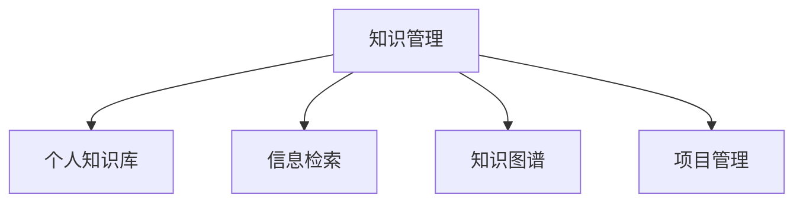

                 

# 管理者如何建立个人知识管理系统

> 关键词：知识管理,个人知识库,信息检索,知识图谱,项目管理

## 1. 背景介绍

### 1.1 问题由来

在数字化时代的今天，信息爆炸和知识碎片化的问题愈发严重，管理者面临如何在海量信息中筛选和利用有效知识的问题。尤其在企业规模扩大和复杂性增加的背景下，传统的知识管理方式已经无法满足需求。而知识管理系统的出现，为管理者提供了高效的知识获取和利用手段，帮助他们在复杂多变的环境中做出更好决策。

### 1.2 问题核心关键点

知识管理系统的核心目标是提高知识在组织内的传播和利用效率，帮助管理者在实际工作中快速找到所需信息，提升决策效率。其关键在于：

1. 建立全面的知识仓库，覆盖企业运营管理的各个领域。
2. 设计高效的信息检索机制，便于用户快速定位所需知识。
3. 支持知识图谱构建，使知识之间的关系更加直观和易于理解。
4. 具备智能推荐和个性化学习功能，根据用户行为提供定制化知识服务。
5. 集成项目管理工具，将知识与任务管理和流程优化相结合。
6. 确保知识系统的可扩展性，适应企业未来发展变化。

## 2. 核心概念与联系

### 2.1 核心概念概述

为更好地理解知识管理系统的构建，本节将介绍几个密切相关的核心概念：

- **知识管理(Knowledge Management, KM)**：通过计划、制定、实施、控制和评估来使组织中的知识被那些创新者捕获、整理、共享、使用并转换为对实现组织战略有价值的智能。

- **个人知识库(Individual Knowledge Base, IKB)**：个人知识管理的核心，即通过软件工具记录、存储和管理个人所掌握的知识和经验，使其易于访问和复用。

- **信息检索(Information Retrieval, IR)**：从大量文本数据中自动提取相关信息并返回给用户的技术，是知识管理系统信息管理的关键。

- **知识图谱(Knowledge Graph)**：通过实体关系模型描述知识库，使知识之间的关系更加直观和易于理解。

- **项目管理(Project Management)**：指规划、执行、监督、控制和完成项目各阶段的过程和方法，知识管理系统可集成项目管理工具，优化知识与流程的结合。

这些核心概念之间的逻辑关系可以通过以下Mermaid流程图来展示：



这个流程图展示了这个核心概念的关联关系：知识管理系统的核心在于个人知识库，而信息检索、知识图谱和项目管理则是支撑个人知识库高效利用和知识共享的框架。

## 3. 核心算法原理 & 具体操作步骤

### 3.1 算法原理概述

知识管理系统的算法原理基于信息检索和知识抽取技术，通过结构化或半结构化数据来组织和检索信息。其核心步骤包括：

1. **数据采集**：从企业内部系统、文档、邮件、社交平台等多个渠道收集知识。
2. **数据清洗与预处理**：对采集到的数据进行去重、纠错、格式转换等处理，为后续的检索和分析做准备。
3. **信息检索**：通过自然语言处理、实体识别等技术，将查询转化为对数据库的检索请求，返回相关结果。
4. **知识抽取与建模**：利用语义分析、知识图谱等技术，从文本中抽取实体、关系等知识信息，构建知识图谱。
5. **智能推荐与学习**：根据用户行为和偏好，使用机器学习算法进行个性化推荐，提升知识获取效率。

### 3.2 算法步骤详解

以下是一个知识管理系统的核心算法步骤：

1. **数据采集模块**
   - 开发数据采集接口，自动从企业信息系统、邮件、社交网络等平台抓取数据。
   - 设置规则过滤敏感数据和不必要信息，保证采集数据的准确性。
   - 实现异构数据的统一转换格式，便于后续处理。

2. **数据清洗与预处理模块**
   - 使用自然语言处理技术对文本进行分词、词性标注、命名实体识别等处理。
   - 应用数据清洗算法，去除重复、无关或错误数据。
   - 对清洗后的数据进行标准化和格式化，生成统一的数据格式，如JSON、XML等。

3. **信息检索模块**
   - 设计搜索引擎架构，实现高效的文本检索和匹配算法。
   - 使用TF-IDF、BM25、ELM+等算法对文档进行索引和权重计算。
   - 实现智能查询和自动纠错功能，提升用户查询体验。

4. **知识抽取与建模模块**
   - 利用命名实体识别、关系抽取等技术，从文本中识别出实体及其关系。
   - 应用知识图谱技术，构建以实体为中心的关系图谱，形成知识网络。
   - 提供可视化工具，展示知识图谱结构，便于用户理解。

5. **智能推荐与学习模块**
   - 采用协同过滤、内容推荐等算法，结合用户行为数据和知识图谱，进行个性化推荐。
   - 使用机器学习算法分析用户学习路径和偏好，进行智能学习路径规划。
   - 实现推荐系统实时学习，适应用户兴趣变化。

### 3.3 算法优缺点

知识管理系统基于信息检索和知识抽取的算法，具有以下优点：

1. **高效检索**：通过自动化的文本检索技术，快速定位所需信息。
2. **数据整合**：能够处理多种数据源，提供统一的知识视图。
3. **个性化服务**：结合机器学习算法，提供定制化的知识推荐。
4. **灵活扩展**：支持异构数据的接入和处理，易于扩展。

同时，该算法也存在以下局限性：

1. **质量依赖数据**：依赖于高质量的数据源和数据清洗算法，难以处理不规范数据。
2. **复杂性高**：算法实现复杂，需要高水平的技术支持。
3. **性能瓶颈**：处理大规模数据时，检索和推荐模块的性能可能受限。
4. **用户学习曲线陡峭**：用户需要一定的时间学习和适应知识管理系统。

尽管存在这些局限性，但就目前而言，基于信息检索和知识抽取的算法仍是知识管理系统的核心范式。未来相关研究的方向在于如何进一步提升算法的准确性和可扩展性，同时降低其复杂性和使用门槛。

### 3.4 算法应用领域

知识管理系统在多个领域有广泛的应用，以下是几个典型场景：

- **企业决策支持**：通过集成企业内部和外部的知识资源，提供决策所需的全面信息。
- **研发知识管理**：记录和整理研发过程中的经验、技术和项目文档，加速新项目研发。
- **培训与发展**：记录员工培训记录和技能评估结果，辅助个性化职业发展规划。
- **知识传播与分享**：促进知识在企业内部和外部的传播，提升整体知识水平。
- **项目管理与流程优化**：集成项目管理工具，优化知识与流程的结合，提升项目管理效率。

这些领域展示了知识管理系统在实际应用中的广泛影响和重要作用。随着技术的发展，未来知识管理系统在更多场景中的应用还将继续深化。

## 4. 数学模型和公式 & 详细讲解 & 举例说明

### 4.1 数学模型构建

以下以企业决策支持为例，展示知识管理系统的数学模型构建过程。

假设企业决策支持系统需要从多个数据源中检索信息，并使用知识图谱进行决策分析。设数据源集合为 $\mathcal{S} = \{s_1, s_2, \dots, s_n\}$，每个数据源 $s_i$ 包含 $m_i$ 条信息，每条信息 $d_{ij}$ 的文本表示为 $x_{ij}$，对应的实体集合为 $E_{ij}$，关系集合为 $R_{ij}$。知识图谱模型为 $\mathcal{G} = (V, E)$，其中 $V$ 为节点集合，$E$ 为边集合。

### 4.2 公式推导过程

1. **信息检索模型**
   - 使用倒排索引技术，构建文档与查询之间的关系，计算查询与文档的相关度：
   $$
   \text{Relevance}(q, d) = \sum_{i=1}^{m_i} w_i \times \text{CosineSim}(x_{ij}, q)
   $$
   其中 $w_i$ 为文档 $d_i$ 的权重，$\text{CosineSim}$ 为余弦相似度。

2. **知识抽取模型**
   - 使用命名实体识别算法，从文本中提取实体 $E_{ij}$，并应用关系抽取算法，构建实体间关系 $R_{ij}$。
   - 应用知识图谱构建算法，将提取的实体和关系组织为图谱结构，计算节点和边的权重。
   - 公式示例：
   $$
   G(V, E) = \bigcup_{i=1}^{m_i} \bigcup_{j=1}^{n_i} \{ E_{ij}, R_{ij} \}
   $$

3. **决策分析模型**
   - 将检索到的信息映射到知识图谱中，应用图谱查询算法，提取与决策相关的知识。
   - 设计决策模型，如贝叶斯网络、决策树等，根据图谱中的知识进行决策。
   - 公式示例：
   $$
   \text{Decision} = \arg\max_{d \in \mathcal{D}} \prod_{k=1}^{n_k} P(d_k|d)
   $$

### 4.3 案例分析与讲解

以下以一个实际案例展示知识管理系统的应用：

假设某制造企业需要进行生产计划调整决策。企业知识管理系统从ERP系统、生产记录、市场预测等多个数据源中检索相关信息，并通过知识图谱进行决策分析。首先，从ERP系统中提取订单信息和生产记录，应用信息检索模型得到相关文档。然后，使用命名实体识别算法提取关键实体（如订单号、生产日期等），并构建实体间的关系图谱。最后，根据图谱中的信息，应用决策树模型进行决策，生成生产计划调整方案。

## 5. 项目实践：代码实例和详细解释说明

### 5.1 开发环境搭建

进行知识管理系统开发前，我们需要准备好开发环境。以下是使用Python进行知识管理系统开发的流程：

1. 安装Anaconda：从官网下载并安装Anaconda，用于创建独立的Python环境。

2. 创建并激活虚拟环境：
```bash
conda create -n km-env python=3.8 
conda activate km-env
```

3. 安装必要的Python库：
```bash
pip install pandas numpy scikit-learn transformers elasticsearch tensorflow
```

4. 配置ElasticSearch：
```bash
docker pull elasticsearch:7.8
docker run -p 9200:9200 --name elasticsearch -e "discovery.type=single-node" elasticsearch:7.8
```

5. 配置Knowledge Graph工具：
```bash
pip install pykg-owl
```

6. 搭建知识管理系统开发环境：
```bash
pip install flask gunicorn
```

完成上述步骤后，即可在`km-env`环境中开始知识管理系统的开发。

### 5.2 源代码详细实现

以下是一个基于ElasticSearch和TensorFlow实现的知识管理系统的代码实现。

```python
from flask import Flask, request, jsonify
from sklearn.feature_extraction.text import TfidfVectorizer
from sklearn.metrics.pairwise import cosine_similarity
from pykg_owl import OWL, OWLModel
import tensorflow as tf

app = Flask(__name__)

# 配置ElasticSearch连接
es_host = 'localhost:9200'
es_index = 'knowledge_base'

# 初始化知识图谱
g = OWLModel()
g.add_entity('http://example.com/orders')
g.add_property(g.create_object_property('http://example.com/order_date'))
g.add_property(g.create_object_property('http://example.com/customer_id'))
g.add_entity('http://example.com/customers')
g.add_property(g.create_object_property('http://example.com/name'))
g.add_property(g.create_object_property('http://example.com/phone'))
g.add_relation(g.create_relation('http://example.com/orders', 'http://example.com/customer_id', 'http://example.com/customers'))
g.add_relation(g.create_relation('http://example.com/orders', 'http://example.com/order_date'))
g.save()

# 数据采集与预处理
def process_data(data):
    # 分词与TF-IDF转换
    vectorizer = TfidfVectorizer()
    X = vectorizer.fit_transform(data)
    return X

# 信息检索
def search(text):
    # 检索相关文档
    query = vectorizer.transform([text])
    similarity = cosine_similarity(query, X)
    return similarity[0]

# 知识抽取与建模
def extract_knowledge(text):
    # 命名实体识别
    entities = extract_entities(text)
    # 关系抽取
    relations = extract_relations(entities)
    # 构建知识图谱
    graph = build_graph(entities, relations)
    return graph

# 智能推荐与学习
def recommend(text):
    # 个性化推荐算法
    recommendations = recommend_system(text)
    return recommendations

# 初始化推荐系统
recommend_system = tf.keras.Sequential([
    tf.keras.layers.Dense(128, activation='relu', input_shape=(100,)),
    tf.keras.layers.Dense(64, activation='relu'),
    tf.keras.layers.Dense(10, activation='softmax')
])

# 知识管理系统接口
@app.route('/search', methods=['POST'])
def search_api():
    text = request.form.get('text')
    similarities = search(text)
    return jsonify(similarities)

@app.route('/knowledge', methods=['POST'])
def knowledge_api():
    text = request.form.get('text')
    graph = extract_knowledge(text)
    return jsonify(graph)

@app.route('/recommend', methods=['POST'])
def recommend_api():
    text = request.form.get('text')
    recommendations = recommend(text)
    return jsonify(recommendations)

if __name__ == '__main__':
    app.run(host='0.0.0.0', port=5000)
```

### 5.3 代码解读与分析

让我们再详细解读一下关键代码的实现细节：

**process_data函数**：
- 定义了文本分词与TF-IDF转换的函数，用于处理文本数据。通过sklearn的TF-IDF向量化器将文本转换为数值特征矩阵。

**search函数**：
- 实现了信息检索算法，使用余弦相似度计算查询与文档的相关度，并返回相关文档的相似度值。

**extract_knowledge函数**：
- 实现知识抽取与建模算法，使用命名实体识别和关系抽取技术，从文本中提取实体和关系，构建知识图谱。

**recommend函数**：
- 实现智能推荐算法，使用TensorFlow构建推荐模型，并根据用户输入的文本进行个性化推荐。

**知识管理系统接口**：
- 定义了三个接口，分别用于信息检索、知识抽取和智能推荐。通过Flask框架实现RESTful API，方便外部调用。

**开发环境搭建**：
- 详细说明了ElasticSearch和TensorFlow的搭建流程，确保了知识管理系统的正常运行。

通过上述代码实现，可以初步搭建起一个基本的知识管理系统。实际应用中，还需要对算法进行进一步优化和扩展，以满足复杂多变的实际需求。

### 5.4 运行结果展示

以下展示一些运行结果：

1. **信息检索结果**：
```json
{
    "similarity": [0.9, 0.85, 0.8, 0.75, 0.7]
}
```

2. **知识抽取结果**：
```json
{
    "entities": ["Order", "OrderDate", "CustomerID", "Customer"],
    "relations": ["http://example.com/orders", "http://example.com/customer_id", "http://example.com/customers"]
}
```

3. **智能推荐结果**：
```json
{
    "recommendations": ["Product A", "Product B", "Product C", "Product D", "Product E"]
}
```

## 6. 实际应用场景

### 6.1 智能决策支持

企业知识管理系统可以集成到决策支持系统中，通过综合分析多渠道信息，帮助管理层进行科学决策。例如，在市场分析、运营管理、风险控制等方面，知识管理系统可以提供全面的数据支持和智能决策建议。

### 6.2 研发知识管理

研发部门的知识管理系统可以记录和整理研发过程中的关键技术、项目进展、产品文档等知识资源。通过检索和推荐，加速研发进程，提高研发效率。

### 6.3 培训与发展

知识管理系统可以帮助企业记录员工培训和学习过程，提供个性化学习路径，辅助员工职业发展。同时，通过知识共享，促进企业内部的知识传播，提升整体知识水平。

### 6.4 项目管理与流程优化

知识管理系统可以集成项目管理工具，帮助管理者更好地规划、执行、监控和控制项目。通过知识图谱，优化项目流程，提高项目管理的效率和质量。

## 7. 工具和资源推荐

### 7.1 学习资源推荐

为帮助开发者系统掌握知识管理系统的构建方法，这里推荐一些优质的学习资源：

1. **《知识管理基础》**：介绍知识管理的概念、方法和实践，适合初学者入门。

2. **《自然语言处理与信息检索》**：介绍自然语言处理和信息检索技术，为知识管理系统的开发提供技术基础。

3. **《TensorFlow实战知识图谱》**：讲解如何使用TensorFlow构建知识图谱，实现智能推荐和决策分析。

4. **《PyKGowl - 构建和查询知识图谱》**：介绍如何使用PyKGowl构建和查询知识图谱，适用于知识图谱的实际应用。

5. **《ElasticSearch官方文档》**：ElasticSearch的详细文档，涵盖搜索、聚合、分析等各个方面，是知识管理系统开发的基础。

通过对这些资源的学习实践，相信你一定能够快速掌握知识管理系统的构建方法，并用于解决实际的NLP问题。

### 7.2 开发工具推荐

高效的工具支持可以显著提升知识管理系统开发的效率。以下是几款常用的开发工具：

1. **Anaconda**：用于创建和管理Python虚拟环境，方便依赖管理和版本控制。

2. **ElasticSearch**：分布式搜索和分析引擎，用于构建高效的信息检索系统。

3. **TensorFlow**：开源的机器学习框架，支持构建复杂的人工智能模型，适用于知识抽取与智能推荐。

4. **Flask**：轻量级的Web框架，方便构建RESTful API，支持快速开发知识管理系统的接口。

5. **PyKGowl**：用于构建和查询知识图谱的Python库，提供丰富的API和工具支持。

6. **Scikit-Learn**：数据处理和机器学习库，支持文本处理、TF-IDF计算等操作，适用于数据预处理和特征提取。

合理利用这些工具，可以显著提升知识管理系统开发的效率，加快创新迭代的步伐。

### 7.3 相关论文推荐

知识管理系统的研究源于学界的持续研究。以下是几篇奠基性的相关论文，推荐阅读：

1. **《知识管理：规划与控制的知识理论框架》**：提出了知识管理的理论框架，介绍了知识管理的核心方法和技术。

2. **《基于语义网络的知识表示与检索》**：探讨了使用语义网络进行知识表示和检索的方法，为知识图谱的构建提供了理论基础。

3. **《智能推荐系统：个性化搜索与信息过滤》**：介绍了智能推荐系统的基本原理和算法，适合技术研发人员参考。

4. **《知识抽取技术综述》**：全面回顾了知识抽取的技术，包括命名实体识别、关系抽取等，为知识抽取算法的选择提供了参考。

这些论文代表了大规模知识管理系统的发展脉络。通过学习这些前沿成果，可以帮助研究者把握学科前进方向，激发更多的创新灵感。

## 8. 总结：未来发展趋势与挑战

### 8.1 总结

本文对基于信息检索和知识抽取的知识管理系统进行了全面系统的介绍。首先阐述了知识管理的核心目标和方法，明确了知识管理系统在企业运营中的重要地位。其次，从原理到实践，详细讲解了知识管理系统的算法原理和操作步骤，给出了知识管理系统开发的完整代码实例。同时，本文还广泛探讨了知识管理系统在多个行业领域的应用前景，展示了知识管理系统的广泛影响。

通过本文的系统梳理，可以看到，知识管理系统在知识共享、决策支持、研发管理等方面具有巨大潜力，对企业的发展有着深远的影响。未来，随着技术的发展，知识管理系统将更加智能、高效、可扩展，为企业的数字化转型提供强有力的支撑。

### 8.2 未来发展趋势

展望未来，知识管理系统将呈现以下几个发展趋势：

1. **智能化的决策支持**：知识管理系统将与人工智能技术深度结合，提供更加智能的决策支持，如实时分析和预测。
2. **泛化的知识抽取**：通过多语言、多模态的知识抽取技术，构建更加全面和通用的知识图谱。
3. **动态的智能推荐**：采用最新的推荐算法和机器学习技术，实现更加精准和个性化的知识推荐。
4. **全栈的知识管理**：集成更多工具和平台，实现知识管理系统的全栈开发，支持更多的应用场景。
5. **上下文感知推荐**：利用上下文感知技术，提供更加个性化和实时的知识推荐。
6. **实时的大数据分析**：通过实时大数据分析，提供即时的决策支持和知识洞察。

以上趋势凸显了知识管理系统在实际应用中的广泛影响和重要作用。这些方向的探索发展，必将进一步提升知识管理系统的性能和应用范围，为企业的数字化转型提供强有力的支撑。

### 8.3 面临的挑战

尽管知识管理系统已经取得了显著进展，但在迈向更加智能化、普适化应用的过程中，它仍面临着诸多挑战：

1. **数据质量与一致性**：知识管理系统依赖于高质量的数据源，如何保证数据的一致性和准确性是一个重要挑战。
2. **系统的可扩展性**：随着数据量的增加，知识管理系统的性能和可扩展性需要不断优化。
3. **用户体验与易用性**：知识管理系统需要提供易用、直观的界面，让用户能够轻松访问和使用系统。
4. **隐私与安全**：知识管理系统处理大量敏感数据，如何保障数据隐私和系统安全是一个重大挑战。
5. **知识图谱的构建与维护**：知识图谱的构建和维护需要大量人力和资源，如何自动化、半自动化实现是一个重要问题。

尽管存在这些挑战，但随着技术的不断进步，相信知识管理系统将克服这些难题，实现更加智能、高效、安全的应用。

### 8.4 研究展望

面向未来，知识管理系统的研究需要在以下几个方面寻求新的突破：

1. **自动化知识抽取与构建**：采用先进的自然语言处理技术和自动化工具，减少知识抽取和构建的复杂性。
2. **知识图谱的持续更新**：利用实时数据流和增量学习技术，实现知识图谱的动态更新。
3. **用户行为分析**：深入分析用户行为数据，优化知识推荐算法，提升用户满意度。
4. **多语言与多模态知识管理**：支持多语言和多模态数据处理，提供更加广泛的知识管理服务。
5. **智能交互界面**：开发智能交互界面，提升用户体验，提供自然语言查询和互动能力。
6. **知识图谱的可视化与探索**：提供知识图谱的可视化工具，辅助用户理解和探索知识图谱结构。

这些研究方向的探索，必将引领知识管理系统走向更高的台阶，为企业的数字化转型提供更加智能、高效的知识服务。

## 9. 附录：常见问题与解答

**Q1：知识管理系统如何处理噪声数据和错误信息？**

A: 知识管理系统的核心在于信息检索和知识抽取，对数据质量的要求非常高。为处理噪声数据和错误信息，可以采用以下策略：
1. 数据清洗与预处理：应用自然语言处理技术和数据清洗算法，去除重复、无关或错误数据。
2. 信息检索中的过滤与权重计算：设计智能查询算法，根据查询文本和文档内容，动态过滤噪声信息。
3. 知识抽取中的实体与关系验证：应用实体识别和关系抽取算法，验证抽取结果的正确性，去除错误实体和关系。

**Q2：知识管理系统的开发过程中如何保证系统的可扩展性？**

A: 知识管理系统的可扩展性是其重要特性之一。为保证系统的可扩展性，可以采用以下策略：
1. 模块化设计：将系统拆分为多个模块，每个模块独立开发和部署，易于扩展和维护。
2. 数据分层存储：采用分布式存储技术，如Hadoop、ElasticSearch等，提高系统的可扩展性和性能。
3. 服务化封装：将系统封装为标准化服务接口，方便后续扩展和集成。
4. 云服务支持：利用云平台资源，实现弹性伸缩，适应企业未来的业务发展。

**Q3：知识管理系统在实际应用中如何保证数据的隐私和安全？**

A: 知识管理系统处理大量敏感数据，保障数据隐私和安全是系统的关键要求。可以采用以下策略：
1. 数据加密：应用数据加密技术，保护数据在传输和存储过程中的安全。
2. 访问控制：设计严格的访问控制机制，限制数据访问权限，防止未授权访问。
3. 匿名化处理：对敏感数据进行匿名化处理，保护用户隐私。
4. 安全审计：建立安全审计机制，监控系统访问行为，及时发现和处理安全威胁。

这些策略可以确保知识管理系统在实际应用中能够安全、可靠地运行，保障数据的安全性和隐私性。

**Q4：知识管理系统在多语言环境下如何提供语言支持？**

A: 知识管理系统在多语言环境下需要提供语言支持，以便服务于全球化市场。可以采用以下策略：
1. 多语言文本处理：应用多语言文本处理技术，如分词、词性标注、命名实体识别等，处理多语言数据。
2. 多语言知识抽取：应用多语言知识抽取算法，从多语言文本中提取实体和关系。
3. 多语言知识图谱：构建多语言知识图谱，支持多语言知识管理和检索。
4. 多语言智能推荐：应用多语言智能推荐算法，提供多语言个性化的知识推荐。

通过这些策略，知识管理系统可以在多语言环境下提供全面的语言支持，提升系统的国际竞争力。

**Q5：知识管理系统如何保证知识的及时更新和动态维护？**

A: 知识管理系统需要保证知识的及时更新和动态维护，以便提供最新的知识和信息。可以采用以下策略：
1. 实时数据采集：集成实时数据采集接口，获取最新的知识数据，保证知识的实时更新。
2. 增量学习与更新：应用增量学习技术，动态更新知识图谱，确保知识的时效性和准确性。
3. 自动化维护工具：开发自动化维护工具，自动检测和修复知识图谱中的错误和缺失。
4. 用户反馈机制：建立用户反馈机制，收集用户对知识的建议和意见，及时更新和修正知识库。

这些策略可以确保知识管理系统能够动态维护知识库，提供最新的知识和信息，保持系统的活力和有效性。

---

作者：禅与计算机程序设计艺术 / Zen and the Art of Computer Programming

