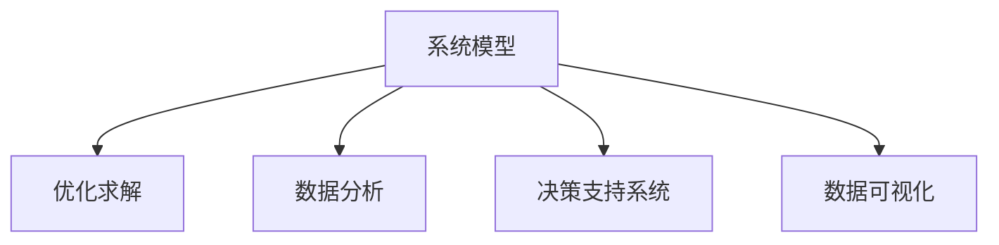

                 

# 系统化思考:管理者战胜复杂的秘诀

## 1. 背景介绍

### 1.1 问题由来
现代企业面临的复杂环境日益加剧，如何在快速变化的市场中保持竞争力，是每个管理者必须面对的挑战。传统的经验管理和直觉决策方法已难以适应当前复杂多变的商业环境。系统化思考成为管理者应对复杂问题的有力武器。系统化思考通过系统模型和理论，帮助管理者理清思路，找到问题根源，制定有效策略，从而在复杂环境中做出更科学、更系统的决策。

### 1.2 问题核心关键点
系统化思考的核心在于构建系统的模型和理论框架，帮助管理者更全面、更深入地理解和分析问题。主要包括以下几个关键点：

- 数据驱动：通过收集、分析和利用大量数据，为决策提供客观依据。
- 模型构建：建立系统的数学模型和框架，描述问题的本质和影响因素。
- 优化求解：使用各种优化算法和工具，寻找问题的最优解或满意解。
- 动态调整：对模型和策略进行动态调整，适应变化的环境。

这些关键点共同构成了系统化思考的核心内容，是管理者应对复杂问题的重要工具。

## 2. 核心概念与联系

### 2.1 核心概念概述

为更好地理解系统化思考方法，本节将介绍几个密切相关的核心概念：

- 系统模型(System Model)：通过数学和逻辑方法，描述现实系统各部分间的相互关系和作用机制。
- 优化求解(Optimization)：通过数学方法求解系统模型，寻找最优或满意解的过程。
- 数据分析(Analytics)：使用数据挖掘、统计分析等技术，从数据中提取有价值的信息。
- 决策支持系统(Decision Support System, DSS)：结合人工智能、数据分析、决策理论等技术，为管理者提供科学决策支持的系统。
- 数据可视化(Data Visualization)：通过图表、地图等形式，直观展示数据和分析结果，帮助管理者理解和判断。

这些概念之间的逻辑关系可以通过以下Mermaid流程图来展示：



这个流程图展示了她系统化思考的核心概念及其之间的关系：

1. 系统模型作为基础，描述了现实系统的各个组成部分及其相互关系。
2. 优化求解通过对模型进行求解，找到最优或满意解，指导决策。
3. 数据分析通过分析数据，为模型提供真实的数据支撑。
4. 决策支持系统结合模型和数据分析，为管理者提供科学决策支持。
5. 数据可视化直观展示数据和分析结果，辅助管理者理解和判断。

这些核心概念共同构成了系统化思考的理论框架，使其能够在各种场景下发挥作用。通过理解这些核心概念，我们可以更好地把握系统化思考的工作原理和优化方向。

## 3. 核心算法原理 & 具体操作步骤
### 3.1 算法原理概述

系统化思考的核心在于构建系统的模型和理论框架，通过优化求解，寻找最优或满意解。其核心思想是：将复杂问题拆分为可操作的子系统，构建数学模型描述这些子系统间的相互关系，通过优化算法求解，找到最优或满意解。

形式化地，假设复杂问题 $P$ 可拆分为若干子问题 $S_i$，构建子问题的数学模型 $M_i$，则系统化思考的过程可表示为：

$$
P = \mathop{\arg\min}_{S_1, S_2, ..., S_n} \sum_{i=1}^n \mathcal{L}_i(S_i)
$$

其中 $\mathcal{L}_i(S_i)$ 为子问题 $S_i$ 的损失函数，用于衡量该子问题的性能。最终目标是最小化整个问题的损失函数 $\mathcal{L}(P)$。

### 3.2 算法步骤详解

系统化思考的具体操作步骤包括：

**Step 1: 数据收集与预处理**
- 收集与问题相关的数据，包括定量数据和定性数据。
- 对数据进行清洗、归一化、编码等预处理，确保数据质量。

**Step 2: 系统建模**
- 根据问题定义，将问题拆分为若干子问题。
- 为每个子问题构建数学模型，描述其输入、输出和约束条件。

**Step 3: 优化求解**
- 使用各种优化算法，如线性规划、非线性规划、遗传算法等，对系统模型进行求解。
- 根据求解结果，对各个子问题进行动态调整和优化。

**Step 4: 数据可视化**
- 使用图表、地图等工具，直观展示数据和分析结果。
- 辅助管理者理解问题，制定决策。

**Step 5: 模型验证与调整**
- 对模型进行验证，评估其准确性和可靠性。
- 根据验证结果，调整模型和策略，优化求解过程。

以上是系统化思考的一般流程。在实际应用中，还需要针对具体问题，对模型构建和优化求解过程进行优化设计，如改进求解算法、引入更多约束条件等，以进一步提升模型性能。

### 3.3 算法优缺点

系统化思考具有以下优点：
1. 系统全面。通过构建系统模型，从多个角度全面分析问题。
2. 决策科学。通过优化求解，寻找最优或满意解，减少决策中的主观性。
3. 动态调整。可以对模型和策略进行动态调整，适应变化的环境。
4. 数据驱动。依赖于大量数据的分析，可以客观评估决策效果。

同时，该方法也存在一定的局限性：
1. 建模复杂。系统建模需要较强的数学和逻辑能力，对于初学者较难。
2. 求解难度。优化求解过程可能较为复杂，需要耗费较多时间和资源。
3. 模型精度。模型的精度依赖于数据质量和模型假设，可能存在偏差。
4. 应用范围。适用于具有明确目标和规则的问题，复杂无规则的问题难以建模。

尽管存在这些局限性，但系统化思考依然是大规模决策和管理的重要方法。通过理解系统化思考的核心原理和操作步骤，管理者可以更好地应对复杂环境，制定科学决策。

### 3.4 算法应用领域

系统化思考在多个领域都得到了广泛应用，包括：

- 项目管理：项目计划的优化、资源分配的调整、风险管理等。
- 供应链管理：物流优化、库存管理、订单处理等。
- 金融投资：投资组合优化、风险控制、市场预测等。
- 市场营销：客户细分、广告投放、销售预测等。
- 人力资源：人才招聘、培训计划、绩效评估等。
- 公共政策：政策制定、公共服务优化、环境治理等。

除了上述这些经典应用外，系统化思考还被创新性地应用于更多领域，如智慧城市、智能制造、健康医疗等，为现代管理带来了新的思路和方法。

## 4. 数学模型和公式 & 详细讲解
### 4.1 数学模型构建

系统化思考的数学模型构建通常包括以下几个步骤：

1. 定义变量和参数：确定系统中的变量和参数，并给出初始值或取值范围。
2. 建立状态方程：描述系统各部分之间的动态关系，通常用微分方程或差分方程表示。
3. 定义目标函数：描述系统的优化目标，通常为最大化或最小化某个指标。
4. 引入约束条件：描述系统中的各种限制条件，如非负约束、总和约束等。

以一个简单的物流系统为例，我们可以构建如下的数学模型：

设物流系统有 $n$ 个节点，$m$ 条边，$x_{ij}$ 表示从节点 $i$ 到节点 $j$ 的货物流量，目标是最小化总运输成本 $C$：

$$
\min \sum_{i=1}^n \sum_{j=1}^n C_{ij}x_{ij}
$$

约束条件包括流量守恒、非负约束等：

$$
\begin{cases}
\sum_{j=1}^n x_{ij} = \sum_{i=1}^n x_{ij} & \forall i=1,\dots,n \\
x_{ij} \ge 0 & \forall i,j=1,\dots,n
\end{cases}
$$

### 4.2 公式推导过程

以下我们以线性规划为例，推导求解系统模型的步骤。

线性规划的数学模型为：

$$
\min \mathbf{c}^T \mathbf{x} \\
\text{s.t.} \quad \mathbf{A}\mathbf{x} = \mathbf{b}, \quad \mathbf{x} \ge 0
$$

其中 $\mathbf{c}$ 为成本系数向量，$\mathbf{x}$ 为决策变量向量，$\mathbf{A}$ 为约束矩阵，$\mathbf{b}$ 为约束向量。

求解线性规划的步骤如下：

1. 将约束方程组化为标准形式：
   $$
   \mathbf{Ax} = \mathbf{b} \Rightarrow \mathbf{x} = \mathbf{A}^{-1}\mathbf{b}
   $$

2. 计算对偶变量 $\mathbf{\lambda}$：
   $$
   \mathbf{\lambda} = \mathbf{b} - \mathbf{A}\mathbf{x}
   $$

3. 计算影子价格 $\mathbf{\pi}$：
   $$
   \mathbf{\pi} = \mathbf{c} - \mathbf{A}^T\mathbf{\lambda}
   $$

4. 更新对偶变量和影子价格：
   $$
   \mathbf{\lambda} \leftarrow \mathbf{\lambda} + \mu \mathbf{\pi}
   $$
   其中 $\mu$ 为对偶变量步长，通常取 $0.1$。

5. 更新决策变量 $\mathbf{x}$：
   $$
   \mathbf{x} \leftarrow \mathbf{x} + \delta \mathbf{\pi}
   $$
   其中 $\delta$ 为决策变量步长，通常取 $0.1$。

6. 判断是否收敛：
   $$
   ||\mathbf{x}^{(k+1)} - \mathbf{x}^{(k)}|| < \epsilon \quad \text{或} \quad k > max_iter
   $$

重复上述步骤，直至满足收敛条件。最终的 $\mathbf{x}$ 即为系统模型的最优解。

### 4.3 案例分析与讲解

以下以一个简单的供应链库存管理问题为例，展示线性规划的应用。

假设一家零售商有三个仓库 $A$、$B$、$C$，需要确定每个仓库的库存水平 $x_{ij}$，使得总成本最小。成本由订货成本 $C_{ij}$ 和库存成本 $C_{ij}x_{ij}$ 组成。各仓库的容量限制为 $R_i$，需求量为 $D_i$。

数学模型如下：

$$
\min \sum_{i=1}^3 \sum_{j=1}^3 C_{ij}x_{ij} \\
\text{s.t.} \quad 
\begin{cases}
x_{ij} = D_i & \forall i=1,2,3 \\
x_{ij} \le R_i & \forall i=1,2,3 \\
\sum_{j=1}^3 x_{ij} = D_i & \forall i=1,2,3 \\
x_{ij} \ge 0 & \forall i,j=1,\dots,3
\end{cases}
$$

其中 $C_{ij}$ 为从仓库 $i$ 到仓库 $j$ 的运输成本，$R_i$ 为仓库 $i$ 的容量限制，$D_i$ 为仓库 $i$ 的需求量。

通过求解该线性规划模型，可以得到各仓库的最优库存水平，从而实现最小化总成本的目标。

## 5. 项目实践：代码实例和详细解释说明
### 5.1 开发环境搭建

在进行系统化思考的实践前，我们需要准备好开发环境。以下是使用Python进行线性规划开发的Python环境配置流程：

1. 安装Anaconda：从官网下载并安装Anaconda，用于创建独立的Python环境。

2. 创建并激活虚拟环境：
```bash
conda create -n linprog-env python=3.8 
conda activate linprog-env
```

3. 安装必要的库：
```bash
conda install cvxpy scipy pandas numpy
```

完成上述步骤后，即可在`linprog-env`环境中开始系统化思考的实践。

### 5.2 源代码详细实现

下面我们以线性规划的示例问题为例，给出使用CVXPy库进行求解的Python代码实现。

```python
import cvxpy as cp
import numpy as np

# 定义变量和参数
x = cp.Variable((3, 3), nonnegative=True)
c = np.array([1, 1, 1, 1, 1, 1])
A = np.array([[0, 1, 1, 0, 0, 0],
              [0, 0, 1, 1, 1, 0],
              [0, 0, 0, 0, 1, 1]])
b = np.array([5, 5, 5])
R = np.array([10, 10, 10])

# 定义优化问题
prob = cp.Problem(cp.Minimize(c @ x), A @ x == b, x >= 0)

# 求解问题
prob.solve()

# 打印结果
print(f"Optimal value: {prob.value}")
print(f"Solution: {x.value}")
```

在这个代码中，我们首先定义了变量 `x` 和成本系数 `c`，然后定义了约束矩阵 `A` 和向量 `b`，以及仓库容量限制 `R`。接下来，我们使用CVXPy库构建优化问题，并使用 `solve()` 方法求解。最后，我们打印出优化值和最优解。

### 5.3 代码解读与分析

让我们再详细解读一下关键代码的实现细节：

**线性规划模型定义**：
- `x = cp.Variable((3, 3), nonnegative=True)`：定义决策变量 `x`，形状为 $(3, 3)$，并指定为非负变量。
- `c = np.array([1, 1, 1, 1, 1, 1])`：定义成本系数向量 `c`，各仓库的运输成本和库存成本都为1。
- `A = np.array([[0, 1, 1, 0, 0, 0],
              [0, 0, 1, 1, 1, 0],
              [0, 0, 0, 0, 1, 1]])`：定义约束矩阵 `A`，各仓库的流向约束。
- `b = np.array([5, 5, 5])`：定义约束向量 `b`，各仓库的总需求量。
- `R = np.array([10, 10, 10])`：定义仓库容量限制 `R`，各仓库的容量上限为10。

**优化问题构建**：
- `prob = cp.Problem(cp.Minimize(c @ x), A @ x == b, x >= 0)`：构建优化问题，目标是最小化总成本 `c @ x`，约束为 `A @ x == b` 和 `x >= 0`。

**求解优化问题**：
- `prob.solve()`：求解优化问题，得到最优解。

**结果输出**：
- `print(f"Optimal value: {prob.value}")`：打印优化值，即总成本的最小值。
- `print(f"Solution: {x.value}")`：打印最优解 `x`，即各仓库的最优库存水平。

可以看到，通过CVXPy库，我们可以非常方便地构建和求解线性规划问题，实现系统化思考的实际应用。

## 6. 实际应用场景
### 6.1 智能制造生产调度

智能制造的生产调度涉及多个环节，如物料采购、生产计划、库存管理等。系统化思考可以通过优化模型，对生产调度进行全面优化，提高生产效率和降低成本。

在实际应用中，可以构建生产调度模型，描述物料的流向和库存水平，并设置相应的优化目标和约束条件。通过求解该模型，可以找到最优的生产调度方案，实现生产资源的最优分配和利用。

### 6.2 智能物流优化

智能物流涉及货物运输、仓储、配送等多个环节。系统化思考可以通过优化模型，对物流流程进行全面优化，提高物流效率和降低运输成本。

在实际应用中，可以构建物流网络模型，描述各节点间的物流关系和成本，并设置相应的优化目标和约束条件。通过求解该模型，可以找到最优的物流路径和库存水平，实现物流资源的优化配置。

### 6.3 金融投资组合优化

金融投资组合优化涉及股票、债券、基金等资产的配置。系统化思考可以通过优化模型，对投资组合进行全面优化，提高投资收益和降低风险。

在实际应用中，可以构建投资组合模型，描述各资产的收益率和风险，并设置相应的优化目标和约束条件。通过求解该模型，可以找到最优的投资组合配置，实现投资收益的最大化和风险的最小化。

### 6.4 未来应用展望

随着系统化思考技术的发展，其在更多领域中的应用前景广阔：

1. 智慧城市治理：通过优化模型，对城市交通、能源、环保等资源进行全面优化，提升城市管理效率。
2. 医疗资源分配：通过优化模型，对医院资源、药品供应、患者治疗等进行全面优化，提高医疗服务质量。
3. 环境保护管理：通过优化模型，对环境污染、资源消耗、生态修复等进行全面优化，实现可持续发展。
4. 教育资源配置：通过优化模型，对学校资源、教师分配、学生培养等进行全面优化，提升教育质量。
5. 安全事件预警：通过优化模型，对安全事件的风险进行全面评估，及时预警和应对。

这些领域的应用，将进一步拓展系统化思考的边界，推动各行业的智能化转型升级。

## 7. 工具和资源推荐
### 7.1 学习资源推荐

为了帮助开发者系统掌握系统化思考的理论基础和实践技巧，这里推荐一些优质的学习资源：

1. 《运筹学原理与方法》：系统介绍了运筹学的基本概念和理论，是学习系统化思考的经典教材。

2. 《线性规划与优化》：详细讲解了线性规划的基本算法和求解方法，是线性规划领域的权威教材。

3. 《系统动力学》：介绍了系统动力学方法的基本原理和应用案例，是系统化思考的重要理论基础。

4. 《决策分析与管理》：讲解了决策分析和管理的基本方法和工具，是系统化思考的重要应用领域。

5. Coursera的《运筹学与优化》课程：由斯坦福大学开设，包含丰富的视频和练习，适合初学者系统学习。

6. edX的《系统动力学与决策分析》课程：由麻省理工学院开设，介绍了系统动力学方法的基本原理和应用案例。

通过对这些资源的学习实践，相信你一定能够系统掌握系统化思考的核心内容，并用于解决实际的复杂问题。

### 7.2 开发工具推荐

高效的开发离不开优秀的工具支持。以下是几款用于系统化思考开发的常用工具：

1. CVXPy：基于Python的优化求解库，支持线性规划、整数规划、二次规划等优化问题，是系统化思考的重要工具。

2. Scipy：基于Python的科学计算库，包含大量数学函数和算法，支持线性代数、微积分、统计分析等计算需求。

3. Matplotlib：基于Python的可视化库，支持绘制各种图表和地图，是数据可视化的重要工具。

4. Jupyter Notebook：基于Python的交互式编程环境，支持代码编写、数据可视化、结果展示等多种功能。

5. Python：通用编程语言，适合开发系统化思考相关的算法和模型。

合理利用这些工具，可以显著提升系统化思考任务的开发效率，加快创新迭代的步伐。

### 7.3 相关论文推荐

系统化思考的发展源于学界的持续研究。以下是几篇奠基性的相关论文，推荐阅读：

1. "Theory of Constrained Optimization" by David G. Luenberger：线性规划的经典教材，系统介绍了线性规划的理论和算法。

2. "Linear Programming and Network Flows" by Little and penalty method，Luenberger and Yang：详细讲解了线性规划的基本算法和求解方法。

3. "Principles of Decisions and Value Analysis" by Howard and Mason：介绍了决策分析和价值分析的基本方法。

4. "Discrete-Variable Optimization" by Nemirovski：详细讲解了整数规划、混合整数规划等优化问题。

5. "System Dynamics: Modeling for Complexity" by Forrester and Jay：介绍了系统动力学方法的基本原理和应用案例。

这些论文代表了大规模决策和管理理论的发展脉络。通过学习这些前沿成果，可以帮助研究者把握学科前进方向，激发更多的创新灵感。

## 8. 总结：未来发展趋势与挑战
### 8.1 总结

本文对系统化思考方法进行了全面系统的介绍。首先阐述了系统化思考的研究背景和意义，明确了其在应对复杂问题中的独特价值。其次，从原理到实践，详细讲解了系统化思考的数学模型和操作步骤，给出了系统化思考任务开发的完整代码实例。同时，本文还广泛探讨了系统化思考方法在多个领域的应用前景，展示了其广阔的潜力。

通过本文的系统梳理，可以看到，系统化思考技术已经成为现代管理的重要工具。它通过建立系统的模型和理论框架，帮助管理者全面、科学地分析和解决复杂问题，从而在复杂环境中做出更优的决策。未来，伴随系统化思考技术的不断发展，其在更多领域中的应用前景广阔，将为人类社会的智能化管理提供有力的支持。

### 8.2 未来发展趋势

展望未来，系统化思考技术将呈现以下几个发展趋势：

1. 数据驱动：伴随大数据技术的发展，数据驱动将成为系统化思考的重要手段，帮助管理者更全面地理解和分析问题。

2. 多目标优化：未来系统化思考将更加注重多目标优化，同时考虑多个目标之间的平衡，实现更全面的优化。

3. 实时优化：系统化思考将结合实时数据，实现动态优化，适应快速变化的环境。

4. 机器学习：未来系统化思考将更多地引入机器学习技术，提高模型求解的效率和精度。

5. 可视化工具：更高级的数据可视化工具将进一步普及，辅助管理者更直观地理解和判断问题。

6. 跨领域融合：系统化思考将与其他领域的技术进行更深入的融合，如人工智能、区块链、物联网等，拓展应用场景和解决复杂问题的能力。

以上趋势凸显了系统化思考技术的广阔前景。这些方向的探索发展，必将进一步提升系统化思考方法的应用效果，为人类社会的智能化管理提供更强大的支持。

### 8.3 面临的挑战

尽管系统化思考技术已经取得了瞩目成就，但在迈向更加智能化、普适化应用的过程中，它仍面临着诸多挑战：

1. 模型复杂度：系统化思考的模型通常较为复杂，需要较强的数学和逻辑能力，对于初学者较难掌握。

2. 数据获取难：优化模型需要大量真实数据，但有时难以获取高质量的数据，影响模型求解效果。

3. 算法求解难：优化算法求解过程复杂，需要耗费较多时间和资源，难以快速获得结果。

4. 结果解释难：系统化思考的结果通常较为抽象，管理者难以理解和解释，需要辅助工具进行解释和可视化。

5. 应用范围有限：系统化思考适用于具有明确目标和规则的问题，复杂无规则的问题难以建模。

6. 模型鲁棒性差：模型求解过程中可能出现局部最优解，难以保证全局最优解，模型鲁棒性有待提升。

尽管存在这些挑战，但系统化思考依然是大规模决策和管理的重要方法。通过理解系统化思考的核心原理和操作步骤，管理者可以更好地应对复杂环境，制定科学决策。

### 8.4 研究展望

面对系统化思考面临的挑战，未来的研究需要在以下几个方面寻求新的突破：

1. 数据驱动技术：发展高质量数据获取技术，提高数据的丰富性和准确性。

2. 算法优化技术：开发更高效、更精确的优化算法，提高求解速度和精度。

3. 结果可视化技术：发展更高级的数据可视化工具，提高结果的可解释性和可操作性。

4. 模型鲁棒性提升：研究更稳定的求解方法，提高模型鲁棒性。

5. 跨领域融合技术：结合其他领域的技术，拓展系统化思考的应用场景。

这些研究方向的探索，必将引领系统化思考技术迈向更高的台阶，为现代管理提供更强大的支持。只有勇于创新、敢于突破，才能不断拓展系统化思考的边界，推动人类社会的智能化管理进步。

## 9. 附录：常见问题与解答

**Q1: 什么是系统化思考？**

A: 系统化思考是一种通过构建系统的模型和理论框架，帮助管理者全面、科学地分析和解决复杂问题的系统方法。它通过系统模型和优化求解，找到问题的最优或满意解，辅助管理者做出科学决策。

**Q2: 系统化思考的优势和劣势是什么？**

A: 系统化思考的优势在于全面性和科学性，通过构建系统模型和优化求解，管理者可以全面分析问题，找到最优或满意解，减少决策中的主观性。劣势在于模型复杂度较高，对于初学者较难掌握，且数据获取和算法求解难度较大。

**Q3: 系统化思考适用于哪些问题？**

A: 系统化思考适用于具有明确目标和规则的问题，如生产调度、物流优化、金融投资等。对于复杂无规则的问题，系统化思考可能难以建模。

**Q4: 如何提高系统化思考的模型鲁棒性？**

A: 提高模型鲁棒性可以通过改进算法、引入更多约束条件、动态调整模型等方式实现。优化算法、机器学习技术的发展也将有助于提高模型鲁棒性。

**Q5: 如何实现数据驱动的系统化思考？**

A: 数据驱动的系统化思考需要收集和分析大量真实数据，使用数据挖掘、统计分析等技术，从数据中提取有价值的信息。提高数据质量、丰富数据类型是实现数据驱动的关键。

通过对这些常见问题的解答，相信你能够更全面地理解系统化思考的原理和应用方法，更好地应对实际管理中的复杂问题。

