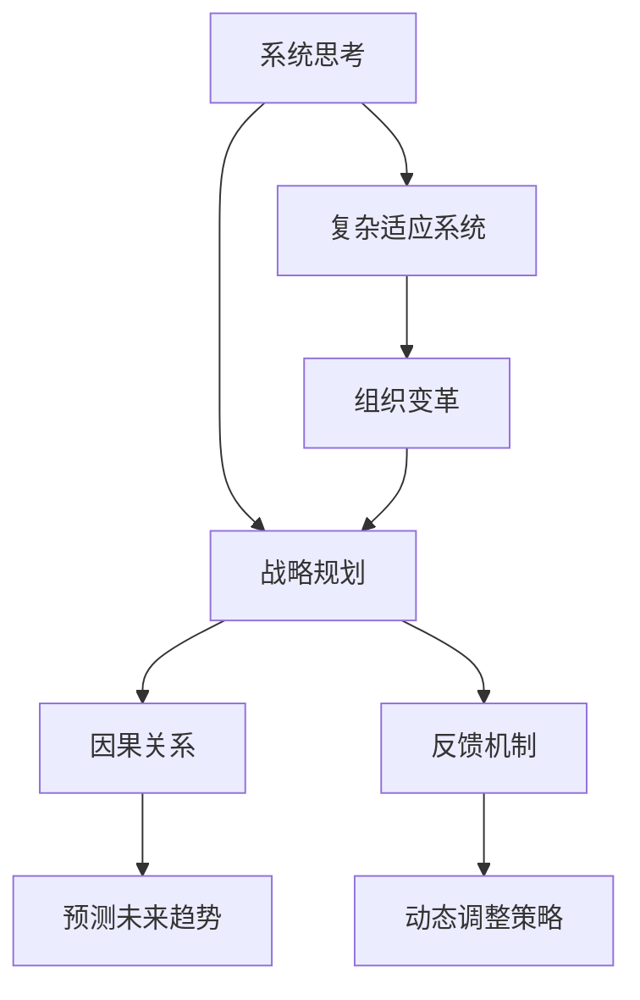

                 

# 系统思考在战略规划中的应用

> 关键词：系统思考,战略规划,组织变革,决策优化,复杂适应系统,企业可持续发展

## 1. 背景介绍

### 1.1 问题由来
随着全球化、数字化和市场竞争的加剧，企业战略规划已经成为了组织管理中不可或缺的一环。传统的战略规划方法，如SWOT分析、PESTEL模型等，更多地关注静态的资源与市场环境分析，难以适应快速变化的市场和复杂多变的组织环境。系统思考作为一种新兴的思维方式，通过强调系统的整体性和动态性，能够为企业提供更加全面和深刻的战略洞察。

系统思考的核心思想是：在复杂适应系统中，各组成部分相互依存、相互影响，通过动态调整来适应外界变化。系统思考不仅关注当前状态，更重视事物间的相互关系和内在动态。这对于企业战略规划有着重要的指导意义，可以帮助企业在动态多变的环境中做出更加科学合理的决策。

### 1.2 问题核心关键点
系统思考在战略规划中的应用，主要聚焦于以下几个关键点：

1. **系统的整体性**：强调企业各部分之间的相互联系和整体协同，以避免单一局部优化导致整体目标偏离。
2. **动态性**：强调组织环境的变化以及企业内部的演化过程，关注组织适应性和动态调整能力。
3. **因果循环**：通过深入理解系统中的因果关系，识别关键驱动因素，预测未来趋势，制定灵活应对策略。
4. **反馈机制**：强调在战略执行过程中，及时收集和处理反馈信息，调整策略方向，保持战略与环境的同步。
5. **模型构建**：通过构建系统动力学模型，模拟和分析系统的演化过程，辅助决策制定。

## 2. 核心概念与联系

### 2.1 核心概念概述

为了更好地理解系统思考在战略规划中的应用，本节将介绍几个关键概念：

- **系统思考**：一种整体性和动态性相结合的思维方式，强调事物间的相互关系和内在动态，通过系统动力学模型进行模拟和分析，以辅助决策制定。
- **复杂适应系统**：由简单、相互作用的实体组成，通过交互学习、适应和演化来维持组织结构的系统，如企业组织、市场生态等。
- **战略规划**：通过分析内外部环境，制定和实施企业长期发展策略的过程，以实现企业目标和持续增长。
- **因果关系**：事物之间相互联系和影响的关系，通过识别关键驱动因素，可以预测未来趋势和制定策略。
- **反馈机制**：系统内部和外部的信息反馈过程，帮助系统动态调整和优化。

这些核心概念之间的逻辑关系可以通过以下Mermaid流程图来展示：



这个流程图展示了一些核心概念及其之间的关系：

1. 系统思考强调复杂适应系统的整体性和动态性。
2. 战略规划通过系统思考方法，识别因果关系，构建反馈机制，实现系统动态调整和优化。
3. 因果关系和反馈机制是战略规划中识别和处理系统内部复杂关系的重要工具。
4. 组织变革是复杂适应系统适应外部环境变化的重要手段。

这些概念共同构成了系统思考在战略规划中的理论框架，帮助企业在复杂多变的环境中做出科学的决策。

## 3. 核心算法原理 & 具体操作步骤
### 3.1 算法原理概述

系统思考在战略规划中的应用，本质上是通过构建和分析系统动力学模型，模拟系统在不同策略下的演化过程，识别关键驱动因素，预测未来趋势，制定灵活应对策略。系统动力学模型通过建立因果关系图和差分方程组，描述系统各部分间的动态交互，进而推导出系统的长期行为。

形式化地，假设一个复杂适应系统 $S$，包含 $n$ 个相互作用的子系统 $S_1, S_2, \dots, S_n$。系统动力学模型通过以下几个步骤，对系统进行建模和分析：

1. **系统边界确定**：定义系统的输入、输出和关键参数。
2. **因果关系建立**：识别各子系统间的因果关系，构建因果关系图。
3. **差分方程建模**：根据因果关系图，构建系统的差分方程组。
4. **模型求解与仿真**：使用数值方法求解差分方程组，模拟系统演化过程。
5. **结果分析与策略制定**：分析模型结果，识别关键驱动因素，预测未来趋势，制定应对策略。

### 3.2 算法步骤详解

以下是系统思考在战略规划中的具体步骤：

**Step 1: 确定系统边界**

首先，需要明确系统的输入、输出和关键参数。例如，对于一个企业，输入可能包括市场需求、技术进步、政策法规等，输出可能包括产品销售、市场份额、员工满意度等，关键参数可能包括预算、人员规模、研发投入等。

**Step 2: 建立因果关系图**

通过与企业内部人员、专家进行深入访谈，识别各子系统间的因果关系。例如，市场需求增加可能导致产品销售增加，产品销售增加可能导致研发投入增加，研发投入增加可能导致技术进步，技术进步可能导致市场份额增加等。将这些因果关系用因果关系图表示出来。

**Step 3: 构建差分方程组**

根据因果关系图，建立系统的差分方程组。例如，如果因果关系图包含市场需求、产品销售、研发投入等，可以建立如下的差分方程组：

$$
\begin{aligned}
\frac{dD_{\text{需求}}}{dt} &= \text{市场需求} \\
\frac{dS_{\text{销售}}}{dt} &= \alpha S_{\text{销售}} + \beta D_{\text{需求}} - \gamma S_{\text{销售}} \\
\frac{dI_{\text{研发}}}{dt} &= \delta S_{\text{销售}} - \epsilon I_{\text{研发}} \\
\end{aligned}
$$

其中，$D_{\text{需求}}$ 表示市场需求，$S_{\text{销售}}$ 表示产品销售，$I_{\text{研发}}$ 表示研发投入，$\alpha$、$\beta$、$\gamma$ 和 $\delta$、$\epsilon$ 为模型的参数。

**Step 4: 模型求解与仿真**

使用数值方法（如Euler方法、Runge-Kutta方法等）求解差分方程组，模拟系统在不同策略下的演化过程。例如，可以模拟市场需求增加、产品销售下降等情景下的系统演化。

**Step 5: 结果分析与策略制定**

分析模型结果，识别关键驱动因素，预测未来趋势，制定应对策略。例如，如果模型预测市场需求增加将导致产品销售增加，但研发投入不足，可以制定增加研发投入的策略，以确保技术进步和市场份额的增长。

### 3.3 算法优缺点

系统思考在战略规划中的应用，具有以下优点：

1. **全面性**：通过系统思考方法，能够全面考虑企业各部分之间的相互关系和整体协同，避免单一局部优化导致整体目标偏离。
2. **动态性**：能够模拟系统的动态演化过程，预测未来趋势，制定灵活应对策略。
3. **因果关系**：通过识别关键驱动因素，能够深入理解系统内部的因果关系，识别关键驱动因素。
4. **反馈机制**：能够建立系统的反馈机制，动态调整和优化策略。

同时，该方法也存在一定的局限性：

1. **模型构建复杂**：构建系统动力学模型需要深入理解各子系统间的因果关系，模型构建过程复杂。
2. **数据需求高**：模型求解和仿真需要大量高质量的数据，数据获取成本较高。
3. **模型精度有限**：模型的精度受限于数据质量、因果关系识别的准确性等，可能存在预测误差。
4. **理解门槛高**：系统思考需要较强的数学和系统分析能力，对理解门槛较高。

尽管存在这些局限性，但就目前而言，系统思考方法在战略规划中的应用已经展现出其强大的分析和预测能力，帮助企业在不确定性环境下做出更加科学的决策。未来相关研究的重点在于如何进一步简化模型构建过程，提高数据获取和处理效率，降低理解门槛，使得系统思考在更多领域得到应用。

### 3.4 算法应用领域

系统思考在战略规划中的应用，已经在多个领域得到了广泛的应用，例如：

- **企业战略规划**：通过系统思考方法，对企业内部各子系统间的因果关系进行建模和分析，制定长期发展策略。
- **供应链管理**：识别供应链各环节间的因果关系，优化供应链流程，提升供应链效率和灵活性。
- **金融风险管理**：识别金融市场中的关键驱动因素，预测市场趋势，制定风险管理策略。
- **公共政策制定**：识别政策实施中的关键驱动因素，预测政策效果，制定科学合理的政策措施。
- **环境可持续发展**：识别环境系统中各子系统间的因果关系，制定可持续发展的策略。

除了上述这些经典应用外，系统思考还被创新性地应用到更多场景中，如智慧城市治理、生态系统保护、能源管理等，为复杂系统的管理和优化提供了新的思路和方法。

## 4. 数学模型和公式 & 详细讲解
### 4.1 数学模型构建

本节将使用数学语言对系统思考在战略规划中的应用进行更加严格的刻画。

假设一个复杂适应系统 $S$，包含 $n$ 个相互作用的子系统 $S_1, S_2, \dots, S_n$。系统动力学模型通过以下数学公式进行建模：

$$
\begin{aligned}
\frac{dx_i}{dt} &= f_i(x_1, x_2, \dots, x_n, p_1, p_2, \dots, p_k) \\
\end{aligned}
$$

其中，$x_i$ 表示子系统 $S_i$ 的状态，$p_i$ 表示子系统 $S_i$ 的参数，$f_i$ 表示子系统 $S_i$ 的动力学函数，描述了子系统 $S_i$ 与其它子系统间的因果关系。

### 4.2 公式推导过程

以下我们以一个简单的企业战略规划模型为例，推导差分方程组的构建过程。

假设一个企业 $S$，包含市场需求 $D$、产品销售 $S$、研发投入 $I$ 三个子系统。市场需求的增加可能导致产品销售增加，产品销售的增加可能导致研发投入增加，研发投入的增加又可能导致市场需求的进一步增长。设 $\text{市场需求} = F(D, I)$，$\text{产品销售} = G(S, I)$，$\text{研发投入} = H(S, I)$，则可以建立如下的差分方程组：

$$
\begin{aligned}
\frac{dD}{dt} &= F(D, I) \\
\frac{dS}{dt} &= G(S, I) \\
\frac{dI}{dt} &= H(S, I) \\
\end{aligned}
$$

其中，$F(D, I)$、$G(S, I)$ 和 $H(S, I)$ 分别表示市场需求、产品销售和研发投入的动力学函数。假设市场需求增加可能导致产品销售增加，产品销售增加可能导致研发投入增加，研发投入增加可能导致市场需求增加，则可以建立如下的动力学函数：

$$
\begin{aligned}
F(D, I) &= \text{市场需求增长率} \cdot D \\
G(S, I) &= \text{销售增长率} \cdot S + \text{市场需求增长率} \cdot D - \text{销售下降率} \cdot S \\
H(S, I) &= \text{研发投入增长率} \cdot S - \text{研发投入下降率} \cdot I \\
\end{aligned}
$$

将以上公式代入差分方程组，可以得到如下的模型：

$$
\begin{aligned}
\frac{dD}{dt} &= \text{市场需求增长率} \cdot D \\
\frac{dS}{dt} &= \text{销售增长率} \cdot S + \text{市场需求增长率} \cdot D - \text{销售下降率} \cdot S \\
\frac{dI}{dt} &= \text{研发投入增长率} \cdot S - \text{研发投入下降率} \cdot I \\
\end{aligned}
$$

在得到差分方程后，即可使用数值方法求解模型的演化过程，模拟系统在不同策略下的行为。

### 4.3 案例分析与讲解

以下以一个简化的供应链管理模型为例，展示系统思考在战略规划中的应用。

假设一个供应链系统 $S$，包含原材料供应 $O$、生产 $P$、物流 $L$ 三个子系统。原材料供应不足可能导致生产中断，生产中断可能导致物流延迟，物流延迟可能导致原材料供应短缺。设 $\text{原材料供应} = O$、$\text{生产} = P$、$\text{物流} = L$，可以建立如下的差分方程组：

$$
\begin{aligned}
\frac{dO}{dt} &= \text{原材料供应增长率} \cdot O - \text{原材料供应下降率} \cdot O \\
\frac{dP}{dt} &= \text{生产增长率} \cdot P + \text{原材料供应下降率} \cdot O - \text{生产下降率} \cdot P \\
\frac{dL}{dt} &= \text{物流增长率} \cdot L + \text{生产下降率} \cdot P - \text{物流下降率} \cdot L \\
\end{aligned}
$$

其中，$\text{原材料供应增长率}$、$\text{原材料供应下降率}$、$\text{生产增长率}$、$\text{生产下降率}$、$\text{物流增长率}$ 和 $\text{物流下降率}$ 为模型的参数。假设原材料供应不足可能导致生产中断，生产中断可能导致物流延迟，物流延迟可能导致原材料供应短缺，则可以建立如下的动力学函数：

$$
\begin{aligned}
\text{原材料供应下降率} &= \text{原材料供应不足率} \cdot O \\
\text{生产下降率} &= \text{生产中断率} \cdot P \\
\text{物流下降率} &= \text{物流延迟率} \cdot L \\
\end{aligned}
$$

将以上公式代入差分方程组，可以得到如下的模型：

$$
\begin{aligned}
\frac{dO}{dt} &= \text{原材料供应增长率} \cdot O - \text{原材料供应不足率} \cdot O^2 \\
\frac{dP}{dt} &= \text{生产增长率} \cdot P + \text{原材料供应不足率} \cdot O^2 - \text{生产中断率} \cdot P \\
\frac{dL}{dt} &= \text{物流增长率} \cdot L + \text{生产中断率} \cdot P - \text{物流延迟率} \cdot L \\
\end{aligned}
$$

使用数值方法求解模型，模拟供应链系统在不同策略下的行为，例如增加原材料供应、优化生产流程、改进物流管理等，可以帮助企业制定科学的供应链管理策略。

## 5. 项目实践：代码实例和详细解释说明
### 5.1 开发环境搭建

在进行系统思考的实践前，我们需要准备好开发环境。以下是使用Python进行Sympy库开发的Python环境配置流程：

1. 安装Anaconda：从官网下载并安装Anaconda，用于创建独立的Python环境。

2. 创建并激活虚拟环境：
```bash
conda create -n systems_thinking python=3.8 
conda activate systems_thinking
```

3. 安装Sympy库：
```bash
pip install sympy
```

4. 安装各类工具包：
```bash
pip install numpy pandas scikit-learn matplotlib jupyter notebook ipython
```

完成上述步骤后，即可在`systems_thinking`环境中开始系统思考的实践。

### 5.2 源代码详细实现

这里我们以一个简化的供应链管理模型为例，展示使用Sympy库构建和分析系统动力学模型的Python代码实现。

首先，定义模型的变量和参数：

```python
from sympy import symbols, Eq, solve, Rational

# 定义变量
O, P, L = symbols('O P L')

# 定义参数
original_supply_growth_rate = Rational(0.1)
supply_shortage_rate = Rational(0.05)
production_growth_rate = Rational(0.2)
production_interruption_rate = Rational(0.03)
logistics_growth_rate = Rational(0.3)
logistics_delay_rate = Rational(0.04)

# 定义动力学方程
diff_O = original_supply_growth_rate * O - supply_shortage_rate * O**2
diff_P = production_growth_rate * P + supply_shortage_rate * O**2 - production_interruption_rate * P
diff_L = logistics_growth_rate * L + production_interruption_rate * P - logistics_delay_rate * L

# 创建系统动力学模型
model = Eq(diff_O, diff_O)
model = Eq(diff_P, diff_P)
model = Eq(diff_L, diff_L)
```

然后，使用Sympy求解模型的演化过程：

```python
from sympy import init_vasys
from sympy.ode import solve_ivp

# 初始条件
initial_conditions = {O: 10, P: 5, L: 0}

# 求解微分方程
solution = solve_ivp(model, (0, 100), initial_conditions)

# 打印结果
print(solution)
```

最后，分析模型的结果：

```python
# 打印结果
print(solution)

# 分析结果
# 在这里可以根据需要，进一步分析供应链系统的行为趋势，制定优化策略
```

以上就是使用Sympy库构建和分析系统动力学模型的完整代码实现。可以看到，通过Sympy库，可以方便地构建复杂的数学模型，并使用数值方法求解其演化过程，分析系统的动态行为。

### 5.3 代码解读与分析

让我们再详细解读一下关键代码的实现细节：

**模型构建**：
- 使用Sympy定义变量和参数，构建差分方程组。
- 使用`Eq`函数创建系统动力学模型，将差分方程组转化为等式形式。
- 设置初始条件，开始求解微分方程。

**求解模型**：
- 使用Sympy的`solve_ivp`函数求解微分方程组，模拟系统演化过程。
- 使用`initial_conditions`字典设置模型的初始状态。

**结果分析**：
- 打印求解结果，通过进一步的分析，可以理解系统在不同策略下的演化过程。

**注意事项**：
- 在实际应用中，模型的参数和变量需要根据实际情况进行调整。
- 求解过程中，需要合理设置求解区间和步长，以保证求解的精度和效率。
- 分析结果时，可以结合实际业务场景，进行更加深入的洞察和决策制定。

合理利用这些工具，可以显著提升系统思考在战略规划中的开发效率，加快创新迭代的步伐。

## 6. 实际应用场景
### 6.1 智能制造系统

系统思考在智能制造系统中得到了广泛的应用，通过构建和分析生产流程、物流管理、设备维护等子系统间的因果关系，可以优化整个制造系统的运行效率和灵活性。

在技术实现上，可以收集企业的历史生产数据、物流数据、设备维护记录等，将关键过程参数作为模型输入，企业的目标（如生产效率、库存水平、设备可用率等）作为输出，构建系统的差分方程组。通过仿真和分析，可以识别生产流程中的瓶颈环节，优化生产排程和物流管理，提升生产效率和响应速度。

### 6.2 智慧城市治理

系统思考在智慧城市治理中，通过构建和分析交通、能源、环境等子系统间的因果关系，可以优化城市资源配置，提升城市运行效率和居民生活质量。

在实践过程中，可以收集城市的交通流量、能源消耗、环境污染等数据，构建城市的系统动力学模型。通过仿真和分析，可以识别城市运行中的关键问题，优化交通信号控制、能源供应和分配，减少环境污染，提升城市运行效率。

### 6.3 金融风险管理

系统思考在金融风险管理中，通过构建和分析市场、客户、交易等子系统间的因果关系，可以识别市场风险、信用风险等关键驱动因素，制定科学的风险管理策略。

在实践中，可以收集金融市场的历史数据、客户行为数据、交易数据等，构建金融市场的系统动力学模型。通过仿真和分析，可以识别市场风险的关键驱动因素，制定应对策略，提升金融市场的稳健性和风险管理能力。

### 6.4 未来应用展望

随着系统思考理论的不断发展和完善，其在战略规划中的应用前景将更加广阔。未来，系统思考将在更多领域得到应用，为复杂系统的管理和优化提供新的思路和方法。

在智慧医疗领域，通过构建和分析医疗系统中的因果关系，可以优化资源配置，提升医疗服务效率和质量。在智慧教育领域，通过构建和分析教育系统中的因果关系，可以优化教学过程，提升教育公平和质量。

此外，在智慧城市治理、金融风险管理、能源管理、环境可持续发展等众多领域，系统思考方法都将发挥重要作用，推动这些领域的技术创新和产业升级。

## 7. 工具和资源推荐
### 7.1 学习资源推荐

为了帮助开发者系统掌握系统思考的理论基础和实践技巧，这里推荐一些优质的学习资源：

1. 《系统动力学入门》：介绍了系统动力学的基本概念和建模方法，是系统思考入门的经典教材。
2. 《复杂适应系统》：介绍了复杂适应系统理论的基本概念和建模方法，深入讲解了复杂系统的演化过程和优化策略。
3. 《系统思考与战略规划》：介绍了系统思考在战略规划中的应用，通过实际案例展示了系统思考的实践技巧。
4. 《系统动力学建模与仿真》：介绍了系统动力学建模的基本方法和工具，结合实际案例展示了系统动力学模型的构建和分析过程。
5. 《Python系统动力学建模实践》：介绍了使用Python进行系统动力学建模的方法和工具，通过实际案例展示了系统思考在战略规划中的应用。

通过对这些资源的学习实践，相信你一定能够快速掌握系统思考在战略规划中的应用，并用于解决实际的战略规划问题。

### 7.2 开发工具推荐

高效的系统思考开发离不开优秀的工具支持。以下是几款用于系统思考开发的常用工具：

1. PySimSys：一个Python系统动力学工具箱，支持复杂的因果关系图建模和动态仿真。
2. Vensim：一款商业化的系统动力学建模软件，支持可视化建模和动态仿真，易于使用。
3. AnyLogic：一款系统动力学建模和仿真软件，支持多种类型的系统建模和仿真，适用于复杂的系统分析。
4. SystemDynamics Toolbook：一个开源的系统动力学建模工具，支持可视化的因果关系图建模和动态仿真，适用于学术研究。
5. Python Symbology：一个Python系统动力学建模库，支持因果关系图建模和动态仿真，适用于快速原型设计和系统分析。

合理利用这些工具，可以显著提升系统思考在战略规划中的开发效率，加快创新迭代的步伐。

### 7.3 相关论文推荐

系统思考在战略规划中的应用，得益于学界的持续研究。以下是几篇奠基性的相关论文，推荐阅读：

1. "A System Dynamics Model of Business Strategy"（商业策略的系统动力学模型）：由Johan W. Elkington等学者发表，展示了系统思考在企业战略规划中的应用。
2. "Strategic Planning in a Complex World"（复杂世界中的战略规划）：由John A. Wheatley等学者发表，介绍了系统思考在复杂环境中的战略规划方法。
3. "The Dynamics of Knowledge Transfer"（知识转移的动态系统）：由Ester G. Haukka等学者发表，展示了系统思考在知识转移中的应用。
4. "The System Dynamics Approach to Strategy"（系统动力学方法在战略中的应用）：由Martin Fowler等学者发表，介绍了系统思考在企业战略规划中的应用方法和工具。
5. "Strategic Planning with Systems Thinking"（系统思考中的战略规划）：由Ron R. Miller等学者发表，展示了系统思考在企业战略规划中的应用实例。

这些论文代表了大系统思考的发展脉络。通过学习这些前沿成果，可以帮助研究者把握学科前进方向，激发更多的创新灵感。

## 8. 总结：未来发展趋势与挑战

### 8.1 总结

本文对系统思考在战略规划中的应用进行了全面系统的介绍。首先阐述了系统思考的核心思想和理论基础，明确了其在复杂适应系统中的作用。其次，从原理到实践，详细讲解了系统思考在战略规划中的数学模型构建和操作流程，给出了具体的代码实例和详细解释。同时，本文还广泛探讨了系统思考在智能制造、智慧城市治理、金融风险管理等多个行业领域的应用前景，展示了其强大的分析和预测能力。最后，本文精选了系统思考的学习资源、开发工具和相关论文，力求为读者提供全方位的技术指引。

通过本文的系统梳理，可以看到，系统思考在战略规划中的应用已经显现出其强大的分析和预测能力，帮助企业在复杂多变的环境中做出更加科学的决策。未来，伴随系统思考理论的不断发展和完善，其在更多领域将得到应用，为复杂系统的管理和优化提供新的思路和方法。

### 8.2 未来发展趋势

展望未来，系统思考在战略规划中的应用将呈现以下几个发展趋势：

1. **模型自动化**：随着人工智能技术的发展，系统动力学模型将越来越多地利用机器学习、深度学习等技术，自动构建和优化模型。
2. **数据集成**：系统思考将更多地依赖于多源数据的集成和融合，通过大数据技术提高模型的预测精度和适应性。
3. **场景模拟**：系统思考将越来越多地应用于虚拟仿真和场景模拟，通过虚拟实验优化决策制定。
4. **跨领域应用**：系统思考将更多地应用于跨领域复杂系统的管理和优化，如智慧医疗、智慧教育、智慧城市等。
5. **系统学习**：系统思考将更多地关注系统的学习和自适应能力，通过智能优化提高系统的动态调整能力。

以上趋势凸显了系统思考在战略规划中的广阔前景。这些方向的探索发展，必将进一步提升系统思考在战略规划中的应用价值，推动企业在不确定性环境下做出更加科学的决策。

### 8.3 面临的挑战

尽管系统思考在战略规划中的应用已经取得了显著成就，但在迈向更加智能化、普适化应用的过程中，它仍面临着诸多挑战：

1. **模型构建复杂**：构建系统动力学模型需要深入理解各子系统间的因果关系，模型构建过程复杂。
2. **数据需求高**：模型求解和仿真需要大量高质量的数据，数据获取成本较高。
3. **理解门槛高**：系统思考需要较强的数学和系统分析能力，对理解门槛较高。
4. **模型精度有限**：模型的精度受限于数据质量、因果关系识别的准确性等，可能存在预测误差。
5. **应用门槛高**：系统思考方法的应用需要较强的专业知识和技能，应用门槛较高。

尽管存在这些挑战，但就目前而言，系统思考方法在战略规划中的应用已经展现出其强大的分析和预测能力，帮助企业在不确定性环境下做出更加科学的决策。未来相关研究的重点在于如何进一步简化模型构建过程，提高数据获取和处理效率，降低理解门槛，使得系统思考在更多领域得到应用。

### 8.4 研究展望

面对系统思考面临的挑战，未来的研究需要在以下几个方面寻求新的突破：

1. **模型自动化**：开发更加自动化的系统动力学建模工具，降低模型构建的复杂度，提高应用效率。
2. **数据集成**：研究多源数据集成的技术和方法，提高模型的数据获取和处理效率。
3. **智能优化**：结合人工智能技术，提高系统学习的智能性和自适应能力，增强系统的动态调整能力。
4. **场景模拟**：研究虚拟仿真和场景模拟技术，通过虚拟实验优化决策制定。
5. **跨领域应用**：拓展系统思考在跨领域复杂系统的管理和优化中的应用，推动系统思考在更多领域的落地。

这些研究方向的探索，必将引领系统思考在战略规划中迈向更高的台阶，为复杂系统的管理和优化提供新的思路和方法。面向未来，系统思考技术还需要与其他人工智能技术进行更深入的融合，如知识表示、因果推理、强化学习等，多路径协同发力，共同推动复杂系统的智能化和自适应发展。只有勇于创新、敢于突破，才能不断拓展系统思考的边界，让系统思考在构建智能系统的过程中发挥更大的作用。

## 9. 附录：常见问题与解答

**Q1：系统思考在战略规划中的作用是什么？**

A: 系统思考在战略规划中的作用主要体现在以下几个方面：
1. **全面性**：通过系统思考方法，能够全面考虑企业各部分之间的相互关系和整体协同，避免单一局部优化导致整体目标偏离。
2. **动态性**：能够模拟系统的动态演化过程，预测未来趋势，制定灵活应对策略。
3. **因果关系**：通过识别关键驱动因素，能够深入理解系统内部的因果关系，识别关键驱动因素。
4. **反馈机制**：能够建立系统的反馈机制，动态调整和优化策略。

**Q2：构建系统动力学模型需要哪些步骤？**

A: 构建系统动力学模型需要以下步骤：
1. **确定系统边界**：定义系统的输入、输出和关键参数。
2. **建立因果关系图**：识别各子系统间的因果关系，构建因果关系图。
3. **构建差分方程组**：根据因果关系图，构建系统的差分方程组。
4. **模型求解与仿真**：使用数值方法求解差分方程组，模拟系统演化过程。
5. **结果分析与策略制定**：分析模型结果，识别关键驱动因素，预测未来趋势，制定应对策略。

**Q3：系统思考在实际应用中需要注意哪些问题？**

A: 系统思考在实际应用中需要注意以下问题：
1. **模型构建复杂**：构建系统动力学模型需要深入理解各子系统间的因果关系，模型构建过程复杂。
2. **数据需求高**：模型求解和仿真需要大量高质量的数据，数据获取成本较高。
3. **理解门槛高**：系统思考需要较强的数学和系统分析能力，对理解门槛较高。
4. **模型精度有限**：模型的精度受限于数据质量、因果关系识别的准确性等，可能存在预测误差。
5. **应用门槛高**：系统思考方法的应用需要较强的专业知识和技能，应用门槛较高。

**Q4：如何优化系统思考在战略规划中的应用？**

A: 优化系统思考在战略规划中的应用需要从以下几个方面入手：
1. **模型自动化**：开发更加自动化的系统动力学建模工具，降低模型构建的复杂度，提高应用效率。
2. **数据集成**：研究多源数据集成的技术和方法，提高模型的数据获取和处理效率。
3. **智能优化**：结合人工智能技术，提高系统学习的智能性和自适应能力，增强系统的动态调整能力。
4. **场景模拟**：研究虚拟仿真和场景模拟技术，通过虚拟实验优化决策制定。
5. **跨领域应用**：拓展系统思考在跨领域复杂系统的管理和优化中的应用，推动系统思考在更多领域的落地。

通过这些优化措施，可以进一步提升系统思考在战略规划中的应用价值，推动复杂系统的管理和优化。

---

作者：禅与计算机程序设计艺术 / Zen and the Art of Computer Programming

