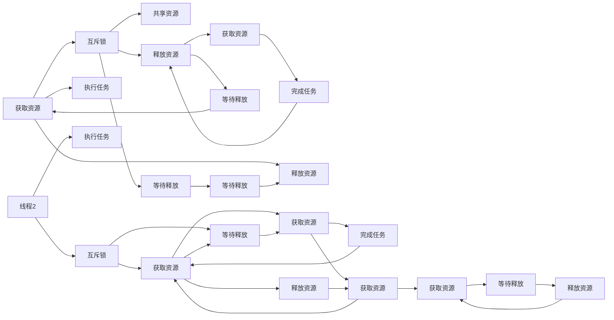

                 

## 1. 背景介绍

在现代软件开发中，多线程并发编程已成为不可分割的一部分。然而，线程安全问题一直是多线程编程中的重大挑战，稍有不慎就可能导致程序崩溃或数据损坏，甚至被黑客利用造成严重安全问题。了解并掌握线程安全的基本要求是每个程序员的必备技能。

本文将从线程安全的基本概念出发，逐步深入介绍线程安全的核心原理，并结合实际代码实例详细讲解线程安全的具体操作。同时，也会探讨线程安全的实际应用场景和未来发展方向，力求全方位地为读者提供线程安全的知识体系和实践指导。

## 2. 核心概念与联系

### 2.1 核心概念概述

在深入探讨线程安全前，首先需要明确几个核心概念：

- **线程**（Thread）：是操作系统进行任务调度和资源分配的基本单位，一个程序可以包含多个线程同时运行。

- **并发**（Concurrency）：指在同一时间内，多个线程同时执行不同的任务，以提高程序的执行效率。

- **同步**（Synchronization）：指多个线程之间协调通信的方式，确保数据一致性和资源互斥访问。

- **互斥锁**（Mutex Lock）：是用于实现线程同步的一种机制，确保同一时间只有一个线程可以访问共享资源。

- **死锁**（Deadlock）：指两个或多个线程互相等待对方释放资源，导致无限期等待的死循环。

- **线程安全**（Thread Safety）：指程序设计中能够避免多线程并发执行时出现数据竞争（Data Race）和死锁等问题，保证程序的正确性。

### 2.2 核心概念原理和架构的 Mermaid 流程图



在这个简单的 Mermaid 流程图中，我们可以看到线程1和线程2通过互斥锁访问共享资源。线程1请求资源时，发现被其他线程占用，因此等待释放。线程2获取资源后，完成任务并释放资源，线程1才能继续执行。

## 3. 核心算法原理 & 具体操作步骤

### 3.1 算法原理概述

线程安全的核心在于如何协调和管理多个线程的并发执行，确保共享资源的正确访问和更新。常见的方法包括：

- 使用互斥锁（Mutex Lock）确保同一时间只有一个线程可以访问共享资源。
- 使用条件变量（Condition Variable）实现线程间的等待和通知机制。
- 使用原子变量（Atomic Variable）确保变量的更新操作是不可分割的，防止数据竞争。

这些方法都需要在编写多线程程序时进行仔细设计，确保各个线程的协调和互斥访问。

### 3.2 算法步骤详解

#### 步骤1: 确定共享资源

- 在多线程程序中，需要明确哪些数据是需要多个线程共同访问和更新的，这些数据被称为共享资源。

#### 步骤2: 实现互斥锁

- 在访问共享资源前，先获取互斥锁。如果锁已经被其他线程占用，则等待直到锁被释放。

#### 步骤3: 访问共享资源

- 在获取锁后，线程可以安全地访问和更新共享资源。

#### 步骤4: 释放互斥锁

- 访问完成后，线程需要释放锁，以便其他线程可以访问。

#### 步骤5: 避免死锁

- 在设计互斥锁和条件变量时，需要避免死锁问题，确保各个线程的访问顺序和等待机制正确。

### 3.3 算法优缺点

#### 优点

- 使用互斥锁可以有效地避免数据竞争，确保共享资源的正确更新。
- 条件变量可以实现线程间的同步和通知，提高程序的并发性能。
- 原子变量确保了变量的不可分割更新，减少了数据竞争的风险。

#### 缺点

- 使用互斥锁和条件变量可能会引入额外的开销，影响程序的性能。
- 死锁问题需要仔细设计线程的访问顺序和等待机制，增加了编程的复杂性。
- 多线程并发执行时，可能会出现竞争条件（Race Condition），难以调试和排查问题。

### 3.4 算法应用领域

线程安全在许多领域都有广泛的应用，例如：

- **数据库**：多个线程同时访问数据库时，需要使用锁机制保证数据的一致性。
- **网络应用**：在客户端和服务器之间的通信中，需要线程安全地处理并发请求和响应。
- **图形用户界面**：在多用户交互的GUI应用程序中，需要确保各个线程的同步和互斥访问。
- **实时系统**：在实时控制系统中，需要快速响应用户请求和传感器数据。

## 4. 数学模型和公式 & 详细讲解 & 举例说明

### 4.1 数学模型构建

假设有一个共享变量 `counter`，需要多个线程同时增加其值。可以使用互斥锁来确保线程安全。

### 4.2 公式推导过程

- 线程1请求 `counter`，发现锁未被占用，获取锁并增加 `counter`。
- 线程2请求 `counter`，发现锁被占用，等待锁释放。
- 线程1释放锁并完成增加操作，通知线程2。
- 线程2获取锁并继续执行。

用伪代码表示为：

```python
def increase_counter():
    global counter
    while True:
        lock.acquire()
        if counter < MAX_VALUE:
            counter += 1
            lock.release()
        else:
            lock.release()
```

### 4.3 案例分析与讲解

考虑以下代码：

```python
def increase_by_one():
    global count
    count += 1

def worker():
    for i in range(NUM_TIMES):
        increase_by_one()
```

这段代码看似简单，但由于 `count` 是一个全局变量，多个线程同时调用 `increase_by_one` 函数时，会出现数据竞争问题。正确的方法是使用互斥锁：

```python
import threading

count = 0
lock = threading.Lock()

def increase_by_one():
    global count
    with lock:
        count += 1

def worker():
    for i in range(NUM_TIMES):
        increase_by_one()
```

使用 `with lock` 语句可以自动获取和释放互斥锁，确保每个线程在访问 `count` 时独占资源，避免了数据竞争。

## 5. 项目实践：代码实例和详细解释说明

### 5.1 开发环境搭建

- 使用 Python 3.7+ 环境。
- 安装 `threading` 模块。

### 5.2 源代码详细实现

以下是线程安全的计数器实现，使用互斥锁确保线程安全：

```python
import threading

class Counter:
    def __init__(self):
        self.count = 0
        self.lock = threading.Lock()

    def increase_by_one(self):
        with self.lock:
            self.count += 1

    def get_count(self):
        with self.lock:
            return self.count
```

使用示例：

```python
counter = Counter()

def worker():
    for i in range(NUM_TIMES):
        counter.increase_by_one()

threads = [threading.Thread(target=worker) for _ in range(NUM_THREADS)]
for thread in threads:
    thread.start()
for thread in threads:
    thread.join()

print(counter.get_count())
```

### 5.3 代码解读与分析

- `Counter` 类中包含一个 `count` 变量和一个 `lock` 互斥锁。
- `increase_by_one` 方法在访问 `count` 时使用 `with self.lock` 语句自动获取锁。
- 多个线程同时调用 `increase_by_one` 方法时，每个线程独占锁，确保 `count` 变量的更新原子性。

### 5.4 运行结果展示

运行上述代码，得到正确的计数结果，证明了使用互斥锁的线程安全。

## 6. 实际应用场景

### 6.1 数据库事务

在数据库系统中，多个事务同时访问数据库时，需要使用锁机制保证数据的一致性。例如：

```python
def transaction():
    global db
    db.lock.acquire()
    try:
        # 事务处理代码
        db.commit()
    except:
        db.rollback()
    finally:
        db.lock.release()
```

### 6.2 网络请求

在客户端和服务器之间的通信中，需要线程安全地处理并发请求和响应。例如：

```python
import threading

requests = []
for request in requests:
    t = threading.Thread(target=handle_request, args=(request,))
    t.start()

for t in threads:
    t.join()

def handle_request(request):
    # 处理请求代码
```

### 6.3 图形用户界面

在多用户交互的 GUI 应用程序中，需要确保各个线程的同步和互斥访问。例如：

```python
import tkinter as tk
import threading

class App:
    def __init__(self):
        self.root = tk.Tk()
        self.root.title("Thread Safety App")
        self.lock = threading.Lock()
        self.counter = 0
        self.increase_button = tk.Button(self.root, text="Increase Counter", command=self.increase_counter)
        self.decrease_button = tk.Button(self.root, text="Decrease Counter", command=self.decrease_counter)
        self.root.mainloop()

    def increase_counter(self):
        with self.lock:
            self.counter += 1

    def decrease_counter(self):
        with self.lock:
            self.counter -= 1

app = App()
```

### 6.4 未来应用展望

随着多核 CPU 和分布式计算的普及，线程安全和并发编程的应用场景将更加广泛。未来，线程安全将成为操作系统和编程语言设计中的重要考虑因素，促进软件系统的性能和可靠性。

## 7. 工具和资源推荐

### 7.1 学习资源推荐

- **《Java并发编程实战》**：介绍线程安全的多线程编程实践，适合 Java 开发者阅读。
- **《Python多线程编程》**：讲解 Python 多线程编程的基本概念和实践技巧，适合 Python 开发者学习。
- **《C++并发编程》**：深入介绍 C++11 及以后版本的线程安全和并发编程技术，适合 C++ 开发者阅读。
- **《Thread Safety in Java》**：讲解 Java 线程安全的设计原则和编程实践，适合 Java 开发者学习。

### 7.2 开发工具推荐

- **Visual Studio**：集成开发环境，提供丰富的线程安全和并发编程工具。
- **Eclipse**：开源的集成开发环境，提供多线程编程的调试和测试工具。
- **Xcode**：苹果公司开发的开发环境，提供 iOS 和 macOS 平台的线程安全和并发编程支持。

### 7.3 相关论文推荐

- **"Implementing Java Concurrency"**：介绍 Java 并发编程的基本概念和最佳实践。
- **"Programming with Mutexes"**：讲解使用互斥锁实现线程安全的编程技巧。
- **"Thread Safety in C++"**：深入介绍 C++ 线程安全和并发编程的设计和实现。

## 8. 总结：未来发展趋势与挑战

### 8.1 研究成果总结

线程安全是现代多线程编程中的重要问题，需要程序员在设计程序时仔细考虑。通过使用互斥锁、条件变量和原子变量等机制，可以避免数据竞争和死锁问题，确保程序的正确性和可靠性。

### 8.2 未来发展趋势

未来，线程安全和并发编程将在更多领域得到应用，例如：

- 分布式系统：多个节点之间的数据共享和同步需要线程安全和并发编程的支持。
- 人工智能：在深度学习模型的训练和推理中，需要高效的并发编程来加速计算。
- 区块链：在分布式共识和交易验证中，需要线程安全和并发编程的协同工作。

### 8.3 面临的挑战

线程安全仍然面临许多挑战，例如：

- 编程复杂性：线程安全的编程需要仔细设计，增加了编程的复杂性。
- 性能开销：互斥锁和条件变量等机制可能会引入额外的开销，影响程序的性能。
- 调试难度：多线程并发执行时，可能会出现竞争条件和死锁问题，难以调试和排查。

### 8.4 研究展望

未来的研究需要在以下几个方面寻求新的突破：

- 改进锁机制：开发更加高效的锁算法，减少锁竞争和死锁的风险。
- 探索无锁编程：研究无锁编程技术，减少锁的开销，提高并发性能。
- 引入并发库：开发高效、易用的并发编程库，降低编程复杂性。
- 研究分布式并发：研究分布式系统中的并发编程技术，提高系统的可扩展性和可靠性。

总之，线程安全和并发编程是现代软件开发中的重要课题，需要程序员不断学习和实践，掌握其中的精髓，才能构建高效、可靠的软件系统。

## 9. 附录：常见问题与解答

### Q1: 什么是线程安全？

A: 线程安全指程序设计中能够避免多线程并发执行时出现数据竞争（Data Race）和死锁等问题，保证程序的正确性。

### Q2: 如何实现线程安全？

A: 使用互斥锁、条件变量和原子变量等机制，确保多个线程的同步和互斥访问。

### Q3: 线程安全有哪些注意事项？

A: 在多线程编程中，需要注意数据竞争、死锁、资源竞争等问题，确保程序的正确性和可靠性。

### Q4: 线程安全是否适用于所有编程语言？

A: 是的，线程安全是编程语言设计中的重要考虑因素，每个编程语言都提供了相应的线程安全机制。

### Q5: 线程安全与并发编程的区别是什么？

A: 线程安全是指程序设计中避免并发执行时的数据竞争和死锁问题，而并发编程是指多个线程同时执行不同的任务，以提高程序的执行效率。

总之，线程安全和并发编程是现代软件开发中的重要课题，需要程序员不断学习和实践，掌握其中的精髓，才能构建高效、可靠的软件系统。

