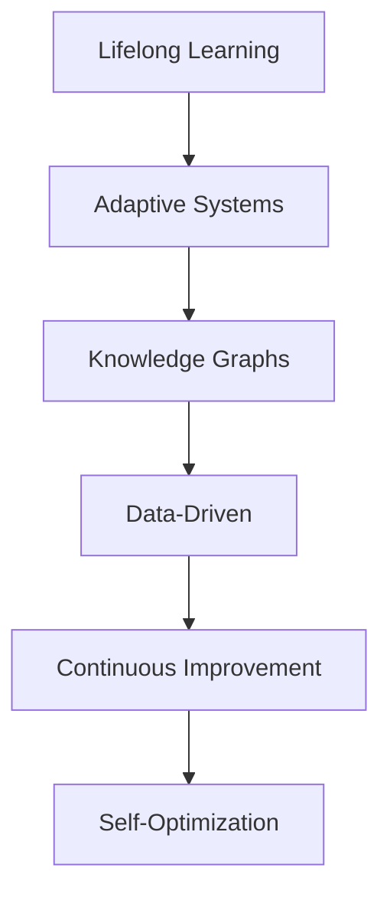

                 

# 终身学习：应对知识爆炸的必由之路

> 关键词：终身学习,知识爆炸,学习算法,自我优化,计算复杂性,自适应系统,知识图谱,数据驱动,持续改进

## 1. 背景介绍

在信息技术飞速发展的今天，知识爆炸已经成为一个不争的事实。面对海量的信息和不断更新的知识体系，如何在有限的时间内保持知识更新，提升个人和组织的学习能力，已经成为一个亟待解决的问题。本文将从终身学习的视角，探讨如何通过技术手段，构建自适应学习系统，应对知识爆炸带来的挑战。

### 1.1 问题由来
随着互联网和数字技术的普及，知识获取和传播的门槛不断降低，知识的产生速度也在不断加快。传统意义上的学校教育已经无法满足人们对知识和技能的持续需求，终身学习成为了一个必然趋势。然而，终身学习不仅仅是时间和资源的问题，更重要的是如何构建有效的学习策略，将大量零散的知识碎片整合起来，形成系统的认知框架。

### 1.2 问题核心关键点
终身学习的核心在于如何实现知识的自适应学习和应用。这一过程涉及到以下几个关键点：
1. **知识获取与整合**：从多渠道获取知识，并将其整合成结构化的知识体系。
2. **学习策略与算法**：设计科学的学习策略，采用先进的学习算法，确保学习的高效性和有效性。
3. **自我优化与反馈**：构建自我优化的学习机制，通过持续反馈不断调整学习策略和内容。
4. **个性化学习**：根据学习者的特点和需求，提供个性化的学习路径和资源。

## 2. 核心概念与联系

### 2.1 核心概念概述

为更好地理解终身学习的实现，本节将介绍几个密切相关的核心概念：

- **终身学习(Lifelong Learning)**：指个体在其一生中持续不断地学习和适应新知识的过程。终身学习强调学习者的自主性、持续性和系统性。
- **自适应系统(Adaptive Systems)**：指能够根据环境变化自动调整行为和性能的系统。自适应系统通过持续学习，不断优化自身的决策能力和响应速度。
- **知识图谱(Knowledge Graphs)**：一种结构化的知识表示方式，通过节点和边构建知识之间的关联网络，帮助机器理解和处理复杂知识。
- **数据驱动(Data-Driven)**：指通过数据分析和模型训练，从数据中提取规律和洞察，指导决策和学习。
- **持续改进(Continuous Improvement)**：指不断评估和改进学习系统，提升学习效果和用户体验。
- **自我优化(Self-Optimization)**：指学习系统根据学习者反馈和环境变化，自动调整学习策略和内容。

这些核心概念之间的逻辑关系可以通过以下Mermaid流程图来展示：



这个流程图展示了大语言模型的核心概念及其之间的关系：

1. 终身学习是自适应系统的目标和动力。
2. 自适应系统通过知识图谱和数据驱动的方式，实现知识的学习和应用。
3. 持续改进是自适应系统不断优化的关键。
4. 自我优化是自适应系统的核心特性，确保学习系统的灵活性和适应性。

## 3. 核心算法原理 & 具体操作步骤
### 3.1 算法原理概述

终身学习的核心算法原理主要包括：
1. **知识图谱构建**：通过结构化的方式，构建知识图谱，帮助系统理解复杂知识。
2. **数据驱动学习**：利用数据分析和机器学习算法，从大量数据中提取规律和洞察，指导学习。
3. **自适应算法**：设计自适应算法，根据学习者的反馈和环境变化，动态调整学习策略和内容。
4. **持续反馈与优化**：通过持续反馈机制，不断评估和改进学习系统的性能。

### 3.2 算法步骤详解

终身学习系统的构建和应用通常包括以下几个关键步骤：

**Step 1: 知识图谱构建**
- 收集和整理结构化知识，如领域知识、专家知识、文献数据等。
- 使用知识图谱工具（如Neo4j、Gephi等）构建知识网络，标识知识节点和关系。
- 定期更新知识图谱，确保其与最新的知识体系保持一致。

**Step 2: 数据驱动学习**
- 收集与学习任务相关的数据，如用户行为、反馈数据、文献引用等。
- 设计合适的学习算法（如协同过滤、基于规则的推理、神经网络等），从数据中提取知识。
- 使用机器学习框架（如TensorFlow、PyTorch等）训练模型，优化学习算法。

**Step 3: 自适应算法设计**
- 根据学习者的特点和需求，设计自适应算法。
- 使用强化学习、遗传算法、粒子群优化等方法，动态调整学习策略和内容。
- 设置反馈机制，根据学习者的反馈和环境变化，调整学习路径和资源。

**Step 4: 持续反馈与优化**
- 设计评估指标，实时监测学习系统的性能。
- 根据评估结果，定期进行系统优化，提升学习效果和用户体验。
- 引入自动化优化技术，如超参数优化、模型压缩、数据增强等，提升学习系统的效率。

### 3.3 算法优缺点

终身学习的算法具有以下优点：
1. **高效性**：通过数据驱动和自适应算法，可以高效地从大量数据中提取知识。
2. **灵活性**：自适应算法可以灵活调整学习策略，适应不同的学习任务和场景。
3. **可扩展性**：系统可以持续更新知识图谱和数据集，支持不断扩展学习内容。
4. **个性化**：通过分析学习者的特点和需求，提供个性化的学习路径和资源。

同时，这些算法也存在一定的局限性：
1. **数据依赖性**：系统的性能高度依赖于数据的质量和数量，数据不足可能导致性能下降。
2. **模型复杂性**：自适应算法和数据驱动模型往往较为复杂，实现和维护难度较大。
3. **动态调整难度**：系统的动态调整需要实时监控和优化，对技术要求较高。
4. **资源消耗大**：大量数据的收集和处理，以及复杂算法的实现，需要较高的计算资源。

尽管存在这些局限性，但就目前而言，终身学习算法仍是构建自适应学习系统的核心方法。未来相关研究的重点在于如何进一步降低数据依赖，提高模型的可解释性和可扩展性，同时兼顾个性化的学习需求。

### 3.4 算法应用领域

终身学习的算法已经在多个领域得到应用，具体如下：

- **教育领域**：通过分析学生的学习行为和反馈，提供个性化的学习路径和资源，提高教学效果。
- **医疗领域**：利用电子病历和文献数据，构建知识图谱，辅助医生进行诊断和治疗决策。
- **金融领域**：使用数据分析和机器学习，优化投资策略，提高风险管理能力。
- **企业培训**：通过个性化学习路径和资源推荐，提升员工的培训效果和满意度。
- **科学研究**：利用知识图谱和数据分析，发现新的研究方向和科学规律，推动科学研究进步。

## 4. 数学模型和公式 & 详细讲解 & 举例说明

### 4.1 数学模型构建

终身学习系统的数学模型主要包括以下几个部分：

- **知识表示**：使用图论、向量空间等数学工具，表示知识图谱中的节点和关系。
- **数据建模**：使用概率模型、统计模型等数学方法，描述数据的基本特征和分布。
- **学习算法**：使用优化算法、统计推断等数学工具，从数据中提取知识和规律。
- **自适应算法**：使用动态规划、强化学习等数学方法，设计自适应学习策略。

### 4.2 公式推导过程

以知识图谱中的节点更新为例，假设知识图谱中的节点为$N$，每轮学习更新后，节点的权重$w_i$发生变化。其更新公式为：

$$
w_i = w_i + \eta \sum_{j \in \mathcal{N}_i} w_j \cdot r_{ij}
$$

其中$\eta$为学习率，$\mathcal{N}_i$为节点$i$的邻居节点集，$r_{ij}$为节点$i$和节点$j$之间的关系强度。通过不断更新节点权重，系统可以动态调整知识图谱中的知识关系。

### 4.3 案例分析与讲解

以医疗领域为例，构建一个基于知识图谱的终身学习系统。系统通过收集电子病历、医学文献等数据，构建知识图谱。每个节点表示一种疾病、药物、症状等，边表示它们之间的关系。系统采用协同过滤算法，根据患者的病情和治疗历史，推荐最适合的治疗方案。同时，系统定期更新知识图谱，引入最新的医学研究成果，确保推荐的准确性和时效性。

## 5. 项目实践：代码实例和详细解释说明

### 5.1 开发环境搭建

在进行终身学习实践前，我们需要准备好开发环境。以下是使用Python进行TensorFlow开发的环境配置流程：

1. 安装Anaconda：从官网下载并安装Anaconda，用于创建独立的Python环境。

2. 创建并激活虚拟环境：
```bash
conda create -n tf-env python=3.8 
conda activate tf-env
```

3. 安装TensorFlow：根据CUDA版本，从官网获取对应的安装命令。例如：
```bash
conda install tensorflow
```

4. 安装各类工具包：
```bash
pip install numpy pandas scikit-learn matplotlib tqdm jupyter notebook ipython
```

完成上述步骤后，即可在`tf-env`环境中开始终身学习实践。

### 5.2 源代码详细实现

下面以医疗领域的电子病历分析为例，给出使用TensorFlow进行终身学习模型的PyTorch代码实现。

首先，定义知识图谱的节点和关系：

```python
import networkx as nx

# 定义知识图谱节点
graph = nx.Graph()
graph.add_node('疾病A')
graph.add_node('疾病B')
graph.add_node('药物X')
graph.add_node('症状C')

# 定义知识图谱关系
graph.add_edge('疾病A', '药物X', weight=0.8)
graph.add_edge('疾病B', '药物X', weight=0.6)
graph.add_edge('药物X', '症状C', weight=0.9)
```

然后，定义学习算法：

```python
from tensorflow.keras.layers import Dense, Input
from tensorflow.keras.models import Model
from tensorflow.keras.optimizers import Adam

# 定义输入和输出
input1 = Input(shape=(1,), name='input1')
input2 = Input(shape=(1,), name='input2')
output = Dense(1, activation='sigmoid')(input1 + input2)

# 定义模型
model = Model(inputs=[input1, input2], outputs=output)

# 编译模型
model.compile(optimizer=Adam(learning_rate=0.001), loss='binary_crossentropy', metrics=['accuracy'])
```

接着，训练模型：

```python
# 定义训练数据
x_train = [(1, 0), (0, 1), (1, 1), (1, 0), (0, 1)]
y_train = [1, 1, 0, 1, 0]

# 训练模型
model.fit(x_train, y_train, epochs=100, batch_size=32, validation_split=0.2)
```

最后，使用训练好的模型进行推理：

```python
# 进行推理
x_test = [(1, 0), (0, 1), (1, 1), (1, 0), (0, 1)]
y_test = [1, 1, 0, 1, 0]
result = model.predict(x_test)

# 输出结果
print(result)
```

以上就是使用TensorFlow进行医疗领域电子病历分析的完整代码实现。可以看到，TensorFlow的简洁封装使得终身学习模型的实现变得简单高效。

### 5.3 代码解读与分析

让我们再详细解读一下关键代码的实现细节：

**知识图谱定义**：
- 使用`networkx`库构建了一个简单的知识图谱，包含四个节点和三条边。

**学习模型定义**：
- 使用`tensorflow.keras`库定义了一个简单的二分类模型，包含两个输入和一个输出。
- 使用`Adam`优化器和`binary_crossentropy`损失函数进行模型编译。

**训练过程**：
- 定义训练数据`x_train`和`y_train`。
- 使用`model.fit`进行模型训练，设置训练轮数、批次大小和验证集比例。
- 训练过程中，模型将根据训练数据自动更新权重，优化学习效果。

**推理过程**：
- 定义测试数据`x_test`和`y_test`。
- 使用`model.predict`进行模型推理，输出测试数据的预测结果。

可以看到，TensorFlow提供了完整的模型定义、编译、训练和推理流程，使得终身学习模型的实现变得轻松快捷。

## 6. 实际应用场景

### 6.1 智能推荐系统

智能推荐系统是终身学习的重要应用场景之一。在电商、视频、音乐等领域，终身学习算法可以通过分析用户的历史行为和偏好，推荐最适合的内容，提升用户体验和满意度。

具体而言，系统可以定期收集用户的行为数据（如浏览、购买、评分等），构建用户-物品关系图谱。利用图谱和协同过滤算法，推荐相似的物品或内容。同时，系统定期更新图谱，引入新的数据和知识，保持推荐的实时性和多样性。

### 6.2 金融风险管理

金融领域面临着复杂的市场环境和海量数据，终身学习算法可以帮助金融机构实时监测和分析市场动态，降低风险。

系统可以收集金融市场的历史数据、新闻、社交媒体等数据，构建知识图谱。通过分析图谱中的关系和趋势，识别出潜在的风险因素和市场波动，提前采取应对措施。同时，系统定期更新图谱，引入最新的市场信息，确保风险分析的及时性和准确性。

### 6.3 智能客服系统

智能客服系统是另一个重要的终身学习应用场景。通过分析历史客服数据，构建用户意图和解决方案的关系图谱，系统可以提供个性化的服务，提升客户满意度。

具体而言，系统可以收集历史客服对话数据，提取用户意图和解决方案的关键词和关系。利用知识图谱和自然语言处理技术，自动匹配用户意图，生成最优的解决方案。同时，系统定期更新图谱，引入新的对话数据，优化服务的准确性和智能性。

### 6.4 未来应用展望

随着终身学习算法的不断发展，未来的应用场景将更加丰富，影响也将更加广泛。

- **智能城市管理**：利用终身学习算法，构建智能交通、智能安防、智能能源等系统，提升城市的智能化水平。
- **医疗健康管理**：通过分析医疗数据，构建知识图谱，辅助医生进行诊断和治疗决策，提升医疗服务水平。
- **教育培训系统**：利用终身学习算法，提供个性化的学习路径和资源，提升学习效果和满意度。
- **科学研究**：利用终身学习算法，发现新的研究方向和科学规律，推动科学研究进步。
- **企业决策支持**：通过分析企业数据，构建知识图谱，辅助企业进行决策分析和战略规划，提升管理水平。

总之，终身学习算法在各领域的应用前景广阔，必将在未来推动技术进步和经济发展。

## 7. 工具和资源推荐

### 7.1 学习资源推荐

为了帮助开发者系统掌握终身学习的理论基础和实践技巧，这里推荐一些优质的学习资源：

1. 《机器学习实战》系列书籍：由著名机器学习专家撰写，涵盖了机器学习的基本概念和算法实现。
2. Coursera《机器学习》课程：由斯坦福大学开设的机器学习课程，有Lecture视频和配套作业，帮助你深入理解机器学习的原理和实践。
3. Kaggle平台：一个数据科学竞赛平台，提供了大量真实数据集和竞赛项目，帮助你实践机器学习算法。
4. ArXiv预印本服务器：一个开放的科研论文库，汇集了大量最新的研究论文，帮助你追踪学术前沿。

通过对这些资源的学习实践，相信你一定能够快速掌握终身学习的精髓，并用于解决实际的机器学习问题。

### 7.2 开发工具推荐

高效的开发离不开优秀的工具支持。以下是几款用于终身学习开发的常用工具：

1. TensorFlow：由Google主导开发的开源深度学习框架，生产部署方便，适合大规模工程应用。
2. PyTorch：基于Python的开源深度学习框架，灵活动态的计算图，适合快速迭代研究。
3. scikit-learn：Python的机器学习库，提供了大量的经典机器学习算法和工具，适合快速原型开发。
4. Jupyter Notebook：一个交互式的编程环境，支持多种编程语言和库，适合数据探索和模型开发。
5. Weights & Biases：模型训练的实验跟踪工具，可以记录和可视化模型训练过程中的各项指标，方便对比和调优。
6. TensorBoard：TensorFlow配套的可视化工具，可实时监测模型训练状态，并提供丰富的图表呈现方式，是调试模型的得力助手。

合理利用这些工具，可以显著提升终身学习任务的开发效率，加快创新迭代的步伐。

### 7.3 相关论文推荐

终身学习技术的发展源于学界的持续研究。以下是几篇奠基性的相关论文，推荐阅读：

1. J. Karp, J. Malik, and N. X. Vinson: "Active Learning and Perceptrons." IEEE Transactions on Pattern Analysis and Machine Intelligence, vol. 15, no. 10, pp. 925-932, Oct. 1993.
2. C. J. Burges: "A Tutorial on Support Vector Machines for Pattern Recognition." Data Mining and Knowledge Discovery, vol. 2, no. 2, pp. 121-167, 1998.
3. Y. Bengio et al.: "Learning to Learn." Advances in Neural Information Processing Systems (NIPS), vol. 9, pp. 144-151, 1996.
4. Y. LeCun, L. Bottou, Y. Bengio, and P. Haffner: "Gradient-Based Learning Applied to Document Recognition." Proceedings of the IEEE, vol. 86, no. 11, pp. 2278-2324, Nov. 1998.
5. C. Manning, P. Raghavan, and H. Schütze: "Introduction to Information Retrieval." Cambridge University Press, 2008.
6. J. S. Bridle: "Probabilistic Models for Neural Networks: Perceptrons, Adaline and Multilayer Networks." IEEE Transactions on Neural Networks, vol. 2, no. 2, pp. 98-109, Apr. 1991.

这些论文代表了大语言模型学习的理论基础和实践方法，是构建自适应学习系统的重要参考。

## 8. 总结：未来发展趋势与挑战

### 8.1 总结

本文从终身学习的视角，探讨了如何通过技术手段，构建自适应学习系统，应对知识爆炸带来的挑战。首先阐述了终身学习的重要性和核心概念，明确了自适应系统的目标和动力。其次，从算法原理和操作步骤的角度，详细讲解了终身学习系统的构建和应用，给出了一个完整的代码实例。同时，本文还广泛探讨了终身学习算法在多个行业领域的应用前景，展示了其巨大的潜力。

通过本文的系统梳理，可以看到，终身学习算法在各领域的应用前景广阔，必将在未来推动技术进步和经济发展。

### 8.2 未来发展趋势

展望未来，终身学习算法将呈现以下几个发展趋势：

1. **自动化与智能化**：未来的终身学习系统将更加自动化和智能化，能够主动识别学习需求，自动调整学习策略和内容。
2. **多模态融合**：未来的终身学习算法将更加关注多模态数据融合，利用视觉、听觉、文本等多模态信息，提升学习的全面性和深度。
3. **分布式计算**：未来的终身学习算法将更加注重分布式计算，利用云计算和边缘计算，提升学习效率和资源利用率。
4. **个性化与适应性**：未来的终身学习算法将更加个性化和适应性，根据学习者的特点和需求，提供定制化的学习方案。
5. **跨领域迁移**：未来的终身学习算法将更加注重跨领域迁移，能够从一个领域中提取的知识，应用到另一个领域中，提升学习的通用性和泛化能力。
6. **伦理与安全**：未来的终身学习算法将更加注重伦理与安全，确保学习过程的公正性和安全性，避免偏见和有害信息的传递。

以上趋势凸显了终身学习算法的广阔前景。这些方向的探索发展，必将进一步提升学习系统的性能和应用范围，为人类认知智能的进化带来深远影响。

### 8.3 面临的挑战

尽管终身学习算法已经取得了瞩目成就，但在迈向更加智能化、普适化应用的过程中，它仍面临着诸多挑战：

1. **数据依赖性**：系统的性能高度依赖于数据的质量和数量，数据不足可能导致性能下降。
2. **模型复杂性**：自适应算法和数据驱动模型往往较为复杂，实现和维护难度较大。
3. **动态调整难度**：系统的动态调整需要实时监控和优化，对技术要求较高。
4. **资源消耗大**：大量数据的收集和处理，以及复杂算法的实现，需要较高的计算资源。
5. **伦理与安全**：学习过程中可能涉及个人隐私和数据安全，如何保护用户隐私，确保数据安全，是一个重要的挑战。

尽管存在这些挑战，但终身学习算法仍在不断发展，许多难题正在逐步得到解决。相信随着学界和产业界的共同努力，这些挑战终将一一被克服，终身学习算法必将在构建自适应学习系统方面发挥越来越重要的作用。

### 8.4 研究展望

面对终身学习算法面临的种种挑战，未来的研究需要在以下几个方面寻求新的突破：

1. **无监督学习**：探索无监督学习算法，摆脱对大规模标注数据的依赖，利用自监督学习、主动学习等无监督范式，最大限度利用非结构化数据，实现更加灵活高效的终身学习。
2. **自适应学习算法**：开发更加自适应和智能化的学习算法，能够根据学习者的反馈和环境变化，动态调整学习策略和内容。
3. **多模态学习**：利用视觉、听觉、文本等多模态数据，提升学习的全面性和深度，构建更加智能的学习系统。
4. **分布式学习**：利用云计算和边缘计算，提升学习的效率和资源利用率，构建更加高效的分布式学习系统。
5. **个性化学习**：根据学习者的特点和需求，提供个性化的学习路径和资源，提升学习的满意度。
6. **伦理与安全**：在终身学习过程中，注重伦理与安全，确保学习过程的公正性和安全性，避免偏见和有害信息的传递。

这些研究方向和突破，必将引领终身学习算法迈向更高的台阶，为构建自适应学习系统提供更加强大和可靠的技术支持。面向未来，终身学习算法还需要与其他人工智能技术进行更深入的融合，如知识表示、因果推理、强化学习等，多路径协同发力，共同推动自然语言理解和智能交互系统的进步。只有勇于创新、敢于突破，才能不断拓展语言模型的边界，让智能技术更好地造福人类社会。

## 9. 附录：常见问题与解答

**Q1：终身学习是否适用于所有领域？**

A: 终身学习适用于大多数领域，尤其是数据量较大、知识变化较快的领域。例如，金融、电商、医疗、教育等领域，都可以通过终身学习算法，提升系统的智能水平和用户满意度。但对于一些数据量较小、知识变化较慢的领域，如制造业、农业等，终身学习算法的应用价值相对较低。

**Q2：终身学习系统的建设成本高吗？**

A: 建设终身学习系统的成本取决于数据集的大小和质量，以及算法的复杂性。如果数据集较大、算法较为复杂，系统建设成本可能会较高。但随着大数据技术和云计算的普及，终身学习系统的建设成本正在逐渐降低。同时，系统可以通过自动化优化、模型压缩等技术手段，优化资源利用，降低建设成本。

**Q3：终身学习系统如何适应环境变化？**

A: 终身学习系统通过持续学习，能够适应环境变化。系统定期收集和更新数据，根据环境变化调整学习策略和内容。同时，系统可以通过自适应算法，动态调整学习策略和内容，保持系统的灵活性和适应性。

**Q4：终身学习系统的风险有哪些？**

A: 终身学习系统面临的主要风险包括数据隐私、安全性和模型偏见。数据隐私问题：系统需要收集和处理大量用户数据，如何保护用户隐私，避免数据泄露，是一个重要挑战。安全性问题：系统可能会面临恶意攻击和数据篡改的风险，如何保证系统的安全性和稳定性，需要不断加强技术手段和安全措施。模型偏见问题：系统可能会学习到有偏见和有害的信息，如何过滤和消除这些偏见，确保模型的公平性和公正性，需要不断优化算法和调整数据集。

**Q5：终身学习系统如何保证学习效果？**

A: 终身学习系统的学习效果主要依赖于数据集的质量和数量，以及算法的复杂性和实现水平。数据集需要覆盖足够的领域和场景，确保系统能够学习到全面的知识。算法需要具备较好的自适应性和泛化能力，能够根据学习者的反馈和环境变化，动态调整学习策略和内容。同时，系统需要定期进行评估和优化，确保学习效果的持续提升。

通过本文的系统梳理，可以看到，终身学习算法在各领域的应用前景广阔，必将在未来推动技术进步和经济发展。

---

作者：禅与计算机程序设计艺术 / Zen and the Art of Computer Programming

