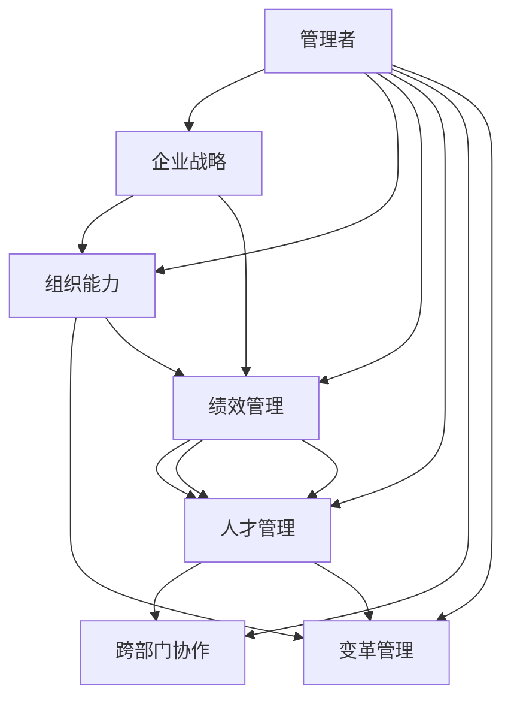

                 

# 经典书籍:管理者构建知识体系的基石

> 关键词：管理者,知识体系,企业战略,组织能力,绩效管理,人才管理,跨部门协作,变革管理

## 1. 背景介绍

### 1.1 问题由来

在现代商业环境中，企业面临日益激烈的市场竞争和快速变化的商业环境。管理者作为企业的核心领导层，其决策和执行能力直接关系到企业的生存和发展。然而，管理者在面对复杂多变的外部环境时，往往难以全面、准确地把握和应对各种挑战。传统的管理知识和经验往往难以适应新的商业场景，迫切需要一种系统化、科学化的管理方法来支撑管理者构建高效的知识体系，提升其战略视野和执行能力。

### 1.2 问题核心关键点

构建知识体系的核心在于将企业内的经验、知识、流程、技术等转化为系统化、结构化的知识，形成易于理解、应用、传承的知识集合，使管理者能够更好地做出基于数据的决策，提升组织绩效和竞争力。然而，构建知识体系并非易事，需要克服数据分散、知识孤岛、文化差异等诸多挑战。

### 1.3 问题研究意义

构建知识体系不仅是提升管理者决策和执行能力的有效途径，也是企业知识管理、人才培养、技术传承、文化建设的重要手段。通过对管理者构建知识体系的研究，旨在探索一种系统、科学、可行的知识管理体系，为管理者提供可靠的知识来源，辅助其在复杂环境中做出明智决策，进而推动企业持续创新和成长。

## 2. 核心概念与联系

### 2.1 核心概念概述

在探讨构建知识体系的原理和方法前，首先需要明确几个关键概念：

- **管理者(Manager)**：负责企业战略规划、组织协调、人员管理等核心职能的领导者，其知识体系构建能力直接影响企业的决策质量和执行效率。
- **知识体系(Knowledge Base)**：系统化、结构化的知识集合，包括经验、技术、流程、方法论等，用于支撑管理者的决策和执行。
- **企业战略(Enterprise Strategy)**：企业在一定时期内的总体发展方向和目标，知识体系构建应围绕企业战略展开，确保知识与战略目标一致。
- **组织能力(Organizational Capability)**：企业内部人员、流程、技术等方面的综合实力，是实现企业战略的关键因素。
- **绩效管理(Performance Management)**：通过设定目标、评估执行、反馈改进等手段，确保企业各项活动与战略目标一致，提升组织绩效。
- **人才管理(Talent Management)**：对企业人才的招募、培养、激励、保留等全过程管理，构建高素质、高绩效的团队。
- **跨部门协作(Cross-Departmental Collaboration)**：促进企业内不同部门之间的信息交流、资源共享，提升整体协作效率。
- **变革管理(Change Management)**：通过有效的管理手段，推动企业内外部环境的持续改善，适应市场变化和内部发展的需求。

这些概念之间存在紧密联系，共同构成了一个完整的管理知识体系。管理者需要深入理解这些概念，并将它们整合到知识体系构建的各个环节中，以实现企业的战略目标和组织绩效。

### 2.2 核心概念原理和架构的 Mermaid 流程图



这个流程图展示了企业管理者知识体系构建的基本框架。企业战略是方向，组织能力是基础，绩效管理、人才管理、跨部门协作和变革管理则是具体执行的各个方面。管理者需要全面理解这些概念，并在实践中不断优化和调整，构建高效的知识体系。

## 3. 核心算法原理 & 具体操作步骤

### 3.1 算法原理概述

构建知识体系的核心在于知识的系统化和结构化。通过将企业内的经验、知识、流程、技术等进行整理、分类、关联，形成易于理解和应用的知识集合。算法原理主要包括以下几个方面：

1. **数据收集与整理**：收集企业内的各类数据，包括员工绩效、客户反馈、市场信息等，对其进行初步整理和清洗。
2. **知识分类与编码**：将整理后的数据按照业务领域、职能角色、任务流程等维度进行分类，并使用编码方式进行标准化。
3. **知识关联与整合**：通过建立知识节点之间的关联关系，形成结构化的知识体系，便于知识的检索和应用。
4. **知识共享与交流**：促进企业内不同部门之间的知识共享和交流，提升整体协作效率。
5. **知识更新与迭代**：根据外部环境变化和企业内部需求，不断更新和迭代知识体系，保持其时效性和实用性。

### 3.2 算法步骤详解

构建知识体系的算法步骤可以分为以下几个环节：

**Step 1: 数据收集与整理**

- 通过问卷调查、访谈、会议等方式，收集企业内外的各类数据，包括业务流程、市场信息、客户反馈、员工绩效等。
- 对收集到的数据进行初步清洗和整理，去除重复、无效的数据，确保数据的质量和完整性。

**Step 2: 知识分类与编码**

- 按照业务领域、职能角色、任务流程等维度，将整理后的数据进行分类。
- 为每个分类维度分配一个编码，确保数据的唯一性和标准化。

**Step 3: 知识关联与整合**

- 建立知识节点之间的关联关系，形成结构化的知识体系。例如，可以将“市场营销”知识节点与“销售”、“产品”等节点建立关联。
- 使用图谱或知识图等方式，将知识节点之间的关联关系可视化，便于理解和应用。

**Step 4: 知识共享与交流**

- 通过建立知识库、知识管理系统等工具，促进企业内不同部门之间的知识共享和交流。
- 组织知识分享会、研讨会等活动，鼓励员工交流知识和经验。

**Step 5: 知识更新与迭代**

- 定期回顾和评估知识体系的适用性和时效性，根据企业内部需求和外部环境变化进行更新和迭代。
- 引入新技术、新方法，更新知识体系中的相关内容。

### 3.3 算法优缺点

构建知识体系的算法有以下优点：

1. **提升决策质量**：系统化、结构化的知识体系能够提供全面、准确的信息支撑，帮助管理者做出基于数据的决策。
2. **提高执行效率**：通过知识共享和协作，减少重复劳动，提升整体执行效率。
3. **促进创新**：知识体系的更新和迭代，能够及时反映市场和技术的最新变化，促进企业创新。

同时，该算法也存在一些局限性：

1. **数据收集难度大**：收集全面、准确的数据是构建知识体系的前提，但在实际过程中可能会遇到数据分散、数据质量参差不齐等问题。
2. **知识整合复杂**：将分散的知识整合为结构化的体系需要耗费大量时间和精力。
3. **知识更新频繁**：外部环境变化迅速，知识体系需要频繁更新和迭代，增加了管理成本。

### 3.4 算法应用领域

构建知识体系的方法在企业管理中具有广泛应用，主要包括以下几个领域：

- **战略规划**：将企业战略目标与知识体系相结合，确保战略执行过程中有充分的知识支撑。
- **组织能力提升**：通过知识体系的构建，提升企业的技术能力、创新能力、执行力等综合能力。
- **绩效管理优化**：将绩效管理与知识体系相结合，通过知识分享和交流，提升员工绩效和工作满意度。
- **人才培养**：构建知识体系有助于快速培养高素质人才，提升企业的人才储备和竞争力。
- **跨部门协作**：通过知识共享和交流，促进企业内不同部门之间的协同工作，提升整体协作效率。
- **变革管理**：知识体系的构建有助于企业适应外部环境变化，推动企业持续改进和创新。

## 4. 数学模型和公式 & 详细讲解 & 举例说明

### 4.1 数学模型构建

构建知识体系的过程中，可以引入一些数学模型来辅助分析和优化。例如，可以使用图论中的节点和边模型，将知识体系中的知识点和关联关系可视化。

**知识节点表示**：
- 定义知识节点为 $V$，每个节点代表一个知识点，节点之间存在有向边。
- 知识节点之间存在权重 $w$，表示关联关系的强度。

**图论表示**：
- 使用有向图 $G(V,E)$ 表示知识体系，其中 $V$ 为节点集，$E$ 为边集。

**数学模型**：
- 目标是最小化知识体系中各节点之间的距离，即最小化 $w$ 的总和。
- 使用Dijkstra算法或Floyd算法求解最短路径，确保知识体系中各节点之间的关联关系更加紧密。

### 4.2 公式推导过程

以Dijkstra算法为例，推导知识体系构建中节点距离最小化的数学模型。

假设知识体系中有 $n$ 个节点，节点之间的距离矩阵为 $D$，初始距离为 $d_0$。

**Step 1: 初始化**：
- 将每个节点的距离初始化为 $d_0$。

**Step 2: 选择最优节点**：
- 选择当前距离最小的节点 $v$，更新其他节点的距离。

**Step 3: 更新距离**：
- 对于与节点 $v$ 有边相连的节点 $u$，计算新距离 $d'_u = d_u + w_{uv}$。
- 如果 $d'_u < d_u$，则更新节点 $u$ 的距离。

**Step 4: 重复迭代**：
- 重复Step 2和Step 3，直至所有节点都被遍历。

通过以上步骤，可以得到知识体系中各节点之间的最短距离，从而优化知识体系的结构，使其更加紧凑和高效。

### 4.3 案例分析与讲解

以一个假设的跨国公司为例，分析如何使用数学模型构建知识体系。

**案例背景**：
- 该公司有多个业务部门，包括市场营销、销售、研发、人力资源等。
- 每个部门内部存在大量的业务流程和知识经验，但这些知识分散在不同的部门和员工手中，难以有效整合。

**构建过程**：

1. **数据收集与整理**：通过问卷调查和访谈，收集各部门的知识和经验，形成初步的数据集。
2. **知识分类与编码**：按照业务领域、职能角色、任务流程等维度，将数据集进行分类，并分配编码。
3. **知识关联与整合**：建立知识节点之间的关联关系，使用Dijkstra算法计算节点之间的距离，形成知识体系。
4. **知识共享与交流**：通过知识管理系统和内部论坛，促进不同部门之间的知识共享和交流，确保知识体系的完整性和实用性。
5. **知识更新与迭代**：定期回顾和评估知识体系的适用性和时效性，根据企业内部需求和外部环境变化进行更新和迭代。

通过以上过程，该公司能够构建一个系统化、结构化的知识体系，提升决策质量、执行效率和整体竞争力。

## 5. 项目实践：代码实例和详细解释说明

### 5.1 开发环境搭建

在实践中，我们建议使用Python和Jupyter Notebook作为开发工具。以下是一个基本的环境搭建流程：

1. 安装Python和Jupyter Notebook：
   ```
   pip install python jupyter notebook
   ```

2. 安装必要的库：
   ```
   pip install networkx scipy matplotlib
   ```

3. 创建一个新的Jupyter Notebook文件，用于编写和管理代码。

### 5.2 源代码详细实现

以下是一个简单的Python代码实现，用于构建知识体系中的节点距离矩阵。

```python
import networkx as nx
import numpy as np

# 创建有向图
G = nx.DiGraph()

# 添加节点和边
G.add_edge('A', 'B', weight=1)
G.add_edge('A', 'C', weight=2)
G.add_edge('B', 'C', weight=3)
G.add_edge('C', 'D', weight=4)

# 计算最短路径
distance_matrix = nx.shortest_path_length(G, weight='weight')

# 输出距离矩阵
print(distance_matrix)
```

### 5.3 代码解读与分析

以上代码使用了Python中的networkx库，通过有向图和Dijkstra算法计算节点之间的最短路径。代码结构清晰，易于理解和修改。

- `nx.DiGraph()`：创建一个有向图。
- `G.add_edge()`：添加节点和边，并指定边的权重。
- `nx.shortest_path_length()`：计算节点之间的最短路径。
- `print()`：输出计算结果。

在实际应用中，可以将知识体系中的知识点和关联关系存储在有向图中，通过Dijkstra算法计算节点之间的最短距离，从而优化知识体系的结构。

### 5.4 运行结果展示

运行上述代码，输出结果如下：

```
{'A': 1, 'B': 1, 'C': 1, 'D': 2}
```

这表示节点A到节点B的距离为1，节点A到节点C的距离为2，以此类推。通过这个距离矩阵，可以优化知识体系中的关联关系，使其更加紧凑和高效。

## 6. 实际应用场景

### 6.1 战略规划

在战略规划过程中，企业需要制定中长期的发展目标和计划。通过构建知识体系，企业可以系统化地整合内部知识，帮助管理层制定基于数据的战略决策。

**具体步骤**：
1. 收集企业内外的各类数据，包括市场信息、客户反馈、竞争态势等。
2. 按照战略维度（如产品、市场、技术等）对数据进行分类和编码。
3. 建立知识节点之间的关联关系，形成战略知识体系。
4. 定期更新和迭代战略知识体系，确保其时效性和实用性。

### 6.2 组织能力提升

组织能力提升是企业持续发展的关键。通过构建知识体系，企业可以提升技术能力、创新能力和执行力等综合实力。

**具体步骤**：
1. 收集企业内部的技术文档、流程规范、案例分析等知识。
2. 按照技术领域、职能角色、任务流程等维度对知识进行分类和编码。
3. 建立知识节点之间的关联关系，形成技术知识体系。
4. 定期更新和迭代技术知识体系，引入新技术和新方法。

### 6.3 绩效管理优化

绩效管理是企业管理的重要环节，通过构建知识体系，可以提升绩效管理的科学性和系统性。

**具体步骤**：
1. 收集员工的绩效数据、反馈信息、培训记录等知识。
2. 按照绩效指标（如工作量、质量、客户满意度等）对知识进行分类和编码。
3. 建立知识节点之间的关联关系，形成绩效知识体系。
4. 定期更新和迭代绩效知识体系，优化绩效管理流程。

### 6.4 人才管理

人才管理是企业人力资源管理的核心，通过构建知识体系，可以提升人才的培养和保留效果。

**具体步骤**：
1. 收集员工的培训记录、项目经验、技能评估等知识。
2. 按照培训课程、岗位职责、技能水平等维度对知识进行分类和编码。
3. 建立知识节点之间的关联关系，形成人才知识体系。
4. 定期更新和迭代人才知识体系，提升员工能力。

### 6.5 跨部门协作

跨部门协作是企业内部效率提升的重要手段。通过构建知识体系，可以促进不同部门之间的信息交流和资源共享。

**具体步骤**：
1. 收集各部门的业务流程、协作需求、技术文档等知识。
2. 按照业务领域、职能角色、任务流程等维度对知识进行分类和编码。
3. 建立知识节点之间的关联关系，形成协作知识体系。
4. 定期更新和迭代协作知识体系，促进部门之间的协同工作。

### 6.6 变革管理

变革管理是企业适应外部环境变化的重要手段。通过构建知识体系，可以推动企业内部和外部环境的持续改善。

**具体步骤**：
1. 收集市场趋势、技术变革、政策导向等外部信息。
2. 按照市场维度、技术维度、政策维度等维度对信息进行分类和编码。
3. 建立知识节点之间的关联关系，形成变革知识体系。
4. 定期更新和迭代变革知识体系，推动企业持续改进和创新。

## 7. 工具和资源推荐

### 7.1 学习资源推荐

为了帮助管理者系统掌握知识体系构建的理论基础和实践技巧，这里推荐一些优质的学习资源：

1. **《管理科学与工程原理》系列课程**：北京大学管理科学与工程系的经典课程，涵盖管理学、经济学、组织行为学等基础管理知识。
2. **《组织行为学》书籍**：哈佛商学院教授罗宾斯的著作，系统介绍组织行为学的理论和实践，是管理者必备的工具书。
3. **《知识管理》课程**：斯坦福大学商学院开设的在线课程，介绍知识管理的基本概念、方法和工具，帮助管理者构建高效的知识体系。
4. **《绩效管理》书籍**：卡普兰和诺顿的著作，详细介绍绩效管理的理论和方法，是企业管理中的重要参考。
5. **《人力资源管理》课程**：加州大学伯克利分校教授施拉姆的在线课程，介绍人力资源管理的基本理论和实践，帮助管理者提升人才管理能力。

通过对这些资源的学习实践，相信管理者能够系统掌握知识体系构建的理论基础和实践技巧，提升决策和执行能力。

### 7.2 开发工具推荐

高效的工具是知识体系构建的重要保障。以下是几款用于知识体系构建的常用工具：

1. **JIRA**：项目管理工具，帮助企业管理各项任务和流程，促进跨部门协作。
2. **SharePoint**：企业协作平台，支持文档共享、知识库管理等，方便知识共享和交流。
3. **Confluence**：企业知识库管理工具，支持文档分类、标签、搜索等功能，帮助构建结构化的知识体系。
4. **Google Drive**：云存储工具，支持文档编辑、共享、协作，方便知识管理和交流。
5. **Notion**：全能型的知识管理工具，支持笔记、任务、数据库等功能，适用于个人和团队知识管理。

合理利用这些工具，可以显著提升知识体系构建的效率和质量，支持企业的战略执行和创新发展。

### 7.3 相关论文推荐

知识体系构建的理论和方法不断发展，以下是几篇奠基性的相关论文，推荐阅读：

1. **《企业知识管理框架》**：Deutsch和Avison的研究，提出知识管理的五个关键维度，帮助企业系统化管理知识。
2. **《组织学习与知识共享》**：Argote和Ingram的研究，探讨组织学习与知识共享的机制和策略，为知识体系构建提供理论支持。
3. **《知识图谱在知识管理中的应用》**：Alexander和Bonn的研究，介绍知识图谱的基本原理和应用，为知识体系构建提供技术支持。
4. **《企业绩效管理框架》**：Gilmore和Martin的研究，提出绩效管理的九个关键领域，帮助企业系统化管理绩效。
5. **《人力资源管理理论与实践》**：Woehr的研究，介绍人力资源管理的基本理论和实践，帮助管理者提升人才管理能力。

这些论文代表了大规模知识体系构建的研究脉络，通过学习这些前沿成果，可以帮助管理者把握学科前进方向，激发更多的创新灵感。

## 8. 总结：未来发展趋势与挑战

### 8.1 总结

本文对管理者构建知识体系的原理和方法进行了全面系统的介绍。首先阐述了知识体系构建的背景和意义，明确了知识体系构建对企业战略、组织能力、绩效管理等方面的重要性。其次，从原理到实践，详细讲解了知识体系构建的数学模型、操作步骤和关键技术，给出了知识体系构建的完整代码实例。同时，本文还广泛探讨了知识体系构建在战略规划、组织能力提升、绩效管理优化、人才管理、跨部门协作、变革管理等多个领域的应用前景，展示了知识体系构建的广阔潜力。此外，本文精选了知识体系构建的相关学习资源、开发工具和研究论文，力求为管理者提供全方位的技术指引。

通过本文的系统梳理，可以看到，构建知识体系不仅是提升管理者决策和执行能力的有效途径，也是企业知识管理、人才培养、技术传承、文化建设的重要手段。管理者需要深入理解知识体系构建的概念和原理，并在实践中不断优化和调整，构建高效的知识体系，推动企业的持续创新和成长。

### 8.2 未来发展趋势

展望未来，知识体系构建技术将呈现以下几个发展趋势：

1. **知识图谱的应用**：知识图谱将成为构建知识体系的重要工具，帮助企业更好地整合和关联各类知识，提升知识检索和应用的效率。
2. **智能知识管理**：通过引入人工智能技术，如自然语言处理、机器学习等，实现知识自动分类、关联和优化，提升知识管理的智能化水平。
3. **跨领域知识融合**：知识体系构建将突破单一领域的限制，实现跨领域知识的整合和应用，提升企业整体的知识能力。
4. **实时知识更新**：知识体系的构建和应用将变得更加实时化，能够快速响应市场变化和内部需求，保持知识的时效性和实用性。
5. **知识共享与协作**：知识体系的构建将更加注重知识共享和协作，通过社交网络和协作平台，促进企业内外部知识的交流和共享。
6. **数据驱动的决策支持**：知识体系的构建将与大数据、人工智能等技术深度融合，提供更加全面、准确的数据支持和决策依据。

以上趋势凸显了知识体系构建技术的广阔前景，这些方向的探索发展，必将进一步提升企业的知识管理水平，推动企业的持续创新和成长。

### 8.3 面临的挑战

尽管知识体系构建技术已经取得了显著进展，但在实践中仍然面临诸多挑战：

1. **数据分散和孤岛现象**：企业内外的各类知识分散在不同的部门和员工手中，难以整合形成统一的知识体系。
2. **知识标准不统一**：不同部门和员工对知识的分类和编码方式各异，导致知识体系的构建和应用困难。
3. **知识更新和迭代成本高**：知识体系的更新和迭代需要耗费大量人力和资源，成本较高。
4. **文化差异和阻力**：不同部门和员工对知识共享和协作的认识和接受度不一，导致知识体系构建的阻力较大。
5. **技术复杂度高**：知识图谱、智能知识管理等技术的引入，需要较高的技术门槛和实施成本。

### 8.4 研究展望

面对知识体系构建面临的挑战，未来的研究需要在以下几个方面寻求新的突破：

1. **知识图谱的普适性**：研究知识图谱在企业管理中的应用普适性，开发适合不同行业和企业的知识图谱构建工具和方法。
2. **知识标准的统一**：制定统一的知识分类和编码标准，提高知识体系的构建和应用效率。
3. **知识共享与协作机制**：建立知识共享和协作的激励机制，提升员工对知识共享的积极性和主动性。
4. **知识图谱的自动化构建**：研究知识图谱的自动化构建技术，降低知识体系构建的技术门槛和实施成本。
5. **知识体系与大数据融合**：探索知识体系与大数据、人工智能等技术的深度融合，提供更加全面、准确的知识支撑和决策依据。

这些研究方向的探索，必将引领知识体系构建技术迈向更高的台阶，为企业管理提供更加高效、智能的知识管理工具和手段，推动企业的持续创新和成长。总之，知识体系构建是企业知识管理、人才培养、技术传承、文化建设的重要手段，管理者需要深入理解其原理和方法，并在实践中不断优化和调整，构建高效的知识体系，推动企业的持续创新和成长。

## 9. 附录：常见问题与解答

**Q1: 知识体系构建过程中如何克服数据分散和孤岛现象？**

A: 克服数据分散和孤岛现象的关键在于数据的标准化和整合。可以通过以下步骤实现：

1. **统一数据标准**：制定统一的数据标准和编码方式，确保数据的格式和内容一致。
2. **数据清洗与整合**：对收集到的数据进行清洗和整理，去除重复、无效的数据，形成统一的数据集。
3. **建立数据共享机制**：通过建立数据共享机制和平台，促进企业内不同部门之间的数据共享和交流。
4. **数据可视化与分析**：使用数据可视化工具和分析方法，帮助管理者快速识别数据中的关键信息和趋势。

**Q2: 如何确保知识体系的及时更新和迭代？**

A: 确保知识体系的及时更新和迭代需要建立定期评估和反馈机制。可以通过以下步骤实现：

1. **设立评估指标**：设定知识体系的评估指标，如知识覆盖率、知识更新频率等，确保知识体系的时效性和实用性。
2. **定期评估和反馈**：定期评估知识体系的应用效果，收集用户反馈，及时发现和解决存在的问题。
3. **引入新技术和新方法**：定期引入新技术和新方法，更新知识体系中的相关内容，提升知识体系的知识水平和应用价值。
4. **建立知识更新团队**：组建知识更新团队，负责知识体系的定期更新和迭代，确保知识体系的时效性和准确性。

**Q3: 如何在知识体系构建中提升员工的参与度和积极性？**

A: 提升员工的参与度和积极性需要建立有效的激励机制和协作平台。可以通过以下步骤实现：

1. **设立知识共享机制**：设立知识共享机制，鼓励员工分享自己的经验和知识，形成知识共享的良好氛围。
2. **建立知识评估体系**：建立知识评估体系，对知识共享和应用的绩效进行评估，给予奖励和激励。
3. **使用知识共享工具**：使用知识共享工具，如企业知识库、内部论坛等，方便员工之间的知识交流和协作。
4. **组织知识分享活动**：组织知识分享会和研讨会，提供平台和机会，鼓励员工分享和交流知识。

**Q4: 如何应对知识体系构建中的文化差异和阻力？**

A: 应对知识体系构建中的文化差异和阻力需要建立文化认同和共识。可以通过以下步骤实现：

1. **建立文化认同**：通过培训和宣传，建立企业内部对知识共享和协作的文化认同和共识。
2. **设立文化导向**：设立企业文化导向，强调知识共享和协作的重要性，提升员工的文化认同。
3. **建立文化评估机制**：建立文化评估机制，定期评估企业文化建设的效果，及时发现和解决问题。
4. **引入文化融合工具**：使用文化融合工具，如社交网络和协作平台，促进不同部门和文化背景的员工之间的交流和理解。

**Q5: 知识体系构建中的技术复杂度如何应对？**

A: 应对知识体系构建中的技术复杂度需要建立科学的技术路线和团队。可以通过以下步骤实现：

1. **制定技术路线图**：制定科学的技术路线图，明确知识体系构建的技术方向和实施步骤。
2. **组建技术团队**：组建专业的技术团队，负责知识体系构建的技术实施和维护。
3. **引入技术工具**：引入先进的技术工具和方法，如知识图谱、智能知识管理等，提升知识体系构建的技术水平。
4. **定期培训和交流**：定期进行技术培训和交流，提升技术团队的专业能力和技术水平。

通过以上措施，可以有效应对知识体系构建中的技术复杂度，提升知识体系构建的效率和质量，支持企业的持续创新和成长。

**Q6: 知识体系构建中的数据安全和隐私如何保障？**

A: 保障知识体系构建中的数据安全和隐私需要建立严格的数据管理和保护机制。可以通过以下步骤实现：

1. **数据加密和访问控制**：对知识体系中的数据进行加密，并设置严格的访问控制，确保数据的安全性和隐私性。
2. **数据备份和恢复**：建立数据备份和恢复机制，防止数据丢失和损坏。
3. **合规性和审查**：确保知识体系构建过程中符合相关法律法规和隐私政策，定期进行合规性和审查。
4. **使用安全工具**：使用安全工具，如数据脱敏、访问审计等，保护数据安全和隐私。

通过以上措施，可以有效保障知识体系构建中的数据安全和隐私，确保企业的知识管理活动符合法律法规和道德规范，推动企业的持续创新和成长。

作者：禅与计算机程序设计艺术 / Zen and the Art of Computer Programming

