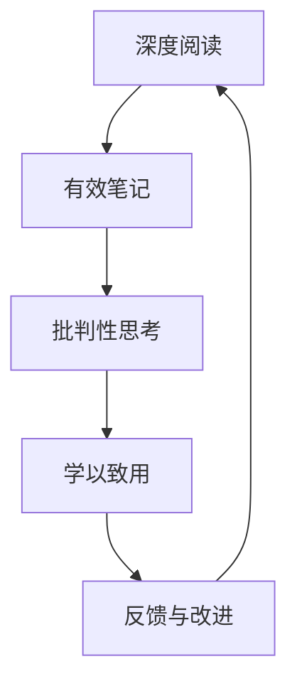

                 

# 经典管理著作的学习方法

> 关键词：经典管理著作,学习方法,深度阅读,有效笔记,批判性思考,学以致用

## 1. 背景介绍

### 1.1 问题由来

在当今快速变化的商业环境中，经典管理著作仍然具有深远的指导意义。这些著作不仅记录了管理学的历史演变，还提供了对组织和策略的深刻洞见。然而，如何有效学习和应用这些经典著作，是一个值得深入探讨的问题。

经典管理著作的深度和广度通常超出了简单阅读的表面层次。它们往往包含复杂的理论、丰富的案例分析和前沿思考。读者需要通过系统化的学习方法和实践，才能真正领悟其精髓。

### 1.2 问题核心关键点

经典管理著作的学习方法主要包括以下几个关键点：

1. **深度阅读**：不仅仅是表面理解，而是深入理解书中的理论、概念和案例。
2. **有效笔记**：通过系统化的笔记记录，整理和提炼知识要点，便于后续复习和应用。
3. **批判性思考**：对书中的观点和案例进行独立思考，结合现实问题进行验证和反思。
4. **学以致用**：将学到的理论应用到实际工作中，解决具体的管理问题。

本节将系统介绍以上方法，并通过具体的步骤和实例进行讲解。

## 2. 核心概念与联系

### 2.1 核心概念概述

- **深度阅读**：深入理解书中的内容，不仅仅是了解故事，而是探究作者的逻辑和推理。
- **有效笔记**：通过整理和总结，将知识要点内化，便于后续复习和应用。
- **批判性思考**：对书中的观点进行独立分析，提出自己的见解和改进建议。
- **学以致用**：将理论应用到实际工作中，解决管理问题。

这些方法并非孤立存在，而是相互支持，共同构成了一个完整的学习过程。通过深度阅读理解理论，通过有效笔记巩固知识，通过批判性思考提升理解，通过学以致用实现应用。

### 2.2 核心概念原理和架构的 Mermaid 流程图(Mermaid 流程节点中不要有括号、逗号等特殊字符)

这个流程图展示了深度阅读、有效笔记、批判性思考和学以致用的相互关系：

1. 深度阅读是学习的基础，帮助理解书籍的内容。
2. 有效笔记巩固知识要点，便于复习和应用。
3. 批判性思考提升理解深度，提出独立见解。
4. 学以致用将理论应用到实际工作，验证和改进。
5. 反馈与改进根据应用效果，对学习方法进行优化。

## 3. 核心算法原理 & 具体操作步骤

### 3.1 算法原理概述

经典管理著作的学习方法基于系统化、结构化的学习流程，旨在通过深度阅读、有效笔记、批判性思考和学以致用，全面掌握书籍内容，并将理论应用到实际管理中。

这种方法的核心在于通过反复阅读、整理和实践，不断深化理解，提升应用能力。具体步骤包括：

1. **深度阅读**：通过多次阅读，理解书籍的主线和论点。
2. **有效笔记**：通过系统化的笔记，整理和提炼知识要点。
3. **批判性思考**：结合现实问题，独立分析和验证书中的观点。
4. **学以致用**：将理论应用到实际工作中，解决具体问题。
5. **反馈与改进**：根据应用效果，不断优化学习方法。

### 3.2 算法步骤详解

以下详细介绍经典管理著作学习方法的详细步骤：

#### 3.2.1 深度阅读

1. **选择阅读材料**：选择与工作或兴趣相关的经典管理著作，如《管理学原理》、《卓有成效的管理者》等。
2. **多次阅读**：分阶段多次阅读，每次阅读聚焦不同的内容或观点。
   - 第一轮阅读：快速浏览全书，了解整体结构和大意。
   - 第二轮阅读：深入理解每个章节的主要观点和论据。
   - 第三轮阅读：详细解析每个案例，理解作者的分析思路。
3. **标记重要内容**：在阅读过程中，标记关键章节、段落和案例，并记录自己的想法和疑问。

#### 3.2.2 有效笔记

1. **记录关键点**：将每次阅读中学到的关键内容记录下来，包括理论、案例和个人观点。
2. **整理笔记**：将笔记整理成结构化的形式，如思维导图、表格等，便于后续复习和应用。
3. **定期回顾**：定期回顾笔记，加深理解和记忆，确保知识点的掌握。

#### 3.2.3 批判性思考

1. **独立分析**：结合现实问题，对书中的观点进行独立思考，提出自己的见解。
2. **验证假设**：通过案例分析和实际应用，验证自己的观点，并寻找改进空间。
3. **提出改进建议**：基于批判性思考，提出具体的管理改进建议，并在工作中尝试应用。

#### 3.2.4 学以致用

1. **应用理论**：将学到的理论应用到实际工作中，解决具体的管理问题。
2. **总结经验**：记录应用过程中的经验和教训，进一步优化管理方法和流程。
3. **持续改进**：根据应用效果和反馈，不断调整和改进学习方法和管理策略。

#### 3.2.5 反馈与改进

1. **收集反馈**：从同事和领导处收集反馈，了解理论应用效果。
2. **优化方法**：根据反馈，调整学习方法和管理策略，提升应用效果。
3. **持续学习**：保持学习和反思的习惯，不断更新知识和技能。

### 3.3 算法优缺点

经典管理著作学习方法的主要优点包括：

1. **系统化**：通过深度阅读、有效笔记、批判性思考和学以致用，全面掌握知识。
2. **结构化**：通过结构化的笔记和思考，便于复习和应用。
3. **批判性**：通过独立分析和反思，提升理解和应用能力。
4. **实践性强**：通过实际应用，验证和改进理论。

其主要缺点包括：

1. **时间成本高**：多次阅读和整理笔记需要投入大量时间。
2. **理论抽象**：经典管理著作的理论可能较为抽象，理解难度大。
3. **实践差异**：不同企业的具体情况不同，理论应用效果可能存在差异。

### 3.4 算法应用领域

经典管理著作的学习方法不仅适用于学术研究，还广泛应用于企业管理、人力资源、战略规划等多个领域。具体应用如下：

1. **企业管理**：通过深度阅读和批判性思考，提升管理理论的理解和应用。
2. **人力资源**：结合现实案例，理解人力资源管理理论，提升招聘、培训和绩效管理能力。
3. **战略规划**：应用经典管理著作中的战略分析工具，制定和调整企业战略。
4. **财务管理**：结合财务管理理论，优化预算、成本控制和投资决策。
5. **创新管理**：通过批判性思考，提出创新管理策略，提升企业竞争力。

## 4. 数学模型和公式 & 详细讲解 & 举例说明

### 4.1 数学模型构建

经典管理著作的学习方法并不涉及复杂的数学模型，而是通过结构化、系统化的学习流程，实现知识的深度理解和应用。

### 4.2 公式推导过程

由于不涉及数学模型，本节不进行公式推导。

### 4.3 案例分析与讲解

以下通过一个具体案例，展示经典管理著作学习方法的应用：

#### 案例分析

**案例：《卓有成效的管理者》**

**目标**：理解彼得·德鲁克的核心观点，并将其应用于实际管理工作。

1. **深度阅读**
   - **第一轮**：快速浏览全书，了解整体结构和主要观点。
   - **第二轮**：深入理解每个章节的主要论点，如“目标设定”、“时间管理”等。
   - **第三轮**：详细解析每个案例，如“通用电气公司的管理实践”。

2. **有效笔记**
   - **记录关键点**：记录德鲁克的主要观点和案例分析。
   - **整理笔记**：将笔记整理成思维导图，展示主要观点和案例之间的关系。
   - **定期回顾**：每季度回顾一次笔记，巩固理解。

3. **批判性思考**
   - **独立分析**：结合实际管理工作，分析德鲁克的观点。
   - **验证假设**：通过具体案例，验证德鲁克的理论。
   - **提出改进建议**：结合现实问题，提出具体的管理改进建议。

4. **学以致用**
   - **应用理论**：将德鲁克的理论应用到日常工作中，如时间管理和目标设定。
   - **总结经验**：记录应用过程中的经验和教训。
   - **持续改进**：根据反馈，调整和改进管理方法和流程。

5. **反馈与改进**
   - **收集反馈**：从同事和领导处收集反馈，了解应用效果。
   - **优化方法**：根据反馈，优化管理方法和学习流程。
   - **持续学习**：保持学习和反思的习惯，不断更新知识和技能。

## 5. 项目实践：代码实例和详细解释说明

### 5.1 开发环境搭建

由于经典管理著作的学习方法不涉及编程，因此不需要设置开发环境。

### 5.2 源代码详细实现

由于不涉及编程，本节无源代码实现。

### 5.3 代码解读与分析

由于不涉及编程，本节无代码解读与分析。

### 5.4 运行结果展示

由于不涉及编程，本节无运行结果展示。

## 6. 实际应用场景

### 6.1 企业管理

经典管理著作学习方法在企业管理中的应用主要体现在提升管理理论的理解和应用能力上。通过深度阅读、有效笔记、批判性思考和学以致用，管理者可以更好地理解并应用管理学的核心观点，提升企业运营效率和竞争力。

### 6.2 人力资源

在人力资源管理中，经典管理著作学习方法可以帮助HR理解人才招聘、培训和绩效管理的理论基础，提升人力资源管理的专业性和系统性。

### 6.3 战略规划

战略规划过程中，经典管理著作学习方法可以帮助管理者理解和应用战略分析工具，制定和调整企业战略，提升战略决策的质量和效果。

### 6.4 财务管理

通过深度阅读和批判性思考，管理者可以更好地理解财务管理理论，优化预算、成本控制和投资决策，提升财务管理的效率和效果。

### 6.5 创新管理

经典管理著作学习方法可以帮助管理者提出创新管理策略，提升企业的创新能力和竞争力。

## 7. 工具和资源推荐

### 7.1 学习资源推荐

以下是一些经典管理著作学习推荐的资源：

1. **《管理学原理》**：斯蒂芬·罗宾斯著，系统介绍了管理学的基础理论和应用方法。
2. **《卓有成效的管理者》**：彼得·德鲁克著，经典的管理学著作，深入分析了管理者的有效工作方法。
3. **《创新者的窘境》**：克莱顿·克里斯坦森著，探讨了创新管理的重要性和挑战。
4. **《竞争战略》**：迈克尔·波特著，分析了竞争分析和管理战略的方法。
5. **《原则》**：雷·达里奥著，分享了桥水基金的管理原则和方法。

### 7.2 开发工具推荐

由于经典管理著作学习方法不涉及编程，因此无需推荐开发工具。

### 7.3 相关论文推荐

以下是几篇经典管理著作相关的重要论文：

1. **《管理学中的权变理论》**：探讨了管理学的权变性质和应用方法。
2. **《现代管理学的发展趋势》**：分析了现代管理学的最新进展和应用前景。
3. **《组织行为学的新视角》**：提出了组织行为学的新理论和方法。

## 8. 总结：未来发展趋势与挑战

### 8.1 研究成果总结

经典管理著作学习方法在管理学学习和应用中具有重要价值，通过深度阅读、有效笔记、批判性思考和学以致用，全面掌握理论，并应用于实际工作中。

### 8.2 未来发展趋势

未来，经典管理著作学习方法将继续深化和发展，具体趋势包括：

1. **数字化学习**：通过在线课程、视频讲座等数字化手段，进一步拓展学习渠道和形式。
2. **个性化学习**：结合AI和大数据技术，实现个性化的学习路径和推荐。
3. **跨学科融合**：与其他学科，如心理学、社会学等结合，提升管理学的应用价值。

### 8.3 面临的挑战

经典管理著作学习方法在应用过程中也面临一些挑战：

1. **时间成本高**：深度阅读和有效笔记需要投入大量时间。
2. **理论应用差异**：不同企业的具体情况不同，理论应用效果可能存在差异。
3. **实践改进**：需要持续调整和改进管理方法和学习流程，以适应不断变化的实际需求。

### 8.4 研究展望

未来，经典管理著作学习方法需要在以下方面进行改进：

1. **高效学习**：结合AI和大数据技术，实现高效的学习路径和资源推荐。
2. **应用优化**：通过实际应用，不断优化管理方法和学习策略，提升应用效果。
3. **跨领域融合**：与其他学科结合，提升管理学的应用价值。

总之，经典管理著作学习方法在管理学学习和应用中具有重要价值，未来需要结合最新的技术手段，进一步深化和发展，提升其应用效果和价值。

## 9. 附录：常见问题与解答

**Q1: 深度阅读需要多少次才能真正理解？**

A: 深度阅读的次数因人而异，一般建议进行3-5次阅读，每次阅读聚焦不同的内容和角度，才能全面理解书中的内容。

**Q2: 有效笔记应该记录哪些内容？**

A: 有效笔记应该记录书中的关键概念、理论、案例和个人观点，以及与现实问题的关联和思考。

**Q3: 批判性思考应该如何进行？**

A: 批判性思考可以从多个角度进行分析，如理论的适用性、案例的可行性、作者的逻辑漏洞等，提出自己的见解和改进建议。

**Q4: 学以致用有哪些具体应用场景？**

A: 学以致用的应用场景包括时间管理、目标设定、团队协作、绩效管理等，将理论应用于具体的管理问题中。

**Q5: 反馈与改进如何实施？**

A: 反馈与改进可以通过问卷调查、绩效评估、团队讨论等方式进行，结合反馈不断调整和改进学习方法和管理策略。

---

作者：禅与计算机程序设计艺术 / Zen and the Art of Computer Programming

