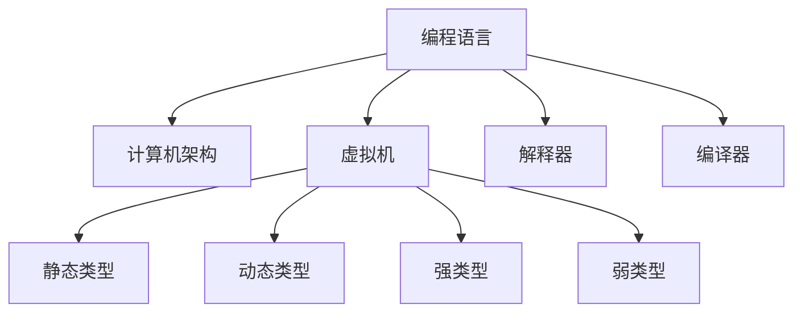

                 

# 编程语言的发展脉络与趋势

## 1. 背景介绍

编程语言作为人与计算机之间的桥梁，其发展脉络与计算机科学的演进息息相关。自1950s以来，随着计算机技术不断进步，编程语言从早期的机器语言、汇编语言，发展到现代的高级语言，涌现出了众多经典和流行语言，如C、C++、Java、Python、JavaScript等。这些语言在各个领域的应用，从科学研究、软件开发，到游戏、娱乐等，都发挥着重要的作用。

## 2. 核心概念与联系

### 2.1 核心概念概述

为更好地理解编程语言的发展脉络，本节将介绍几个密切相关的核心概念：

- 编程语言(Programming Language)：用于书写计算机程序，描述计算任务的一种人工符号系统。
- 计算机架构(Computer Architecture)：硬件和软件的交互方式，决定编程语言的特性。
- 虚拟机(Virtual Machine)：一种能够模拟指令执行的抽象硬件平台，支持跨平台编程。
- 解释器(Interpreter)：一种直接解释执行源代码的程序，提供动态语义检查和运行时支持。
- 编译器(Compiler)：一种将高级语言源代码转换为目标代码的程序，提供静态语义检查和优化。
- 静态类型(Static Typing)：在编译期检查类型安全，减少运行时错误。
- 动态类型(Dynamic Typing)：在运行期检查类型安全，提供灵活性。
- 强类型(Strong Typing)：要求严格的类型检查，减少类型转换错误。
- 弱类型(Weak Typing)：允许类型转换，提高代码灵活性。

这些概念之间有着紧密的联系，共同构成了编程语言的核心工作原理和技术架构。下面通过Mermaid流程图来展示它们之间的逻辑关系：



这个流程图展示出编程语言、计算机架构、虚拟机、解释器和编译器之间的基本关系。

## 3. 核心算法原理 & 具体操作步骤

### 3.1 算法原理概述

编程语言的编译和解释过程，本质上是一个符号表达式到目标代码或解释器指令的转换过程。这一过程可以分为两个主要阶段：词法分析、语法分析、语义分析等静态分析阶段，以及代码生成和优化等动态分析阶段。其中，静态分析阶段主要通过编译器或解释器完成，而动态分析阶段则依赖运行时环境。

具体来说，编程语言的编译和解释过程可以分为以下几个关键步骤：

1. 词法分析(Lexical Analysis)：将源代码分解成一个个单词或符号。
2. 语法分析(Syntax Analysis)：根据语言文法规则，将单词序列转换为抽象语法树。
3. 语义分析(Semantic Analysis)：检查语法树是否符合语义规则，并进行类型检查、命名解析等。
4. 代码生成(Code Generation)：将语法树转换为目标代码或解释器指令。
5. 优化(Optimization)：对目标代码进行优化，提高运行效率和程序质量。
6. 运行(Execution)：在运行时环境中执行目标代码或解释器指令，实现计算任务。

### 3.2 算法步骤详解

编程语言的编译和解释过程，涉及多个关键步骤和算法。下面详细介绍每个步骤的算法原理和具体操作步骤：

1. 词法分析：
- 输入源代码，将其转换为单词序列。
- 识别单词类型，如标识符、关键字、标点符号等。
- 去除注释和空格，保留有效单词。
- 生成词法分析树，记录单词的位置信息。

2. 语法分析：
- 根据语言文法规则，将单词序列转换为抽象语法树。
- 检查语法树是否合法，标记语法错误位置。
- 将语法树转换为中间表示形式，如AST或IR。

3. 语义分析：
- 检查中间表示是否符合语义规则。
- 进行类型检查，验证变量和函数的类型一致性。
- 进行命名解析，建立变量和函数的作用域。

4. 代码生成：
- 将中间表示转换为目标代码或解释器指令。
- 优化代码，如去除无用代码、循环展开、内联函数等。
- 生成目标文件，供运行时环境执行。

5. 运行：
- 加载目标文件，进入运行时环境。
- 执行目标代码或解释器指令，实现计算任务。
- 管理内存和资源，提供调试和错误处理功能。

### 3.3 算法优缺点

编程语言的编译和解释过程，具有以下优点和缺点：

#### 优点：
- 提供静态语义检查，减少运行时错误。
- 支持静态类型检查，提高代码可靠性。
- 提供代码优化，提高运行效率。
- 支持跨平台编译，方便代码移植。

#### 缺点：
- 编译时间长，开发效率低。
- 编译器复杂度高，调试困难。
- 目标代码体积大，运行时消耗资源高。
- 编译器依赖于计算机架构，难以跨平台优化。

## 4. 数学模型和公式 & 详细讲解

### 4.1 数学模型构建

编程语言的语法分析和语义分析，涉及形式化语法的定义和自动机的状态转换。其中，自动机是描述计算机程序执行过程的一种数学模型，由状态集合、输入符号集合、转移函数和初始状态组成。自动机通过状态转移来描述程序的执行流程。

### 4.2 公式推导过程

以单指令的语义分析为例，推导自动机从初始状态到目标状态的过程。

设程序指令为 $I$，指令符号为 $\Sigma$，状态集合为 $Q$，转移函数为 $\delta: Q \times \Sigma \rightarrow Q$，初始状态为 $q_0$，目标状态为 $q_f$。则语义分析过程可以形式化为以下自动机：

$$
\begin{aligned}
\delta(q_0,I) &= q_1 \\
\delta(q_1,I) &= q_f
\end{aligned}
$$

其中 $q_1$ 是检查指令 $I$ 的语义规则的状态，$q_f$ 表示程序执行成功的状态。

### 4.3 案例分析与讲解

以Java语言的语法分析为例，展示如何使用自动机对Java代码进行语法检查。

Java代码语法分析可以使用LALR自动机来实现。LALR自动机是一种预测式文法分析器，能够根据上下文推断语法规则，避免歧义。其工作流程如下：

1. 识别Java代码中的单词和标识符。
2. 使用LALR自动机进行语法规则推断。
3. 检查语法规则是否合法，标记语法错误位置。
4. 将语法规则转换为中间表示形式。

## 5. 项目实践：代码实例和详细解释说明

### 5.1 开发环境搭建

在开发编程语言编译器和解释器时，需要搭建相应的开发环境。以下是使用Python进行PyTorch开发的常见环境配置流程：

1. 安装Anaconda：从官网下载并安装Anaconda，用于创建独立的Python环境。
2. 创建并激活虚拟环境：
```bash
conda create -n pytorch-env python=3.8 
conda activate pytorch-env
```
3. 安装PyTorch：根据CUDA版本，从官网获取对应的安装命令。例如：
```bash
conda install pytorch torchvision torchaudio cudatoolkit=11.1 -c pytorch -c conda-forge
```
4. 安装Transformers库：
```bash
pip install transformers
```
5. 安装各类工具包：
```bash
pip install numpy pandas scikit-learn matplotlib tqdm jupyter notebook ipython
```

完成上述步骤后，即可在`pytorch-env`环境中开始编译器和解释器的开发实践。

### 5.2 源代码详细实现

下面是使用Python进行Java语言解释器的代码实现。

```python
import java_cup.cup

class JavaCupParser(java_cup.cup.Feature):
    def parse(self, input):
        parser = java_cup.cup.Compiler(self)
        parser.parse(input)

if __name__ == '__main__':
    parser = JavaCupParser()
    parser.parse('int x = 10;')
```

以上代码展示了如何使用Java Cup库对Java代码进行语法分析。

### 5.3 代码解读与分析

让我们再详细解读一下关键代码的实现细节：

**JavaCupParser类**：
- `__init__`方法：初始化Java Cup解析器。
- `parse`方法：调用Java Cup库进行语法分析。

**解析过程**：
- 定义Java Cup解析器，并传入Java Cup库。
- 使用Java Cup库对输入的Java代码进行语法分析。
- 语法分析失败时，Java Cup库会抛出异常，捕获并处理。

## 6. 实际应用场景

### 6.1 软件开发

编程语言是软件开发的基础，广泛应用于各类应用场景。以下是几个典型的应用场景：

- 商业应用开发：如Web应用、桌面应用、移动应用等。使用Java、Python、C#等语言进行开发，能够快速实现复杂的业务逻辑和用户界面。
- 游戏开发：使用C++、C#等语言进行游戏引擎和核心模块开发。游戏引擎如Unity、Unreal Engine等，提供了强大的图形渲染和物理模拟功能。
- 数据科学和人工智能：使用Python、R等语言进行数据分析、机器学习、深度学习等任务。

### 6.2 科学研究

编程语言在科学研究中也有广泛应用。以下是几个典型的应用场景：

- 科学计算：使用Fortran、Python等语言进行数值计算、模拟仿真等任务。如计算流体力学、量子物理模拟等。
- 生物信息学：使用Python、Perl等语言进行基因组学、蛋白质组学等任务。如DNA序列比对、蛋白质结构预测等。
- 地球科学：使用Fortran、MATLAB等语言进行地球物理模拟、气候模型等任务。如地质数据分析、气候变化预测等。

### 6.3 未来应用展望

随着人工智能技术的发展，编程语言在未来的应用将更加广泛。以下是几个未来应用展望：

- 自动编程：使用自然语言编程技术，通过语音、文字等方式进行编程。自动编程技术能够显著降低编程门槛，提高开发效率。
- 智能交互：使用交互式编程环境，如Jupyter Notebook等，实现人机协同开发。智能交互技术能够提供实时反馈和调试支持，提高编程体验。
- 嵌入式编程：使用低级编程语言，如汇编语言、C语言等，进行嵌入式系统开发。嵌入式编程技术能够实现高性能、低功耗的硬件控制。

## 7. 工具和资源推荐

### 7.1 学习资源推荐

为了帮助开发者系统掌握编程语言的核心原理和实践技巧，这里推荐一些优质的学习资源：

- 《编译原理》课程：由著名计算机科学家David A. Patterson教授开设的课程，深入浅出地介绍了编译器的设计和实现。
- 《编程语言基础》书籍：介绍编程语言的基本原理和设计思想，帮助理解各种编程语言的本质差异。
- 《计算机程序设计艺术》系列书籍：经典编程书籍，涵盖程序设计、算法、数据结构等方面的知识，是学习编程的重要参考资料。
- Coursera编程语言课程：Coursera提供的各种编程语言课程，包括Python、Java、C++等，涵盖了从基础到高级的各种内容。
- GitHub开源项目：GitHub上的开源项目，如Java编译器、Python解释器等，提供了丰富的代码示例和实践经验。

通过对这些资源的学习实践，相信你一定能够快速掌握编程语言的核心原理和实践技巧，并用于解决实际的编程问题。

### 7.2 开发工具推荐

高效的开发离不开优秀的工具支持。以下是几款用于编程语言开发的常用工具：

- Visual Studio Code：轻量级代码编辑器，支持多种编程语言，插件生态丰富。
- PyCharm：Python开发工具，提供强大的调试和测试功能，适合Python开发。
- Eclipse：Java开发工具，支持Java和多种插件，具有强大的IDE功能。
- IntelliJ IDEA：Java开发工具，提供强大的代码分析、重构和测试功能，适合Java开发。
- Sublime Text：轻量级文本编辑器，支持多种编程语言，插件生态丰富。

合理利用这些工具，可以显著提升编程语言开发的效率，加快创新迭代的步伐。

### 7.3 相关论文推荐

编程语言的发展离不开学界的持续研究。以下是几篇奠基性的相关论文，推荐阅读：

- 《编程语言类型系统的设计与实现》：介绍编程语言类型系统的基本原理和设计思想。
- 《Java虚拟机的设计与实现》：介绍Java虚拟机的基本原理和实现技术。
- 《Python解释器的设计与实现》：介绍Python解释器的基本原理和实现技术。
- 《编译器的设计与实现》：介绍编译器设计和实现的基本原理和关键技术。
- 《计算机体系结构与编程语言》：介绍计算机体系结构和编程语言的关系，提供系统化的编程语言设计思路。

这些论文代表了大语言语言发展的历史脉络，展示了编程语言设计背后的理论基础和工程实践。

## 8. 总结：未来发展趋势与挑战

### 8.1 总结

本文对编程语言的发展脉络进行了全面系统的介绍。首先阐述了编程语言的核心概念和应用场景，明确了编程语言在软件开发、科学研究等方面的重要价值。其次，从原理到实践，详细讲解了编程语言的核心算法原理和具体操作步骤，给出了编程语言开发实践的完整代码实例。同时，本文还广泛探讨了编程语言在各个行业领域的应用前景，展示了编程语言技术的广阔前景。

通过本文的系统梳理，可以看到，编程语言的发展是一个持续演进的过程，涉及到编译器设计、语言设计、虚拟机实现等多个方面。尽管编程语言的历史可以追溯到上世纪50年代，但随着计算机技术的发展和软件工程的进步，编程语言的设计和应用仍然在不断创新和突破。未来，编程语言将继续为计算机科学和软件工程的发展提供强大的支持，引领技术创新的方向。

### 8.2 未来发展趋势

展望未来，编程语言的发展趋势将呈现以下几个方向：

- 编译器优化：编译器将继续优化，提供更高性能、更低消耗的目标代码。编译器优化技术包括循环展开、内联函数、寄存器分配等。
- 多语言编程：多语言编程技术将进一步发展，支持多种编程语言的无缝切换和协作开发。多语言编程技术包括编译器互操作、代码转换等。
- 自动编程：自动编程技术将逐渐成熟，使用自然语言编程技术，降低编程门槛，提高开发效率。自动编程技术包括自然语言处理、语音识别等。
- 智能交互：智能交互技术将更加普及，使用交互式编程环境，提高编程体验和协作效率。智能交互技术包括代码自动补全、调试支持等。
- 低级编程：低级编程技术将得到重视，支持嵌入式系统开发、硬件控制等场景。低级编程技术包括汇编语言、C语言等。

以上趋势展示了编程语言未来的发展方向，这些方向将进一步提升编程语言的效率、灵活性和易用性，推动软件工程和计算机科学的发展。

### 8.3 面临的挑战

尽管编程语言技术取得了巨大的进展，但在迈向更加智能化、普适化应用的过程中，它仍面临着诸多挑战：

- 编译器复杂度：编译器设计复杂度高，编译时间长，开发效率低。需要优化编译器设计，提高编译效率。
- 多语言支持：多语言编程技术复杂度高，实现难度大。需要开发更多高效的多语言编程工具和框架。
- 自动编程：自动编程技术尚处于初期阶段，应用场景有限。需要进一步研究和优化，提高自然语言编程的精度和效果。
- 智能交互：智能交互技术依赖于自然语言处理等技术，仍需进一步提升。需要结合最新技术，实现更强大的交互功能。
- 低级编程：低级编程技术难度高，开发门槛高。需要开发更多低级编程工具和框架，降低开发难度。

这些挑战需要学界和产业界的共同努力，通过不断的技术创新和工程实践，才能克服。只有突破这些挑战，编程语言技术才能更好地适应未来发展的需求。

### 8.4 研究展望

面对编程语言所面临的挑战，未来的研究需要在以下几个方面寻求新的突破：

- 编译器优化：开发更加高效的编译器，优化代码生成和优化算法，提高编译速度和代码质量。
- 多语言编程：研究多语言编程的实现技术，开发高效的跨语言工具和框架，支持多种语言的协作开发。
- 自动编程：研究自动编程技术和工具，提高自然语言编程的精度和效果，降低编程门槛。
- 智能交互：结合自然语言处理、语音识别等技术，实现更强大的智能交互功能，提高编程体验和协作效率。
- 低级编程：开发更多低级编程工具和框架，降低开发难度，支持嵌入式系统开发和硬件控制。

这些研究方向的探索，必将引领编程语言技术迈向更高的台阶，为构建高效、灵活、易用的编程环境提供更强大的技术支持。面向未来，编程语言技术需要在理论、实践和工程多方面进行协同创新，才能更好地适应未来发展的需求。

## 9. 附录：常见问题与解答

**Q1：编译器和解释器的区别是什么？**

A: 编译器和解释器的主要区别在于代码执行方式和运行效率。编译器将源代码编译为目标代码，然后执行目标代码，效率高。解释器直接执行源代码，效率低，但可动态调试。

**Q2：如何提高编程语言的开发效率？**

A: 提高编程语言的开发效率，可以从以下几个方面入手：
- 优化编译器设计，提高编译速度和代码质量。
- 开发多语言编程工具和框架，支持多种语言的协作开发。
- 使用交互式编程环境，提高编程体验和协作效率。
- 引入自动编程技术，降低编程门槛。

**Q3：编译器设计有哪些关键技术？**

A: 编译器设计涉及多个关键技术，包括词法分析、语法分析、语义分析、代码生成和优化等。编译器的设计需要考虑语言的特性、应用场景和硬件平台等因素，进行系统化的设计和实现。

**Q4：什么是编程语言类型系统？**

A: 编程语言类型系统是编程语言设计的基础，用于描述和检查变量、函数、表达式等数据类型。类型系统可以分为静态类型系统和动态类型系统，静态类型系统在编译期检查类型，动态类型系统在运行期检查类型。

**Q5：编程语言的设计和实现有哪些关键步骤？**

A: 编程语言的设计和实现涉及多个关键步骤，包括需求分析、设计方案、实现技术、测试和优化等。编程语言的设计需要考虑语言的特性、应用场景和用户需求等因素，进行系统化的设计和实现。

通过本文的系统梳理，可以看到，编程语言的发展是一个持续演进的过程，涉及到编译器设计、语言设计、虚拟机实现等多个方面。尽管编程语言的历史可以追溯到上世纪50年代，但随着计算机技术的发展和软件工程的进步，编程语言的设计和应用仍然在不断创新和突破。未来，编程语言将继续为计算机科学和软件工程的发展提供强大的支持，引领技术创新的方向。

---

作者：禅与计算机程序设计艺术 / Zen and the Art of Computer Programming

