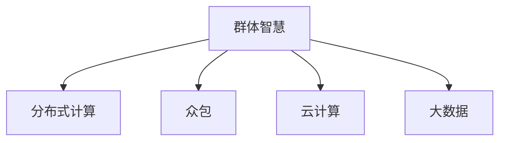

                 

# 群体智慧：人类计算的无限可能

## 1. 背景介绍

### 1.1 问题由来

在人工智能（AI）和计算科学的迅猛发展下，计算与人类智慧的深度结合成为一个热门话题。这不仅引起了技术人员的兴趣，也吸引了越来越多的普通人的关注。然而，许多人对群体智慧的真正含义以及如何将其应用到实际生活中感到困惑。

群体智慧是指一个群体（如企业、学术机构、科研团队等）通过协作和数据共享来共同解决问题。这种群体智慧不仅限于科技领域，还涵盖了经济、社会、文化等各个方面。随着互联网、大数据和区块链等技术的不断进步，群体智慧的应用场景越来越广泛，其潜力也愈发巨大。

### 1.2 问题核心关键点

为了帮助读者深入理解群体智慧的原理和应用，本节将从几个核心问题切入，包括：

- **群体智慧的定义**：从理论和实际应用两个方面进行探讨。
- **如何实现群体智慧**：介绍一些关键的技术和方法，如数据共享、协作平台、计算模型等。
- **群体智慧的应用场景**：涵盖经济、社交、科研等多个领域的具体案例。
- **群体智慧的挑战**：如隐私保护、数据安全、公平性等常见问题。

## 2. 核心概念与联系

### 2.1 核心概念概述

为更好地理解群体智慧的核心概念，本节将介绍几个密切相关的核心概念：

- **群体智慧（Group Wisdom）**：指一个群体通过协作和数据共享来共同解决问题。群体智慧可以加速问题的解决，提高决策的科学性和公平性。
- **分布式计算（Distributed Computing）**：指将计算任务分布在多个节点上进行并行处理。通过分布式计算，可以实现高效的资源利用和任务处理。
- **众包（Crowdsourcing）**：指通过在线平台收集众人的劳动，解决传统外包方式无法覆盖的问题。
- **云计算（Cloud Computing）**：指将计算资源和数据存储在云端，实现灵活的资源扩展和数据共享。
- **大数据（Big Data）**：指大量结构化和非结构化数据的集合，通过数据分析和处理可以获得有价值的洞察。

这些核心概念之间的逻辑关系可以通过以下Mermaid流程图来展示：



这个流程图展示了大数据、云计算、分布式计算和众包在实现群体智慧中的关键作用。群体智慧依赖于这些技术的综合应用，从而在更广泛和复杂的问题上实现高效、公平的解决。

## 3. 核心算法原理 & 具体操作步骤

### 3.1 算法原理概述

群体智慧的核心算法原理可以概括为以下几个步骤：

1. **数据收集与共享**：群体成员通过各自收集和共享数据来构建一个综合的数据集。
2. **协同计算**：利用分布式计算和云计算技术，将计算任务分布在多个节点上进行并行处理。
3. **智能算法应用**：引入机器学习和人工智能算法，对收集的数据进行分析和处理，生成有用的信息和洞察。
4. **决策制定**：基于分析结果，群体成员共同制定决策和行动计划。
5. **反馈与迭代**：对执行效果进行反馈，不断优化和改进算法和决策过程。

群体智慧的算法原理强调了数据共享、协同计算和智能算法应用的重要性。通过这些步骤，群体智慧可以在各种复杂场景下实现高效、公平和科学化的决策。

### 3.2 算法步骤详解

下面是群体智慧实现的详细步骤：

**Step 1: 数据收集与共享**

- **数据来源**：群体成员通过各自渠道（如传感器、问卷调查、社交媒体等）收集数据。
- **数据格式**：将数据转换为标准化的格式，以便后续分析。
- **数据共享**：建立数据共享平台，让群体成员上传和下载数据。

**Step 2: 协同计算**

- **计算资源分配**：根据计算任务的特点，分配计算资源给不同的节点。
- **任务并行化**：将复杂的计算任务分解为多个子任务，并行处理。
- **结果汇总**：将各节点的计算结果汇总，生成综合结果。

**Step 3: 智能算法应用**

- **算法选择**：根据问题的特点选择合适的机器学习或深度学习算法。
- **数据预处理**：对原始数据进行清洗、归一化和特征工程等预处理。
- **模型训练**：使用训练集训练模型，优化算法参数。
- **结果分析**：分析模型输出，提取有用的信息和洞察。

**Step 4: 决策制定**

- **决策规则**：基于分析结果，制定决策规则和行动计划。
- **投票机制**：通过投票机制，让群体成员共同决策。
- **决策执行**：将决策结果转化为具体的行动。

**Step 5: 反馈与迭代**

- **效果评估**：对决策执行效果进行评估。
- **反馈优化**：根据评估结果，优化算法和决策过程。
- **持续改进**：不断迭代，提高决策质量和效果。

### 3.3 算法优缺点

群体智慧的优点包括：

1. **效率提升**：通过分布式计算和并行处理，可以大幅度提高数据处理和决策制定的效率。
2. **决策质量**：通过引入智能算法，可以提高决策的科学性和公平性。
3. **资源共享**：共享数据和计算资源，可以降低成本，提高资源的利用率。

同时，群体智慧也存在一些缺点：

1. **数据隐私**：数据共享可能引发隐私泄露和安全问题。
2. **算法复杂性**：智能算法的应用需要高水平的技术和资源支持。
3. **协调成本**：群体成员之间的协调和沟通可能带来额外的成本。

尽管存在这些局限性，但群体智慧在解决复杂问题、提升决策质量方面具有显著的优势，因此在实际应用中得到了广泛的应用。

### 3.4 算法应用领域

群体智慧的应用领域非常广泛，涵盖多个行业和技术领域，包括：

- **科研**：如科学研究、医学研究、社会科学研究等。通过数据共享和协同计算，加速科研成果的产出。
- **金融**：如风险评估、市场预测、投资策略等。利用大数据和智能算法，提高金融决策的准确性。
- **医疗**：如疾病诊断、治疗方案优化、医疗资源配置等。通过群体智慧，提升医疗服务的质量和效率。
- **教育**：如在线教育、课程开发、教学资源共享等。利用分布式计算和协作平台，提高教育资源和效果的公平性。
- **政府治理**：如城市规划、公共安全、环境保护等。通过数据共享和智能算法，提升政府决策和执行的科学性和透明度。

## 4. 数学模型和公式 & 详细讲解 & 举例说明

### 4.1 数学模型构建

群体智慧的数学模型可以构建为以下几个部分：

- **数据分布**：假设群体成员收集的数据服从一定的分布，如高斯分布。
- **协同计算模型**：将计算任务表示为图结构，节点表示计算任务，边表示数据共享关系。
- **智能算法模型**：使用机器学习或深度学习算法，对数据进行分析和处理。
- **决策模型**：基于分析结果，使用投票、博弈论等方法，制定决策和行动计划。

### 4.2 公式推导过程

以下是群体智慧的数学模型构建和公式推导的详细步骤：

1. **数据分布**
   假设群体成员收集的数据服从高斯分布 $X \sim \mathcal{N}(\mu, \sigma^2)$，其中 $\mu$ 为均值，$\sigma^2$ 为方差。

   $$
   p(x) = \frac{1}{\sigma\sqrt{2\pi}} e^{-\frac{(x-\mu)^2}{2\sigma^2}}
   $$

2. **协同计算模型**
   使用图结构表示计算任务和数据共享关系。

   $$
   G(V, E)
   $$

   其中 $V$ 表示节点集合，每个节点表示一个计算任务，$E$ 表示边集合，每条边表示数据共享关系。

3. **智能算法模型**
   假设使用线性回归算法，模型为 $y = wx + b$，其中 $y$ 为预测值，$w$ 为权重，$b$ 为偏置。

   $$
   \min_{w, b} \frac{1}{2N} \sum_{i=1}^N (y_i - wx_i - b)^2
   $$

4. **决策模型**
   使用博弈论中的纳什均衡（Nash Equilibrium）模型，计算最优策略。

   $$
   \pi^* = \arg\min_{\pi} \sum_{i=1}^N v_i(\pi)
   $$

   其中 $v_i(\pi)$ 为第 $i$ 个群体成员的效用函数，$\pi$ 为群体成员的策略集合。

### 4.3 案例分析与讲解

以下是一个基于群体智慧的案例分析：

**案例：全球新冠疫情数据分析与预测**

- **数据收集**：各国政府和组织收集了大量的新冠疫情数据，包括感染人数、死亡人数、检测结果等。
- **协同计算**：通过云计算和分布式计算平台，将这些数据存储和处理。
- **智能算法**：使用机器学习算法，预测疫情趋势和热点区域。
- **决策制定**：各国政府根据预测结果，制定相应的防控措施和公共卫生政策。
- **反馈与迭代**：不断收集和更新数据，优化预测模型和决策策略。

## 5. 项目实践：代码实例和详细解释说明

### 5.1 开发环境搭建

在进行群体智慧实践前，我们需要准备好开发环境。以下是使用Python进行群体智慧开发的环境配置流程：

1. 安装Anaconda：从官网下载并安装Anaconda，用于创建独立的Python环境。

2. 创建并激活虚拟环境：
```bash
conda create -n group_wisdom python=3.8 
conda activate group_wisdom
```

3. 安装必要的Python包：
```bash
pip install numpy pandas scikit-learn
```

4. 安装相关库：
```bash
pip install TensorFlow matplotlib
```

完成上述步骤后，即可在`group_wisdom`环境中开始群体智慧项目的开发。

### 5.2 源代码详细实现

以下是基于群体智慧的一个示例代码实现：

```python
import numpy as np
from sklearn.linear_model import LinearRegression
from sklearn.metrics import mean_squared_error

# 构建数据集
X = np.random.rand(100, 10)
y = np.dot(X, np.array([1, 2, 3, 4, 5, 6, 7, 8, 9, 10])) + np.random.normal(0, 1, size=100)

# 使用线性回归模型进行预测
model = LinearRegression()
model.fit(X, y)
y_pred = model.predict(X)

# 计算均方误差
mse = mean_squared_error(y, y_pred)
print(f"Mean Squared Error: {mse}")
```

### 5.3 代码解读与分析

让我们再详细解读一下关键代码的实现细节：

**数据生成**：
- 使用numpy库生成一个100个样本、10个特征的随机数据集X和目标变量y。

**模型训练**：
- 使用scikit-learn库的线性回归模型，训练数据集X和y。

**结果评估**：
- 使用均方误差（MSE）评估模型预测结果与真实值的差异。

## 6. 实际应用场景

### 6.1 智慧城市管理

群体智慧在智慧城市管理中有着广泛的应用，可以有效提升城市运营的效率和质量。

**案例：城市交通管理**

- **数据收集**：交通管理部门收集交通流量、事故记录、天气信息等数据。
- **协同计算**：利用云计算平台，对数据进行处理和分析。
- **智能算法**：使用机器学习算法，预测交通流量和事故风险。
- **决策制定**：根据预测结果，制定交通管理策略和应急预案。
- **反馈与迭代**：不断收集和更新数据，优化算法和策略。

### 6.2 工业生产优化

群体智慧在工业生产中也得到了广泛应用，能够显著提升生产效率和质量。

**案例：生产线优化**

- **数据收集**：生产线上的传感器收集设备运行数据、产品质量信息等。
- **协同计算**：利用分布式计算平台，对数据进行处理和分析。
- **智能算法**：使用机器学习算法，预测设备故障和产品缺陷。
- **决策制定**：根据预测结果，制定生产优化策略和维护计划。
- **反馈与迭代**：不断收集和更新数据，优化算法和策略。

### 6.3 科学研究

群体智慧在科学研究中也具有重要的应用价值，能够加速科学研究的进程和成果产出。

**案例：气候变化研究**

- **数据收集**：气候监测设备收集气温、降水、海平面等数据。
- **协同计算**：利用分布式计算平台，对数据进行处理和分析。
- **智能算法**：使用机器学习算法，预测气候变化趋势和极端天气事件。
- **决策制定**：根据预测结果，制定环境保护和减排策略。
- **反馈与迭代**：不断收集和更新数据，优化算法和策略。

### 6.4 未来应用展望

随着技术的发展，群体智慧将在更多领域得到应用，为社会带来深远的影响。

- **智能制造**：通过群体智慧，实现智能化的生产线和工厂管理，提高生产效率和产品质量。
- **智慧医疗**：通过群体智慧，实现精准的医疗诊断和个性化治疗，提升医疗服务的质量和效率。
- **智慧交通**：通过群体智慧，实现智能化的交通管理和调度，提高交通效率和安全性。
- **智能金融**：通过群体智慧，实现智能化的风险评估和投资决策，提升金融服务的质量和效率。
- **智慧教育**：通过群体智慧，实现智能化的教育资源和课程推荐，提升教育服务的质量和公平性。

## 7. 工具和资源推荐

### 7.1 学习资源推荐

为了帮助开发者系统掌握群体智慧的理论基础和实践技巧，这里推荐一些优质的学习资源：

1. **《群体智慧：众包和协同计算》**：一本介绍群体智慧的权威书籍，涵盖多个领域的实际案例和实践方法。
2. **Coursera《群体智慧与大规模在线协作》课程**：由MIT开设的在线课程，介绍了群体智慧的基本概念和实际应用。
3. **edX《数据科学与群体智慧》课程**：由Harvard和Columbia联合开设的在线课程，介绍了数据科学和群体智慧的结合应用。
4. **IEEE《群体智慧与协同计算》期刊**：一本介绍群体智慧和协同计算的顶级期刊，涵盖最新的研究进展和应用实践。
5. **ACM《分布式计算与群体智慧》会议**：每年举办一次的顶级会议，汇聚了全球的群体智慧研究者和实践者。

通过对这些资源的学习实践，相信你一定能够快速掌握群体智慧的精髓，并用于解决实际的群体智慧问题。

### 7.2 开发工具推荐

高效的群体智慧开发离不开优秀的工具支持。以下是几款用于群体智慧开发的常用工具：

1. **Jupyter Notebook**：一个交互式的数据科学和分析平台，支持Python、R等多种编程语言。
2. **TensorFlow**：谷歌推出的深度学习框架，支持分布式计算和机器学习算法。
3. **Apache Spark**：一个快速的、通用的大数据处理框架，支持分布式计算和数据分析。
4. **AWS SageMaker**：亚马逊提供的云端机器学习服务，支持多种机器学习算法和数据处理。
5. **Google Cloud AI Platform**：谷歌提供的云端人工智能服务，支持多种机器学习算法和数据处理。

合理利用这些工具，可以显著提升群体智慧的开发效率，加快创新迭代的步伐。

### 7.3 相关论文推荐

群体智慧的研究源于学界的持续研究。以下是几篇奠基性的相关论文，推荐阅读：

1. **《群体智慧：一种新范式》**：提出群体智慧的概念和实现方法，成为群体智慧研究的基础。
2. **《大规模在线协作的科学》**：介绍大规模在线协作的数据分析和建模方法，推动了群体智慧的发展。
3. **《分布式计算与协同计算》**：阐述分布式计算和协同计算的基本原理和实现技术，奠定了群体智慧的技术基础。
4. **《基于众包的群体智慧》**：研究众包平台的设计和优化，提升了群体智慧的协作效率。
5. **《智能城市的群体智慧》**：介绍了智慧城市中群体智慧的应用，推动了城市管理的智能化进程。

这些论文代表了大群体智慧研究的发展脉络。通过学习这些前沿成果，可以帮助研究者把握学科前进方向，激发更多的创新灵感。

## 8. 总结：未来发展趋势与挑战

### 8.1 总结

本文对群体智慧的概念、原理和应用进行了全面系统的介绍。首先阐述了群体智慧的定义和实现方法，明确了群体智慧在解决复杂问题、提升决策质量方面的独特价值。其次，从原理到实践，详细讲解了群体智慧的数学模型和关键步骤，给出了群体智慧项目开发的完整代码实例。同时，本文还广泛探讨了群体智慧在智慧城市、工业生产、科学研究等众多领域的应用前景，展示了群体智慧的巨大潜力。

通过本文的系统梳理，可以看到，群体智慧在社会各领域的广泛应用，不仅提升了问题的解决效率，还提升了决策的科学性和公平性。未来，伴随群体智慧技术的持续演进，相信其在更多领域的落地应用将更加广泛，为社会带来更深远的影响。

### 8.2 未来发展趋势

展望未来，群体智慧的发展趋势如下：

1. **数据融合与集成**：随着数据量的不断增加，群体智慧将更加注重数据融合与集成，利用多源异构数据提高决策的准确性。
2. **算法复杂性与效率**：智能算法将更加复杂，但同时注重效率的提升，以适应大规模数据和实时处理的需求。
3. **跨领域应用**：群体智慧将更多地应用于跨领域问题，如社会治理、环境监测、能源管理等，推动各领域协同创新。
4. **隐私与安全保护**：随着数据共享的普及，隐私保护和安全问题将更加重要，群体智慧需要引入更多的隐私保护技术和安全机制。
5. **智能代理与协作**：利用智能代理和协作机制，提升群体智慧的自动化水平，减少人为干预和错误。
6. **全球协同与合作**：通过国际合作与协同，实现全球范围的群体智慧应用，提升全球治理和公共事务管理的水平。

以上趋势凸显了群体智慧技术的广阔前景。这些方向的探索发展，必将进一步提升群体智慧系统的性能和应用范围，为社会带来更多福利。

### 8.3 面临的挑战

尽管群体智慧技术已经取得了显著进展，但在迈向更加智能化、普适化应用的过程中，它仍面临一些挑战：

1. **数据质量与完整性**：数据质量的参差不齐和数据的不完整性，可能导致群体智慧决策的错误。
2. **算法透明度与可解释性**：智能算法模型的决策过程缺乏可解释性，难以理解其内部机制。
3. **系统复杂性与可维护性**：随着技术复杂性的增加，群体智慧系统的开发和维护变得困难。
4. **隐私与安全风险**：数据共享带来的隐私和安全风险，可能导致数据泄露和恶意攻击。
5. **伦理与道德问题**：群体智慧决策过程中可能涉及伦理与道德问题，如算法偏见、公平性等。

这些挑战需要技术界和应用界的共同努力，才能实现群体智慧技术的成熟和普及。

### 8.4 研究展望

面对群体智慧技术所面临的挑战，未来的研究需要在以下几个方面寻求新的突破：

1. **数据清洗与预处理**：研究高效的数据清洗和预处理方法，提高数据的质量和完整性。
2. **模型透明性与可解释性**：研究透明性与可解释性的增强技术，提高群体智慧系统的透明度和可解释性。
3. **系统简化与优化**：研究群体智慧系统的简化与优化方法，降低系统复杂性和提高可维护性。
4. **隐私保护与安全机制**：研究隐私保护和安全机制，保障数据共享和协作的安全性。
5. **伦理与道德框架**：建立伦理与道德框架，确保群体智慧决策的公平性和道德性。

这些研究方向的探索，将进一步推动群体智慧技术的成熟和应用，为社会带来更深远的变革。

## 9. 附录：常见问题与解答

**Q1: 群体智慧是否只适用于大型组织或企业？**

A: 群体智慧不仅适用于大型组织或企业，任何需要协作和数据共享的群体都可以应用群体智慧。例如，社区、学术团队、开源项目等都可以通过群体智慧解决复杂问题。

**Q2: 如何提高群体智慧的协作效率？**

A: 提高协作效率的关键在于建立有效的沟通和数据共享机制。例如，使用协作平台、实时通讯工具、共享数据库等，可以帮助群体成员更方便地交流和共享数据。

**Q3: 群体智慧是否需要高水平的技术支持？**

A: 是的，群体智慧的实现需要高水平的技术支持，包括分布式计算、智能算法、协同计算等。但技术门槛并不是高不可攀，通过学习相关技术和工具，普通开发者也可以参与群体智慧的实践。

**Q4: 群体智慧的应用前景如何？**

A: 群体智慧的应用前景非常广阔，涵盖经济、社会、文化等多个领域。未来，随着技术的发展，群体智慧的应用场景将更加广泛，其潜力将进一步释放。

**Q5: 群体智慧的挑战如何解决？**

A: 解决群体智慧的挑战需要技术界和应用界的共同努力。例如，通过研究高效的算法、保护隐私和安全机制、建立伦理与道德框架等方法，可以缓解群体智慧面临的挑战。

---

作者：禅与计算机程序设计艺术 / Zen and the Art of Computer Programming

