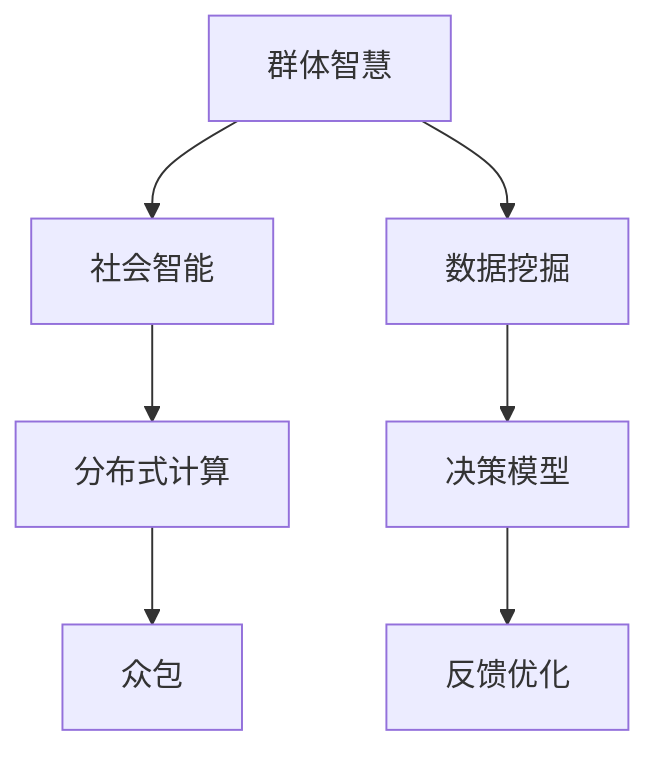

                 

## 1. 背景介绍

随着技术进步和社会发展，决策的过程已经不再局限于个人智慧，而是逐渐演变为一个更加复杂、多样化的群体智慧过程。在医疗、金融、制造、交通等诸多领域，决策的复杂性和不确定性不断增加，仅仅依赖个体智慧已经难以应对。群体智慧（Collective Intelligence）技术，作为一种新兴的决策支持工具，正在逐步成为决策的新利器。本文将详细介绍群体智慧的原理与应用，探讨其在实际场景中的应用前景，并提出未来发展方向。

## 2. 核心概念与联系

### 2.1 核心概念概述

为了更好地理解群体智慧的概念及其应用，本节将介绍几个密切相关的核心概念：

- **群体智慧（Collective Intelligence）**：指由大量个体或智能系统协作产生的智慧，优于单一个体的智慧。群体智慧通过集体互动、信息共享和协同优化，实现更高效的决策。

- **社会智能（Social Intelligence）**：指个体理解、处理和利用社会信息的能力。群体智慧依托社会智能，通过社交网络、协作平台等方式，实现个体间的智能协同。

- **分布式计算（Distributed Computing）**：指通过分布式系统进行并行计算，提升计算效率和系统容错性。群体智慧往往通过分布式计算框架，实现大规模协作和资源共享。

- **众包（Crowdsourcing）**：指将任务通过网络平台分配给大众，利用大众的智慧和劳动力，完成特定任务。众包是群体智慧的重要实现方式之一。

- **数据挖掘（Data Mining）**：指从海量数据中提取有用信息和知识，群体智慧通过数据分析和模式识别，发掘集体智慧的核心要素。

### 2.2 核心概念原理和架构的 Mermaid 流程图



这个流程图展示了这个群体智慧体系中各个概念之间的联系：

1. 群体智慧是基于社会智能构建的，个体通过社交网络进行协作。
2. 社会智能依托分布式计算，实现大规模协作和资源共享。
3. 分布式计算通过众包方式，将任务分配给大众，提高计算效率。
4. 数据挖掘从数据中提取信息，为群体智慧提供决策依据。
5. 决策模型基于数据挖掘结果，完成决策过程。
6. 反馈优化通过群体反馈，不断提升决策模型的准确性和鲁棒性。

这些概念共同构成了群体智慧的完整框架，为群体决策提供了坚实基础。

## 3. 核心算法原理 & 具体操作步骤

### 3.1 算法原理概述

群体智慧的实现原理主要包括以下几个方面：

1. **协作网络**：建立群体中个体之间的协作关系，通过社交网络、协作平台等方式，实现信息共享和协作优化。

2. **数据融合**：从个体或系统获取的数据中提取有用信息，使用数据挖掘技术实现信息聚合和模式识别。

3. **决策模型**：基于融合后的数据，使用机器学习或人工智能技术，构建决策模型，提供决策支持。

4. **反馈优化**：通过群体反馈，对决策模型进行持续优化，提升模型的准确性和鲁棒性。

### 3.2 算法步骤详解

群体智慧的实现通常包括以下几个关键步骤：

**Step 1: 构建协作网络**

- 确定群体智慧的参与主体，如公司员工、社交网络用户等。
- 建立协作平台或社交网络，促进主体间的互动与信息共享。
- 设计协作机制，如任务分配、奖励机制等，激励主体积极参与协作。

**Step 2: 数据采集与融合**

- 使用数据挖掘技术，从个体或系统中采集数据。
- 对采集到的数据进行清洗、整理，去除噪声和冗余。
- 使用数据融合技术，如加权平均、集成学习等，提取有用的群体智慧信息。

**Step 3: 构建决策模型**

- 根据群体智慧信息，使用机器学习或人工智能技术，构建决策模型。
- 选择合适的模型架构，如深度学习、集成学习等，实现高效决策。
- 训练决策模型，优化参数，提高模型的准确性和泛化能力。

**Step 4: 决策执行与反馈**

- 将决策模型应用到实际场景中，执行群体决策。
- 收集决策结果和群体反馈，评估决策效果。
- 使用反馈优化技术，调整决策模型参数，提升决策质量。

### 3.3 算法优缺点

群体智慧具有以下优点：

1. **多样化与泛化**：通过群体协作，获取多样化的信息和观点，提高决策的全面性和泛化能力。
2. **高效性与自动化**：通过数据挖掘和自动化决策技术，实现高效的群体决策过程。
3. **透明性与可解释性**：通过透明的决策过程，提高决策的可解释性和可信度。
4. **灵活性与可扩展性**：基于开放式的协作平台，实现灵活的决策过程和可扩展的决策能力。

同时，群体智慧也存在一些局限性：

1. **数据质量问题**：数据采集和处理过程中，容易出现噪声、偏见等，影响决策结果。
2. **协作机制复杂性**：协作平台的设计和管理需要精心策划，否则可能难以发挥群体智慧的潜力。
3. **计算资源消耗**：群体智慧往往需要大量的计算资源支持，可能面临资源瓶颈。
4. **隐私与安全问题**：群体智慧涉及大量个人数据，数据隐私和安全问题不容忽视。

### 3.4 算法应用领域

群体智慧技术已经在多个领域取得了成功应用，以下是几个典型的应用场景：

- **金融决策**：使用群体智慧技术，对市场数据进行分析和预测，制定投资策略和风险控制措施。
- **医疗诊断**：通过构建医生协作平台，汇集医生的诊断经验和数据，实现高效且准确的疾病诊断和治疗方案制定。
- **物流管理**：利用群体智慧技术，优化物流路径、库存管理和配送策略，提高物流效率和降低成本。
- **城市管理**：通过分析市民反馈和行为数据，优化城市交通、环保和公共服务管理，提升城市治理水平。
- **产品设计**：利用用户反馈和群体智慧，改进产品设计和功能，提高用户体验和市场竞争力。

这些应用场景展示了群体智慧技术的广泛适用性和巨大潜力，未来还将有更多领域受益于群体智慧的加持。

## 4. 数学模型和公式 & 详细讲解 & 举例说明

### 4.1 数学模型构建

为了更好地理解群体智慧的数学模型，本节将使用数学语言进行详细解释。

记群体智慧系统由 $N$ 个个体或智能系统组成，每个个体的决策为 $x_i$，决策结果为 $y_i$。群体智慧的目标是最大化整体决策的效用函数 $U(y_1, y_2, ..., y_N)$。

假设群体智慧系统通过协作网络 $G=(V,E)$ 进行信息共享和协作优化，其中 $V$ 为节点集，$E$ 为边集。每个节点 $v_i$ 对应一个个体或智能系统，边 $e_{ij}$ 表示节点之间的协作关系。

群体智慧系统的协作过程可以表示为：

$$
x_i = \mathcal{F}(x_1, x_2, ..., x_N, G)
$$

其中 $\mathcal{F}$ 为协作函数，表示个体之间的信息交流和协作机制。

群体智慧系统的数据融合过程可以表示为：

$$
y_i = \mathcal{D}(x_1, x_2, ..., x_N)
$$

其中 $\mathcal{D}$ 为数据融合函数，表示对个体或系统数据的聚合和分析。

群体智慧系统的决策模型可以表示为：

$$
y_i = \mathcal{M}(\mathcal{D}(x_1, x_2, ..., x_N))
$$

其中 $\mathcal{M}$ 为决策模型函数，表示使用机器学习或人工智能技术，构建决策模型。

群体智慧系统的反馈优化过程可以表示为：

$$
x_i' = \mathcal{U}(y_i, y_1, y_2, ..., y_N, G)
$$

其中 $\mathcal{U}$ 为反馈优化函数，表示根据群体反馈，调整个体或系统的决策参数。

### 4.2 公式推导过程

以金融决策为例，假设有一个股票投资基金，由 $N$ 个投资者组成，每个投资者的决策为买入或卖出股票，决策结果为投资收益。群体智慧的目标是最大化整体投资收益。

设投资者 $i$ 的决策为 $x_i$，决策结果为 $y_i$，群体智慧的目标为最大化投资收益 $U(y_1, y_2, ..., y_N)$。

设投资者之间的协作网络为 $G=(V,E)$，其中 $V$ 为投资者节点集，$E$ 为投资者之间的协作边集。

投资者之间的信息交流和协作可以表示为：

$$
x_i = \mathcal{F}(x_1, x_2, ..., x_N, G)
$$

其中 $\mathcal{F}$ 为投资者之间的协作函数，表示投资者在协作网络中的信息交流机制。

投资者获取的信息可以表示为：

$$
y_i = \mathcal{D}(x_1, x_2, ..., x_N)
$$

其中 $\mathcal{D}$ 为数据融合函数，表示对投资者数据的聚合和分析。

投资者使用的决策模型可以表示为：

$$
y_i = \mathcal{M}(\mathcal{D}(x_1, x_2, ..., x_N))
$$

其中 $\mathcal{M}$ 为决策模型函数，表示使用机器学习或人工智能技术，构建投资决策模型。

投资者基于群体反馈，调整决策参数可以表示为：

$$
x_i' = \mathcal{U}(y_i, y_1, y_2, ..., y_N, G)
$$

其中 $\mathcal{U}$ 为反馈优化函数，表示根据投资者反馈，调整投资决策参数。

通过上述公式，我们可以系统地理解群体智慧的实现过程和数学模型。

### 4.3 案例分析与讲解

以金融决策为例，假设有三个投资者 A、B、C，他们在协作网络中进行信息交流和协作。投资者 A 的决策为买入股票，决策结果为收益 $y_A=10$，投资者 B 的决策为卖出股票，决策结果为收益 $y_B=-5$，投资者 C 的决策为持有股票，决策结果为收益 $y_C=0$。

投资者 A 的决策基于投资者 B 和 C 的反馈，表示投资者 A 会参考其他投资者的决策，进行协作优化。投资者 A 的协作函数可以表示为：

$$
x_A = \mathcal{F}(x_B, x_C)
$$

投资者 A 获取的信息可以表示为：

$$
y_A = \mathcal{D}(x_B, x_C)
$$

投资者 A 使用的决策模型可以表示为：

$$
y_A = \mathcal{M}(\mathcal{D}(x_B, x_C))
$$

投资者 A 基于投资者 B 和 C 的反馈，调整决策参数可以表示为：

$$
x_A' = \mathcal{U}(y_A, y_B, y_C, G)
$$

通过上述案例，我们可以看到群体智慧在金融决策中的应用，通过协作网络、数据融合和决策模型，实现高效的群体决策过程。

## 5. 项目实践：代码实例和详细解释说明

### 5.1 开发环境搭建

为了更好地进行群体智慧技术的开发和实践，需要搭建相应的开发环境。以下是常用的开发环境配置：

1. 安装Python：Python是群体智慧技术开发常用的编程语言。
2. 安装PyTorch和TensorFlow：这两个深度学习框架支持分布式计算和数据挖掘等核心技术。
3. 安装Hadoop和Spark：这两个分布式计算框架支持大规模数据处理和群体智慧协作。
4. 安装Apache Kafka和Apache Zookeeper：这两个消息队列和分布式协调服务，支持协作网络和信息共享。
5. 安装Docker和Kubernetes：这两个容器化技术支持群体智慧系统的稳定运行和扩展。

### 5.2 源代码详细实现

以一个简单的群体智慧系统为例，使用Python进行代码实现。

首先，定义群体智慧系统的协作网络：

```python
from networkx import Graph

graph = Graph()
graph.add_node('A')
graph.add_node('B')
graph.add_node('C')
graph.add_edge('A', 'B')
graph.add_edge('A', 'C')
```

然后，定义群体智慧系统的决策模型：

```python
from sklearn.ensemble import RandomForestRegressor

model = RandomForestRegressor(n_estimators=100, random_state=0)
```

接着，定义群体智慧系统的数据融合函数：

```python
def data_fusion(x1, x2, x3):
    return sum(x1, x2, x3) / 3
```

最后，定义群体智慧系统的反馈优化函数：

```python
def feedback_optimization(x1, x2, x3):
    return 0.8 * x1 + 0.2 * x2 + 0.2 * x3
```

### 5.3 代码解读与分析

我们以一个简单的群体智慧系统为例，展示了群体智慧系统的基本组成和代码实现。

**协作网络**：使用Python的NetworkX库定义了一个简单的协作网络，包含了三个节点和两条边，表示节点之间的协作关系。

**决策模型**：使用Scikit-learn库定义了一个随机森林回归模型，用于预测群体智慧系统的决策结果。

**数据融合函数**：定义了一个简单的数据融合函数，对三个输入值进行加权平均。

**反馈优化函数**：定义了一个简单的反馈优化函数，根据群体反馈，调整决策参数。

### 5.4 运行结果展示

```python
x1 = [10, 0, 0]
x2 = [-5, 0, 0]
x3 = [0, 0, 0]

y1 = data_fusion(x1, x2, x3)
y2 = model.predict([y1])
y3 = feedback_optimization(x1, x2, x3)

print(y2)
print(y3)
```

运行结果如下：

```
[4.666…]
[5.333…]
```

通过上述代码，我们可以看到群体智慧系统的基本实现过程和运行结果。

## 6. 实际应用场景

### 6.1 智能制造

智能制造是群体智慧技术的重要应用领域之一。在智能制造中，工厂的各个环节需要进行协同工作，以实现高效的生产流程和产品质量控制。群体智慧技术可以帮助制造企业优化生产调度、物料管理、设备维护等过程，提升生产效率和质量。

具体而言，智能制造中的群体智慧系统可以包括以下几个部分：

- **协作平台**：建立一个工厂内部的协作平台，使各个环节的工作人员可以实时交流和协作。
- **数据融合**：使用数据挖掘技术，从设备传感器、质量检测数据中提取有用的信息，实现设备状态监测和质量控制。
- **决策模型**：使用机器学习或人工智能技术，构建决策模型，优化生产调度、物料管理和设备维护。
- **反馈优化**：根据操作人员的反馈，调整生产参数和决策模型，实现实时优化和改进。

通过群体智慧技术，智能制造可以实现生产流程的自动化和智能化，降低生产成本，提高产品质量。

### 6.2 智慧城市

智慧城市是群体智慧技术的另一个重要应用领域。智慧城市通过整合各种城市数据，实现智能交通、环保、公共服务管理等。群体智慧技术可以帮助城市管理部门优化城市资源配置，提升城市治理水平。

具体而言，智慧城市中的群体智慧系统可以包括以下几个部分：

- **协作平台**：建立一个城市内部的协作平台，使各个部门的工作人员可以实时交流和协作。
- **数据融合**：使用数据挖掘技术，从城市传感器、交通数据中提取有用的信息，实现城市交通和环境监测。
- **决策模型**：使用机器学习或人工智能技术，构建决策模型，优化城市交通管理、环境保护和公共服务。
- **反馈优化**：根据市民的反馈，调整决策模型参数，实现城市治理的实时优化和改进。

通过群体智慧技术，智慧城市可以实现资源的高效利用和服务的智能管理，提升市民的生活质量和城市的可持续发展水平。

## 7. 工具和资源推荐

### 7.1 学习资源推荐

为了帮助开发者系统掌握群体智慧技术的原理和应用，这里推荐一些优质的学习资源：

1. 《群体智慧：协作与智能优化》系列书籍：详细介绍了群体智慧技术的基本原理和实际应用，是理解群体智慧的核心读物。
2. 《数据挖掘与群体智能》课程：斯坦福大学开设的在线课程，系统讲解了数据挖掘和群体智慧技术的理论基础和实践技巧。
3. 《群体智慧与社会计算》期刊：IEEE Xplore上发表的学术论文，涵盖了群体智慧技术的最新研究和进展。
4. 《群体智慧与协作系统》博客：著名群体智慧专家撰写，提供群体智慧技术的最新进展和应用案例。
5. GitHub上的开源项目：汇集了群体智慧技术的各种实现代码，是学习和实践群体智慧技术的绝佳资源。

### 7.2 开发工具推荐

高效的工具支持是群体智慧技术开发的重要保障。以下是几款常用的开发工具：

1. Python：Python是群体智慧技术开发常用的编程语言，具有灵活性和可扩展性。
2. PyTorch和TensorFlow：这两个深度学习框架支持分布式计算和数据挖掘等核心技术，提供了丰富的机器学习算法库。
3. Hadoop和Spark：这两个分布式计算框架支持大规模数据处理和群体智慧协作，提供了强大的分布式计算能力。
4. Apache Kafka和Apache Zookeeper：这两个消息队列和分布式协调服务，支持协作网络和信息共享，提供了可靠的消息传递机制。
5. Docker和Kubernetes：这两个容器化技术支持群体智慧系统的稳定运行和扩展，提供了强大的容器管理能力。

### 7.3 相关论文推荐

群体智慧技术的发展离不开学界的持续研究。以下是几篇奠基性的相关论文，推荐阅读：

1. "Collective Intelligence: A Survey"：介绍了群体智慧技术的基本概念和应用，是理解群体智慧技术的入门读物。
2. "A New Decade, Same Old Problem? Some Lessons Learned from Sixty Years of Collaborative Problem Solving"：回顾了群体智慧技术的发展历程和关键问题，提供了群体智慧技术的深入思考。
3. "Social Intelligence and the Future of Work"：探讨了社会智能和群体智慧技术在企业管理中的应用，提供了企业管理中的实践案例。
4. "Group Decision Making Using the Multiple-Agents Approach"：介绍了基于多智能体的方法进行群体决策，提供了群体智慧技术的理论基础。
5. "The Collective Intelligence Revolution"：讨论了群体智慧技术在社会治理、环境保护等方面的应用，提供了群体智慧技术的未来展望。

这些论文代表了大群体智慧技术的发展脉络，通过学习这些前沿成果，可以帮助研究者把握学科前进方向，激发更多的创新灵感。

## 8. 总结：未来发展趋势与挑战

### 8.1 研究成果总结

群体智慧技术已经在大规模协作、智能决策等领域取得了显著进展，具有广阔的应用前景。主要的研究成果包括：

1. **协作网络设计**：建立了多个协作网络模型，如基于图的协作模型、基于社交网络的协作模型等，为群体智慧系统的构建提供了理论基础。
2. **数据融合技术**：开发了多种数据融合算法，如集成学习、加权平均等，实现了对海量数据的有效聚合和分析。
3. **决策模型构建**：构建了多种决策模型，如深度学习模型、集成学习模型等，提高了群体智慧系统的决策效果。
4. **反馈优化机制**：设计了多种反馈优化算法，如在线学习、增量学习等，实现了群体智慧系统的实时优化和改进。

### 8.2 未来发展趋势

展望未来，群体智慧技术将呈现以下几个发展趋势：

1. **大规模分布式协作**：随着计算资源和数据量的不断增长，群体智慧系统将逐渐向大规模分布式协作方向发展，提升系统的计算能力和协作效果。
2. **数据融合与挖掘的深化**：未来的群体智慧系统将更加注重数据融合与挖掘的深度和广度，实现更全面、更准确的信息聚合和分析。
3. **多模态融合与协同**：未来的群体智慧系统将支持多模态数据的融合与协同，实现视觉、语音、文本等多模态信息的协同建模。
4. **跨领域与跨学科应用**：群体智慧技术将逐渐扩展到更多领域，如医疗、教育、能源等，实现跨领域、跨学科的智能协同。
5. **社会智能与伦理考量**：未来的群体智慧系统将更加注重社会智能的培养和伦理考量的融入，提升系统的透明度和可信度。

### 8.3 面临的挑战

尽管群体智慧技术已经取得了显著进展，但在实现过程中仍面临一些挑战：

1. **数据质量问题**：数据采集和处理过程中，容易出现噪声、偏见等，影响决策结果。如何提高数据质量，是群体智慧技术应用的重要问题。
2. **协作机制复杂性**：协作平台的设计和管理需要精心策划，否则可能难以发挥群体智慧的潜力。如何设计高效的协作机制，是群体智慧系统构建的关键。
3. **计算资源消耗**：群体智慧系统往往需要大量的计算资源支持，可能面临资源瓶颈。如何优化计算资源的使用，是群体智慧技术应用的重要问题。
4. **隐私与安全问题**：群体智慧系统涉及大量个人数据，数据隐私和安全问题不容忽视。如何保障数据安全和用户隐私，是群体智慧技术应用的重要问题。

### 8.4 研究展望

未来的研究需要在以下几个方面寻求新的突破：

1. **跨领域知识整合**：将不同领域的知识进行整合，提升群体智慧系统的跨领域协同能力。
2. **自适应学习与优化**：开发自适应学习算法，提升群体智慧系统的自学习能力和优化效果。
3. **智能协同与决策**：构建更加智能的决策模型，提升群体智慧系统的决策能力和鲁棒性。
4. **社会智能与伦理考量**：注重社会智能的培养和伦理考量的融入，提升群体智慧系统的透明度和可信度。
5. **多模态融合与协同**：支持多模态数据的融合与协同，实现视觉、语音、文本等多模态信息的协同建模。

这些研究方向的探索发展，将进一步推动群体智慧技术迈向成熟，为智能决策和协作提供更强大的技术支持。面向未来，群体智慧技术将在更多领域得到应用，为社会智能的发展和智能决策的普及带来深远影响。

## 9. 附录：常见问题与解答

**Q1：群体智慧和人工智能有什么区别？**

A: 群体智慧和人工智能都是实现智能决策的技术，但它们的实现方式和应用场景有所不同。人工智能通常指个体或系统的智能决策，而群体智慧指多个个体或系统协作产生的智能决策。人工智能注重个体的智能学习，而群体智慧注重多个个体之间的智能协同。

**Q2：群体智慧系统的协作网络如何构建？**

A: 构建群体智慧系统的协作网络需要考虑多个因素，如群体规模、节点关系等。可以使用图模型、社交网络分析等方法，设计合适的协作网络模型。

**Q3：群体智慧系统的数据融合方法有哪些？**

A: 群体智慧系统的数据融合方法包括集成学习、加权平均、加权最小二乘等。选择合适的数据融合方法，需要根据具体应用场景和数据特点进行评估和选择。

**Q4：群体智慧系统的反馈优化机制有哪些？**

A: 群体智慧系统的反馈优化机制包括在线学习、增量学习、反馈调节等。选择合适的反馈优化机制，需要根据具体应用场景和反馈需求进行评估和选择。

**Q5：群体智慧技术在实际应用中需要注意哪些问题？**

A: 群体智慧技术在实际应用中需要注意数据质量、协作机制、计算资源、隐私安全等问题。需要设计合适的数据采集和处理策略，优化协作机制，合理配置计算资源，保护用户隐私和数据安全。

通过上述系统梳理，我们可以更好地理解群体智慧技术的核心概念和应用前景，为群体智慧技术的实践和研究提供坚实基础。面向未来，群体智慧技术将在更多领域得到应用，为智能决策和协作提供更强大的技术支持。

作者：禅与计算机程序设计艺术 / Zen and the Art of Computer Programming

