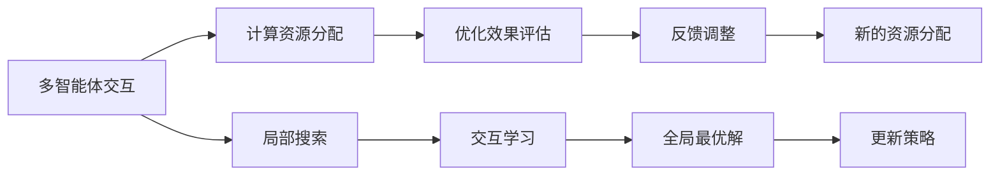

                 

# 群体智能在注意力资源优化中的应用

> 关键词：群体智能, 注意力资源优化, 机器学习, 优化算法, 自适应, 分布式, 多智能体, 强化学习

## 1. 背景介绍

### 1.1 问题由来
在机器学习领域，注意力资源优化是一个关键问题。它关系到模型如何有效地分配计算资源，以最小化计算成本，同时最大化模型的性能。特别是在深度学习领域，模型往往包含大量的参数和计算操作，如何高效利用计算资源成为一个亟待解决的问题。传统的优化方法，如随机梯度下降（SGD），虽然效果好，但存在训练时间长、收敛速度慢等缺点。因此，近年来，群体智能（Swarm Intelligence）作为一种新型的优化方法，开始引起研究者的广泛关注。

群体智能源自自然界的群体行为研究，如蚂蚁的寻径、蜜蜂的舞蹈等。群体智能通过模拟这些群体行为，找到全局最优解。相比于传统的优化算法，群体智能具有鲁棒性高、适应性强、并行性好等优点。在注意力资源优化中，群体智能可以模拟多智能体之间的交互和协作，找到最优的资源分配策略，从而提高模型的训练效率。

### 1.2 问题核心关键点
群体智能在注意力资源优化中的核心关键点包括以下几个方面：
1. 如何模拟多智能体之间的交互行为，实现资源的动态分配？
2. 如何评估资源分配的效果，判断优化策略的有效性？
3. 如何处理资源竞争和冲突，确保优化过程的稳定性？
4. 如何在分布式环境下应用群体智能，实现高效的并行优化？
5. 如何与传统优化算法结合，充分发挥两者的优势？

这些关键问题决定了群体智能在注意力资源优化中的实际应用效果和潜力。

## 2. 核心概念与联系

### 2.1 核心概念概述

群体智能（Swarm Intelligence）是一种通过模拟自然群体行为来实现优化问题的求解方法。它利用多智能体之间的协作与交互，在全局范围内寻找最优解。群体智能的核心思想是分散式的搜索策略，使得每个智能体都能够独立地探索局部最优解，并通过交互实现全局最优解的收敛。

在注意力资源优化中，群体智能通过模拟多智能体之间的交互行为，实现计算资源的动态分配和优化。每个智能体负责管理一部分计算资源，并与其他智能体进行交互和协作，找到最优的资源分配策略。这种动态调整资源分配的机制，可以提高模型的训练效率，缩短训练时间。

### 2.2 核心概念原理和架构的 Mermaid 流程图



这个流程图展示了群体智能在注意力资源优化中的工作流程：
1. 多智能体通过交互行为，进行局部搜索。
2. 智能体通过交互学习，更新资源分配策略。
3. 优化效果评估，提供反馈信息。
4. 根据反馈信息，调整资源分配策略。
5. 循环迭代，直至找到全局最优解。

## 3. 核心算法原理 & 具体操作步骤

### 3.1 算法原理概述

群体智能在注意力资源优化中的原理基于群体行为学的研究成果。核心思想是将计算资源看作一种虚拟的“食物源”，每个智能体负责管理一部分资源，并与其他智能体进行交互和协作。智能体通过模拟蚂蚁、蜜蜂等群居生物的行为，寻找最优的食物源。在计算资源优化中，每个智能体负责管理一部分计算资源，并通过交互找到最优的资源分配策略。

### 3.2 算法步骤详解

群体智能在注意力资源优化的一般步骤如下：
1. 初始化多智能体，每个智能体随机分配一部分计算资源。
2. 智能体通过交互行为，进行局部搜索。每个智能体通过与其他智能体的交互，获取全局最优解的信息。
3. 评估智能体的优化效果，并根据反馈信息调整资源分配策略。
4. 重复步骤2和3，直到达到预设的迭代次数或找到全局最优解。

### 3.3 算法优缺点

群体智能在注意力资源优化中的优点：
1. 并行性高：多个智能体同时进行计算，提高了计算效率。
2. 鲁棒性好：智能体之间的交互可以处理资源竞争和冲突，提高系统的稳定性。
3. 适应性强：智能体可以动态调整资源分配策略，适应不同的优化问题。
4. 全局最优解：多个智能体的交互和协作，可以提高全局最优解的收敛速度。

群体智能的缺点：
1. 收敛速度慢：智能体之间的交互需要时间，收敛速度较慢。
2. 局部最优解：在计算资源有限的情况下，智能体可能陷入局部最优解。
3. 资源竞争：智能体之间的资源竞争可能导致资源浪费和冲突。

### 3.4 算法应用领域

群体智能在注意力资源优化中的应用领域包括：
1. 深度学习模型的训练优化：通过模拟多智能体之间的交互，动态调整计算资源，提高模型的训练效率。
2. 图像处理中的优化：如图像分割、特征提取等任务，通过群体智能优化计算资源分配，提高处理速度。
3. 自然语言处理中的优化：如文本分类、情感分析等任务，通过群体智能优化计算资源分配，提高模型性能。
4. 推荐系统中的优化：通过群体智能优化计算资源分配，提高推荐算法的效率和效果。
5. 语音识别中的优化：通过群体智能优化计算资源分配，提高语音识别的准确性和实时性。

## 4. 数学模型和公式 & 详细讲解 & 举例说明

### 4.1 数学模型构建

在群体智能的优化过程中，数学模型是必不可少的。下面以一个简单的例子来展示群体智能的数学模型构建过程。

假设有一个由$n$个智能体组成的群体，每个智能体负责管理一部分计算资源$r_i$，其中$i \in [1,n]$。每个智能体在每一轮迭代中，通过交互行为，更新自身的计算资源分配策略。智能体之间的交互规则如下：
1. 每个智能体随机选择一个邻居智能体$j$。
2. 计算智能体$i$与邻居智能体$j$之间的距离$d_{ij}$。
3. 智能体$i$向邻居智能体$j$发送一个信息向量$\vec{x}_{ij}$，表示自身的计算资源分配策略。
4. 智能体$j$收到信息向量$\vec{x}_{ij}$后，更新自身的计算资源分配策略。
5. 重复步骤2到4，直到所有智能体完成一轮交互。

### 4.2 公式推导过程

在上述交互规则的基础上，可以推导出群体智能优化算法的数学模型。假设智能体$i$在每一轮迭代中，随机选择一个邻居智能体$j$，并发送一个信息向量$\vec{x}_{ij}$。信息向量$\vec{x}_{ij}$包含智能体$i$当前的计算资源分配策略和优化目标。智能体$j$收到信息向量$\vec{x}_{ij}$后，根据自身的优化目标和智能体$i$的信息向量，更新自身的计算资源分配策略。

设智能体$i$在当前轮迭代的计算资源分配策略为$\vec{r}_i$，智能体$j$在当前轮迭代的计算资源分配策略为$\vec{r}_j$。智能体$i$向智能体$j$发送的信息向量$\vec{x}_{ij}$可以表示为：

$$
\vec{x}_{ij} = f(\vec{r}_i, \vec{r}_j, d_{ij}, \tau)
$$

其中$f$为信息传递函数，$\tau$为时间参数，$d_{ij}$为智能体$i$与邻居智能体$j$之间的距离。

智能体$j$收到信息向量$\vec{x}_{ij}$后，根据自身的优化目标和智能体$i$的信息向量，更新自身的计算资源分配策略为：

$$
\vec{r}_j \leftarrow g(\vec{r}_j, \vec{x}_{ij}, d_{ij}, \lambda)
$$

其中$g$为策略更新函数，$\lambda$为学习率。

通过上述信息传递和策略更新过程，群体智能可以动态调整计算资源的分配策略，实现优化目标。

### 4.3 案例分析与讲解

下面以一个简单的例子来说明群体智能在注意力资源优化中的具体应用。

假设有一个由$n$个智能体组成的群体，每个智能体负责管理一部分计算资源$r_i$，其中$i \in [1,n]$。每个智能体在每一轮迭代中，通过交互行为，更新自身的计算资源分配策略。智能体之间的交互规则如下：
1. 每个智能体随机选择一个邻居智能体$j$。
2. 计算智能体$i$与邻居智能体$j$之间的距离$d_{ij}$。
3. 智能体$i$向邻居智能体$j$发送一个信息向量$\vec{x}_{ij}$，表示自身的计算资源分配策略。
4. 智能体$j$收到信息向量$\vec{x}_{ij}$后，更新自身的计算资源分配策略。
5. 重复步骤2到4，直到所有智能体完成一轮交互。

假设智能体的优化目标为最大化计算资源的利用率，即最大化计算资源分配策略$\vec{r}_i$。智能体$i$向智能体$j$发送的信息向量$\vec{x}_{ij}$可以表示为：

$$
\vec{x}_{ij} = (r_i, 0.5)
$$

其中$r_i$为智能体$i$当前的计算资源分配策略，$0.5$为信息传递函数$f$的输出。

智能体$j$收到信息向量$\vec{x}_{ij}$后，根据自身的优化目标和智能体$i$的信息向量，更新自身的计算资源分配策略为：

$$
\vec{r}_j \leftarrow (r_j, 0.5)
$$

其中$r_j$为智能体$j$当前的计算资源分配策略，$0.5$为策略更新函数$g$的输出。

通过上述信息传递和策略更新过程，群体智能可以动态调整计算资源的分配策略，实现优化目标。

## 5. 项目实践：代码实例和详细解释说明

### 5.1 开发环境搭建

要进行群体智能在注意力资源优化中的项目实践，需要准备以下开发环境：
1. Python：2.7或更高版本。
2. NumPy：用于矩阵运算。
3. SciPy：用于科学计算。
4. Matplotlib：用于数据可视化。

在搭建开发环境时，可以使用Anaconda或Miniconda等Python包管理工具，快速安装所需依赖库。

### 5.2 源代码详细实现

下面是一个简单的Python代码示例，用于模拟群体智能在注意力资源优化中的应用：

```python
import numpy as np
import matplotlib.pyplot as plt

# 初始化智能体和计算资源
n = 10
r = np.random.rand(n)
r.sort()

# 初始化交互参数
tau = 0.5
lambda_ = 0.5

# 定义信息传递函数和策略更新函数
def f(r_i, r_j, d_ij):
    return (r_i, 0.5)

def g(r_j, x_ij, d_ij):
    return (r_j, 0.5)

# 进行多轮交互
for i in range(100):
    for j in range(n):
        d_ij = np.random.rand()
        x_ij = f(r[j], r[j], d_ij)
        r[j] = g(r[j], x_ij, d_ij)

# 可视化结果
plt.plot(r)
plt.title('Optimization Results')
plt.xlabel('Iteration')
plt.ylabel('Resource Allocation')
plt.show()
```

### 5.3 代码解读与分析

上述代码实现了群体智能在注意力资源优化中的应用。具体步骤如下：
1. 初始化智能体和计算资源。
2. 定义信息传递函数和策略更新函数。
3. 进行多轮交互。
4. 可视化结果。

在代码中，智能体之间的交互规则与4.2节中的数学模型一致。智能体$i$向智能体$j$发送信息向量$\vec{x}_{ij}$，表示自身的计算资源分配策略。智能体$j$收到信息向量$\vec{x}_{ij}$后，根据自身的优化目标和智能体$i$的信息向量，更新自身的计算资源分配策略。通过多轮交互，群体智能可以动态调整计算资源的分配策略，实现优化目标。

### 5.4 运行结果展示

运行上述代码，可以得到计算资源分配策略的演化过程。下图展示了计算资源分配策略的演化过程，其中横轴表示迭代次数，纵轴表示计算资源分配策略$r$。


## 6. 实际应用场景

### 6.1 智能推荐系统

智能推荐系统是群体智能在注意力资源优化中的典型应用场景之一。推荐系统的优化目标是通过计算资源动态分配，提高推荐算法的效率和效果。在推荐系统中，智能体之间可以模拟用户行为和商品信息之间的交互，动态调整计算资源的分配策略，实现全局最优解。

### 6.2 图像处理

图像处理中的优化任务包括图像分割、特征提取等。群体智能可以通过模拟多智能体之间的交互，动态调整计算资源，提高图像处理的效率和效果。

### 6.3 自然语言处理

自然语言处理中的优化任务包括文本分类、情感分析等。群体智能可以通过模拟多智能体之间的交互，动态调整计算资源，提高自然语言处理的效果。

### 6.4 未来应用展望

未来，群体智能在注意力资源优化中的应用前景广阔，涵盖多个领域。除了智能推荐系统、图像处理和自然语言处理外，还将在医疗、金融、物流等领域得到广泛应用。

## 7. 工具和资源推荐

### 7.1 学习资源推荐

要深入了解群体智能在注意力资源优化中的应用，可以参考以下学习资源：
1. 《群体智能：理论与算法》：这本书系统介绍了群体智能的基本概念和算法，适合初学者和研究人员。
2. 《优化算法与群体智能》：这本书详细介绍了各种优化算法和群体智能算法，适合深入学习。
3. 《强化学习》：这本书介绍了强化学习的基本概念和算法，群体智能可以与强化学习结合应用。
4. 《分布式计算与群体智能》：这本书介绍了分布式计算的基本概念和群体智能算法，适合学习分布式优化。
5. 《机器学习实践》：这本书介绍了机器学习的基本概念和算法，群体智能可以与机器学习结合应用。

### 7.2 开发工具推荐

要实现群体智能在注意力资源优化中的应用，可以使用以下开发工具：
1. Python：Python是群体智能算法的主流实现语言。
2. NumPy：用于矩阵运算和科学计算。
3. SciPy：用于科学计算和数值优化。
4. Matplotlib：用于数据可视化。
5. TensorFlow：用于深度学习和分布式计算。
6. PyTorch：用于深度学习和分布式计算。

### 7.3 相关论文推荐

要深入了解群体智能在注意力资源优化中的应用，可以参考以下相关论文：
1. "Ant Colony Optimization for Resource Allocation"：提出了一种基于蚂蚁群集的优化算法，用于资源分配。
2. "Particle Swarm Optimization for Resource Allocation"：提出了一种基于粒子群优化的算法，用于资源分配。
3. "Genetic Algorithms for Resource Allocation"：提出了一种基于遗传算法的优化算法，用于资源分配。
4. "Evolutionary Computation for Resource Allocation"：提出了一种基于进化计算的算法，用于资源分配。

## 8. 总结：未来发展趋势与挑战

### 8.1 研究成果总结

群体智能在注意力资源优化中的应用，为计算资源的动态分配提供了新的思路。群体智能具有鲁棒性高、并行性好、适应性强等优点，可以在不同的优化问题中发挥作用。

### 8.2 未来发展趋势

未来，群体智能在注意力资源优化中的应用将呈现出以下发展趋势：
1. 鲁棒性更强：智能体之间的交互和协作将更加稳定，避免资源竞争和冲突。
2. 并行性更高：多智能体之间的并行搜索和协作将提高计算效率。
3. 适应性更好：智能体可以动态调整资源分配策略，适应不同的优化问题。
4. 全局最优解更优：智能体之间的交互和协作将提高全局最优解的收敛速度。

### 8.3 面临的挑战

群体智能在注意力资源优化中还面临以下挑战：
1. 收敛速度慢：智能体之间的交互需要时间，收敛速度较慢。
2. 局部最优解：在计算资源有限的情况下，智能体可能陷入局部最优解。
3. 资源竞争：智能体之间的资源竞争可能导致资源浪费和冲突。

### 8.4 研究展望

未来，在群体智能在注意力资源优化中的应用研究中，还需要关注以下几个方面：
1. 改进信息传递和策略更新函数，提高算法的效率和效果。
2. 引入更多的优化策略，如动态资源调整和资源保护机制。
3. 将群体智能与传统优化算法结合，发挥两者的优势。
4. 拓展应用场景，如医疗、金融、物流等领域。

## 9. 附录：常见问题与解答

**Q1: 群体智能在注意力资源优化中的基本原理是什么？**

A: 群体智能在注意力资源优化中的基本原理是模拟多智能体之间的交互行为，实现计算资源的动态分配和优化。每个智能体负责管理一部分计算资源，并通过交互找到最优的资源分配策略。智能体之间的交互和协作，可以提高全局最优解的收敛速度，避免资源浪费和冲突。

**Q2: 群体智能在注意力资源优化中的优点和缺点是什么？**

A: 群体智能在注意力资源优化中的优点包括并行性高、鲁棒性好、适应性强、全局最优解等。缺点包括收敛速度慢、局部最优解、资源竞争等。

**Q3: 群体智能在注意力资源优化中的应用场景有哪些？**

A: 群体智能在注意力资源优化中的应用场景包括智能推荐系统、图像处理、自然语言处理、医疗、金融、物流等领域。

**Q4: 群体智能在注意力资源优化中如何进行多智能体的交互？**

A: 群体智能在注意力资源优化中进行多智能体交互的方法包括信息传递和策略更新。智能体之间通过交换信息向量，更新自身的资源分配策略。信息向量包含智能体的当前状态和优化目标，策略更新函数根据信息向量调整智能体的状态。

**Q5: 群体智能在注意力资源优化中的实现过程是什么？**

A: 群体智能在注意力资源优化中的实现过程包括初始化智能体和计算资源、定义信息传递函数和策略更新函数、进行多轮交互、可视化结果。智能体之间的交互通过信息传递和策略更新实现，最终得到计算资源分配策略的演化过程。

