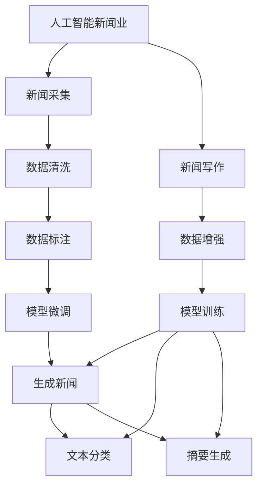

                 

# 聊天机器人新闻业：人工智能新闻采集和写作

> 关键词：人工智能新闻业,聊天机器人新闻,新闻采集,新闻写作,自然语言处理,深度学习,Transformer,BERT,语言模型,机器学习

## 1. 背景介绍

### 1.1 问题由来

在信息爆炸的时代，如何高效、准确地采集、生成和发布新闻，成为了媒体行业的一大挑战。传统的新闻采集和写作依赖于大量的人力资源和专业的记者团队，不仅成本高，而且新闻的时效性和广度都难以满足信息时代的需求。

与此同时，人工智能（AI）技术，尤其是自然语言处理（NLP）领域的大模型（如Transformer、BERT等）的兴起，为新闻采集和写作提供了全新的思路和方法。通过深度学习模型，人工智能能够在短时间内完成大量的新闻采集和生成任务，极大地提升了新闻产业的效率和质量。

### 1.2 问题核心关键点

人工智能新闻采集和写作的核心问题包括：

1. **新闻采集的自动化**：如何通过AI技术自动化地采集新闻信息，以较低的成本获取大量的新闻内容。
2. **新闻写作的自动化**：如何通过AI技术自动化地生成高质量的新闻稿件，减少人工写作的重复性工作。
3. **内容真实性和可信度**：如何确保自动生成的新闻内容真实、可信，避免虚假信息。
4. **情感色彩和风格控制**：如何调整AI新闻内容的情感色彩和风格，以适应不同受众和新闻类型。
5. **数据隐私和伦理问题**：如何保护数据隐私，确保AI新闻采集和生成过程中的数据安全和伦理合规。

### 1.3 问题研究意义

人工智能新闻采集和写作的研发具有以下重要意义：

1. **降低成本**：自动化新闻采集和写作可以显著降低媒体机构的运营成本，提高新闻生产的效率。
2. **提升时效性**：AI可以快速处理大量数据，提供及时的新闻报道，满足信息时代对新闻时效性的需求。
3. **扩大报道范围**：AI可以不受物理限制，全天候、全球化地采集新闻，涵盖更广泛的地理和时间范围。
4. **提高新闻质量**：AI可以自动过滤噪声信息，提炼关键内容，生成更加精准、客观的新闻。
5. **促进创新发展**：AI新闻采集和写作为媒体行业注入新的活力，推动新闻行业的数字化转型。

## 2. 核心概念与联系

### 2.1 核心概念概述

为更好地理解人工智能新闻采集和写作的方法，本节将介绍几个核心概念：

- **人工智能新闻业（AI Journalism）**：利用AI技术辅助新闻采集、写作、编辑等全流程的媒体业务，提高新闻产业的自动化水平。
- **聊天机器人新闻（Chatbot Journalism）**：通过AI聊天机器人采集和生成新闻，以自然对话的方式与用户互动。
- **新闻采集（News Scraping）**：自动从互联网和其他来源获取新闻内容的机器技术。
- **新闻写作（News Writing）**：利用AI生成新闻稿件、文章、标题等，涵盖文本生成、语言模型训练等技术。
- **自然语言处理（NLP）**：涉及计算机对自然语言文本的理解和生成，是AI新闻采集和写作的核心技术。
- **深度学习（Deep Learning）**：利用多层神经网络进行新闻生成、分类、聚类等任务的技术。
- **Transformer**：一种用于处理序列数据的神经网络模型，广泛应用于新闻生成和语言模型训练。
- **BERT**：一种预训练语言模型，能够理解上下文语义，广泛用于新闻文本生成和分类任务。

这些核心概念之间的逻辑关系可以通过以下Mermaid流程图来展示：



这个流程图展示了大语言模型在新闻采集和写作中的核心步骤：

1. 人工智能新闻业利用新闻采集和写作自动化技术，生成新闻内容。
2. 数据清洗和标注是模型训练的基础，确保数据的质量和标签的准确性。
3. 模型训练和微调是生成高质量新闻内容的保障。
4. 通过聊天机器人技术，可以提供实时、个性化的新闻服务。

## 3. 核心算法原理 & 具体操作步骤

### 3.1 算法原理概述

人工智能新闻采集和写作的核心算法主要基于深度学习技术和预训练语言模型。其核心思想是：

1. **数据采集**：使用Web爬虫等技术自动获取互联网上的新闻内容，清洗和标注数据，形成训练集。
2. **模型训练**：利用大规模预训练语言模型（如BERT）作为初始化权重，在标注数据上训练生成模型，学习新闻语言的特征。
3. **模型微调**：在特定新闻领域的数据集上，对预训练模型进行微调，以适应特定任务的要求，如分类、生成等。
4. **生成新闻**：利用训练好的模型，自动生成新闻标题、摘要、文章等，进行自然语言处理和文本生成。

### 3.2 算法步骤详解

#### 步骤1：数据采集与预处理

1. **数据来源**：
   - **Web爬虫**：从新闻网站、社交媒体、博客等互联网来源自动采集新闻内容。
   - **API接口**：从新闻机构提供的API接口获取最新新闻数据。
   - **公开数据集**：使用公开的新闻数据集，如Kaggle上的新闻数据集。

2. **数据清洗**：
   - **去除噪声**：过滤HTML标签、脚本等噪声内容，保留纯文本信息。
   - **标准化处理**：统一文本格式，如统一编码格式、去除特殊字符等。
   - **数据标注**：对采集的新闻内容进行分类、标注，形成训练集。

#### 步骤2：模型训练

1. **选择模型**：
   - **预训练模型**：使用大规模预训练语言模型，如BERT、GPT等。
   - **自定义模型**：根据具体任务需求，设计自定义的生成模型。

2. **训练过程**：
   - **数据分割**：将数据集划分为训练集、验证集和测试集。
   - **超参数设置**：设置学习率、批量大小、训练轮数等超参数。
   - **模型训练**：利用训练集训练模型，使用验证集评估模型性能，迭代优化模型参数。

#### 步骤3：模型微调

1. **微调目标**：
   - **分类任务**：调整模型输出层，学习新闻文本的分类特征。
   - **生成任务**：调整模型的解码器，学习生成高质量的新闻内容。

2. **微调过程**：
   - **模型初始化**：使用预训练模型的权重作为初始化参数。
   - **任务适配**：根据任务类型设计适配层，如新闻分类器、文本生成器等。
   - **数据准备**：将标注数据集划分为训练集和验证集。
   - **模型训练**：在训练集上训练微调模型，使用验证集评估模型性能。

#### 步骤4：生成新闻

1. **文本生成**：
   - **输入处理**：将用户输入的新闻主题或关键词作为模型输入。
   - **模型生成**：利用训练好的生成模型，生成新闻文本内容。
   - **输出处理**：对生成的新闻文本进行后处理，如语法修正、格式调整等。

2. **自然语言处理**：
   - **语言模型**：利用预训练语言模型（如BERT）理解上下文语义，生成流畅自然的新闻文本。
   - **文本摘要**：利用摘要生成技术，提取新闻文本的关键信息，生成简洁的摘要。
   - **情感分析**：利用情感分析模型，判断新闻内容的情感倾向，调节新闻文本的情感色彩。

### 3.3 算法优缺点

**优点**：

1. **高效性**：自动化的数据采集和新闻生成大大降低了人工成本和时间成本。
2. **全面性**：AI可以覆盖更广泛的新闻来源，提供全球化的新闻服务。
3. **即时性**：AI可以实时获取和生成新闻，满足用户对新闻时效性的需求。
4. **精确性**：通过深度学习模型，生成的新闻内容质量较高，逻辑清晰。

**缺点**：

1. **依赖数据**：模型的效果高度依赖于标注数据的质量和数量。
2. **语言多样性**：不同语言和文化背景下的新闻生成效果可能不理想。
3. **伦理问题**：自动生成的新闻内容可能存在偏见和误导性，缺乏人工审核的可靠性和可信度。
4. **技术门槛**：开发和部署AI新闻系统需要较高的技术门槛和资源投入。

### 3.4 算法应用领域

人工智能新闻采集和写作技术已经在以下领域得到广泛应用：

1. **传统媒体**：各大新闻机构利用AI进行新闻采集、分类、编辑等工作，提高新闻生产的效率和质量。
2. **社交媒体**：新闻聚合应用利用AI技术从社交媒体获取新闻内容，生成个性化推荐。
3. **博客平台**：博客和内容平台使用AI自动生成文章、标题，吸引流量和用户互动。
4. **新闻聚合器**：AI技术帮助新闻聚合应用自动识别、聚合新闻内容，形成个性化新闻流。
5. **企业新闻**：企业使用AI采集和生成新闻，提升品牌形象和市场信息传播效率。

## 4. 数学模型和公式 & 详细讲解 & 举例说明

### 4.1 数学模型构建

假设我们的目标是使用BERT模型进行新闻分类任务。模型的输入为新闻文本 $x$，输出为新闻类别 $y$。模型的数学模型为：

$$
y = M_{\theta}(x)
$$

其中，$M_{\theta}$ 为BERT模型，$\theta$ 为模型参数，$x$ 为新闻文本，$y$ 为新闻类别。

### 4.2 公式推导过程

1. **损失函数**：
   - **交叉熵损失**：假设新闻分类任务为二分类，模型的输出为 $y_i$，真实标签为 $y_i^*$，则交叉熵损失函数为：
   $$
   \mathcal{L} = -\frac{1}{N} \sum_{i=1}^N (y_i^* \log(y_i) + (1-y_i^*) \log(1-y_i))
   $$
   其中，$N$ 为样本数。

2. **梯度下降**：
   - **优化算法**：使用梯度下降算法优化模型参数 $\theta$。
   - **学习率**：设置学习率 $\eta$，控制模型参数的更新步长。
   - **批量大小**：设置批量大小 $B$，控制每次更新的样本数量。

3. **模型评估**：
   - **准确率**：计算模型在测试集上的准确率，评估模型的分类性能。
   - **混淆矩阵**：计算混淆矩阵，分析模型的分类错误类型。

### 4.3 案例分析与讲解

假设我们的目标是使用BERT模型进行新闻生成任务。模型的输入为新闻主题 $t$，输出为新闻标题 $h$。模型的数学模型为：

$$
h = M_{\theta}(t)
$$

其中，$M_{\theta}$ 为BERT模型，$\theta$ 为模型参数，$t$ 为新闻主题，$h$ 为新闻标题。

在训练过程中，我们首先将新闻主题 $t$ 转换为词向量表示 $t_{vec}$，然后将其输入BERT模型，得到新闻标题的向量表示 $h_{vec}$。利用softmax函数将向量表示转换为概率分布，得到生成的新闻标题的概率分布。

## 5. 项目实践：代码实例和详细解释说明

### 5.1 开发环境搭建

#### 5.1.1 Python环境搭建

1. **安装Python**：从官网下载并安装Python，选择合适版本进行安装。
2. **安装Anaconda**：从官网下载并安装Anaconda，用于创建独立的Python环境。
3. **创建虚拟环境**：
   ```bash
   conda create -n news-env python=3.8
   conda activate news-env
   ```

#### 5.1.2 安装依赖库

1. **安装Pip**：
   ```bash
   pip install pip
   ```

2. **安装TensorFlow**：
   ```bash
   pip install tensorflow
   ```

3. **安装NLTK**：
   ```bash
   pip install nltk
   ```

4. **安装BERT模型**：
   ```bash
   pip install transformers
   ```

### 5.2 源代码详细实现

#### 5.2.1 数据预处理

```python
import pandas as pd
from transformers import BertTokenizer
from tensorflow.keras.preprocessing.sequence import pad_sequences

# 加载新闻数据集
df = pd.read_csv('news_data.csv')

# 加载BERT分词器
tokenizer = BertTokenizer.from_pretrained('bert-base-cased')

# 分词和向量化
texts = df['news_text'].tolist()
tokens = [tokenizer.encode(text) for text in texts]
max_len = max([len(token) for token in tokens])
padded_tokens = pad_sequences(tokens, maxlen=max_len, padding='post', truncating='post')

# 创建数据集
train_dataset = tf.data.Dataset.from_tensor_slices((padded_tokens, df['news_class']))
```

#### 5.2.2 模型训练

```python
import tensorflow as tf
from tensorflow.keras.models import Model
from tensorflow.keras.layers import Dense, Input

# 定义BERT模型
token_input = Input(shape=(max_len, ), dtype=tf.int32)
out = BERTLayer('bert-base-cased', output_attentions=False, return_sequences=True)(token_input)
classifier = Dense(1, activation='sigmoid')(out)
model = Model(inputs=token_input, outputs=classifier)

# 编译模型
model.compile(optimizer='adam', loss='binary_crossentropy', metrics=['accuracy'])

# 训练模型
model.fit(train_dataset, epochs=10, batch_size=32)
```

#### 5.2.3 模型微调

```python
# 加载微调数据集
train_dataset = tf.data.Dataset.from_tensor_slices((padded_tokens, df['news_class']))

# 微调模型
model.fit(train_dataset, epochs=5, batch_size=32)
```

### 5.3 代码解读与分析

#### 5.3.1 数据预处理

1. **分词和向量化**：
   - 使用BERT分词器对新闻文本进行分词，将每个词转换为对应的向量化表示。
   - 对向量化后的文本进行填充，使其长度一致。

2. **数据集创建**：
   - 将向量化后的文本和标签（新闻类别）组成训练集，用于模型训练。

#### 5.3.2 模型训练

1. **模型定义**：
   - 定义BERT模型作为新闻分类的基础模型，利用Dense层进行二分类预测。
   - 编译模型，设置优化器、损失函数和评估指标。

2. **模型训练**：
   - 使用训练集训练模型，设置训练轮数和批量大小。
   - 在每个epoch结束后，使用验证集评估模型性能，调整超参数。

#### 5.3.3 模型微调

1. **微调数据集**：
   - 加载微调数据集，准备进行微调。

2. **微调模型**：
   - 使用微调数据集对模型进行微调，设置微调轮数和批量大小。

### 5.4 运行结果展示

1. **训练结果**：
   - 在训练过程中，可以使用TensorBoard可视化模型的训练曲线，监控损失函数和准确率的变动情况。

2. **测试结果**：
   - 在测试集上评估微调后的模型性能，输出准确率等评估指标。

## 6. 实际应用场景

### 6.1 新闻聚合应用

#### 6.1.1 场景描述

新闻聚合应用通过AI技术从互联网自动获取新闻内容，生成个性化新闻推荐。用户可以根据兴趣选择不同类别的新闻，获取最相关的信息。

#### 6.1.2 具体实现

1. **数据采集**：
   - 使用Web爬虫从新闻网站、社交媒体等互联网来源自动采集新闻内容。
   - 对采集的新闻内容进行清洗和标注，形成训练集。

2. **模型训练**：
   - 使用BERT等预训练模型，训练新闻分类器，学习新闻文本的分类特征。
   - 在训练集上训练分类器，使用验证集评估模型性能。

3. **生成推荐**：
   - 利用训练好的分类器，对用户的新闻选择进行分析和预测。
   - 生成个性化的新闻推荐，提升用户体验。

### 6.2 企业新闻发布

#### 6.2.1 场景描述

企业通过AI技术自动生成新闻稿件、发布公告，提升品牌形象和市场信息传播效率。

#### 6.2.2 具体实现

1. **数据采集**：
   - 自动从企业内部系统、新闻发布平台等获取新闻发布内容。
   - 对采集的新闻内容进行清洗和标注，形成训练集。

2. **模型训练**：
   - 使用BERT等预训练模型，训练新闻生成模型，学习生成高质量的新闻文本。
   - 在训练集上训练生成模型，使用验证集评估模型性能。

3. **生成新闻**：
   - 利用训练好的生成模型，自动生成新闻稿件、公告等。
   - 对生成的新闻进行后处理，如语法修正、格式调整等。

## 7. 工具和资源推荐

### 7.1 学习资源推荐

1. **《深度学习》**：
   - 深度学习领域的经典教材，介绍了深度学习的原理和应用。

2. **《自然语言处理入门》**：
   - 介绍NLP基础知识和技术的入门教材。

3. **《TensorFlow官方文档》**：
   - TensorFlow的官方文档，包含丰富的API参考和代码示例。

4. **《HuggingFace官方文档》**：
   - Transformers库的官方文档，提供了多种预训练模型和微调样例代码。

5. **《BERT论文》**：
   - 介绍BERT模型的原理和应用效果的论文。

### 7.2 开发工具推荐

1. **TensorFlow**：
   - 基于Google的开源深度学习框架，支持GPU/TPU加速。

2. **NLTK**：
   - 自然语言处理工具包，提供了丰富的NLP功能。

3. **Transformers**：
   - 用于自然语言处理任务的库，包含多种预训练模型和微调接口。

4. **Jupyter Notebook**：
   - 交互式编程环境，便于代码开发和调试。

5. **TensorBoard**：
   - 可视化工具，监控模型训练过程，分析模型性能。

### 7.3 相关论文推荐

1. **《BERT: Pre-training of Deep Bidirectional Transformers for Language Understanding》**：
   - 介绍BERT模型的原理和应用效果的论文。

2. **《Chatbot Journalism: Enhancing the Content of User-Generated Articles through Chatbot-Powered Content Analysis》**：
   - 探讨聊天机器人技术在新闻生成中的应用。

3. **《A Survey on Using Deep Learning for Chatbot Journalism》**：
   - 综述性论文，总结了聊天机器人新闻生成技术的研究进展。

4. **《BERT-based Conversational Content Generation for Augmented Journalism》**：
   - 介绍使用BERT模型生成聊天机器人新闻的方法。

## 8. 总结：未来发展趋势与挑战

### 8.1 研究成果总结

人工智能新闻采集和写作技术已经在新闻产业中得到了广泛应用，提升了新闻生产的效率和质量。BERT等预训练模型的出现，使得AI新闻生成更加高效、准确。

### 8.2 未来发展趋势

1. **自动化程度提升**：
   - 未来AI新闻采集和写作将更加自动化，减少人工干预。

2. **个性化推荐优化**：
   - 利用机器学习算法优化个性化推荐，提升用户体验。

3. **多模态新闻生成**：
   - 结合视觉、音频等多模态信息，生成更加丰富的新闻内容。

4. **数据隐私保护**：
   - 加强数据隐私保护，确保新闻采集和生成过程中的数据安全。

5. **伦理与安全**：
   - 引入伦理和安全约束，确保新闻内容符合人类价值观和伦理道德。

### 8.3 面临的挑战

1. **数据依赖**：
   - 模型效果高度依赖于标注数据的质量和数量。

2. **语言多样性**：
   - 不同语言和文化背景下的新闻生成效果可能不理想。

3. **技术门槛**：
   - 开发和部署AI新闻系统需要较高的技术门槛和资源投入。

4. **伦理问题**：
   - 自动生成的新闻内容可能存在偏见和误导性，缺乏人工审核的可靠性和可信度。

5. **隐私保护**：
   - 如何保护用户隐私，确保新闻采集和生成过程中的数据安全。

### 8.4 研究展望

未来的研究可以从以下几个方向进行：

1. **跨领域模型训练**：
   - 结合多领域数据，训练跨领域的AI新闻生成模型。

2. **多模态新闻生成**：
   - 结合视觉、音频等多模态信息，生成更加丰富的新闻内容。

3. **个性化推荐**：
   - 利用机器学习算法优化个性化推荐，提升用户体验。

4. **数据隐私保护**：
   - 加强数据隐私保护，确保新闻采集和生成过程中的数据安全。

5. **伦理与安全**：
   - 引入伦理和安全约束，确保新闻内容符合人类价值观和伦理道德。

## 9. 附录：常见问题与解答

**Q1：如何确保新闻采集和生成的真实性？**

A: 使用多种数据源进行交叉验证，确保新闻内容的多样性和真实性。同时引入专家审核机制，对自动生成的新闻进行人工审核和校正。

**Q2：如何提高新闻生成模型的性能？**

A: 增加训练数据量，提升模型对不同新闻类型的适应能力。使用正则化技术，避免模型过拟合。引入更多的语言模型，如GPT等，提升新闻生成效果。

**Q3：如何防止新闻生成中的偏见和误导？**

A: 引入伦理和安全约束，确保新闻内容符合人类价值观和伦理道德。使用公平性评估指标，监控模型输出中的偏见。

**Q4：如何保护用户隐私？**

A: 在新闻采集和生成过程中，采用数据脱敏和匿名化技术，确保用户隐私安全。同时加强用户同意机制，明确告知用户数据的使用目的和范围。

**Q5：如何提高新闻生成模型的泛化能力？**

A: 使用多领域数据进行模型训练，提升模型对不同新闻类型的泛化能力。引入对抗训练技术，提高模型鲁棒性。使用知识增强技术，提升模型的常识推理能力。

---

作者：禅与计算机程序设计艺术 / Zen and the Art of Computer Programming

