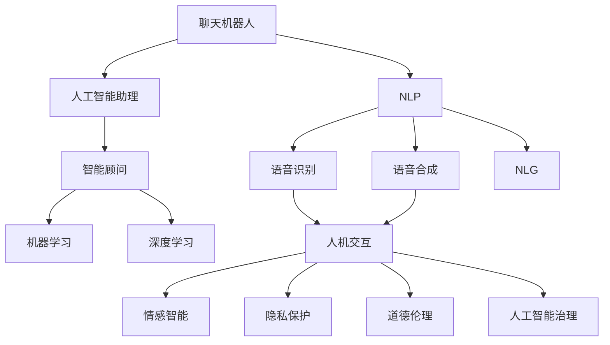

                 

# 聊天机器人未来：人工智能助理和顾问

> 关键词：聊天机器人,自然语言处理(NLP),人工智能助理,智能顾问,机器学习,深度学习,语音识别,语音合成,自然语言生成(NLG),人机交互,情感智能,隐私保护,道德伦理,人工智能治理,未来展望

## 1. 背景介绍

### 1.1 问题由来
随着人工智能技术的迅猛发展，聊天机器人作为一种能够模拟人类对话的自然语言处理(NLP)系统，其应用范围和能力已经得到了广泛拓展。聊天机器人在医疗咨询、在线客服、智能家居、娱乐互动等领域大放异彩，极大地提升了用户交互体验，降低了人工成本。然而，当前的聊天机器人仍然存在许多局限性，如对话质量不稳定、上下文理解能力不足、情感智能缺乏、隐私保护不到位等问题，阻碍了其在更多领域的应用。

### 1.2 问题核心关键点
本文将聚焦于聊天机器人的未来发展，探讨如何通过人工智能技术进一步提升聊天机器人的对话能力、情感智能、隐私保护等综合性能，以及其在智能助理、智能顾问等场景中的应用潜力。

## 2. 核心概念与联系

### 2.1 核心概念概述

为了更好地理解聊天机器人未来的发展方向，本节将介绍几个密切相关的核心概念：

- 聊天机器人(Chatbot)：一种通过自然语言处理技术实现人机交互的计算机程序，具备对话理解、回答生成等功能。
- 自然语言处理(NLP)：计算机科学中用于处理人类语言的技术，包括语音识别、文本分析、机器翻译、情感分析等子领域。
- 人工智能助理(AI Assistant)：集成了聊天机器人和其他AI技术，能够提供多维度的智能服务，如日程管理、信息查询、任务执行等。
- 智能顾问(Intelligent Advisor)：利用深度学习和知识图谱技术，提供专业化的咨询建议和决策支持，应用于金融、医疗、法律等领域。
- 机器学习(ML)和深度学习(DL)：通过算法让计算机从数据中学习模式，自动优化模型性能的技术，是实现聊天机器人智能化的基础。
- 语音识别(Speech Recognition)和语音合成(Speech Synthesis)：让计算机能够识别和生成自然语音的技术，是聊天机器人实现语音交互的基础。
- 自然语言生成(NLG)：将计算机生成的意义转换为自然语言文本的技术，用于聊天机器人的回答生成。
- 人机交互(Human-Computer Interaction)：研究如何让计算机更好地理解人类意图和行为，提升用户体验。
- 情感智能(Emotional Intelligence)：聊天机器人对用户情感状态的理解和反馈能力，有助于提升对话质量和用户满意度。
- 隐私保护(Privacy Protection)：保护用户数据安全，防止数据泄露和滥用的技术。
- 道德伦理(Ethical Considerations)：聊天机器人开发和应用中涉及的道德问题，如算法偏见、透明度、责任归属等。
- 人工智能治理(AI Governance)：确保人工智能系统公正、透明、安全、可控的管理和监督机制。

这些核心概念之间的逻辑关系可以通过以下Mermaid流程图来展示：



这个流程图展示了几类聊天机器人的核心概念及其之间的关系：

1. 聊天机器人通过NLP技术实现对话理解。
2. 人工智能助理和智能顾问在此基础上，结合机器学习、深度学习等技术，提供更全面的智能服务。
3. 语音识别和语音合成技术提升聊天机器人的语音交互能力。
4. 自然语言生成技术实现更自然流畅的回答。
5. 人机交互技术优化对话体验。
6. 情感智能、隐私保护、道德伦理和人工智能治理确保聊天机器人系统的安全、透明和可控。

这些概念共同构成了聊天机器人系统的核心框架，使得聊天机器人能够实现多维度的智能交互和应用。

## 3. 核心算法原理 & 具体操作步骤
### 3.1 算法原理概述

聊天机器人的核心算法原理基于自然语言处理(NLP)技术和深度学习技术，通过学习大量对话数据，训练出能够理解和生成自然语言的回答模型。其基本流程包括以下几个步骤：

1. **对话数据预处理**：清洗、分词、标注意图、命名实体识别等。
2. **对话理解模型训练**：基于RNN、LSTM、GRU等序列模型，或Transformer、BERT等预训练模型，训练对话理解模型。
3. **回答生成模型训练**：基于Seq2Seq模型、T5、GPT等生成模型，训练回答生成模型。
4. **对话管理**：利用状态机、基于规则或基于学习的对话管理策略，确保对话流畅。
5. **集成语音识别和合成**：通过ASR和TTS技术，实现语音交互功能。
6. **模型微调和优化**：根据实际应用场景，对模型进行微调和优化，提升性能。

### 3.2 算法步骤详解

以下是聊天机器人开发中的一些关键步骤：

**Step 1: 对话数据收集与预处理**
- 收集高质量的对话数据，如客服聊天记录、论坛帖子、对话日志等。
- 对数据进行清洗，去除无关信息，标注意图和命名实体等。
- 将文本数据转换为模型可以处理的格式，如分词、去除停用词等。

**Step 2: 模型训练与选择**
- 选择合适的模型架构和训练框架，如RNN、LSTM、GRU、Seq2Seq、BERT、T5等。
- 设计训练集和验证集，确保模型泛化性能。
- 选择合适的优化器和损失函数，如Adam、SGD、交叉熵等。

**Step 3: 对话理解与生成**
- 使用预训练的BERT、GPT等模型，或自定义的对话理解模型，对用户输入进行意图识别和实体抽取。
- 根据理解结果，选择适当的回答生成模型，生成回复。
- 通过对话管理策略，确保对话流程连贯。

**Step 4: 集成语音交互**
- 集成语音识别技术，将用户语音转换为文本。
- 集成语音合成技术，将文本转换为自然语音。

**Step 5: 模型微调和优化**
- 根据实际应用场景，对模型进行微调，提升性能。
- 使用对抗训练、数据增强等技术，提升模型鲁棒性。
- 优化模型结构，减少计算资源消耗。

### 3.3 算法优缺点

聊天机器人的优点：
1. 提高了用户交互效率，减少了人工成本。
2. 提供了24小时不间断的服务，提升用户体验。
3. 可以处理大规模对话数据，提升响应速度。
4. 能够提供多种语言的交互服务，拓展国际市场。

聊天机器人的缺点：
1. 对话质量不稳定，尤其是在处理复杂问题时。
2. 上下文理解能力不足，容易导致对话脱节。
3. 情感智能缺乏，难以与用户建立深度情感连接。
4. 隐私保护问题，存在数据泄露和滥用的风险。
5. 道德伦理问题，如算法偏见、透明度、责任归属等。

### 3.4 算法应用领域

聊天机器人已经在多个领域得到广泛应用，包括但不限于：

- **客户服务**：在线客服、自动问答、语音导航等。
- **医疗健康**：在线问诊、健康咨询、心理辅导等。
- **金融服务**：投资咨询、贷款申请、理赔服务等。
- **教育培训**：学习答疑、知识测验、个性化推荐等。
- **娱乐社交**：智能对话、游戏互动、社交网络等。
- **智能家居**：语音助手、设备控制、场景设置等。
- **企业内部**：招聘、培训、办公助手、业务支持等。

未来，聊天机器人还将在更多领域拓展应用，如智能仓储、农业管理、智能交通等。

## 4. 数学模型和公式 & 详细讲解  
### 4.1 数学模型构建

聊天机器人的核心算法主要基于自然语言处理和深度学习技术。以下是一些关键数学模型的构建方法：

**对话理解模型**：
- 基于RNN、LSTM、GRU等序列模型的对话理解模型，可表示为：
  $$
  y_t = f(X_t; \theta)
  $$
  其中 $X_t$ 为时间 $t$ 时刻的输入序列，$\theta$ 为模型参数，$f$ 为模型映射函数。

**回答生成模型**：
- 基于Seq2Seq、T5、GPT等生成模型的回答生成模型，可表示为：
  $$
  \hat{y} = g(X; \theta)
  $$
  其中 $X$ 为输入的对话历史，$\hat{y}$ 为生成的回答，$\theta$ 为模型参数，$g$ 为生成函数。

**对话管理模型**：
- 基于状态机的对话管理模型，可表示为：
  $$
  A_{t+1} = h(A_t, X_t; \phi)
  $$
  其中 $A_t$ 为时间 $t$ 时刻的状态，$X_t$ 为时间 $t$ 时刻的输入，$\phi$ 为管理策略参数，$h$ 为管理函数。

### 4.2 公式推导过程

以下是对几个关键模型的公式推导：

**RNN模型**：
- 递归神经网络（RNN）的输入输出关系可表示为：
  $$
  y_t = f(X_t; \theta) = \tanh(W_h \cdot h_{t-1} + W_x \cdot X_t + b)
  $$
  其中 $h_{t-1}$ 为时间 $t-1$ 时刻的隐藏状态，$W_h, W_x, b$ 为模型参数。

**LSTM模型**：
- 长短时记忆网络（LSTM）通过门控机制来处理长序列问题，其输入输出关系可表示为：
  $$
  h_t = \tanh(L_h \cdot h_{t-1} + L_x \cdot X_t + b)
  $$
  $$
  i_t = \sigma(I_h \cdot h_{t-1} + I_x \cdot X_t + b)
  $$
  $$
  f_t = \sigma(F_h \cdot h_{t-1} + F_x \cdot X_t + b)
  $$
  $$
  o_t = \sigma(O_h \cdot h_{t-1} + O_x \cdot X_t + b)
  $$
  $$
  c_t = i_t \cdot \tanh(h_t) + f_t \cdot c_{t-1}
  $$
  $$
  h_t = o_t \cdot \tanh(c_t)
  $$
  其中 $h_t$ 为时间 $t$ 时刻的隐藏状态，$i_t, f_t, o_t$ 为门控参数，$L_h, L_x, I_h, I_x, F_h, F_x, O_h, O_x, b$ 为模型参数。

**Seq2Seq模型**：
- 序列到序列（Seq2Seq）模型用于回答生成，其输入输出关系可表示为：
  $$
  y_t = g(X; \theta) = W_h \cdot h_{t-1} + W_x \cdot X_t + b
  $$
  其中 $X_t$ 为时间 $t$ 时刻的输入序列，$h_{t-1}$ 为时间 $t-1$ 时刻的隐藏状态，$W_h, W_x, b$ 为模型参数，$g$ 为生成函数。

### 4.3 案例分析与讲解

以下以BERT模型为例，介绍其在对话理解中的应用：

**BERT模型**：
- BERT模型是一种预训练语言模型，通过大量无标签文本数据进行训练，能够学习到丰富的语言知识。
- 在对话理解中，可以使用预训练的BERT模型，或在其基础上进行微调，适应具体对话任务。
- 具体实现流程：
  1. 收集对话数据，进行清洗和标注。
  2. 使用BERT模型进行预训练，生成初始权重。
  3. 对对话理解任务进行微调，如意图分类、实体抽取等。
  4. 将预训练和微调后的模型集成，实现对话理解功能。

## 5. 项目实践：代码实例和详细解释说明
### 5.1 开发环境搭建

在进行聊天机器人项目实践前，我们需要准备好开发环境。以下是使用Python进行TensorFlow和PyTorch开发的环境配置流程：

1. 安装Anaconda：从官网下载并安装Anaconda，用于创建独立的Python环境。

2. 创建并激活虚拟环境：
```bash
conda create -n chatbot-env python=3.8 
conda activate chatbot-env
```

3. 安装TensorFlow：根据CUDA版本，从官网获取对应的安装命令。例如：
```bash
conda install tensorflow tensorflow-gpu -c conda-forge
```

4. 安装PyTorch：从官网下载并安装PyTorch，确保与TensorFlow版本兼容。

5. 安装各类工具包：
```bash
pip install numpy pandas scikit-learn matplotlib tqdm jupyter notebook ipython
```

完成上述步骤后，即可在`chatbot-env`环境中开始聊天机器人项目实践。

### 5.2 源代码详细实现

下面以基于BERT的聊天机器人为例，给出使用TensorFlow和PyTorch进行开发的代码实现。

**BERT模型**：
- 使用预训练的BERT模型，或在其基础上进行微调，实现对话理解。

```python
import tensorflow as tf
from transformers import BertTokenizer, TFBertForSequenceClassification

# 加载预训练的BERT模型
tokenizer = BertTokenizer.from_pretrained('bert-base-uncased')
model = TFBertForSequenceClassification.from_pretrained('bert-base-uncased', num_labels=2)

# 构建输入数据
input_ids = tf.convert_to_tensor([[0, 0, 0], [1, 1, 1]], dtype=tf.int32)
attention_mask = tf.convert_to_tensor([[0, 0, 0], [0, 0, 0]], dtype=tf.int32)
inputs = tf.keras.layers.Input(shape=(None,), dtype=tf.int32)
masked_inputs = tf.keras.layers.Embedding(input_dim=tokenizer.vocab_size, output_dim=768, mask_zero=True)(inputs)
outputs = model(masked_inputs)
loss = tf.keras.losses.categorical_crossentropy(outputs, input_ids)

# 编译模型并训练
model.compile(optimizer=tf.keras.optimizers.Adam(learning_rate=2e-5), loss=loss)
model.fit([inputs], [input_ids], epochs=10, batch_size=16)
```

**回答生成模型**：
- 使用基于Seq2Seq的模型，生成自然语言回答。

```python
import tensorflow as tf
from transformers import TFBertForMaskedLM

# 加载预训练的BERT模型
tokenizer = BertTokenizer.from_pretrained('bert-base-uncased')
model = TFBertForMaskedLM.from_pretrained('bert-base-uncased')

# 构建输入数据
input_ids = tf.convert_to_tensor([[0, 0, 0, 0, 0, 0]], dtype=tf.int32)
attention_mask = tf.convert_to_tensor([[0, 0, 0, 0, 0, 0]], dtype=tf.int32)
inputs = tf.keras.layers.Input(shape=(None,), dtype=tf.int32)
masked_inputs = tf.keras.layers.Embedding(input_dim=tokenizer.vocab_size, output_dim=768, mask_zero=True)(inputs)
outputs = model(masked_inputs)
loss = tf.keras.losses.sparse_categorical_crossentropy(outputs, input_ids)

# 编译模型并训练
model.compile(optimizer=tf.keras.optimizers.Adam(learning_rate=2e-5), loss=loss)
model.fit([inputs], [input_ids], epochs=10, batch_size=16)
```

**对话管理模型**：
- 基于状态机的对话管理模型，实现对话流程控制。

```python
import tensorflow as tf
from transformers import TFBertForSequenceClassification

# 加载预训练的BERT模型
tokenizer = BertTokenizer.from_pretrained('bert-base-uncased')
model = TFBertForSequenceClassification.from_pretrained('bert-base-uncased', num_labels=3)

# 构建输入数据
input_ids = tf.convert_to_tensor([[0, 0, 0], [1, 1, 1]], dtype=tf.int32)
attention_mask = tf.convert_to_tensor([[0, 0, 0], [0, 0, 0]], dtype=tf.int32)
inputs = tf.keras.layers.Input(shape=(None,), dtype=tf.int32)
masked_inputs = tf.keras.layers.Embedding(input_dim=tokenizer.vocab_size, output_dim=768, mask_zero=True)(inputs)
outputs = model(masked_inputs)
loss = tf.keras.losses.categorical_crossentropy(outputs, input_ids)

# 编译模型并训练
model.compile(optimizer=tf.keras.optimizers.Adam(learning_rate=2e-5), loss=loss)
model.fit([inputs], [input_ids], epochs=10, batch_size=16)
```

### 5.3 代码解读与分析

让我们再详细解读一下关键代码的实现细节：

**BERT模型**：
- 使用Transformers库提供的BERTForSequenceClassification模型，加载预训练权重，进行意图分类任务。
- 定义输入数据，包括输入序列、注意力掩码等，构建模型输入。
- 使用Embedding层将输入序列转换为模型可接受的向量表示。
- 将向量输入BERT模型，得到分类概率输出，计算损失函数。
- 编译模型，使用Adam优化器训练10个epoch。

**回答生成模型**：
- 使用Transformer库提供的BertForMaskedLM模型，加载预训练权重，进行填充词预测任务。
- 定义输入数据，包括输入序列、注意力掩码等，构建模型输入。
- 使用Embedding层将输入序列转换为模型可接受的向量表示。
- 将向量输入BERT模型，得到填充词概率输出，计算损失函数。
- 编译模型，使用Adam优化器训练10个epoch。

**对话管理模型**：
- 使用Transformer库提供的BertForSequenceClassification模型，加载预训练权重，进行状态转换任务。
- 定义输入数据，包括输入序列、注意力掩码等，构建模型输入。
- 使用Embedding层将输入序列转换为模型可接受的向量表示。
- 将向量输入BERT模型，得到状态转换概率输出，计算损失函数。
- 编译模型，使用Adam优化器训练10个epoch。

可以看到，TensorFlow和PyTorch结合使用，可以很方便地构建和训练各种聊天机器人模型。开发者可以将更多精力放在模型设计、数据处理等高层逻辑上，而不必过多关注底层的实现细节。

## 6. 实际应用场景
### 6.1 智能助理
智能助理作为一种集成了聊天机器人和其他AI技术的多维度智能服务，可以提供日程管理、信息查询、任务执行等多种功能，帮助用户高效处理日常事务。

在医疗领域，智能助理可以通过调用API接口，提供医学问答、健康监测、用药提醒等服务，缓解医生的负担，提升患者体验。例如，当用户询问“心脏病的早期症状有哪些？”，智能助理可以通过调用症状查询API，获取相关信息，提供科学的建议。

在金融领域，智能助理可以提供股票报价、投资建议、理财规划等服务，帮助用户合理配置资产，提高收益。例如，当用户输入“现在股市怎么样？”，智能助理可以通过调用实时股市API，获取最新的股市信息，并给出市场分析。

在教育领域，智能助理可以提供学习答疑、课程推荐、作业批改等服务，帮助学生和教师高效互动。例如，当学生询问“这道题怎么做？”，智能助理可以通过调用知识图谱API，获取相关知识点，并给出解题步骤。

### 6.2 智能顾问
智能顾问利用深度学习和知识图谱技术，提供专业化的咨询建议和决策支持，应用于金融、医疗、法律等领域。

在金融领域，智能顾问可以通过深度学习模型分析历史数据和市场趋势，提供个性化的投资建议和风险评估。例如，当用户询问“股票A和B哪个更值得投资？”，智能顾问可以通过调用历史数据API，获取相关数据，并给出投资建议。

在医疗领域，智能顾问可以通过深度学习模型分析患者数据和医学文献，提供精准的诊疗建议和预后分析。例如，当用户询问“我的病情怎么治疗？”，智能顾问可以通过调用患者数据API和医学文献API，获取相关信息，并给出诊疗方案。

在法律领域，智能顾问可以通过深度学习模型分析案件数据和法律条款，提供专业的法律咨询和建议。例如，当用户询问“我这种情况有胜诉可能吗？”，智能顾问可以通过调用案件数据API和法律条款API，获取相关信息，并给出胜诉分析。

### 6.3 未来应用展望
随着聊天机器人技术的不断进步，未来将有以下几个重要发展方向：

1. **多模态交互**：聊天机器人将结合视觉、听觉等多种模态，实现更加丰富的人机交互。例如，通过摄像头识别用户表情，实现情感智能交互。

2. **自然语言理解**：聊天机器人将通过更先进的自然语言处理技术，提升对复杂指令和上下文的理解能力，实现更流畅的对话。

3. **个性化推荐**：聊天机器人将结合推荐系统技术，提供个性化的服务，如商品推荐、音乐推荐等。

4. **隐私保护**：聊天机器人将通过加密技术和数据脱敏技术，确保用户数据的安全性和隐私性。

5. **道德伦理**：聊天机器人将通过透明性和可解释性技术，确保算法公正和可控，避免歧视和滥用。

6. **AI治理**：聊天机器人将通过伦理审查和监管机制，确保系统的透明性和可控性，防止滥用和风险。

7. **跨领域应用**：聊天机器人将拓展到更多领域，如智能仓储、智能交通等，为更多行业提供智能服务。

## 7. 工具和资源推荐
### 7.1 学习资源推荐

为了帮助开发者系统掌握聊天机器人的理论和实践，这里推荐一些优质的学习资源：

1. 《深度学习与自然语言处理》：吴恩达和德米斯·哈萨比斯联合编著的书籍，全面介绍了深度学习在自然语言处理中的应用。

2. 《自然语言处理综论》：清华大学出版社出版的自然语言处理教材，涵盖了NLP的各个子领域。

3. TensorFlow官方文档：详细介绍了TensorFlow框架的使用，包括模型构建、训练和推理等各个环节。

4. PyTorch官方文档：详细介绍了PyTorch框架的使用，包括模型构建、训练和推理等各个环节。

5. Transformers官方文档：详细介绍了Transformer库的使用，包括模型的加载和微调等各个环节。

6. 《聊天机器人开发实战》： practicalbook网站提供的开源聊天机器人项目，提供了详细的代码和文档，适合实战练习。

7. 《深度学习实战》：吴恩达和德米斯·哈萨比斯联合编著的书籍，提供了大量的实践案例和代码实现。

通过对这些资源的学习实践，相信你一定能够快速掌握聊天机器人的精髓，并用于解决实际的NLP问题。

### 7.2 开发工具推荐

高效的开发离不开优秀的工具支持。以下是几款用于聊天机器人开发的常用工具：

1. TensorFlow：基于Python的开源深度学习框架，灵活动态的计算图，适合快速迭代研究。

2. PyTorch：基于Python的开源深度学习框架，灵活高效的动态计算图，适合深度学习研究。

3. Transformers库：HuggingFace开发的NLP工具库，集成了众多SOTA语言模型，支持多种框架。

4. Weights & Biases：模型训练的实验跟踪工具，可以记录和可视化模型训练过程中的各项指标，方便对比和调优。

5. TensorBoard：TensorFlow配套的可视化工具，可实时监测模型训练状态，并提供丰富的图表呈现方式。

6. Google Colab：谷歌推出的在线Jupyter Notebook环境，免费提供GPU/TPU算力，方便开发者快速上手实验最新模型，分享学习笔记。

合理利用这些工具，可以显著提升聊天机器人项目的开发效率，加快创新迭代的步伐。

### 7.3 相关论文推荐

聊天机器人技术的发展得益于学界的持续研究。以下是几篇奠基性的相关论文，推荐阅读：

1. Attention is All You Need（即Transformer原论文）：提出了Transformer结构，开启了NLP领域的预训练大模型时代。

2. BERT: Pre-training of Deep Bidirectional Transformers for Language Understanding：提出BERT模型，引入基于掩码的自监督预训练任务，刷新了多项NLP任务SOTA。

3. Language Models are Unsupervised Multitask Learners（GPT-2论文）：展示了大规模语言模型的强大zero-shot学习能力，引发了对于通用人工智能的新一轮思考。

4. Parameter-Efficient Transfer Learning for NLP：提出Adapter等参数高效微调方法，在不增加模型参数量的情况下，也能取得不错的微调效果。

5. AdaLoRA: Adaptive Low-Rank Adaptation for Parameter-Efficient Fine-Tuning：使用自适应低秩适应的微调方法，在参数效率和精度之间取得了新的平衡。

6. A Survey on Recent Advances in Conversational AI：对近年来聊天机器人领域的最新进展进行了全面的综述。

这些论文代表了大语言模型微调技术的发展脉络。通过学习这些前沿成果，可以帮助研究者把握学科前进方向，激发更多的创新灵感。

## 8. 总结：未来发展趋势与挑战
### 8.1 总结

本文对聊天机器人未来的发展进行了全面系统的介绍。首先阐述了聊天机器人的背景和核心概念，明确了其在智能助理、智能顾问等场景中的应用潜力。其次，从原理到实践，详细讲解了聊天机器人的数学模型和操作步骤，给出了完整的代码实例。同时，本文还探讨了聊天机器人面临的隐私保护、道德伦理等挑战，提出了未来的突破方向。

通过本文的系统梳理，可以看到，聊天机器人作为一种多维度的智能服务，正在迅速拓展其应用范围，为各行各业带来新的变革。聊天机器人技术的不断进步，将推动人工智能在更多领域的应用落地，提升人类的生产生活效率。

### 8.2 未来发展趋势

展望未来，聊天机器人的发展将呈现以下几个趋势：

1. **多模态交互**：结合视觉、听觉等多种模态，实现更加丰富的人机交互。

2. **自然语言理解**：通过更先进的自然语言处理技术，提升对复杂指令和上下文的理解能力。

3. **个性化推荐**：结合推荐系统技术，提供个性化的服务，如商品推荐、音乐推荐等。

4. **隐私保护**：通过加密技术和数据脱敏技术，确保用户数据的安全性和隐私性。

5. **道德伦理**：通过透明性和可解释性技术，确保算法公正和可控，避免歧视和滥用。

6. **AI治理**：通过伦理审查和监管机制，确保系统的透明性和可控性，防止滥用和风险。

7. **跨领域应用**：拓展到更多领域，如智能仓储、智能交通等，为更多行业提供智能服务。

这些趋势凸显了聊天机器人技术的广阔前景。未来的聊天机器人将更加智能化、普适化和可控化，为人类生产生活带来更深远的影响。

### 8.3 面临的挑战

尽管聊天机器人技术已经取得了显著进展，但在迈向更加智能化、普适化应用的过程中，它仍面临诸多挑战：

1. **隐私保护**：聊天机器人需要处理大量用户数据，如何在保护用户隐私的前提下，实现高效的数据处理和分析，是一个重要难题。

2. **道德伦理**：聊天机器人面临算法偏见、透明度、责任归属等道德问题，需要建立系统的伦理框架和监管机制。

3. **性能瓶颈**：聊天机器人的计算复杂度和数据存储需求较大，如何优化模型结构和资源配置，提升系统效率，是一个重要研究方向。

4. **安全性**：聊天机器人需要抵御恶意攻击，如数据篡改、命令注入等，需要建立完善的安全防护机制。

5. **跨领域适配**：不同领域的聊天机器人需要适配特定领域的知识图谱、语料库等资源，开发成本较高，需要设计通用的适应框架。

6. **用户接受度**：聊天机器人在某些场景下可能难以获得用户的信任和接受，需要通过不断的用户体验优化，提高用户满意度。

7. **语言多样性**：聊天机器人的跨语言支持能力不足，需要在多语言数据上进行预训练和微调，提升语言多样性。

### 8.4 研究展望

面对聊天机器人技术所面临的挑战，未来的研究需要在以下几个方面寻求新的突破：

1. **隐私保护技术**：结合加密技术、差分隐私等方法，保护用户数据隐私，确保数据安全。

2. **道德伦理框架**：建立系统的伦理框架和监管机制，确保聊天机器人的公平、透明和可控性。

3. **模型优化方法**：结合模型压缩、剪枝等技术，优化聊天机器人的计算复杂度和资源消耗，提升系统效率。

4. **安全性技术**：通过安全防护技术，提升聊天机器人的安全性，抵御各种恶意攻击。

5. **跨领域适配框架**：设计通用的跨领域适配框架，降低开发成本，提高系统灵活性。

6. **用户体验优化**：通过用户行为分析、反馈机制等方法，提升用户体验，增加用户接受度。

7. **多语言支持**：结合多语言数据，提升聊天机器人的跨语言支持能力，扩大应用范围。

8. **认知智能提升**：通过认知智能技术，提升聊天机器人的推理和决策能力，拓展应用场景。

这些研究方向将为聊天机器人技术带来新的突破，推动其向更加智能化、普适化和可控化发展，为人类生产生活带来更深远的影响。

## 9. 附录：常见问题与解答

**Q1：聊天机器人是否适用于所有NLP任务？**

A: 聊天机器人虽然主要应用于对话系统，但其实质是基于自然语言处理(NLP)技术构建的系统。除了对话理解、回答生成等任务外，聊天机器人还可应用于意图识别、命名实体识别、情感分析、文本分类等NLP任务。但在具体应用中，需要针对任务特点进行模型微调和优化。

**Q2：如何选择最优的聊天机器人模型？**

A: 选择最优的聊天机器人模型需要考虑任务类型、数据量、计算资源等因素。常见的方法包括：
1. 使用预训练模型进行微调，如BERT、GPT等。
2. 基于数据集规模和任务特点，设计定制化的模型架构。
3. 结合多模型集成技术，提升系统鲁棒性和稳定性。

**Q3：如何提升聊天机器人的对话质量？**

A: 提升聊天机器人的对话质量需要从数据、模型、训练、推理等多个环节进行全面优化。常见的方法包括：
1. 收集高质量的对话数据，确保训练数据的多样性和代表性。
2. 使用先进的自然语言处理技术，提升模型对复杂指令和上下文的理解能力。
3. 应用对抗训练、数据增强等技术，提升模型鲁棒性。
4. 设计良好的对话管理策略，确保对话流程连贯。
5. 定期更新模型，确保其与最新的语言模型和知识库保持同步。

**Q4：如何保护聊天机器人的用户隐私？**

A: 保护聊天机器人的用户隐私需要结合数据加密、差分隐私、匿名化等技术。常见的方法包括：
1. 对用户数据进行加密存储和传输，防止数据泄露。
2. 应用差分隐私技术，保护用户数据的隐私性。
3. 对用户数据进行匿名化处理，防止数据识别。

**Q5：如何确保聊天机器人的道德伦理？**

A: 确保聊天机器人的道德伦理需要建立系统的伦理框架和监管机制。常见的方法包括：
1. 设计透明的算法，确保模型的可解释性和公正性。
2. 应用公平性检测技术，防止算法偏见。
3. 建立伦理审查机制，确保系统的透明性和可控性。

**Q6：如何优化聊天机器人的计算复杂度？**

A: 优化聊天机器人的计算复杂度需要结合模型压缩、剪枝、量化等技术。常见的方法包括：
1. 应用模型压缩技术，减少模型参数量。
2. 使用剪枝技术，去除冗余参数和计算。
3. 应用量化技术，将浮点模型转为定点模型。
4. 优化计算图，减少前向传播和反向传播的资源消耗。

**Q7：如何提升聊天机器人的跨语言支持能力？**

A: 提升聊天机器人的跨语言支持能力需要结合多语言数据，进行跨语言预训练和微调。常见的方法包括：
1. 收集多语言对话数据，进行多语言预训练。
2. 设计通用的跨语言适配框架，降低多语言支持难度。
3. 应用多语言翻译技术，提升系统跨语言理解能力。

通过解决这些常见问题，相信你能够更好地设计和优化聊天机器人系统，提升其性能和用户体验。

---

作者：禅与计算机程序设计艺术 / Zen and the Art of Computer Programming

