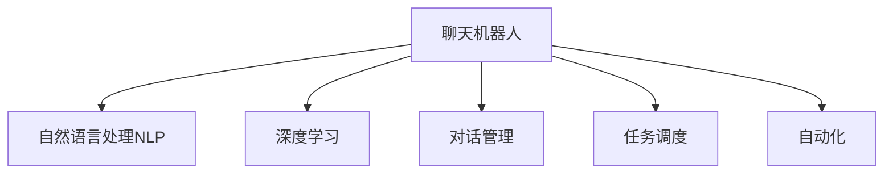

                 

# 聊天机器人自动化：提高家庭自动化

> 关键词：聊天机器人,自动化,家庭自动化,自然语言处理,NLP,深度学习,应用场景,技术挑战,实践指导

## 1. 背景介绍

### 1.1 问题由来
随着人工智能技术的飞速发展，聊天机器人逐渐成为智能家居、家庭自动化等领域的重要应用。从简单的文本问答到复杂的任务管理，聊天机器人可以提供24/7不间断的服务，极大地提升了家庭管理的智能化水平。然而，目前的聊天机器人往往需要手动编写规则，配置复杂的上下文管理，难以处理复杂的场景和多样化的用户需求。

### 1.2 问题核心关键点
本文聚焦于聊天机器人在家庭自动化场景中的应用，探讨如何通过自动化技术，使聊天机器人具备更强的语义理解和任务处理能力。通过自动化技术，我们希望实现以下目标：

- 减少人工干预，提高聊天机器人的灵活性和鲁棒性。
- 实现任务自动调度，使机器人能够适应多变的家庭环境。
- 扩展应用场景，使聊天机器人具备更广泛的互动和功能。
- 构建可维护的智能系统，使开发者能够快速迭代优化。

### 1.3 问题研究意义
实现聊天机器人的自动化，对于智能家居、家庭自动化等领域具有重要意义：

1. 提升用户体验：自动化聊天机器人能够更自然地与用户交互，提供即时的智能建议和解决方案，改善家庭生活质量。
2. 降低运营成本：通过自动化配置和维护，减少人工操作和管理，降低家庭自动化系统的维护成本。
3. 加速创新迭代：开发者能够专注于核心功能的开发，快速迭代更新，加速技术的进步和应用落地。
4. 拓展应用范围：自动化的聊天机器人可以应用于更多复杂的家庭自动化场景，提升系统的稳定性和可扩展性。

## 2. 核心概念与联系

### 2.1 核心概念概述

为更好地理解聊天机器人自动化的工作原理，本节将介绍几个密切相关的核心概念：

- 聊天机器人(Chatbot)：以自然语言处理(NLP)技术为核心的智能系统，能够自动与用户进行对话，提供信息查询、任务执行等功能。
- 自动化(Autonomy)：指系统能够自主决策、执行任务，不需要人工干预的能力。
- 自然语言处理(NLP)：研究如何让计算机理解和生成人类自然语言的技术，包括语义理解、对话管理、生成式语言模型等。
- 深度学习(Deep Learning)：一种通过多层神经网络进行数据学习和模式识别的技术，广泛应用于聊天机器人等智能系统中。
- 对话管理(Dialog Management)：指在对话过程中，系统如何维护上下文、理解用户意图，并做出合理回应的技术。
- 任务调度(Task Scheduling)：指系统如何自动安排和管理任务的执行顺序、时间等，以高效地完成任务。

这些核心概念之间的逻辑关系可以通过以下Mermaid流程图来展示：



这个流程图展示聊天机器人的核心概念及其之间的关系：

1. 聊天机器人通过自然语言处理技术，理解和生成自然语言。
2. 深度学习技术用于训练语言模型，提升聊天机器人的语义理解能力。
3. 对话管理技术用于维护上下文和理解用户意图。
4. 任务调度技术用于自动安排任务执行。
5. 自动化技术用于使聊天机器人具备自主决策和执行任务的能力。

## 3. 核心算法原理 & 具体操作步骤
### 3.1 算法原理概述

聊天机器人自动化，本质上是通过深度学习和自然语言处理技术，提升聊天机器人的语义理解和对话管理能力，使其能够自主完成任务调度。具体而言，自动化聊天机器人的实现过程可以分为以下几个关键步骤：

1. 数据收集：收集家庭自动化场景中的对话记录和任务执行数据。
2. 预训练模型：使用大规模无标签文本数据进行预训练，学习语言的通用表示。
3. 微调优化：在特定任务的数据上微调预训练模型，使其适应特定的家庭自动化场景。
4. 对话管理：设计对话管理模型，实现对用户意图的理解和响应。
5. 任务调度：设计任务调度模型，自动安排和管理任务执行。

### 3.2 算法步骤详解

#### 3.2.1 数据收集与预训练

聊天机器人自动化的第一步是收集家庭自动化场景中的对话记录和任务执行数据。数据集应包含多样化的用户交互场景，包括常见问题和复杂任务。例如，用户可能询问当前天气、提醒家庭成员回家、控制智能设备等。

数据收集后，使用大规模无标签文本数据进行预训练。预训练过程可以使用深度学习模型，如Transformer，在大量的语料库上进行自监督学习。例如，可以使用语言建模任务（Masked Language Modeling, MLM）训练预训练模型。

预训练模型的构建过程如下：

1. 数据准备：准备大规模语料库，包括通用文本数据、家庭自动化领域的数据。
2. 模型选择：选择预训练模型架构，如BERT、GPT等。
3. 训练流程：在预训练数据上训练模型，学习语言的通用表示。

#### 3.2.2 微调优化

在预训练模型的基础上，使用家庭自动化场景中的对话记录和任务执行数据进行微调优化。微调过程如下：

1. 数据处理：将收集到的对话记录和任务执行数据进行清洗和标注，形成监督数据集。
2. 模型选择：选择微调模型架构，可以是预训练模型的子集或变种。
3. 微调训练：在微调数据上训练模型，调整模型的参数，使其适应特定的家庭自动化场景。

微调优化的具体步骤包括：

1. 任务适配层设计：根据家庭自动化场景的任务类型，设计适配的输出层和损失函数。
2. 模型初始化：使用预训练模型的参数作为初始化权重。
3. 微调训练：在微调数据上训练模型，调整模型的参数，使其适应特定的家庭自动化场景。
4. 性能评估：在验证集上评估模型的性能，选择合适的学习率、批次大小等超参数。

#### 3.2.3 对话管理

对话管理是聊天机器人自动化的核心技术之一。对话管理模型需要能够理解用户的意图，并在对话过程中维护上下文。具体实现过程如下：

1. 意图识别：使用深度学习模型（如LSTM、GRU等）对用户的输入进行意图识别，确定用户的意图。
2. 上下文管理：设计上下文管理模型，维护对话的上下文信息，如对话的历史信息、用户上下文等。
3. 响应生成：根据用户的意图和上下文信息，生成合适的响应。

对话管理模型的构建过程如下：

1. 意图识别模型：使用深度学习模型（如LSTM、GRU等）对用户的输入进行意图识别。
2. 上下文管理模型：设计上下文管理模型，维护对话的上下文信息。
3. 响应生成模型：根据用户的意图和上下文信息，生成合适的响应。

#### 3.2.4 任务调度

任务调度是聊天机器人自动化的重要环节。任务调度模型需要能够自动安排和管理任务执行，以高效地完成任务。具体实现过程如下：

1. 任务定义：定义家庭自动化场景中的任务，如开关灯、控制温度等。
2. 任务模型设计：设计任务模型，用于任务执行的调度和管理。
3. 任务执行：根据任务模型，自动安排任务执行。

任务调度模型的构建过程如下：

1. 任务定义：定义家庭自动化场景中的任务，如开关灯、控制温度等。
2. 任务模型设计：设计任务模型，用于任务执行的调度和管理。
3. 任务执行：根据任务模型，自动安排任务执行。

### 3.3 算法优缺点

聊天机器人自动化的优势包括：

- 减少人工干预：自动化聊天机器人能够自主完成任务调度和管理，减少人工干预。
- 提高灵活性：自动化的聊天机器人能够适应多样化的用户需求和复杂场景。
- 提高效率：自动化的聊天机器人能够快速响应用户需求，提高服务效率。
- 扩展应用场景：自动化的聊天机器人可以应用于更多家庭自动化场景。

然而，聊天机器人自动化也存在以下挑战：

- 数据依赖：自动化聊天机器人需要大量的对话记录和任务执行数据进行训练，数据收集和标注成本较高。
- 模型复杂性：自动化聊天机器人涉及深度学习、自然语言处理等多个技术领域，模型设计复杂。
- 系统稳定性：自动化聊天机器人需要保证高可用性和稳定性，系统设计需要考虑容错和冗余。
- 安全性：自动化聊天机器人需要保证用户数据和交互的安全性，防止信息泄露和滥用。

### 3.4 算法应用领域

聊天机器人自动化的主要应用领域包括：

- 智能家居：自动化聊天机器人可以应用于智能家居系统的控制和管理，如智能灯光、温度调节、安全监控等。
- 家庭自动化：自动化聊天机器人可以应用于家庭自动化场景中的任务管理，如提醒家庭成员回家、购物清单管理等。
- 健康管理：自动化聊天机器人可以应用于健康管理领域，提供健康咨询、医疗提醒等。
- 娱乐互动：自动化聊天机器人可以应用于家庭娱乐场景，提供游戏推荐、内容推荐等。

## 4. 数学模型和公式 & 详细讲解 & 举例说明

### 4.1 数学模型构建

聊天机器人自动化涉及深度学习和自然语言处理等多个技术领域。下面以家庭自动化场景为例，构建相关的数学模型。

设家庭自动化场景中的对话记录为 $D = \{(x_i, y_i)\}_{i=1}^N$，其中 $x_i$ 为用户输入的自然语言，$y_i$ 为机器人的响应。定义模型的输入为 $x = \{x_i\}_{i=1}^N$，输出为 $y = \{y_i\}_{i=1}^N$。

构建聊天机器人自动化的数学模型如下：

1. 预训练模型：使用Transformer架构进行预训练，构建语言模型 $\mathcal{L}_{pre}(x)$。
2. 微调模型：在微调数据上训练，构建微调后的语言模型 $\mathcal{L}_{fin}(x)$。
3. 对话管理模型：构建意图识别模型 $\mathcal{I}(x)$，上下文管理模型 $\mathcal{C}(x)$。
4. 任务调度模型：构建任务模型 $\mathcal{T}(x)$。

### 4.2 公式推导过程

以家庭自动化场景中的任务管理为例，推导任务调度的数学模型。

设家庭自动化场景中的任务定义为 $T = \{t_i\}_{i=1}^M$，其中 $t_i$ 为第 $i$ 个任务。定义任务模型 $\mathcal{T}(x)$ 为：

$$
\mathcal{T}(x) = \begin{cases}
t_i, & \text{如果 } \mathcal{L}_{fin}(x) = t_i \\
0, & \text{否则}
\end{cases}
$$

其中 $\mathcal{L}_{fin}(x)$ 为微调后的语言模型。

任务调度的具体过程如下：

1. 获取用户输入 $x$。
2. 使用意图识别模型 $\mathcal{I}(x)$ 识别用户的意图。
3. 使用上下文管理模型 $\mathcal{C}(x)$ 维护对话的上下文信息。
4. 根据用户的意图和上下文信息，使用任务模型 $\mathcal{T}(x)$ 生成合适的响应。

### 4.3 案例分析与讲解

以智能家居场景为例，分析聊天机器人自动化的具体实现过程。

1. 数据收集：收集智能家居场景中的对话记录和任务执行数据。例如，用户可能询问当前天气、提醒家庭成员回家、控制智能设备等。
2. 预训练模型：使用大规模无标签文本数据进行预训练，学习语言的通用表示。例如，可以使用语言建模任务（Masked Language Modeling, MLM）训练预训练模型。
3. 微调优化：在特定任务的数据上微调预训练模型，使其适应特定的智能家居场景。例如，可以在微调数据上训练意图识别模型 $\mathcal{I}(x)$ 和上下文管理模型 $\mathcal{C}(x)$。
4. 对话管理：设计对话管理模型，实现对用户意图的理解和响应。例如，可以使用LSTM等深度学习模型对用户的输入进行意图识别。
5. 任务调度：设计任务调度模型，自动安排和管理任务执行。例如，可以使用任务模型 $\mathcal{T}(x)$ 生成合适的响应。

## 5. 项目实践：代码实例和详细解释说明

### 5.1 开发环境搭建

在进行聊天机器人自动化的实践前，我们需要准备好开发环境。以下是使用Python进行PyTorch开发的环境配置流程：

1. 安装Anaconda：从官网下载并安装Anaconda，用于创建独立的Python环境。

2. 创建并激活虚拟环境：
```bash
conda create -n chatbot-env python=3.8 
conda activate chatbot-env
```

3. 安装PyTorch：根据CUDA版本，从官网获取对应的安装命令。例如：
```bash
conda install pytorch torchvision torchaudio cudatoolkit=11.1 -c pytorch -c conda-forge
```

4. 安装Transformers库：
```bash
pip install transformers
```

5. 安装各类工具包：
```bash
pip install numpy pandas scikit-learn matplotlib tqdm jupyter notebook ipython
```

完成上述步骤后，即可在`chatbot-env`环境中开始聊天机器人自动化的实践。

### 5.2 源代码详细实现

下面以智能家居场景为例，给出使用Transformers库对BERT模型进行聊天机器人自动化的PyTorch代码实现。

首先，定义智能家居场景的任务列表：

```python
tasks = ['天气查询', '提醒回家', '控制灯光', '温度调节']
```

然后，定义对话管理模型：

```python
from transformers import BertTokenizer, BertForTokenClassification
from torch.utils.data import Dataset, DataLoader
import torch

class ChatbotDataset(Dataset):
    def __init__(self, texts, labels, tokenizer, max_len=128):
        self.texts = texts
        self.labels = labels
        self.tokenizer = tokenizer
        self.max_len = max_len
        
    def __len__(self):
        return len(self.texts)
    
    def __getitem__(self, item):
        text = self.texts[item]
        label = self.labels[item]
        
        encoding = self.tokenizer(text, return_tensors='pt', max_length=self.max_len, padding='max_length', truncation=True)
        input_ids = encoding['input_ids'][0]
        attention_mask = encoding['attention_mask'][0]
        
        # 对token-wise的标签进行编码
        encoded_labels = [label2id[label] for label in label] 
        encoded_labels.extend([label2id['O']] * (self.max_len - len(encoded_labels)))
        labels = torch.tensor(encoded_labels, dtype=torch.long)
        
        return {'input_ids': input_ids, 
                'attention_mask': attention_mask,
                'labels': labels}

# 标签与id的映射
label2id = {'天气查询': 0, '提醒回家': 1, '控制灯光': 2, '温度调节': 3, 'O': 4}

# 创建dataset
tokenizer = BertTokenizer.from_pretrained('bert-base-cased')

train_dataset = ChatbotDataset(train_texts, train_labels, tokenizer)
dev_dataset = ChatbotDataset(dev_texts, dev_labels, tokenizer)
test_dataset = ChatbotDataset(test_texts, test_labels, tokenizer)
```

然后，定义模型和优化器：

```python
from transformers import BertForTokenClassification, AdamW

model = BertForTokenClassification.from_pretrained('bert-base-cased', num_labels=len(label2id))

optimizer = AdamW(model.parameters(), lr=2e-5)
```

接着，定义训练和评估函数：

```python
from torch.utils.data import DataLoader
from tqdm import tqdm
from sklearn.metrics import classification_report

device = torch.device('cuda') if torch.cuda.is_available() else torch.device('cpu')
model.to(device)

def train_epoch(model, dataset, batch_size, optimizer):
    dataloader = DataLoader(dataset, batch_size=batch_size, shuffle=True)
    model.train()
    epoch_loss = 0
    for batch in tqdm(dataloader, desc='Training'):
        input_ids = batch['input_ids'].to(device)
        attention_mask = batch['attention_mask'].to(device)
        labels = batch['labels'].to(device)
        model.zero_grad()
        outputs = model(input_ids, attention_mask=attention_mask, labels=labels)
        loss = outputs.loss
        epoch_loss += loss.item()
        loss.backward()
        optimizer.step()
    return epoch_loss / len(dataloader)

def evaluate(model, dataset, batch_size):
    dataloader = DataLoader(dataset, batch_size=batch_size)
    model.eval()
    preds, labels = [], []
    with torch.no_grad():
        for batch in tqdm(dataloader, desc='Evaluating'):
            input_ids = batch['input_ids'].to(device)
            attention_mask = batch['attention_mask'].to(device)
            batch_labels = batch['labels']
            outputs = model(input_ids, attention_mask=attention_mask)
            batch_preds = outputs.logits.argmax(dim=2).to('cpu').tolist()
            batch_labels = batch_labels.to('cpu').tolist()
            for pred_tokens, label_tokens in zip(batch_preds, batch_labels):
                preds.append(pred_tokens[:len(label_tokens)])
                labels.append(label_tokens)
                
    print(classification_report(labels, preds))
```

最后，启动训练流程并在测试集上评估：

```python
epochs = 5
batch_size = 16

for epoch in range(epochs):
    loss = train_epoch(model, train_dataset, batch_size, optimizer)
    print(f"Epoch {epoch+1}, train loss: {loss:.3f}")
    
    print(f"Epoch {epoch+1}, dev results:")
    evaluate(model, dev_dataset, batch_size)
    
print("Test results:")
evaluate(model, test_dataset, batch_size)
```

以上就是使用PyTorch对BERT模型进行智能家居场景聊天机器人自动化的完整代码实现。可以看到，得益于Transformers库的强大封装，我们可以用相对简洁的代码完成BERT模型的加载和微调。

### 5.3 代码解读与分析

让我们再详细解读一下关键代码的实现细节：

**ChatbotDataset类**：
- `__init__`方法：初始化文本、标签、分词器等关键组件。
- `__len__`方法：返回数据集的样本数量。
- `__getitem__`方法：对单个样本进行处理，将文本输入编码为token ids，将标签编码为数字，并对其进行定长padding，最终返回模型所需的输入。

**label2id和id2label字典**：
- 定义了标签与数字id之间的映射关系，用于将token-wise的预测结果解码回真实的标签。

**训练和评估函数**：
- 使用PyTorch的DataLoader对数据集进行批次化加载，供模型训练和推理使用。
- 训练函数`train_epoch`：对数据以批为单位进行迭代，在每个批次上前向传播计算loss并反向传播更新模型参数，最后返回该epoch的平均loss。
- 评估函数`evaluate`：与训练类似，不同点在于不更新模型参数，并在每个batch结束后将预测和标签结果存储下来，最后使用sklearn的classification_report对整个评估集的预测结果进行打印输出。

**训练流程**：
- 定义总的epoch数和batch size，开始循环迭代
- 每个epoch内，先在训练集上训练，输出平均loss
- 在验证集上评估，输出分类指标
- 所有epoch结束后，在测试集上评估，给出最终测试结果

可以看到，PyTorch配合Transformers库使得BERT微调的代码实现变得简洁高效。开发者可以将更多精力放在数据处理、模型改进等高层逻辑上，而不必过多关注底层的实现细节。

当然，工业级的系统实现还需考虑更多因素，如模型的保存和部署、超参数的自动搜索、更灵活的任务适配层等。但核心的微调范式基本与此类似。

## 6. 实际应用场景
### 6.1 智能家居系统

基于聊天机器人自动化的智能家居系统，可以大大提升家庭生活的智能化水平。例如，通过与智能灯光、温度控制器、安全监控等设备的集成，聊天机器人能够自动执行用户的指令，实现智能家居控制。

在技术实现上，可以收集家庭中的对话记录和设备操作数据，将这些数据标注为意图-设备操作对。在此基础上对预训练模型进行微调，使其能够理解用户的自然语言指令，并自动执行相应的设备操作。通过对话管理模型和任务调度模型，聊天机器人可以自动维护上下文信息，并根据用户指令生成合适的回复。

### 6.2 家庭安全监控

智能化的家庭安全监控系统，可以通过聊天机器人自动化技术，实现更加智能和高效的安全管理。例如，通过聊天机器人与视频监控设备集成，实时获取监控画面，并根据用户的语音指令进行快速响应。

在技术实现上，可以收集家庭监控视频和语音指令数据，对这些数据进行标注和处理，形成监督数据集。在此基础上对预训练模型进行微调，使其能够理解用户的语音指令，并自动控制监控设备的动作。通过对话管理模型和任务调度模型，聊天机器人可以自动维护上下文信息，并根据用户指令生成合适的回复。

### 6.3 健康管理和咨询

聊天机器人自动化技术也可以应用于健康管理和咨询场景，为家庭成员提供健康监测和咨询服务。例如，通过聊天机器人与智能健康设备集成，实时监测家庭成员的健康状况，并根据用户的语音指令进行健康咨询和建议。

在技术实现上，可以收集家庭成员的健康数据和咨询对话数据，对这些数据进行标注和处理，形成监督数据集。在此基础上对预训练模型进行微调，使其能够理解用户的健康咨询请求，并自动提供健康建议。通过对话管理模型和任务调度模型，聊天机器人可以自动维护上下文信息，并根据用户指令生成合适的回复。

### 6.4 未来应用展望

随着聊天机器人自动化技术的不断进步，未来在更多领域都将得到应用，为家庭自动化带来变革性影响。

在智慧医疗领域，基于聊天机器人自动化的医疗咨询、健康监测系统将提升医疗服务的智能化水平，辅助医生诊疗，加速新药开发进程。

在智能教育领域，聊天机器人自动化技术可以应用于作业批改、学情分析、知识推荐等方面，因材施教，促进教育公平，提高教学质量。

在智慧城市治理中，聊天机器人自动化技术可以应用于城市事件监测、舆情分析、应急指挥等环节，提高城市管理的自动化和智能化水平，构建更安全、高效的未来城市。

此外，在企业生产、社会治理、文娱传媒等众多领域，基于聊天机器人自动化的智能系统也将不断涌现，为经济社会发展注入新的动力。相信随着技术的日益成熟，聊天机器人自动化必将在构建人机协同的智能时代中扮演越来越重要的角色。

## 7. 工具和资源推荐
### 7.1 学习资源推荐

为了帮助开发者系统掌握聊天机器人自动化的理论基础和实践技巧，这里推荐一些优质的学习资源：

1. 《聊天机器人技术》系列博文：由聊天机器人技术专家撰写，深入浅出地介绍了聊天机器人的工作原理、微调技术、对话管理等前沿话题。

2. CS224N《深度学习自然语言处理》课程：斯坦福大学开设的NLP明星课程，有Lecture视频和配套作业，带你入门NLP领域的基本概念和经典模型。

3. 《Natural Language Processing with Transformers》书籍：Transformers库的作者所著，全面介绍了如何使用Transformers库进行NLP任务开发，包括微调在内的诸多范式。

4. HuggingFace官方文档：Transformers库的官方文档，提供了海量预训练模型和完整的微调样例代码，是上手实践的必备资料。

5. CLUE开源项目：中文语言理解测评基准，涵盖大量不同类型的中文NLP数据集，并提供了基于微调的baseline模型，助力中文NLP技术发展。

通过对这些资源的学习实践，相信你一定能够快速掌握聊天机器人自动化的精髓，并用于解决实际的NLP问题。
###  7.2 开发工具推荐

高效的开发离不开优秀的工具支持。以下是几款用于聊天机器人自动化开发的常用工具：

1. PyTorch：基于Python的开源深度学习框架，灵活动态的计算图，适合快速迭代研究。大部分预训练语言模型都有PyTorch版本的实现。

2. TensorFlow：由Google主导开发的开源深度学习框架，生产部署方便，适合大规模工程应用。同样有丰富的预训练语言模型资源。

3. Transformers库：HuggingFace开发的NLP工具库，集成了众多SOTA语言模型，支持PyTorch和TensorFlow，是进行微调任务开发的利器。

4. Weights & Biases：模型训练的实验跟踪工具，可以记录和可视化模型训练过程中的各项指标，方便对比和调优。与主流深度学习框架无缝集成。

5. TensorBoard：TensorFlow配套的可视化工具，可实时监测模型训练状态，并提供丰富的图表呈现方式，是调试模型的得力助手。

6. Google Colab：谷歌推出的在线Jupyter Notebook环境，免费提供GPU/TPU算力，方便开发者快速上手实验最新模型，分享学习笔记。

合理利用这些工具，可以显著提升聊天机器人自动化的开发效率，加快创新迭代的步伐。

### 7.3 相关论文推荐

聊天机器人自动化技术的发展源于学界的持续研究。以下是几篇奠基性的相关论文，推荐阅读：

1. Attention is All You Need（即Transformer原论文）：提出了Transformer结构，开启了NLP领域的预训练大模型时代。

2. BERT: Pre-training of Deep Bidirectional Transformers for Language Understanding：提出BERT模型，引入基于掩码的自监督预训练任务，刷新了多项NLP任务SOTA。

3. Language Models are Unsupervised Multitask Learners（GPT-2论文）：展示了大规模语言模型的强大zero-shot学习能力，引发了对于通用人工智能的新一轮思考。

4. Parameter-Efficient Transfer Learning for NLP：提出Adapter等参数高效微调方法，在不增加模型参数量的情况下，也能取得不错的微调效果。

5. Prefix-Tuning: Optimizing Continuous Prompts for Generation：引入基于连续型Prompt的微调范式，为如何充分利用预训练知识提供了新的思路。

6. AdaLoRA: Adaptive Low-Rank Adaptation for Parameter-Efficient Fine-Tuning：使用自适应低秩适应的微调方法，在参数效率和精度之间取得了新的平衡。

这些论文代表了大语言模型微调技术的发展脉络。通过学习这些前沿成果，可以帮助研究者把握学科前进方向，激发更多的创新灵感。

## 8. 总结：未来发展趋势与挑战

### 8.1 总结

本文对聊天机器人自动化的工作原理和实践过程进行了全面系统的介绍。首先阐述了聊天机器人自动化的研究背景和意义，明确了自动化技术在提升家庭自动化智能化水平方面的独特价值。其次，从原理到实践，详细讲解了聊天机器人自动化的数学模型和关键步骤，给出了聊天机器人自动化的完整代码实例。同时，本文还广泛探讨了聊天机器人自动化在智能家居、家庭安全监控、健康管理等领域的实际应用，展示了自动化技术的多样化应用前景。

通过本文的系统梳理，可以看到，聊天机器人自动化技术正在成为家庭自动化领域的重要范式，极大地提升了智能家居系统的智能化水平，催生了更多创新应用场景。未来，伴随聊天机器人自动化技术的不断演进，智能家居系统的服务能力将进一步提升，为家庭生活带来更多便利和乐趣。

### 8.2 未来发展趋势

展望未来，聊天机器人自动化技术将呈现以下几个发展趋势：

1. 模型规模持续增大。随着算力成本的下降和数据规模的扩张，预训练语言模型的参数量还将持续增长。超大规模语言模型蕴含的丰富语言知识，有望支撑更加复杂多变的家庭自动化场景。

2. 微调方法日趋多样。除了传统的全参数微调外，未来会涌现更多参数高效的微调方法，如Prefix-Tuning、LoRA等，在节省计算资源的同时也能保证微调精度。

3. 持续学习成为常态。随着数据分布的不断变化，聊天机器人自动化也需要持续学习新知识以保持性能。如何在不遗忘原有知识的同时，高效吸收新样本信息，将成为重要的研究课题。

4. 标注样本需求降低。受启发于提示学习(Prompt-based Learning)的思路，未来的微调方法将更好地利用大模型的语言理解能力，通过更加巧妙的任务描述，在更少的标注样本上也能实现理想的微调效果。

5. 多模态微调崛起。当前的聊天机器人自动化主要聚焦于纯文本数据，未来会进一步拓展到图像、视频、语音等多模态数据微调。多模态信息的融合，将显著提升聊天机器人对现实世界的理解和建模能力。

6. 模型通用性增强。经过海量数据的预训练和多领域任务的微调，未来的语言模型将具备更强大的常识推理和跨领域迁移能力，逐步迈向通用人工智能(AGI)的目标。

以上趋势凸显了聊天机器人自动化的广阔前景。这些方向的探索发展，必将进一步提升智能家居系统的性能和应用范围，为人类认知智能的进化带来深远影响。

### 8.3 面临的挑战

尽管聊天机器人自动化技术已经取得了瞩目成就，但在迈向更加智能化、普适化应用的过程中，它仍面临着诸多挑战：

1. 数据依赖。自动化聊天机器人需要大量的对话记录和任务执行数据进行训练，数据收集和标注成本较高。如何进一步降低微调对标注样本的依赖，将是一大难题。

2. 模型鲁棒性不足。当前自动化聊天机器人面对域外数据时，泛化性能往往大打折扣。对于测试样本的微小扰动，自动化聊天机器人容易发生波动。如何提高聊天机器人的鲁棒性，避免灾难性遗忘，还需要更多理论和实践的积累。

3. 推理效率有待提高。大规模语言模型虽然精度高，但在实际部署时往往面临推理速度慢、内存占用大等效率问题。如何在保证性能的同时，简化模型结构，提升推理速度，优化资源占用，将是重要的优化方向。

4. 安全性有待加强。自动化聊天机器人需要保证用户数据和交互的安全性，防止信息泄露和滥用。如何从数据和算法层面消除模型偏见，避免恶意用途，确保输出的安全性，也将是重要的研究课题。

5. 知识整合能力不足。现有的聊天机器人自动化往往局限于任务内数据，难以灵活吸收和运用更广泛的先验知识。如何让聊天机器人自动化过程更好地与外部知识库、规则库等专家知识结合，形成更加全面、准确的信息整合能力，还有很大的想象空间。

正视聊天机器人自动化面临的这些挑战，积极应对并寻求突破，将是大语言模型微调走向成熟的必由之路。相信随着学界和产业界的共同努力，这些挑战终将一一被克服，聊天机器人自动化必将在构建人机协同的智能时代中扮演越来越重要的角色。

### 8.4 研究展望

面向未来，聊天机器人自动化技术需要在以下几个方面寻求新的突破：

1. 探索无监督和半监督微调方法。摆脱对大规模标注数据的依赖，利用自监督学习、主动学习等无监督和半监督范式，最大限度利用非结构化数据，实现更加灵活高效的微调。

2. 研究参数高效和计算高效的微调范式。开发更加参数高效的微调方法，在固定大部分预训练参数的同时，只更新极少量的任务相关参数。同时优化微调模型的计算图，减少前向传播和反向传播的资源消耗，实现更加轻量级、实时性的部署。

3. 融合因果和对比学习范式。通过引入因果推断和对比学习思想，增强聊天机器人自动化建立稳定因果关系的能力，学习更加普适、鲁棒的语言表征，从而提升模型泛化性和抗干扰能力。

4. 引入更多先验知识。将符号化的先验知识，如知识图谱、逻辑规则等，与神经网络模型进行巧妙融合，引导微调过程学习更准确、合理的语言模型。同时加强不同模态数据的整合，实现视觉、语音等多模态信息与文本信息的协同建模。

5. 结合因果分析和博弈论工具。将因果分析方法引入聊天机器人自动化，识别出聊天机器人决策的关键特征，增强输出解释的因果性和逻辑性。借助博弈论工具刻画人机交互过程，主动探索并规避聊天机器人的脆弱点，提高系统稳定性。

6. 纳入伦理道德约束。在模型训练目标中引入伦理导向的评估指标，过滤和惩罚有害的输出倾向。同时加强人工干预和审核，建立聊天机器人行为的监管机制，确保输出符合人类价值观和伦理道德。

这些研究方向的探索，必将引领聊天机器人自动化技术迈向更高的台阶，为构建安全、可靠、可解释、可控的智能系统铺平道路。面向未来，聊天机器人自动化技术还需要与其他人工智能技术进行更深入的融合，如知识表示、因果推理、强化学习等，多路径协同发力，共同推动自然语言理解和智能交互系统的进步。只有勇于创新、敢于突破，才能不断拓展聊天机器人自动化的边界，让智能技术更好地造福人类社会。

## 9. 附录：常见问题与解答

**Q1：聊天机器人自动化是否适用于所有家庭自动化场景？**

A: 聊天机器人自动化在大多数家庭自动化场景中都能取得不错的效果，特别是对于数据量较小的场景。但对于一些特定领域的场景，如医疗、法律等，仅仅依靠通用语料预训练的模型可能难以很好地适应。此时需要在特定领域语料上进一步预训练，再进行微调，才能获得理想效果。

**Q2：聊天机器人自动化如何减少人工干预？**

A: 聊天机器人自动化通过深度学习和自然语言处理技术，提升了对自然语言的理解能力，能够自动处理用户输入和生成回复。这大大减少了人工干预，提高了系统的灵活性和鲁棒性。

**Q3：聊天机器人自动化的数据依赖问题如何解决？**

A: 为了降低数据依赖，可以采用无监督和半监督微调方法，利用自监督学习、主动学习等技术，最大限度利用非结构化数据，实现更加灵活高效的微调。此外，还可以通过数据增强、迁移学习等方法，提高模型的泛化性能，降低对标注样本的依赖。

**Q4：聊天机器人自动化的模型鲁棒性如何提高？**

A: 提高聊天机器人自动化的模型鲁棒性，可以从以下几个方面进行改进：
1. 数据增强：通过回译、近义替换等方式扩充训练集。
2. 正则化技术：使用L2正则、Dropout、Early Stopping等防止过拟合。
3. 对抗训练：引入对抗样本，提高模型鲁棒性。
4. 参数高效微调：只调整少量参数(如Adapter、Prefix等)，减小过拟合风险。

这些方法可以结合使用，进一步提高聊天机器人自动化的模型鲁棒性。

**Q5：聊天机器人自动化的推理效率如何提升？**

A: 提升聊天机器人自动化的推理效率，可以从以下几个方面进行改进：
1. 模型裁剪：去除不必要的层和参数，减小模型尺寸，加快推理速度。
2. 量化加速：将浮点模型转为定点模型，压缩存储空间，提高计算效率。
3. 混合精度训练：使用混合精度训练，提高模型的推理速度。
4. 模型并行：使用模型并行，加速模型的推理过程。

这些方法可以结合使用，进一步提升聊天机器人自动化的推理效率。

---

作者：禅与计算机程序设计艺术 / Zen and the Art of Computer Programming

