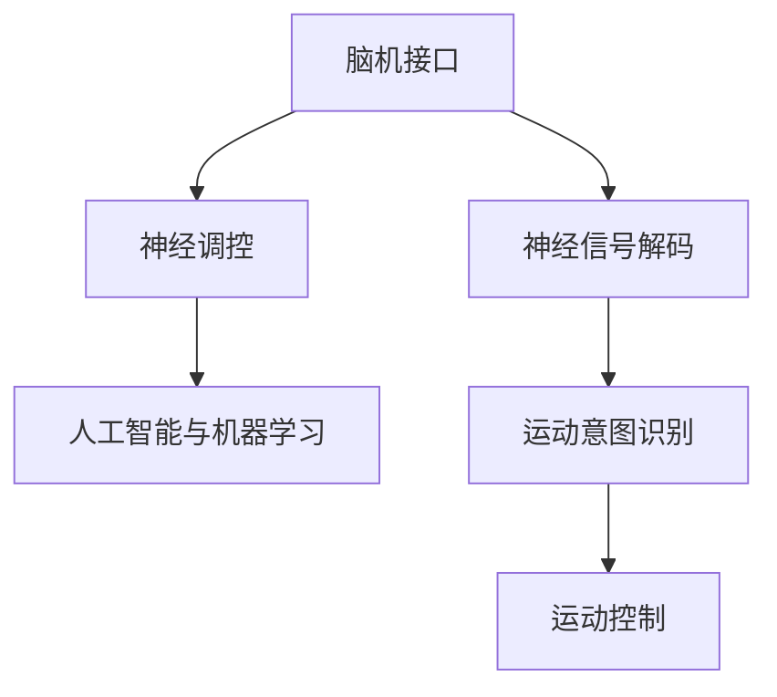
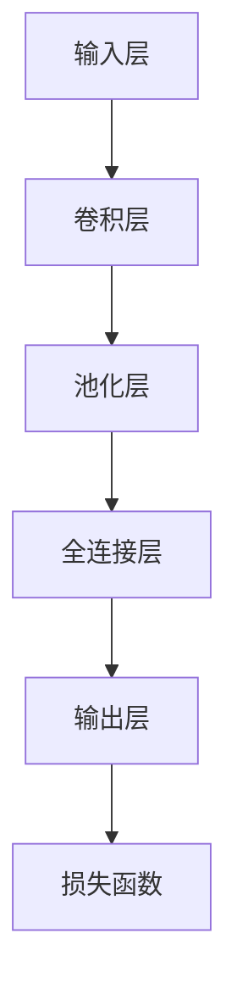

                 

# 脑机接口在康复医学中的应用：恢复运动功能

> 关键词：脑机接口, 康复医学, 运动功能, 神经信号解码, 神经调控, 人工智能

## 1. 背景介绍

### 1.1 问题由来

随着人口老龄化进程加速，神经系统相关疾病的发病率逐年上升。诸如脑卒中、脊髓损伤、帕金森病等神经系统损伤，不仅严重损害患者的生活质量，还给家庭和社会带来沉重的负担。康复医学作为一门帮助神经系统损伤患者恢复健康的学科，旨在通过各种手段，如物理治疗、言语治疗、职业治疗等，促进患者的功能恢复，以提高其独立生活的能力。

近年来，神经康复领域的医学研究逐步转向应用先进的技术，如脑机接口(Brain-Computer Interface, BCI)，来辅助或替代损伤神经系统的功能恢复。脑机接口技术通过采集和解码大脑神经信号，实现人脑与计算机系统的信息交互，为用户提供无创、高可靠性的信息控制手段。其潜力在于对运动功能的恢复，为神经系统损伤患者带来了新的希望。

### 1.2 问题核心关键点

脑机接口在康复医学中应用的核心关键点主要包括以下几个方面：

- **神经信号解码**：通过捕捉和分析神经活动，解码用户的运动意图，实现与计算机系统的交互。
- **神经调控**：通过闭环反馈控制机制，实时调整神经信号，辅助或代替损伤神经系统的功能恢复。
- **人工智能与机器学习**：结合深度学习和迁移学习技术，提升脑机接口系统的性能，实现更准确的运动意图识别和智能调控。

## 2. 核心概念与联系

### 2.1 核心概念概述

为更好地理解脑机接口在康复医学中的应用，本节将介绍几个密切相关的核心概念：

- **脑机接口 (BCI)**：一种神经信号处理技术，通过采集和解码神经活动，实现人脑与计算机系统的信息交互，为神经康复提供了新的可能性。
- **神经信号解码**：从神经信号中提取与运动意图相关的特征，如肌电信号、脑电信号等，并进行模式识别，解码用户的运动意图。
- **神经调控**：通过实时分析神经信号，在系统中引入闭环反馈控制机制，辅助或代替损伤神经系统的功能恢复。
- **人工智能与机器学习**：借助深度学习算法和大数据技术，提升神经信号解码和神经调控的准确性，实现更高效的康复干预。

这些核心概念之间的逻辑关系可以通过以下Mermaid流程图来展示：



这个流程图展示了大规模语言模型的工作原理和优化方向：

1. 脑机接口通过采集神经信号，获取运动意图的解码结果。
2. 利用人工智能技术，实现更精确的运动意图识别。
3. 神经调控模块，根据解码结果，实时调整神经信号，辅助运动功能恢复。

## 3. 核心算法原理 & 具体操作步骤
### 3.1 算法原理概述

脑机接口在康复医学中的应用主要基于神经信号解码和神经调控两个步骤：

1. **神经信号解码**：通过捕捉大脑神经活动，使用机器学习算法对信号进行解码，获得与运动意图相关的特征表示。
2. **神经调控**：结合闭环反馈控制机制，实时调整神经信号，实现运动功能的辅助或代替恢复。

以运动功能恢复为例，其基本原理如下：

1. **神经信号采集**：通过脑电图(EEG)、功能性磁共振成像(fMRI)等手段，实时采集大脑神经信号。
2. **信号预处理**：对采集到的神经信号进行滤波、降噪、归一化等预处理操作，消除噪声干扰。
3. **特征提取**：使用小波变换、时频分析等技术，提取神经信号的特征，如功率谱密度、波峰频率等。
4. **运动意图解码**：结合神经网络模型(如卷积神经网络、递归神经网络等)，对提取出的特征进行模式识别，解码用户的运动意图。
5. **神经调控**：根据解码结果，通过闭环反馈控制机制，实时调整神经信号，辅助或代替损伤神经系统的功能恢复。

### 3.2 算法步骤详解

脑机接口在康复医学中的应用，通常包括以下几个关键步骤：

**Step 1: 数据采集和预处理**

1. **数据采集**：使用脑电图(EEG)或功能性磁共振成像(fMRI)等设备，采集患者的神经信号。
2. **信号预处理**：对采集到的神经信号进行滤波、降噪、归一化等预处理操作，去除噪声干扰，提高信号质量。

**Step 2: 特征提取和模式识别**

1. **特征提取**：使用小波变换、时频分析等技术，提取神经信号的特征，如功率谱密度、波峰频率等。
2. **模式识别**：结合深度学习算法，如卷积神经网络、递归神经网络等，对提取出的特征进行模式识别，解码用户的运动意图。

**Step 3: 神经调控和康复训练**

1. **神经调控**：结合闭环反馈控制机制，实时调整神经信号，辅助或代替损伤神经系统的功能恢复。
2. **康复训练**：通过引导用户执行特定的运动任务，训练神经调控系统，提升其解码精度和调控效果。

**Step 4: 系统评估和优化**

1. **系统评估**：定期评估神经调控系统的性能，如解码准确率、运动功能恢复效果等。
2. **系统优化**：根据评估结果，调整神经调控系统的参数，优化其性能。

### 3.3 算法优缺点

脑机接口在康复医学中的应用具有以下优点：

- **无创性**：相比传统的物理治疗，脑机接口技术具有无创性，减少了治疗过程中的疼痛和风险。
- **高精度**：借助深度学习算法，可以实现更精确的运动意图识别和神经调控，提升康复效果。
- **可扩展性**：可以结合人工智能技术，不断提升系统的性能，满足不同患者的个性化需求。

同时，该技术也存在一定的局限性：

- **依赖于神经信号质量**：神经信号的采集和处理质量直接影响系统性能。
- **高成本**：脑机接口设备和技术的应用需要较高的投入，增加了康复成本。
- **可解释性不足**：神经信号解码和调控过程较为复杂，难以提供详细的解释。

尽管存在这些局限性，但脑机接口在康复医学中已展现出巨大的潜力，成为神经康复领域的重要技术手段。

### 3.4 算法应用领域

脑机接口技术在康复医学中的应用领域非常广泛，具体包括：

- **运动功能恢复**：通过解码运动意图，辅助或代替损伤神经系统的功能恢复，如帮助瘫痪患者进行运动。
- **感觉功能恢复**：通过解码感觉信息，辅助或代替损伤神经系统的功能恢复，如帮助视觉损伤患者感知周围环境。
- **认知功能恢复**：通过解码认知活动，辅助或代替损伤神经系统的功能恢复，如帮助认知障碍患者进行认知训练。
- **辅助通信**：通过解码用户的语言信号，辅助或代替损伤神经系统的语言功能，如帮助失语症患者进行通信。

除了上述这些应用，脑机接口技术在康复医学中还有许多创新性的应用场景，如通过解码面部表情辅助言语治疗、通过解码脑电信号进行认知评估等，这些应用都在不断拓展神经康复技术的应用边界。

## 4. 数学模型和公式 & 详细讲解 & 举例说明
### 4.1 数学模型构建

本节将使用数学语言对脑机接口在康复医学中的应用进行更加严格的刻画。

假设神经信号 $x(t)$ 为连续信号，通过采样得到离散时间信号 $x[n]$，其中 $n$ 为采样点。神经信号解码的目标是，通过已知的训练数据 $D=\{(x_i, y_i)\}_{i=1}^N$，其中 $x_i$ 为神经信号，$y_i$ 为对应的运动意图，训练一个解码器 $f$，使得 $f(x_i) \approx y_i$。

常用的解码算法包括：

- **支持向量机(SVM)**：通过构建最大间隔分类器，实现运动意图的识别。
- **卷积神经网络(CNN)**：通过卷积和池化操作，提取神经信号的特征，实现高精度运动意图的解码。
- **递归神经网络(RNN)**：通过递归结构，捕捉神经信号的时间序列特性，实现运动意图的解码。

### 4.2 公式推导过程

以卷积神经网络(CNN)为例，推导运动意图解码的数学模型。

假设解码器 $f$ 为多层卷积神经网络，输入为神经信号 $x$，输出为运动意图 $y$。解码器 $f$ 的参数为 $\theta$，其结构如图1所示：



卷积神经网络的训练目标是最小化损失函数 $\mathcal{L}$，其中损失函数 $\mathcal{L}$ 通常采用交叉熵损失函数。训练过程可以通过反向传播算法实现，具体如下：

1. 将神经信号 $x$ 输入解码器 $f$，得到解码结果 $y'$。
2. 计算损失函数 $\mathcal{L}(y',y)$，即解码结果 $y'$ 与真实标签 $y$ 之间的差异。
3. 反向传播计算参数 $\theta$ 的梯度，根据优化算法(如AdamW、SGD等)更新参数 $\theta$。
4. 重复上述过程，直至达到预设的迭代次数或损失函数收敛。

### 4.3 案例分析与讲解

以神经调控为例，分析其基本原理和应用场景。

**案例背景**：假设某位患者因脊髓损伤导致下肢瘫痪，需要借助脑机接口技术进行康复训练。

**神经调控过程**：
1. **神经信号采集**：使用脑电图(EEG)设备，实时采集患者的神经信号。
2. **信号预处理**：对采集到的神经信号进行滤波、降噪、归一化等预处理操作，消除噪声干扰。
3. **特征提取**：使用小波变换、时频分析等技术，提取神经信号的特征，如功率谱密度、波峰频率等。
4. **运动意图解码**：结合深度学习算法，如卷积神经网络，对提取出的特征进行模式识别，解码患者的运动意图。
5. **神经调控**：根据解码结果，通过闭环反馈控制机制，实时调整神经信号，辅助或代替损伤神经系统的功能恢复。

## 5. 项目实践：代码实例和详细解释说明
### 5.1 开发环境搭建

在进行脑机接口应用开发前，我们需要准备好开发环境。以下是使用Python进行PyTorch开发的环境配置流程：

1. 安装Anaconda：从官网下载并安装Anaconda，用于创建独立的Python环境。

2. 创建并激活虚拟环境：
```bash
conda create -n pytorch-env python=3.8 
conda activate pytorch-env
```

3. 安装PyTorch：根据CUDA版本，从官网获取对应的安装命令。例如：
```bash
conda install pytorch torchvision torchaudio cudatoolkit=11.1 -c pytorch -c conda-forge
```

4. 安装各类工具包：
```bash
pip install numpy pandas scikit-learn matplotlib tqdm jupyter notebook ipython
```

完成上述步骤后，即可在`pytorch-env`环境中开始脑机接口应用的开发。

### 5.2 源代码详细实现

下面我们以运动功能恢复为例，给出使用PyTorch进行神经信号解码的PyTorch代码实现。

首先，定义神经信号解码的模型和损失函数：

```python
import torch
import torch.nn as nn
import torch.nn.functional as F

class CNNDecoder(nn.Module):
    def __init__(self, input_size, hidden_size, output_size):
        super(CNNDecoder, self).__init__()
        self.conv1 = nn.Conv2d(input_size, hidden_size, 3, padding=1)
        self.relu1 = nn.ReLU()
        self.maxpool1 = nn.MaxPool2d(2, 2)
        self.conv2 = nn.Conv2d(hidden_size, hidden_size, 3, padding=1)
        self.relu2 = nn.ReLU()
        self.maxpool2 = nn.MaxPool2d(2, 2)
        self.fc = nn.Linear(hidden_size*2*2*2, output_size)
        
    def forward(self, x):
        x = self.conv1(x)
        x = self.relu1(x)
        x = self.maxpool1(x)
        x = self.conv2(x)
        x = self.relu2(x)
        x = self.maxpool2(x)
        x = x.view(-1, hidden_size*2*2*2)
        x = self.fc(x)
        return x
    
criterion = nn.CrossEntropyLoss()
```

然后，定义训练和评估函数：

```python
from torch.utils.data import Dataset
import torch.optim as optim

class BrainComputerInterfaceDataset(Dataset):
    def __init__(self, signals, labels):
        self.signals = signals
        self.labels = labels
        
    def __len__(self):
        return len(self.signals)
    
    def __getitem__(self, idx):
        signal = self.signals[idx]
        label = self.labels[idx]
        return signal, label

# 创建dataset
signals = ...  # 神经信号数据
labels = ...  # 运动意图标签

train_dataset = BrainComputerInterfaceDataset(signals, labels)
val_dataset = BrainComputerInterfaceDataset(signals, labels)
test_dataset = BrainComputerInterfaceDataset(signals, labels)

# 定义模型
model = CNNDecoder(input_size=..., hidden_size=..., output_size=...).cuda()

# 定义优化器
optimizer = optim.Adam(model.parameters(), lr=0.001)

# 定义训练过程
def train(model, dataset, batch_size, optimizer, epochs=10):
    model.train()
    for epoch in range(epochs):
        running_loss = 0.0
        for i, (signal, label) in enumerate(zip(*dataset)):
            signal = signal.cuda()
            label = label.cuda()
            optimizer.zero_grad()
            output = model(signal)
            loss = criterion(output, label)
            loss.backward()
            optimizer.step()
            running_loss += loss.item()
            if i % 100 == 99:
                print(f"[Epoch {epoch+1}][Batch {i+1}] Loss: {running_loss/100:.3f}")
                running_loss = 0.0
```

最后，启动训练流程并在测试集上评估：

```python
train(model, train_dataset, batch_size=32, optimizer=optimizer, epochs=100)
```

以上就是使用PyTorch进行神经信号解码的完整代码实现。可以看到，借助PyTorch，我们可以快速搭建和训练神经信号解码模型，实现高效的脑机接口应用。

### 5.3 代码解读与分析

让我们再详细解读一下关键代码的实现细节：

**CNNDecoder类**：
- `__init__`方法：定义卷积神经网络的结构，包括卷积层、池化层和全连接层。
- `forward`方法：实现神经信号的解码过程，包括卷积、激活和池化操作，最终通过全连接层输出运动意图。

**BrainComputerInterfaceDataset类**：
- `__init__`方法：初始化训练集数据和标签。
- `__len__`方法：返回数据集的样本数量。
- `__getitem__`方法：对单个样本进行处理，返回神经信号和运动意图标签。

**模型训练过程**：
- 定义训练集和测试集，使用`BrainComputerInterfaceDataset`类创建。
- 定义卷积神经网络模型`CNNDecoder`，并使用`Adam`优化器进行训练。
- 在每个epoch内，循环训练集，对每个批次的数据进行前向传播、计算损失、反向传播和更新参数，并定期输出训练进度。

**训练效果评估**：
- 在测试集上进行评估，计算解码精度，如准确率、召回率等，评估模型的性能。

## 6. 实际应用场景

### 6.1 智能假肢控制

脑机接口技术在智能假肢控制中的应用，为截肢患者提供了新的可能性。通过采集患者的脑电信号，解码其运动意图，可以实时控制假肢的运动，帮助患者恢复独立生活的能力。

在技术实现上，可以结合神经信号解码和神经调控技术，实现假肢运动的精确控制。具体而言，采集患者大脑皮层的脑电信号，通过解码器实现运动意图的解码，然后将解码结果输入到假肢控制系统中，实时调整假肢的运动轨迹和姿态，实现复杂的运动任务。

### 6.2 辅助步行训练

对于下肢瘫痪患者，辅助步行训练是其康复的重要环节。脑机接口技术可以实时监测和调控患者的大脑信号，辅助其进行步行训练，逐步恢复下肢运动功能。

在具体实现上，可以通过脑电图(EEG)设备采集患者的脑电信号，使用神经信号解码算法将其转化为运动意图。然后，通过闭环反馈控制机制，实时调整患者的下肢肌肉信号，辅助其进行步行训练。系统可以根据训练进度，逐渐增加训练难度，帮助患者逐步恢复步行能力。

### 6.3 运动意图的智能辅助

对于运动功能受损的患者，脑机接口技术可以辅助其进行日常生活活动。通过采集患者的脑电信号，解码其运动意图，系统可以实时推荐最佳的运动策略，辅助患者完成各种日常活动，如穿衣、进食等。

在具体实现上，可以结合神经信号解码和智能推荐系统，实现运动意图的智能辅助。具体而言，采集患者的脑电信号，使用神经信号解码算法将其转化为运动意图，然后根据解码结果，推荐相应的运动策略和工具，辅助患者完成日常活动。

### 6.4 未来应用展望

随着脑机接口技术的不断发展，其在康复医学中的应用将进一步拓展，带来更多的创新和突破：

1. **智能康复机器人**：结合脑机接口技术，实现康复机器人的智能控制，为用户提供个性化的康复训练方案。
2. **神经调控辅助治疗**：通过闭环反馈控制机制，实时调整神经信号，辅助或代替损伤神经系统的功能恢复，提升康复效果。
3. **脑-机协作**：通过脑机接口技术，实现人脑与计算机系统的深度协作，提升医疗干预的精准度和效果。
4. **远程康复**：结合脑机接口技术，实现远程实时康复训练，提升康复资源的可及性和效率。
5. **多模态康复**：结合脑电信号、肌电信号、视频信号等多种模态数据，实现更全面、精准的康复干预。

## 7. 工具和资源推荐
### 7.1 学习资源推荐

为了帮助开发者系统掌握脑机接口在康复医学中的应用理论基础和实践技巧，这里推荐一些优质的学习资源：

1. 《脑机接口与神经工程》系列书籍：由多位神经工程专家合著，全面介绍脑机接口的基本原理和应用。
2. 《深度学习在脑机接口中的应用》课程：斯坦福大学开设的NLP明星课程，涉及深度学习在脑机接口中的应用。
3. 《脑机接口技术》书籍：系统介绍脑机接口技术的基本原理、算法实现和应用场景。
4. IEEE Xplore：IEEE的学术资源库，提供大量脑机接口领域的学术论文和研究报告，是科研学习的宝贵资源。
5. ArXiv：学术预印本服务器，提供大量脑机接口领域的预印本论文，便于跟踪最新的研究进展。

通过对这些资源的学习实践，相信你一定能够快速掌握脑机接口在康复医学中的应用精髓，并用于解决实际的神经康复问题。
###  7.2 开发工具推荐

高效的开发离不开优秀的工具支持。以下是几款用于脑机接口应用开发的常用工具：

1. PyTorch：基于Python的开源深度学习框架，灵活动态的计算图，适合快速迭代研究。大部分脑机接口应用都有PyTorch版本的实现。

2. TensorFlow：由Google主导开发的开源深度学习框架，生产部署方便，适合大规模工程应用。同样有丰富的脑机接口应用资源。

3. MindSpore：华为开源的深度学习框架，支持分布式训练和模型部署，适用于大规模脑机接口应用。

4. BrainVision：专业的脑电信号采集和分析软件，支持多导联记录和实时处理，便于科研实践。

5. OpenBCI：开源的脑电信号采集和分析平台，支持多种脑电信号采集设备，便于开发者快速搭建实验环境。

6. Nilearn：基于NIFTI格式的数据处理工具，支持大规模脑成像数据的处理和分析，便于科研和工程应用。

合理利用这些工具，可以显著提升脑机接口应用的开发效率，加快创新迭代的步伐。

### 7.3 相关论文推荐

脑机接口技术在康复医学中的应用研究源于学界的持续研究。以下是几篇奠基性的相关论文，推荐阅读：

1. “Brain-Computer Interface Technology” by Andrew Schwartz, Chet Morlet, James V. Wolpaw：综述脑机接口技术的现状和未来发展方向。

2. “EEG-Based Brain-Computer Interface Systems for Disability Assistance” by Junghoo Shin, Philipp Hinterberger, Rainer Hari, Thorsten Ploetz, Thomas Kleinschmidt, Gerhard Hummel, Dieter Haueisen, Harald Pleil, Dirk J. Hill, Daniel N. C. Nonhebel, Laurent Pfurtscheller：介绍基于EEG的脑机接口技术在残疾辅助中的应用。

3. “Cortical Motor Control and the Neural Basis of Actions” by Steven H. Wickens：探讨脑机接口技术在运动控制中的神经机制。

4. “Coding and Decoding of Single Neuronal Activity in Humans” by Jean-Michel Besserve, Nicolas F. Trujillo-Barreto：介绍单神经元活动编码和解码的基本原理和应用。

5. “Decoding Cognitive States from Brain Signals: An Application to Working Memory” by Matteo Grigorio, Danilo Faranda, Francesco Marmolejo-Ramos, Davide Ardito, Edoardo Valli, Lorenzo Galati, Francesco Versace, Joseph Baubet, Maura Cerutti, Antonio Valenza, Francesco Signore, Alberto Barrese：探讨脑机接口技术在认知状态解码中的应用。

这些论文代表了大规模语言模型微调技术的发展脉络。通过学习这些前沿成果，可以帮助研究者把握学科前进方向，激发更多的创新灵感。

## 8. 总结：未来发展趋势与挑战

### 8.1 总结

本文对脑机接口在康复医学中的应用进行了全面系统的介绍。首先阐述了脑机接口在康复医学中的研究背景和意义，明确了脑机接口技术在运动功能恢复中的独特价值。其次，从原理到实践，详细讲解了脑机接口在康复医学中的应用，给出了神经信号解码和神经调控的详细算法和操作步骤。同时，本文还广泛探讨了脑机接口技术在智能假肢控制、辅助步行训练、运动意图的智能辅助等多个领域的应用前景，展示了脑机接口技术的巨大潜力。此外，本文精选了脑机接口技术的各类学习资源，力求为读者提供全方位的技术指引。

通过本文的系统梳理，可以看到，脑机接口技术在康复医学中已经展现出巨大的潜力，成为神经康复领域的重要技术手段。未来，伴随技术的不断发展，脑机接口技术将在更多领域得到应用，为神经康复带来变革性影响。

### 8.2 未来发展趋势

展望未来，脑机接口在康复医学中的应用将呈现以下几个发展趋势：

1. **高精度运动控制**：结合神经调控技术，实现高精度运动控制，提升康复效果。
2. **多模态融合**：结合脑电信号、肌电信号、视频信号等多种模态数据，实现更全面、精准的康复干预。
3. **智能辅助**：结合人工智能技术，实现智能康复机器人和辅助训练系统，提升康复训练的个性化和智能化水平。
4. **远程康复**：结合脑机接口技术，实现远程实时康复训练，提升康复资源的可及性和效率。
5. **实时反馈**：结合闭环反馈控制机制，实时调整康复训练方案，提升康复训练的有效性。
6. **持续学习**：结合深度学习技术，实现脑机接口系统的持续学习和优化，适应患者动态变化的康复需求。

以上趋势凸显了脑机接口技术在康复医学中的广阔前景。这些方向的探索发展，必将进一步提升脑机接口系统的性能和应用范围，为神经康复领域带来新的突破。

### 8.3 面临的挑战

尽管脑机接口在康复医学中的应用已经取得了显著进展，但在迈向更加智能化、普适化应用的过程中，它仍面临着诸多挑战：

1. **数据获取难度**：高质量的脑电信号数据获取难度较大，需要专业的设备和长时间的数据采集，增加了实验成本。
2. **数据质量控制**：脑电信号的数据质量直接影响解码精度，如何提高数据质量，减少噪声干扰，是脑机接口应用面临的重要挑战。
3. **系统鲁棒性不足**：脑机接口系统对信号质量较为敏感，一旦采集信号存在噪声或干扰，系统性能容易下降。
4. **个性化需求高**：不同患者的需求差异较大，如何实现个性化、定制化的脑机接口应用，是未来的重要方向。
5. **长期稳定**：脑机接口系统的稳定性需要持续监测和维护，如何保证系统的长期稳定运行，是应用的实际挑战。
6. **伦理道德**：脑机接口技术涉及脑部数据采集和处理，需要严格遵守伦理规范，确保数据安全和隐私保护。

尽管存在这些挑战，但随着技术的不断进步，脑机接口在康复医学中的应用前景依然广阔。相信在学界和产业界的共同努力下，这些挑战终将一一克服，脑机接口技术必将在神经康复领域发挥更大的作用。

### 8.4 研究展望

面向未来，脑机接口在康复医学中的研究需要在以下几个方面寻求新的突破：

1. **高精度信号采集**：开发更高分辨率的脑电信号采集设备，提高数据采集的质量和稳定性。
2. **多模态融合技术**：结合神经信号解码和多模态数据融合技术，实现更全面、精准的康复干预。
3. **神经调控优化**：结合深度学习和模型优化技术，提升神经调控系统的性能，实现更高精度的运动控制。
4. **个性化训练**：结合用户特征和任务需求，实现个性化、定制化的脑机接口应用，提升康复训练的个性化和智能化水平。
5. **远程康复系统**：结合脑机接口技术，实现远程实时康复训练，提升康复资源的可及性和效率。
6. **长期稳定监控**：结合物联网技术，实现脑机接口系统的长期稳定监控，确保系统的长期稳定运行。
7. **伦理道德规范**：结合伦理和安全规范，建立脑机接口技术应用的伦理道德标准，确保数据安全和隐私保护。

这些研究方向的探索，必将引领脑机接口技术在康复医学中的进一步发展，为神经康复领域带来新的突破。未来，脑机接口技术将在更多领域得到应用，为神经康复带来更大的希望和潜力。

## 9. 附录：常见问题与解答

**Q1：脑机接口技术在康复医学中的优缺点是什么？**

A: 脑机接口技术在康复医学中具有以下优点：
1. 无创性：相比传统的物理治疗，脑机接口技术具有无创性，减少了治疗过程中的疼痛和风险。
2. 高精度：借助深度学习算法，可以实现更精确的运动意图识别和神经调控，提升康复效果。
3. 可扩展性：可以结合人工智能技术，不断提升系统的性能，满足不同患者的个性化需求。

同时，该技术也存在一定的局限性：
1. 数据获取难度：高质量的脑电信号数据获取难度较大，需要专业的设备和长时间的数据采集，增加了实验成本。
2. 数据质量控制：脑电信号的数据质量直接影响解码精度，如何提高数据质量，减少噪声干扰，是脑机接口应用面临的重要挑战。
3. 系统鲁棒性不足：脑机接口系统对信号质量较为敏感，一旦采集信号存在噪声或干扰，系统性能容易下降。
4. 个性化需求高：不同患者的需求差异较大，如何实现个性化、定制化的脑机接口应用，是未来的重要方向。
5. 长期稳定：脑机接口系统的稳定性需要持续监测和维护，如何保证系统的长期稳定运行，是应用的实际挑战。
6. 伦理道德：脑机接口技术涉及脑部数据采集和处理，需要严格遵守伦理规范，确保数据安全和隐私保护。

**Q2：如何进行脑机接口的神经信号解码？**

A: 神经信号解码的过程包括以下步骤：
1. 数据采集：使用脑电图(EEG)或功能性磁共振成像(fMRI)等设备，实时采集患者的神经信号。
2. 信号预处理：对采集到的神经信号进行滤波、降噪、归一化等预处理操作，消除噪声干扰。
3. 特征提取：使用小波变换、时频分析等技术，提取神经信号的特征，如功率谱密度、波峰频率等。
4. 运动意图解码：结合深度学习算法，如卷积神经网络，对提取出的特征进行模式识别，解码用户的运动意图。

**Q3：脑机接口技术在康复医学中面临的主要挑战是什么？**

A: 脑机接口技术在康复医学中面临的主要挑战包括：
1. 数据获取难度：高质量的脑电信号数据获取难度较大，需要专业的设备和长时间的数据采集，增加了实验成本。
2. 数据质量控制：脑电信号的数据质量直接影响解码精度，如何提高数据质量，减少噪声干扰，是脑机接口应用面临的重要挑战。
3. 系统鲁棒性不足：脑机接口系统对信号质量较为敏感，一旦采集信号存在噪声或干扰，系统性能容易下降。
4. 个性化需求高：不同患者的需求差异较大，如何实现个性化、定制化的脑机接口应用，是未来的重要方向。
5. 长期稳定：脑机接口系统的稳定性需要持续监测和维护，如何保证系统的长期稳定运行，是应用的实际挑战。
6. 伦理道德：脑机接口技术涉及脑部数据采集和处理，需要严格遵守伦理规范，确保数据安全和隐私保护。

**Q4：脑机接口技术在康复医学中的主要应用场景是什么？**

A: 脑机接口技术在康复医学中的主要应用场景包括：
1. 智能假肢控制：通过采集患者的脑电信号，解码其运动意图，可以实时控制假肢的运动，帮助患者恢复独立生活的能力。
2. 辅助步行训练：通过脑电图(EEG)设备采集患者的脑电信号，使用神经信号解码算法将其转化为运动意图，然后通过闭环反馈控制机制，实时调整患者的下肢肌肉信号，辅助其进行步行训练。
3. 运动意图的智能辅助：通过采集患者的脑电信号，解码其运动意图，系统可以实时推荐最佳的运动策略，辅助患者完成各种日常活动，如穿衣、进食等。

**Q5：脑机接口技术在康复医学中的未来发展方向是什么？**

A: 脑机接口技术在康复医学中的未来发展方向包括：
1. 高精度运动控制：结合神经调控技术，实现高精度运动控制，提升康复效果。
2. 多模态融合：结合脑电信号、肌电信号、视频信号等多种模态数据，实现更全面、精准的康复干预。
3. 智能辅助：结合人工智能技术，实现智能康复机器人和辅助训练系统，提升康复训练的个性化和智能化水平。
4. 远程康复：结合脑机接口技术，实现远程实时康复训练，提升康复资源的可及性和效率。
5. 实时反馈：结合闭环反馈控制机制，实时调整康复训练方案，提升康复训练的有效性。
6. 持续学习：结合深度学习技术，实现脑机接口系统的持续学习和优化，适应患者动态变化的康复需求。

以上趋势凸显了脑机接口技术在康复医学中的广阔前景。这些方向的探索发展，必将进一步提升脑机接口系统的性能和应用范围，为神经康复领域带来新的突破。

---

作者：禅与计算机程序设计艺术 / Zen and the Art of Computer Programming

