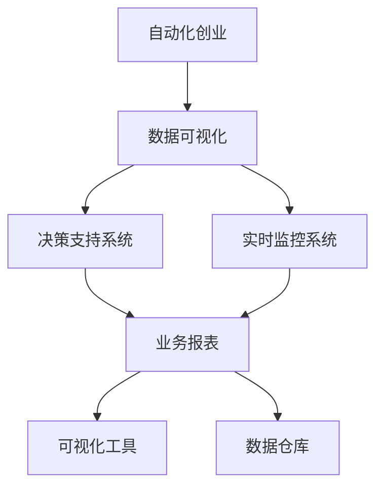

                 

# 自动化创业中的数据可视化应用

## 1. 背景介绍

随着技术的进步和市场的变化，自动化创业已成为新时代的热门趋势。自动化创业模式利用先进的技术手段，如机器学习、人工智能、大数据等，自动化完成企业运营的各个环节，从而提高效率，降低成本。然而，在实际操作中，如何有效利用这些先进技术，对企业的数据进行可视化呈现，帮助创业者更好地理解企业状况，制定决策，是自动化创业中的一个重要问题。

## 2. 核心概念与联系

### 2.1 核心概念概述

- **自动化创业**：一种利用先进技术手段，自动化完成企业运营各个环节，提高效率，降低成本的创业模式。
- **数据可视化**：通过图表、地图等形式，将数据信息转化为直观、易于理解的图形，帮助人们更好地理解数据。
- **决策支持系统**：基于数据可视化的系统，通过数据分析和展示，为创业者提供决策支持，帮助他们做出更科学的决策。
- **实时监控系统**：能够实时监测企业运营情况，动态调整策略，以应对市场变化的系统。
- **可视化工具**：如Tableau、Power BI、D3.js等，提供了丰富的数据可视化组件和模板，帮助用户轻松创建自定义的可视化报表。
- **数据仓库**：一个集中管理、存储、共享数据的系统，支持数据可视化。

这些核心概念之间的逻辑关系可以通过以下Mermaid流程图来展示：



这个流程图展示了一系列相关的核心概念，它们共同构成了自动化创业中的数据可视化应用框架，使得企业能够通过数据可视化技术，更直观地理解和监控企业的运营状况，进而做出更科学的决策。

## 3. 核心算法原理 & 具体操作步骤

### 3.1 算法原理概述

在自动化创业中，数据可视化的应用过程主要包括数据收集、数据清洗、数据处理和数据展示。数据收集通常依赖于企业内部的各类业务系统，如ERP、CRM、HR等。数据清洗涉及数据的预处理和清洗，去除噪声、缺失值和异常值等。数据处理则是根据不同的业务需求，选择合适的算法进行数据分析和建模。数据展示则通过可视化的方式，将分析结果呈现给用户。

具体而言，数据可视化的算法原理主要包括以下几个方面：

1. **数据降维**：将高维数据通过投影、聚类等算法，降低到低维空间，便于可视化展示。
2. **可视化编码**：利用编码技术，将数据转化为图形元素，如点、线、面等，并赋予特定的颜色、大小等属性。
3. **交互式展示**：通过交互技术，允许用户通过鼠标、触摸屏等设备，动态调整视图，查看不同维度的数据。
4. **动态更新**：根据数据的实时变化，动态更新图表，确保用户获得最新的信息。

### 3.2 算法步骤详解

基于以上算法原理，数据可视化的具体操作步骤通常包括以下几个步骤：

1. **数据收集**：从企业内部的各个业务系统中收集数据，并进行初步整理。
2. **数据清洗**：去除数据中的噪声、缺失值和异常值，保证数据的质量。
3. **数据处理**：选择合适的算法对数据进行分析和建模，如回归分析、聚类分析等。
4. **数据展示**：选择合适的可视化工具，将处理后的数据展示为图表、地图等形式。
5. **交互式调整**：通过交互技术，允许用户动态调整视图，查看不同维度的数据。
6. **动态更新**：根据数据的实时变化，动态更新图表，确保用户获得最新的信息。

### 3.3 算法优缺点

数据可视化算法具有以下优点：

1. **直观易懂**：通过图表、地图等形式，将数据信息转化为直观、易于理解的图形，帮助人们更好地理解数据。
2. **支持决策**：通过数据分析和展示，为创业者提供决策支持，帮助他们做出更科学的决策。
3. **实时监控**：能够实时监测企业运营情况，动态调整策略，以应对市场变化。

然而，数据可视化算法也存在一些缺点：

1. **数据质量要求高**：数据清洗和处理需要较高的时间和技能要求，一旦数据质量不佳，可视化效果也会受到影响。
2. **依赖技术工具**：不同的可视化工具具有不同的特点和适用场景，选择合适的工具需要一定的技术积累。
3. **复杂数据难以处理**：对于复杂的数据，如多维数据、动态数据等，需要进行复杂的算法处理和可视化设计。

### 3.4 算法应用领域

数据可视化算法在自动化创业中具有广泛的应用，主要包括以下几个领域：

1. **财务报表分析**：通过可视化展示企业的财务数据，帮助创业者了解企业的财务状况和运营效率。
2. **销售数据分析**：利用销售数据可视化，帮助创业者分析销售趋势、客户群体等信息，制定销售策略。
3. **客户关系管理**：通过可视化展示客户数据，帮助创业者了解客户的需求和行为，提升客户满意度。
4. **供应链管理**：利用供应链数据可视化，帮助创业者监控供应链流程，优化物流和库存管理。
5. **人力资源管理**：通过可视化展示人力资源数据，帮助创业者了解员工的工作状态和绩效，提升人力资源管理效率。

## 4. 数学模型和公式 & 详细讲解 & 举例说明

### 4.1 数学模型构建

在数据可视化中，常用的数学模型包括回归模型、聚类模型等。以回归模型为例，其数学模型构建如下：

假设有一组数据集 $(x_1, y_1), (x_2, y_2), ..., (x_n, y_n)$，其中 $x$ 是自变量，$y$ 是因变量。通过回归分析，找到一条直线或曲面，使得数据点与直线或曲面的距离最小化。数学模型可以表示为：

$$ y = \beta_0 + \beta_1 x + \epsilon $$

其中，$\beta_0$ 和 $\beta_1$ 是模型的参数，$\epsilon$ 是误差项。

### 4.2 公式推导过程

对于回归模型，其最小二乘法的推导过程如下：

1. 计算误差平方和 $SSR$：

$$ SSR = \sum_{i=1}^n (y_i - \hat{y}_i)^2 $$

其中，$\hat{y}_i$ 是模型预测的因变量值。

2. 计算总误差平方和 $SST$：

$$ SST = \sum_{i=1}^n (y_i - \bar{y})^2 $$

其中，$\bar{y}$ 是因变量的均值。

3. 计算回归平方和 $SSR$：

$$ SSR = SST - SSE $$

其中，$SSE$ 是残差平方和，表示模型无法解释的部分。

4. 计算回归系数：

$$ \hat{\beta}_1 = \frac{SSR}{SSX} $$

$$ \hat{\beta}_0 = \bar{y} - \hat{\beta}_1 \bar{x} $$

其中，$SSX = \sum_{i=1}^n (x_i - \bar{x})^2$ 是自变量的平方和。

### 4.3 案例分析与讲解

以一家电子商务企业为例，其通过数据可视化对销售数据进行分析。首先，从ERP系统中收集销售数据，然后进行数据清洗和处理。利用回归模型，将销售额与用户数、广告支出等自变量进行拟合，得到回归直线。最终，将回归直线和实际数据进行对比，生成可视化图表，帮助企业了解不同因素对销售额的影响，制定更科学的营销策略。

## 5. 项目实践：代码实例和详细解释说明

### 5.1 开发环境搭建

在进行数据可视化项目实践前，我们需要准备好开发环境。以下是使用Python进行Matplotlib、Pandas、Seaborn等库进行数据可视化环境配置的流程：

1. 安装Anaconda：从官网下载并安装Anaconda，用于创建独立的Python环境。

2. 创建并激活虚拟环境：
```bash
conda create -n py39 python=3.9
conda activate py39
```

3. 安装Python库：
```bash
conda install numpy pandas matplotlib seaborn jupyter notebook
```

完成上述步骤后，即可在`py39`环境中开始数据可视化实践。

### 5.2 源代码详细实现

以下是一个简单的数据可视化项目，使用Matplotlib库绘制折线图：

```python
import matplotlib.pyplot as plt
import pandas as pd

# 读取数据
data = pd.read_csv('sales.csv')

# 数据处理
x = data['user_num']
y = data['sales']

# 绘制折线图
plt.plot(x, y)
plt.xlabel('User Number')
plt.ylabel('Sales')
plt.title('Sales Trend Analysis')
plt.show()
```

这段代码展示了使用Matplotlib库绘制折线图的基本流程，包括数据读取、处理和绘制。

### 5.3 代码解读与分析

让我们再详细解读一下关键代码的实现细节：

**读取数据**：
```python
data = pd.read_csv('sales.csv')
```
使用Pandas库读取CSV格式的数据文件，并将其存储为DataFrame格式的数据集。

**数据处理**：
```python
x = data['user_num']
y = data['sales']
```
从DataFrame中提取自变量和因变量，并分别存储在变量`x`和`y`中。

**绘制折线图**：
```python
plt.plot(x, y)
```
使用Matplotlib库的`plot`函数绘制折线图。

**设置坐标轴和标题**：
```python
plt.xlabel('User Number')
plt.ylabel('Sales')
plt.title('Sales Trend Analysis')
```
设置图表的横纵坐标轴标签和标题。

**显示图表**：
```python
plt.show()
```
显示图表。

这个代码示例展示了如何使用Matplotlib库绘制简单的折线图，通过分析实际数据，帮助企业了解销售趋势。

## 6. 实际应用场景

### 6.1 财务报表分析

在财务报表分析中，利用数据可视化工具，可以将企业的资产负债表、利润表、现金流量表等数据进行可视化展示，帮助创业者了解企业的财务状况和运营效率。

**案例描述**：
某创业公司通过数据可视化工具，将企业的资产负债表和利润表数据进行展示，生成折线图和柱状图，帮助创业者了解企业的资产结构和盈利情况。

**解决方案**：
1. 收集企业资产负债表和利润表数据。
2. 利用Pandas库进行数据清洗和处理。
3. 使用Matplotlib库绘制折线图和柱状图。
4. 利用Tableau或Power BI进行数据可视化展示。

**结果展示**：
通过折线图和柱状图，创业者可以直观地了解企业的资产结构、负债情况和盈利状况，帮助企业制定财务策略。

### 6.2 销售数据分析

在销售数据分析中，利用数据可视化工具，可以将企业的销售数据进行可视化展示，帮助创业者分析销售趋势、客户群体等信息，制定销售策略。

**案例描述**：
某电子商务企业通过数据可视化工具，将不同地区、不同渠道的销售数据进行展示，生成散点图和箱线图，帮助创业者了解不同地区和渠道的销售情况。

**解决方案**：
1. 收集企业不同地区、不同渠道的销售数据。
2. 利用Pandas库进行数据清洗和处理。
3. 使用Matplotlib库绘制散点图和箱线图。
4. 利用Tableau或Power BI进行数据可视化展示。

**结果展示**：
通过散点图和箱线图，创业者可以直观地了解不同地区和渠道的销售情况，帮助企业制定更科学的销售策略。

### 6.3 客户关系管理

在客户关系管理中，利用数据可视化工具，可以将客户数据进行可视化展示，帮助创业者了解客户的需求和行为，提升客户满意度。

**案例描述**：
某电子商务企业通过数据可视化工具，将客户数据进行展示，生成饼图和热力图，帮助创业者了解不同客户群体的消费行为和满意度。

**解决方案**：
1. 收集企业客户数据。
2. 利用Pandas库进行数据清洗和处理。
3. 使用Matplotlib库绘制饼图和热力图。
4. 利用Tableau或Power BI进行数据可视化展示。

**结果展示**：
通过饼图和热力图，创业者可以直观地了解不同客户群体的消费行为和满意度，帮助企业制定更科学的客户管理策略。

### 6.4 供应链管理

在供应链管理中，利用数据可视化工具，可以将供应链数据进行可视化展示，帮助创业者监控供应链流程，优化物流和库存管理。

**案例描述**：
某物流企业通过数据可视化工具，将供应链数据进行展示，生成折线图和饼图，帮助创业者了解供应链的各个环节。

**解决方案**：
1. 收集企业供应链数据。
2. 利用Pandas库进行数据清洗和处理。
3. 使用Matplotlib库绘制折线图和饼图。
4. 利用Tableau或Power BI进行数据可视化展示。

**结果展示**：
通过折线图和饼图，创业者可以直观地了解供应链的各个环节，帮助企业优化供应链管理。

## 7. 工具和资源推荐

### 7.1 学习资源推荐

为了帮助开发者系统掌握数据可视化的理论基础和实践技巧，这里推荐一些优质的学习资源：

1. 《Python数据科学手册》：由Jake VanderPlas撰写，系统讲解了Python在数据科学中的应用，包括数据可视化技术。

2. 《R Graphics Cookbook》：由Hadley Wickham撰写，详细介绍了使用R语言进行数据可视化的各种方法和技巧。

3. 《D3.js入门教程》：由D3.js官方文档提供，介绍了如何使用D3.js进行数据可视化。

4. Udacity《数据可视化》课程：由Udacity提供，涵盖了数据可视化技术的基础知识和实际应用。

5. Coursera《数据科学导论》课程：由斯坦福大学提供，介绍了数据科学的基础知识，包括数据可视化和数据建模。

通过对这些资源的学习实践，相信你一定能够快速掌握数据可视化的精髓，并用于解决实际的业务问题。

### 7.2 开发工具推荐

高效的开发离不开优秀的工具支持。以下是几款用于数据可视化开发的常用工具：

1. Matplotlib：一个基于Python的数据可视化库，支持多种图表类型，如图表、散点图、柱状图等。

2. Seaborn：一个基于Matplotlib的数据可视化库，提供了更高级的图表类型，如热力图、树状图等。

3. Tableau：一个商业化的数据可视化工具，支持多种数据源，提供丰富的图表类型和交互功能。

4. Power BI：一个商业化的数据可视化工具，支持多种数据源，提供丰富的图表类型和交互功能。

5. Plotly：一个开源的数据可视化库，支持多种图表类型和交互功能，兼容Python、R等多种编程语言。

合理利用这些工具，可以显著提升数据可视化的开发效率，加快创新迭代的步伐。

### 7.3 相关论文推荐

数据可视化技术的发展源于学界的持续研究。以下是几篇奠基性的相关论文，推荐阅读：

1. 《A Survey on Visualization Analytics》：由Li Sun撰写，详细介绍了数据可视化的发展历程和未来趋势。

2. 《Interactive Visualization in Scientific Workflows》：由Heathcote A等撰写，介绍了交互式数据可视化的实现方法和应用场景。

3. 《Data Visualization for Scientific Research》：由Erickson N撰写，介绍了数据可视化在科学研究中的应用。

4. 《Design Principles for Visualization》：由Robert A. R. Ferrari撰写，介绍了数据可视化的设计原则和实践技巧。

这些论文代表了大数据可视化技术的发展脉络。通过学习这些前沿成果，可以帮助研究者把握学科前进方向，激发更多的创新灵感。

## 8. 总结：未来发展趋势与挑战

### 8.1 总结

本文对数据可视化在自动化创业中的应用进行了全面系统的介绍。首先阐述了数据可视化的背景和重要性，明确了其在自动化创业中的独特价值。其次，从原理到实践，详细讲解了数据可视化的数学模型和操作步骤，给出了数据可视化任务开发的完整代码实例。同时，本文还广泛探讨了数据可视化在财务报表分析、销售数据分析、客户关系管理、供应链管理等多个行业领域的应用前景，展示了数据可视化技术的巨大潜力。最后，本文精选了数据可视化的学习资源，力求为读者提供全方位的技术指引。

通过本文的系统梳理，可以看到，数据可视化技术在自动化创业中扮演着越来越重要的角色。它不仅帮助创业者直观地理解企业状况，制定科学的决策，还为企业的数字化转型提供了有力的技术支持。未来，伴随数据可视化技术的不断演进，自动化创业必将迎来新的发展机遇，为创业者提供更加强大的数据分析能力，推动企业高效运营和持续增长。

### 8.2 未来发展趋势

展望未来，数据可视化技术的发展趋势主要包括以下几个方面：

1. **交互式可视化**：随着用户对交互式可视化的需求增加，未来数据可视化将更加注重用户交互体验，提供更加灵活的交互方式和动态更新功能。

2. **多维度可视化**：随着数据维度的增加，多维度可视化将逐渐成为主流，支持用户在不同的维度上探索和分析数据。

3. **增强现实(AR)和虚拟现实(VR)技术**：AR和VR技术将为数据可视化带来新的呈现形式，提供更加沉浸式的可视化体验。

4. **机器学习与数据可视化的结合**：机器学习算法将在数据可视化中得到更广泛的应用，如自动数据降维、自动生成可视化图表等。

5. **实时可视化**：数据可视化的实时性将得到进一步提升，能够实时监测企业运营情况，动态调整策略，以应对市场变化。

6. **人工智能(AI)与数据可视化的结合**：AI技术将与数据可视化结合，提高数据可视化的智能化水平，实现自动化的数据可视化。

这些趋势预示着数据可视化技术将进一步发展，为自动化创业提供更加强大、灵活、智能的数据分析工具。

### 8.3 面临的挑战

尽管数据可视化技术已经取得了瞩目成就，但在迈向更加智能化、普适化应用的过程中，它仍面临着诸多挑战：

1. **数据质量瓶颈**：数据质量是数据可视化的基础，但数据获取和清洗往往需要较高的成本和技术门槛，难以满足高要求的数据可视化需求。

2. **交互复杂性**：交互式可视化需要复杂的技术实现，不同的交互方式和动态更新功能增加了开发的复杂性。

3. **可视化工具的选择**：不同的可视化工具具有不同的特点和适用场景，选择合适的工具需要一定的技术积累。

4. **数据量和计算资源限制**：复杂的数据可视化需要大量的计算资源，当前的计算资源限制可能难以满足高维数据的可视化需求。

5. **用户理解门槛**：复杂的数据可视化可能增加用户的学习门槛，需要提供更直观、易于理解的设计。

6. **数据隐私和安全**：数据可视化过程中，需要保护用户数据隐私和安全，避免数据泄露和滥用。

正视这些挑战，积极应对并寻求突破，将是大数据可视化技术走向成熟的必由之路。相信随着学界和产业界的共同努力，这些挑战终将一一被克服，数据可视化技术必将在自动化创业中发挥更大的作用。

### 8.4 研究展望

面对大数据可视化技术所面临的种种挑战，未来的研究需要在以下几个方面寻求新的突破：

1. **开发更加高效的数据清洗和处理算法**：提高数据可视化数据质量和效率，降低数据清洗和处理的成本和技术门槛。

2. **引入先进的交互技术和动态更新机制**：提升交互式可视化的体验和灵活性，满足用户多样化的交互需求。

3. **探索更加智能化的数据可视化方法**：利用AI技术和机器学习算法，实现自动化的数据可视化。

4. **引入AR和VR技术**：提升数据可视化的沉浸式体验，让用户更加直观地理解数据。

5. **引入AI技术**：利用AI技术进行数据预处理和可视化的自动生成，提高数据可视化的智能化水平。

6. **加强用户教育**：提高用户对数据可视化技术的使用门槛，提供更直观、易于理解的设计。

这些研究方向将推动数据可视化技术的进一步发展，为自动化创业提供更强大的数据分析能力，推动企业的数字化转型和高效运营。

## 9. 附录：常见问题与解答

**Q1：数据可视化在自动化创业中应用广泛吗？**

A: 是的，数据可视化在自动化创业中应用非常广泛。通过可视化，创业者可以直观地理解企业运营状况，做出更科学的决策，优化运营效率。数据可视化已成为自动化创业中不可或缺的一部分。

**Q2：数据可视化的优势有哪些？**

A: 数据可视化具有以下优势：

1. **直观易懂**：通过图表、地图等形式，将数据信息转化为直观、易于理解的图形，帮助人们更好地理解数据。

2. **支持决策**：通过数据分析和展示，为创业者提供决策支持，帮助他们做出更科学的决策。

3. **实时监控**：能够实时监测企业运营情况，动态调整策略，以应对市场变化。

4. **可视化操作**：用户可以通过交互技术，动态调整视图，查看不同维度的数据。

5. **动态更新**：根据数据的实时变化，动态更新图表，确保用户获得最新的信息。

**Q3：如何选择合适的数据可视化工具？**

A: 选择合适的数据可视化工具需要考虑以下几个方面：

1. 数据源类型：不同的工具支持的数据源类型不同，选择适合的数据源类型。

2. 图表类型：不同的工具支持不同的图表类型，选择适合的数据呈现形式。

3. 交互性：不同的工具具有不同的交互功能，选择适合用户交互体验的工具。

4. 用户界面：不同的工具具有不同的用户界面设计，选择适合用户使用的工具。

5. 成本和可扩展性：不同的工具具有不同的成本和可扩展性，选择适合企业需求的成本和可扩展性。

通过对这些方面进行综合考虑，可以更好地选择合适的数据可视化工具，满足企业的需求。

**Q4：数据可视化过程中需要注意哪些问题？**

A: 数据可视化过程中需要注意以下几个问题：

1. 数据质量：数据清洗和处理需要较高的时间和技能要求，一旦数据质量不佳，可视化效果也会受到影响。

2. 交互复杂性：交互式可视化需要复杂的技术实现，不同的交互方式和动态更新功能增加了开发的复杂性。

3. 工具选择：不同的可视化工具具有不同的特点和适用场景，选择合适的工具需要一定的技术积累。

4. 数据量和计算资源：复杂的数据可视化需要大量的计算资源，当前的计算资源限制可能难以满足高维数据的可视化需求。

5. 用户理解门槛：复杂的数据可视化可能增加用户的学习门槛，需要提供更直观、易于理解的设计。

6. 数据隐私和安全：数据可视化过程中，需要保护用户数据隐私和安全，避免数据泄露和滥用。

正视这些问题，积极应对并寻求突破，将是大数据可视化技术走向成熟的必由之路。相信随着学界和产业界的共同努力，这些问题终将一一被克服，数据可视化技术必将在自动化创业中发挥更大的作用。

