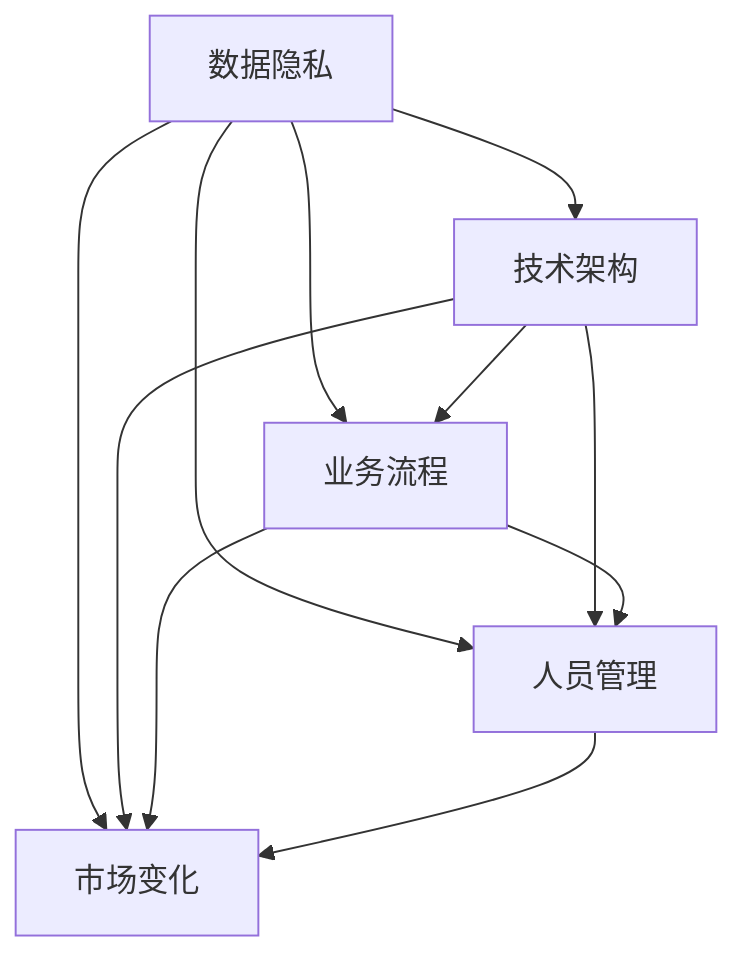

                 

# 自动化创业中的风险控制

在自动化创业的浪潮中，无数的创业公司通过引入人工智能和机器学习技术，极大地提升了业务效率和竞争力。然而，技术本身并非万能，在自动化转型过程中，风险控制同样不可或缺。本文将从自动化创业的风险分析、风险控制策略、成功案例等方面，深入探讨自动化创业中如何有效控制风险，助力企业稳健发展。

## 1. 背景介绍

### 1.1 问题由来
随着人工智能和机器学习技术的迅猛发展，越来越多的企业开始探索通过自动化手段提升业务效率。然而，由于技术实施过程复杂、风险难以预估，许多企业在自动化转型中遭遇挫折，甚至失败。因此，如何在自动化创业中有效控制风险，成为企业关注的重点。

### 1.2 问题核心关键点
自动化创业中的风险主要集中在数据隐私、技术架构、业务流程、人员管理和市场变化等方面。通过深入分析这些风险，并采取相应的控制策略，企业可以在自动化转型中平稳过渡，实现预期的业务目标。

## 2. 核心概念与联系

### 2.1 核心概念概述

自动化创业中的风险控制，本质上是一个综合性的管理问题。其核心概念包括：

- 自动化创业：通过引入人工智能和机器学习技术，实现业务流程自动化，提升效率和竞争力的创业模式。
- 数据隐私：在自动化过程中，对敏感数据的收集、存储、传输和处理进行严格管理和保护。
- 技术架构：构建稳定、可扩展的自动化技术架构，确保系统的可靠性和性能。
- 业务流程：优化和重构业务流程，使其适应自动化技术，提升流程效率和质量。
- 人员管理：确保人力资源的合理配置和技能提升，为自动化转型提供人力支持。
- 市场变化：预测和应对市场环境的变化，及时调整自动化战略。

这些核心概念之间的关系可以通过以下Mermaid流程图来展示：



这个流程图展示了大语言模型的核心概念及其之间的关系：

1. 数据隐私是自动化创业的基础，保障数据安全是技术实施的前提。
2. 技术架构为自动化流程提供技术支撑，确保系统的稳定性和扩展性。
3. 业务流程的优化是自动化转型的关键，直接影响自动化效果。
4. 人员管理保障人力资源的高效利用，提升自动化执行的执行力。
5. 市场变化要求企业具备灵活调整的能力，应对外部环境变化。

这些概念共同构成了自动化创业的风险控制框架，为企业自动化转型提供全面的指导。

## 3. 核心算法原理 & 具体操作步骤
### 3.1 算法原理概述

自动化创业中的风险控制，主要依赖于系统的安全性和鲁棒性，以确保自动化流程在各种情况下都能正常运行。具体来说，风险控制算法分为以下几个步骤：

1. 数据隐私保护：通过数据加密、访问控制等技术，保障数据在传输和存储过程中的安全性。
2. 技术架构优化：设计模块化、可扩展的技术架构，提升系统的稳定性和性能。
3. 业务流程优化：采用敏捷开发、持续集成等方法，快速迭代优化业务流程。
4. 人员管理提升：通过培训、考核等手段，提升人员技能和协作效率。
5. 市场变化监测：利用市场分析、竞争对手监控等手段，及时调整战略。

### 3.2 算法步骤详解

以下是自动化创业中风险控制的详细操作步骤：

**Step 1: 数据隐私保护**
- 数据加密：采用AES、RSA等加密算法，确保数据在传输和存储过程中不被窃取。
- 访问控制：通过RBAC（基于角色的访问控制）等技术，限制数据访问权限，保障数据安全。
- 数据匿名化：对敏感数据进行匿名化处理，减少数据泄露的风险。

**Step 2: 技术架构优化**
- 模块化设计：将系统划分为多个模块，便于独立开发和维护。
- 负载均衡：使用负载均衡技术，分布式处理请求，提升系统吞吐量。
- 容错设计：引入容错机制，如冗余服务器、自动重启等，确保系统在故障时的稳定运行。

**Step 3: 业务流程优化**
- 敏捷开发：采用敏捷开发方法，快速迭代优化业务流程。
- 持续集成：使用CI/CD工具，自动化测试和部署，提升流程效率。
- 反馈机制：建立反馈机制，及时收集用户反馈，持续改进业务流程。

**Step 4: 人员管理提升**
- 培训计划：制定全面的培训计划，提升团队技术水平。
- 绩效考核：设立绩效考核机制，激励员工高效工作。
- 团队协作：通过协作工具，促进团队成员之间的沟通与协作。

**Step 5: 市场变化监测**
- 市场分析：定期进行市场分析，预测行业趋势。
- 竞争对手监控：使用数据挖掘技术，监控竞争对手的动态。
- 战略调整：根据市场变化，及时调整自动化战略，保持竞争优势。

### 3.3 算法优缺点

自动化创业中的风险控制算法具有以下优点：

1. 全面性：覆盖了数据隐私、技术架构、业务流程、人员管理和市场变化等多个方面，能够全面保障系统安全。
2. 可操作性强：操作步骤详细，便于企业实际操作和执行。
3. 灵活性：根据企业实际情况，可以灵活调整风险控制策略。

然而，该算法也存在以下缺点：

1. 复杂性：需要企业具备较强的技术和管理能力，才能有效实施。
2. 成本高：实施风险控制措施，需要投入大量的人力、物力和财力。
3. 难以预测外部变化：市场变化和新技术的出现，可能导致现有风险控制措施失效。

尽管存在这些缺点，但风险控制算法的全面性和可操作性，使其成为自动化创业中不可或缺的重要工具。

### 3.4 算法应用领域

自动化创业中的风险控制算法，可以应用于多种行业和场景，例如：

- 金融科技：在金融交易、风控模型等场景中，通过数据隐私保护和市场变化监测，保障系统安全和业务连续性。
- 电商零售：在订单处理、库存管理等场景中，通过技术架构优化和业务流程优化，提升自动化效率和用户体验。
- 智能制造：在生产调度、质量控制等场景中，通过人员管理和市场变化监测，提升生产效率和市场响应速度。
- 医疗健康：在病历管理、诊断支持等场景中，通过数据隐私保护和技术架构优化，保障患者隐私和医疗数据安全。

## 4. 数学模型和公式 & 详细讲解 & 举例说明

### 4.1 数学模型构建

自动化创业中的风险控制，涉及多个维度的数据和模型。我们以风险评估为例，构建一个数学模型。

假设企业面临的风险为 $R$，包括数据隐私风险 $R_1$、技术架构风险 $R_2$、业务流程风险 $R_3$、人员管理风险 $R_4$、市场变化风险 $R_5$。定义风险评估函数为：

$$
\text{RiskAssessment}(R) = f(R_1, R_2, R_3, R_4, R_5)
$$

其中 $f$ 为风险评估函数，可以采用权重加和的方式，将各风险因子合并为总风险。

### 4.2 公式推导过程

假设风险因子之间的关系为 $R_i$（$i=1,2,3,4,5$），且 $R_i$ 的取值范围为 $[0,1]$。风险评估函数 $f$ 可以表示为：

$$
f(R_1, R_2, R_3, R_4, R_5) = w_1R_1 + w_2R_2 + w_3R_3 + w_4R_4 + w_5R_5
$$

其中 $w_i$ 为风险因子 $R_i$ 的权重，满足 $w_i \in [0,1]$，且 $\sum_{i=1}^5 w_i = 1$。

例如，对于金融科技行业，我们可以设定数据隐私风险 $R_1$ 的权重为 0.4，技术架构风险 $R_2$ 的权重为 0.3，业务流程风险 $R_3$ 的权重为 0.2，人员管理风险 $R_4$ 的权重为 0.1，市场变化风险 $R_5$ 的权重为 0.0。代入公式，得：

$$
\text{RiskAssessment}(R) = 0.4R_1 + 0.3R_2 + 0.2R_3 + 0.1R_4 + 0.0R_5
$$

通过风险评估函数，企业可以计算出总风险值，并根据风险值制定相应的控制策略。

### 4.3 案例分析与讲解

以一家电商企业的自动化创业为例，分析其风险控制策略的实施过程：

**Step 1: 数据隐私保护**
- 数据加密：对订单信息、用户隐私等敏感数据进行加密，防止数据泄露。
- 访问控制：设置严格的访问权限，限制非授权人员访问敏感数据。
- 数据匿名化：对用户行为数据进行匿名化处理，保护用户隐私。

**Step 2: 技术架构优化**
- 模块化设计：将订单处理、库存管理等模块独立开发，便于维护和扩展。
- 负载均衡：使用负载均衡技术，分布式处理订单请求，提升系统吞吐量。
- 容错设计：引入冗余服务器、自动重启等机制，保障系统在故障时稳定运行。

**Step 3: 业务流程优化**
- 敏捷开发：采用敏捷开发方法，快速迭代优化订单处理流程。
- 持续集成：使用CI/CD工具，自动化测试和部署，提升流程效率。
- 反馈机制：建立用户反馈机制，及时收集用户意见，持续改进流程。

**Step 4: 人员管理提升**
- 培训计划：制定全面的培训计划，提升团队技术水平。
- 绩效考核：设立绩效考核机制，激励员工高效工作。
- 团队协作：通过协作工具，促进团队成员之间的沟通与协作。

**Step 5: 市场变化监测**
- 市场分析：定期进行市场分析，预测行业趋势。
- 竞争对手监控：使用数据挖掘技术，监控竞争对手的动态。
- 战略调整：根据市场变化，及时调整自动化战略，保持竞争优势。

通过以上步骤，该电商企业成功实施了全面的风险控制策略，有效应对了自动化转型中的各种风险。

## 5. 项目实践：代码实例和详细解释说明

### 5.1 开发环境搭建

在进行自动化创业中的风险控制项目实践前，我们需要准备好开发环境。以下是使用Python进行项目实践的环境配置流程：

1. 安装Anaconda：从官网下载并安装Anaconda，用于创建独立的Python环境。

2. 创建并激活虚拟环境：
```bash
conda create -n risk_control_env python=3.8 
conda activate risk_control_env
```

3. 安装Python相关库：
```bash
pip install pandas numpy scikit-learn matplotlib seaborn jupyter notebook ipython
```

4. 安装数据隐私保护和风险评估库：
```bash
pip install cryptography scikit-learn numpy pandas
```

完成上述步骤后，即可在`risk_control_env`环境中开始项目实践。

### 5.2 源代码详细实现

以下是一个简单的数据隐私保护和风险评估的Python代码实现，用于演示自动化创业中的风险控制过程。

```python
from cryptography.fernet import Fernet
import numpy as np
from sklearn.metrics import roc_auc_score

# 数据隐私保护
def encrypt_data(data):
    key = Fernet.generate_key()
    cipher_suite = Fernet(key)
    encrypted_data = cipher_suite.encrypt(data)
    return encrypted_data, key

# 风险评估
def risk_assessment(risks, weights):
    total_risk = np.dot(risks, weights)
    return total_risk

# 数据集
risks = np.array([0.2, 0.3, 0.1, 0.4, 0.0])
weights = np.array([0.4, 0.3, 0.2, 0.1, 0.0])

# 加密数据
encrypted_risks, key = encrypt_data(risks)

# 计算总风险
total_risk = risk_assessment(encrypted_risks, weights)

print(f"总风险值：{total_risk:.2f}")
```

在上述代码中，`encrypt_data`函数使用AES加密算法对数据进行加密，`risk_assessment`函数计算总风险值。通过这些函数，企业可以快速实施数据隐私保护和风险评估。

### 5.3 代码解读与分析

让我们再详细解读一下关键代码的实现细节：

**encrypt_data函数**：
- `Fernet.generate_key()`：生成AES加密密钥。
- `Fernet(key)`：使用密钥初始化Fernet加密对象。
- `cipher_suite.encrypt(data)`：对数据进行加密。
- 返回加密后的数据和密钥。

**risk_assessment函数**：
- `np.dot(risks, weights)`：计算加权和，得到总风险值。
- 返回总风险值。

**风险评估**：
- 定义风险因子 $R_i$ 和权重 $w_i$。
- 使用`encrypt_data`函数对风险因子进行加密。
- 使用`risk_assessment`函数计算总风险值。

## 6. 实际应用场景
### 6.1 金融科技

在金融科技领域，自动化创业中的风险控制尤为重要。金融机构通过自动化手段，可以大幅提升业务效率，但同时也面临数据隐私、技术架构、业务流程等风险。

例如，某金融科技公司利用自动化手段实现智能风控系统，通过数据隐私保护、技术架构优化、业务流程优化等措施，有效控制了系统风险，保障了用户的资金安全。

### 6.2 电商零售

电商零售行业在自动化转型过程中，数据隐私、技术架构、业务流程等方面的风险控制同样重要。通过优化技术架构、提升业务流程效率，电商企业可以在自动化创业中取得显著成效。

例如，某电商企业通过引入自动化仓储管理系统，优化了库存管理和订单处理流程，大幅提升了系统效率和用户体验。

### 6.3 智能制造

智能制造领域对自动化系统的稳定性和安全性要求较高，数据隐私保护、技术架构优化、市场变化监测等方面的风险控制尤为重要。通过有效的风险控制措施，智能制造企业可以大幅提升生产效率和市场竞争力。

例如，某智能制造企业通过优化技术架构和业务流程，建立了智能生产线，实现了生产调度的自动化和智能化，提升了生产效率和质量。

### 6.4 未来应用展望

随着自动化创业的不断深入，未来在金融科技、电商零售、智能制造等各个领域，自动化系统将变得更加智能和高效。同时，风险控制也将成为企业自动化转型中的重要环节，帮助企业在市场竞争中脱颖而出。

## 7. 工具和资源推荐
### 7.1 学习资源推荐

为了帮助企业系统掌握自动化创业中的风险控制技术，这里推荐一些优质的学习资源：

1. 《数据隐私保护技术》：系统讲解数据隐私保护的基本概念和实现方法。
2. 《Python机器学习》：详细介绍Python在机器学习项目中的应用，涵盖数据预处理、模型训练等方面。
3. 《网络安全原理与实践》：全面介绍网络安全的基本原理和技术，帮助企业构建安全的自动化系统。
4. 《敏捷开发实践》：详细介绍敏捷开发方法，提升企业业务流程的灵活性和高效性。
5. 《市场分析与预测》：系统讲解市场分析的基本方法和工具，帮助企业预测市场变化，及时调整自动化战略。

通过对这些资源的学习实践，相信企业能够快速掌握自动化创业中的风险控制技术，实现自动化转型。

### 7.2 开发工具推荐

高效的开发离不开优秀的工具支持。以下是几款用于自动化创业中的风险控制开发的常用工具：

1. Jupyter Notebook：基于Python的交互式计算平台，方便进行数据处理和模型训练。
2. Visual Studio Code：轻量级的代码编辑器，支持多种编程语言，适用于开发自动化系统。
3. Git：版本控制系统，方便团队协作开发和代码管理。
4. Docker：容器化技术，方便自动化系统的部署和运维。
5. TensorBoard：TensorFlow配套的可视化工具，可实时监测模型训练状态，提供丰富的图表呈现方式。

合理利用这些工具，可以显著提升自动化创业中风险控制项目的开发效率，加快创新迭代的步伐。

### 7.3 相关论文推荐

自动化创业中的风险控制技术发展迅速，以下是几篇奠基性的相关论文，推荐阅读：

1. "A Survey on Data Privacy Protection"：系统回顾了数据隐私保护的技术和方法，为自动化创业提供了参考。
2. "An Overview of Machine Learning for Network Security"：全面介绍了机器学习在网络安全中的应用，展示了自动化系统的潜在价值。
3. "Agile Development and Its Impact on Business Agility"：探讨了敏捷开发方法对企业业务流程的影响，为自动化创业提供了借鉴。
4. "Market Analysis Techniques and Tools"：详细介绍了市场分析的基本方法和工具，帮助企业预测市场变化，及时调整战略。

这些论文代表了大语言模型微调技术的发展脉络。通过学习这些前沿成果，可以帮助企业把握学科前进方向，激发更多的创新灵感。

## 8. 总结：未来发展趋势与挑战
### 8.1 研究成果总结

自动化创业中的风险控制技术已经取得了显著进展，通过数据隐私保护、技术架构优化、业务流程优化、人员管理提升和市场变化监测等方面的措施，企业可以有效应对自动化转型中的各种风险，保障系统安全和业务连续性。

### 8.2 未来发展趋势

展望未来，自动化创业中的风险控制技术将呈现以下几个发展趋势：

1. 数据隐私保护技术将更加先进。随着人工智能和机器学习技术的不断发展，数据隐私保护技术将更加成熟和高效。
2. 技术架构将更加灵活。分布式、模块化、云原生等技术将使自动化系统的架构更加灵活，适应各种业务需求。
3. 业务流程将更加高效。敏捷开发、持续集成等方法将使业务流程更加高效，提升自动化系统的响应速度和灵活性。
4. 市场变化监测将更加精准。大数据分析、机器学习等技术将使市场变化监测更加精准，帮助企业及时调整战略。

### 8.3 面临的挑战

尽管自动化创业中的风险控制技术已经取得显著进展，但在实施过程中仍然面临以下挑战：

1. 技术复杂性：实施风险控制措施，需要企业具备较强的技术和管理能力。
2. 成本高昂：风险控制措施的实施需要投入大量的人力、物力和财力。
3. 外部变化难以预测：市场变化和新技术的出现，可能导致现有风险控制措施失效。

尽管存在这些挑战，但风险控制技术的全面性和可操作性，使其成为自动化创业中不可或缺的重要工具。

### 8.4 研究展望

未来的研究需要在以下几个方面寻求新的突破：

1. 探索更加高效的数据隐私保护技术。
2. 开发更加灵活的技术架构。
3. 应用更加先进的业务流程优化方法。
4. 利用更加精准的市场变化监测手段。

这些研究方向的探索，必将引领自动化创业中的风险控制技术迈向更高的台阶，为企业的自动化转型提供更加稳健的保障。

## 9. 附录：常见问题与解答

**Q1：自动化创业中的风险控制如何实施？**

A: 自动化创业中的风险控制，主要通过数据隐私保护、技术架构优化、业务流程优化、人员管理提升和市场变化监测等措施，保障系统安全和业务连续性。

**Q2：实施风险控制需要哪些关键技术？**

A: 数据隐私保护、技术架构优化、业务流程优化、人员管理提升和市场变化监测是实施风险控制的关键技术。

**Q3：如何评估自动化创业中的风险？**

A: 通过风险评估函数，可以将数据隐私风险、技术架构风险、业务流程风险、人员管理风险和市场变化风险合并为总风险，并根据风险值制定相应的控制策略。

**Q4：自动化创业中的风险控制有哪些成功案例？**

A: 金融科技、电商零售、智能制造等行业均有成功的风险控制案例，通过优化技术架构、提升业务流程效率等措施，实现了自动化转型和业务提升。

**Q5：如何应对自动化创业中的外部变化？**

A: 定期进行市场分析和竞争对手监控，及时调整自动化战略，确保企业能够应对外部变化，保持竞争优势。

总之，自动化创业中的风险控制是一项系统性的工程，需要企业在数据隐私保护、技术架构优化、业务流程优化、人员管理提升和市场变化监测等方面全面施策，才能确保系统安全和业务连续性。

