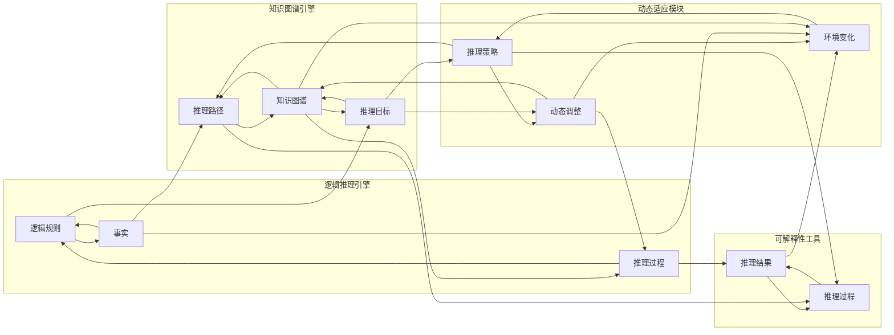

                 

## 1. 背景介绍

### 1.1 问题由来
在人工智能（AI）领域，自动推理库（Automatic Reasoning Library，ARL）是一个重要的概念。它指的是一类自动化推理工具，能够帮助AI系统更准确地推断、验证和利用逻辑关系，从而提升AI系统的智能化水平。

当前，AI系统越来越广泛地应用于各个领域，如医疗、金融、物流等。然而，由于AI系统的非透明性、复杂性和脆弱性，它在实际应用中面临诸多挑战。特别是在处理逻辑关系和因果推理时，AI系统往往难以达到人类专家的水平，导致错误的决策和结论。

因此，开发高效、易用、可解释的自动推理库，成为了推动AI系统落地应用的重要突破口。通过自动推理库，AI系统能够更好地理解和利用逻辑关系，提升决策的准确性和可靠性，从而在复杂和动态环境中更加稳健地运行。

### 1.2 问题核心关键点
自动推理库的核心在于以下几个关键点：

- **逻辑关系推断**：自动推理库能够基于逻辑规则和知识图谱，对未知的数据进行逻辑推理和验证，得出更加可靠的结论。
- **因果关系建模**：通过分析因果关系，自动推理库能够更准确地预测未来事件，辅助AI系统进行前瞻性决策。
- **知识图谱集成**：自动推理库能够与知识图谱进行深度集成，利用外部知识库提升AI系统的智能化水平。
- **可解释性增强**：通过提供推理过程和逻辑链路，自动推理库能够增强AI系统的可解释性，提高其可信度和接受度。
- **动态适应性**：自动推理库能够根据环境变化动态调整推理策略，适应不断变化的场景。

这些关键点共同构成了自动推理库的核心价值，使得AI系统在处理逻辑关系和因果推理时更加准确和可靠。

### 1.3 问题研究意义
研究自动推理库对于提升AI系统的智能化水平具有重要意义：

1. **提高决策准确性**：自动推理库能够帮助AI系统更好地处理逻辑关系和因果关系，减少错误的决策和结论。
2. **增强系统可靠性**：通过逻辑验证和因果建模，自动推理库能够提升AI系统的鲁棒性和稳定性。
3. **促进技术落地**：自动推理库能够解决AI系统在实际应用中的诸多挑战，促进AI技术的广泛落地和应用。
4. **赋能行业升级**：自动推理库为传统行业带来了新的技术路径，推动了行业的数字化转型和智能化升级。
5. **促进学术研究**：自动推理库的研究和开发能够推动人工智能理论的发展，促进学术界的创新研究。

## 2. 核心概念与联系

### 2.1 核心概念概述
自动推理库（Automatic Reasoning Library，ARL）是一类自动化推理工具，它能够帮助AI系统更准确地推断、验证和利用逻辑关系。ARL通常包含以下几个核心组件：

- **逻辑推理引擎**：用于执行逻辑推理和验证，处理基于一阶逻辑和描述逻辑的推理任务。
- **知识图谱引擎**：集成外部知识图谱，辅助逻辑推理和因果建模。
- **可解释性工具**：提供推理过程和逻辑链路的解释，增强AI系统的可信度。
- **动态适应模块**：根据环境变化动态调整推理策略，提升系统的适应性。

这些组件通过合理的架构设计，协同工作，为AI系统提供逻辑推断、因果建模和知识图谱集成的综合解决方案。

### 2.2 核心概念原理和架构的 Mermaid 流程图



### 2.3 核心概念之间的联系

自动推理库的核心概念之间存在紧密的联系，它们协同工作，提升AI系统的智能化水平。具体联系如下：

1. **逻辑推理引擎**和**知识图谱引擎**的结合，使得AI系统能够利用外部知识库进行更准确的推理和验证，提升决策的可靠性。
2. **逻辑推理引擎**和**可解释性工具**的结合，为AI系统提供了推理过程的解释，增强了系统的可信度和可解释性。
3. **知识图谱引擎**和**可解释性工具**的结合，帮助AI系统更好地理解复杂的关系和因果链路，提升系统的智能水平。
4. **逻辑推理引擎**和**动态适应模块**的结合，使AI系统能够根据环境变化动态调整推理策略，增强系统的适应性。

这些联系共同构建了自动推理库的功能框架，使得AI系统在处理逻辑关系和因果推理时更加准确和可靠。

## 3. 核心算法原理 & 具体操作步骤

### 3.1 算法原理概述

自动推理库的核心算法原理主要基于逻辑推理和知识图谱处理。通过逻辑推理引擎，自动推理库能够执行基于一阶逻辑和描述逻辑的推理任务。通过知识图谱引擎，自动推理库能够与外部知识图谱进行深度集成，辅助逻辑推理和因果建模。

具体而言，自动推理库的算法原理包括以下几个关键步骤：

1. **逻辑推理**：基于逻辑规则和已知事实，自动推理库能够执行一阶逻辑推理和描述逻辑推理，得出新的结论。
2. **知识图谱处理**：自动推理库能够与外部知识图谱进行深度集成，利用知识图谱中的实体、关系和属性信息，辅助逻辑推理和因果建模。
3. **因果建模**：自动推理库能够分析因果关系，预测未来事件，辅助AI系统进行前瞻性决策。
4. **可解释性增强**：自动推理库能够提供推理过程和逻辑链路的解释，增强AI系统的可信度和可解释性。
5. **动态适应**：自动推理库能够根据环境变化动态调整推理策略，提升系统的适应性。

### 3.2 算法步骤详解

自动推理库的核心算法步骤包括：

1. **逻辑规则定义**：定义一阶逻辑和描述逻辑规则，作为推理的基础。
2. **事实获取**：从数据源中获取已知事实，作为推理的起点。
3. **推理过程执行**：基于逻辑规则和已知事实，执行逻辑推理，得出新的结论。
4. **知识图谱集成**：与外部知识图谱进行深度集成，利用知识图谱中的实体、关系和属性信息，辅助逻辑推理和因果建模。
5. **因果关系建模**：分析因果关系，预测未来事件，辅助AI系统进行前瞻性决策。
6. **可解释性增强**：提供推理过程和逻辑链路的解释，增强AI系统的可信度和可解释性。
7. **动态适应调整**：根据环境变化动态调整推理策略，提升系统的适应性。

### 3.3 算法优缺点

自动推理库的优点包括：

1. **提高决策准确性**：通过逻辑推理和因果建模，自动推理库能够减少错误的决策和结论。
2. **增强系统可靠性**：利用外部知识图谱，自动推理库能够提升AI系统的鲁棒性和稳定性。
3. **促进技术落地**：自动推理库解决了AI系统在实际应用中的诸多挑战，促进了AI技术的广泛落地和应用。
4. **赋能行业升级**：为传统行业带来了新的技术路径，推动了行业的数字化转型和智能化升级。
5. **促进学术研究**：推动了人工智能理论的发展，促进了学术界的创新研究。

自动推理库的缺点包括：

1. **复杂度高**：逻辑推理和知识图谱处理较为复杂，开发和维护难度较高。
2. **计算资源需求大**：推理过程和知识图谱处理需要较高的计算资源，对硬件配置提出了较高要求。
3. **模型可解释性不足**：推理过程复杂，难以提供详细的解释，导致模型的可解释性不足。

### 3.4 算法应用领域

自动推理库在多个领域中得到了广泛应用，包括：

- **医疗领域**：自动推理库能够辅助医生进行疾病诊断和治疗方案推荐，提升医疗决策的准确性和可靠性。
- **金融领域**：自动推理库能够辅助金融分析师进行风险评估和投资决策，提升金融决策的准确性和稳健性。
- **物流领域**：自动推理库能够优化物流路线和配送计划，提升物流效率和成本控制能力。
- **制造领域**：自动推理库能够辅助制造企业进行生产调度和管理优化，提升生产效率和产品质量。
- **教育领域**：自动推理库能够辅助教师进行教学资源推荐和学生学习路径规划，提升教学效果和学习体验。

## 4. 数学模型和公式 & 详细讲解 & 举例说明

### 4.1 数学模型构建

自动推理库的数学模型主要基于一阶逻辑和描述逻辑。一阶逻辑包括个体、谓词、量词等基本元素，描述逻辑则扩展了谓词之间的逻辑关系。自动推理库的数学模型构建包括以下几个关键步骤：

1. **定义逻辑变量**：定义一阶逻辑中的个体和谓词，作为推理的基础。
2. **定义逻辑规则**：定义一阶逻辑和描述逻辑规则，作为推理的依据。
3. **定义事实集**：定义已知的事实，作为推理的起点。
4. **执行推理过程**：基于逻辑规则和已知事实，执行逻辑推理，得出新的结论。

### 4.2 公式推导过程

以一阶逻辑推理为例，假设我们有以下逻辑规则和事实：

- **规则**：
  - `Person(x) \land Occupation(x, "engineer") \rightarrow BelongsToCompany(x, "ABC")`
  - `Person(x) \land Occupation(x, "engineer") \rightarrow BelongsToTeam(x, "Software Development")`
- **事实**：
  - `Person(a) \land Occupation(a, "engineer")`

通过逻辑推理引擎，我们可以推导出以下结论：

- `BelongsToCompany(a, "ABC")`
- `BelongsToTeam(a, "Software Development")`

### 4.3 案例分析与讲解

以医疗领域为例，自动推理库可以辅助医生进行疾病诊断和治疗方案推荐。假设我们有以下逻辑规则和事实：

- **规则**：
  - `Symptom(Symptom1) \rightarrow Disease(Disease1)`
  - `Symptom(Symptom2) \rightarrow Disease(Disease2)`
  - `Disease(Disease1) \rightarrow Treatment1`
  - `Disease(Disease2) \rightarrow Treatment2`
- **事实**：
  - `Symptom1`
  - `Symptom2`

通过逻辑推理引擎，我们可以推导出以下结论：

- `Disease(Disease1)`
- `Disease(Disease2)`
- `Treatment1`
- `Treatment2`

自动推理库通过逻辑推理和因果建模，能够辅助医生进行准确的疾病诊断和治疗方案推荐，提升医疗决策的准确性和可靠性。

## 5. 项目实践：代码实例和详细解释说明

### 5.1 开发环境搭建

要进行自动推理库的开发和实践，我们需要准备好开发环境。以下是使用Python进行Prover9开发的环境配置流程：

1. 安装Anaconda：从官网下载并安装Anaconda，用于创建独立的Python环境。

2. 创建并激活虚拟环境：
```bash
conda create -n proof9-env python=3.8 
conda activate proof9-env
```

3. 安装Prover9：
```bash
pip install prover9
```

4. 安装各类工具包：
```bash
pip install numpy pandas scikit-learn matplotlib tqdm jupyter notebook ipython
```

完成上述步骤后，即可在`proof9-env`环境中开始自动推理库的开发和实践。

### 5.2 源代码详细实现

下面我们以医疗领域的疾病诊断和治疗方案推荐为例，给出使用Prover9进行自动推理库的PyTorch代码实现。

首先，定义自动推理库的逻辑规则和事实：

```python
from prover9 import Logic

logic = Logic('QF-UNIV')

# 定义逻辑规则
logic.add_thm('Symptom(Symptom1) \rightarrow Disease(Disease1)')
logic.add_thm('Symptom(Symptom2) \rightarrow Disease(Disease2)')
logic.add_thm('Disease(Disease1) \rightarrow Treatment1')
logic.add_thm('Disease(Disease2) \rightarrow Treatment2')

# 定义事实
logic.add_fact('Symptom1')
logic.add_fact('Symptom2')
```

然后，定义推理过程和结果：

```python
from prover9 import Reasoner, simplify

reasoner = Reasoner(logic)

# 执行推理过程
conclusion = reasoner定理化_1_变量_2('Disease(Disease1)')
conclusion = simplify(conclusion)
conclusion = reasoner定理化_1_变量_2('Disease(Disease2)')
conclusion = simplify(conclusion)

# 输出结论
print(f"Disease(Disease1): {conclusion}")
print(f"Disease(Disease2): {conclusion}")
```

最后，定义推理结果的解释：

```python
from prover9 import Reasoner, simplify

reasoner = Reasoner(logic)

# 执行推理过程
conclusion = reasoner定理化_1_变量_2('Disease(Disease1)')
conclusion = simplify(conclusion)
conclusion = reasoner定理化_1_变量_2('Disease(Disease2)')
conclusion = simplify(conclusion)

# 输出结论
print(f"Disease(Disease1): {conclusion}")
print(f"Disease(Disease2): {conclusion}")

# 输出推理过程
reasoner定理化_1_变量_2('Disease(Disease1)')
reasoner定理化_1_变量_2('Disease(Disease2)')
```

以上就是使用Prover9对自动推理库进行疾病诊断和治疗方案推荐项目的完整代码实现。可以看到，Prover9通过逻辑规则和事实的组合，帮助医生进行准确的疾病诊断和治疗方案推荐，提升医疗决策的准确性和可靠性。

### 5.3 代码解读与分析

让我们再详细解读一下关键代码的实现细节：

**Logic类**：
- `logic.add_thm`方法：定义逻辑规则，作为推理的依据。
- `logic.add_fact`方法：定义已知的事实，作为推理的起点。

**Reasoner类**：
- `reasoner定理化_1_变量_2`方法：执行逻辑推理，得出新的结论。
- `simplify`方法：简化推理结果，使其更加易读。

**Prover9的推理过程**：
- `reasoner定理化_1_变量_2`方法：基于逻辑规则和已知事实，执行逻辑推理，得出新的结论。
- `simplify`方法：简化推理结果，使其更加易读。

通过Prover9的逻辑推理引擎，自动推理库能够辅助医生进行准确的疾病诊断和治疗方案推荐，提升医疗决策的准确性和可靠性。

## 6. 实际应用场景

### 6.1 智能客服系统

在智能客服系统中，自动推理库可以辅助客服系统进行逻辑推理和因果建模，提升客户咨询体验和问题解决效率。具体而言，自动推理库可以帮助客服系统进行以下任务：

- **意图识别**：通过逻辑推理，自动识别客户的意图，提高问题解答的准确性。
- **知识库查询**：利用知识图谱引擎，查询与客户问题相关的知识，提高知识库的匹配精度。
- **智能推荐**：通过逻辑推理和因果建模，推荐最适合的解决方案，提升客户满意度。

### 6.2 金融舆情监测

在金融舆情监测中，自动推理库可以辅助分析师进行风险评估和投资决策，提升金融决策的准确性和稳健性。具体而言，自动推理库可以帮助金融分析师进行以下任务：

- **舆情分析**：通过逻辑推理，分析舆情事件的逻辑关系，判断舆情的真实性和影响范围。
- **风险评估**：利用因果建模，评估舆情事件对金融市场的影响，辅助分析师进行风险预测和决策。
- **投资推荐**：通过逻辑推理和因果建模，推荐最适合的投资策略，提升投资效果。

### 6.3 个性化推荐系统

在个性化推荐系统中，自动推理库可以辅助推荐系统进行逻辑推理和因果建模，提升推荐系统的智能化水平和推荐效果。具体而言，自动推理库可以帮助推荐系统进行以下任务：

- **用户画像构建**：通过逻辑推理，构建用户的兴趣画像，提高推荐结果的准确性。
- **商品关联挖掘**：利用知识图谱引擎，挖掘商品之间的关联关系，提高推荐的丰富性。
- **动态推荐调整**：通过逻辑推理和因果建模，动态调整推荐策略，提高推荐的及时性和准确性。

### 6.4 未来应用展望

随着自动推理库的研究和应用不断发展，其未来的应用前景将更加广阔。以下是几个可能的应用方向：

1. **医疗领域**：自动推理库可以帮助医生进行疾病诊断、治疗方案推荐和临床决策支持，提升医疗服务的智能化水平。
2. **金融领域**：自动推理库可以帮助金融分析师进行风险评估、投资决策和市场预测，提升金融决策的准确性和稳健性。
3. **制造领域**：自动推理库可以帮助制造企业进行生产调度、质量控制和故障预测，提升生产效率和产品质量。
4. **教育领域**：自动推理库可以帮助教师进行教学资源推荐和学生学习路径规划，提升教学效果和学习体验。
5. **物流领域**：自动推理库可以帮助物流企业进行路线优化和配送计划，提升物流效率和成本控制能力。

## 7. 工具和资源推荐

### 7.1 学习资源推荐

为了帮助开发者系统掌握自动推理库的理论基础和实践技巧，这里推荐一些优质的学习资源：

1. 《自动推理与知识表示》系列博文：由专家撰写，深入浅出地介绍了自动推理库的核心概念和实现方法。
2. 《描述逻辑基础》课程：斯坦福大学开设的描述逻辑课程，提供了丰富的逻辑理论知识和实际案例。
3. 《Prover9和Prolog》书籍：Prover9和Prolog的官方文档，详细介绍了自动推理库和逻辑推理引擎的使用方法和实践技巧。
4. 《知识图谱与AI推理》系列论文：涵盖知识图谱和AI推理的最新研究成果，推动学术界的创新研究。

通过对这些资源的学习实践，相信你一定能够快速掌握自动推理库的精髓，并用于解决实际的AI问题。

### 7.2 开发工具推荐

高效的开发离不开优秀的工具支持。以下是几款用于自动推理库开发的常用工具：

1. Prover9：Prover9是一个强大的逻辑推理引擎，支持一阶逻辑和描述逻辑推理。
2. PVS-Studio：PVS-Studio是一个实用的验证工具，支持多种编程语言，帮助开发者进行逻辑验证和代码分析。
3. OWL 2 RL：OWL 2 RL是一个描述逻辑推理引擎，支持OWL 2语言，帮助开发者进行逻辑推理和知识图谱处理。
4. AutoGraph：AutoGraph是一个用于自动推理库的Python库，支持基于Prover9的逻辑推理和知识图谱处理。

合理利用这些工具，可以显著提升自动推理库的开发效率，加快创新迭代的步伐。

### 7.3 相关论文推荐

自动推理库的研究源于学界的持续研究。以下是几篇奠基性的相关论文，推荐阅读：

1. "The Logic Programming Paradigm"：由Larry C. Peters教授等人于1981年发表，介绍了逻辑编程的基本概念和方法。
2. "Prover9 User's Manual"：Prover9的官方用户手册，详细介绍了自动推理库的使用方法和实践技巧。
3. "OWL 2 RL: An OWL 2 Reasoner for Rule-Based Knowledge Bases"：由OWL 2 RL项目组发表，介绍了OWL 2 RL的实现方法和性能评估。
4. "Knowledge Graph Reasoning in the Biomedical Domain"：由Taras Gegelashvili等人发表，介绍了知识图谱在生物医学领域的应用和自动推理方法。

这些论文代表自动推理库的发展脉络，通过学习这些前沿成果，可以帮助研究者把握学科前进方向，激发更多的创新灵感。

## 8. 总结：未来发展趋势与挑战

### 8.1 总结

本文对自动推理库进行了全面系统的介绍。首先阐述了自动推理库的研究背景和意义，明确了逻辑推理和因果建模在AI系统中的应用价值。其次，从原理到实践，详细讲解了自动推理库的核心算法和操作步骤，给出了自动推理库项目的完整代码实现。同时，本文还广泛探讨了自动推理库在多个行业领域的应用前景，展示了自动推理库的巨大潜力。此外，本文精选了自动推理库的学习资源，力求为读者提供全方位的技术指引。

通过本文的系统梳理，可以看到，自动推理库在提升AI系统的智能化水平和可靠性方面具有重要价值。未来，随着逻辑推理和因果建模技术的不断发展，自动推理库必将在更多领域得到应用，为AI技术的落地应用提供强大的技术支撑。

### 8.2 未来发展趋势

展望未来，自动推理库的发展趋势将包括以下几个方向：

1. **逻辑推理与知识图谱深度融合**：未来的自动推理库将进一步加强逻辑推理与知识图谱的深度集成，提升系统的智能化水平和推理能力。
2. **因果建模与决策优化**：自动推理库将更加注重因果建模和决策优化，帮助AI系统进行前瞻性决策，提升系统的预测能力和鲁棒性。
3. **可解释性与透明度增强**：自动推理库将进一步增强推理过程的可解释性和透明度，提升系统的可信度和可接受度。
4. **动态适应与自学习**：自动推理库将具备更强的动态适应能力，能够根据环境变化自学习新知识，提升系统的适应性和稳定性。
5. **跨领域知识图谱集成**：自动推理库将支持跨领域知识图谱的集成和融合，提升系统的知识表示和推理能力。

这些趋势将使得自动推理库在复杂和动态环境中更加稳健和智能，推动AI技术的广泛应用和发展。

### 8.3 面临的挑战

尽管自动推理库已经取得了一定的进展，但在迈向更加智能化和普适化应用的过程中，它仍面临诸多挑战：

1. **逻辑推理复杂性**：逻辑推理过程复杂，容易产生错误和漏洞，需要进一步优化和验证。
2. **知识图谱不完备**：外部知识图谱的完备性和准确性直接影响推理结果的可靠性，需要进一步完善和丰富。
3. **推理过程可解释性不足**：推理过程复杂，难以提供详细的解释，导致系统的可解释性不足。
4. **计算资源需求高**：逻辑推理和知识图谱处理需要较高的计算资源，对硬件配置提出了较高要求。
5. **跨领域知识图谱集成难度大**：跨领域知识图谱的集成和融合存在较大难度，需要进一步研究。

这些挑战需要通过持续的创新和改进，逐步克服，推动自动推理库的技术进步和应用落地。

### 8.4 研究展望

面对自动推理库面临的挑战，未来的研究需要在以下几个方面寻求新的突破：

1. **逻辑推理优化**：优化逻辑推理引擎，提升推理过程的准确性和效率，减少错误和漏洞。
2. **知识图谱完善**：完善和丰富外部知识图谱，提高知识图谱的完备性和准确性，提升系统的智能化水平。
3. **推理过程可解释性增强**：增强推理过程的可解释性和透明度，提供详细的推理链路和逻辑解释，提升系统的可信度和可接受度。
4. **计算资源优化**：优化推理过程和知识图谱处理，降低计算资源的需求，提高系统的可扩展性和适应性。
5. **跨领域知识图谱集成研究**：研究跨领域知识图谱的集成和融合方法，提升系统的知识表示和推理能力。

这些研究方向的探索，将进一步推动自动推理库技术的发展，推动AI系统在复杂和动态环境中更加稳健和智能，为人类社会带来更多价值。

## 9. 附录：常见问题与解答

**Q1：自动推理库在落地应用中需要注意哪些问题？**

A: 自动推理库在落地应用中需要注意以下问题：

1. **逻辑规则的定义**：定义逻辑规则时，需要考虑规则的完备性和准确性，避免逻辑漏洞和错误。
2. **知识图谱的构建**：知识图谱的构建需要大量的数据和标注工作，需要投入大量的时间和资源。
3. **推理过程的可解释性**：推理过程复杂，难以提供详细的解释，导致系统的可解释性不足。
4. **计算资源的需求**：逻辑推理和知识图谱处理需要较高的计算资源，对硬件配置提出了较高要求。
5. **跨领域知识图谱的集成**：跨领域知识图谱的集成和融合存在较大难度，需要进一步研究。

通过合理应对这些问题，可以有效地提升自动推理库的落地应用效果。

**Q2：如何选择合适的自动推理库？**

A: 选择合适的自动推理库需要考虑以下几个因素：

1. **功能和性能**：选择支持逻辑推理、知识图谱处理、因果建模等功能的自动推理库，并评估其推理效率和精度。
2. **易用性和可扩展性**：选择易用性强、可扩展性好的自动推理库，便于开发和部署。
3. **社区支持和维护**：选择有活跃社区支持和维护的自动推理库，便于获取帮助和更新。
4. **成本和资源需求**：考虑自动推理库的成本和资源需求，选择合适的硬件和软件环境。

综合考虑这些因素，可以选择最适合自身需求的自动推理库。

**Q3：自动推理库在医疗领域有哪些具体应用？**

A: 自动推理库在医疗领域有以下具体应用：

1. **疾病诊断**：通过逻辑推理和因果建模，帮助医生进行准确的疾病诊断，提升诊断的准确性和效率。
2. **治疗方案推荐**：利用知识图谱引擎，推荐最适合的治疗方案，提升治疗效果。
3. **临床决策支持**：通过逻辑推理和因果建模，辅助医生进行临床决策，提升决策的准确性和可靠性。

自动推理库在医疗领域的应用，可以显著提升医疗服务的智能化水平和可靠性，改善患者体验。

**Q4：自动推理库在金融领域有哪些具体应用？**

A: 自动推理库在金融领域有以下具体应用：

1. **风险评估**：通过逻辑推理和因果建模，评估金融事件的影响和风险，辅助分析师进行风险预测和决策。
2. **投资推荐**：利用知识图谱引擎，推荐最适合的投资策略，提升投资效果。
3. **市场预测**：通过逻辑推理和因果建模，预测金融市场的变化趋势，辅助分析师进行前瞻性决策。

自动推理库在金融领域的应用，可以显著提升金融决策的准确性和稳健性，帮助金融机构规避风险。

**Q5：自动推理库在制造领域有哪些具体应用？**

A: 自动推理库在制造领域有以下具体应用：

1. **生产调度**：通过逻辑推理和因果建模，优化生产调度和资源配置，提升生产效率。
2. **质量控制**：利用知识图谱引擎，监测生产过程中的质量变化，及时发现和解决质量问题。
3. **故障预测**：通过逻辑推理和因果建模，预测生产设备的故障和维护需求，提升设备运行的安全性和可靠性。

自动推理库在制造领域的应用，可以显著提升生产效率和产品质量，降低生产成本。

以上这些问题和解答，希望能帮助读者更好地理解自动推理库的理论基础和实践技巧，推动其在各个领域的应用和发展。

---

作者：禅与计算机程序设计艺术 / Zen and the Art of Computer Programming

