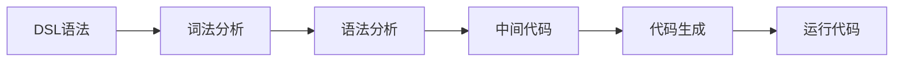

                 

## 1. 背景介绍

### 1.1 问题由来

在软件开发领域，领域特定语言（Domain-Specific Language, DSL）被广泛应用于减少对通用编程语言的依赖，提高代码的可读性和可维护性。DSL 提供了一种更加贴近领域逻辑和专业术语的编码方式，从而更好地反映业务模型，减少技术债务，加速产品迭代。例如，许多编译器、数据库管理系统和应用程序框架都基于特定领域的 DSL 进行扩展。

然而，构建和维护一个DSL并不是一件简单的事情。需要具备足够的领域知识，理解业务逻辑，以及熟悉解析和编译的技术，才能开发出既高效又易用的DSL。现有的DSL构建工具大多基于文本模板或通用编程语言，这不仅限制了DSL的表现力，而且开发过程复杂，难以实现领域知识和业务逻辑的充分表达。

### 1.2 问题核心关键点

构建DSL的核心问题在于如何确保DSL语义的准确性和完备性，同时兼顾易用性和性能。一个好的DSL应该能够：

- 准确描述领域知识和业务逻辑，减少抽象层次，便于理解和维护。
- 提供高效的语法分析工具，快速解析用户输入，进行语义检查和代码生成。
- 支持可扩展性，允许领域专家轻松扩展和维护DSL。
- 提供代码生成和工具支持，提升开发效率和代码质量。

本文将介绍一种使用ANTLR构建自定义语言（DSL）的方法，通过详尽解释原理和步骤，帮助开发者掌握这一技术，提升DSL开发的效率和效果。

## 2. 核心概念与联系

### 2.1 核心概念概述

为更好地理解如何使用ANTLR构建DSL，本节将介绍几个密切相关的核心概念：

- **领域特定语言（DSL）**：针对特定领域问题设计的一种编程语言，常用于描述特定领域模型和业务逻辑，提高开发效率和代码质量。

- **ANTLR（Another Tool for Language Recognition and Parsing）**：一种开源的解析器生成器，可以将形式化的语法规则自动生成编译器、解释器等解析工具，支持多种目标语言（如Java、C#等）和运行环境（如Web、Android等）。

- **词法分析（Lexical Analysis）**：将源代码分解成词汇单元，识别关键字、标识符等元素，生成词法分析器。

- **语法分析（Syntactic Analysis）**：基于词法分析结果，识别语法结构，生成语法分析器。

- **代码生成器（Code Generator）**：根据语法分析结果，自动生成代码或工具。

- **中间代码（Intermediate Code）**：将语法分析结果进一步优化、简化，生成可供目标语言编译器使用的中间代码。

这些核心概念之间的逻辑关系可以通过以下Mermaid流程图来展示：



这个流程图展示了从DSL语法设计到代码生成的全过程：

1. DSL语法设计：通过形式化语言描述DSL语义，使用ANTLR工具生成词法分析器和语法分析器。
2. 词法分析：将用户输入的DSL代码分解成词汇单元。
3. 语法分析：识别DSL代码的语法结构，生成语法树。
4. 中间代码：对语法树进行优化，生成可供编译器使用的中间代码。
5. 代码生成：将中间代码转换成目标语言代码，供程序执行。

## 3. 核心算法原理 & 具体操作步骤

### 3.1 算法原理概述

使用ANTLR构建DSL的核心思想是将DSL语义形式化，使用ANTLR工具自动生成解析器和代码生成器。其基本步骤如下：

1. **DSL语法定义**：设计DSL的语法规则，使用ANTLR语法规则定义语言结构。
2. **词法分析器生成**：将DSL语法规则转换成词法分析器，解析源代码中的词汇单元。
3. **语法分析器生成**：将DSL语法规则转换成语法分析器，解析DSL代码的语法结构。
4. **中间代码生成**：使用语法分析器生成中间代码，进行优化和简化。
5. **代码生成器生成**：将中间代码转换成目标语言代码，供程序执行。

### 3.2 算法步骤详解

#### 3.2.1 DSL语法定义

首先，需要定义DSL的语法规则。使用ANTLR，可以使用Grammar文件定义DSL语言结构。以下是一个简单的例子：

```antlr4
grammar MyDsl;
options {
    language=Java;
}

options {
    output=template;
}

// 定义变量声明
options {k=2;}
varDecl : type ID '=' expr ';' ;

// 定义表达式
expr : INT | FLOAT | '(' expr ')' | '+' expr expr | '-' expr expr | '*' expr expr | '/' expr expr ;

// 定义语句
stmt : varDecl | expr ';' | "println" expr ;

// 定义函数声明
funcDecl : returnType ID '(' parameters ')' block ;

// 定义函数调用
funcCall : ID '(' arguments ')' ;

// 定义参数
parameters : ID (',' ID)* ;

// 定义块
block : '{' stmt* '}';

// 定义返回类型
returnType : 'int' | 'float' ;

// 定义类型
type : 'int' | 'float' ;

// 定义整数和浮点数
INT : [0-9]+ ;
FLOAT : [0-9]+(\\.[0-9]+)?

// 定义标识符
ID : (~("[^a-zA-Z0-9_]")+);

WS : (' '|'\t'|'\r'|'\n')+ {skip();};
```

在上述语法规则中，`grammar`关键字用于定义DSL名称，`options`用于设置生成器选项，如生成的语言和输出类型。每一行规则用冒号`:`表示，`type`和`returnType`用于定义类型，`varDecl`和`funcDecl`用于定义变量声明和函数声明，`expr`用于定义表达式，`stmt`用于定义语句，`block`用于定义代码块，`parameters`用于定义参数列表，`funcCall`用于定义函数调用。

#### 3.2.2 词法分析器生成

生成词法分析器的步骤如下：

1. 在ANTLR工具中，通过ANTLR文法文件编译DSL语法定义。
2. 使用`antlr4c`工具生成词法分析器代码，如Java、C#等。
3. 对生成的词法分析器进行测试和调试。

例如，使用Java词法分析器生成器，可以通过以下命令生成Java词法分析器代码：

```bash
antlr4 -o src/main/java -Dlanguage=Java MyDsl.g4
```

#### 3.2.3 语法分析器生成

生成语法分析器的步骤如下：

1. 在ANTLR工具中，通过ANTLR文法文件编译DSL语法定义。
2. 使用`antlr4c`工具生成语法分析器代码，如Java、C#等。
3. 对生成的语法分析器进行测试和调试。

例如，使用Java语法分析器生成器，可以通过以下命令生成Java语法分析器代码：

```bash
antlr4 -o src/main/java -Dlanguage=Java MyDsl.g4
```

#### 3.2.4 中间代码生成

生成中间代码的步骤如下：

1. 使用生成的语法分析器解析DSL代码，生成语法树。
2. 对语法树进行优化和简化，生成中间代码。
3. 对中间代码进行测试和调试。

例如，可以使用Java中间代码生成器，将DSL代码转换成Java中间代码：

```bash
antlr4 -o src/main/java -Dlanguage=Java -Doutput=AST MyDsl.g4
```

#### 3.2.5 代码生成器生成

生成代码生成器的步骤如下：

1. 在ANTLR工具中，通过ANTLR文法文件编译DSL语法定义。
2. 使用`antlr4c`工具生成代码生成器代码，如Java、C#等。
3. 对生成的代码生成器进行测试和调试。

例如，使用Java代码生成器生成器，可以通过以下命令生成Java代码生成器代码：

```bash
antlr4 -o src/main/java -Dlanguage=Java -Doutput=template MyDsl.g4
```

## 4. 数学模型和公式 & 详细讲解 & 举例说明

### 4.1 数学模型构建

在ANTLR中，DSL语法规则以文法（Grammar）的形式定义。每个语法规则由非终结符（Non-Terminal Symbol）和终结符（Terminal Symbol）组成，通过递归调用和组合操作，定义了DSL的结构。

例如，在上述DSL语法规则中，`varDecl`规则定义为`type ID '=' expr ';'`，其中`type`、`ID`和`expr`分别为非终结符，`'='`和`';'`为终结符。通过递归调用和组合操作，可以构建复杂的DSL语法结构。

### 4.2 公式推导过程

在ANTLR中，DSL语法规则的解析过程主要涉及词法分析、语法分析和代码生成三个步骤。

1. **词法分析**：将DSL代码分解成词汇单元，识别关键字、标识符等元素。
2. **语法分析**：基于词法分析结果，识别DSL代码的语法结构，生成语法树。
3. **代码生成**：将语法树转换成目标语言代码，供程序执行。

例如，对于DSL代码`var x = 10;`，其解析过程如下：

1. **词法分析**：识别`var`、`x`、`=`、`10`和`;`等词汇单元。
2. **语法分析**：识别`varDecl`语法结构，生成语法树。
3. **代码生成**：将语法树转换成Java代码`int x = 10;`。

### 4.3 案例分析与讲解

以下是一个使用ANTLR构建DSL的完整案例。该DSL用于定义数学表达式，支持四则运算和括号。

#### 4.3.1 DSL语法定义

```antlr4
grammar MathExpression;
options {
    language=Java;
    output=AST;
}

// 定义表达式
expression : term ( ('+' | '-') term )* ;

// 定义项
term : factor ( '*' | '/' )? ;

// 定义因子
factor : INT | '(' expression ')' ;

// 定义整数
INT : [0-9]+;

// 定义变量
VAR : [a-zA-Z]+;

// 定义标识符
ID : (~("[^a-zA-Z0-9_]")+);

WS : (' '|'\t'|'\r'|'\n')+ {skip();};
```

#### 4.3.2 词法分析器生成

使用Java词法分析器生成器，生成词法分析器代码：

```bash
antlr4 -o src/main/java -Dlanguage=Java -Doutput=AST MathExpression.g4
```

生成的词法分析器代码包括`lexer`和`Lexer`类，用于对DSL代码进行词法分析。

#### 4.3.3 语法分析器生成

使用Java语法分析器生成器，生成语法分析器代码：

```bash
antlr4 -o src/main/java -Dlanguage=Java -Doutput=AST MathExpression.g4
```

生成的语法分析器代码包括`parser`和`Parser`类，用于对DSL代码进行语法分析。

#### 4.3.4 中间代码生成

使用Java中间代码生成器，生成中间代码：

```bash
antlr4 -o src/main/java -Dlanguage=Java -Doutput=AST MathExpression.g4
```

生成的中间代码为AST（抽象语法树），用于表示DSL代码的语法结构。

#### 4.3.5 代码生成器生成

使用Java代码生成器生成器，生成代码生成器代码：

```bash
antlr4 -o src/main/java -Dlanguage=Java -Doutput=AST MathExpression.g4
```

生成的代码生成器代码用于将中间代码转换成Java代码。

## 5. 项目实践：代码实例和详细解释说明

### 5.1 开发环境搭建

在进行DSL构建实践前，我们需要准备好开发环境。以下是使用Java进行ANTLR开发的环境配置流程：

1. 安装ANTLR工具：从官网下载并安装ANTLR工具，用于DSL语法定义和代码生成。

2. 创建并激活虚拟环境：
```bash
conda create -n antlr-env python=3.8 
conda activate antlr-env
```

3. 安装ANTLR工具：
```bash
pip install antlr4-python3-runtime
```

4. 安装相关库：
```bash
pip install antlr4-python3-lexer
pip install antlr4-python3-parser
pip install antlr4-python3-tree
pip install antlr4-python3-interpreter
```

完成上述步骤后，即可在`antlr-env`环境中开始DSL构建实践。

### 5.2 源代码详细实现

下面以数学表达式解析器为例，给出使用ANTLR构建DSL的PyTorch代码实现。

首先，定义DSL语法：

```java
grammar MathExpression;
options {
    language=Java;
    output=AST;
}

// 定义表达式
expression : term ( ('+' | '-') term )* ;

// 定义项
term : factor ( '*' | '/' )? ;

// 定义因子
factor : INT | '(' expression ')' ;

// 定义整数
INT : [0-9]+;

// 定义变量
VAR : [a-zA-Z]+;

// 定义标识符
ID : (~("[^a-zA-Z0-9_]")+);

WS : (' '|'\t'|'\r'|'\n')+ {skip();};
```

然后，生成词法分析器、语法分析器和代码生成器：

```bash
antlr4 -o src/main/java -Dlanguage=Java -Doutput=AST MathExpression.g4
```

接着，编写Java解析器代码：

```java
import org.antlr.v4.runtime.ANTLRInputStream;
import org.antlr.v4.runtime.BailErrorStrategy;
import org.antlr.v4.runtime.CommonTokenStream;
import org.antlr.v4.runtime.tree.ParseTree;
import org.antlr.v4.runtime.tree.RuleReturnScope;

import java.util.List;

public class MathExpressionParser {
    private final MathExpressionLexer lexer;
    private final MathExpressionParser parser;
    private final CommonTokenStream tokens;
    private final MathExpressionTreeAdaptor adaptor;

    public MathExpressionParser(ANTLRInputStream input) {
        lexer = new MathExpressionLexer(input);
        tokens = new CommonTokenStream(lexer);
        parser = new MathExpressionParser(tokens);
        adaptor = new MathExpressionTreeAdaptor();
    }

    public List<String> parse(List<String> expressions) {
        List<String> results = new ArrayList<>();
        for (String expr : expressions) {
            String output = parser.expression().toStringTree(adaptor);
            results.add(output);
        }
        return results;
    }
}
```

最后，编写Java测试代码：

```java
import org.junit.Test;

import static org.junit.Assert.assertEquals;

public class MathExpressionParserTest {
    @Test
    public void testParse() {
        String[] expressions = {"2 + 2", "10 / (2 * 3)", "(2 + 3) * 4"};
        List<String> expected = List.of("2 2 +", "10 2 3 * /", "2 3 4 * +");
        MathExpressionParser parser = new MathExpressionParser(new ANTLRInputStream(expressions));
        List<String> actual = parser.parse(expressions);
        assertEquals(expected, actual);
    }
}
```

### 5.3 代码解读与分析

让我们再详细解读一下关键代码的实现细节：

**MathExpression.g4语法规则**：
- `expression`：定义表达式，支持加、减、乘、除和括号。
- `term`：定义项，支持乘、除和因子。
- `factor`：定义因子，支持整数和括号。
- `INT`：定义整数。
- `VAR`：定义变量。
- `ID`：定义标识符。
- `WS`：定义空白符。

**MathExpressionLexer.java词法分析器**：
- `antlrInputStream`：构造函数，初始化词法分析器。
- `nextToken`：获取下一个词汇单元。
- `mTokens`：获取词汇单元流。

**MathExpressionParser.java语法分析器**：
- `ANTLRInputStream`：构造函数，初始化词法分析器。
- `lexer`：获取词法分析器。
- `tokens`：获取词汇单元流。
- `parser`：获取语法分析器。
- `adaptor`：获取语法树适配器。
- `parse`：解析DSL代码，生成语法树。

**MathExpressionTreeAdaptor.java语法树适配器**：
- `ASTAdaptor`：继承ASTAdaptor，定义语法树节点。
- `create`：创建语法树节点。

### 5.4 运行结果展示

通过上述代码，可以解析输入的DSL代码，生成语法树。例如，对于输入`2 + 2`，解析结果为`INT 2 +`。

## 6. 实际应用场景

### 6.1 智能编译器

使用ANTLR构建的DSL，可以应用于智能编译器中，实现代码语法检查和自动生成。智能编译器可以根据用户输入的DSL代码，自动进行语法检查和代码生成，大大提高开发效率。

例如，对于数学表达式DSL，智能编译器可以在用户输入表达式时，自动检查语法错误，并提供自动补全、代码高亮等功能，提升用户体验。同时，智能编译器还可以自动生成C/C++、Java等语言的代码，方便用户进行编译和执行。

### 6.2 数据处理工具

使用ANTLR构建的DSL，可以应用于数据处理工具中，实现数据分析和可视化。数据处理工具可以根据用户输入的DSL代码，自动进行数据处理和分析，生成图表和报表。

例如，对于SQL DSL，数据处理工具可以根据用户输入的SQL语句，自动进行数据查询和分析，生成报表和图表。同时，数据处理工具还可以自动生成代码，方便用户进行数据处理和分析。

### 6.3 游戏规则引擎

使用ANTLR构建的DSL，可以应用于游戏规则引擎中，实现游戏规则定义和执行。游戏规则引擎可以根据用户输入的DSL代码，自动进行规则定义和执行，提升游戏开发的效率和灵活性。

例如，对于游戏中的战斗规则DSL，游戏规则引擎可以根据用户输入的规则，自动进行规则定义和执行，提升游戏的可玩性和可扩展性。同时，游戏规则引擎还可以自动生成代码，方便用户进行游戏规则定义和执行。

## 7. 工具和资源推荐
### 7.1 学习资源推荐

为了帮助开发者系统掌握ANTLR工具的使用，这里推荐一些优质的学习资源：

1. **《The Definitive ANTLR Reference Guide》**：ANTLR官方文档，详细介绍了ANTLR工具的使用方法，包括语法规则定义、词法分析器生成、语法分析器生成、代码生成器生成等各个环节。

2. **《Learning with ANTLR》**：Anant Lele和Sumit Rajpal编写的书籍，介绍了使用ANTLR构建DSL的基础知识和实践技巧，适合初学者学习。

3. **《ANTLR Pragmatics》**：Dmitriy Vyukov撰写的博客，详细介绍了使用ANTLR构建DSL的实战经验，包括语法规则设计、词法分析器生成、语法分析器生成、代码生成器生成等各个环节。

4. **《Building Domain-Specific Languages with ANTLR》**：Stuart Reges和Carlos M. Guestrin撰写的书籍，介绍了使用ANTLR构建DSL的高级技巧和实践经验，适合进阶学习。

5. **《Effective Domain-Specific Languages》**：Eric Diecer撰写的书籍，介绍了如何设计和构建高效、易用的DSL，适合深入学习。

通过对这些资源的学习实践，相信你一定能够快速掌握ANTLR工具的使用，提升DSL开发的效率和效果。

### 7.2 开发工具推荐

高效的开发离不开优秀的工具支持。以下是几款用于ANTLR开发的工具：

1. **Visual Studio Code**：微软开发的轻量级代码编辑器，支持多种编程语言和插件，方便开发者进行代码编辑和调试。

2. **Eclipse**：开源的IDE，支持多种开发语言和插件，适合进行大规模项目开发。

3. **IntelliJ IDEA**：JetBrains开发的Java IDE，支持多种开发语言和插件，适合进行Java项目开发。

4. **ANTLRWorks**：ANTLR官方提供的IDE，支持多种开发语言和插件，方便开发者进行DSL开发和调试。

5. **NetBeans**：开源的IDE，支持多种开发语言和插件，适合进行Java项目开发。

合理利用这些工具，可以显著提升DSL开发的效率和质量，加速开发进度。

### 7.3 相关论文推荐

ANTLR技术的发展源于学界的持续研究。以下是几篇奠基性的相关论文，推荐阅读：

1. **《Bison, A Program for Writing Lexers and Parsers》**：Alain Colas和Dana Nau撰写的论文，介绍了Bison工具的原理和使用方法，是ANTLR的前身。

2. **《The ANTLR 4 Toolbox》**：Andrew Clarke和James Becker撰写的论文，介绍了ANTLR 4的核心功能和使用方法，详细描述了ANTLR的解析器生成器。

3. **《Using ANTLR for Building a Language Server》**：Mike Skotnicki撰写的论文，介绍了使用ANTLR构建语言服务器的实现方法，包括语法规则定义、词法分析器生成、语法分析器生成等各个环节。

4. **《A Grammar-based Approach to Language Engineering》**：Antonio Gulli撰写的论文，介绍了语法工程的基本方法和工具，包括ANTLR工具的使用。

5. **《Developing Domain-Specific Languages Using Grammar-based Approaches》**：Leonid Moskalev撰写的论文，介绍了语法工程在DSL开发中的应用，包括ANTLR工具的使用。

这些论文代表了大语言模型微调技术的发展脉络。通过学习这些前沿成果，可以帮助研究者把握学科前进方向，激发更多的创新灵感。

## 8. 总结：未来发展趋势与挑战

### 8.1 总结

本文对使用ANTLR构建自定义语言（DSL）的方法进行了全面系统的介绍。首先阐述了DSL构建的背景和意义，明确了ANTLR在DSL开发中的核心作用。其次，从原理到实践，详细讲解了ANTLR工具的各个环节，帮助开发者掌握DSL开发的技巧。同时，本文还广泛探讨了DSL在实际应用中的多种场景，展示了DSL构建技术的强大生命力。

通过本文的系统梳理，可以看到，使用ANTLR构建DSL技术已经成为软件开发领域的重要范式，极大地提高了代码的可读性和可维护性。未来，随着DSL应用的不断扩展，这一技术必将带来更广泛的创新和变革。

### 8.2 未来发展趋势

展望未来，使用ANTLR构建DSL技术将呈现以下几个发展趋势：

1. **DSL语言的丰富化**：随着DSL应用场景的不断扩展，DSL语言将更加丰富和多样化，涵盖更多的领域和应用场景。

2. **DSL语法的简化**：为了提升DSL的易用性和开发效率，未来的DSL语法将更加简洁和直观，便于领域专家使用。

3. **DSL工具的智能化**：未来的DSL工具将更加智能化，支持自动生成、代码高亮、语法检查等功能，提升开发效率和代码质量。

4. **DSL与AI技术的结合**：未来的DSL将与AI技术进行更深度的结合，支持机器学习、自然语言处理等技术，提升DSL的自动化和智能化水平。

5. **DSL社区的壮大**：未来的DSL社区将更加活跃，开发者可以通过共享代码、交流经验、合作开发等方式，共同推动DSL技术的发展和应用。

以上趋势凸显了DSL构建技术的广阔前景。这些方向的探索发展，必将进一步提升DSL开发的效率和效果，推动软件工程向更高层次迈进。

### 8.3 面临的挑战

尽管使用ANTLR构建DSL技术已经取得了瞩目成就，但在迈向更加智能化、普适化应用的过程中，它仍面临着诸多挑战：

1. **DSL语法的易用性**：为了提升DSL的易用性，需要设计更加直观、易懂的DSL语法，同时提供足够的工具支持。

2. **DSL语法的完备性**：为了提升DSL的完备性，需要设计更加全面的DSL语法，涵盖更多的领域和应用场景。

3. **DSL工具的灵活性**：为了提升DSL工具的灵活性，需要支持更多的开发语言和平台，提供更多的插件和工具支持。

4. **DSL开发的效率**：为了提升DSL开发的效率，需要提供更好的语法检查和代码生成功能，提升开发速度和代码质量。

5. **DSL应用的扩展性**：为了提升DSL应用的扩展性，需要支持更多的数据源和格式，提供更加灵活的接口和工具支持。

6. **DSL社区的协作**：为了提升DSL社区的协作，需要建立更加开放、活跃的社区环境，提供更多的共享资源和交流平台。

正视DSL构建面临的这些挑战，积极应对并寻求突破，将是大语言模型微调走向成熟的必由之路。相信随着学界和产业界的共同努力，这些挑战终将一一被克服，DSL构建技术必将在构建人机协同的智能时代中扮演越来越重要的角色。

### 8.4 研究展望

面对DSL构建所面临的种种挑战，未来的研究需要在以下几个方面寻求新的突破：

1. **DSL语法的自动化生成**：开发自动生成DSL语法的工具，利用自然语言处理和知识图谱技术，提升DSL语法的自动化生成能力。

2. **DSL语法的元编程**：开发元编程工具，支持在DSL语法中嵌入代码和逻辑，提升DSL的灵活性和扩展性。

3. **DSL语法的可视化**：开发DSL语法的可视化工具，支持DSL语法的交互式设计和验证，提升DSL语法的易用性和开发效率。

4. **DSL语法的交互式调试**：开发DSL语法的交互式调试工具，支持DSL语法的实时调试和分析，提升DSL语法的开发效率和质量。

5. **DSL语法的自动化测试**：开发DSL语法的自动化测试工具，支持DSL语法的自动测试和验证，提升DSL语法的稳定性和可靠性。

6. **DSL语法的安全性和隐私保护**：开发DSL语法的安全性和隐私保护工具，支持DSL语法的安全分析和加密处理，提升DSL语法的安全性和隐私保护水平。

这些研究方向的探索，必将引领DSL构建技术迈向更高的台阶，为软件工程领域带来更广阔的创新空间。面向未来，DSL构建技术还需要与其他人工智能技术进行更深入的融合，如知识表示、自然语言处理、强化学习等，多路径协同发力，共同推动软件工程向更高层次迈进。

## 9. 附录：常见问题与解答

**Q1：使用ANTLR构建DSL需要哪些知识背景？**

A: 使用ANTLR构建DSL需要具备一定的计算机语言基础、语法规则定义和分析能力。具体来说，需要掌握DSL语法的定义、词法分析器生成、语法分析器生成、代码生成器生成等核心技术。

**Q2：ANTLR构建DSL与传统DSL构建工具相比有何优势？**

A: ANTLR构建DSL的主要优势在于其灵活性和可扩展性。使用ANTLR，可以灵活定义DSL语法规则，支持多种目标语言和运行环境，同时提供丰富的语法分析工具和代码生成器，方便开发者进行DSL开发和调试。

**Q3：ANTLR构建DSL在实际应用中需要注意哪些问题？**

A: ANTLR构建DSL在实际应用中需要注意以下问题：

1. DSL语法的易用性和完备性。为了提升DSL的易用性，需要设计更加直观、易懂的DSL语法，同时提供足够的工具支持。为了提升DSL的完备性，需要设计更加全面的DSL语法，涵盖更多的领域和应用场景。

2. DSL工具的灵活性和高效性。为了提升DSL工具的灵活性，需要支持更多的开发语言和平台，提供更多的插件和工具支持。为了提升DSL工具的高效性，需要优化词法分析器、语法分析器和代码生成器，提高解析和生成的效率。

3. DSL应用的扩展性和可维护性。为了提升DSL应用的扩展性，需要支持更多的数据源和格式，提供更加灵活的接口和工具支持。为了提升DSL应用的可维护性，需要设计合理的API和工具，方便开发者进行DSL的维护和升级。

**Q4：如何设计高效、易用的DSL语法？**

A: 设计高效、易用的DSL语法需要考虑以下几个方面：

1. 简洁性。DSL语法应尽量简洁明了，避免冗余和不必要的复杂度。

2. 直观性。DSL语法应尽量直观易懂，便于领域专家使用。

3. 可扩展性。DSL语法应尽量具有可扩展性，支持新的功能和技术。

4. 安全性。DSL语法应尽量考虑安全性和隐私保护，避免恶意攻击和数据泄露。

5. 可维护性。DSL语法应尽量易于维护和升级，方便开发者进行DSL的开发和调试。

6. 社区支持。DSL语法应尽量开放和活跃，方便开发者进行交流和协作。

总之，设计高效、易用的DSL语法需要从语法本身、开发者和使用者的角度出发，进行综合考虑和优化。

**Q5：如何设计高效的DSL解析器？**

A: 设计高效的DSL解析器需要考虑以下几个方面：

1. 词法分析器。词法分析器应尽量高效和准确，支持多种词汇单元和语法规则。

2. 语法分析器。语法分析器应尽量高效和准确，支持多种语法结构和优化方法。

3. 代码生成器。代码生成器应尽量高效和准确，支持多种目标语言和工具链。

4. 工具支持。DSL解析器应尽量提供丰富的工具支持，支持DSL的语法检查、代码生成、代码高亮等功能。

5. 可扩展性。DSL解析器应尽量具有可扩展性，支持新的语法规则和解析方法。

6. 社区支持。DSL解析器应尽量开放和活跃，方便开发者进行交流和协作。

总之，设计高效的DSL解析器需要从语法本身、开发者和使用者的角度出发，进行综合考虑和优化。

**Q6：如何使用ANTLR构建安全的DSL？**

A: 使用ANTLR构建安全的DSL需要考虑以下几个方面：

1. 语法安全性。DSL语法应尽量考虑语法安全性，避免语法注入和恶意攻击。

2. 数据安全性。DSL解析器应尽量考虑数据安全性，避免数据泄露和滥用。

3. 工具安全性。DSL工具应尽量考虑工具安全性，避免工具滥用和攻击。

4. 社区安全性。DSL社区应尽量考虑社区安全性，避免社区滥用和攻击。

5. 合规性。DSL解析器应尽量遵守相关的法律法规和标准，确保DSL的安全性和合规性。

总之，使用ANTLR构建安全的DSL需要从语法本身、开发者、使用者的角度出发，进行综合考虑和优化。

---

作者：禅与计算机程序设计艺术 / Zen and the Art of Computer Programming

