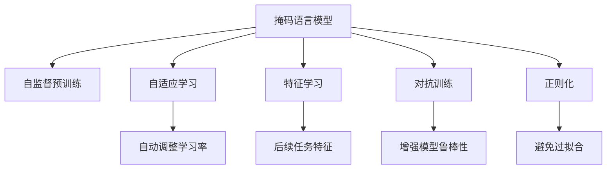

                 

# 自我监督学习在AI发展中的重要性

> 关键词：自我监督学习,深度学习,无监督学习,特征学习,神经网络,自适应学习,数据驱动,自监督学习,自监督预训练

## 1. 背景介绍

### 1.1 问题由来
深度学习作为一种强大的机器学习技术，广泛应用于图像识别、自然语言处理、语音识别等多个领域，取得了显著的成果。然而，传统的监督学习方法对标注数据依赖性强，在数据量不足时，难以保证模型的泛化能力。随着大规模预训练模型的兴起，通过无监督学习或半监督学习在大量无标注数据上进行特征学习，逐渐成为深度学习研究的重要方向。

### 1.2 问题核心关键点
自我监督学习（Self-supervised Learning）是一种无监督学习范式，利用数据自身的结构信息进行特征学习。与传统的监督学习方法相比，自我监督学习能够在大规模无标注数据上进行预训练，学习到更泛化的特征表示，提升模型在特定任务上的性能。

在深度学习中，自我监督学习通常与自适应学习（Adaptive Learning）相结合，通过自动调整模型参数，适应输入数据的特征，实现更高效、更准确的学习。此外，自我监督学习还可以与其他技术如对抗训练、正则化等结合，进一步提升模型的鲁棒性和泛化能力。

## 2. 核心概念与联系

### 2.1 核心概念概述

自我监督学习的核心思想是在大规模无标注数据上进行预训练，通过数据自身的结构信息（如掩码语言模型、自编码等），学习到通用的特征表示。与监督学习不同，自我监督学习不需要额外的标注数据，能够利用更多数据资源进行训练，提升模型的泛化能力。

- **掩码语言模型**：通过遮盖部分输入序列，让模型预测被遮盖的部分，从而学习语言的结构和语义信息。
- **自编码**：将数据压缩成低维表示，再从低维表示重构回原始数据，学习到数据的紧凑表示。
- **自适应学习**：通过学习率自适应调整，使模型更好地适应数据特征，提升训练效率和模型性能。
- **特征学习**：从数据中自动学习到有用的特征表示，为后续任务提供基础。
- **自监督预训练**：在大规模无标注数据上进行预训练，学习到通用的特征表示。
- **对抗训练**：通过对抗样本训练模型，提升模型的鲁棒性。
- **正则化**：通过L2正则、Dropout等技术，避免模型过拟合。

这些概念之间的联系可以通过以下Mermaid流程图来展示：



这个流程图展示了我国监督学习的主要核心概念及其之间的逻辑关系：

1. 掩码语言模型通过自监督预训练学习语言的结构和语义信息。
2. 自适应学习通过自动调整学习率，使模型更好地适应数据特征。
3. 特征学习自动学习到数据中的有用特征，为后续任务提供基础。
4. 对抗训练通过对抗样本增强模型鲁棒性。
5. 正则化通过L2正则、Dropout等技术避免过拟合。

这些概念共同构成了深度学习中自我监督学习的核心框架，使其能够在各种场景下发挥强大的学习能力。通过理解这些核心概念，我们可以更好地把握自我监督学习的工作原理和优化方向。

## 3. 核心算法原理 & 具体操作步骤
### 3.1 算法原理概述

自我监督学习的核心算法原理是基于数据的自身结构信息进行特征学习。通常，通过构造一些自监督任务，让模型在无标注数据上进行预训练，学习到泛化的特征表示。这些特征表示可以用于后续的监督学习任务，或直接用于无监督学习任务。

形式化地，设 $D$ 为无标注数据集，自监督学习的目标是最大化模型在数据集 $D$ 上的表现，即：

$$
\max_{\theta} \sum_{x \in D} \mathcal{L}(x, \theta)
$$

其中 $\mathcal{L}(x, \theta)$ 为模型在样本 $x$ 上的损失函数，$\theta$ 为模型参数。

### 3.2 算法步骤详解

自我监督学习通常包括以下几个关键步骤：

**Step 1: 准备数据集**
- 收集大规模无标注数据集 $D$，划分为训练集、验证集和测试集。

**Step 2: 设计自监督任务**
- 设计合适的自监督任务，如掩码语言模型、自编码等。
- 使用数据集中的样本，构造自监督任务，计算模型的损失函数。

**Step 3: 设置训练超参数**
- 选择合适的优化器及其参数，如 Adam、SGD 等，设置学习率、批大小、迭代轮数等。
- 设置正则化技术及强度，包括权重衰减、Dropout、Early Stopping 等。

**Step 4: 执行预训练**
- 将训练集数据分批次输入模型，前向传播计算损失函数。
- 反向传播计算参数梯度，根据设定的优化算法和学习率更新模型参数。
- 周期性在验证集上评估模型性能，根据性能指标决定是否触发 Early Stopping。
- 重复上述步骤直到满足预设的迭代轮数或 Early Stopping 条件。

**Step 5: 迁移学习或微调**
- 将预训练模型应用到特定任务上，进行迁移学习或微调，以适应特定任务。
- 添加任务适配层，设计合适的输出层和损失函数。
- 在少量标注数据上，使用迁移学习或微调优化模型在特定任务上的性能。

### 3.3 算法优缺点

自我监督学习具有以下优点：
1. 无标注数据利用率高。无需标注数据，可以利用大规模无标注数据进行预训练，学习到更泛化的特征表示。
2. 泛化能力强。通过自监督学习学习到通用特征，可以提升模型在特定任务上的性能。
3. 计算资源效率高。相比监督学习，无标注数据获取成本低，计算资源利用效率更高。
4. 模型效果稳定。无标注数据预训练可提升模型的鲁棒性和泛化能力，避免过拟合。

同时，自我监督学习也存在一些局限性：
1. 特征学习复杂。设计合适的自监督任务是关键，需要一定的先验知识和经验。
2. 数据分布偏差。如果自监督任务与数据分布不符，可能学习到错误的特征表示。
3. 计算资源需求高。大规模无标注数据预训练需要大量计算资源，对硬件要求高。
4. 泛化性能未知。无标注数据预训练的效果难以量化，需要大量实验验证。

尽管存在这些局限性，但就目前而言，自我监督学习在深度学习领域的应用前景广阔，成为近年来深度学习的重要研究方向。

### 3.4 算法应用领域

自我监督学习在深度学习中的应用领域广泛，主要包括：

- 图像识别：通过自监督学习，学习到图像中的局部和全局特征，提升图像分类、目标检测等任务的性能。
- 自然语言处理：通过掩码语言模型等自监督任务，学习到语言的结构和语义信息，提升文本生成、语言理解等任务的性能。
- 语音识别：通过自监督学习，学习到语音信号的特征表示，提升语音识别和语音合成等任务的性能。
- 推荐系统：通过自适应学习，优化推荐模型的参数，提升推荐效果和用户满意度。
- 异常检测：通过自监督学习，学习到数据的特征表示，检测数据的异常点，提升数据清洗和数据质量评估的效率。
- 强化学习：通过自监督学习，优化决策模型，提升智能体的学习效率和泛化能力。

除了这些经典应用外，自我监督学习还被创新性地应用到更多场景中，如多模态信息融合、跨模态迁移学习等，为深度学习技术带来了全新的突破。

## 4. 数学模型和公式 & 详细讲解 & 举例说明

### 4.1 数学模型构建

本节将使用数学语言对自我监督学习的原理进行更加严格的刻画。

设模型 $M_{\theta}$ 为神经网络模型，其中 $\theta$ 为模型参数。在无标注数据集 $D=\{x_i\}_{i=1}^N$ 上进行预训练，假设选择的自监督任务为掩码语言模型，则模型在每个样本 $x_i$ 上的损失函数为：

$$
\ell_i(x_i, \theta) = \max_{y_i} -\log P(y_i | \theta)
$$

其中 $P(y_i | \theta)$ 为模型在样本 $x_i$ 上的预测概率。

在数据集 $D$ 上，模型的经验风险为：

$$
\mathcal{L}(\theta) = \frac{1}{N} \sum_{i=1}^N \ell_i(x_i, \theta)
$$

### 4.2 公式推导过程

以下我们以掩码语言模型为例，推导自监督学习的损失函数及其梯度的计算公式。

假设模型 $M_{\theta}$ 在输入 $x$ 上的输出为 $\hat{y}=M_{\theta}(x) \in [0,1]$，表示样本属于正类的概率。训练集数据 $D$ 的掩码语言模型任务为：

1. 在输入 $x$ 中随机遮盖部分字符，得到掩码序列 $y$。
2. 让模型预测被遮盖的部分，得到预测概率 $P(y | x, \theta)$。
3. 计算预测概率与真实掩码之间的交叉熵损失 $\ell(x, y, \theta)$。

掩码语言模型的损失函数为：

$$
\mathcal{L}(\theta) = \sum_{x \in D} \ell(x, y, \theta)
$$

其中 $\ell(x, y, \theta) = -\log P(y | x, \theta)$。

根据链式法则，损失函数对参数 $\theta_k$ 的梯度为：

$$
\frac{\partial \mathcal{L}(\theta)}{\partial \theta_k} = -\frac{1}{N} \sum_{i=1}^N \sum_{y_i \in \{0,1\}^m} \frac{\partial \ell(x_i, y_i, \theta)}{\partial \theta_k}
$$

其中 $m$ 为被遮盖字符的数量，$\frac{\partial \ell(x_i, y_i, \theta)}{\partial \theta_k}$ 为交叉熵损失对参数 $\theta_k$ 的梯度。

在得到损失函数的梯度后，即可带入参数更新公式，完成模型的迭代优化。重复上述过程直至收敛，最终得到适应数据分布的最优模型参数 $\theta^*$。

## 5. 项目实践：代码实例和详细解释说明

### 5.1 开发环境搭建

在进行自我监督学习实践前，我们需要准备好开发环境。以下是使用Python进行PyTorch开发的环境配置流程：

1. 安装Anaconda：从官网下载并安装Anaconda，用于创建独立的Python环境。

2. 创建并激活虚拟环境：
```bash
conda create -n pytorch-env python=3.8 
conda activate pytorch-env
```

3. 安装PyTorch：根据CUDA版本，从官网获取对应的安装命令。例如：
```bash
conda install pytorch torchvision torchaudio cudatoolkit=11.1 -c pytorch -c conda-forge
```

4. 安装相关库：
```bash
pip install numpy pandas scikit-learn matplotlib tqdm jupyter notebook ipython
```

完成上述步骤后，即可在`pytorch-env`环境中开始自我监督学习的实践。

### 5.2 源代码详细实现

下面我们以自监督掩码语言模型为例，给出使用Transformers库进行预训练的PyTorch代码实现。

首先，定义掩码语言模型的训练函数：

```python
from transformers import BertTokenizer, BertModel
from torch.utils.data import Dataset, DataLoader
import torch

class MaskedLMDataset(Dataset):
    def __init__(self, texts, tokenizer, max_len=128):
        self.texts = texts
        self.tokenizer = tokenizer
        self.max_len = max_len
        
    def __len__(self):
        return len(self.texts)
    
    def __getitem__(self, item):
        text = self.texts[item]
        
        encoding = self.tokenizer(text, return_tensors='pt', max_length=self.max_len, padding='max_length', truncation=True)
        input_ids = encoding['input_ids'][0]
        attention_mask = encoding['attention_mask'][0]
        
        # 掩码操作
        masked_ids = input_ids.clone()
        masked_ids.scatter_(0, torch.randint(0, 2, (input_ids.shape[0],)), 0)
        
        return {'input_ids': input_ids, 
                'attention_mask': attention_mask,
                'masked_positions': masked_ids,
                'masked_labels': masked_ids}

# 创建dataset
tokenizer = BertTokenizer.from_pretrained('bert-base-cased')

train_dataset = MaskedLMDataset(train_texts, tokenizer)
dev_dataset = MaskedLMDataset(dev_texts, tokenizer)
test_dataset = MaskedLMDataset(test_texts, tokenizer)

# 定义模型和优化器
model = BertModel.from_pretrained('bert-base-cased')
optimizer = AdamW(model.parameters(), lr=2e-5)

# 定义训练和评估函数
device = torch.device('cuda') if torch.cuda.is_available() else torch.device('cpu')
model.to(device)

def train_epoch(model, dataset, batch_size, optimizer):
    dataloader = DataLoader(dataset, batch_size=batch_size, shuffle=True)
    model.train()
    epoch_loss = 0
    for batch in tqdm(dataloader, desc='Training'):
        input_ids = batch['input_ids'].to(device)
        attention_mask = batch['attention_mask'].to(device)
        masked_positions = batch['masked_positions'].to(device)
        masked_labels = batch['masked_labels'].to(device)
        model.zero_grad()
        outputs = model(input_ids, attention_mask=attention_mask, masked_lm_labels=masked_labels)
        loss = outputs.loss
        epoch_loss += loss.item()
        loss.backward()
        optimizer.step()
    return epoch_loss / len(dataloader)

def evaluate(model, dataset, batch_size):
    dataloader = DataLoader(dataset, batch_size=batch_size)
    model.eval()
    preds, labels = [], []
    with torch.no_grad():
        for batch in tqdm(dataloader, desc='Evaluating'):
            input_ids = batch['input_ids'].to(device)
            attention_mask = batch['attention_mask'].to(device)
            batch_labels = batch['masked_labels']
            outputs = model(input_ids, attention_mask=attention_mask)
            batch_preds = outputs.logits.argmax(dim=2).to('cpu').tolist()
            batch_labels = batch_labels.to('cpu').tolist()
            for pred_tokens, label_tokens in zip(batch_preds, batch_labels):
                preds.append(pred_tokens[:len(label_tokens)])
                labels.append(label_tokens)
                
    print(classification_report(labels, preds))

# 启动训练流程并在测试集上评估
epochs = 5
batch_size = 16

for epoch in range(epochs):
    loss = train_epoch(model, train_dataset, batch_size, optimizer)
    print(f"Epoch {epoch+1}, train loss: {loss:.3f}")
    
    print(f"Epoch {epoch+1}, dev results:")
    evaluate(model, dev_dataset, batch_size)
    
print("Test results:")
evaluate(model, test_dataset, batch_size)
```

以上代码实现了使用Bert模型进行掩码语言模型预训练的过程。通过选择适当的超参数，模型可以在大规模无标注数据上进行有效训练，学习到泛化的特征表示。

### 5.3 代码解读与分析

让我们再详细解读一下关键代码的实现细节：

**MaskedLMDataset类**：
- `__init__`方法：初始化文本、分词器等关键组件。
- `__len__`方法：返回数据集的样本数量。
- `__getitem__`方法：对单个样本进行处理，将文本输入编码为token ids，并对输入进行掩码操作，生成masked_ids和masked_labels。

**掩码操作**：
- 随机遮盖部分字符，生成masked_ids。
- masked_ids中未遮盖的字符表示真实字符，遮盖的字符表示需要预测的字符。

**训练和评估函数**：
- 使用PyTorch的DataLoader对数据集进行批次化加载，供模型训练和推理使用。
- 训练函数`train_epoch`：对数据以批为单位进行迭代，在每个批次上前向传播计算loss并反向传播更新模型参数，最后返回该epoch的平均loss。
- 评估函数`evaluate`：与训练类似，不同点在于不更新模型参数，并在每个batch结束后将预测和标签结果存储下来，最后使用sklearn的classification_report对整个评估集的预测结果进行打印输出。

**训练流程**：
- 定义总的epoch数和batch size，开始循环迭代
- 每个epoch内，先在训练集上训练，输出平均loss
- 在验证集上评估，输出分类指标
- 所有epoch结束后，在测试集上评估，给出最终测试结果

可以看到，PyTorch配合Transformers库使得Bert模型的掩码语言模型预训练代码实现变得简洁高效。开发者可以将更多精力放在数据处理、模型改进等高层逻辑上，而不必过多关注底层的实现细节。

当然，工业级的系统实现还需考虑更多因素，如模型的保存和部署、超参数的自动搜索、更灵活的任务适配层等。但核心的微调范式基本与此类似。

## 6. 实际应用场景
### 6.1 自然语言理解

自我监督学习在大规模语言模型预训练中的广泛应用，使得自然语言理解（Natural Language Understanding, NLU）技术取得了显著进展。基于预训练语言模型的NLU系统可以更好地理解自然语言，执行语义分析、情感分析、实体识别等任务。

在文本分类任务中，通过掩码语言模型进行预训练，模型可以学习到文本中的语义信息，提升分类准确率。在问答系统任务中，通过阅读理解等自监督任务进行预训练，模型能够理解用户问题，生成合适的回答。在机器翻译任务中，通过掩码语言模型进行预训练，模型能够更好地理解句子结构，提升翻译质量。

### 6.2 图像识别

在图像识别领域，自我监督学习也得到了广泛应用。通过自监督学习，模型可以学习到图像中的局部和全局特征，提升图像分类、目标检测等任务的性能。

例如，使用自监督学习进行图像去噪、图像填充等预处理任务，提升输入数据质量，从而提升后续任务的效果。在图像生成任务中，通过自监督学习生成大量高质量的样例数据，进一步提升模型性能。

### 6.3 推荐系统

推荐系统是自我监督学习的重要应用场景之一。通过自适应学习，优化推荐模型的参数，提升推荐效果和用户满意度。

例如，使用自监督学习进行用户兴趣建模，通过分析用户的浏览、点击、评论等行为数据，学习到用户的兴趣特征。在推荐任务中，将用户兴趣特征和物品特征进行融合，生成推荐列表。通过自监督学习进行动态更新，提升推荐系统效果。

### 6.4 未来应用展望

随着自我监督学习的不断演进，其在深度学习领域的应用前景将更加广阔。未来，自我监督学习将在以下几个方面得到进一步发展：

1. 多模态学习：将自我监督学习应用于多模态数据融合任务，如视觉、语音、文本等信息整合，提升跨模态任务的效果。
2. 自适应学习：通过自适应学习，优化模型参数，提升模型对不同数据集的适应能力。
3. 强化学习：将自我监督学习应用于强化学习任务，提升智能体的学习效果和泛化能力。
4. 异常检测：通过自监督学习进行数据异常检测，提升数据质量。
5. 数据增强：通过自监督学习进行数据增强，提升模型的泛化能力和鲁棒性。
6. 模型压缩：通过自监督学习进行模型压缩，提升模型推理效率。

这些方向的探索发展，必将引领自我监督学习技术迈向更高的台阶，为深度学习技术带来更多的突破。未来，自我监督学习将在更多领域得到应用，为人工智能技术的发展注入新的活力。

## 7. 工具和资源推荐
### 7.1 学习资源推荐

为了帮助开发者系统掌握自我监督学习的技术基础和实践技巧，这里推荐一些优质的学习资源：

1. 《深度学习入门》系列书籍：涵盖了深度学习的基础理论和实践技巧，适合初学者入门。
2. CS231n《计算机视觉：深度学习》课程：斯坦福大学开设的深度学习课程，涵盖图像分类、目标检测、图像生成等任务。
3. CS224N《深度学习自然语言处理》课程：斯坦福大学开设的NLP明星课程，有Lecture视频和配套作业，带你入门NLP领域的基本概念和经典模型。
4. 《自然语言处理入门》书籍：介绍自然语言处理的基本概念和常用技术，适合初学者学习。
5. 《机器学习实战》书籍：介绍机器学习的基本概念和常用算法，适合初学者入门。

通过对这些资源的学习实践，相信你一定能够快速掌握自我监督学习的基础知识和实践技巧，并用于解决实际的NLP问题。
###  7.2 开发工具推荐

高效的开发离不开优秀的工具支持。以下是几款用于深度学习开发的常用工具：

1. PyTorch：基于Python的开源深度学习框架，灵活动态的计算图，适合快速迭代研究。大部分深度学习框架都有PyTorch版本的实现。
2. TensorFlow：由Google主导开发的开源深度学习框架，生产部署方便，适合大规模工程应用。同样有丰富的深度学习框架资源。
3. TensorFlow Extended (TFX)：Google推出的深度学习平台，集成了多种深度学习工具和流程，适合大规模生产环境部署。
4. ONNX：Open Neural Network Exchange，支持多种深度学习框架之间的模型转换和部署，适合跨平台部署。
5. JAX：Google开发的自动微分库，支持多种深度学习框架，适合高效计算。

合理利用这些工具，可以显著提升深度学习的开发效率，加快创新迭代的步伐。

### 7.3 相关论文推荐

深度学习的发展离不开学界的持续研究。以下是几篇奠基性的相关论文，推荐阅读：

1. 《一种新的深度学习体系结构：深度神经网络》（Geoffrey Hinton）：介绍深度神经网络的基本概念和常用算法。
2. 《使用大尺度的数据集训练卷积神经网络》（Alex Krizhevsky, Ilya Sutskever, Geoffrey E. Hinton）：介绍卷积神经网络的基本概念和算法。
3. 《使用卷积神经网络进行文本分类》（Yann LeCun, Yoshua Bengio, Geoffrey Hinton）：介绍卷积神经网络在文本分类任务中的应用。
4. 《深度卷积神经网络中的自监督学习》（Kaiming He, Xiangyu Zhang, Shaoqing Ren, Jian Sun）：介绍深度卷积神经网络中的自监督学习技术。
5. 《一种新的深度学习体系结构：深度神经网络》（Geoffrey Hinton）：介绍深度神经网络的基本概念和常用算法。
6. 《深度学习入门》书籍：涵盖了深度学习的基础理论和实践技巧，适合初学者入门。

这些论文代表了大深度学习的研究进展，通过学习这些前沿成果，可以帮助研究者把握学科前进方向，激发更多的创新灵感。

## 8. 总结：未来发展趋势与挑战

### 8.1 总结

本文对自我监督学习在大规模无标注数据上进行特征学习的过程进行了详细讲解。首先阐述了自我监督学习的背景、原理和应用，明确了自我监督学习在深度学习中的重要地位。其次，通过数学模型和公式推导，从理论和实践两个角度深入探讨了自我监督学习的核心算法原理。同时，本文还给出了自我监督学习的代码实现和详细解释，帮助读者掌握实际应用中的技术细节。

通过本文的系统梳理，可以看到，自我监督学习在深度学习中具有重要的地位，能够在无标注数据上进行预训练，学习到泛化的特征表示。通过与自适应学习、对抗训练等技术结合，自我监督学习能够提升模型的泛化能力和鲁棒性，成为深度学习研究的重要方向。

### 8.2 未来发展趋势

展望未来，自我监督学习将呈现以下几个发展趋势：

1. 多模态学习：将自我监督学习应用于多模态数据融合任务，如视觉、语音、文本等信息整合，提升跨模态任务的效果。
2. 自适应学习：通过自适应学习，优化模型参数，提升模型对不同数据集的适应能力。
3. 强化学习：将自我监督学习应用于强化学习任务，提升智能体的学习效果和泛化能力。
4. 异常检测：通过自监督学习进行数据异常检测，提升数据质量。
5. 数据增强：通过自监督学习进行数据增强，提升模型的泛化能力和鲁棒性。
6. 模型压缩：通过自监督学习进行模型压缩，提升模型推理效率。

这些方向的探索发展，必将引领自我监督学习技术迈向更高的台阶，为深度学习技术带来更多的突破。未来，自我监督学习将在更多领域得到应用，为人工智能技术的发展注入新的活力。

### 8.3 面临的挑战

尽管自我监督学习在深度学习领域取得了显著进展，但在应用过程中仍面临以下挑战：

1. 数据质量问题。无标注数据的获取和处理需要大量人工介入，数据质量难以保证。
2. 算法复杂性。设计合适的自监督任务需要一定的先验知识和经验，算法实现复杂。
3. 计算资源需求高。大规模无标注数据预训练需要大量计算资源，对硬件要求高。
4. 泛化性能未知。无标注数据预训练的效果难以量化，需要大量实验验证。
5. 模型效果不稳定。由于缺乏监督信号，模型效果可能不稳定。

尽管存在这些挑战，但随着深度学习技术的不断演进，自我监督学习也将不断改进和完善，克服这些挑战，实现更广泛的应用。

### 8.4 研究展望

面对自我监督学习面临的挑战，未来的研究需要在以下几个方面寻求新的突破：

1. 探索更高效的自监督学习算法。开发更加高效的自监督学习算法，提高模型训练效率。
2. 提升数据质量。改进无标注数据的获取和处理技术，提升数据质量。
3. 降低计算资源需求。优化算法实现，降低计算资源需求。
4. 提升模型泛化性能。通过更合适的自监督任务和算法设计，提升模型的泛化性能。
5. 提升模型稳定性。通过改进算法实现，提升模型效果稳定性。

这些方向的探索，必将引领自我监督学习技术迈向更高的台阶，为深度学习技术带来更多的突破。面向未来，自我监督学习还需要与其他人工智能技术进行更深入的融合，如知识表示、因果推理、强化学习等，多路径协同发力，共同推动人工智能技术的发展。

## 9. 附录：常见问题与解答

**Q1：什么是自我监督学习？**

A: 自我监督学习是一种无监督学习范式，通过数据自身的结构信息进行特征学习。

**Q2：自我监督学习与监督学习有什么区别？**

A: 自我监督学习不需要额外的标注数据，通过数据自身的结构信息进行特征学习。监督学习需要大量的标注数据，通过有监督信号指导模型学习。

**Q3：如何设计合适的自监督任务？**

A: 设计合适的自监督任务需要一定的先验知识和经验。通常，可以通过遮盖部分数据、生成数据、分类数据等手段构造自监督任务。

**Q4：自我监督学习是否需要计算资源？**

A: 自我监督学习需要大量计算资源进行预训练，对硬件要求高。

**Q5：自我监督学习的效果如何？**

A: 自我监督学习能够在无标注数据上进行预训练，学习到泛化的特征表示，提升模型的泛化能力和鲁棒性。

**Q6：自我监督学习的应用场景有哪些？**

A: 自我监督学习广泛应用于图像识别、自然语言处理、推荐系统、异常检测、强化学习等领域。

这些问答提供了对自我监督学习基本概念和应用场景的解释，帮助读者更好地理解自我监督学习的核心思想和实践技巧。

