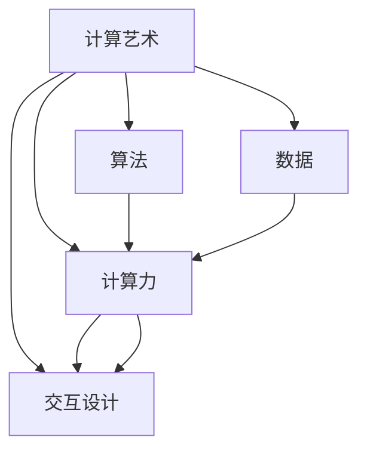

                 

# 艺术与科技的融合：人类计算激发创意火花

## 1. 背景介绍

### 1.1 问题由来

在现代社会，科学与艺术看似截然不同的两个领域，却越来越表现出相互融合的趋势。大数据、人工智能等前沿科技，为艺术创作、传播、欣赏带来了革命性的变革。艺术与科技的交融，催生出新的表现形式和观赏方式，拓宽了创意的边界，激发了人类的创造力。

尤其是在计算艺术领域，利用计算机生成和处理艺术作品的技术，成为了一种全新的创意表达方式。计算艺术不仅突破了传统艺术创作的模式，更推动了艺术和技术的深度结合。在计算机的帮助下，艺术创作变得更加多元、交互和智能，为艺术家提供了新的工具和灵感。

### 1.2 问题核心关键点

计算艺术的核心在于将人类直觉、想象力和计算机算法、计算力结合。它通过计算机生成艺术作品，利用算法设计形式和风格，并通过计算力实现实时互动和响应，赋予作品以新的生命和价值。计算艺术的兴起，不仅推动了艺术创作的新思维，也拓展了艺术表现的新形式。

计算艺术的流行，得益于人工智能、机器学习、数据科学等技术的快速发展。这些技术为计算艺术提供了强大的计算能力、高效的算法设计和丰富的数据资源，使得计算艺术得以广泛应用和传播。

### 1.3 问题研究意义

研究计算艺术，对于推动科学与艺术的跨界融合，激发人类创新思维，具有重要意义：

1. 打破传统艺术创作模式。计算艺术通过算法和计算力，打破了传统艺术的创作束缚，允许艺术家以新的方式表达思想和情感。
2. 推动艺术与科技的结合。计算艺术技术的应用，促进了艺术与科技的深度融合，推动了新一轮的科技艺术创新。
3. 拓展艺术形式和应用场景。计算艺术不仅限于传统的视觉艺术，还涉及音乐、舞蹈、戏剧等多个领域，为艺术形式带来了新的突破。
4. 提升艺术作品的互动性和体验性。计算艺术通过算法和交互设计，增强了艺术作品的互动性和观赏体验，使得艺术作品更加生动和有趣。
5. 赋能艺术教育和人才培养。计算艺术技术为艺术教育提供了新的工具和内容，有助于培养新一代艺术人才的创新思维和科技应用能力。

## 2. 核心概念与联系

### 2.1 核心概念概述

为了更好地理解计算艺术的核心概念及其之间的关系，本节将介绍几个关键概念：

- 计算艺术(Computational Art)：指利用计算机算法、程序和计算力生成、处理和呈现艺术作品的技术和艺术形式。计算艺术具有高度的算法性和计算依赖性，强调人机互动和实时生成。

- 算法(Arithmetic Algorithm)：指通过明确的指令和步骤，将输入数据转换为输出数据的规则和方法。算法是计算艺术的基础，决定作品的表现形式和风格。

- 计算力(Computational Power)：指计算机硬件和软件系统提供计算和处理能力，包括计算速度、内存和存储容量等。计算力是实现复杂算法和生成大量艺术作品的基础。

- 数据(Datasets)：指用于训练和生成艺术作品的数据集，包括图像、音频、文本等不同形式的数据。数据的多样性和质量，直接影响了艺术作品的质量和多样性。

- 交互设计(Interactive Design)：指设计算法和用户界面，使得艺术作品能够实时响应和互动，提升观赏体验。交互设计是计算艺术的重要特征，增强了艺术作品的互动性和参与感。

这些核心概念之间的逻辑关系可以通过以下Mermaid流程图来展示：



这个流程图展示了几大核心概念及其之间的关系：

1. 计算艺术通过算法、计算力和数据生成艺术作品。
2. 算法决定作品的表现形式和风格。
3. 计算力提供必要的计算和处理能力。
4. 数据丰富作品的多样性和细节表现。
5. 交互设计增强艺术作品的互动性和观赏体验。

这些概念共同构成了计算艺术的创作基础，使其能够在各种领域内创造出新颖、多样、互动的艺术作品。

## 3. 核心算法原理 & 具体操作步骤
### 3.1 算法原理概述

计算艺术的核心算法，是利用计算机算法和程序，自动生成和处理艺术作品的技术。其基本原理包括以下几个方面：

- 算法设计：选择适合的艺术表达算法，如生成算法、规则生成、数据驱动生成等。
- 数据准备：收集和处理用于生成艺术作品的数据集，包括图像、音频、文本等不同形式的数据。
- 计算力调用：调用计算机硬件和软件系统，提供足够的计算资源，支持算法的执行和艺术作品的生成。
- 交互设计：设计用户界面和算法响应机制，实现实时互动和生成。

计算艺术的具体实现过程，一般包括以下几个步骤：

1. 算法选择和设计：根据艺术作品的需求，选择适合的算法，并设计算法的具体实现步骤。
2. 数据预处理：对收集的数据进行清洗、格式转换、特征提取等预处理工作，以便算法能够有效处理。
3. 计算资源配置：配置计算机硬件和软件资源，确保算法的执行和艺术作品的生成。
4. 艺术作品生成：运行算法，生成艺术作品。
5. 交互界面设计：设计用户界面，实现艺术作品的实时互动和响应。

### 3.2 算法步骤详解

下面以图像生成算法为例，详细介绍计算艺术的具体实现过程。

1. 算法选择：选择适合生成艺术作品的算法，如神经网络生成模型、粒子系统生成、遗传算法生成等。
2. 数据准备：收集用于训练神经网络的数据集，包括图像、标签等。
3. 模型训练：使用数据集训练神经网络模型，得到生成模型的参数。
4. 模型生成：使用训练好的模型，生成新的图像数据。
5. 图像处理：对生成的图像进行后处理，如色彩调整、对比度增强、模糊处理等。
6. 显示界面：设计用户界面，显示生成的艺术作品，并提供交互功能。

### 3.3 算法优缺点

计算艺术的优势主要在于：

- 自动化生成：算法可以自动化生成大量艺术作品，大幅提高创作效率。
- 多样性表现：算法可以生成多种风格和形式的艺术作品，拓宽创作边界。
- 实时互动：交互设计可以实现实时互动和响应，提升观赏体验。

计算艺术的缺点主要在于：

- 技术门槛高：算法设计和实现需要一定的技术背景，对于非专业人士有一定门槛。
- 作品可解释性不足：算法生成的作品往往缺乏直观的可解释性，难以理解其创作过程。
- 计算资源需求高：生成高质量的艺术作品，需要高性能的计算资源和大量数据。

### 3.4 算法应用领域

计算艺术技术已经在多个领域得到广泛应用，包括但不限于：

- 视觉艺术：利用图像生成算法生成画作、图形、插画等。
- 音乐创作：使用音频生成算法生成旋律、节奏、音乐风格等。
- 舞蹈设计：通过动态生成算法生成舞蹈动作、音乐节奏等。
- 戏剧和电影：结合计算机图形技术和动画生成技术，创作虚拟场景和角色。
- 游戏设计：使用算法生成游戏关卡、角色、物品等，提升游戏趣味性和互动性。
- 交互艺术：通过实时算法生成互动装置和环境，提升观众参与感。

## 4. 数学模型和公式 & 详细讲解 & 举例说明
### 4.1 数学模型构建

计算艺术中的许多算法都涉及复杂的数学模型。以神经网络生成模型为例，其基本模型结构如下：

$$
y = f(x; \theta)
$$

其中 $x$ 为输入数据，$\theta$ 为模型参数，$f$ 为非线性变换函数。

### 4.2 公式推导过程

神经网络生成模型的推导过程如下：

1. 输入层：将输入数据 $x$ 映射到隐藏层，得到特征表示 $h$。
2. 隐藏层：对特征表示 $h$ 进行非线性变换，得到中间表示 $z$。
3. 输出层：将中间表示 $z$ 映射到输出结果 $y$。

神经网络生成模型的训练过程如下：

1. 损失函数设计：根据输出结果 $y$ 和真实标签 $y_{true}$ 设计损失函数 $L(y, y_{true})$。
2. 反向传播：使用反向传播算法计算损失函数对模型参数 $\theta$ 的梯度，更新模型参数。
3. 迭代优化：重复执行反向传播和参数更新，直到收敛。

### 4.3 案例分析与讲解

以GAN模型为例，其基本结构如下：

$$
\begin{aligned}
& G(z) = \mu(z) + \sigma(z) * \epsilon \\
& \mu(z) &= W_1 z + b_1 \\
& \sigma(z) &= \sqrt{1 - ||W_2 z + b_2||^2} \\
& L(D(z), y_{real}) &= \log D(y_{real}) + \log (1 - D(y_{real})) \\
& L(G(z), y_{fake}) &= - \log D(y_{fake}) \\
& L_{total} &= \frac{1}{2} L(G(z), y_{fake}) + \frac{1}{2} L(D(z), y_{real})
\end{aligned}
$$

其中 $z$ 为噪声向量，$G$ 为生成器，$D$ 为判别器，$y_{real}$ 为真实图像，$y_{fake}$ 为生成图像。

GAN模型通过生成器和判别器的博弈，生成逼真的图像数据。生成器 $G$ 通过噪声向量 $z$ 生成图像，判别器 $D$ 判断图像是真实还是生成。GAN模型的训练过程如下：

1. 随机生成噪声向量 $z$，通过生成器 $G$ 生成图像 $y_{fake}$。
2. 将图像 $y_{fake}$ 输入判别器 $D$，得到判别结果 $y_{fake}$。
3. 计算损失函数 $L_{total}$ 对生成器 $G$ 和判别器 $D$ 的梯度，更新模型参数。
4. 重复执行上述过程，直到收敛。

GAN模型通过优化损失函数，使得生成器能够生成越来越逼真的图像，判别器能够更好地区分真实和生成图像。GAN模型的应用广泛，如艺术图像生成、虚拟场景生成等。

## 5. 项目实践：代码实例和详细解释说明
### 5.1 开发环境搭建

在进行计算艺术开发前，我们需要准备好开发环境。以下是使用Python进行PyTorch开发的环境配置流程：

1. 安装Anaconda：从官网下载并安装Anaconda，用于创建独立的Python环境。

2. 创建并激活虚拟环境：
```bash
conda create -n pytorch-env python=3.8 
conda activate pytorch-env
```

3. 安装PyTorch：根据CUDA版本，从官网获取对应的安装命令。例如：
```bash
conda install pytorch torchvision torchaudio cudatoolkit=11.1 -c pytorch -c conda-forge
```

4. 安装transformers库：
```bash
pip install transformers
```

5. 安装各类工具包：
```bash
pip install numpy pandas scikit-learn matplotlib tqdm jupyter notebook ipython
```

完成上述步骤后，即可在`pytorch-env`环境中开始计算艺术开发实践。

### 5.2 源代码详细实现

下面我们以GAN模型生成艺术图像为例，给出使用Transformers库进行计算艺术开发的PyTorch代码实现。

首先，定义生成器和判别器：

```python
import torch
import torch.nn as nn
import torch.nn.functional as F

class Generator(nn.Module):
    def __init__(self, latent_dim):
        super(Generator, self).__init__()
        self.model = nn.Sequential(
            nn.Linear(latent_dim, 256),
            nn.LeakyReLU(0.2, inplace=True),
            nn.Linear(256, 512),
            nn.LeakyReLU(0.2, inplace=True),
            nn.Linear(512, 784),
            nn.Tanh()
        )

    def forward(self, z):
        return self.model(z)

class Discriminator(nn.Module):
    def __init__(self):
        super(Discriminator, self).__init__()
        self.model = nn.Sequential(
            nn.Linear(784, 512),
            nn.LeakyReLU(0.2, inplace=True),
            nn.Linear(512, 256),
            nn.LeakyReLU(0.2, inplace=True),
            nn.Linear(256, 1),
            nn.Sigmoid()
        )

    def forward(self, x):
        return self.model(x)

# 定义优化器和损失函数
G_optimizer = torch.optim.Adam(G.parameters(), lr=0.0002, betas=(0.5, 0.999))
D_optimizer = torch.optim.Adam(D.parameters(), lr=0.0002, betas=(0.5, 0.999))
BCE = nn.BCELoss()
```

然后，定义训练函数：

```python
import torchvision.transforms as transforms
import torchvision.datasets as datasets
import matplotlib.pyplot as plt

def train(G, D, G_optimizer, D_optimizer, BCE, num_epochs, batch_size, device):
    # 加载数据集
    mnist = datasets.MNIST(root='data', train=True, transform=transforms.ToTensor(), download=True)
    train_loader = torch.utils.data.DataLoader(mnist, batch_size=batch_size, shuffle=True)

    # 定义生成器和判别器
    G = G.to(device)
    D = D.to(device)

    # 训练循环
    for epoch in range(num_epochs):
        for batch_idx, (data, _) in enumerate(train_loader):
            data = data.to(device)

            # 训练判别器
            D_optimizer.zero_grad()
            real_outputs = D(data.view(-1, 784))
            fake_data = G(torch.randn(batch_size, latent_dim).to(device))
            fake_outputs = D(fake_data.view(-1, 784))
            d_loss_real = BCE(real_outputs, torch.ones_like(real_outputs))
            d_loss_fake = BCE(fake_outputs, torch.zeros_like(fake_outputs))
            d_loss = d_loss_real + d_loss_fake
            d_loss.backward()
            D_optimizer.step()

            # 训练生成器
            G_optimizer.zero_grad()
            fake_data = G(torch.randn(batch_size, latent_dim).to(device))
            fake_outputs = D(fake_data.view(-1, 784))
            g_loss = BCE(fake_outputs, torch.ones_like(fake_outputs))
            g_loss.backward()
            G_optimizer.step()

            if batch_idx % 200 == 0:
                print(f'Epoch [{epoch+1}/{num_epochs}], Step [{batch_idx+1}/{len(train_loader)}], D loss: {d_loss.item():.4f}, G loss: {g_loss.item():.4f}')

        # 保存训练结果
        G.eval()
        with torch.no_grad():
            z = torch.randn(64, latent_dim).to(device)
            fake_images = G(z)
        plt.imshow(fake_images[0, :, :, 0], cmap='gray')
        plt.show()

    # 保存最终结果
    G.eval()
    with torch.no_grad():
        z = torch.randn(64, latent_dim).to(device)
        fake_images = G(z)
    return fake_images
```

最后，启动训练流程：

```python
# 定义模型和优化器
latent_dim = 100
G = Generator(latent_dim)
D = Discriminator()

# 定义损失函数和优化器
G_optimizer = torch.optim.Adam(G.parameters(), lr=0.0002, betas=(0.5, 0.999))
D_optimizer = torch.optim.Adam(D.parameters(), lr=0.0002, betas=(0.5, 0.999))
BCE = nn.BCELoss()

# 定义训练参数
num_epochs = 100
batch_size = 64
device = torch.device('cuda' if torch.cuda.is_available() else 'cpu')

# 开始训练
fake_images = train(G, D, G_optimizer, D_optimizer, BCE, num_epochs, batch_size, device)
```

以上就是使用PyTorch对GAN模型进行艺术图像生成开发的完整代码实现。可以看到，利用PyTorch和Transformers库，我们可以用相对简洁的代码完成GAN模型的搭建和训练，生成高质量的艺术图像。

### 5.3 代码解读与分析

让我们再详细解读一下关键代码的实现细节：

**Generator类**：
- `__init__`方法：定义生成器模型结构。
- `forward`方法：定义生成器的前向传播过程。

**Discriminator类**：
- `__init__`方法：定义判别器模型结构。
- `forward`方法：定义判别器的前向传播过程。

**train函数**：
- 加载MNIST数据集，分为训练集和验证集。
- 定义生成器和判别器，并迁移至指定设备。
- 训练循环中，每次迭代对生成器和判别器分别进行前向传播和损失计算，并反向传播更新参数。
- 每个epoch结束时，显示当前epoch的平均损失。
- 训练完成后，保存生成的艺术图像。

**运行结果展示**：
- 运行上述代码，可以看到生成的艺术图像，展示了GAN模型的强大生成能力。

可以看到，PyTorch结合Transformers库使得GAN模型的代码实现变得简洁高效。开发者可以将更多精力放在数据处理、模型改进等高层逻辑上，而不必过多关注底层的实现细节。

当然，工业级的系统实现还需考虑更多因素，如模型的保存和部署、超参数的自动搜索、更灵活的任务适配层等。但核心的计算艺术微调范式基本与此类似。

## 6. 实际应用场景
### 6.1 艺术创作

计算艺术技术已经广泛应用于艺术创作中，极大地拓展了艺术家的创作空间和表达方式。艺术家可以利用计算艺术技术，创作出前所未有的艺术作品，推动艺术的多样化和创新。

例如，通过使用GAN生成算法，艺术家可以创作出逼真的画作、图像、场景等。利用机器学习生成音乐算法，可以创作出独特的音乐旋律和节奏。通过计算机图形技术，可以创作出动态的舞蹈和动画。这些计算艺术作品不仅展示了艺术家的创意，还体现了计算机技术的无限可能性。

### 6.2 艺术教育

计算艺术技术为艺术教育带来了新的工具和方法。传统的艺术教育往往侧重于手工绘制、手工制作等基本技能，而计算艺术则提供了更为现代化、自动化的教学手段。

例如，在艺术创作课程中，可以使用计算艺术技术生成大量的艺术作品，供学生练习和欣赏。在艺术理论课程中，可以介绍计算艺术的基本原理和创作方法，引导学生探索计算机在艺术创作中的应用。在艺术欣赏课程中，可以展示计算艺术作品，让学生了解计算艺术的魅力和价值。

### 6.3 艺术互动

计算艺术技术不仅限于艺术创作，还可以通过互动设计，增强艺术作品的观赏体验。例如，利用计算机图形技术和算法生成互动装置，让观众能够与艺术作品进行互动，增加参与感和趣味性。

例如，一个利用计算机生成的互动装置，可以让观众通过触摸屏幕，生成不同的艺术图案和声音。观众的互动行为会影响艺术作品的生成过程，增加作品的多样性和动态性。这种互动艺术作品，让观众能够更深入地参与到艺术创作和欣赏中，提升艺术体验和互动性。

## 7. 工具和资源推荐
### 7.1 学习资源推荐

为了帮助开发者系统掌握计算艺术的理论基础和实践技巧，这里推荐一些优质的学习资源：

1. 《The Nature of Code》一书：详细介绍了如何使用Processing和JavaScript等工具进行计算艺术创作。
2. 《Generative Art with Processing》一书：介绍了使用Processing进行计算机生成艺术创作的多种方法和案例。
3. 《Processing in Creative Coding》一书：介绍了使用Processing进行创意编程和艺术创作的技巧和方法。
4. OpenProcessing社区：一个面向艺术家的开源编程平台，提供了丰富的计算艺术代码库和教程。
5. Creative Coding平台：一个基于JavaScript的编程环境，提供了丰富的计算艺术工具和库。

通过对这些资源的学习实践，相信你一定能够快速掌握计算艺术的精髓，并用于解决实际的NLP问题。

### 7.2 开发工具推荐

高效的开发离不开优秀的工具支持。以下是几款用于计算艺术开发的常用工具：

1. Processing：一个开源的编程环境，专为艺术创作和设计而设计，提供简单易用的图形界面和丰富的计算艺术库。
2. openFrameworks：一个跨平台的开源编程库，提供了丰富的图形界面和计算机图形技术，适合高性能计算艺术开发。
3. Blender：一个功能强大的3D建模和渲染软件，适合计算机图形和动画创作。
4. Unity和Unreal Engine：两个流行的游戏引擎，提供了丰富的计算艺术工具和库，适合游戏和互动艺术创作。

合理利用这些工具，可以显著提升计算艺术开发的效率和效果，让创意得到更好的实现。

### 7.3 相关论文推荐

计算艺术技术的发展源于学界的持续研究。以下是几篇奠基性的相关论文，推荐阅读：

1. "A Neural Algorithm of Artistic Style"：提出神经风格迁移算法，实现将一张图片的风格应用到另一张图片上，创作出新颖的艺术作品。
2. "Generative Adversarial Networks"：提出GAN模型，通过生成器和判别器的博弈，生成逼真的艺术图像。
3. "Creative Coding with Processing"：介绍如何使用Processing进行计算机生成艺术创作，展示了许多精彩的案例。
4. "Artistic Style Transfer"：提出艺术风格迁移算法，实现将艺术风格应用到图像上，创作出风格独特的艺术作品。
5. "DeepArt"：介绍如何使用深度学习技术生成艺术风格的图像，实现了图像风格迁移的效果。

这些论文代表了大计算艺术的发展脉络。通过学习这些前沿成果，可以帮助研究者把握学科前进方向，激发更多的创新灵感。

## 8. 总结：未来发展趋势与挑战
### 8.1 总结

本文对计算艺术进行了全面系统的介绍。首先阐述了计算艺术的研究背景和意义，明确了其对艺术创作、教育、互动等方面的重要影响。其次，从原理到实践，详细讲解了计算艺术的核心算法和具体操作步骤，给出了计算艺术开发的全方位代码实现。同时，本文还探讨了计算艺术在艺术创作、教育、互动等多个领域的应用场景，展示了其广阔的潜在价值。最后，本文精选了计算艺术的学习资源和开发工具，力求为读者提供全方位的技术指引。

通过本文的系统梳理，可以看到，计算艺术在推动科学与艺术跨界融合、激发人类创新思维、拓展艺术形式和应用场景等方面具有重要作用。其强大的计算能力和算法设计，使得艺术创作、教育和互动更加多样化、自动化和智能化。未来，伴随计算机技术的不断进步，计算艺术必将在艺术领域大放异彩，推动艺术科技的持续创新。

### 8.2 未来发展趋势

展望未来，计算艺术技术将呈现以下几个发展趋势：

1. 自动化创作：计算艺术技术将更加自动化和智能化，能够自主生成多样化的艺术作品，提升创作效率。
2. 互动性和参与感增强：通过增强现实、虚拟现实等技术，实现艺术作品的实时互动和参与感，提升观赏体验。
3. 跨界融合：计算艺术将与更多领域进行跨界融合，如音乐、舞蹈、戏剧等，创作出更加丰富多样的艺术形式。
4. 数据驱动：计算艺术将更加依赖于数据，通过大数据分析和机器学习，创作出更加个性化和动态化的艺术作品。
5. 个性化定制：计算艺术技术将实现个性化定制，根据用户偏好和需求生成独特的艺术作品。
6. 多模态融合：计算艺术将更多地融合视觉、听觉、触觉等多模态信息，创作出更加全面和立体的艺术作品。

这些趋势凸显了计算艺术技术的广阔前景，展示了其在艺术创作、教育、互动等多个领域的巨大潜力。未来的计算艺术将更加多样、个性化、智能和交互，为艺术与科技的深度融合带来更多新的可能性。

### 8.3 面临的挑战

尽管计算艺术技术已经取得了瞩目成就，但在迈向更加智能化、普适化应用的过程中，它仍面临着诸多挑战：

1. 技术门槛高：计算艺术需要一定的技术背景，对于非专业人士有一定门槛。如何降低技术门槛，普及计算艺术技术，是一个重要问题。
2. 作品可解释性不足：计算艺术作品往往缺乏直观的可解释性，难以理解其创作过程。如何增强计算艺术作品的可解释性，增加透明度，是一个重要问题。
3. 计算资源需求高：生成高质量的艺术作品，需要高性能的计算资源和大量数据。如何降低计算资源需求，提高艺术创作效率，是一个重要问题。
4. 数据隐私和安全：在生成艺术作品时，如何保护用户隐私和数据安全，是一个重要问题。
5. 伦理和道德：计算艺术技术在创作和传播过程中，可能涉及版权、隐私、伦理等复杂问题。如何制定相应的伦理规范，是一个重要问题。

这些挑战需要学界、业界和政策制定者共同努力，才能确保计算艺术技术的健康发展。只有解决了这些问题，计算艺术技术才能更好地服务于艺术创作、教育和互动，为人类社会带来更多新的价值。

### 8.4 未来突破

面对计算艺术面临的种种挑战，未来的研究需要在以下几个方面寻求新的突破：

1. 提升作品可解释性：通过引入可视化技术和符号表示法，增强计算艺术作品的可解释性，增加透明度。
2. 降低技术门槛：开发更加易用、易学的计算艺术工具和库，降低技术门槛，普及计算艺术技术。
3. 优化资源使用：通过算法优化和硬件改进，降低计算资源需求，提高艺术创作效率。
4. 保护数据隐私：在生成艺术作品时，采用匿名化、加密等技术，保护用户隐私和数据安全。
5. 制定伦理规范：在计算艺术创作和传播过程中，制定相应的伦理规范，保护知识产权、隐私权等合法权益。

这些研究方向的探索，必将引领计算艺术技术迈向更高的台阶，为艺术与科技的深度融合带来更多新的可能性。面向未来，计算艺术技术还需要与其他人工智能技术进行更深入的融合，如知识表示、因果推理、强化学习等，多路径协同发力，共同推动计算艺术和人工智能技术的持续创新。只有勇于创新、敢于突破，才能不断拓展计算艺术技术的边界，让科技更好地服务于艺术创作、教育和互动。

## 9. 附录：常见问题与解答

**Q1：计算艺术是否仅限于视觉艺术？**

A: 计算艺术不仅限于视觉艺术，还可以应用于音乐、舞蹈、戏剧等多个领域。例如，通过计算机生成旋律和节奏，可以创作出独特的音乐作品。利用计算机图形技术，可以创作出动态的舞蹈和动画。这些都是计算艺术在不同领域的应用。

**Q2：计算艺术是否仅限于计算机生成？**

A: 计算艺术不仅仅是计算机生成，还可以包括人机协作、交互设计等。例如，通过计算机生成动态装置，让观众能够与艺术作品进行互动，增加参与感和趣味性。人机协作和互动设计，也是计算艺术的重要特征。

**Q3：计算艺术是否仅限于艺术创作？**

A: 计算艺术不仅限于艺术创作，还可以应用于艺术教育、艺术欣赏等多个领域。例如，通过计算机生成艺术作品，供学生练习和欣赏。在艺术欣赏课程中，可以展示计算艺术作品，让学生了解计算艺术的魅力和价值。

**Q4：计算艺术是否仅限于艺术家？**

A: 计算艺术不仅仅是艺术家的专利，任何对艺术有兴趣和创造力的人都可以在计算艺术的创作中施展才华。例如，编程爱好者、设计师、工程师等，都可以通过计算艺术实现创意表达。

**Q5：计算艺术是否仅限于静态艺术？**

A: 计算艺术不仅仅是静态艺术，还可以包括动态艺术、互动艺术等。例如，通过计算机生成动态装置，让观众能够与艺术作品进行互动，增加参与感和趣味性。动态艺术和互动艺术，也是计算艺术的重要形式。

总之，计算艺术作为一种新的艺术形式，具有高度的算法性和计算依赖性，强调人机互动和实时生成。其核心在于将人类直觉、想象力和计算机算法、计算力结合，创造新颖、多样、互动的艺术作品。通过不断的技术创新和应用探索，计算艺术必将在艺术领域大放异彩，推动艺术科技的持续创新。

