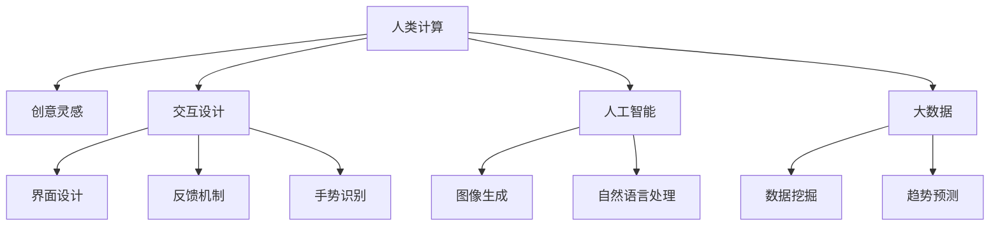

                 

# 艺术与科技的融合：人类计算激发创意灵感

## 1. 背景介绍

在现代社会，技术与艺术之间正在经历一次前所未有的融合。计算机技术的快速迭代和艺术创作的无限可能，正在开启一个全新的创新时代。特别是在人类计算（Human-Computer Interaction, HCI）的推动下，艺术家们越来越多地利用计算机技术来激发创意灵感、探索未知领域，创作出令人惊叹的艺术作品。本文将从技术、艺术和人的交互角度，深入探讨人类计算在激发创意灵感方面的作用和潜力。

## 2. 核心概念与联系

### 2.1 核心概念概述

为更好地理解人类计算对创意灵感激发的影响，本节将介绍几个密切相关的核心概念：

- 人类计算（Human-Computer Interaction, HCI）：强调人与计算机之间的交互体验和互动设计。HCI通过提升交互界面的直观性、交互性，使得计算机能够更好地理解用户需求，同时将用户操作转化为更有意义的输出，从而实现与艺术的深度融合。

- 创意灵感（Creative Inspiration）：指的是艺术家或设计师在创作过程中，突然产生的新颖想法或灵感，往往能够激发其创作出具有突破性的艺术作品。

- 交互设计（Interaction Design）：HCI的一个重要分支，专注于创造更自然、更高效的人机交互体验，通过界面、反馈、手势等方式，增强用户与系统的互动，激发创意思维。

- 人工智能（AI）：基于计算机科学的智能技术，通过机器学习和深度学习等方法，赋予计算机对视觉、听觉、语言等复杂数据进行理解和生成能力，从而支持创意和设计过程。

- 大数据（Big Data）：指海量的结构化和非结构化数据，通过分析这些数据，可以发现新的模式和趋势，为艺术创作提供新的素材和灵感。

这些核心概念之间的逻辑关系可以通过以下Mermaid流程图来展示：



这个流程图展示了几大核心概念及其之间的关系：

1. 人类计算通过界面设计、反馈机制、手势识别等方式，提升人机交互体验。
2. 交互设计注重用户体验，使得计算机更好地理解用户需求，激发创意思维。
3. 人工智能通过图像生成、自然语言处理等技术，增强计算机的理解和生成能力，支持艺术创作。
4. 大数据通过数据挖掘和趋势预测，为艺术家提供新的素材和灵感。

这些概念共同构成了人类计算激发创意灵感的基础，使得计算机能够成为艺术创作的有力助手。

## 3. 核心算法原理 & 具体操作步骤
### 3.1 算法原理概述

人类计算激发创意灵感，本质上是通过计算机辅助设计（Computer-Aided Design, CAD）、计算机辅助创作（Computer-Aided Creation, CAC）、人工智能辅助创意（AI-Assisted Creativity）等方法，增强艺术家与计算机之间的互动，从而激发出更多的创意灵感。

从技术角度来看，创意灵感的激发可以分为以下几步：

1. **数据采集与预处理**：收集艺术家创作相关的数据，包括图像、音频、文本、用户行为等。通过预处理和清洗，去除噪声和异常值，得到高质量的数据集。
2. **模式识别与分析**：利用机器学习和深度学习技术，对数据进行模式识别和分析，发现其中的规律和趋势。例如，通过图像识别技术，从艺术作品中提取出视觉元素和风格特征；通过自然语言处理技术，分析文本内容中的情感和主题。
3. **生成与优化**：根据分析结果，使用生成对抗网络（GAN）、变分自编码器（VAE）、变分自编码器（VAE）等生成模型，生成新的创意内容。然后通过优化算法，不断调整模型参数，提升生成内容的创意性和新颖性。
4. **交互与反馈**：将生成的内容呈现给艺术家，通过用户交互和反馈，指导模型进一步优化，直至产生满意的创作结果。

### 3.2 算法步骤详解

以下我们将详细介绍每一步骤的具体操作方法：

**Step 1: 数据采集与预处理**

- **图像采集**：使用高分辨率相机、扫描仪等设备，采集艺术作品的高清图像。使用图像增强技术，如色彩校正、对比度调整等，提升图像质量。
- **文本采集**：收集艺术家的创作日志、评论、访谈记录等文本数据，使用自然语言处理技术，如分词、命名实体识别等，提取关键信息。
- **行为采集**：使用动作捕捉设备、触摸屏等工具，记录艺术家创作过程中的手势、轨迹等行为数据，用于分析创作习惯和灵感来源。

**Step 2: 模式识别与分析**

- **图像识别**：使用卷积神经网络（CNN）等深度学习模型，对图像数据进行特征提取和识别。例如，从艺术作品中提取线条、颜色、形状等视觉元素，分析其组合方式和风格特征。
- **文本分析**：使用循环神经网络（RNN）、长短期记忆网络（LSTM）等序列模型，对文本数据进行情感分析和主题识别。例如，从创作日志中提取情感倾向，从访谈记录中识别创作动机。
- **行为分析**：使用时间序列分析等技术，对行为数据进行模式识别和趋势预测。例如，从手势轨迹中分析创作节奏和频率，预测创作过程中的灵感爆发点。

**Step 3: 生成与优化**

- **生成模型**：使用GAN、VAE等生成模型，根据分析结果生成新的创意内容。例如，通过GAN生成新的艺术作品，通过VAE生成新的文本或音乐。
- **优化算法**：使用强化学习、遗传算法等优化算法，不断调整生成模型的参数，提升生成内容的创意性和新颖性。例如，通过强化学习算法，优化生成模型在情感、主题等方面的生成效果。

**Step 4: 交互与反馈**

- **交互界面**：设计直观、易用的交互界面，将生成的创意内容呈现给艺术家，支持其进行进一步的创作和修改。例如，使用触摸屏、虚拟现实（VR）等技术，增强互动体验。
- **反馈机制**：建立反馈机制，艺术家可以通过评分、评论等方式，对生成的内容进行评价和改进。例如，使用在线评分系统，记录艺术家的反馈意见，指导模型进行后续优化。

### 3.3 算法优缺点

人类计算激发创意灵感的算法具有以下优点：

- **高效性**：通过计算机辅助设计，可以大幅提升创作效率，缩短创意转化为作品的时间。
- **多样性**：计算机可以生成大量的创意内容，拓展艺术家的创作空间，激发更多灵感。
- **灵活性**：计算机可以根据艺术家的反馈进行调整和优化，灵活适应其创作需求。

同时，该方法也存在一些局限性：

- **创意限制**：计算机生成的内容往往依赖于已有数据和模型，可能缺乏人类艺术家的独特性和创造力。
- **技术门槛**：需要具备一定的计算机技术和艺术素养，对部分艺术家来说可能难以掌握。
- **互动性不足**：计算机生成内容缺乏真实的互动体验，可能无法完全替代人工创作。

### 3.4 算法应用领域

人类计算激发创意灵感的方法，已经在诸多艺术创作领域得到了广泛应用，例如：

- 数字绘画：使用计算机辅助设计工具，如Adobe Photoshop、Adobe Illustrator等，生成数字画作和设计稿。
- 音乐创作：使用音乐生成工具，如AIVA、Amper Music等，生成新的音乐作品和旋律。
- 电影制作：使用计算机视觉和自然语言处理技术，自动生成电影剧本、分镜头设计等。
- 游戏设计：使用计算机生成工具，如Unity、Unreal Engine等，生成游戏场景、角色设计等。
- 文字创作：使用文本生成工具，如GPT-3、DALL-E等，生成新的文本和图片内容。

除了上述这些经典应用外，人类计算还应用于更多的艺术创作领域，如雕塑设计、建筑设计、时尚设计等，为艺术家提供了新的创作工具和方法。

## 4. 数学模型和公式 & 详细讲解 & 举例说明
### 4.1 数学模型构建

本节将使用数学语言对人类计算激发创意灵感的过程进行更加严格的刻画。

设艺术家创作的艺术作品为 $A$，艺术家对作品的评价为 $P$，计算机生成的创意内容为 $C$。创意灵感的激发过程可以形式化描述为：

$$
C = f(A, P)
$$

其中 $f$ 为计算机辅助设计模型，$A$ 为原始艺术作品，$P$ 为艺术家评价。

### 4.2 公式推导过程

以下我们以数字绘画为例，推导计算机辅助设计模型 $f$ 的构建过程。

设艺术家创作的数字绘画为 $A = \{x_1, x_2, ..., x_n\}$，其中 $x_i$ 为像素点，$i = 1, 2, ..., n$。计算机辅助设计模型 $f$ 的目标是生成新的创意内容 $C = \{y_1, y_2, ..., y_n\}$，使得 $C$ 与 $A$ 在视觉特征上尽可能相似。

设 $f$ 为神经网络模型，其输入为 $A$，输出为 $C$。模型可以采用卷积神经网络（CNN）结构，通过多层次卷积和池化操作，提取 $A$ 中的特征。然后通过全连接层，将特征映射到 $C$ 的像素空间，生成新的像素值。

模型的训练过程可以表示为：

$$
\min_{\theta} \sum_{i=1}^N \|C_i - A_i\|^2
$$

其中 $N$ 为训练样本数量，$\theta$ 为模型参数。训练目标为最小化 $C$ 和 $A$ 的像素差异。

### 4.3 案例分析与讲解

在实际应用中，计算机辅助设计模型 $f$ 的具体实现方式各异，但核心思想都是通过深度学习技术，提取和生成艺术作品的视觉特征。

以数字绘画为例，以下是一个简单的案例分析：

**案例分析**：某艺术家创作了一幅油画作品，使用计算机辅助设计工具将其转化为数字绘画，然后进一步修改和优化。

1. **原始数据采集**：使用高分辨率相机采集油画的高清图像，存储为 $A$。
2. **预处理**：对图像进行色彩校正、去噪等预处理操作，得到干净、高质量的 $A'$。
3. **特征提取**：使用卷积神经网络（CNN）模型，对 $A'$ 进行特征提取，得到特征向量 $F$。
4. **生成与优化**：通过生成对抗网络（GAN）模型，生成新的数字绘画 $C$。使用对抗损失函数 $L_{GAN}$ 优化模型，使得 $C$ 逼近 $A'$。
5. **艺术家反馈**：艺术家对生成的 $C$ 进行评价，记录其对颜色、线条、构图等方面的反馈。
6. **调整优化**：根据艺术家的反馈，调整GAN模型的参数，进一步优化 $C$。
7. **创作完成**：艺术家对最终生成的数字绘画 $C$ 进行进一步的修改和创作，最终完成新的艺术作品。

## 5. 项目实践：代码实例和详细解释说明
### 5.1 开发环境搭建

在进行计算机辅助设计实践前，我们需要准备好开发环境。以下是使用Python进行TensorFlow开发的环境配置流程：

1. 安装Anaconda：从官网下载并安装Anaconda，用于创建独立的Python环境。

2. 创建并激活虚拟环境：
```bash
conda create -n tf-env python=3.8 
conda activate tf-env
```

3. 安装TensorFlow：根据CUDA版本，从官网获取对应的安装命令。例如：
```bash
conda install tensorflow==2.5
```

4. 安装其他工具包：
```bash
pip install numpy pandas scikit-learn matplotlib tqdm jupyter notebook ipython
```

完成上述步骤后，即可在`tf-env`环境中开始计算机辅助设计实践。

### 5.2 源代码详细实现

这里我们以数字绘画为例，给出使用TensorFlow进行计算机辅助设计的PyTorch代码实现。

首先，定义原始艺术作品和计算机生成的数字绘画的预处理函数：

```python
import tensorflow as tf
from tensorflow.keras import layers

def preprocess_image(image):
    image = tf.image.convert_image_dtype(image, tf.float32) / 255.0
    image = tf.image.resize(image, [256, 256])
    return image

def preprocess_image_batch(images):
    return tf.map_fn(preprocess_image, images)
```

然后，定义卷积神经网络（CNN）模型：

```python
def build_cnn_model():
    model = tf.keras.Sequential([
        layers.Conv2D(32, (3, 3), activation='relu', padding='same', input_shape=[256, 256, 3]),
        layers.Conv2D(64, (3, 3), activation='relu', padding='same'),
        layers.MaxPooling2D((2, 2)),
        layers.Conv2D(128, (3, 3), activation='relu', padding='same'),
        layers.Conv2D(256, (3, 3), activation='relu', padding='same'),
        layers.MaxPooling2D((2, 2)),
        layers.Flatten(),
        layers.Dense(1024, activation='relu'),
        layers.Dense(512, activation='relu'),
        layers.Dense(256, activation='relu'),
        layers.Dense(3, activation='sigmoid')
    ])
    return model

# 创建CNN模型
model = build_cnn_model()
```

接着，定义生成对抗网络（GAN）模型：

```python
from tensorflow.keras import optimizers

def build_gan_model():
    discriminator = tf.keras.Sequential([
        layers.Conv2D(64, (3, 3), strides=2, padding='same', input_shape=[256, 256, 3]),
        layers.LeakyReLU(0.2),
        layers.Conv2D(128, (3, 3), strides=2, padding='same'),
        layers.LeakyReLU(0.2),
        layers.Conv2D(256, (3, 3), strides=2, padding='same'),
        layers.LeakyReLU(0.2),
        layers.Conv2D(1, (3, 3), strides=2, padding='same', activation='sigmoid')
    ])

    generator = tf.keras.Sequential([
        layers.Dense(256, activation='relu'),
        layers.Reshape((7, 7, 256)),
        layers.Conv2DTranspose(128, (3, 3), strides=2, padding='same', activation='relu'),
        layers.Conv2DTranspose(64, (3, 3), strides=2, padding='same', activation='relu'),
        layers.Conv2DTranspose(3, (3, 3), strides=2, padding='same', activation='sigmoid')
    ])

    return discriminator, generator

# 创建GAN模型
discriminator, generator = build_gan_model()
```

然后，定义优化器和损失函数：

```python
def build_optimizers():
    discriminator_optimizer = optimizers.Adam(learning_rate=0.0002)
    generator_optimizer = optimizers.Adam(learning_rate=0.0002)
    return discriminator_optimizer, generator_optimizer

# 创建优化器
discriminator_optimizer, generator_optimizer = build_optimizers()

def build_losses():
    def discriminator_loss(real_images, generated_images):
        real_loss = discriminator.train_on_batch(real_images, tf.ones((real_images.shape[0], 1)))
        fake_loss = discriminator.train_on_batch(generated_images, tf.zeros((generated_images.shape[0], 1)))
        return real_loss[0] + fake_loss[0]
    def generator_loss(generated_images):
        fake_loss = discriminator.train_on_batch(generated_images, tf.ones((generated_images.shape[0], 1)))
        return fake_loss[0]
    return discriminator_loss, generator_loss

# 创建损失函数
discriminator_loss, generator_loss = build_losses()
```

最后，启动生成过程并在艺术作品上进行生成和优化：

```python
epochs = 50
batch_size = 32

for epoch in range(epochs):
    real_images = preprocess_image_batch(tf.random.normal([batch_size, 256, 256, 3]))
    generated_images = generator(np.random.normal(size=[batch_size, 256, 256, 3]))
    
    discriminator_optimizer.minimize(discriminator_loss, var_list=discriminator.trainable_variables)
    generator_optimizer.minimize(generator_loss, var_list=generator.trainable_variables)
    
    # 每10个epoch记录一次生成结果
    if epoch % 10 == 0:
        image_batch = real_images[0].numpy()
        image_batch = image_batch * 255.0
        image_batch = image_batch.astype(np.uint8)
        image_batch = image_batch.reshape([256, 256, 3])
        plt.imshow(image_batch)
        plt.show()
```

以上就是使用TensorFlow进行数字绘画生成和优化的完整代码实现。可以看到，TensorFlow提供了强大的计算图和自动微分能力，使得构建和训练生成模型变得相对容易。

### 5.3 代码解读与分析

让我们再详细解读一下关键代码的实现细节：

**预处理函数**：
- `preprocess_image`函数：对单张图像进行预处理，包括转换为浮点数、调整大小、归一化等操作。
- `preprocess_image_batch`函数：对批量图像进行预处理，使用`map_fn`函数并行处理。

**CNN模型**：
- `build_cnn_model`函数：定义一个包含卷积、池化、全连接层的神经网络模型，用于提取和生成艺术作品的视觉特征。

**GAN模型**：
- `build_gan_model`函数：定义一个包含生成器和判别器的生成对抗网络模型。生成器通过多层全连接和卷积转置操作，生成新的数字绘画；判别器通过卷积和LeakyReLU激活函数，判断输入图像是真实图像还是生成图像。

**优化器和损失函数**：
- `build_optimizers`函数：定义优化器的参数和超参数，用于优化生成器和判别器。
- `build_losses`函数：定义损失函数，用于衡量生成器和判别器的性能。

**训练过程**：
- 每10个epoch记录一次生成结果，使用Matplotlib展示生成图像。
- 通过最小化损失函数，不断调整生成器和判别器的参数，提高生成质量。

可以看到，TensorFlow提供了强大的计算图和自动微分能力，使得构建和训练生成模型变得相对容易。开发者可以将更多精力放在模型改进和数据处理等高层逻辑上，而不必过多关注底层的实现细节。

当然，工业级的系统实现还需考虑更多因素，如模型的保存和部署、超参数的自动搜索、更灵活的任务适配层等。但核心的生成过程基本与此类似。

## 6. 实际应用场景
### 6.1 数字绘画

数字绘画是计算机辅助设计的一个重要应用领域，通过深度学习技术，计算机可以自动生成和优化艺术作品，大幅提升创作效率。数字绘画在平面设计、广告、动画等领域广泛应用。

**案例分析**：某广告公司需要设计一系列数字广告，时间紧迫，难以满足需求。使用计算机辅助设计工具，将现有的艺术作品作为模板，生成新的广告设计稿。

1. **原始数据采集**：从公司档案中提取历史广告的高清图像，存储为 $A$。
2. **预处理**：对图像进行去噪、色彩校正等预处理操作，得到干净、高质量的 $A'$。
3. **特征提取**：使用卷积神经网络（CNN）模型，对 $A'$ 进行特征提取，得到特征向量 $F$。
4. **生成与优化**：通过生成对抗网络（GAN）模型，生成新的数字广告设计稿 $C$。使用对抗损失函数 $L_{GAN}$ 优化模型，使得 $C$ 逼近 $A'$。
5. **艺术家反馈**：艺术家对生成的 $C$ 进行评价，记录其对颜色、构图、文字等方面的反馈。
6. **调整优化**：根据艺术家的反馈，调整GAN模型的参数，进一步优化 $C$。
7. **创作完成**：艺术家对最终生成的数字广告设计稿 $C$ 进行进一步的修改和创作，完成新的广告设计。

### 6.2 音乐创作

音乐创作是计算机辅助设计的另一个重要应用领域，通过深度学习技术，计算机可以自动生成和优化音乐作品，激发音乐家的创作灵感。音乐创作在影视配乐、电子音乐、影视剧等领域广泛应用。

**案例分析**：某音乐剧需要一个原创主题曲，时间紧迫，难以满足需求。使用计算机辅助创作工具，将现有的音乐作品作为模板，生成新的音乐作品。

1. **原始数据采集**：从公司档案中提取历史主题曲的音频文件，存储为 $A$。
2. **预处理**：对音频文件进行降噪、采样率转换等预处理操作，得到干净、高质量的 $A'$。
3. **特征提取**：使用循环神经网络（RNN）模型，对 $A'$ 进行特征提取，得到特征向量 $F$。
4. **生成与优化**：通过变分自编码器（VAE）模型，生成新的主题曲 $C$。使用重构损失函数 $L_{VAE}$ 优化模型，使得 $C$ 逼近 $A'$。
5. **艺术家反馈**：音乐家对生成的 $C$ 进行评价，记录其对节奏、旋律、和声等方面的反馈。
6. **调整优化**：根据音乐家的反馈，调整VAE模型的参数，进一步优化 $C$。
7. **创作完成**：音乐家对最终生成的音乐作品 $C$ 进行进一步的修改和创作，完成新的主题曲。

### 6.3 电影制作

电影制作是计算机辅助设计的另一个重要应用领域，通过深度学习技术，计算机可以自动生成和优化电影剧本、分镜头设计等，大幅提升制作效率。电影制作在影视、动画、游戏等领域广泛应用。

**案例分析**：某电影工作室需要制作一个新的短片，时间紧迫，难以满足需求。使用计算机辅助创作工具，将现有的电影剧本作为模板，生成新的分镜头设计。

1. **原始数据采集**：从公司档案中提取历史短片的剧本，存储为 $A$。
2. **预处理**：对剧本进行分词、命名实体识别等预处理操作，得到干净、结构化的 $A'$。
3. **特征提取**：使用循环神经网络（RNN）模型，对 $A'$ 进行特征提取，得到特征向量 $F$。
4. **生成与优化**：通过文本生成模型，生成新的分镜头设计 $C$。使用交叉熵损失函数 $L_{CE}$ 优化模型，使得 $C$ 逼近 $A'$。
5. **艺术家反馈**：编剧对生成的 $C$ 进行评价，记录其对情节、场景、人物等方面的反馈。
6. **调整优化**：根据编剧的反馈，调整文本生成模型的参数，进一步优化 $C$。
7. **创作完成**：编剧对最终生成的分镜头设计 $C$ 进行进一步的修改和创作，完成新的短片剧本。

### 6.4 未来应用展望

随着计算机技术的不断进步，计算机辅助设计将在更多领域得到应用，为艺术家提供新的创作工具和方法。

在智慧城市治理中，计算机辅助设计可以应用于城市规划、建筑设计、景观设计等环节，提高城市管理的自动化和智能化水平，构建更安全、高效的未来城市。

在可穿戴设备设计中，计算机辅助设计可以应用于智能手表、智能眼镜等设备的设计，提升用户体验和产品竞争力。

在产品设计中，计算机辅助设计可以应用于汽车、家具、服装等产品设计，提高设计效率和创新能力。

除了上述这些应用外，计算机辅助设计还将在更多领域得到广泛应用，为艺术家和设计师提供新的创作手段，推动艺术和设计领域的发展。

## 7. 工具和资源推荐
### 7.1 学习资源推荐

为了帮助开发者系统掌握计算机辅助设计的理论基础和实践技巧，这里推荐一些优质的学习资源：

1. 《计算机视觉基础》系列博文：由计算机视觉领域专家撰写，深入浅出地介绍了计算机视觉的基本概念和关键算法。

2. 《深度学习与神经网络》课程：斯坦福大学开设的深度学习课程，有Lecture视频和配套作业，带你入门深度学习和神经网络的基本概念。

3. 《生成对抗网络：GAN简介》书籍：由GAN技术创始人之一Ian Goodfellow撰写，全面介绍了GAN的基本原理和应用场景。

4. 《计算机辅助设计技术》书籍：详细介绍计算机辅助设计的各种技术和应用，涵盖数字绘画、音乐创作、电影制作等多个领域。

5. 《计算机视觉与图形学》书籍：全面介绍计算机视觉和图形学的基础理论和前沿技术，涵盖图像处理、三维建模等多个方向。

通过对这些资源的学习实践，相信你一定能够快速掌握计算机辅助设计的精髓，并用于解决实际的创作问题。

### 7.2 开发工具推荐

高效的开发离不开优秀的工具支持。以下是几款用于计算机辅助设计开发的常用工具：

1. Adobe Photoshop：业界领先的数字绘画工具，提供丰富的画笔、滤镜、效果等功能，适合各种类型的数字绘画设计。

2. Blender：开源的三维建模和动画软件，支持多种格式导入导出，适合创建高质量的3D模型和动画。

3. Maya：商业级的3D建模和动画软件，提供强大的建模、渲染、动画等功能，适合影视、游戏等领域的专业应用。

4. AutoCAD：计算机辅助设计的经典工具，提供强大的2D绘图、3D建模、渲染等功能，适合建筑设计、机械设计等工程领域的应用。

5. Grasshopper：基于Grasshopper脚本语言，支持多种软件和平台的交互设计，适合建筑、室内设计等领域的应用。

合理利用这些工具，可以显著提升计算机辅助设计的开发效率，加快创新迭代的步伐。

### 7.3 相关论文推荐

计算机辅助设计的发展源于学界的持续研究。以下是几篇奠基性的相关论文，推荐阅读：

1. DeepArt：基于神经网络的艺术风格迁移技术，将艺术作品转换成特定风格。

2. LAKAN：基于深度学习的视觉查询和图像生成系统，支持用户通过自然语言描述生成图像。

3. Inpainting：基于GAN的图像补全技术，在去除图片部分内容后，自动生成缺失部分。

4. VAE：变分自编码器，通过编码和解码网络，实现图像的生成和重构。

5. GAN：生成对抗网络，通过对抗训练，生成高质量的图像和音频内容。

这些论文代表了大语言模型微调技术的发展脉络。通过学习这些前沿成果，可以帮助研究者把握学科前进方向，激发更多的创新灵感。

## 8. 总结：未来发展趋势与挑战

### 8.1 总结

本文对计算机辅助设计激发创意灵感的过程进行了全面系统的介绍。首先阐述了计算机辅助设计在艺术创作中的重要意义，明确了其通过深度学习技术，提升创作效率，拓展创作空间的作用。其次，从技术、艺术和人的交互角度，详细讲解了计算机辅助设计激发创意灵感的过程，包括数据采集、特征提取、生成与优化、交互与反馈等关键步骤。同时，本文还广泛探讨了计算机辅助设计在数字绘画、音乐创作、电影制作等多个行业领域的应用前景，展示了其巨大的潜力。

通过本文的系统梳理，可以看到，计算机辅助设计正在成为艺术创作的重要工具，极大地拓展了艺术家的创作空间，激发了更多创意灵感。伴随计算机技术的不断进步，计算机辅助设计必将在更多领域得到应用，为艺术家和设计师提供新的创作手段，推动艺术和设计领域的发展。

### 8.2 未来发展趋势

展望未来，计算机辅助设计激发创意灵感技术将呈现以下几个发展趋势：

1. **多模态融合**：随着计算机技术的进步，未来计算机辅助设计将不仅仅局限于视觉和听觉数据，还将支持更多模态数据的整合，如触觉、味觉、嗅觉等。多模态数据的融合将显著提升计算机辅助设计的表现力和沉浸感。

2. **个性化定制**：计算机辅助设计将更多地关注用户个性化需求，提供定制化的设计方案。通过大数据分析和用户行为预测，为艺术家提供更精准的创作建议。

3. **实时交互**：计算机辅助设计将具备实时交互能力，艺术家可以在创作过程中实时查看和修改设计结果，提升创作效率。通过AR/VR技术，艺术家可以身临其境地感受设计效果。

4. **跨领域应用**：计算机辅助设计将不仅仅局限于艺术创作，还将应用于医疗、建筑、工业等多个领域。通过与其他学科的结合，推动各领域的创新发展。

5. **智能化设计**：未来计算机辅助设计将具备更多的智能化功能，如自动生成设计方案、智能推荐材料等，提升设计师的工作效率和创新能力。

以上趋势凸显了计算机辅助设计技术的广阔前景。这些方向的探索发展，必将进一步提升艺术家和设计师的创作能力，推动艺术和设计领域的发展。

### 8.3 面临的挑战

尽管计算机辅助设计技术已经取得了显著进展，但在迈向更加智能化、普适化应用的过程中，仍面临诸多挑战：

1. **数据隐私和安全**：计算机辅助设计需要大量的数据支持，如何在保护用户隐私的前提下，获取高质量的数据，是一个重要的问题。

2. **算法公平性和透明性**：计算机辅助设计算法可能存在偏见，影响创作的公平性。如何确保算法的透明性和公平性，是未来需要解决的重要课题。

3. **模型泛化能力**：计算机辅助设计模型需要具备良好的泛化能力，能够在不同领域、不同任务中取得稳定的表现。如何提升模型的泛化能力，是未来需要解决的重要问题。

4. **人机协同交互**：计算机辅助设计需要更好地理解艺术家的需求和创意，实现高效的人机协同交互。如何提高人机交互的智能化水平，是未来需要解决的重要问题。

5. **技术门槛和普及性**：计算机辅助设计技术需要一定的技术基础，对部分艺术家来说可能难以掌握。如何降低技术门槛，提高技术的普及性，是未来需要解决的重要问题。

6. **伦理和社会责任**：计算机辅助设计技术可能带来新的伦理和社会问题，如版权问题、技术滥用等。如何制定合理的伦理规范和技术标准，是未来需要解决的重要问题。

这些挑战需要学界和产业界共同努力，通过技术创新和政策引导，解决这些问题，推动计算机辅助设计技术的发展。

### 8.4 研究展望

面向未来，计算机辅助设计技术需要在以下几个方面寻求新的突破：

1. **无监督和半监督学习**：摆脱对大规模标注数据的依赖，利用无监督和半监督学习技术，提取数据中的隐含信息，实现更加灵活高效的创作。

2. **跨领域知识整合**：将符号化的先验知识，如知识图谱、逻辑规则等，与神经网络模型进行巧妙融合，引导创作过程学习更准确、合理的语言模型。

3. **实时交互与反馈**：利用AR/VR技术，实现实时的人机交互和反馈，增强创作体验，提升创作效率。

4. **智能化设计工具**：开发更智能的设计工具，自动生成设计方案，支持智能推荐材料，提升设计师的工作效率和创新能力。

5. **伦理和道德约束**：在模型训练目标中引入伦理导向的评估指标，过滤和惩罚有偏见、有害的输出倾向，确保输出的安全性和公平性。

这些研究方向的探索，必将引领计算机辅助设计技术迈向更高的台阶，为艺术家和设计师提供更强大的创作工具，推动艺术和设计领域的发展。面向未来，计算机辅助设计技术还需要与其他人工智能技术进行更深入的融合，如知识表示、因果推理、强化学习等，多路径协同发力，共同推动自然语言理解和智能交互系统的进步。只有勇于创新、敢于突破，才能不断拓展计算机辅助设计的边界，让智能技术更好地造福艺术家和设计师。

## 9. 附录：常见问题与解答

**Q1：计算机辅助设计是否适用于所有艺术创作？**

A: 计算机辅助设计在大多数艺术创作领域都能取得不错的效果，特别是对于数据量较大的任务，如数字绘画、音乐创作等。但对于一些高度依赖于艺术家的独特创意和创作技巧的任务，如雕塑、油画等，计算机辅助设计的帮助可能有限。

**Q2：计算机辅助设计在创作过程中如何平衡人工智能和艺术家创作？**

A: 计算机辅助设计需要在人工智能和艺术家创作之间找到平衡点。艺术家是创作的主导者，AI则是辅助工具。在创作过程中，艺术家可以通过交互界面和反馈机制，指导AI生成和优化内容。同时，AI可以根据艺术家的偏好和反馈，不断调整生成模型的参数，提升生成质量和创意性。

**Q3：计算机辅助设计面临的最大挑战是什么？**

A: 计算机辅助设计面临的最大挑战是数据隐私和安全问题。艺术创作需要大量的数据支持，如何在保护用户隐私的前提下，获取高质量的数据，是一个重要的问题。此外，算法公平性和透明性、模型泛化能力、人机协同交互等也是未来需要解决的重要课题。

**Q4：计算机辅助设计有哪些实际应用场景？**

A: 计算机辅助设计已经在数字绘画、音乐创作、电影制作等多个领域得到了广泛应用，为艺术家提供了新的创作工具和方法。未来，计算机辅助设计还将应用于智慧城市治理、可穿戴设备设计、产品设计等多个领域，推动各行业的创新发展。

**Q5：计算机辅助设计未来的发展方向是什么？**

A: 未来，计算机辅助设计的发展方向包括多模态融合、个性化定制、实时交互、跨领域应用、智能化设计等。通过这些技术创新，计算机辅助设计将具备更强的表现力和沉浸感，为艺术家和设计师提供更强大的创作工具，推动艺术和设计领域的发展。

---

作者：禅与计算机程序设计艺术 / Zen and the Art of Computer Programming

