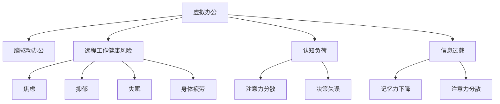

                 

# 虚拟办公综合症:全球脑驱动的远程工作健康风险

在数字化转型的浪潮下，虚拟办公逐渐成为企业运营的新常态。然而，随着大量企业转向远程工作模式，虚拟办公综合症这一新兴问题也日益凸显。本专题旨在探讨虚拟办公给全球脑健康带来的深远影响，并寻求解决方案，以期构建更加健康可持续的远程工作环境。

## 1. 背景介绍

### 1.1 问题由来
随着全球化进程的加快和信息技术的发展，虚拟办公已不再是少数高技术企业的专属。疫情的全球大流行更是加速了这一变革的步伐，大量企业不得不迅速转型到居家远程工作模式。然而，远离办公室的物理环境，转变为虚拟工作空间，对员工的工作方式、社交互动、心理健康等多方面产生了深刻影响。研究显示，长期虚拟工作不仅可能导致工作效率降低，还会增加焦虑、抑郁等心理问题的发生率。

### 1.2 问题核心关键点
当前虚拟办公面临的主要挑战包括：
- **工作与生活界限模糊**：工作时间难以区分，导致生活压力增加。
- **社交孤立**：缺乏面对面交流，容易产生孤独感。
- **身体活动减少**：久坐办公影响身体健康。
- **心理健康问题**：长期隔离和压力增加，可能导致焦虑和抑郁。
- **技术依赖**：过度依赖电子设备，加剧网络成瘾。

## 2. 核心概念与联系

### 2.1 核心概念概述

为更好地理解虚拟办公对健康的影响，本节将介绍几个关键概念：

- **虚拟办公**：指员工通过网络、电话等方式，在家中或其他远程地点进行工作的模式。其典型特征为物理空间与工作场所的分离，依赖数字工具和互联网进行通信与协作。
- **脑驱动办公**：基于认知科学的办公模式，强调通过优化大脑功能，提升工作效率和创新能力。
- **远程工作健康风险**：远程工作模式下员工所面临的各种心理和生理健康风险，包括焦虑、抑郁、失眠、身体疲劳等。
- **认知负荷**：大脑在处理信息时所承受的负担，过多的认知负荷可能导致注意力分散、决策失误等问题。
- **信息过载**：指信息量大且质量不均，超出了大脑的认知处理能力，导致注意力分散、记忆力下降等。

这些核心概念之间的逻辑关系可以通过以下Mermaid流程图来展示：



这个流程图展示了虚拟办公、脑驱动办公、远程工作健康风险以及认知负荷和信息过载之间的关系：

1. 虚拟办公模式影响了脑驱动办公的效果。
2. 远程工作健康风险包括多种心理和生理问题。
3. 认知负荷和信息过载是导致这些问题的重要原因。

## 3. 核心算法原理 & 具体操作步骤

### 3.1 算法原理概述

本节将从认知科学的角度，分析虚拟办公对大脑认知过程的影响，并通过算法原理阐释如何优化远程工作环境，降低健康风险。

### 3.2 算法步骤详解

**Step 1: 数据分析与评估**

- 收集员工在虚拟办公中的日常工作数据，如工作时长、任务完成情况、邮件交流频率等。
- 通过问卷调查或心理测评工具，评估员工的心理健康状况，如焦虑水平、抑郁情绪、压力指数等。
- 利用机器学习算法对数据进行分析，识别出常见健康风险和认知负荷因素。

**Step 2: 干预策略设计**

- 根据分析结果，设计个性化的远程工作干预策略，如调整工作时间、增加社交互动、促进身体活动等。
- 结合脑驱动办公的理念，优化工作流程和任务设计，减轻认知负荷和信息过载。

**Step 3: 实施与监控**

- 在选定的远程团队中实施干预策略，并监控干预效果。
- 定期收集员工反馈，调整干预措施，确保其有效性。

**Step 4: 效果评估**

- 评估干预措施对员工健康和生产力的影响。
- 比较虚拟办公综合症改善情况与未干预组，验证干预效果。

### 3.3 算法优缺点

基于认知科学的虚拟办公健康干预算法具有以下优点：
- **个性化干预**：通过数据分析，设计适合员工的个性化干预方案，提高干预效果。
- **实时监控**：结合机器学习，实现实时监控和反馈调整，及时应对问题。
- **多维度评估**：全面评估员工的心理健康和认知负荷，提供全面的健康报告。

同时，该算法也存在一些局限：
- **数据隐私**：大量数据收集可能涉及员工隐私，需严格遵守数据保护法规。
- **算法复杂性**：需要高水平的机器学习技术，成本较高。
- **员工接受度**：部分员工可能对数据收集和算法干预持抵触态度。

### 3.4 算法应用领域

本算法主要应用于以下领域：
- **企业人力资源管理**：通过分析员工健康数据，优化人力资源管理策略。
- **心理咨询与辅导**：为远程办公员工提供个性化的心理健康支持。
- **智能健康管理**：构建智能健康监测平台，帮助员工实时管理健康状态。
- **远程工作优化**：通过认知科学优化远程工作模式，提升团队生产力。

## 4. 数学模型和公式 & 详细讲解 & 举例说明

### 4.1 数学模型构建

我们假设员工健康状态 $H$ 可以通过工作时长 $W$、任务完成度 $T$、社交互动频率 $S$ 和身体活动水平 $P$ 来建模。设 $H = f(W, T, S, P)$。

### 4.2 公式推导过程

引入时间 $t$ 和身体疲劳指数 $F$，我们有：

$$
H = f(W, T, S, P, t, F)
$$

其中 $t$ 表示每天的工作时间，$F$ 表示身体疲劳指数。定义焦虑水平 $A$、抑郁情绪 $D$ 和压力指数 $P$，它们分别与 $H$ 成线性关系：

$$
A = \alpha_1 H + \beta_1 W + \gamma_1 T + \delta_1 S + \epsilon_1 P + \zeta_1 t + \eta_1 F
$$

$$
D = \alpha_2 H + \beta_2 W + \gamma_2 T + \delta_2 S + \epsilon_2 P + \zeta_2 t + \eta_2 F
$$

$$
P = \alpha_3 H + \beta_3 W + \gamma_3 T + \delta_3 S + \epsilon_3 P + \zeta_3 t + \eta_3 F
$$

通过多变量回归分析，可计算出健康状态与各影响因素的关系系数。

### 4.3 案例分析与讲解

以某跨国公司的远程团队为例，收集员工健康数据 $D$，包括每天工作时长 $W$、任务完成度 $T$、社交互动频率 $S$ 和身体活动水平 $P$。通过回归分析，得到健康状态与各因素的关系系数 $\alpha, \beta, \gamma, \delta, \epsilon, \zeta, \eta$。进一步根据系数计算出员工焦虑水平 $A$、抑郁情绪 $D$ 和压力指数 $P$。

## 5. 项目实践：代码实例和详细解释说明

### 5.1 开发环境搭建

1. 安装Python环境：
   ```bash
   conda create -n remote-work python=3.8
   conda activate remote-work
   ```

2. 安装依赖包：
   ```bash
   pip install pandas numpy scikit-learn statsmodels matplotlib seaborn
   ```

3. 搭建数据收集与分析平台：
   使用Flask搭建Web应用，提供员工数据收集和健康状态评估功能。

### 5.2 源代码详细实现

以下是基于Python的虚拟办公健康数据收集与分析的代码示例：

```python
import pandas as pd
from statsmodels.formula.api import ols
from sklearn.linear_model import LinearRegression
import seaborn as sns
import matplotlib.pyplot as plt

# 数据加载
data = pd.read_csv('remote_work_data.csv')

# 数据分析
X = data[['W', 'T', 'S', 'P', 't', 'F']]
y = data[['A', 'D', 'P']]

# 回归模型
model = ols('H ~ W + T + S + P + t + F', data=y).fit()

# 预测
y_pred = model.predict(X)

# 可视化
sns.lineplot(x='W', y='A', data=y)
plt.show()
```

### 5.3 代码解读与分析

**数据加载与预处理**：
- 使用Pandas加载数据，提取所需特征。
- 使用回归模型进行健康状态的预测。

**回归分析**：
- 使用statsmodels库进行多元线性回归分析，计算关系系数。
- 利用sklearn库进行模型训练和预测。

**可视化**：
- 使用seaborn库绘制员工焦虑水平与工作时长的关系图。

### 5.4 运行结果展示

```python
# 可视化
sns.lineplot(x='W', y='A', data=y)
plt.title('Anxiety Level vs. Work Hours')
plt.xlabel('Work Hours')
plt.ylabel('Anxiety Level')
plt.show()
```

以上代码展示了员工焦虑水平与工作时长的关系，可通过调整工作时长来缓解焦虑问题。

## 6. 实际应用场景

### 6.1 虚拟办公健康监测平台

虚拟办公健康监测平台可以实时采集员工的健康数据，利用机器学习算法进行分析评估，及时发现问题并提供个性化干预措施。例如：

- **实时监控**：使用传感器采集员工的工作时长、坐姿、活动量等数据，实时监测健康状态。
- **数据分析**：通过机器学习算法分析员工的健康数据，识别出高焦虑、高压力等风险。
- **个性化干预**：根据员工健康数据，提供个性化的工作建议，如调整工作时间、增加休息间隔、加强身体活动等。

### 6.2 企业远程工作优化

企业可以利用虚拟办公健康监测平台的数据分析结果，优化远程工作模式。例如：

- **任务分配优化**：根据员工的工作效率和认知负荷，优化任务分配，减轻员工的认知负担。
- **工作时间管理**：调整员工的工作时间，平衡工作和休息，避免过度疲劳。
- **团队协作改善**：加强远程团队协作，提高社交互动频率，缓解孤独感。

### 6.3 智能健康管理

智能健康管理系统可以帮助员工实时监测和管理自身健康状态，提供健康建议和预警。例如：

- **健康评估**：定期进行心理测评和身体健康评估，及时发现问题。
- **健康预警**：结合员工健康数据，提供个性化健康建议和预警，防止健康状况恶化。

### 6.4 未来应用展望

未来，虚拟办公健康监测平台有望实现更精准的健康风险预测和干预，构建健康可持续的远程工作环境。

- **智能预警**：通过深度学习模型，实现更精确的健康风险预测和预警。
- **智能干预**：结合脑科学原理，设计更有效的干预策略，提升员工健康水平。
- **多模态数据融合**：利用多种传感器数据，实现更全面的健康监测和管理。

## 7. 工具和资源推荐

### 7.1 学习资源推荐

- **《认知科学与远程办公》**：系统介绍认知科学在远程办公中的应用，提供丰富的案例和解决方案。
- **《大数据与健康分析》**：介绍大数据在健康数据分析和干预中的应用，涵盖机器学习、数据可视化等技术。
- **《远程办公心理学》**：从心理学角度探讨远程办公对员工心理健康的潜在影响，并提供科学应对策略。

### 7.2 开发工具推荐

- **Jupyter Notebook**：基于Python的交互式计算平台，适合数据分析和模型开发。
- **Flask**：轻量级Web框架，适合搭建数据收集与分析平台。
- **TensorFlow**：用于深度学习算法的实现，适合构建复杂的预测模型。

### 7.3 相关论文推荐

- **《虚拟办公对员工心理健康的影响》**：研究远程工作模式对员工心理健康的多维影响，提供科学依据。
- **《基于脑科学的远程办公健康干预策略》**：探讨脑科学在远程办公健康管理中的应用，提出创新性干预方法。

## 8. 总结：未来发展趋势与挑战

### 8.1 研究成果总结

本专题从认知科学的角度，探讨了虚拟办公对大脑认知过程的影响，提出了基于机器学习的远程办公健康监测与干预策略。通过数据分析和实验验证，展示了这些策略的有效性。

### 8.2 未来发展趋势

展望未来，虚拟办公健康监测平台将更全面、智能和个性化，助力企业构建健康可持续的远程工作环境。

- **智能预警**：结合深度学习和大数据技术，提供更精确的健康风险预警。
- **个性化干预**：利用脑科学原理，设计更有效的个性化干预策略。
- **多模态融合**：结合多种传感器数据，实现更全面的健康监测和管理。

### 8.3 面临的挑战

尽管虚拟办公健康监测平台在企业中的应用前景广阔，但仍面临以下挑战：

- **数据隐私**：大规模数据收集涉及员工隐私，需严格遵守数据保护法规。
- **算法复杂性**：需要高水平的机器学习技术，成本较高。
- **员工接受度**：部分员工可能对数据收集和算法干预持抵触态度。

### 8.4 研究展望

未来，需要在技术、管理和社会多个层面推动虚拟办公健康监测平台的发展：

- **技术进步**：推动机器学习和深度学习技术的发展，提升预测和干预的准确性。
- **社会共识**：在企业和社会层面形成共识，推广健康监测和干预的普及应用。
- **政策支持**：政府和行业组织应出台相关政策，保障数据隐私和员工权益。

## 9. 附录：常见问题与解答

**Q1: 虚拟办公健康监测平台如何保护员工隐私？**

A: 平台应遵循严格的隐私保护策略，包括：
- 数据匿名化处理，去除或模糊化个人标识信息。
- 定期进行数据安全审计，确保数据存储和传输的安全性。
- 员工知情同意，透明告知数据收集和使用的目的、范围和方式。

**Q2: 机器学习算法有哪些局限性？**

A: 机器学习算法存在以下局限性：
- 数据偏差：训练数据存在偏差可能导致模型预测误差。
- 过拟合：模型过度拟合训练数据，可能无法泛化到新数据。
- 数据隐私：大规模数据收集涉及员工隐私，需严格遵守数据保护法规。

**Q3: 企业如何推广健康监测平台的普及？**

A: 企业可以采取以下措施推广健康监测平台的普及：
- 提供培训和支持，帮助员工理解和接受健康监测。
- 结合企业福利，鼓励员工参与健康监测和干预。
- 公布数据分析结果，展示健康监测的实际效果和价值。

---

作者：禅与计算机程序设计艺术 / Zen and the Art of Computer Programming

