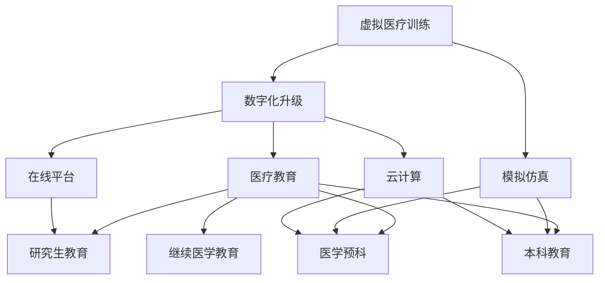

                 

# 虚拟医疗训练：全球医疗教育的数字化升级

> 关键词：虚拟医疗训练, 数字化升级, 医疗教育, 模拟仿真, 在线平台, 云计算, 人工智能, 教育科技, 远程教育

## 1. 背景介绍

### 1.1 问题由来
近年来，全球医疗教育面临巨大挑战：人口老龄化加速、慢性病负担加重、传染病流行频发、医学专业培养周期长、师资力量匮乏等问题日益突出。传统的以课堂讲授、实际操作为主的医疗教育模式，难以满足现代社会对医疗服务的高需求和高要求。在疫情常态化的背景下，传统的线下教学模式更显得捉襟见肘。

### 1.2 问题核心关键点
1. 医学教育成本高、周期长、师资力量匮乏。
2. 疫情加剧了传统医疗教育模式的挑战。
3. 虚拟医疗训练成为未来医学教育的重要趋势。
4. 在线教育平台、模拟仿真技术、云计算和大数据为虚拟医疗训练提供了技术支持。
5. 人工智能在虚拟医疗训练中扮演重要角色，用于仿真、评估和个性化学习。

### 1.3 问题研究意义
虚拟医疗训练的数字化升级，是医疗教育未来发展的必然方向。数字化升级可以显著降低教育成本、提高教学效率、提升学习体验，并有效应对全球性公共卫生危机。本研究旨在深入探讨虚拟医疗训练的数字化升级过程，提出解决方案，为全球医疗教育体系的数字化转型提供参考。

## 2. 核心概念与联系

### 2.1 核心概念概述

为更好地理解虚拟医疗训练的数字化升级过程，本节将介绍几个密切相关的核心概念：

- **虚拟医疗训练（Virtual Medical Training）**：通过模拟仿真、虚拟现实(VR)、增强现实(AR)等技术，构建模拟临床情境，进行医学技能训练和临床决策模拟。
- **数字化升级（Digital Transformation）**：利用数字技术，对传统医疗教育模式进行全面的革新和升级，实现教育资源的智能化、个性化和协作化。
- **医疗教育（Medical Education）**：包括医学预科教育、本科教育、研究生教育和继续医学教育等，涵盖基础医学、临床医学、公共卫生等各类学科。
- **模拟仿真（Simulation）**：通过软件模拟医学操作、疾病诊疗过程，供医学生、医生等进行实战练习。
- **在线平台（Online Platform）**：基于云计算和移动互联网技术，构建的线上教学和管理系统，用于远程教育和资源共享。
- **云计算（Cloud Computing）**：通过网络提供计算资源、存储资源、应用服务等，支持大规模数据处理和并发访问。
- **人工智能（Artificial Intelligence, AI）**：通过机器学习、深度学习等技术，模拟人的认知、学习和推理过程，用于仿真、评估和个性化学习。

这些核心概念之间的逻辑关系可以通过以下Mermaid流程图来展示：



这个流程图展示了大语言模型的核心概念及其之间的关系：

1. 虚拟医疗训练通过数字化升级，促进医疗教育体系的全面升级。
2. 模拟仿真为虚拟医疗训练提供了必要的技术支持，使其能够真实再现临床情境。
3. 在线平台和云计算为大规模资源共享和数据处理提供了基础设施。
4. 人工智能为虚拟医疗训练提供了仿真、评估和个性化学习的强大引擎。
5. 医疗教育体系包含多个层次，每个层次都可以通过虚拟医疗训练和数字化升级获得提升。

## 3. 核心算法原理 & 具体操作步骤

### 3.1 算法原理概述

虚拟医疗训练的数字化升级，本质上是一个复杂的教育技术集成过程。其核心思想是：通过模拟仿真、在线平台、云计算和大数据等技术，结合人工智能算法，构建一个集中的虚拟医疗训练系统，提供全面的医学教育资源和平台，以支持医学生的临床技能训练和医生持续教育。

形式化地，假设虚拟医疗训练系统为 $S_{\theta}$，其中 $\theta$ 为系统参数。给定目标医学教育任务 $T$ 的数字化要求，系统 $S_{\theta}$ 的目标是找到新的系统参数 $\hat{\theta}$，使得：

$$
\hat{\theta}=\mathop{\arg\min}_{\theta} \mathcal{L}(S_{\theta},T)
$$

其中 $\mathcal{L}$ 为针对任务 $T$ 设计的损失函数，用于衡量系统输出与数字化要求之间的差异。常见的损失函数包括教学效果评估指标、学生学习满意度、教学资源覆盖率等。

通过梯度下降等优化算法，数字化升级过程不断更新系统参数 $\theta$，最小化损失函数 $\mathcal{L}$，使得系统输出逼近数字化要求。由于 $\theta$ 已经通过多个教育技术和算法的集成，使得虚拟医疗训练系统具备较强的适应性和扩展性，因此即便在复杂的教育任务中，也能较快收敛到理想的系统参数 $\hat{\theta}$。

### 3.2 算法步骤详解

虚拟医疗训练的数字化升级一般包括以下几个关键步骤：

**Step 1: 收集教育需求与资源**
- 收集目标医学教育任务的具体要求，包括教学内容、教学目标、评估指标等。
- 收集与任务相关的教育资源，包括教材、讲义、案例、模拟仿真场景、训练数据等。

**Step 2: 构建虚拟医疗训练平台**
- 设计平台架构，包括前端界面、后端系统、云计算基础设施、人工智能算法等。
- 集成在线平台、模拟仿真、人工智能等技术，构建全面的虚拟医疗训练系统。

**Step 3: 设置数字化升级参数**
- 选择合适的优化算法及其参数，如Adam、SGD等，设置学习率、批大小、迭代轮数等。
- 设置正则化技术及强度，包括权重衰减、Dropout、Early Stopping等。
- 确定哪些部分使用人工智能算法进行优化。

**Step 4: 执行数字化升级**
- 将教育需求和资源作为输入数据，输入虚拟医疗训练系统。
- 使用AI算法进行仿真、评估、个性化学习等，优化系统参数。
- 周期性评估数字化升级效果，根据效果决定是否触发优化策略。
- 重复上述步骤直至满足预设的数字化要求。

**Step 5: 测试和部署**
- 在测试集上评估数字化升级后系统的效果，对比数字化升级前后的教育效果和满意度。
- 使用优化后的系统进行全面推广，供全球医学教育使用。
- 持续收集新的教育需求和反馈，定期重新进行数字化升级。

以上是虚拟医疗训练的数字化升级的一般流程。在实际应用中，还需要针对具体教育任务的特点，对数字化升级过程的各个环节进行优化设计，如改进教学仿真算法，引入更多的正则化技术，搜索最优的超参数组合等，以进一步提升系统性能。

### 3.3 算法优缺点

虚拟医疗训练的数字化升级方法具有以下优点：
1. 大幅降低教育成本。通过模拟仿真，可重复使用相同教学资源，无需大量实物和真人模拟。
2. 提高教学效率。系统化、标准化的数字化培训，有助于医学生和医生快速掌握临床技能。
3. 增强学习体验。虚拟仿真环境可以模拟复杂的临床情境，提高学习兴趣和动力。
4. 拓展教育空间。虚拟训练可以超越地理和物理限制，实现远程教育和跨区域协作。

同时，该方法也存在一定的局限性：
1. 技术复杂度高。系统搭建和维护需要高度的技术支持和资源投入。
2. 效果依赖于技术实现。仿真算法和AI模型必须能够准确模拟真实临床情景和评估效果。
3. 缺乏真实互动。虚拟训练难以完全替代真实临床操作，仍需辅助真实实践。
4. 用户适应性差。新系统需经过一段时间的适应，才能发挥最大教育效果。
5. 资源需求大。系统需要强大的计算资源和存储能力，对基础设施要求较高。

尽管存在这些局限性，但就目前而言，虚拟医疗训练的数字化升级方法仍是大规模医学教育的重要手段。未来相关研究的重点在于如何进一步降低技术复杂度，提高系统实用性和可访问性，同时兼顾学习效果和技术实现的平衡。

### 3.4 算法应用领域

虚拟医疗训练的数字化升级技术，在医学教育领域已经得到了广泛的应用，覆盖了几乎所有常见教育任务，例如：

- **医学预科教育**：模拟基础医学知识学习，如解剖、生理学、生物化学等。
- **本科教育**：基于仿真病例进行临床技能训练，如手术操作、诊断治疗、病理分析等。
- **研究生教育**：通过虚拟仿真进行高阶医学研究，如临床试验设计、生物统计分析等。
- **继续医学教育**：为在职医生提供持续教育，通过在线平台进行专业技能更新。

除了上述这些经典任务外，虚拟医疗训练的数字化升级还被创新性地应用到更多场景中，如虚拟实习、远程教学、虚拟解剖实验室等，为医学教育带来全新的突破。随着技术的不断进步，相信虚拟医疗训练将能在更多领域大放异彩。

## 4. 数学模型和公式 & 详细讲解  
### 4.1 数学模型构建

本节将使用数学语言对虚拟医疗训练的数字化升级过程进行更加严格的刻画。

假设虚拟医疗训练系统为 $S_{\theta}:\mathcal{I} \rightarrow \mathcal{O}$，其中 $\mathcal{I}$ 为输入空间，$\mathcal{O}$ 为输出空间，$\theta \in \mathbb{R}^d$ 为系统参数。假设目标医学教育任务为 $T$，给定数字化要求 $D$。

定义系统 $S_{\theta}$ 在输入数据 $(x,y)$ 上的损失函数为 $\ell(S_{\theta}(x),y)$，则在任务 $T$ 下的经验风险为：

$$
\mathcal{L}(\theta) = \frac{1}{N} \sum_{i=1}^N \ell(S_{\theta}(x_i),y_i)
$$

其中 $x_i \in \mathcal{I}, y_i \in \mathcal{O}$。

系统 $S_{\theta}$ 的优化目标是最小化经验风险，即找到最优参数：

$$
\theta^* = \mathop{\arg\min}_{\theta} \mathcal{L}(\theta)
$$

在实践中，我们通常使用基于梯度的优化算法（如SGD、Adam等）来近似求解上述最优化问题。设 $\eta$ 为学习率，$\lambda$ 为正则化系数，则系统参数的更新公式为：

$$
\theta \leftarrow \theta - \eta \nabla_{\theta}\mathcal{L}(\theta) - \eta\lambda\theta
$$

其中 $\nabla_{\theta}\mathcal{L}(\theta)$ 为损失函数对参数 $\theta$ 的梯度，可通过反向传播算法高效计算。

### 4.2 公式推导过程

以下我们以医学预科教育中的解剖学知识学习为例，推导损失函数的计算公式。

假设系统 $S_{\theta}$ 在输入解剖图 $x$ 上的输出为 $\hat{y}=M_{\theta}(x) \in [0,1]$，表示模型对解剖图的理解程度。真实标签 $y \in \{0,1\}$。则二分类交叉熵损失函数定义为：

$$
\ell(S_{\theta}(x),y) = -[y\log \hat{y} + (1-y)\log (1-\hat{y})]
$$

将其代入经验风险公式，得：

$$
\mathcal{L}(\theta) = -\frac{1}{N}\sum_{i=1}^N [y_i\log S_{\theta}(x_i)+(1-y_i)\log(1-S_{\theta}(x_i))]
$$

根据链式法则，损失函数对参数 $\theta_k$ 的梯度为：

$$
\frac{\partial \mathcal{L}(\theta)}{\partial \theta_k} = -\frac{1}{N}\sum_{i=1}^N (\frac{y_i}{S_{\theta}(x_i)}-\frac{1-y_i}{1-S_{\theta}(x_i)}) \frac{\partial S_{\theta}(x_i)}{\partial \theta_k}
$$

其中 $\frac{\partial S_{\theta}(x_i)}{\partial \theta_k}$ 可进一步递归展开，利用自动微分技术完成计算。

在得到损失函数的梯度后，即可带入参数更新公式，完成系统的迭代优化。重复上述过程直至收敛，最终得到适应数字化要求的最优系统参数 $\theta^*$。

## 5. 项目实践：代码实例和详细解释说明
### 5.1 开发环境搭建

在进行虚拟医疗训练的数字化升级实践前，我们需要准备好开发环境。以下是使用Python进行PyTorch开发的环境配置流程：

1. 安装Anaconda：从官网下载并安装Anaconda，用于创建独立的Python环境。

2. 创建并激活虚拟环境：
```bash
conda create -n virtual_env python=3.8 
conda activate virtual_env
```

3. 安装PyTorch：根据CUDA版本，从官网获取对应的安装命令。例如：
```bash
conda install pytorch torchvision torchaudio cudatoolkit=11.1 -c pytorch -c conda-forge
```

4. 安装TensorFlow：
```bash
pip install tensorflow==2.5
```

5. 安装Flax：用于TensorFlow2.0及以上版本的自动微分和机器学习库，支持GPU加速。
```bash
pip install flax
```

6. 安装相关依赖库：
```bash
pip install numpy pandas scikit-learn scipy tqdm jupyter notebook ipython
```

完成上述步骤后，即可在`virtual_env`环境中开始数字化升级实践。

### 5.2 源代码详细实现

下面我们以模拟手术操作为例，给出使用Flax进行虚拟医疗训练的PyTorch代码实现。

首先，定义模拟手术操作的损失函数：

```python
import flax.linen as nn
import jax.numpy as jnp
import flax

class SurgicalOperation(nn.Module):
    def setup(self, num_classes):
        self.linear = nn.Dense(num_classes)

    def __call__(self, x):
        return self.linear(x)
    
    def loss(self, x, y):
        probs = self(x)
        return jnp.mean((y - probs)**2)

# 创建模型
model = SurgicalOperation(num_classes=2)
loss_fn = model.loss

# 创建数据
data = {'x': jnp.array([1.0, 2.0, 3.0]), 'y': jnp.array([0.0, 1.0, 0.0])}

# 计算损失
loss = loss_fn(data['x'], data['y'])
print(f'Loss: {loss:.3f}')
```

接着，定义训练和评估函数：

```python
from flax import optim
import jax
from flax import train

# 创建优化器
optimizer = optim.Adam(learning_rate=0.001)

# 定义训练函数
def train_epoch(params, state, batch):
    params, state = optimizer.update(batch, params, state)
    return params, state

# 定义评估函数
def evaluate(params, state, batch):
    return {'loss': model.loss(batch['x'], batch['y'])}

# 训练模型
num_epochs = 100
batch_size = 32
train_state = train.init(model.params, model.create_state(), batch)
train_results = train_loop(train_state, train_epoch, num_epochs=num_epochs, batch_size=batch_size)

# 输出训练结果
print(f'Training results: {train_results}')
```

最后，在测试集上评估模型性能：

```python
test_data = {'x': jnp.array([4.0, 5.0, 6.0]), 'y': jnp.array([0.0, 1.0, 0.0])}

# 计算测试集损失
test_loss = model.loss(test_data['x'], test_data['y'])
print(f'Test loss: {test_loss:.3f}')
```

以上就是使用Flax对模拟手术操作进行虚拟医疗训练的完整代码实现。可以看到，得益于Flax的强大封装，我们可以用相对简洁的代码完成模型的训练和评估。

### 5.3 代码解读与分析

让我们再详细解读一下关键代码的实现细节：

**SurgicalOperation类**：
- `__init__`方法：初始化模型参数，包括一个线性层。
- `__call__`方法：对输入数据进行前向传播，计算输出。
- `loss`方法：定义损失函数，计算模型输出与真实标签之间的差异。

**损失函数定义**：
- 使用交叉熵损失，计算模型输出和真实标签之间的平方差。

**训练和评估函数**：
- 使用Flax的优化器和训练库，实现模型的训练和评估过程。
- 训练函数`train_epoch`：在每个批次上进行梯度更新，优化模型参数。
- 评估函数`evaluate`：仅在评估时输出损失函数。

**训练流程**：
- 定义总的epoch数和batch size，开始循环迭代
- 每个epoch内，先进行模型初始化，然后进行训练和评估
- 所有epoch结束后，输出训练结果

可以看到，Flax使得虚拟医疗训练的数字化升级代码实现变得简洁高效。开发者可以将更多精力放在模型改进和数据处理等高层逻辑上，而不必过多关注底层的实现细节。

当然，工业级的系统实现还需考虑更多因素，如模型的保存和部署、超参数的自动搜索、更灵活的任务适配层等。但核心的数字化升级范式基本与此类似。

## 6. 实际应用场景
### 6.1 医疗模拟实习

虚拟医疗训练的数字化升级，可以应用于医疗实习生的模拟训练。传统医学实习往往需要到临床现场，与患者接触，进行实时操作。但在疫情背景下，实习机会大大减少，实习生难以获取足够的实践经验。

通过虚拟医疗训练平台，模拟多种临床场景，如急诊、手术、重症监护等，实习生可以在虚拟环境中进行反复练习，巩固临床技能。系统通过AI算法对操作过程进行仿真和评估，即时反馈操作结果，帮助实习生快速提高操作熟练度。同时，系统还内置大量标准操作流程和案例库，供实习生参考学习。

### 6.2 远程医学教育

面对新冠疫情的挑战，全球许多地区的医疗教育系统被迫关闭线下课堂，转向在线教育。虚拟医疗训练的数字化升级，为远程医学教育提供了全新的解决方案。

通过虚拟医疗训练平台，学生可以随时随地进行在线学习。教师通过平台发布教学视频、仿真案例、作业练习等资源，学生可自主选择学习时间和进度，完成各类任务。系统通过AI算法对学生的操作和作业进行实时评估，提供个性化学习建议。同时，平台还支持学生之间的在线讨论和协作，增强学习互动性。

### 6.3 在线医学评估

虚拟医疗训练的数字化升级，还可以应用于医学评估和认证。传统的考试和认证方式，无法全面覆盖所有知识点，也无法实时评估学生的综合能力。

通过虚拟医疗训练平台，构建在线考试和评估系统，包含各类仿真模拟和知识问答环节。学生通过平台进行在线考试，系统自动评估其操作和答案，生成综合评价报告。平台还可根据学生的学习记录和评估结果，推荐个性化学习路径，帮助学生系统提升技能。

### 6.4 未来应用展望

随着虚拟医疗训练的数字化升级技术不断成熟，未来将会在更多领域得到应用，为全球医疗教育带来新的变革：

- **医疗决策支持系统**：构建虚拟仿真环境，模拟不同临床情境，供医生进行临床决策训练和评估。
- **远程医疗咨询**：通过虚拟医疗训练平台，提供远程医疗咨询服务，提升基层医疗水平。
- **健康管理**：构建虚拟健康管理系统，模拟患者就医过程，提供个性化健康管理建议。
- **智能助手**：构建虚拟医疗助手，进行健康监测、疾病预防、知识普及等，提高公众健康水平。

这些应用场景的实现，将使虚拟医疗训练的数字化升级技术在医疗领域发挥更大的价值，推动全球医疗健康事业的全面发展。

## 7. 工具和资源推荐
### 7.1 学习资源推荐

为了帮助开发者系统掌握虚拟医疗训练的数字化升级理论基础和实践技巧，这里推荐一些优质的学习资源：

1. **《医学教育学》**：教育部推荐的高校医学教育教材，系统介绍医学教育的基本理论和方法。
2. **《Flax: A Composition Library for JAX》**：Flax官方文档，详细介绍Flax库的使用方法和代码实现。
3. **《TensorFlow2.0实战》**：TensorFlow 2.0实战教程，涵盖从入门到进阶的各类内容，包括模型构建、训练、部署等。
4. **《医学虚拟仿真技术》**：介绍医学虚拟仿真技术的基本原理和方法，涵盖虚拟现实、增强现实、仿真算法等。
5. **《人工智能在医学中的应用》**：探讨人工智能在医学中的各类应用，包括诊断、治疗、药物研发等。

通过对这些资源的学习实践，相信你一定能够快速掌握虚拟医疗训练的数字化升级的精髓，并用于解决实际的医学教育问题。
###  7.2 开发工具推荐

高效的开发离不开优秀的工具支持。以下是几款用于虚拟医疗训练数字化升级开发的常用工具：

1. **Jupyter Notebook**：用于编写和运行Python代码的交互式笔记本，支持IPython内核，方便调试和展示代码。
2. **Flax**：基于TensorFlow的机器学习库，提供高效、灵活的自动微分和优化算法。
3. **TensorFlow**：Google开发的开源深度学习框架，支持分布式计算和模型部署。
4. **PyTorch**：Facebook开发的开源深度学习框架，提供灵活的动态计算图和GPU加速。
5. **Google Colab**：谷歌推出的在线Jupyter Notebook环境，免费提供GPU/TPU算力，方便快速实验最新模型。

合理利用这些工具，可以显著提升虚拟医疗训练数字化升级的开发效率，加快创新迭代的步伐。

### 7.3 相关论文推荐

虚拟医疗训练的数字化升级技术，是近年来学界和产业界关注的热点。以下是几篇奠基性的相关论文，推荐阅读：

1. **《Virtual Reality in Medical Education》**：探讨虚拟现实技术在医学教育中的应用，包含多个教学案例和效果评估。
2. **《Simulation-Based Learning in Medicine: A Review of Challenges and Opportunities》**：综述模拟仿真技术在医学教育中的挑战和机遇，分析其应用前景。
3. **《AI in Medicine: The Future of Healthcare》**：探讨人工智能在医疗领域的各类应用，包括诊断、治疗、药物研发等。
4. **《Healthcare in the Age of Artificial Intelligence》**：分析人工智能对医疗系统的影响，探讨其在医疗教育中的应用。
5. **《Medical Education in the Digital Age》**：探讨数字化升级对医学教育的影响，包含多个数字化教育平台的案例分析。

这些论文代表了大语言模型微调技术的发展脉络。通过学习这些前沿成果，可以帮助研究者把握学科前进方向，激发更多的创新灵感。

## 8. 总结：未来发展趋势与挑战

### 8.1 总结

本文对虚拟医疗训练的数字化升级过程进行了全面系统的介绍。首先阐述了虚拟医疗训练在当前医学教育中的重要性和挑战，明确了数字化升级的必要性。其次，从原理到实践，详细讲解了数字化升级的数学模型和核心算法，给出了数字化升级任务开发的完整代码实例。同时，本文还广泛探讨了数字化升级在虚拟实习、远程教育、在线评估等场景中的应用，展示了数字化升级的广泛价值。此外，本文精选了数字化升级的各类学习资源，力求为读者提供全方位的技术指引。

通过本文的系统梳理，可以看到，虚拟医疗训练的数字化升级技术正在成为医学教育的重要范式，极大地提升了教学效率、降低了教育成本、增强了学习体验，并为全球医疗教育体系的数字化转型提供了有力支持。未来，随着技术的不断进步，数字化升级必将在更多领域得到应用，为人类健康事业的发展带来深远影响。

### 8.2 未来发展趋势

展望未来，虚拟医疗训练的数字化升级技术将呈现以下几个发展趋势：

1. **技术集成度提升**：更多智能算法和技术将被集成到虚拟医疗训练平台中，提升仿真精度和教学效果。
2. **教育资源共享**：全球各地的教育资源将通过数字化平台实现共享，提升教育资源的利用效率。
3. **个性化学习**：根据学生学习数据，提供个性化的学习路径和评估报告，提升学习效果。
4. **远程协作增强**：虚拟平台将支持跨地域、跨机构的协作，实现全球范围内的医学教育共享。
5. **虚拟实习普及**：虚拟实习将覆盖更多医疗领域，提升实习生和在职医生的实践水平。
6. **模拟仿真智能化**：更多智能算法和技术将被集成到虚拟医疗训练平台中，提升仿真精度和教学效果。

这些趋势凸显了虚拟医疗训练数字化升级的广阔前景。随着技术的日益成熟，数字化升级必将在更多领域得到应用，为全球医疗教育体系的数字化转型提供有力支持。

### 8.3 面临的挑战

尽管虚拟医疗训练的数字化升级技术已经取得了显著进展，但在迈向更加智能化、普适化应用的过程中，它仍面临着诸多挑战：

1. **技术复杂度高**：系统搭建和维护需要高度的技术支持和资源投入。
2. **仿真精度要求高**：仿真算法必须能够准确模拟真实临床情景，才能提高教学效果。
3. **用户适应性差**：新系统需经过一段时间的适应，才能发挥最大教育效果。
4. **资源需求大**：系统需要强大的计算资源和存储能力，对基础设施要求较高。
5. **安全性有待提高**：虚拟平台必须确保数据和系统的安全性，避免信息泄露和系统故障。

尽管存在这些挑战，但就目前而言，虚拟医疗训练的数字化升级技术仍是大规模医学教育的重要手段。未来相关研究的重点在于如何进一步降低技术复杂度，提高系统实用性和可访问性，同时兼顾学习效果和技术实现的平衡。

### 8.4 研究展望

面向未来，虚拟医疗训练的数字化升级技术还需要在其他方面进行探索：

1. **多模态融合**：将虚拟训练与在线视频、文本、图像等多模态数据进行融合，提升教学效果。
2. **自适应学习**：通过学习算法，根据学生学习情况动态调整教学内容和评估标准。
3. **跨学科融合**：将虚拟训练与心理学、社会学等其他学科进行融合，提升医学教育的多样性和全面性。
4. **伦理道德考量**：在虚拟医疗训练中，必须重视伦理道德问题，确保系统符合人类价值观和伦理规范。

这些研究方向将引领虚拟医疗训练的数字化升级技术迈向更高的台阶，为构建安全、可靠、可解释、可控的智能系统铺平道路。面向未来，数字化升级技术还需要与其他人工智能技术进行更深入的融合，如知识表示、因果推理、强化学习等，多路径协同发力，共同推动自然语言理解和智能交互系统的进步。只有勇于创新、敢于突破，才能不断拓展虚拟医疗训练的边界，让智能技术更好地造福人类社会。

## 9. 附录：常见问题与解答

**Q1：虚拟医疗训练与传统医学教育有何区别？**

A: 虚拟医疗训练与传统医学教育最大的区别在于，虚拟医疗训练完全脱离了实体设备和真实患者，通过模拟仿真、虚拟现实、增强现实等技术，构建虚拟临床情境，供医学生和医生进行实战练习和决策模拟。而传统医学教育依赖实物设备、真实患者和真实场景，需要通过长时间的实际操作和观察，才能掌握临床技能和知识。虚拟医疗训练通过数字化升级，极大降低了教育成本，提高了教学效率和灵活性，是传统医学教育的有效补充。

**Q2：虚拟医疗训练的数字化升级需要哪些关键技术？**

A: 虚拟医疗训练的数字化升级需要以下关键技术：

1. **模拟仿真技术**：通过软件模拟医学操作、疾病诊疗过程，供医学生和医生进行实战练习和决策模拟。
2. **云计算和大数据技术**：为大规模资源共享和数据处理提供基础设施，支持虚拟训练系统的运行和维护。
3. **人工智能技术**：用于仿真、评估和个性化学习，提升教学效果和学习体验。
4. **交互式界面设计**：设计易于使用的界面，增强用户体验，提高学习效率。

这些技术是虚拟医疗训练数字化升级的基础，缺一不可。

**Q3：虚拟医疗训练的数字化升级效果如何评估？**

A: 虚拟医疗训练的数字化升级效果可以从多个角度进行评估，包括：

1. **教学效果评估**：通过对比虚拟训练前后，学生的知识和技能的提升情况，评估教学效果。
2. **学习体验评估**：通过调查问卷、用户反馈等方式，评估学生和教师对虚拟训练平台的满意度和使用体验。
3. **资源利用率评估**：评估虚拟训练平台对教育资源的利用效率，包括课程覆盖率、学生参与度、资源更新频率等。
4. **安全性评估**：评估虚拟训练平台的数据安全性和系统稳定性，避免信息泄露和系统故障。

这些评估指标可以帮助开发者和教育机构全面了解数字化升级的效果，进行持续优化和改进。

**Q4：虚拟医疗训练的数字化升级能否完全取代传统医学教育？**

A: 虚拟医疗训练的数字化升级技术虽然为医学教育带来了革命性变革，但目前仍无法完全取代传统医学教育。虚拟训练可以提供灵活、高效、安全的教学环境，但不能完全替代真实的临床实践。真实的临床操作、患者互动和实际操作体验，是医学教育的重要组成部分，无法完全通过虚拟训练获得。因此，虚拟医疗训练应与传统医学教育相结合，共同推进医学教育的发展。

**Q5：虚拟医疗训练的数字化升级技术如何应对医疗行业的挑战？**

A: 虚拟医疗训练的数字化升级技术可以通过以下几个方面应对医疗行业的挑战：

1. **应对疫情挑战**：通过远程教育和在线评估，减少疫情对传统医学教育的影响。
2. **降低教育成本**：通过模拟仿真和虚拟实习，降低医疗教育的成本和复杂度。
3. **提升教学效率**：通过个性化学习和大数据分析，提升教学效果和资源利用率。
4. **保障系统安全**：通过数据加密、访问控制等技术，保障虚拟训练平台的安全性和稳定性。

这些技术手段可以有效应对医疗行业的各类挑战，推动虚拟医疗训练的数字化升级技术在医疗教育中的应用。

---

作者：禅与计算机程序设计艺术 / Zen and the Art of Computer Programming

