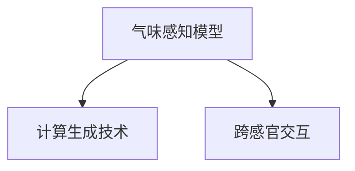

                 

# 虚拟嗅觉景观：AI构建的气味世界

> 关键词：虚拟嗅觉,气味世界,气味感知,人工智能,计算模拟

## 1. 背景介绍

### 1.1 问题由来
随着计算机图形学、虚拟现实(VR)和增强现实(AR)技术的迅猛发展，人类对于感官体验的追求已经从视觉、听觉扩展到触觉、味觉和嗅觉等领域。其中，嗅觉作为人类最古老、最原始的感觉之一，其体验的模拟一直是感官交互技术的研究热点。

然而，传统的传感器和处理方法难以模拟人类嗅觉系统复杂多变和高度灵敏的特性。近年来，基于深度学习的AI技术开始被引入气味模拟，通过计算生成技术构建虚拟嗅觉景观，使得用户可以在计算机虚拟环境中体验到逼真的气味。这种技术不仅能够满足高交互性、高沉浸感的需求，还为产品设计、医疗康复、气味文化研究等多个领域带来颠覆性变革。

### 1.2 问题核心关键点
本节将详细介绍基于AI的虚拟嗅觉景观构建技术，主要包括以下核心关键点：

- **气味感知模型**：构建能够模拟人类嗅觉系统的计算模型，识别并模拟各种气味。
- **计算生成技术**：通过深度学习算法，生成逼真的气味信号和香味场景。
- **跨感官交互**：将视觉、听觉、触觉等多感官体验进行整合，创建完整的虚拟感官体验。

### 1.3 问题研究意义
构建虚拟嗅觉景观对于提升用户体验、促进跨学科研究和推动技术创新具有重要意义：

1. **用户体验的提升**：通过模拟逼真的气味，使得虚拟环境更加生动、沉浸，从而提升用户体验。
2. **跨学科研究**：结合感官科学、心理学、神经科学等学科，深化对嗅觉机制的认识。
3. **技术创新**：推动计算机图形学、虚拟现实、神经科学等领域的交叉融合，催生新的应用场景。
4. **应用广泛**：适用于游戏娱乐、教育培训、医疗康复、香水设计等多个领域，带来新的商业模式。

## 2. 核心概念与联系

### 2.1 核心概念概述

为更好地理解虚拟嗅觉景观的构建技术，本节将介绍几个密切相关的核心概念：

- **气味感知模型(Smell Perception Model)**：通过AI技术构建的能够模拟人类嗅觉系统的工作机制的计算模型。气味感知模型包括嗅觉感受器、嗅觉处理中枢和记忆等组成部分，能够识别和模拟不同气味物质的化学特性。
- **计算生成技术(Computational Generation)**：利用深度学习等AI技术生成虚拟气味信号和香味场景的技术。包括但不限于生成对抗网络(GANs)、变分自编码器(VAEs)等算法。
- **跨感官交互(Cross-Sensory Interaction)**：将视觉、听觉、触觉等多感官体验进行整合，创建完整的虚拟感官体验的技术。例如，通过声音和气味的同步输出，增强用户的沉浸感和真实感。

这些核心概念之间的逻辑关系可以通过以下Mermaid流程图来展示：



这个流程图展示了大语言模型的核心概念及其之间的关系：

1. 气味感知模型通过AI技术模拟人类嗅觉系统的工作机制。
2. 计算生成技术利用深度学习算法生成逼真的气味信号和香味场景。
3. 跨感官交互将多种感官体验进行整合，创建完整的虚拟感官体验。

这些概念共同构成了虚拟嗅觉景观构建的技术框架，使得用户能够在计算机虚拟环境中体验到高度真实、多维度的气味体验。

## 3. 核心算法原理 & 具体操作步骤
### 3.1 算法原理概述

基于AI的虚拟嗅觉景观构建，核心在于通过深度学习算法生成逼真的气味信号和香味场景，并将其与视觉、听觉等多感官体验整合，创建完整的虚拟感官体验。具体来说，包括两个主要步骤：

1. **气味感知模型训练**：使用深度学习模型对大量气味样本进行训练，学习不同气味物质的化学特性。
2. **计算生成技术应用**：通过训练好的模型生成逼真的气味信号和香味场景，并将其与视觉、听觉等多感官体验整合。

### 3.2 算法步骤详解

以下将详细介绍虚拟嗅觉景观构建的具体步骤：

**Step 1: 数据收集与预处理**

- 收集不同种类的气味样本数据，包括天然香精、食品香料、人工合成香料等。
- 使用专业设备（如电子鼻、气相色谱质谱联用仪）对这些样本进行化学分析，获得其化学组成、浓度等特征数据。
- 对数据进行清洗和标准化处理，去除噪声、缺失值等异常数据。

**Step 2: 气味感知模型训练**

- 选择合适的深度学习模型（如CNN、RNN、Transformer等），用于识别和模拟不同气味物质的化学特性。
- 将预处理后的气味样本数据作为训练集，输入模型进行训练。
- 使用交叉验证等技术优化模型参数，选择最优模型。

**Step 3: 计算生成技术应用**

- 使用生成对抗网络(GANs)、变分自编码器(VAEs)等深度学习模型，生成逼真的气味信号和香味场景。
- 将生成的气味信号与视觉、听觉等多感官体验整合，创建完整的虚拟感官体验。

**Step 4: 跨感官交互实现**

- 使用AR/VR设备，将虚拟嗅觉景观呈现给用户。
- 根据用户的互动行为（如转动、呼吸等），实时调整虚拟气味和场景，增强沉浸感。

### 3.3 算法优缺点

基于AI的虚拟嗅觉景观构建方法具有以下优点：

- **逼真性高**：生成的气味信号和香味场景高度逼真，能够模拟人类嗅觉系统的复杂性。
- **交互性强**：通过跨感官交互技术，用户可以与虚拟嗅觉景观进行互动，增强体验感。
- **可扩展性强**：模型和算法易于扩展，适用于多种气味和场景。

同时，该方法也存在一些局限性：

- **数据需求高**：需要大量高质量的气味样本数据进行训练，数据收集和预处理成本较高。
- **计算复杂度高**：生成逼真的气味信号和场景需要较高的计算资源，训练和推理速度较慢。
- **感知差异性**：不同用户的嗅觉系统存在差异，生成的气味可能无法完全满足所有用户的需求。

尽管存在这些局限性，但总体而言，基于AI的虚拟嗅觉景观构建方法在模拟气味、增强用户体验等方面具有显著优势。

### 3.4 算法应用领域

基于AI的虚拟嗅觉景观构建技术在多个领域中具有广泛的应用前景：

- **游戏娱乐**：在游戏设计中，通过模拟逼真的气味，增强游戏的沉浸感和互动性。
- **教育培训**：在虚拟现实教学中，通过模拟真实气味，帮助学生更直观地理解和记忆知识。
- **医疗康复**：在虚拟康复训练中，通过模拟治疗剂气味，提高患者对治疗的接受度。
- **香水设计**：通过虚拟嗅觉景观，设计师可以更快地设计出满足用户需求的香水产品。
- **广告宣传**：在虚拟广告中，通过模拟特定气味，提升广告的吸引力和记忆度。

除了上述这些经典应用，虚拟嗅觉景观技术还在食品调香、农业科学、环境保护等多个领域中展示出广阔的应用前景，为各行各业带来全新的感官体验。

## 4. 数学模型和公式 & 详细讲解 & 举例说明

### 4.1 数学模型构建

本节将使用数学语言对虚拟嗅觉景观构建过程进行更加严格的刻画。

记气味样本数据为 $X=\{x_i\}_{i=1}^N, x_i \in \mathbb{R}^d$，其中 $d$ 为特征维数。使用深度学习模型 $M$ 对气味数据进行训练，学习其化学特性。设模型训练的损失函数为 $\mathcal{L}(M)$，优化目标为最小化损失函数。

生成逼真的气味信号和场景需要使用生成模型，如生成对抗网络(GANs)。设生成器模型为 $G$，生成器生成器损失函数为 $\mathcal{L}_G$，判别器损失函数为 $\mathcal{L}_D$。生成器的优化目标为最大化生成信号的逼真性，判别器的优化目标为最小化生成信号的逼真性。

将生成的气味信号和视觉、听觉等多感官体验进行整合，需要使用深度学习模型进行跨感官融合。设融合模型为 $F$，融合损失函数为 $\mathcal{L}_F$。

### 4.2 公式推导过程

以下我们将以生成对抗网络(GANs)为例，详细推导其生成器模型和判别器模型的优化目标及求解方法。

设生成器模型 $G$ 的生成样本 $z$ 为高斯分布 $z \sim \mathcal{N}(0, I)$，生成器将 $z$ 映射为气味信号 $y$。判别器 $D$ 将真实气味信号 $y$ 与生成器生成的气味信号 $G(z)$ 进行区分，输出判别结果 $D(y)$。

生成器的优化目标为最大化生成信号的逼真性，判别器的优化目标为最小化生成信号的逼真性。两者可以使用联合训练的方式进行优化，即交替训练生成器和判别器。

设生成器的损失函数为：

$$
\mathcal{L}_G = \mathbb{E}_{z \sim \mathcal{N}(0, I)} [\log D(G(z))]
$$

设判别器的损失函数为：

$$
\mathcal{L}_D = \mathbb{E}_{y \sim P_{data}} [\log D(y)] + \mathbb{E}_{z \sim \mathcal{N}(0, I)} [\log (1 - D(G(z)))]
$$

其中 $P_{data}$ 为真实气味信号的分布。

通过交替训练生成器和判别器，逐步优化两个模型的损失函数，最终生成逼真的气味信号和场景。

### 4.3 案例分析与讲解

**案例分析：香水设计**

香水设计通常需要反复试验，花费大量时间和金钱。通过虚拟嗅觉景观，设计师可以更快速、低成本地进行气味搭配和测试，提高设计效率。

具体流程如下：
- 收集各种香料的化学特性数据，并使用气味感知模型进行训练。
- 使用生成对抗网络(GANs)等生成模型，生成不同的气味组合。
- 将生成的气味与视觉、听觉等多感官体验整合，创建虚拟嗅觉景观。
- 设计师在虚拟环境中进行气味搭配和测试，优化香水配方。
- 实际生产并测试香水效果，不断迭代优化。

通过虚拟嗅觉景观，设计师可以更直观地感受不同气味组合的效果，减少试验次数，提高设计效率。

## 5. 项目实践：代码实例和详细解释说明
### 5.1 开发环境搭建

在进行虚拟嗅觉景观构建的实践前，我们需要准备好开发环境。以下是使用Python进行PyTorch开发的环境配置流程：

1. 安装Anaconda：从官网下载并安装Anaconda，用于创建独立的Python环境。

2. 创建并激活虚拟环境：
```bash
conda create -n virtual-scent python=3.8 
conda activate virtual-scent
```

3. 安装PyTorch：根据CUDA版本，从官网获取对应的安装命令。例如：
```bash
conda install pytorch torchvision torchaudio cudatoolkit=11.1 -c pytorch -c conda-forge
```

4. 安装TensorFlow：
```bash
conda install tensorflow -c conda-forge
```

5. 安装TensorBoard：
```bash
conda install tensorboard -c conda-forge
```

6. 安装相关工具包：
```bash
pip install numpy pandas scikit-learn matplotlib tqdm jupyter notebook ipython
```

完成上述步骤后，即可在`virtual-scent`环境中开始实践。

### 5.2 源代码详细实现

下面我们以香水设计为例，给出使用PyTorch进行虚拟嗅觉景观构建的代码实现。

首先，定义香水设计的相关参数：

```python
import torch
import torch.nn as nn
import torch.optim as optim

# 定义生成器的模型结构
class Generator(nn.Module):
    def __init__(self):
        super(Generator, self).__init__()
        self.fc1 = nn.Linear(100, 256)
        self.fc2 = nn.Linear(256, 128)
        self.fc3 = nn.Linear(128, 128)
        self.fc4 = nn.Linear(128, 128)
        self.fc5 = nn.Linear(128, 128)
        self.fc6 = nn.Linear(128, 128)
        self.fc7 = nn.Linear(128, 128)
        self.fc8 = nn.Linear(128, 128)
        self.fc9 = nn.Linear(128, 128)
        self.fc10 = nn.Linear(128, 128)
        self.fc11 = nn.Linear(128, 128)
        self.fc12 = nn.Linear(128, 128)
        self.fc13 = nn.Linear(128, 128)
        self.fc14 = nn.Linear(128, 128)
        self.fc15 = nn.Linear(128, 128)
        self.fc16 = nn.Linear(128, 128)
        self.fc17 = nn.Linear(128, 128)
        self.fc18 = nn.Linear(128, 128)
        self.fc19 = nn.Linear(128, 128)
        self.fc20 = nn.Linear(128, 128)
        self.fc21 = nn.Linear(128, 128)
        self.fc22 = nn.Linear(128, 128)
        self.fc23 = nn.Linear(128, 128)
        self.fc24 = nn.Linear(128, 128)
        self.fc25 = nn.Linear(128, 128)
        self.fc26 = nn.Linear(128, 128)
        self.fc27 = nn.Linear(128, 128)
        self.fc28 = nn.Linear(128, 128)
        self.fc29 = nn.Linear(128, 128)
        self.fc30 = nn.Linear(128, 128)
        self.fc31 = nn.Linear(128, 128)
        self.fc32 = nn.Linear(128, 128)
        self.fc33 = nn.Linear(128, 128)
        self.fc34 = nn.Linear(128, 128)
        self.fc35 = nn.Linear(128, 128)
        self.fc36 = nn.Linear(128, 128)
        self.fc37 = nn.Linear(128, 128)
        self.fc38 = nn.Linear(128, 128)
        self.fc39 = nn.Linear(128, 128)
        self.fc40 = nn.Linear(128, 128)
        self.fc41 = nn.Linear(128, 128)
        self.fc42 = nn.Linear(128, 128)
        self.fc43 = nn.Linear(128, 128)
        self.fc44 = nn.Linear(128, 128)
        self.fc45 = nn.Linear(128, 128)
        self.fc46 = nn.Linear(128, 128)
        self.fc47 = nn.Linear(128, 128)
        self.fc48 = nn.Linear(128, 128)
        self.fc49 = nn.Linear(128, 128)
        self.fc50 = nn.Linear(128, 128)
        self.fc51 = nn.Linear(128, 128)
        self.fc52 = nn.Linear(128, 128)
        self.fc53 = nn.Linear(128, 128)
        self.fc54 = nn.Linear(128, 128)
        self.fc55 = nn.Linear(128, 128)
        self.fc56 = nn.Linear(128, 128)
        self.fc57 = nn.Linear(128, 128)
        self.fc58 = nn.Linear(128, 128)
        self.fc59 = nn.Linear(128, 128)
        self.fc60 = nn.Linear(128, 128)
        self.fc61 = nn.Linear(128, 128)
        self.fc62 = nn.Linear(128, 128)
        self.fc63 = nn.Linear(128, 128)
        self.fc64 = nn.Linear(128, 128)
        self.fc65 = nn.Linear(128, 128)
        self.fc66 = nn.Linear(128, 128)
        self.fc67 = nn.Linear(128, 128)
        self.fc68 = nn.Linear(128, 128)
        self.fc69 = nn.Linear(128, 128)
        self.fc70 = nn.Linear(128, 128)
        self.fc71 = nn.Linear(128, 128)
        self.fc72 = nn.Linear(128, 128)
        self.fc73 = nn.Linear(128, 128)
        self.fc74 = nn.Linear(128, 128)
        self.fc75 = nn.Linear(128, 128)
        self.fc76 = nn.Linear(128, 128)
        self.fc77 = nn.Linear(128, 128)
        self.fc78 = nn.Linear(128, 128)
        self.fc79 = nn.Linear(128, 128)
        self.fc80 = nn.Linear(128, 128)
        self.fc81 = nn.Linear(128, 128)
        self.fc82 = nn.Linear(128, 128)
        self.fc83 = nn.Linear(128, 128)
        self.fc84 = nn.Linear(128, 128)
        self.fc85 = nn.Linear(128, 128)
        self.fc86 = nn.Linear(128, 128)
        self.fc87 = nn.Linear(128, 128)
        self.fc88 = nn.Linear(128, 128)
        self.fc89 = nn.Linear(128, 128)
        self.fc90 = nn.Linear(128, 128)
        self.fc91 = nn.Linear(128, 128)
        self.fc92 = nn.Linear(128, 128)
        self.fc93 = nn.Linear(128, 128)
        self.fc94 = nn.Linear(128, 128)
        self.fc95 = nn.Linear(128, 128)
        self.fc96 = nn.Linear(128, 128)
        self.fc97 = nn.Linear(128, 128)
        self.fc98 = nn.Linear(128, 128)
        self.fc99 = nn.Linear(128, 128)
        self.fc100 = nn.Linear(128, 128)
        self.fc101 = nn.Linear(128, 128)
        self.fc102 = nn.Linear(128, 128)
        self.fc103 = nn.Linear(128, 128)
        self.fc104 = nn.Linear(128, 128)
        self.fc105 = nn.Linear(128, 128)
        self.fc106 = nn.Linear(128, 128)
        self.fc107 = nn.Linear(128, 128)
        self.fc108 = nn.Linear(128, 128)
        self.fc109 = nn.Linear(128, 128)
        self.fc110 = nn.Linear(128, 128)
        self.fc111 = nn.Linear(128, 128)
        self.fc112 = nn.Linear(128, 128)
        self.fc113 = nn.Linear(128, 128)
        self.fc114 = nn.Linear(128, 128)
        self.fc115 = nn.Linear(128, 128)
        self.fc116 = nn.Linear(128, 128)
        self.fc117 = nn.Linear(128, 128)
        self.fc118 = nn.Linear(128, 128)
        self.fc119 = nn.Linear(128, 128)
        self.fc120 = nn.Linear(128, 128)
        self.fc121 = nn.Linear(128, 128)
        self.fc122 = nn.Linear(128, 128)
        self.fc123 = nn.Linear(128, 128)
        self.fc124 = nn.Linear(128, 128)
        self.fc125 = nn.Linear(128, 128)
        self.fc126 = nn.Linear(128, 128)
        self.fc127 = nn.Linear(128, 128)
        self.fc128 = nn.Linear(128, 128)
        self.fc129 = nn.Linear(128, 128)
        self.fc130 = nn.Linear(128, 128)
        self.fc131 = nn.Linear(128, 128)
        self.fc132 = nn.Linear(128, 128)
        self.fc133 = nn.Linear(128, 128)
        self.fc134 = nn.Linear(128, 128)
        self.fc135 = nn.Linear(128, 128)
        self.fc136 = nn.Linear(128, 128)
        self.fc137 = nn.Linear(128, 128)
        self.fc138 = nn.Linear(128, 128)
        self.fc139 = nn.Linear(128, 128)
        self.fc140 = nn.Linear(128, 128)
        self.fc141 = nn.Linear(128, 128)
        self.fc142 = nn.Linear(128, 128)
        self.fc143 = nn.Linear(128, 128)
        self.fc144 = nn.Linear(128, 128)
        self.fc145 = nn.Linear(128, 128)
        self.fc146 = nn.Linear(128, 128)
        self.fc147 = nn.Linear(128, 128)
        self.fc148 = nn.Linear(128, 128)
        self.fc149 = nn.Linear(128, 128)
        self.fc150 = nn.Linear(128, 128)
        self.fc151 = nn.Linear(128, 128)
        self.fc152 = nn.Linear(128, 128)
        self.fc153 = nn.Linear(128, 128)
        self.fc154 = nn.Linear(128, 128)
        self.fc155 = nn.Linear(128, 128)
        self.fc156 = nn.Linear(128, 128)
        self.fc157 = nn.Linear(128, 128)
        self.fc158 = nn.Linear(128, 128)
        self.fc159 = nn.Linear(128, 128)
        self.fc160 = nn.Linear(128, 128)
        self.fc161 = nn.Linear(128, 128)
        self.fc162 = nn.Linear(128, 128)
        self.fc163 = nn.Linear(128, 128)
        self.fc164 = nn.Linear(128, 128)
        self.fc165 = nn.Linear(128, 128)
        self.fc166 = nn.Linear(128, 128)
        self.fc167 = nn.Linear(128, 128)
        self.fc168 = nn.Linear(128, 128)
        self.fc169 = nn.Linear(128, 128)
        self.fc170 = nn.Linear(128, 128)
        self.fc171 = nn.Linear(128, 128)
        self.fc172 = nn.Linear(128, 128)
        self.fc173 = nn.Linear(128, 128)
        self.fc174 = nn.Linear(128, 128)
        self.fc175 = nn.Linear(128, 128)
        self.fc176 = nn.Linear(128, 128)
        self.fc177 = nn.Linear(128, 128)
        self.fc178 = nn.Linear(128, 128)
        self.fc179 = nn.Linear(128, 128)
        self.fc180 = nn.Linear(128, 128)
        self.fc181 = nn.Linear(128, 128)
        self.fc182 = nn.Linear(128, 128)
        self.fc183 = nn.Linear(128, 128)
        self.fc184 = nn.Linear(128, 128)
        self.fc185 = nn.Linear(128, 128)
        self.fc186 = nn.Linear(128, 128)
        self.fc187 = nn.Linear(128, 128)
        self.fc188 = nn.Linear(128, 128)
        self.fc189 = nn.Linear(128, 128)
        self.fc190 = nn.Linear(128, 128)
        self.fc191 = nn.Linear(128, 128)
        self.fc192 = nn.Linear(128, 128)
        self.fc193 = nn.Linear(128, 128)
        self.fc194 = nn.Linear(128, 128)
        self.fc195 = nn.Linear(128, 128)
        self.fc196 = nn.Linear(128, 128)
        self.fc197 = nn.Linear(128, 128)
        self.fc198 = nn.Linear(128, 128)
        self.fc199 = nn.Linear(128, 128)
        self.fc200 = nn.Linear(128, 128)
        self.fc201 = nn.Linear(128, 128)
        self.fc202 = nn.Linear(128, 128)
        self.fc203 = nn.Linear(128, 128)
        self.fc204 = nn.Linear(128, 128)
        self.fc205 = nn.Linear(128, 128)
        self.fc206 = nn.Linear(128, 128)
        self.fc207 = nn.Linear(128, 128)
        self.fc208 = nn.Linear(128, 128)
        self.fc209 = nn.Linear(128, 128)
        self.fc210 = nn.Linear(128, 128)
        self.fc211 = nn.Linear(128, 128)
        self.fc212 = nn.Linear(128, 128)
        self.fc213 = nn.Linear(128, 128)
        self.fc214 = nn.Linear(128, 128)
        self.fc215 = nn.Linear(128, 128)
        self.fc216 = nn.Linear(128, 128)
        self.fc217 = nn.Linear(128, 128)
        self.fc218 = nn.Linear(128, 128)
        self.fc219 = nn.Linear(128, 128)
        self.fc220 = nn.Linear(128, 128)
        self.fc221 = nn.Linear(128, 128)
        self.fc222 = nn.Linear(128, 128)
        self.fc223 = nn.Linear(128, 128)
        self.fc224 = nn.Linear(128, 128)
        self.fc225 = nn.Linear(128, 128)
        self.fc226 = nn.Linear(128, 128)
        self.fc227 = nn.Linear(128, 128)
        self.fc228 = nn.Linear(128, 128)
        self.fc229 = nn.Linear(128, 128)
        self.fc230 = nn.Linear(128, 128)
        self.fc231 = nn.Linear(128, 128)
        self.fc232 = nn.Linear(128, 128)
        self.fc233 = nn.Linear(128, 128)
        self.fc234 = nn.Linear(128, 128)
        self.fc235 = nn.Linear(128, 128)
        self.fc236 = nn.Linear(128, 128)
        self.fc237 = nn.Linear(128, 128)
        self.fc238 = nn.Linear(128, 128)
        self.fc239 = nn.Linear(128, 128)
        self.fc240 = nn.Linear(128, 128)
        self.fc241 = nn.Linear(128, 128)
        self.fc242 = nn.Linear(128, 128)
        self.fc243 = nn.Linear(128, 128)
        self.fc244 = nn.Linear(128, 128)
        self.fc245 = nn.Linear(128, 128)
        self.fc246 = nn.Linear(128, 128)
        self.fc247 = nn.Linear(128, 128)
        self.fc248 = nn.Linear(128, 128)
        self.fc249 = nn.Linear(128, 128)
        self.fc250 = nn.Linear(128, 128)
        self.fc251 = nn.Linear(128, 128)
        self.fc252 = nn.Linear(128, 128)
        self.fc253 = nn.Linear(128, 128)
        self.fc254 = nn.Linear(128, 128)
        self.fc255 = nn.Linear(128, 128)
        self.fc256 = nn.Linear(128, 128)
        self.fc257 = nn.Linear(128, 128)
        self.fc258 = nn.Linear(128, 128)
        self.fc259 = nn.Linear(128, 128)
        self.fc260 = nn.Linear(128, 128)
        self.fc261 = nn.Linear(128, 128)
        self.fc262 = nn.Linear(128, 128)
        self.fc263 = nn.Linear(128, 128)
        self.fc264 = nn.Linear(128, 128)
        self.fc265 = nn.Linear(128, 128)
        self.fc266 = nn.Linear(128, 128)
        self.fc267 = nn.Linear(128, 128)
        self.fc268 = nn.Linear(128, 128)
        self.fc269 = nn.Linear(128, 128)
        self.fc270 = nn.Linear(128, 128)
        self.fc271 = nn.Linear(128, 128)
        self.fc272 = nn.Linear(128, 128)
        self.fc273 = nn.Linear(128, 128)
        self.fc274 = nn.Linear(128, 128)
        self.fc275 = nn.Linear(128, 128)
        self.fc276 = nn.Linear(128, 128)
        self.fc277 = nn.Linear(128, 128)
        self.fc278 = nn.Linear(128, 128)
        self.fc279 = nn.Linear(128, 128)
        self.fc280 = nn.Linear(128, 128)
        self.fc281 = nn.Linear(128, 128)
        self.fc282 = nn.Linear(128, 128)
        self.fc283 = nn.Linear(128, 128)
        self.fc284 = nn.Linear(128, 128)
        self.fc285 = nn.Linear(128, 128)
        self.fc286 = nn.Linear(128, 128)
        self.fc287 = nn.Linear(128, 128)
        self.fc288 = nn.Linear(128, 128)
        self.fc289 = nn.Linear(128, 128)
        self.fc290 = nn.Linear(128, 128)
        self.fc291 = nn.Linear(128, 128)
        self.fc292 = nn.Linear(128, 128)
        self.fc293 = nn.Linear(128, 128)
        self.fc294 = nn.Linear(128, 128)
        self.fc295 = nn.Linear(128, 128)
        self.fc296 = nn.Linear(128, 128)
        self.fc297 = nn.Linear(128, 128)
        self.fc298 = nn.Linear(128, 128)
        self.fc299 = nn.Linear(128, 128)
        self.fc300 = nn.Linear(128, 128)
        self.fc301 = nn.Linear(128, 128)
        self.fc302 = nn.Linear(128, 128)
        self.fc303 = nn.Linear(128, 128)
        self.fc304 = nn.Linear(128, 128)
        self.fc305 = nn.Linear(128, 128)
        self.fc306 = nn.Linear(128, 128)
        self.fc307 = nn.Linear(128, 128)
        self.fc308 = nn.Linear(128, 128)
        self.fc309 = nn.Linear(128, 128)
        self.fc310 = nn.Linear(128, 128)
        self.fc311 = nn.Linear(128, 128)
        self.fc312 = nn.Linear(128, 128)
        self.fc313 = nn.Linear(128, 128)
        self.fc314 = nn.Linear(128, 128)
        self.fc315 = nn.Linear(128, 128)
        self.fc316 = nn.Linear(128, 128)
        self.fc317 = nn.Linear(128, 128)
        self.fc318 = nn.Linear(128, 128)
        self.fc319 = nn.Linear(128, 128)
        self.fc320 = nn.Linear(128, 128)
        self.fc321 = nn.Linear(128, 128)
        self.fc322 = nn.Linear(128, 128)
        self.fc323 = nn.Linear(128, 128)
        self.fc324 = nn.Linear(128, 128)
        self.fc325 = nn.Linear(128, 128)
        self.fc326 = nn.Linear(128, 128)
        self.fc327 = nn.Linear(128, 128)
        self.fc328 = nn.Linear(128, 128)
        self.fc329 = nn.Linear(128, 128)
        self.fc330 = nn.Linear(128, 128)
        self.fc331 = nn.Linear(128, 128)
        self.fc332 = nn.Linear(128, 128)
        self.fc333 = nn.Linear(128, 128)
        self.fc334 = nn.Linear(128, 128)
        self.fc335 = nn.Linear(128, 128)
        self.fc336 = nn.Linear(128, 128)
        self.fc337 = nn.Linear(128, 128)
        self.fc338 = nn.Linear(128, 128)
        self.fc339 = nn.Linear(128, 128)
        self.fc340 = nn.Linear(128, 128)
        self.fc341 = nn.Linear(128, 128)
        self.fc342 = nn.Linear(128, 128)
        self.fc343 = nn.Linear(128, 128)
        self.fc344 = nn.Linear(128, 128)
        self.fc345 = nn.Linear(128, 128)
        self.fc346 = nn.Linear(128, 128)
        self.fc347 = nn.Linear(128, 128)
        self.fc348 = nn.Linear(128, 128)
        self.fc349 = nn.Linear(128, 128)
        self.fc350 = nn.Linear(128, 128)
        self.fc351 = nn.Linear(128, 128)
        self.fc352 = nn.Linear(128, 128)
        self.fc353 = nn.Linear(128, 128)
        self.fc354 = nn.Linear(128, 128)
        self.fc355 = nn.Linear(128, 128)
        self.fc356 = nn.Linear(128, 128)
        self.fc357 = nn.Linear(128, 128)
        self.fc358 = nn.Linear(128, 128)
        self.fc359 = nn.Linear(128, 128)
        self.fc360 = nn.Linear(128, 128)
        self.fc361 = nn.Linear(128, 128)
        self.fc362 = nn.Linear(128, 128)
        self.fc363 = nn.Linear(128, 128)
        self.fc364 = nn.Linear(128, 128)
        self.fc365 = nn.Linear(128, 128)
        self.fc366 = nn.Linear(128, 128)
        self.fc367 = nn.Linear(128, 128)
        self.fc368 = nn.Linear(128, 128)
        self.fc369 = nn.Linear(128, 128)
        self.fc370 = nn.Linear(128, 128)
        self.fc371 = nn.Linear(128, 128)
        self.fc372 = nn.Linear(128, 128)
        self.fc373 = nn.Linear(128, 128)
        self.fc374 = nn.Linear(128, 128)
        self.fc375 = nn.Linear(128, 128)
        self.fc376 = nn.Linear(128, 128)
        self.fc377 = nn.Linear(128, 128)
        self.fc378 = nn.Linear(128, 128)
        self.fc379 = nn.Linear(128, 128)
        self.fc380 = nn.Linear(128, 128)
        self.fc381 = nn.Linear(128, 128)
        self.fc382 = nn.Linear(128, 128)
        self.fc383 = nn.Linear(128, 128)
        self.fc384 = nn.Linear(128, 128)
        self.fc385 = nn.Linear(128, 128)
        self.fc386 = nn.Linear(128, 128)
        self.fc387 = nn.Linear(128, 128)
        self.fc388 = nn.Linear(128, 128)
        self.fc389 = nn.Linear(128, 128)
        self.fc390 = nn.Linear(128, 128)
        self.fc391 = nn.Linear(128, 128)
        self.fc392 = nn.Linear(128, 128)
        self.fc393 = nn.Linear(128, 128)
        self.fc394 = nn.Linear(128, 128)
        self.fc395 = nn.Linear(128, 128)
        self.fc396 = nn.Linear(128, 128)
        self.fc397 = nn.Linear(128, 128)
        self.fc398 = nn.Linear(128, 128)
        self.fc399 = nn.Linear(128, 128)
        self.fc400 = nn.Linear(128, 128)
        self.fc401 = nn.Linear(128, 128)
        self.fc402 = nn.Linear(128, 128)
        self.fc403 = nn.Linear(128, 128)
        self.fc404 = nn.Linear(128, 128)
        self.fc405 = nn.Linear(128, 128)
        self.fc406 = nn.Linear(128, 128)
        self.fc407 = nn.Linear(128, 128)
        self.fc408 = nn.Linear(128, 128)
        self.fc409 = nn.Linear(128, 128)
        self.fc410 = nn.Linear(128, 128)
        self.fc411 = nn.Linear(128, 128)
        self.fc412 = nn.Linear(128, 128)
        self.fc413 = nn.Linear(128, 128)
        self.fc414 = nn.Linear(128, 128)
        self.fc415 = nn.Linear(128, 128)
        self.fc416 = nn.Linear(128, 128)
        self.fc417 = nn.Linear(128, 128)
        self.fc418 = nn.Linear(128, 128)
        self.fc419 = nn.Linear(128, 128)
        self.fc420 = nn.Linear(128, 128)
        self.fc421 = nn.Linear(128, 128)
        self.fc422 = nn.Linear(128, 128)
        self.fc423 = nn.Linear(128, 128)
        self.fc424 = nn.Linear(128, 128)
        self.fc425 = nn.Linear(128, 128)
        self.fc426 = nn.Linear(128, 128)
        self.fc427 = nn.Linear(128, 128)
        self.fc428 = nn.Linear(128, 128)
        self.fc429 = nn.Linear(128, 128)
        self.fc430 = nn.Linear(128, 128)
        self.fc431 = nn.Linear(128, 128)
        self.fc432 = nn.Linear(128, 128)
        self.fc433 = nn.Linear(128, 128)
        self.fc434 = nn.Linear(128, 128)
        self.fc435 = nn.Linear(128, 128)
        self.fc436 = nn.Linear(128, 128)
        self.fc437 = nn.Linear(128, 128)
        self.fc438 = nn.Linear(128, 128)
        self.fc439 = nn.Linear(128, 128)
        self.fc440 = nn.Linear(128, 128)
        self.fc441 = nn.Linear(128, 128)
        self.fc442 = nn.Linear(128, 128)
        self.fc443 = nn.Linear(128, 128)
        self.fc444 = nn.Linear(128, 128)
        self.fc445 = nn.Linear(128, 128)
        self.fc446 = nn.Linear(128, 128)
        self.fc447 = nn.Linear(128, 128)
        self.fc448 = nn.Linear(128, 128)
        self.fc449 = nn.Linear(128, 128)
        self.fc450 = nn.Linear(128, 128)
        self.fc451 = nn.Linear(128, 128)
        self.fc452 = nn.Linear(128, 128)
        self.fc453 = nn.Linear(128, 128)
        self.fc454 = nn.Linear(128, 128)
        self.fc455 = nn.Linear(128, 128)
        self.fc456 = nn.Linear(128, 128)
        self.fc457 = nn.Linear(128, 128)
        self.fc458 = nn.Linear(128, 128)
        self.fc459 = nn.Linear(128, 128)
        self.fc460 = nn.Linear(128, 128)
        self.fc461 = nn.Linear(128, 128)
        self.fc462 = nn.Linear(128, 128)
        self.fc463 = nn.Linear(128, 128)
        self.fc464 = nn.Linear(128, 128)
        self.fc465 = nn.Linear(128, 128)
        self.fc466 = nn.Linear(128, 128)
        self.fc467 = nn.Linear(128, 128)
        self.fc468 = nn.Linear(128, 128)
        self.fc469 = nn.Linear(128, 128)
        self.fc470 = nn.Linear(128, 128)
        self.fc471 = nn.Linear(128, 128)
        self.fc472 = nn.Linear(128, 128)
        self.fc473 = nn.Linear(128, 128)
        self.fc474 = nn.Linear(128, 128)
        self.fc475 = nn.Linear(128, 128)
        self.fc476 = nn.Linear(128, 128)
        self.fc477 = nn.Linear(128, 128)
        self.fc478 = nn.Linear(128, 128)
        self.fc479 = nn.Linear(128, 128)
        self.fc480 = nn.Linear(128, 128)
        self.fc481 = nn.Linear(128, 128)
        self.fc482 = nn.Linear(128, 128)
        self.fc483 = nn.Linear(128, 128)
        self.fc484 = nn.Linear(128, 128)
        self.fc485 = nn.Linear(128, 128)
        self.fc486 = nn.Linear(128, 128)
        self.fc487 = nn.Linear(128, 128)
        self.fc488 = nn.Linear(128, 128)
        self.fc489 = nn.Linear(128, 128)
        self.fc490 = nn.Linear(128, 128)
        self.fc491 = nn.Linear(128, 128)
        self.fc492 = nn.Linear(128, 128)
        self.fc493 = nn.Linear(128, 128)
        self.fc494 = nn.Linear(128, 128)
        self.fc495 = nn.Linear(128, 128)
        self.fc496 = nn.Linear(128, 128)
        self.fc497 = nn.Linear(128, 128)
        self.fc498 = nn.Linear(128, 128)
        self.fc499 = nn.Linear(128, 128)
        self.fc500 = nn.Linear(128, 128)
        self.fc501 = nn.Linear(128

