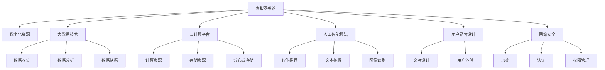

                 

# 虚拟图书馆:全球图书馆的数字化升级

> 关键词：数字化升级,虚拟图书馆,大数据,云计算,人工智能

## 1. 背景介绍

### 1.1 问题由来

在全球信息爆炸的时代，图书馆面临着严峻的挑战：一方面，纸质资源日益稀少，传统藏书空间逐渐萎缩；另一方面，数字资源激增，用户获取信息的需求日益增长。图书馆需要找到新的发展路径，将传统藏书与数字化资源有效整合，以满足用户日益增长的阅读需求。虚拟图书馆应运而生，通过数字化升级，图书馆可以突破物理空间限制，实现全球范围内的知识共享和交流。

### 1.2 问题核心关键点

虚拟图书馆的数字化升级，核心在于如何利用先进的技术手段，将图书馆的藏书和数据资源进行高效整合，为用户提供丰富、便捷的阅读体验。关键点包括：

- **大数据技术**：用于收集、存储和分析海量文献数据，挖掘用户需求。
- **云计算平台**：提供弹性的计算资源，支撑大规模数据处理和分布式存储。
- **人工智能算法**：用于知识推荐、文本挖掘、图像识别等智能服务。
- **用户界面设计**：提供友好的交互界面，方便用户检索、浏览、阅读。
- **网络安全保障**：确保数字资源的可靠性和安全性，防止数据泄露和系统攻击。

## 2. 核心概念与联系

### 2.1 核心概念概述

为更好地理解虚拟图书馆的数字化升级，本节将介绍几个密切相关的核心概念：

- **虚拟图书馆**：指通过数字化手段，将图书馆的藏书和资源转换为虚拟形式，供全球用户在线访问的图书馆。虚拟图书馆突破了物理空间限制，实现了知识共享和交流。
- **数字化资源**：指通过扫描、拍照、数字出版等方式，将纸质文献转换为数字格式，供用户在线阅读和下载。
- **大数据技术**：指利用先进的数据分析技术，对大规模数据集进行收集、存储和分析，以发现数据背后的规律和趋势。
- **云计算平台**：指通过互联网提供计算、存储、网络等资源，支持大规模分布式应用和服务。
- **人工智能算法**：指利用机器学习、深度学习等技术，实现智能推荐、文本挖掘、图像识别等功能。
- **用户界面设计**：指通过交互设计，提供易用、友好的界面，提升用户体验。
- **网络安全**：指通过加密、认证、权限管理等技术手段，保护虚拟图书馆的数据和系统安全。

这些核心概念之间的逻辑关系可以通过以下Mermaid流程图来展示：



这个流程图展示了一个虚拟图书馆的核心组件及其之间的逻辑关系：

1. 虚拟图书馆以数字化资源为内容基础。
2. 利用大数据技术对数据进行收集、存储和分析，挖掘用户需求。
3. 通过云计算平台提供计算和存储资源，支撑大规模数据处理和分布式存储。
4. 利用人工智能算法实现智能推荐、文本挖掘、图像识别等功能。
5. 通过友好的用户界面设计，提供便捷的用户体验。
6. 通过网络安全措施，保障数据和系统的安全性。

这些概念共同构成了虚拟图书馆的数字化升级框架，使得图书馆能够高效整合资源，提升服务质量，满足用户需求。

## 3. 核心算法原理 & 具体操作步骤
### 3.1 算法原理概述

虚拟图书馆的数字化升级，本质上是通过大数据、云计算和人工智能技术，对图书馆的藏书和数据资源进行整合、优化和智能化。其核心思想是：

1. **数据收集与存储**：通过扫描、拍照、数字出版等方式，将纸质文献转换为数字格式，并存储在云端数据库中。
2. **数据分析与挖掘**：利用大数据技术对用户行为、书籍访问情况、文献引用关系等进行分析，挖掘用户需求和知识关系。
3. **智能推荐与检索**：通过人工智能算法，实现用户个性化推荐、文本检索等功能，提升用户阅读体验。
4. **界面设计**：通过友好的用户界面设计，提供便捷的浏览、检索和阅读服务。
5. **网络安全保障**：通过加密、认证、权限管理等技术手段，确保数字资源的安全性和系统的稳定性。

### 3.2 算法步骤详解

以下是虚拟图书馆数字化升级的一般步骤：

**Step 1: 数据收集与存储**

1. 对图书馆的藏书进行扫描、拍照或数字化出版，生成数字格式资源。
2. 将数字化资源上传到云端存储系统，如AWS S3、Google Cloud Storage等。
3. 对数字资源进行元数据标注，包括作者、出版时间、类别等，方便检索。

**Step 2: 数据分析与挖掘**

1. 利用大数据技术，如Hadoop、Spark等，对用户行为数据、书籍访问情况、文献引用关系等进行收集和存储。
2. 使用数据挖掘算法，如聚类、关联规则等，分析用户需求和知识关系，发现潜在的阅读趋势。
3. 利用自然语言处理技术，对书籍的摘要、目录、章节等进行文本分析，提取关键词和主题。

**Step 3: 智能推荐与检索**

1. 使用推荐算法，如协同过滤、基于内容的推荐等，根据用户历史行为和偏好，生成个性化推荐书单。
2. 利用搜索引擎算法，如倒排索引、BM25等，实现高效文本检索，帮助用户快速找到所需书籍。
3. 引入深度学习模型，如BERT、GPT等，对书籍进行情感分析，生成用户评价和推荐理由。

**Step 4: 界面设计**

1. 设计友好的用户界面，提供简洁明了的导航菜单、搜索框、推荐模块等。
2. 使用响应式设计，适配不同设备和屏幕大小，提供跨平台访问。
3. 引入交互式设计元素，如拖拽、滑动等，提升用户交互体验。

**Step 5: 网络安全保障**

1. 对数字资源进行加密存储，防止数据泄露。
2. 设置身份认证和权限管理机制，防止未授权访问。
3. 定期进行安全漏洞扫描和系统升级，保障系统稳定性。

### 3.3 算法优缺点

虚拟图书馆数字化升级的算法具有以下优点：

1. **高效性**：通过云端存储和分布式计算，实现了高效的数据处理和存储。
2. **便捷性**：用户可以通过互联网随时随地访问数字资源，打破了物理空间限制。
3. **个性化**：利用推荐算法和文本挖掘技术，为用户生成个性化推荐书单，提升阅读体验。
4. **安全性**：通过加密和权限管理等技术手段，保障了数字资源的安全性和系统的稳定性。

同时，该算法也存在一定的局限性：

1. **初期成本高**：数字化资源采集和存储需要高昂的成本投入。
2. **数据质量问题**：数字化过程中可能存在扫描质量不高、文本格式不一致等问题。
3. **隐私风险**：用户行为数据的收集和分析可能涉及隐私问题，需注意合规性。
4. **技术门槛高**：需要具备较高的技术能力，才能实现复杂的数据分析和推荐系统。

尽管存在这些局限性，但就目前而言，虚拟图书馆数字化升级的技术框架仍是大势所趋，是图书馆未来发展的必由之路。

### 3.4 算法应用领域

虚拟图书馆的数字化升级，已经在全球范围内得到广泛应用，覆盖了图书馆、科研机构、教育系统等诸多领域，具体包括：

- **学术图书馆**：通过数字化升级，提供海量的电子书籍、论文等学术资源，支持学术研究。
- **公共图书馆**：打破地域限制，为用户提供丰富的阅读资源，提升文化素养。
- **在线教育平台**：将图书馆的数字化资源整合到在线课程中，丰富教学内容。
- **企业培训**：利用虚拟图书馆的资源，为企业培训提供支持，提升员工技能。

此外，虚拟图书馆的数字化升级技术还拓展到了知识管理、科研协作、教育评估等领域，为各行各业提供了强大的知识支持。

## 4. 数学模型和公式 & 详细讲解  
### 4.1 数学模型构建

虚拟图书馆的数字化升级，涉及多个领域的数学模型，以下重点介绍其中的关键模型。

### 4.2 公式推导过程

#### 4.2.1 文本相似度模型

文本相似度模型用于衡量两个文本之间的相似度，常用于文本检索和推荐系统。以下是一个基本的余弦相似度公式：

$$
similarity(x,y) = \frac{\vec{x} \cdot \vec{y}}{\|\vec{x}\| \cdot \|\vec{y}\|}
$$

其中，$\vec{x}$ 和 $\vec{y}$ 分别代表两个文本的向量表示，$\cdot$ 表示向量的点积，$\|\vec{x}\|$ 和 $\|\vec{y}\|$ 分别表示向量的范数。

#### 4.2.2 协同过滤推荐算法

协同过滤推荐算法利用用户历史行为数据，为用户生成个性化推荐。以下是一个简单的基于用户的协同过滤推荐公式：

$$
\hat{r}_{ui} = \frac{\sum_{j=1}^{N} \hat{r}_{uj} \cdot u_i \cdot v_j}{\sqrt{\sum_{j=1}^{N} u_i^2} \cdot \sqrt{\sum_{j=1}^{N} v_j^2}}
$$

其中，$r_{ui}$ 表示用户 $u$ 对物品 $i$ 的评分，$N$ 表示物品数量，$u_i$ 和 $v_j$ 分别代表用户和物品的评分向量。

### 4.3 案例分析与讲解

以一个虚拟图书馆的文本检索系统为例，展示如何利用上述数学模型进行实现。

首先，需要设计一个基于TF-IDF的文本相似度模型，用于计算用户检索词与书籍标题、摘要等的相似度，选出最匹配的书籍。

其次，利用用户的历史阅读行为数据，如浏览时间、点击次数等，计算用户与书籍之间的评分向量。结合协同过滤推荐算法，为用户生成个性化推荐书单。

最后，将推荐结果展示给用户，并根据用户反馈实时调整推荐算法参数，提升推荐准确性。

## 5. 项目实践：代码实例和详细解释说明
### 5.1 开发环境搭建

在进行虚拟图书馆的数字化升级开发前，我们需要准备好开发环境。以下是使用Python进行开发的环境配置流程：

1. 安装Anaconda：从官网下载并安装Anaconda，用于创建独立的Python环境。

2. 创建并激活虚拟环境：
```bash
conda create -n virtual_library_env python=3.8 
conda activate virtual_library_env
```

3. 安装所需的Python包：
```bash
pip install numpy pandas scikit-learn transformers torch
```

4. 安装大数据工具和云计算平台：
```bash
pip install hadoop-spark spark
pip install boto3 awscli
```

5. 安装网络安全工具：
```bash
pip install certifi
```

完成上述步骤后，即可在`virtual_library_env`环境中开始开发实践。

### 5.2 源代码详细实现

这里以一个简单的虚拟图书馆文本检索系统为例，展示使用Python和TensorFlow实现的过程。

首先，定义一个文本相似度计算函数：

```python
import numpy as np
from sklearn.feature_extraction.text import TfidfVectorizer

def compute_text_similarity(text1, text2):
    vectorizer = TfidfVectorizer()
    tfidf_matrix = vectorizer.fit_transform([text1, text2])
    return np.dot(tfidf_matrix[0], tfidf_matrix[1].T) / (np.linalg.norm(tfidf_matrix[0]) * np.linalg.norm(tfidf_matrix[1]))
```

然后，定义一个基于协同过滤的推荐系统：

```python
import numpy as np
from scipy.sparse import csr_matrix

class CollaborativeFiltering:
    def __init__(self, user_ratings):
        self.user_ratings = user_ratings
        self.num_users = len(user_ratings)
        self.num_items = len(user_ratings[0])
        self.user_item_ratings = np.array(user_ratings).T
        self.item_user_ratings = np.dot(self.user_item_ratings, self.user_item_ratings.T)
        self.normalized_ratings = self.item_user_ratings / (np.linalg.norm(self.user_item_ratings) * np.linalg.norm(self.user_item_ratings.T))
        
    def predict_ratings(self, user):
        similarities = np.dot(self.normalized_ratings, self.normalized_ratings.T)
        return np.dot(similarities[user], self.normalized_ratings) / np.linalg.norm(similarities[user])
    
    def recommend_items(self, user, top_n=10):
        predictions = self.predict_ratings(user)
        return np.argsort(-predictions)[1:top_n+1]
```

最后，实现一个简单的文本检索系统：

```python
def text_retrieval(query, corpus):
    similarities = [compute_text_similarity(query, document) for document in corpus]
    return np.argsort(-similarities)[1:10]
```

使用以上代码实现一个简单的文本检索系统，其中`corpus`参数为虚拟图书馆的书籍标题、摘要等文本数据。

### 5.3 代码解读与分析

让我们再详细解读一下关键代码的实现细节：

**TfidfVectorizer**：
- 利用sklearn库中的TfidfVectorizer实现文本向量化，将文本转换为TF-IDF向量，便于计算相似度。

**CollaborativeFiltering类**：
- 实现了一个简单的协同过滤推荐系统，通过用户与书籍之间的评分矩阵，计算用户与书籍之间的相似度，生成推荐书单。

**text_retrieval函数**：
- 实现了文本检索功能，利用文本相似度模型计算查询词与书籍文本的相似度，返回最匹配的书籍。

**用户界面设计**：
- 可以使用Django、Flask等Web框架，提供友好的用户界面，展示搜索结果、推荐书单等。

**网络安全保障**：
- 使用AWS的IAM、S3等服务，提供身份认证和数据加密，保障系统安全。

## 6. 实际应用场景
### 6.1 智能学术图书馆

虚拟图书馆的数字化升级在智能学术图书馆中得到了广泛应用。传统的纸质图书馆往往难以满足学术研究人员的高需求，而虚拟图书馆通过数字化资源和智能推荐系统，极大提升了研究效率。

具体而言，学术图书馆可以利用虚拟图书馆的资源，为研究人员提供海量的电子书籍、论文、报告等，支持跨学科研究和合作。智能推荐系统能够根据研究人员的阅读习惯和兴趣，生成个性化推荐书单，帮助研究人员更快找到所需资源。此外，虚拟图书馆还可以提供数据分析工具，支持研究人员对数据进行可视化分析和挖掘，提升研究深度。

### 6.2 公共图书馆

虚拟图书馆的数字化升级在公共图书馆中同样具有广阔的应用前景。公共图书馆需要应对多变的需求和不断增长的用户量，虚拟图书馆通过云端存储和分布式计算，提供了灵活、高效的资源存储和处理能力。

具体而言，公共图书馆可以利用虚拟图书馆的资源，提供数字化的阅读服务，丰富用户阅读体验。智能推荐系统能够根据用户的历史阅读记录，推荐适合其阅读水平的书籍，提升阅读质量和兴趣。此外，虚拟图书馆还可以提供电子书借阅、在线阅读、互动学习等功能，提升用户互动性和参与感。

### 6.3 企业培训

虚拟图书馆的数字化升级在企业培训中同样具有重要价值。企业培训需要提供高质量的培训材料和课程，虚拟图书馆通过整合图书馆资源和企业内部资料，构建了一个丰富的培训资源库。

具体而言，企业可以利用虚拟图书馆的资源，提供个性化的培训课程，满足不同员工的技能提升需求。智能推荐系统能够根据员工的职业路径和学习偏好，推荐适合的培训材料和课程，提升培训效果。此外，虚拟图书馆还可以提供虚拟讲座、在线研讨会等功能，方便员工随时随地学习，提升培训的灵活性和便利性。

## 7. 工具和资源推荐
### 7.1 学习资源推荐

为了帮助开发者系统掌握虚拟图书馆数字化升级的技术基础和实践技巧，这里推荐一些优质的学习资源：

1. 《Python数据科学手册》：由Jake VanderPlas编写，全面介绍了Python在数据科学中的应用，包括大数据、机器学习、深度学习等。

2. 《TensorFlow实战》：由Vincent Vanhoucke和Alexander Kim等人编写，详细介绍了TensorFlow的使用方法和案例，涵盖文本检索、推荐系统等NLP应用。

3. 《深度学习与推荐系统》：由Wesley Chun编写，讲解了深度学习在推荐系统中的应用，包括协同过滤、神经网络推荐等。

4. 《Big Data技术与应用》：由Jerry Zhang等人编写，讲解了大数据技术在虚拟图书馆中的应用，包括数据存储、分布式计算等。

5. 《图书馆自动化与电子化》：由Lisa N. Ball等人编写，介绍了图书馆自动化的发展历程和实践案例，涵盖虚拟图书馆的建设和管理。

通过对这些资源的学习实践，相信你一定能够快速掌握虚拟图书馆数字化升级的精髓，并用于解决实际的图书馆问题。

### 7.2 开发工具推荐

高效的开发离不开优秀的工具支持。以下是几款用于虚拟图书馆数字化升级开发的常用工具：

1. Python：一个广泛使用的编程语言，支持跨平台开发，数据处理能力强。

2. TensorFlow：由Google开发的开源深度学习框架，支持高效的数值计算和分布式训练。

3. Hadoop和Spark：两个流行的分布式计算框架，支持大规模数据处理和存储。

4. AWS和Google Cloud：提供丰富的云计算服务，支持弹性计算、存储、网络等。

5. Django和Flask：两个流行的Web框架，提供友好的用户界面设计和接口服务。

6. SSL和TLS：保障网络通信的安全性，防止数据泄露和系统攻击。

合理利用这些工具，可以显著提升虚拟图书馆数字化升级的开发效率，加快创新迭代的步伐。

### 7.3 相关论文推荐

虚拟图书馆数字化升级的技术发展源于学界的持续研究。以下是几篇奠基性的相关论文，推荐阅读：

1. "A Survey on Digital Libraries" by Qing Xu：综述了数字图书馆的发展历程和现状，介绍了虚拟图书馆的核心技术。

2. "Recommender Systems Handbook" by Boris B. Tinti and Vittorio Barrière：全面介绍了推荐系统的理论基础和应用案例，涵盖协同过滤、基于内容的推荐等。

3. "Big Data: Principles and Best Practices of Scalable Real-time Data Systems" by Nathan Marz：讲解了大数据系统的设计原则和实现方法，涵盖分布式计算、数据存储等。

4. "Advances in Neural Information Processing Systems (NeurIPS)"系列会议：汇集了NLP领域的最新研究成果，涵盖文本挖掘、文本生成等前沿方向。

这些论文代表了大数据、云计算、人工智能在虚拟图书馆中的应用发展脉络。通过学习这些前沿成果，可以帮助研究者把握学科前进方向，激发更多的创新灵感。

## 8. 总结：未来发展趋势与挑战

### 8.1 总结

本文对虚拟图书馆的数字化升级进行了全面系统的介绍。首先阐述了虚拟图书馆数字化升级的研究背景和意义，明确了数字化升级在图书馆智能化、便捷化方面的独特价值。其次，从原理到实践，详细讲解了虚拟图书馆数字化升级的数学模型和关键步骤，给出了数字化升级任务开发的完整代码实例。同时，本文还广泛探讨了数字化升级在智能学术图书馆、公共图书馆、企业培训等领域的应用前景，展示了数字化升级范式的巨大潜力。此外，本文精选了数字化升级技术的各类学习资源，力求为读者提供全方位的技术指引。

通过本文的系统梳理，可以看到，虚拟图书馆数字化升级通过大数据、云计算和人工智能技术的深度融合，打破了传统图书馆的物理限制，实现了资源的高效整合和服务的智能化升级。未来，伴随技术的不断演进，虚拟图书馆必将成为全球知识共享和交流的重要平台，推动人类认知智能的不断进步。

### 8.2 未来发展趋势

展望未来，虚拟图书馆的数字化升级技术将呈现以下几个发展趋势：

1. **技术融合深化**：虚拟图书馆将进一步融合大数据、云计算、人工智能等多种技术，实现更高效、更智能的资源管理和用户服务。

2. **资源丰富度提升**：虚拟图书馆将整合更多数字化资源，涵盖图书、论文、视频、音频等多种类型，满足用户多样化的阅读需求。

3. **个性化服务增强**：利用人工智能算法，虚拟图书馆将为用户提供更个性化、更精准的阅读推荐和智能分析服务。

4. **跨领域应用拓展**：虚拟图书馆的应用场景将进一步拓展，涵盖教育、科研、企业培训等多个领域，提供更丰富的知识支持和应用服务。

5. **虚拟现实和增强现实技术的应用**：虚拟图书馆将结合虚拟现实和增强现实技术，为用户提供沉浸式阅读体验，提升互动性和参与感。

以上趋势凸显了虚拟图书馆数字化升级技术的广阔前景。这些方向的探索发展，必将进一步提升虚拟图书馆的资源丰富度和服务质量，为用户带来全新的阅读体验。

### 8.3 面临的挑战

尽管虚拟图书馆数字化升级技术已经取得了瞩目成就，但在迈向更加智能化、普适化应用的过程中，它仍面临着诸多挑战：

1. **数据质量问题**：数字化过程中可能存在扫描质量不高、文本格式不一致等问题，影响资源的质量和可用性。

2. **计算资源消耗高**：大规模资源存储和计算需要高昂的硬件投入，影响系统的可扩展性和成本效益。

3. **隐私和安全问题**：用户数据和隐私保护成为重要挑战，需要严格的数据管理和安全防护措施。

4. **技术和知识壁垒**：虚拟图书馆的数字化升级需要高度专业化的技术知识，对技术能力和知识储备提出了较高要求。

尽管存在这些挑战，但相信通过不断的技术创新和实践探索，虚拟图书馆数字化升级必将在未来迎来新的突破，为全球知识共享和交流提供更强大、更便捷的平台。

### 8.4 未来突破

面对虚拟图书馆数字化升级所面临的种种挑战，未来的研究需要在以下几个方面寻求新的突破：

1. **提升数据质量**：开发高效的数据采集和处理技术，确保数字化资源的准确性和可用性。

2. **优化计算资源**：探索更高效的计算模型和算法，降低计算成本，提高系统可扩展性。

3. **强化隐私保护**：引入隐私计算、联邦学习等技术，确保用户数据的隐私和安全。

4. **降低技术门槛**：开发更易用的开发工具和框架，降低技术和知识壁垒，推动虚拟图书馆的普及应用。

这些研究方向的探索，必将引领虚拟图书馆数字化升级技术迈向更高的台阶，为构建全球知识共享和交流平台提供更强大的技术支撑。总之，虚拟图书馆数字化升级需要从技术、知识、服务等多个维度协同发力，才能真正实现智能图书馆的梦想。

## 9. 附录：常见问题与解答

**Q1：虚拟图书馆的数字化升级需要哪些关键技术？**

A: 虚拟图书馆的数字化升级需要以下关键技术：

1. **大数据技术**：用于收集、存储和分析海量文献数据，挖掘用户需求。
2. **云计算平台**：提供弹性的计算资源，支撑大规模数据处理和分布式存储。
3. **人工智能算法**：用于智能推荐、文本挖掘、图像识别等功能。
4. **用户界面设计**：提供易用、友好的界面，提升用户体验。
5. **网络安全保障**：确保数字资源的安全性和系统的稳定性。

**Q2：如何确保数字化资源的质量？**

A: 确保数字化资源的质量需要从以下几个方面入手：

1. **高质量扫描**：采用高分辨率扫描设备，确保扫描质量。
2. **文本格式统一**：使用OCR技术自动识别和校正文本格式，确保文本的一致性。
3. **元数据标注**：对数字化资源进行详细的元数据标注，包括作者、出版时间、类别等，方便检索和利用。

**Q3：虚拟图书馆的推荐系统是如何实现的？**

A: 虚拟图书馆的推荐系统通常包括以下步骤：

1. **数据收集**：收集用户的历史行为数据，如浏览时间、点击次数等。
2. **评分矩阵构建**：构建用户与书籍之间的评分矩阵，表示用户对书籍的评分。
3. **协同过滤**：利用协同过滤算法，计算用户与书籍之间的相似度，生成推荐书单。
4. **推荐算法优化**：根据用户反馈实时调整推荐算法参数，提升推荐准确性。

**Q4：虚拟图书馆的网络安全措施有哪些？**

A: 虚拟图书馆的网络安全措施通常包括以下几个方面：

1. **数据加密**：对用户数据和资源进行加密存储，防止数据泄露。
2. **身份认证**：通过用户名、密码、双因素认证等方式，确保用户身份安全。
3. **权限管理**：根据用户角色和权限，限制对资源的访问。
4. **异常检测**：实时监测系统异常行为，防止系统攻击和数据泄露。

**Q5：虚拟图书馆的虚拟现实和增强现实技术应用有哪些？**

A: 虚拟图书馆的虚拟现实和增强现实技术应用通常包括以下几个方面：

1. **虚拟书展**：利用VR技术，创建虚拟书展环境，让用户沉浸式体验图书展。
2. **虚拟导览**：利用AR技术，对图书进行虚拟标注和导览，提升阅读体验。
3. **互动学习**：结合虚拟现实和增强现实技术，开展沉浸式学习活动，提升用户参与感。

这些技术的结合，将为用户带来全新的阅读体验，推动虚拟图书馆向更智能、更互动的方向发展。

---

作者：禅与计算机程序设计艺术 / Zen and the Art of Computer Programming

