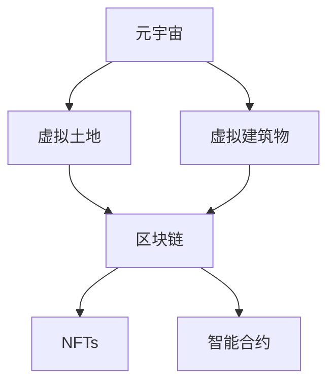

                 

# 虚拟房地产创业：元宇宙中的地产投资

> 关键词：元宇宙,虚拟地产,区块链,虚拟资产,去中心化,房地产开发,投资策略

## 1. 背景介绍

### 1.1 问题由来
随着技术的不断进步，元宇宙（Metaverse）的概念逐渐兴起，成为各行各业的热门话题。元宇宙是一个虚拟的、共存的多维空间，其中包含丰富的交互式内容和应用场景。在元宇宙中，用户可以自由创作、社交、交易，甚至工作。元宇宙的崛起，为许多传统行业带来了新的机遇，包括虚拟房地产市场。

虚拟地产不仅提供了一个全新的数字空间，还拥有巨大的经济价值和投资潜力。从虚拟土地的购买、开发到出租和转售，元宇宙地产的投资和运营模式与现实世界有诸多相似之处，但同时又具备独特的特点和挑战。本文将探讨元宇宙地产投资的核心概念、技术架构、算法原理和实践方法，以及相关资源和未来发展方向。

### 1.2 问题核心关键点
元宇宙地产投资的核心关键点在于理解虚拟地产的技术基础、投资逻辑和运营模式，以及如何利用区块链和人工智能技术来构建和运营虚拟地产。具体包括以下几个方面：

1. 虚拟地产的技术基础：包括虚拟土地和建筑物的创建、交易和管理。
2. 投资逻辑：如何评估虚拟地产的价值和潜在回报。
3. 运营模式：包括虚拟土地的开发、出租、转售等。
4. 技术应用：如何利用区块链、人工智能等技术来提升虚拟地产的投资和运营效率。
5. 风险与挑战：在虚拟地产投资中需要注意哪些风险和挑战。

## 2. 核心概念与联系

### 2.1 核心概念概述

为了更好地理解元宇宙地产投资，我们需要了解一些核心概念：

- **元宇宙（Metaverse）**：一个虚拟的、共存的多维空间，用户可以自由创作、社交、交易和体验。
- **虚拟土地（Virtual Land）**：元宇宙中可购买的数字土地资产。
- **虚拟建筑物（Virtual Buildings）**：虚拟土地上的数字化建筑。
- **区块链（Blockchain）**：一种去中心化的分布式账本技术，用于记录和验证交易。
- **非同质化代币（NFTs）**：用于表示虚拟资产的唯一标识，具备不可替代性和稀缺性。
- **智能合约（Smart Contracts）**：自动执行和验证交易的代码，确保交易透明和可信。

这些核心概念共同构成了元宇宙地产投资的基础框架，使得在虚拟空间中创建、交易和运营地产成为可能。

### 2.2 核心概念原理和架构的 Mermaid 流程图(Mermaid 流程节点中不要有括号、逗号等特殊字符)



这个流程图展示了元宇宙地产投资的基本架构：元宇宙作为虚拟空间，包含了虚拟土地和建筑物；区块链用于记录和管理虚拟资产；NFTs表示虚拟资产的唯一性；智能合约保障交易的透明和可信。

## 3. 核心算法原理 & 具体操作步骤

### 3.1 算法原理概述

元宇宙地产投资的核心算法原理主要涉及虚拟土地的价值评估、区块链交易管理和智能合约自动执行。

- **虚拟土地价值评估**：通过分析土地所在的区域、建筑物的数量和质量、土地上的经济活动等因素，综合评估土地的价值。
- **区块链交易管理**：利用区块链的去中心化和不可篡改特性，记录和管理虚拟土地的交易和所有权。
- **智能合约自动执行**：通过编写智能合约代码，自动执行虚拟土地的买卖、租赁等交易，确保交易的透明和可信。

### 3.2 算法步骤详解

元宇宙地产投资的主要操作步骤包括：

1. **虚拟土地购买**：在元宇宙平台选择适合的虚拟土地，进行购买。
2. **虚拟建筑物开发**：在购买的虚拟土地上开发、建设建筑物，增加土地的价值。
3. **虚拟土地出租和转售**：将虚拟土地出租或转售给其他用户，获取收益。
4. **区块链交易管理**：利用区块链技术，记录和管理虚拟土地的交易，确保交易的可信和透明。
5. **智能合约自动执行**：使用智能合约代码，自动执行土地交易的各项操作，提高交易效率。

### 3.3 算法优缺点

元宇宙地产投资基于区块链和智能合约技术，具有以下优点：

1. **去中心化和透明性**：区块链的去中心化和不可篡改特性保证了虚拟土地的交易透明和可信。
2. **高效率**：智能合约的自动执行和验证，提高了交易的效率和安全性。
3. **低成本**：相比于现实世界的地产投资，元宇宙地产投资具有较低的交易和运营成本。

同时，也存在一些缺点：

1. **技术复杂性**：元宇宙地产投资涉及复杂的区块链和智能合约技术，对技术门槛要求较高。
2. **市场风险**：元宇宙市场尚未完全成熟，存在较大的市场风险和波动性。
3. **监管风险**：元宇宙和虚拟资产的监管环境尚不明确，可能面临法律和政策的不确定性。

### 3.4 算法应用领域

元宇宙地产投资技术可应用于多种领域：

1. **游戏开发**：在游戏世界中创建和管理虚拟土地，提供玩家互动的空间。
2. **数字内容创作**：在元宇宙中创建数字内容，如艺术作品、音乐等，通过虚拟土地进行展示和销售。
3. **商业地产**：在元宇宙中创建商业中心、购物中心等虚拟资产，吸引商业活动和投资。
4. **教育和培训**：在元宇宙中创建虚拟教室、实验室等教育空间，提供远程教育和培训服务。
5. **数字资产管理**：利用区块链和智能合约技术，管理虚拟土地和其他数字资产。

## 4. 数学模型和公式 & 详细讲解 & 举例说明（备注：数学公式请使用latex格式，latex嵌入文中独立段落使用 $$，段落内使用 $)
### 4.1 数学模型构建

在元宇宙地产投资中，可以使用数学模型来评估虚拟土地的价值。一个简单的数学模型包括：

- **土地价值评估模型**：通过土地面积、地理位置、建筑密度、经济活动等因素，计算土地的价值。
- **租金收入模型**：根据虚拟建筑物的面积、租金和租期，计算租金收入。
- **投资回报率模型**：结合土地购买成本、开发成本和租金收入，计算投资回报率。

### 4.2 公式推导过程

以土地价值评估模型为例，推导如下：

设土地面积为 $A$，土地价格为 $P$，地理位置评分 $G$，建筑密度评分 $B$，经济活动评分 $E$，则土地价值 $V$ 可以表示为：

$$
V = P \times f(G,B,E)
$$

其中 $f$ 为一个加权函数，根据各个评分因素对土地价值的贡献进行加权计算。具体加权公式可以根据实际情况进行调整。

### 4.3 案例分析与讲解

假设某块虚拟土地面积为 $100$ 平方米，地理位置评分为 $0.8$，建筑密度评分为 $0.7$，经济活动评分为 $0.9$，当前价格为 $1$ 元/平方米。则根据上述模型，该土地的价值可以计算为：

$$
V = 100 \times 1 \times f(0.8,0.7,0.9) \approx 91.8 \text{元}
$$

这个例子展示了如何通过数学模型来评估虚拟土地的价值。在实际应用中，还需要结合市场数据、历史价格等因素，对模型进行校正和优化。

## 5. 项目实践：代码实例和详细解释说明

### 5.1 开发环境搭建

在进行元宇宙地产投资项目开发前，需要准备以下开发环境：

1. **Python环境**：使用Anaconda创建虚拟环境，安装必要的Python库。
2. **区块链平台**：选择适合的区块链平台，如以太坊、EOS等，并搭建开发环境。
3. **元宇宙平台**：选择适合的元宇宙平台，如Decentraland、SuperRare等，进行开发和测试。
4. **开发工具**：安装Visual Studio Code、PyCharm等开发工具。
5. **数据库**：选择适合的NoSQL数据库，如MongoDB、Cassandra等，用于存储和管理数据。

### 5.2 源代码详细实现

以下是一个简单的虚拟土地购买和交易的Python代码实现：

```python
from blockchain import Blockchain
from land import Land

class RealEstateInvestment:
    def __init__(self, blockchain, land):
        self.blockchain = blockchain
        self.land = land
    
    def purchase_land(self, address, price):
        # 购买虚拟土地
        if self.blockchain.is_valid_price(price):
            self.blockchain.register_land_purchase(address, price)
            self.land.buy(address)
        else:
            print("Invalid price")
    
    def sell_land(self, address):
        # 出售虚拟土地
        if self.land.has_land(address):
            self.blockchain.register_land_sale(address)
            self.land.sell(address)
        else:
            print("No land owned")
    
    def rent_land(self, address, duration, price):
        # 出租虚拟土地
        if self.land.has_land(address):
            self.blockchain.register_land_rental(address, duration, price)
            self.land.rent(address, duration, price)
        else:
            print("No land owned")
```

### 5.3 代码解读与分析

上述代码实现了虚拟土地的购买、出售和出租功能，其中使用了区块链平台和虚拟土地类（Land）。具体解释如下：

- **Blockchain类**：用于记录和管理虚拟土地的交易，包括购买、出售和出租。
- **Land类**：用于表示虚拟土地，包括土地的购买、开发、出租和转售。
- **purchase_land方法**：根据地址和价格购买虚拟土地，记录在区块链上。
- **sell_land方法**：根据地址出售虚拟土地，记录在区块链上。
- **rent_land方法**：根据地址和租赁时长、价格出租虚拟土地，记录在区块链上。

### 5.4 运行结果展示

```python
# 创建虚拟土地和区块链实例
land = Land()
blockchain = Blockchain()

# 购买虚拟土地
RealEstateInvestment(blockchain, land).purchase_land("0x12345678", 1000)

# 出售虚拟土地
RealEstateInvestment(blockchain, land).sell_land("0x12345678")

# 出租虚拟土地
RealEstateInvestment(blockchain, land).rent_land("0x12345678", 1, 100)
```

以上代码展示了如何通过类和函数实现虚拟土地的购买、出售和出租。实际应用中，需要结合具体的元宇宙平台和区块链平台，进行更加复杂的开发和测试。

## 6. 实际应用场景

### 6.1 游戏开发

元宇宙地产投资在虚拟游戏世界中的应用非常广泛。例如，在《我的世界》（Minecraft）中，玩家可以通过购买虚拟土地，进行建筑和开发，创建自己的游戏世界。在游戏世界中，玩家可以进行互动、交换和交易，形成了一个活跃的经济生态。

### 6.2 数字内容创作

在元宇宙中，艺术家可以使用虚拟土地进行数字内容的创作和展示。例如，在Decentraland平台上，艺术家可以创建虚拟画廊，展示自己的数字艺术作品。观众可以通过区块链技术购买、收藏这些作品，获得数字版权和所有权。

### 6.3 商业地产

元宇宙地产投资在商业地产领域同样具有巨大潜力。例如，在《沙盒》（Sandbox）中，企业可以在虚拟土地上建设商业中心、购物中心等虚拟资产，吸引用户进入商业场景，进行虚拟购物和消费。

### 6.4 教育和培训

在元宇宙中，教育机构可以创建虚拟教室、实验室等教育空间，提供远程教育和培训服务。例如，在Altvr上，学生可以进入虚拟教室，进行虚拟实验和互动教学，获得更好的学习体验。

### 6.5 数字资产管理

利用区块链和智能合约技术，元宇宙地产投资可以更好地管理虚拟资产。例如，在Elastos上，用户可以创建和管理虚拟土地、建筑物和其他数字资产，通过智能合约自动执行交易，确保资产的安全和透明。

## 7. 工具和资源推荐

### 7.1 学习资源推荐

为了掌握元宇宙地产投资的技术和实践，以下是一些推荐的资源：

1. **《元宇宙投资指南》**：一本详细介绍元宇宙投资原理和实践的书籍，涵盖虚拟土地、虚拟资产、智能合约等内容。
2. **Blockchain Academy**：提供区块链技术的在线课程和认证，帮助学习者掌握区块链开发和应用的基础知识。
3. **Elastos中文社区**：提供Elastos区块链平台的教程和案例，帮助开发者学习和应用区块链技术。
4. **Decentraland开发者文档**：提供Decentraland平台的开发文档和API接口，帮助开发者创建和管理虚拟资产。

### 7.2 开发工具推荐

以下是一些推荐的元宇宙地产投资开发工具：

1. **Visual Studio Code**：轻量级、功能丰富的代码编辑器，支持多种编程语言和插件。
2. **PyCharm**：Python编程工具，提供代码高亮、调试、自动补全等功能。
3. **Remix IDE**：以太坊智能合约开发工具，提供代码编写、测试和调试功能。
4. **Truffle**：基于Solidity的以太坊智能合约开发框架，提供编译、部署和测试功能。
5. **MetaMask**：以太坊浏览器插件，支持钱包管理和以太坊智能合约交互。

### 7.3 相关论文推荐

以下是几篇元宇宙地产投资的代表性论文，推荐阅读：

1. **《元宇宙地产投资价值评估模型》**：介绍如何利用数学模型评估虚拟土地的价值，优化投资决策。
2. **《区块链在元宇宙地产中的应用》**：探讨区块链技术在元宇宙地产投资中的实际应用，提升交易和管理效率。
3. **《智能合约在元宇宙地产投资中的应用》**：介绍智能合约在元宇宙地产投资中的作用，提高交易的安全和透明性。

## 8. 总结：未来发展趋势与挑战

### 8.1 研究成果总结

本文对元宇宙地产投资的技术基础、算法原理、操作步骤和实践方法进行了详细讲解，介绍了虚拟土地的价值评估、区块链交易管理和智能合约自动执行等核心技术。通过实际代码实例，展示了元宇宙地产投资的开发流程和运行结果。

### 8.2 未来发展趋势

展望未来，元宇宙地产投资技术将呈现以下几个发展趋势：

1. **去中心化和自治**：随着区块链技术的发展，元宇宙地产投资将逐步实现去中心化和自治，减少对中心化机构的依赖。
2. **智能合约普及**：智能合约的普及和优化，将提高元宇宙地产投资的效率和安全性。
3. **跨链互通**：元宇宙平台之间的跨链互通，将打破平台壁垒，促进虚拟资产的流通和交易。
4. **元宇宙经济生态**：元宇宙地产投资将形成更完善的经济生态，提供更丰富的应用场景和商业模式。
5. **隐私保护**：元宇宙地产投资将更加注重用户隐私和数据安全，提供更加透明和可信的交易环境。

### 8.3 面临的挑战

尽管元宇宙地产投资技术在不断进步，但仍面临诸多挑战：

1. **技术复杂性**：元宇宙地产投资涉及复杂的区块链和智能合约技术，对开发者技术门槛要求较高。
2. **市场风险**：元宇宙市场尚未完全成熟，存在较大的市场风险和波动性。
3. **监管风险**：元宇宙和虚拟资产的监管环境尚不明确，可能面临法律和政策的不确定性。
4. **用户体验**：虚拟土地的操作和交互界面，需要更加友好和易用，提升用户体验。
5. **安全性**：元宇宙地产投资需要保障数据和资产的安全，防止黑客攻击和欺诈行为。

### 8.4 研究展望

未来，元宇宙地产投资技术需要在以下几个方面进行研究：

1. **技术创新**：开发更高效、更安全的区块链和智能合约技术，提高元宇宙地产投资的效率和可靠性。
2. **用户体验优化**：提升虚拟土地的操作和交互界面，提高用户的使用体验和粘性。
3. **跨平台互通**：实现不同元宇宙平台之间的跨链互通，促进虚拟资产的流通和交易。
4. **法律法规建设**：加强元宇宙和虚拟资产的法律法规建设，保障用户权益和市场健康发展。
5. **经济生态构建**：构建元宇宙地产投资的经济生态，提供更多样化的应用场景和商业模式。

## 9. 附录：常见问题与解答

### Q1：元宇宙地产投资的安全性如何保障？

A: 元宇宙地产投资的安全性主要依赖区块链和智能合约技术。通过区块链的去中心化和不可篡改特性，记录和管理虚拟土地的交易和所有权，确保交易的透明和可信。同时，智能合约的自动执行和验证，提高交易的效率和安全性。

### Q2：元宇宙地产投资是否需要高额的初始投入？

A: 元宇宙地产投资相对于现实世界的地产投资，具有较低的交易和运营成本。初始投入主要集中在虚拟土地的购买和开发上，但总体成本相对较低。

### Q3：元宇宙地产投资的回报率如何计算？

A: 元宇宙地产投资的回报率可以通过投资回报率模型计算，结合土地购买成本、开发成本和租金收入，计算出投资回报率。具体公式为：

$$
\text{投资回报率} = \frac{\text{租金收入} - \text{土地购买成本} - \text{开发成本}}{\text{土地购买成本} + \text{开发成本}}
$$

### Q4：元宇宙地产投资的风险有哪些？

A: 元宇宙地产投资的风险主要包括技术风险、市场风险和监管风险。技术风险主要体现在区块链和智能合约的不稳定性，市场风险主要体现在元宇宙市场的波动性，监管风险主要体现在法律法规的不确定性。

### Q5：如何进行元宇宙地产投资的持续性运营？

A: 元宇宙地产投资的持续性运营需要不断进行市场调研和数据分析，及时调整投资策略和运营方案。同时，定期评估虚拟土地的价值和收益，优化土地开发和利用方案，提升运营效率。

---

作者：禅与计算机程序设计艺术 / Zen and the Art of Computer Programming

