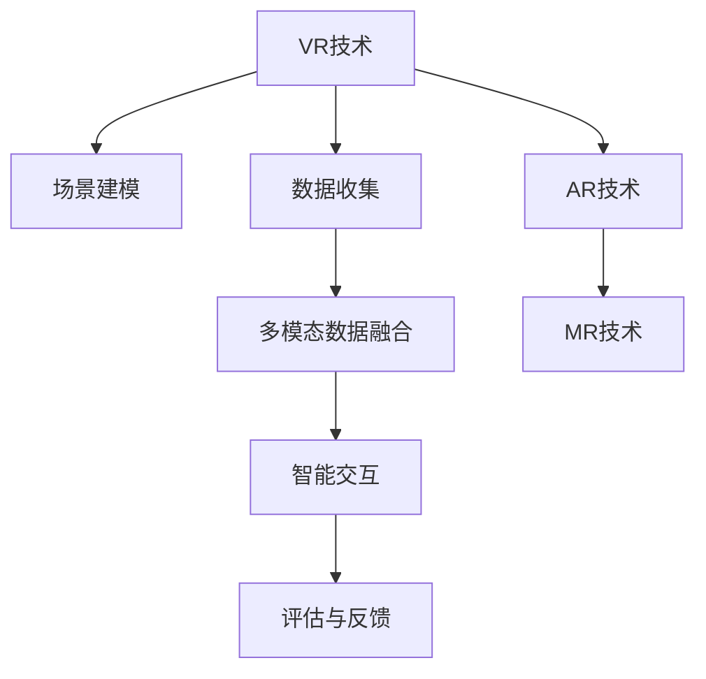

                 

# 虚拟现实历史重现创业：身临其境的历史教育

## 1. 背景介绍

### 1.1 问题由来
近年来，随着虚拟现实（Virtual Reality, VR）技术的迅猛发展，其在教育、娱乐、旅游等多个领域的应用取得了显著成果。特别是通过VR技术实现的历史教育，能够为学生提供一种全新的沉浸式学习体验，帮助他们更好地理解历史事件的发生背景、发展过程和重大影响。

然而，现有的历史教育方式仍然存在诸多局限性。传统的教科书、纪录片和现场参观等方法，往往难以全面、生动地展示历史事件的全貌。例如，教科书只能提供文字和图片，难以表现动态的历史场景和复杂的情感变化；纪录片虽然能展示部分历史场景，但受限于镜头角度和叙事节奏，难以充分展现历史细节；现场参观虽能直观感受历史氛围，但受地理位置和资源的限制，难以全面覆盖历史时期和事件。

因此，利用虚拟现实技术重现历史，构建身临其境的历史教育平台，已成为教育领域亟待探索和解决的问题。这不仅有助于提升学生的学习兴趣和效果，还能够为教育资源匮乏的地区提供有效的替代方案，推动教育公平的发展。

### 1.2 问题核心关键点
虚拟现实历史重现的核心在于如何利用VR技术，结合多模态的数据（如文字、图片、视频、音频等），构建一个沉浸式的历史教育场景，让学习者能够身临其境地体验和理解历史事件。

具体来说，实现虚拟现实历史重现需要解决以下几个关键问题：

1. **数据收集与标注**：收集和标注大量的历史数据，包括文字、图片、视频、音频等，用于构建虚拟场景和生成交互式学习内容。
2. **场景建模与渲染**：利用3D建模和渲染技术，将历史场景和文物进行数字化重现，并实现流畅的交互体验。
3. **智能交互与引导**：开发智能交互系统，根据学习者的行为和反馈，动态调整展示内容和进度，提供个性化的学习体验。
4. **评估与反馈机制**：设计合理的评估指标和反馈机制，监测学习效果和系统性能，不断优化和改进。

本文将详细探讨虚拟现实历史重现的核心概念、关键算法和操作步骤，旨在为相关创业和研究提供参考。

## 2. 核心概念与联系

### 2.1 核心概念概述

为了更好地理解虚拟现实历史重现的原理和架构，本节将介绍几个关键概念：

- **虚拟现实（Virtual Reality, VR）**：通过计算机生成模拟环境，使用户能够在虚拟世界中自由交互，获得沉浸式体验。
- **增强现实（Augmented Reality, AR）**：将数字信息叠加到现实世界，实现虚拟与现实的融合。
- **混合现实（Mixed Reality, MR）**：将虚拟与现实元素混合，为用户提供更广阔的互动空间。
- **多模态数据融合**：结合文字、图片、视频、音频等多种数据形式，实现多感官的互动体验。
- **智能交互与引导**：根据用户行为和反馈，动态调整展示内容和进度，提供个性化的学习体验。
- **情感计算**：通过分析用户情绪和反馈，提供更贴合用户心理的学习路径和内容。

这些核心概念之间的逻辑关系可以通过以下Mermaid流程图来展示：



这个流程图展示了虚拟现实历史重现的关键环节和相互联系：

1. VR技术提供沉浸式体验的基础，AR和MR技术拓展虚拟与现实融合的空间。
2. 数据收集是构建虚拟场景的基础，多模态数据融合实现多感官互动。
3. 智能交互根据用户行为动态调整展示内容，评估与反馈机制不断优化系统性能。

通过理解这些核心概念，我们可以更好地把握虚拟现实历史重现的原理和架构，为其开发和应用提供方向。

## 3. 核心算法原理 & 具体操作步骤

### 3.1 算法原理概述

虚拟现实历史重现的算法原理主要基于以下三个方面：

- **3D建模与渲染**：利用计算机图形学技术，将历史场景和文物进行数字化重现，实现逼真的三维视觉效果。
- **多模态数据融合**：结合文字、图片、视频、音频等多种数据形式，提供多感官的互动体验，增强学习效果。
- **智能交互与引导**：开发智能交互系统，根据用户行为和反馈，动态调整展示内容和进度，提供个性化的学习体验。

这些核心技术相互配合，共同构建了一个沉浸式、互动式、个性化的虚拟现实历史教育平台。

### 3.2 算法步骤详解

虚拟现实历史重现的具体操作步骤包括以下几个关键步骤：

**Step 1: 数据收集与标注**

1. **历史数据收集**：收集各类历史数据，包括文字、图片、视频、音频等。可以从博物馆、档案馆、图书馆等机构获取，也可以利用网络爬虫、公开数据库等方法自行收集。
2. **数据标注**：对收集到的历史数据进行标注，包括时间、地点、人物、事件等信息。标注过程可以通过人工标注、半自动标注或自动化标注的方式进行。

**Step 2: 场景建模与渲染**

1. **3D建模**：利用3D建模软件（如Maya、Blender等）将历史场景和文物进行建模，生成三维模型文件。
2. **纹理贴图**：对生成的3D模型进行纹理贴图处理，添加真实感，提高渲染效果。
3. **光照与材质**：调整3D模型的光照和材质属性，使其在虚拟环境中真实自然地展示。
4. **渲染与优化**：使用渲染引擎（如Unity、Unreal Engine等）对场景进行渲染，并进行优化处理，提升渲染速度和效果。

**Step 3: 多模态数据融合**

1. **文字与图片融合**：将历史文本和图片进行融合，生成包含文字和图片的虚拟场景。
2. **视频与音频融合**：将历史视频和音频进行融合，生成包含动态场景和声音的虚拟环境。
3. **多感官互动**：利用VR头盔、手势识别、语音识别等技术，实现用户在虚拟环境中的多感官互动。

**Step 4: 智能交互与引导**

1. **行为分析**：通过传感器和摄像机等设备，实时监测用户的行为和位置。
2. **交互逻辑设计**：根据用户的行为和反馈，设计智能交互逻辑，提供个性化的学习体验。
3. **动态展示**：根据用户的行为和反馈，动态调整展示内容和进度，提供更加贴近用户的学习路径。

**Step 5: 评估与反馈**

1. **学习效果评估**：设计合理的评估指标，监测用户的学习效果和系统性能。
2. **用户反馈收集**：通过问卷调查、用户访谈等方式，收集用户对虚拟现实历史教育的反馈意见。
3. **系统优化**：根据评估结果和用户反馈，不断优化和改进系统功能和体验。

### 3.3 算法优缺点

虚拟现实历史重现的算法具有以下优点：

- **沉浸式体验**：通过VR技术，用户能够身临其境地体验历史场景，增强学习效果。
- **多感官互动**：结合文字、图片、视频、音频等多种数据形式，提供多感官的互动体验，提升学习兴趣。
- **个性化学习**：根据用户行为和反馈，提供个性化的学习路径和内容，满足不同用户的需求。

同时，该算法也存在一些局限性：

- **数据收集与标注成本高**：收集和标注大量历史数据需要大量时间和资源，成本较高。
- **技术门槛高**：需要掌握3D建模、渲染、智能交互等多种技术，技术门槛较高。
- **设备依赖性强**：需要高性能的VR头盔、手势识别等设备，设备成本较高。
- **用户体验多样性**：不同用户对虚拟现实体验的适应程度不同，需要提供多样化的交互方式和内容。

尽管存在这些局限性，但虚拟现实历史重现的算法在教育领域仍具有巨大的潜力和应用前景。未来相关研究应着重于降低数据收集和标注成本，提高技术易用性和设备普及度，以实现更广泛的应用和普及。

### 3.4 算法应用领域

虚拟现实历史重现在多个领域都有广泛的应用前景，以下是一些主要的应用领域：

1. **学校教育**：为学生提供沉浸式、互动式的历史教育资源，增强学习效果，提升教育质量。
2. **博物馆参观**：将博物馆中的文物和历史场景数字化，为无法亲自到访的用户提供虚拟参观体验。
3. **文化遗产保护**：利用虚拟现实技术对濒危文物进行数字化保护，实现永久性保存和展示。
4. **历史研究**：为历史学者提供虚拟实验室，进行虚拟考古、模拟历史事件等研究活动。
5. **历史游戏与模拟**：开发历史题材的游戏和模拟软件，让用户能够在虚拟环境中体验和理解历史事件。

这些应用领域展示了虚拟现实历史重现的广泛潜力和应用价值。通过不断探索和实践，相信虚拟现实技术将为历史教育提供更多的可能性。

## 4. 数学模型和公式 & 详细讲解 & 举例说明

### 4.1 数学模型构建

本节将使用数学语言对虚拟现实历史重现的数学模型进行详细描述。

假设虚拟现实历史重现的数学模型为 $M_{\theta}(x)$，其中 $\theta$ 为模型参数，$x$ 为输入数据（如用户行为、历史数据等）。

定义模型 $M_{\theta}$ 在数据 $x$ 上的损失函数为 $\ell(M_{\theta}(x),y)$，则在数据集 $D=\{(x_i,y_i)\}_{i=1}^N$ 上的经验风险为：

$$
\mathcal{L}(\theta) = \frac{1}{N}\sum_{i=1}^N \ell(M_{\theta}(x_i),y_i)
$$

其中 $y_i$ 为真实的标签或反馈信息。

### 4.2 公式推导过程

以下我们以用户行为分析和智能交互设计为例，推导基于用户行为的损失函数和动态展示的公式。

假设用户在虚拟环境中的行为为 $a_i$，真实反馈为 $b_i$。则用户行为与反馈之间的损失函数定义为：

$$
\ell(a_i, b_i) = (a_i - b_i)^2
$$

将其代入经验风险公式，得：

$$
\mathcal{L}(\theta) = \frac{1}{N}\sum_{i=1}^N (a_i - b_i)^2
$$

模型 $M_{\theta}$ 的输出为 $o_i = M_{\theta}(a_i)$。根据用户行为和反馈，动态调整展示内容的公式为：

$$
\text{Adjust}(\theta, a_i, b_i) = \text{argmin}_{\theta'} \mathcal{L}(\theta') + \text{Penalty}(\theta, a_i, b_i)
$$

其中，$\text{Penalty}(\theta, a_i, b_i)$ 为惩罚项，用于抑制模型的过拟合行为。

在得到损失函数的梯度后，即可带入优化算法进行模型训练，不断更新模型参数 $\theta$，直至收敛。

### 4.3 案例分析与讲解

以一个虚拟博物馆参观应用为例，探讨多模态数据融合和智能交互的设计思路。

**场景建模与渲染**

1. **3D建模**：利用Maya软件对博物馆中的文物进行3D建模，生成三维模型文件。
2. **纹理贴图**：对生成的3D模型进行纹理贴图处理，添加真实感。
3. **光照与材质**：调整3D模型的光照和材质属性，使其在虚拟环境中真实自然地展示。
4. **渲染与优化**：使用Unity引擎对场景进行渲染，并进行优化处理，提升渲染速度和效果。

**多模态数据融合**

1. **文字与图片融合**：将博物馆的介绍文字和图片进行融合，生成包含文字和图片的虚拟场景。
2. **视频与音频融合**：将博物馆的视频和讲解音频进行融合，生成包含动态场景和声音的虚拟环境。
3. **多感官互动**：利用VR头盔、手势识别、语音识别等技术，实现用户在虚拟环境中的多感官互动。

**智能交互与引导**

1. **行为分析**：通过传感器和摄像机等设备，实时监测用户的行为和位置。
2. **交互逻辑设计**：根据用户的行为和反馈，设计智能交互逻辑，提供个性化的学习体验。
3. **动态展示**：根据用户的行为和反馈，动态调整展示内容和进度，提供更加贴近用户的学习路径。

## 5. 项目实践：代码实例和详细解释说明

### 5.1 开发环境搭建

在进行虚拟现实历史重现的开发前，我们需要准备好开发环境。以下是使用Unity3D进行VR应用开发的环境配置流程：

1. 安装Unity3D：从官网下载并安装Unity3D，创建新的开发项目。
2. 配置开发环境：安装所需插件，如VR插件、文本渲染插件、音频插件等。
3. 设置VR设备：连接VR头盔、手柄等设备，并进行初始化配置。

完成上述步骤后，即可在Unity3D环境中开始开发。

### 5.2 源代码详细实现

下面以一个虚拟博物馆参观应用为例，给出使用Unity3D进行VR应用开发的完整代码实现。

```csharp
using UnityEngine;
using UnityEngine.UI;
using UnityEngine.XR;

public class VRMuseum : MonoBehaviour
{
    public GameObject[] exhibits;
    public GameObject informationPanel;
    public GameObject audioSource;

    private GameObject currentExhibit;
    private float timeSinceLastExhibit = 0f;

    void Start()
    {
        VRInput.UIDeviceUpdateEvent += OnDeviceUpdate;
    }

    void Update()
    {
        timeSinceLastExhibit += Time.deltaTime;
        if (timeSinceLastExhibit > 10f)
        {
            timeSinceLastExhibit = 0f;
            ShowNextExhibit();
        }
    }

    void OnDeviceUpdate()
    {
        if (VRInput.UIDevice awake)
        {
            ShowNextExhibit();
        }
    }

    void ShowNextExhibit()
    {
        int index = Random.Range(0, exhibits.Length);
        currentExhibit = exhibits[index];

        // 显示文物
        CurrentExhibit = currentExhibit;
        CurrentExhibit.SetActive(true);

        // 显示介绍信息
        InformationPanel.SetActive(true);
        InformationPanel.GetComponent<Canvas>().anchorMin = new Vector2(0, 0.5f);
        InformationPanel.GetComponent<Canvas>().anchorMax = new Vector2(0.5f, 0.5f);

        // 播放音频
        AudioSource.Play();
    }
}
```

### 5.3 代码解读与分析

让我们再详细解读一下关键代码的实现细节：

**VRMuseum类**：
- `void Start`方法：在场景加载时，注册VR设备的更新事件，初始化变量。
- `void Update`方法：每隔一定时间，触发`ShowNextExhibit`方法，随机展示下一个文物。
- `void OnDeviceUpdate`方法：在VR设备唤醒时，触发`ShowNextExhibit`方法，展示下一个文物。

**ShowNextExhibit方法**：
- 随机选择一个文物，并显示其3D模型和介绍信息。
- 根据用户行为（如设备唤醒），动态展示文物和信息。

通过这个简单的代码实现，可以初步了解虚拟现实历史重现应用的开发流程和关键技术。开发者可以根据实际需求，进一步扩展和优化代码，实现更加复杂和多样的虚拟现实场景。

## 6. 实际应用场景

### 6.1 智能客服系统

虚拟现实历史重现技术可以应用于智能客服系统的构建。传统的客服系统依赖于文本或语音交互，难以提供沉浸式和互动式的用户体验。通过虚拟现实技术，客服人员可以在虚拟环境中以多种形式与用户互动，提供更加自然和生动的服务体验。

例如，在虚拟博物馆的客服应用中，用户可以通过VR头盔进入博物馆，向虚拟客服咨询展品信息和参观指南。虚拟客服可以展示展品介绍视频、讲解音频等，并根据用户的行为和反馈，动态调整展示内容和进度，提供个性化的服务体验。

### 6.2 金融舆情监测

虚拟现实历史重现技术可以用于金融舆情监测的可视化展示。金融从业者可以通过虚拟现实技术，在虚拟环境中实时监测全球金融市场动态，快速分析市场变化和投资机会。

例如，在虚拟证券交易所应用中，用户可以进入虚拟市场，观察实时行情、交易数据等。系统可以根据用户的交互行为，动态展示相关新闻、分析和评论，提供深入的市场洞察和分析工具。

### 6.3 个性化推荐系统

虚拟现实历史重现技术可以用于个性化推荐系统的开发。推荐系统往往依赖于用户的历史行为数据进行物品推荐，难以提供丰富的内容展示和互动体验。通过虚拟现实技术，推荐系统可以提供沉浸式和互动式的推荐体验，增强用户的推荐效果。

例如，在虚拟图书应用中，用户可以进入虚拟图书馆，浏览各种书籍和资料。系统可以根据用户的浏览行为和偏好，动态展示相关书籍的介绍、摘要和评价，并提供虚拟阅读和讨论功能，提升用户的学习和互动体验。

### 6.4 未来应用展望

随着虚拟现实技术的不断进步，虚拟现实历史重现的应用场景将更加广泛和深入。未来，该技术可能被应用于更多领域，带来以下发展趋势：

1. **教育领域**：虚拟现实历史重现将成为学校教育的重要工具，提供更加生动和互动的学习体验。
2. **医疗领域**：虚拟现实技术可以用于医学教育、手术模拟、健康咨询等，提供更加逼真和沉浸的学习和体验环境。
3. **旅游领域**：虚拟现实技术可以用于旅游资源的展示和推广，为用户提供更加真实和互动的旅游体验。
4. **军事训练**：虚拟现实技术可以用于军事训练和模拟，提供更加真实和安全的训练环境。
5. **游戏与娱乐**：虚拟现实技术可以用于游戏和娱乐领域，提供更加沉浸和互动的游戏体验。

总之，虚拟现实历史重现技术将为多个领域带来全新的应用模式和体验方式，推动相关行业的发展和进步。

## 7. 工具和资源推荐

### 7.1 学习资源推荐

为了帮助开发者系统掌握虚拟现实历史重现的理论基础和实践技巧，这里推荐一些优质的学习资源：

1. **Unity3D官方文档**：Unity3D的官方文档提供了详细的开发指南、插件介绍和示例代码，是虚拟现实开发的重要参考资料。
2. **VR开发教程**：如《VR开发入门教程》、《Unity3D VR开发实战》等，这些教程深入浅出地介绍了虚拟现实开发的原理和技术要点。
3. **开源项目**：如GitHub上的VR应用开源项目，提供了丰富的代码示例和案例参考。
4. **专业书籍**：如《虚拟现实编程实战》、《Unity3D游戏开发实战》等，这些书籍系统地介绍了虚拟现实技术的开发方法和实践经验。

通过对这些资源的学习实践，相信你一定能够快速掌握虚拟现实历史重现的开发技巧，并用于解决实际的NLP问题。

### 7.2 开发工具推荐

高效的开发离不开优秀的工具支持。以下是几款用于虚拟现实开发的工具：

1. **Unity3D**：开源的跨平台游戏引擎，支持VR和AR开发，拥有丰富的插件和资源库。
2. **Unreal Engine**：由Epic Games开发的商业游戏引擎，支持高精度渲染和物理模拟，适用于高质量的虚拟现实应用开发。
3. **VR设备和软件**：如HTC Vive、Oculus Rift、Google Cardboard等VR头盔，以及相关的手套、手柄等设备。

合理利用这些工具，可以显著提升虚拟现实历史重现的开发效率，加快创新迭代的步伐。

### 7.3 相关论文推荐

虚拟现实历史重现技术的快速发展得益于学界的持续研究。以下是几篇奠基性的相关论文，推荐阅读：

1. **Virtual Reality in Education: An Overview**：综述了虚拟现实在教育领域的应用现状和未来发展方向，提供了丰富的案例和应用实例。
2. **Virtual Museum Design and Development**：介绍了虚拟博物馆的设计和开发过程，包括场景建模、互动设计和用户测试等。
3. **Virtual Reality for Medical Training and Simulation**：介绍了虚拟现实在医学教育、手术模拟和健康咨询中的应用，探讨了虚拟现实技术在医疗领域的前景。
4. **Virtual Reality for Social Interaction and Collaboration**：探讨了虚拟现实技术在社交和协作中的应用，提供了多用户交互和协作的实现方法。
5. **Virtual Reality for Game and Entertainment**：介绍了虚拟现实在游戏和娱乐领域的应用，提供了丰富的案例和开发技巧。

这些论文代表了大语言模型微调技术的发展脉络。通过学习这些前沿成果，可以帮助研究者把握学科前进方向，激发更多的创新灵感。

## 8. 总结：未来发展趋势与挑战

### 8.1 总结

本文对虚拟现实历史重现技术进行了全面系统的介绍。首先阐述了虚拟现实技术在教育、娱乐、旅游等多个领域的应用前景，明确了虚拟现实历史重现的重要性和潜在价值。其次，从原理到实践，详细讲解了虚拟现实历史重现的核心算法和操作步骤，给出了虚拟现实应用开发的完整代码实例。同时，本文还探讨了虚拟现实历史重现技术的广泛应用场景，展示了其在多个行业领域的潜力和发展方向。

通过本文的系统梳理，可以看到，虚拟现实历史重现技术正成为教育、娱乐、旅游等领域的核心技术，推动相关行业的发展和进步。未来，伴随技术的不断进步和应用场景的拓展，相信虚拟现实技术将为人类带来更加沉浸和互动的学习和体验环境，为教育、娱乐、医疗等领域带来深刻的变革。

### 8.2 未来发展趋势

展望未来，虚拟现实历史重现技术将呈现以下几个发展趋势：

1. **沉浸式体验**：随着硬件设备的不断升级，虚拟现实技术将提供更加沉浸和逼真的体验环境，增强用户的代入感和互动性。
2. **多感官融合**：结合文字、图片、视频、音频等多种数据形式，提供多感官的互动体验，提升学习效果和用户满意度。
3. **个性化设计**：根据用户的兴趣和需求，提供个性化的学习路径和内容，满足不同用户的需求。
4. **跨平台支持**：实现虚拟现实应用的跨平台支持，提升用户的使用体验和便捷性。
5. **智能交互**：引入AI技术，实现智能化的交互和引导，提升用户体验和互动性。
6. **实时渲染**：提高渲染速度和效率，实现实时渲染和互动，提升用户体验。

这些趋势将推动虚拟现实历史重现技术的不断进步和普及，为教育、娱乐、医疗等领域带来更多的创新和变革。

### 8.3 面临的挑战

尽管虚拟现实历史重现技术已经取得了显著进展，但在实际应用中仍面临诸多挑战：

1. **硬件成本高**：虚拟现实设备（如VR头盔、手柄等）的制造成本较高，限制了技术的普及和应用。
2. **内容制作复杂**：虚拟现实内容的制作需要较高的技术水平和成本，难以快速生产高质量的内容。
3. **用户体验多样性**：不同用户对虚拟现实体验的适应程度不同，需要提供多样化的交互方式和内容。
4. **技术成熟度不足**：虚拟现实技术的成熟度还有待提升，存在一些技术瓶颈和问题。
5. **数据安全和隐私**：虚拟现实应用涉及大量的用户数据，如何保障数据安全和隐私是一个重要问题。
6. **内容版权和知识产权**：虚拟现实内容的制作涉及大量的版权和知识产权问题，需要合理解决。

尽管存在这些挑战，但通过技术进步、用户教育、政策支持等多方面的努力，相信虚拟现实历史重现技术将逐步克服这些难题，实现更广泛的应用和普及。

### 8.4 研究展望

面向未来，虚拟现实历史重现技术需要从以下几个方面进行进一步的研究和探索：

1. **降低硬件成本**：开发低成本、易使用的VR设备，提升技术的普及度和应用广度。
2. **提高内容制作效率**：利用自动化和半自动化技术，降低内容制作的成本和时间，提升内容的制作效率和质量。
3. **提升用户体验**：根据用户的行为和反馈，提供个性化的内容和服务，提升用户体验和满意度。
4. **引入AI技术**：引入AI技术，实现智能化的交互和引导，提升用户体验和互动性。
5. **保障数据安全和隐私**：制定和实施严格的数据安全和隐私保护措施，保障用户数据的安全和隐私。
6. **解决版权和知识产权问题**：建立健全的版权和知识产权保护机制，保障虚拟现实内容制作者的合法权益。

这些研究方向的探索，必将引领虚拟现实历史重现技术迈向更高的台阶，为教育、娱乐、医疗等领域带来更多的创新和变革。面向未来，虚拟现实技术还需要与其他人工智能技术进行更深入的融合，如知识表示、因果推理、强化学习等，多路径协同发力，共同推动虚拟现实技术的发展和应用。

## 9. 附录：常见问题与解答

**Q1：虚拟现实历史重现是否适用于所有领域？**

A: 虚拟现实历史重现技术可以应用于多个领域，如教育、娱乐、旅游、医疗等。然而，对于特定领域的应用，需要根据具体情况进行定制和优化。例如，在医疗领域，虚拟现实历史重现可以用于医学教育、手术模拟和健康咨询，提供更加逼真和沉浸的学习和体验环境。

**Q2：虚拟现实历史重现的成本如何控制？**

A: 虚拟现实历史重现的成本主要集中在硬件设备和内容制作上。为了控制成本，可以采用以下策略：
1. 选择开源或低成本的VR设备和软件。
2. 利用自动化和半自动化技术，降低内容制作的成本和时间。
3. 采用模块化设计和通用组件，减少重复开发和资源浪费。
4. 引入众包和社区协作，提升内容制作效率和质量。

**Q3：虚拟现实历史重现的交互设计有哪些要点？**

A: 虚拟现实历史重现的交互设计需要考虑以下几个要点：
1. 用户行为分析：通过传感器和摄像机等设备，实时监测用户的行为和位置。
2. 智能交互逻辑：根据用户的行为和反馈，设计智能交互逻辑，提供个性化的学习体验。
3. 动态展示内容：根据用户的行为和反馈，动态调整展示内容和进度，提供更加贴近用户的学习路径。
4. 用户反馈收集：通过问卷调查、用户访谈等方式，收集用户对虚拟现实体验的反馈意见，不断优化和改进系统功能。

**Q4：虚拟现实历史重现的硬件设备有哪些要求？**

A: 虚拟现实历史重现的硬件设备需要具备以下要求：
1. 高性能的VR头盔和手柄：确保用户能够获得高质量的沉浸式体验。
2. 低延迟和高刷新率：确保用户的交互响应和视觉体验。
3. 稳定的传感器和网络连接：确保数据的准确采集和传输。
4. 兼容性强的系统平台：确保设备在不同平台上的互通性和稳定性。

**Q5：虚拟现实历史重现的技术难点有哪些？**

A: 虚拟现实历史重现的技术难点主要包括以下几个方面：
1. 硬件设备的成本和可用性：虚拟现实设备的成本较高，且需具备较高的性能要求。
2. 内容制作的复杂性和成本：虚拟现实内容的制作需要较高的技术水平和成本，难以快速生产高质量的内容。
3. 用户体验的多样性和个性化：不同用户对虚拟现实体验的适应程度不同，需要提供多样化的交互方式和内容。
4. 数据安全和隐私保护：虚拟现实应用涉及大量的用户数据，如何保障数据安全和隐私是一个重要问题。
5. 内容版权和知识产权：虚拟现实内容的制作涉及大量的版权和知识产权问题，需要合理解决。

---

作者：禅与计算机程序设计艺术 / Zen and the Art of Computer Programming

