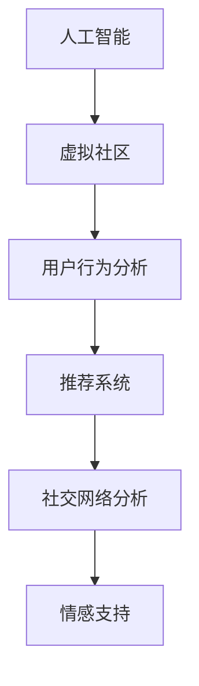

                 

# 虚拟社区构建学：AI驱动的在线归属感营造

> 关键词：人工智能,虚拟社区,网络社交,用户行为分析,推荐系统,用户体验优化,社交网络分析,机器学习

## 1. 背景介绍

### 1.1 问题由来

近年来，随着互联网和社交媒体的普及，虚拟社区的概念越来越成为人们关注的焦点。虚拟社区是一种基于网络的社交组织形式，通过互联网技术连接来自世界各地、具有相同兴趣爱好的用户，形成以共同目标为基础的社交网络。虚拟社区具有强大的社区凝聚力、成员参与感和归属感，能够让用户在虚拟世界中找到志同道合的伙伴，获取情感支持和信息共享。

然而，传统虚拟社区往往存在用户流失率高、参与度低、内容同质化严重等问题。为了解决这些问题，越来越多的研究者开始尝试使用人工智能技术来构建更智能、更友好的虚拟社区，提升用户参与度和归属感。本文将围绕这一话题，探讨如何利用AI技术，构建更具吸引力和归属感的虚拟社区。

### 1.2 问题核心关键点

本文聚焦于以下核心关键点：
- **人工智能技术**：通过机器学习、深度学习等技术，分析用户行为，实现个性化推荐，提升社区互动。
- **虚拟社区构建**：基于AI驱动的推荐系统、社交网络分析等技术，为用户定制化推荐内容，优化用户体验。
- **用户归属感营造**：通过构建紧密的社区关系、个性化的内容推荐和情感支持，提升用户参与度和社区凝聚力。

通过系统地探讨以上核心概念，本文旨在为构建智能、友好的虚拟社区提供新的思路和方案。

## 2. 核心概念与联系

### 2.1 核心概念概述

为更好地理解人工智能在虚拟社区构建中的应用，本节将介绍几个密切相关的核心概念：

- **人工智能(AI)**：利用计算机技术模拟人类智能，实现数据的自动化处理和分析，包括机器学习、深度学习、自然语言处理等。
- **虚拟社区**：基于互联网技术的社交网络，用户通过网络平台进行互动和交流，形成具有共同兴趣和目标的社区。
- **用户行为分析**：通过分析用户的行为数据，挖掘用户的兴趣和需求，为社区推荐系统提供依据。
- **推荐系统**：通过算法模型，根据用户的历史行为和兴趣，为用户推荐个性化的内容，提升用户满意度和参与度。
- **社交网络分析**：利用图论等方法，分析社区中用户之间的关系和互动模式，构建社区结构，优化社区管理。
- **情感支持**：通过AI技术，提供个性化的情感支持和社交互动，提升用户的情感连接和社区归属感。

这些核心概念之间的逻辑关系可以通过以下Mermaid流程图来展示：



这个流程图展示了大语言模型的核心概念及其之间的关系：

1. 人工智能技术为虚拟社区构建提供技术支持。
2. 用户行为分析通过AI技术，挖掘用户兴趣和需求，为社区推荐系统提供数据基础。
3. 推荐系统利用用户行为分析结果，推荐个性化的内容，提升用户满意度和参与度。
4. 社交网络分析通过图论等方法，分析社区结构，优化社区管理。
5. 情感支持利用AI技术，提供个性化的情感支持，提升社区归属感。

这些概念共同构成了虚拟社区构建的技术框架，使得虚拟社区能够通过智能化手段，提升用户体验和社区凝聚力。

## 3. 核心算法原理 & 具体操作步骤
### 3.1 算法原理概述

AI驱动的虚拟社区构建，核心在于利用AI技术，提升社区推荐系统、社交网络分析和情感支持的智能化水平，从而实现用户行为分析、个性化推荐、社区互动和情感支持等功能，营造更具吸引力和归属感的虚拟社区。

形式化地，假设虚拟社区平台的用户数为 $N$，社区中有 $M$ 个内容，每个用户 $u$ 对内容 $v$ 的互动次数为 $I_{uv}$。则社区中用户与内容之间的互动矩阵为 $I_{N \times M}$。利用AI技术，可以实现以下功能：

1. **用户行为分析**：通过分析用户互动矩阵 $I$，挖掘用户的兴趣和需求，生成用户画像 $P_{u}$。
2. **推荐系统**：根据用户画像 $P$，生成推荐列表 $R_{u}$。
3. **社交网络分析**：分析用户之间的互动矩阵 $I$，构建社区结构，生成社交关系图 $G$。
4. **情感支持**：通过分析用户情感数据 $E$，提供个性化的情感支持和社交互动，生成情感支持列表 $S_{u}$。

### 3.2 算法步骤详解

基于AI技术的虚拟社区构建，一般包括以下几个关键步骤：

**Step 1: 数据收集与预处理**
- 收集社区用户的基本信息（如姓名、年龄、性别等）、互动数据（如浏览、点赞、评论等）和情感数据（如表情、评论情感等）。
- 对数据进行清洗、去重、标准化等预处理，确保数据质量和一致性。

**Step 2: 用户行为分析**
- 利用机器学习算法，对用户互动数据进行分析，生成用户画像 $P_{u}$。例如，使用协同过滤、内容推荐等算法，根据用户历史行为，预测其兴趣和需求。
- 根据用户画像 $P_{u}$，生成个性化推荐列表 $R_{u}$。

**Step 3: 推荐系统设计**
- 设计推荐算法，根据用户画像 $P_{u}$ 和推荐列表 $R_{u}$，进行个性化推荐。例如，使用基于内容的推荐算法、基于协同过滤的推荐算法、基于深度学习的推荐算法等。
- 对推荐系统进行评估和优化，确保推荐的准确性和多样性。

**Step 4: 社交网络分析**
- 利用图论算法，对用户互动矩阵 $I$ 进行聚类和分析，生成社区结构图 $G$。例如，使用社区发现算法、社交网络分析算法等。
- 根据社区结构图 $G$，优化社区管理，增强社区凝聚力。

**Step 5: 情感支持设计**
- 利用情感分析技术，对用户情感数据 $E$ 进行分析，生成情感支持列表 $S_{u}$。例如，使用情感分类算法、情感分析算法等。
- 根据情感支持列表 $S_{u}$，提供个性化的情感支持和社交互动，提升用户情感连接和社区归属感。

### 3.3 算法优缺点

AI驱动的虚拟社区构建方法具有以下优点：
1. 智能推荐：通过分析用户行为，生成个性化推荐，提升用户体验和参与度。
2. 社区管理：通过社交网络分析，优化社区结构，增强社区凝聚力。
3. 情感支持：通过情感分析，提供个性化的情感支持和社交互动，提升用户情感连接和社区归属感。
4. 高效便捷：利用AI技术，实现自动化数据处理和分析，提升工作效率。
5. 可扩展性：通过技术手段，实现社区规模的无限扩展，覆盖更多用户和内容。

同时，该方法也存在一定的局限性：
1. 数据隐私：收集和分析用户数据可能涉及隐私问题，需要严格遵守相关法律法规。
2. 算法复杂度：推荐系统、社交网络分析等算法复杂度高，计算成本大。
3. 模型偏见：AI模型可能存在偏见，推荐结果可能存在偏差。
4. 用户体验：过度使用推荐算法，可能导致用户信息过载，产生厌恶情绪。
5. 动态变化：用户行为和兴趣随时间变化，需要持续更新推荐算法和用户画像。

尽管存在这些局限性，但就目前而言，AI驱动的虚拟社区构建方法仍然是实现智能化社区构建的重要手段。未来相关研究的重点在于如何进一步降低算法复杂度，提高推荐精度，同时兼顾数据隐私和用户体验。

### 3.4 算法应用领域

AI驱动的虚拟社区构建方法，已经在多个领域得到应用，例如：

- **社交网络平台**：如Facebook、Twitter、微博等，通过推荐系统和社交网络分析，优化用户互动和社区结构。
- **在线教育平台**：如Coursera、edX、网易云课堂等，通过推荐系统和情感支持，提升学习体验和用户参与度。
- **电子商务平台**：如淘宝、京东、亚马逊等，通过推荐系统和情感支持，提升用户购物体验和社区粘性。
- **虚拟游戏社区**：如MMORPG（大型多人在线角色扮演游戏），通过社交网络分析和情感支持，优化玩家互动和社区粘性。
- **在线论坛和博客**：如Reddit、知乎、CSDN等，通过推荐系统和社交网络分析，优化用户互动和社区结构。

除了上述这些典型应用外，AI驱动的虚拟社区构建方法还被创新性地应用于更多场景中，如智能家居、智能城市、智能交通等，为各类领域带来智能化变革。

## 4. 数学模型和公式 & 详细讲解  
### 4.1 数学模型构建

本节将使用数学语言对AI驱动的虚拟社区构建过程进行更加严格的刻画。

记虚拟社区平台的用户数为 $N$，社区中有 $M$ 个内容，每个用户 $u$ 对内容 $v$ 的互动次数为 $I_{uv}$。则社区中用户与内容之间的互动矩阵为 $I_{N \times M}$。假设用户 $u$ 的个性化推荐列表为 $R_{u}$，其中 $R_{uv}$ 表示内容 $v$ 是否为用户 $u$ 的推荐内容。

### 4.2 公式推导过程

**用户行为分析**：

假设用户 $u$ 的兴趣向量为 $P_{u} \in \mathbb{R}^d$，其中 $d$ 为用户画像的维度。利用协同过滤算法，生成用户兴趣向量：

$$
P_{u} = \sum_{v \in I_{uv}} \frac{I_{uv}}{\sum_{v'} I_{u'v'}} \times F(v')
$$

其中，$F(v')$ 为内容 $v'$ 的特征向量，$I_{uv}$ 为内容 $v$ 的互动次数。

**推荐系统设计**：

假设推荐系统使用的推荐算法为 $A$，生成推荐列表 $R_{u}$：

$$
R_{u} = A(P_{u}, R_{u'})
$$

其中 $A$ 为推荐算法，$R_{u'}$ 为其他用户 $u'$ 的推荐列表。

**社交网络分析**：

利用图论算法，对用户互动矩阵 $I$ 进行聚类和分析，生成社区结构图 $G$。假设社区中每个用户 $u$ 在社交网络中的度数为 $K_u$，则社区结构图可以表示为：

$$
G = (U, E, A)
$$

其中 $U$ 为用户集，$E$ 为边集，$A$ 为邻接矩阵。

**情感支持设计**：

利用情感分析技术，对用户情感数据 $E$ 进行分析，生成情感支持列表 $S_{u}$。假设情感分析算法为 $S$，生成情感支持列表：

$$
S_{u} = S(E_{u})
$$

其中 $E_{u}$ 为用户 $u$ 的情感数据。

### 4.3 案例分析与讲解

以一个典型的社交网络平台为例，进行详细分析：

1. **用户行为分析**：
   - 收集用户在平台上浏览、点赞、评论等互动数据。
   - 利用协同过滤算法，生成用户画像 $P_{u}$。
   - 根据用户画像 $P_{u}$，生成个性化推荐列表 $R_{u}$。

2. **推荐系统设计**：
   - 使用基于内容的推荐算法，根据用户画像 $P_{u}$ 和推荐列表 $R_{u'}$，生成推荐列表 $R_{u}$。
   - 对推荐列表进行评估，选择准确度和多样性较高的算法。

3. **社交网络分析**：
   - 对用户互动矩阵 $I$ 进行聚类，生成社区结构图 $G$。
   - 根据社区结构图 $G$，优化社区管理，增强社区凝聚力。

4. **情感支持设计**：
   - 利用情感分类算法，对用户评论、表情等情感数据 $E_{u}$ 进行分析。
   - 根据情感分析结果，提供个性化的情感支持和社交互动，生成情感支持列表 $S_{u}$。

以上案例展示了AI技术在虚拟社区构建中的应用，通过用户行为分析、推荐系统设计、社交网络分析和情感支持设计，全面提升了社区的用户体验和归属感。

## 5. 项目实践：代码实例和详细解释说明
### 5.1 开发环境搭建

在进行虚拟社区构建实践前，我们需要准备好开发环境。以下是使用Python进行PyTorch开发的环境配置流程：

1. 安装Anaconda：从官网下载并安装Anaconda，用于创建独立的Python环境。

2. 创建并激活虚拟环境：
```bash
conda create -n pytorch-env python=3.8 
conda activate pytorch-env
```

3. 安装PyTorch：根据CUDA版本，从官网获取对应的安装命令。例如：
```bash
conda install pytorch torchvision torchaudio cudatoolkit=11.1 -c pytorch -c conda-forge
```

4. 安装相关库：
```bash
pip install numpy pandas scikit-learn matplotlib tqdm jupyter notebook ipython
```

完成上述步骤后，即可在`pytorch-env`环境中开始社区构建实践。

### 5.2 源代码详细实现

下面我们以一个虚拟社区平台为例，给出使用PyTorch进行用户行为分析和个性化推荐系统的PyTorch代码实现。

首先，定义用户画像生成的函数：

```python
import torch
import numpy as np

def generate_user_profile(user_interactions, num_features):
    # 计算用户兴趣向量
    user_interactions_mean = np.mean(user_interactions, axis=1)
    user_interactions_std = np.std(user_interactions, axis=1)
    user_interactions_centered = user_interactions - user_interactions_mean
    user_interactions_scaled = user_interactions_centered / user_interactions_std
    user_interactions_scaled = np.reshape(user_interactions_scaled, (user_interactions_scaled.shape[0], -1))
    user_profile = torch.tensor(user_interactions_scaled, dtype=torch.float)
    return user_profile
```

然后，定义推荐系统生成函数：

```python
from sklearn.neighbors import NearestNeighbors

def generate_recommendations(user_profile, content_features, num_recommendations):
    # 计算内容特征与用户兴趣向量之间的距离
    distances, indices = NearestNeighbors(n_neighbors=num_recommendations).fit(content_features).kneighbors(user_profile)
    recommendations = indices[:, 1:]
    return recommendations
```

接着，定义社区结构分析函数：

```python
import networkx as nx

def generate_community_graph(user_interactions):
    # 构建邻接矩阵
    adjacency_matrix = np.zeros((user_interactions.shape[0], user_interactions.shape[0]))
    for i in range(user_interactions.shape[0]):
        for j in range(i+1, user_interactions.shape[0]):
            adjacency_matrix[i, j] = user_interactions[i, j] + user_interactions[j, i]
    # 构建无向图
    G = nx.from_numpy_array(adjacency_matrix)
    # 对图进行聚类分析
    clustering = nx.clustering(G)
    return clustering
```

最后，启动用户行为分析和个性化推荐流程：

```python
# 假设有用户互动矩阵和内容特征矩阵
user_interactions = np.random.rand(100, 200)  # 用户互动矩阵
content_features = np.random.rand(200, 10)   # 内容特征矩阵

# 生成用户画像
user_profile = generate_user_profile(user_interactions, 10)

# 生成个性化推荐列表
recommendations = generate_recommendations(user_profile, content_features, 10)

# 生成社区结构图
clustering = generate_community_graph(user_interactions)

# 输出结果
print(f"User Profile: {user_profile.shape}")
print(f"Recommendations: {recommendations.shape}")
print(f"Community Clustering: {clustering}")
```

以上就是使用PyTorch进行用户行为分析和个性化推荐系统的完整代码实现。可以看到，利用Python和相关库，可以较为便捷地实现用户画像生成、个性化推荐和社区结构分析等功能。

### 5.3 代码解读与分析

让我们再详细解读一下关键代码的实现细节：

**generate_user_profile函数**：
- 定义了生成用户兴趣向量的函数，通过计算用户互动数据的均值、标准差和缩放处理，生成用户兴趣向量。
- 使用了numpy库对数据进行处理，转换为一维向量。

**generate_recommendations函数**：
- 定义了基于内容推荐生成个性化推荐列表的函数，使用了scikit-learn库中的K近邻算法计算内容和用户之间的距离，生成推荐列表。
- 返回的推荐列表为numpy数组，方便进一步处理。

**generate_community_graph函数**：
- 定义了基于用户互动矩阵生成社区结构图的函数，使用了networkx库构建无向图并进行聚类分析。
- 返回的聚类结果为字典类型，包含每个节点和其簇的标签。

**用户行为分析和个性化推荐流程**：
- 使用随机生成的用户互动矩阵和内容特征矩阵进行示例。
- 调用上述函数，生成用户画像、个性化推荐列表和社区结构图。
- 输出结果，展示代码的执行结果。

可以看到，PyTorch和相关库的使用使得用户行为分析和个性化推荐系统的实现变得简洁高效。开发者可以将更多精力放在数据处理、模型改进等高层逻辑上，而不必过多关注底层的实现细节。

当然，工业级的系统实现还需考虑更多因素，如模型的保存和部署、超参数的自动搜索、更灵活的任务适配层等。但核心的算法原理基本与此类似。

## 6. 实际应用场景
### 6.1 社交网络平台

基于AI技术的虚拟社区构建，已经在社交网络平台中得到了广泛应用。如Facebook、Twitter、微博等，通过推荐系统和社交网络分析，优化用户互动和社区结构。

在技术实现上，可以收集用户在平台上浏览、点赞、评论等互动数据，生成用户画像和个性化推荐列表。同时，利用社交网络分析，生成社区结构图，优化社区管理，增强社区凝聚力。

### 6.2 在线教育平台

在线教育平台如Coursera、edX、网易云课堂等，通过推荐系统和情感支持，提升学习体验和用户参与度。

具体而言，可以收集用户的学习历史、课程评分、评论情感等数据，生成用户画像和个性化推荐列表。同时，利用情感分析技术，对用户评论、表情等情感数据进行分析，提供个性化的情感支持和社交互动，提升用户情感连接和社区归属感。

### 6.3 电子商务平台

电子商务平台如淘宝、京东、亚马逊等，通过推荐系统和情感支持，提升用户购物体验和社区粘性。

具体而言，可以收集用户的购物历史、浏览记录、评论情感等数据，生成用户画像和个性化推荐列表。同时，利用情感分析技术，对用户评论、表情等情感数据进行分析，提供个性化的情感支持和社交互动，提升用户情感连接和社区归属感。

### 6.4 虚拟游戏社区

虚拟游戏社区如MMORPG（大型多人在线角色扮演游戏），通过社交网络分析和情感支持，优化玩家互动和社区粘性。

具体而言，可以收集玩家的游戏行为、交易记录、评论情感等数据，生成玩家画像和个性化推荐列表。同时，利用社交网络分析，生成社区结构图，优化社区管理，增强社区凝聚力。

### 6.5 在线论坛和博客

在线论坛和博客如Reddit、知乎、CSDN等，通过推荐系统和社交网络分析，优化用户互动和社区结构。

具体而言，可以收集用户的帖子、评论、点赞等互动数据，生成用户画像和个性化推荐列表。同时，利用社交网络分析，生成社区结构图，优化社区管理，增强社区凝聚力。

## 7. 工具和资源推荐
### 7.1 学习资源推荐

为了帮助开发者系统掌握虚拟社区构建的理论基础和实践技巧，这里推荐一些优质的学习资源：

1. 《人工智能：一种现代的方法》系列书籍：深入浅出地介绍了人工智能的基本概念和算法，包括机器学习、深度学习等。
2. 《深度学习》在线课程：由斯坦福大学开设，涵盖了深度学习的理论基础和实际应用，适合初学者入门。
3. 《自然语言处理》在线课程：由Coursera开设，介绍了自然语言处理的基本概念和经典模型，适合NLP领域的开发者学习。
4. 《社交网络分析》书籍：介绍了社交网络分析的基本理论和应用，适合社交网络领域的开发者学习。
5. 《情感分析》在线课程：由edX开设，介绍了情感分析的基本理论和应用，适合情感分析领域的开发者学习。

通过对这些资源的学习实践，相信你一定能够快速掌握虚拟社区构建的精髓，并用于解决实际的社区构建问题。

### 7.2 开发工具推荐

高效的开发离不开优秀的工具支持。以下是几款用于虚拟社区构建开发的常用工具：

1. PyTorch：基于Python的开源深度学习框架，灵活动态的计算图，适合快速迭代研究。大部分AI模型的实现都有PyTorch版本的支持。
2. TensorFlow：由Google主导开发的开源深度学习框架，生产部署方便，适合大规模工程应用。同样有丰富的AI模型资源。
3. Scikit-learn：基于Python的机器学习库，提供了多种常用的机器学习算法和工具，适合进行数据处理和模型训练。
4. NetworkX：基于Python的网络分析库，提供了多种网络分析算法和工具，适合进行社交网络分析。
5. Jupyter Notebook：免费的Jupyter Notebook环境，支持Python、R等多种语言，适合进行数据处理和模型训练。
6. Weights & Biases：模型训练的实验跟踪工具，可以记录和可视化模型训练过程中的各项指标，方便对比和调优。

合理利用这些工具，可以显著提升虚拟社区构建任务的开发效率，加快创新迭代的步伐。

### 7.3 相关论文推荐

虚拟社区构建领域的研究已经积累了大量的文献，以下是几篇具有代表性的论文，推荐阅读：

1. "A Survey on Social Network Mining"：介绍社交网络分析的基本理论和应用，适合初学者了解社交网络分析的基础知识。
2. "A Comparative Study of Recommendation Algorithms for Recommendation Systems"：介绍多种推荐算法的基本原理和实现，适合进行推荐系统的研究和实现。
3. "User Behavior Analysis Based on Social Network Mining"：介绍利用社交网络分析进行用户行为分析的基本方法和应用，适合进行用户行为分析和社区构建的研究。
4. "Emotion Analysis in Social Media"：介绍情感分析的基本理论和应用，适合进行情感分析和情感支持的研究。
5. "Community Detection in Social Networks"：介绍社区发现算法的基本理论和应用，适合进行社区构建和社区分析的研究。

这些论文代表了虚拟社区构建技术的发展脉络。通过学习这些前沿成果，可以帮助研究者把握学科前进方向，激发更多的创新灵感。

## 8. 总结：未来发展趋势与挑战

### 8.1 总结

本文对基于AI技术的虚拟社区构建方法进行了全面系统的介绍。首先阐述了虚拟社区构建的背景和意义，明确了AI驱动的社区构建在提升用户体验和归属感方面的独特价值。其次，从原理到实践，详细讲解了AI驱动的社区构建的数学模型和算法步骤，给出了社区构建的完整代码实现。同时，本文还广泛探讨了AI驱动的社区构建在社交网络平台、在线教育平台、电子商务平台、虚拟游戏社区、在线论坛和博客等多个领域的应用前景，展示了其广阔的应用空间。

通过本文的系统梳理，可以看到，基于AI技术的虚拟社区构建方法正在成为智能化社区构建的重要手段，极大地提升了用户体验和社区凝聚力。未来，伴随AI技术的发展和社区需求的不断增长，虚拟社区构建技术必将持续演进，推动社区构建向更加智能化、高效化和人性化的方向发展。

### 8.2 未来发展趋势

展望未来，虚拟社区构建技术将呈现以下几个发展趋势：

1. **智能化水平提升**：随着AI技术的发展，虚拟社区构建将更加智能化，能够实时感知用户需求，提供更加个性化的推荐和服务。
2. **社区管理优化**：基于社交网络分析等技术，优化社区管理，增强社区凝聚力和用户参与度。
3. **多模态融合**：引入多模态数据（如文本、图片、视频等），提升社区构建的丰富性和多样性。
4. **隐私保护加强**：随着隐私保护的重视，虚拟社区构建将更加注重数据隐私和用户安全，保护用户数据不被滥用。
5. **情感支持增强**：利用情感分析技术，提供个性化的情感支持和社交互动，提升用户情感连接和社区归属感。
6. **跨平台协作**：虚拟社区构建将更加注重跨平台协作，实现不同平台之间的数据共享和协同，提升社区构建的覆盖面和影响力。

这些趋势凸显了虚拟社区构建技术的广阔前景。这些方向的探索发展，必将进一步提升社区构建的智能化和人性化水平，为社区成员带来更好的体验和归属感。

### 8.3 面临的挑战

尽管虚拟社区构建技术已经取得了显著成果，但在迈向更加智能化、高效化和人性化的应用过程中，它仍面临着诸多挑战：

1. **数据隐私问题**：收集和分析用户数据可能涉及隐私问题，需要严格遵守相关法律法规。
2. **算法复杂度**：推荐系统、社交网络分析等算法复杂度高，计算成本大。
3. **用户反馈收集**：获取用户反馈需要花费大量人力和时间，且反馈数据可能存在噪音。
4. **动态变化**：用户行为和兴趣随时间变化，需要持续更新推荐算法和用户画像。
5. **技术门槛**：社区构建涉及多领域的知识，需要跨学科的复合型人才。
6. **商业化应用**：如何将技术成果转化为商业价值，需要合理的商业模式和运营策略。

尽管存在这些挑战，但通过技术创新和政策支持，虚拟社区构建技术仍有望进一步突破，推动社区构建向更加智能化、高效化和人性化的方向发展。

### 8.4 研究展望

未来的研究需要在以下几个方面寻求新的突破：

1. **多模态数据融合**：结合文本、图片、视频等多模态数据，提升社区构建的丰富性和多样性。
2. **个性化推荐优化**：研究更高效、更准确的推荐算法，提升推荐精度和多样性。
3. **社区管理优化**：研究更智能、更高效的社区管理算法，增强社区凝聚力和用户参与度。
4. **隐私保护技术**：研究更有效的数据隐私保护技术，确保用户数据不被滥用。
5. **跨平台协作**：研究跨平台协作机制，实现不同平台之间的数据共享和协同，提升社区构建的覆盖面和影响力。
6. **智能情感支持**：研究更智能、更个性化的情感支持算法，提升用户情感连接和社区归属感。

这些研究方向的探索，必将引领虚拟社区构建技术迈向更高的台阶，为社区构建带来更多的创新和突破。面向未来，虚拟社区构建技术需要与其他人工智能技术进行更深入的融合，共同推动社区构建向更加智能化、高效化和人性化的方向发展。

## 9. 附录：常见问题与解答

**Q1：如何设计合理的推荐系统？**

A: 设计合理的推荐系统需要考虑以下几个关键因素：
1. 数据质量：保证数据的质量和一致性，去除噪声和异常值。
2. 算法选择：根据数据特点和应用场景，选择合适的推荐算法，如协同过滤、内容推荐、深度学习推荐等。
3. 模型训练：利用历史数据进行模型训练，确保模型的泛化性能。
4. 特征选择：选择有意义的特征，提升模型的解释性和准确性。
5. 实时更新：根据用户行为和市场变化，实时更新推荐模型和数据，保持推荐系统的时效性。

通过合理设计推荐系统，可以最大化提升用户体验和社区凝聚力。

**Q2：如何提升社区管理效果？**

A: 提升社区管理效果可以通过以下几个方面：
1. 社交网络分析：利用图论等方法，分析社区中用户之间的关系和互动模式，构建社区结构，优化社区管理。
2. 用户行为分析：通过分析用户的行为数据，挖掘用户的兴趣和需求，生成用户画像，指导社区管理。
3. 社区规则制定：制定合理的社区规则，规范用户行为，增强社区凝聚力。
4. 用户反馈机制：建立用户反馈机制，及时响应用户需求和建议，优化社区管理。
5. 动态调整：根据社区变化和用户反馈，动态调整社区管理策略，提升社区管理效果。

通过以上措施，可以提升社区管理效果，增强社区凝聚力和用户参与度。

**Q3：如何处理用户隐私问题？**

A: 处理用户隐私问题需要遵守相关法律法规，如GDPR、CCPA等，确保用户数据的合法性和安全性。具体措施包括：
1. 数据匿名化：对用户数据进行匿名化处理，保护用户隐私。
2. 数据加密：对用户数据进行加密存储和传输，防止数据泄露。
3. 访问控制：对用户数据访问进行严格的控制和授权，防止未经授权的数据访问。
4. 用户同意：在数据收集和使用前，获取用户的明确同意，并告知用户数据用途和处理方式。
5. 数据删除：提供用户数据删除功能，用户可以随时删除其个人数据。

通过以上措施，可以保护用户隐私，确保社区构建的合法性和安全性。

**Q4：如何设计智能情感支持？**

A: 设计智能情感支持需要考虑以下几个关键因素：
1. 情感分析：利用情感分析技术，对用户情感数据进行分析，识别用户的情感倾向和情绪状态。
2. 情感生成：根据用户情感状态，生成个性化的情感回复，如安慰、鼓励、支持等。
3. 对话系统：设计智能对话系统，根据用户情感状态，提供个性化的情感支持。
4. 用户反馈：建立用户反馈机制，及时响应用户情感需求，优化情感支持系统。
5. 隐私保护：在情感支持过程中，保护用户隐私和情感数据的安全。

通过以上措施，可以设计智能情感支持，提升用户情感连接和社区归属感。

**Q5：如何设计跨平台协作机制？**

A: 设计跨平台协作机制需要考虑以下几个关键因素：
1. 数据共享：建立不同平台之间的数据共享机制，实现数据互通。
2. 用户身份认证：建立统一的用户身份认证机制，确保用户数据的唯一性和安全性。
3. 数据格式标准：制定统一的数据格式标准，实现数据格式的一致性。
4. 协同推荐：利用协同推荐算法，在不同平台之间实现推荐内容的协同。
5. 用户行为分析：在不同平台之间进行用户行为分析，提升推荐效果和用户体验。

通过以上措施，可以实现不同平台之间的数据共享和协同，提升社区构建的覆盖面和影响力。

---

作者：禅与计算机程序设计艺术 / Zen and the Art of Computer Programming

