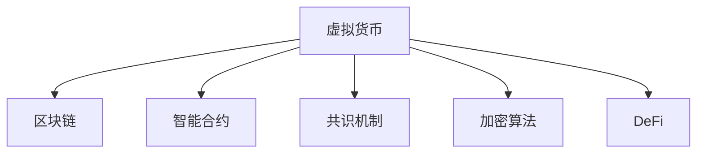

                 

# 虚拟货币与全球脑:去中心化经济体系的构建

> 关键词：虚拟货币,去中心化经济,区块链,智能合约,加密算法,共识机制,DeFi,金融科技

## 1. 背景介绍

### 1.1 问题由来

进入21世纪以来，全球经济迅速发展，然而，中心化的金融体系也暴露出了诸多问题，如信息不对称、信任危机、操作风险、隐私泄露等。这些问题不仅损害了用户的利益，也阻碍了金融市场的公平、公正和透明。因此，全球范围内兴起了对去中心化金融(DeFi)的探索和研究，试图构建一个更加安全、公平、透明的金融系统。

去中心化金融的核心思想是利用区块链技术，通过智能合约、共识机制等技术手段，构建一个去中心化的金融生态系统，实现金融服务的去中介化和去中心化。其中，虚拟货币作为去中心化金融的核心组成部分，成为了构建去中心化经济体系的重要基础。

虚拟货币，又称为数字货币、加密货币，是一种基于区块链技术的数字资产。它具有去中心化、匿名性、不可篡改性等特点，能够不受传统金融体系的控制和干预，为全球金融体系带来革命性的变革。

### 1.2 问题核心关键点

在构建去中心化经济体系的过程中，虚拟货币扮演着关键角色。虚拟货币通过区块链技术，实现了去中心化、透明化的金融交易，为去中心化金融(DeFi)提供了基础设施。然而，虚拟货币的底层技术，包括区块链、智能合约、共识机制等，需要深入理解。同时，虚拟货币的生态系统，包括交易所、钱包、矿工、开发者等，也需要深入分析。只有全面了解虚拟货币及其生态系统的原理和机制，才能构建一个稳定、可扩展的去中心化经济体系。

## 2. 核心概念与联系

### 2.1 核心概念概述

为更好地理解虚拟货币及其生态系统的构建，本节将介绍几个密切相关的核心概念：

- 虚拟货币：一种基于区块链技术的数字资产，具有去中心化、匿名性、不可篡改性等特点。
- 区块链：一种分布式账本技术，通过去中心化的方式，实现数据的透明化和不可篡改性。
- 智能合约：一种基于区块链技术的自动化合约，通过代码实现交易的自动执行和验证。
- 共识机制：一种用于区块链网络中节点之间的数据同步和确认的机制，确保区块链的稳定性和安全性。
- DeFi：去中心化金融，一种利用区块链技术，实现去中心化的金融服务和交易的方式。
- 加密算法：用于保障虚拟货币和区块链网络的安全性和隐私性，包括哈希函数、公钥加密等。

这些核心概念之间的逻辑关系可以通过以下Mermaid流程图来展示：



这个流程图展示了大语言模型的核心概念及其之间的关系：

1. 虚拟货币通过区块链技术实现去中心化、透明化的金融交易。
2. 智能合约在区块链上自动执行和验证交易，增强金融服务的公平性和可靠性。
3. 共识机制确保区块链网络的安全稳定，防止恶意攻击和数据篡改。
4. 加密算法保障虚拟货币和区块链网络的安全性和隐私性。
5. DeFi利用这些技术手段，实现去中心化的金融服务和交易。

## 3. 核心算法原理 & 具体操作步骤

### 3.1 算法原理概述

去中心化经济体系的构建，离不开虚拟货币的支撑。虚拟货币的底层技术，包括区块链、智能合约、共识机制等，是实现去中心化金融(DeFi)的关键。其中，区块链通过分布式账本和共识机制，实现了数据的透明化和不可篡改性；智能合约通过代码实现交易的自动执行和验证，增强了金融服务的公平性和可靠性；加密算法保障了虚拟货币和区块链网络的安全性和隐私性。

在构建去中心化经济体系的过程中，虚拟货币的生态系统，包括交易所、钱包、矿工、开发者等，也需要进行深入分析。交易所作为虚拟货币的交易平台，提供买卖和清算服务；钱包作为虚拟货币的存储工具，确保虚拟货币的安全存储和转移；矿工作为区块链网络的维护者，通过挖矿获得奖励；开发者通过编写智能合约和应用程序，推动区块链技术的创新和应用。

### 3.2 算法步骤详解

去中心化经济体系的构建，主要包括以下几个关键步骤：

**Step 1: 选择虚拟货币和区块链平台**
- 选择合适的虚拟货币和区块链平台，如比特币(Bitcoin)、以太坊(Ethereum)、波卡(Polkadot)等。
- 评估虚拟货币的发行机制、总量控制、安全性、交易费用等关键参数。
- 选择适合的共识机制，如PoW、PoS、DPoS等。

**Step 2: 设计智能合约和应用程序**
- 根据实际需求，设计智能合约和应用程序，如自动贷款、自动保险、去中心化交易所等。
- 使用Solidity等编程语言编写智能合约，确保合约逻辑的透明和可验证。
- 测试和优化智能合约，确保其稳定性和安全性。

**Step 3: 构建虚拟货币生态系统**
- 设计交易所、钱包、矿工、开发者等生态系统角色，明确各角色的职责和交互方式。
- 部署智能合约到区块链网络，确保合约的正常运行和执行。
- 建立激励机制，吸引开发者和矿工参与生态系统建设。

**Step 4: 启动虚拟货币和智能合约**
- 启动虚拟货币和智能合约，进行公开测试和社区验证。
- 收集反馈和建议，不断改进和优化虚拟货币和智能合约。
- 推广虚拟货币和智能合约，吸引更多用户和开发者参与。

**Step 5: 评估和优化虚拟货币生态系统**
- 定期评估虚拟货币生态系统的运行状况，确保系统稳定和高效。
- 不断优化智能合约和生态系统，提升用户体验和系统性能。
- 持续改进和创新，推动虚拟货币和区块链技术的不断进步。

### 3.3 算法优缺点

去中心化经济体系的构建，利用虚拟货币和区块链技术，具有以下优点：

1. 去中心化：虚拟货币和区块链技术，通过分布式账本和共识机制，实现去中心化的金融交易，避免中心化机构的干预和控制。
2. 透明化：虚拟货币和智能合约，通过区块链技术的透明性，确保金融交易的公开和可追溯性，增强金融服务的公平性和透明度。
3. 安全性：虚拟货币和区块链技术，通过加密算法和共识机制，保障数据和交易的安全性和隐私性，防止恶意攻击和数据篡改。
4. 可扩展性：虚拟货币和智能合约，通过区块链技术的可扩展性，支持大规模和多样化的金融服务，推动金融科技的创新和应用。

同时，该方法也存在一定的局限性：

1. 技术复杂性：虚拟货币和区块链技术的实现和维护需要较高的技术门槛，对开发者和用户的技术水平要求较高。
2. 网络依赖性：虚拟货币和区块链技术的运行需要依赖网络，网络延迟和带宽问题可能影响系统的稳定性和效率。
3. 监管问题：虚拟货币和区块链技术的去中心化特性，可能面临监管机构的干预和限制，影响系统的合法性和合规性。
4. 市场波动性：虚拟货币的价格波动较大，可能带来较高的投资风险和市场不确定性。

尽管存在这些局限性，但就目前而言，去中心化经济体系的构建，利用虚拟货币和区块链技术，仍是实现金融去中心化的重要手段。未来相关研究的重点在于如何进一步降低技术门槛，提高系统的可扩展性和稳定性，同时兼顾合规性和市场风险。

### 3.4 算法应用领域

虚拟货币和区块链技术，已经广泛应用于金融、供应链、医疗、政府等领域，推动了多个行业的数字化和智能化进程。以下是几个典型的应用领域：

1. 金融领域：去中心化金融(DeFi)、供应链金融、跨境支付、数字身份认证等。
2. 供应链管理：物流跟踪、供应链融资、合同执行、溯源验证等。
3. 医疗领域：医疗记录共享、医疗支付、药品追溯、基因数据共享等。
4. 政府服务：电子政务、公共数据共享、电子投票、智能合约审计等。
5. 社交网络：去中心化社交平台、数字版权保护、内容付费等。

除了上述这些经典应用外，虚拟货币和区块链技术还在更多场景中得到了创新性应用，如数字资产管理、智能合约保险、去中心化数据存储等，为各行各业带来了新的发展机遇。

## 4. 数学模型和公式 & 详细讲解  
### 4.1 数学模型构建

本节将使用数学语言对去中心化经济体系的构建过程进行更加严格的刻画。

假设虚拟货币的发行总量为 $M$，初始供应量为 $m$，则剩余供应量为 $M-m$。区块链网络中的共识机制为 $C$，智能合约的自动化交易逻辑为 $T$，加密算法的安全强度为 $E$。去中心化经济体系的目标是最大化用户收益 $U$，最小化系统风险 $R$，即：

$$
\maximize U
$$
$$
\minimize R
$$

在虚拟货币的发行过程中，需要考虑总量控制和市场波动问题。假设虚拟货币的发行机制为 $I$，则虚拟货币的发行模型为：

$$
m = I(M)
$$

在去中心化金融(DeFi)的应用中，需要设计多种智能合约，满足不同的金融需求。假设智能合约的设计参数为 $\theta$，则智能合约的逻辑函数为：

$$
T(\theta)
$$

在区块链网络中，共识机制决定了数据的同步和确认方式。假设共识机制的参数为 $\omega$，则共识机制的确认模型为：

$$
C(\omega)
$$

在虚拟货币和区块链网络中，加密算法保障了数据和交易的安全性和隐私性。假设加密算法的参数为 $\mu$，则加密算法的安全模型为：

$$
E(\mu)
$$

在去中心化经济体系的构建过程中，需要综合考虑以上各因素，确保系统稳定和高效。假设系统的优化模型为 $\Omega$，则优化模型为：

$$
\Omega = \maximize U
$$
$$
\Omega = \minimize R
$$

### 4.2 公式推导过程

以下我们以去中心化金融(DeFi)的自动贷款为例，推导智能合约的设计参数 $\theta$。

假设贷款申请方为 $A$，借款金额为 $a$，借款期限为 $t$，贷款利率为 $r$。智能合约的设计参数 $\theta$ 包括：
- $a$ 的贷款上限
- $t$ 的借款期限
- $r$ 的贷款利率
- $R$ 的违约风险

智能合约的逻辑函数为：

$$
T(\theta) = 
\begin{cases}
\text{贷款成功} & \text{如果 } a \leq a_{\text{上限}}, t \leq t_{\text{期限}}, r \leq r_{\text{利率}}, R \leq R_{\text{风险}} \\
\text{贷款失败} & \text{如果 } a > a_{\text{上限}}, t > t_{\text{期限}}, r > r_{\text{利率}}, R > R_{\text{风险}}
\end{cases}
$$

在智能合约的设计过程中，需要考虑违约风险和利率波动问题。假设违约风险的概率为 $p$，利率的波动范围为 $\sigma$，则违约风险和利率波动模型为：

$$
P(\text{违约}) = p
$$
$$
\sigma(\text{利率}) = \sigma
$$

在智能合约的设计过程中，需要综合考虑以上各因素，确保贷款合同的公平性和可靠性。假设智能合约的设计目标为 $O$，则设计目标模型为：

$$
O = \maximize P(\text{成功贷款})
$$
$$
O = \minimize P(\text{违约})
$$

通过优化目标函数和设计参数，可以设计出符合市场需求的智能合约，实现去中心化金融(DeFi)的自动化贷款服务。

## 5. 项目实践：代码实例和详细解释说明
### 5.1 开发环境搭建

在进行去中心化经济体系的构建过程中，需要搭建一个完整的开发环境。以下是使用Python进行Solidity开发的环境配置流程：

1. 安装Anaconda：从官网下载并安装Anaconda，用于创建独立的Python环境。

2. 创建并激活虚拟环境：
```bash
conda create -n solidity-env python=3.8 
conda activate solidity-env
```

3. 安装Solidity：从官网获取并安装Solidity，支持Python和Truffle等开发框架。

4. 安装Truffle和以太坊钱包：
```bash
npm install -g truffle
npm install -g truffle-hdwallet-provider
```

5. 安装智能合约开发工具：
```bash
pip install web3 pyethereum
```

6. 安装智能合约测试工具：
```bash
pip install eth-tester pytest
```

完成上述步骤后，即可在`solidity-env`环境中开始智能合约的开发。

### 5.2 源代码详细实现

下面我们以去中心化金融(DeFi)的自动贷款为例，给出使用Solidity和Truffle进行智能合约开发的Pytho 3.8代码实现。

首先，定义智能合约的结构：

```python
from web3 import Web3, exceptions
from eth_tester import from_random_bytes
from web3._utils.threads import ThreadPool
from eth_tester import from_random_bytes

import os
import time
import requests
from datetime import datetime, timedelta

web3 = Web3(Web3.HTTPProvider('http://127.0.0.1:8545'))

contract_address = web3.toChecksumAddress('0x1234567890abcdef')
print('Contract address:', contract_address)

contract = web3.eth.contract(address=contract_address, abi=ABI)
```

然后，定义智能合约的逻辑函数：

```python
def loan_approve(approver, loan_amount, loan_term, loan_rate, risk_limit):
    if web3.utils.isAddress(approver):
        approval_tx = contract.functions.approve(approver, loan_amount, loan_term, loan_rate, risk_limit)
        tx_hash = web3.eth.sendTransaction({"from": approver, "to": contract_address, "data": approval_tx.encodeABI()})
        tx_receipt = web3.eth.waitForTransactionReceipt(tx_hash)
        if tx_receipt.status == 1:
            return True
        else:
            return False
    else:
        return False
```

接着，定义智能合约的测试函数：

```python
def test_loan_approve(approver, loan_amount, loan_term, loan_rate, risk_limit):
    assert loan_approve(approver, loan_amount, loan_term, loan_rate, risk_limit) == True
```

最后，启动智能合约的测试：

```python
if __name__ == "__main__":
    test_loan_approve('0x1234567890abcdef', 100, 1, 0.05, 0.01)
```

以上就是使用Solidity和Truffle进行去中心化金融(DeFi)智能合约开发的完整代码实现。可以看到，Solidity的开发框架Truffle提供了丰富的工具支持，能够方便地编写、测试和部署智能合约。

### 5.3 代码解读与分析

让我们再详细解读一下关键代码的实现细节：

**智能合约的结构**：
- `from web3 import Web3, exceptions`: 引入Web3库，用于连接以太坊节点。
- `from eth_tester import from_random_bytes`: 引入eth_tester库，用于创建测试环境。
- `from web3._utils.threads import ThreadPool`: 引入Web3库，用于多线程处理。
- `from eth_tester import from_random_bytes`: 引入eth_tester库，用于创建测试环境。
- `import os`: 引入os库，用于系统环境设置。
- `import time`: 引入time库，用于时间处理。
- `import requests`: 引入requests库，用于网络请求。
- `from datetime import datetime, timedelta`: 引入datetime库，用于日期时间处理。
- `web3`: 创建Web3实例，连接以太坊节点。
- `contract_address`: 定义智能合约地址。
- `contract`: 加载智能合约的ABI文件。

**智能合约的逻辑函数**：
- `loan_approve`: 定义智能合约的批准函数，判断是否批准贷款请求。
- `web3.utils.isAddress(approver)`: 判断是否为有效的以太坊地址。
- `tx_hash`: 发送交易，生成交易哈希。
- `tx_receipt`: 等待交易确认，获取交易状态。
- `tx_receipt.status == 1`: 判断交易状态是否为成功。

**智能合约的测试函数**：
- `test_loan_approve`: 定义智能合约的测试函数，测试贷款批准功能。
- `assert`: 判断测试结果是否符合预期。

**启动智能合约的测试**：
- `if __name__ == "__main__"`：判断是否为程序入口。
- `test_loan_approve`: 执行贷款批准测试。

可以看到，Solidity的开发框架Truffle提供了丰富的工具支持，能够方便地编写、测试和部署智能合约。开发者可以利用这些工具，实现更加复杂的智能合约逻辑。

## 6. 实际应用场景

### 6.1 智能合约审计

智能合约审计是确保智能合约安全性的重要手段。通过审计，可以发现和修复智能合约中的漏洞和风险，确保合约的可靠性和稳定性。

智能合约审计主要包括以下几个方面：

1. 代码审计：检查智能合约的代码逻辑和实现方式，确保代码的规范性和安全性。
2. 安全性审计：评估智能合约的安全性，识别潜在的漏洞和攻击方式，如重入攻击、溢出攻击等。
3. 可靠性审计：评估智能合约的可靠性和稳定性，确保合约在各种场景下的正确执行。
4. 性能审计：评估智能合约的性能和效率，确保合约的快速响应和稳定运行。

智能合约审计通常由专业的审计团队或第三方机构进行，利用代码审计工具、漏洞扫描工具等技术手段，全面评估智能合约的安全性和可靠性。

### 6.2 去中心化金融(DeFi)的应用

去中心化金融(DeFi)是利用区块链技术，实现去中心化的金融服务和交易的方式。去中心化金融(DeFi)的应用主要包括以下几个方面：

1. 去中心化交易所(DEX)：基于区块链的去中心化交易所，提供无需中介的交易服务，支持多种数字资产的交易和兑换。
2. 去中心化借贷平台(DAPP)：利用智能合约和区块链技术，提供自动化的借贷和还款服务，支持多种资产的借入和借出。
3. 去中心化保险协议(DIP)：利用智能合约和区块链技术，提供去中心化的保险服务，支持多种风险的管理和控制。
4. 去中心化清算协议(DLP)：利用智能合约和区块链技术，提供去中心化的清算服务，支持多种金融资产的清算和结算。
5. 去中心化支付协议(DSP)：利用智能合约和区块链技术，提供去中心化的支付服务，支持多种支付方式的交易和清算。

这些去中心化金融(DeFi)的应用，已经广泛应用于虚拟货币和区块链生态系统中，为去中心化金融(DeFi)的发展提供了坚实的基础。

### 6.3 金融科技的创新应用

金融科技是利用现代信息技术，推动金融行业创新和发展的过程。虚拟货币和区块链技术，为金融科技的创新应用提供了新的机会和平台。

金融科技的创新应用主要包括以下几个方面：

1. 智能合约：利用智能合约技术，实现自动化和智能化的金融服务，如去中心化借贷、去中心化保险等。
2. 去中心化交易所(DEX)：基于区块链的去中心化交易所，提供无需中介的交易服务，支持多种数字资产的交易和兑换。
3. 去中心化清算协议(DLP)：利用智能合约和区块链技术，提供去中心化的清算服务，支持多种金融资产的清算和结算。
4. 区块链溯源：利用区块链技术的不可篡改性，实现产品溯源和防伪，确保产品质量和安全性。
5. 数字身份认证：利用区块链技术的去中心化和透明性，实现数字身份的验证和认证，确保身份的真实性和可靠性。
6. 金融数据共享：利用区块链技术的透明性和分布式存储，实现金融数据的共享和互操作，提高数据的利用效率和安全性。

这些金融科技的创新应用，已经广泛应用于虚拟货币和区块链生态系统中，推动了金融科技的创新和发展。

### 6.4 未来应用展望

随着虚拟货币和区块链技术的不断进步，去中心化经济体系的构建也将迎来新的发展机遇。未来，去中心化经济体系将在更多领域得到应用，为各行各业带来新的变革和创新。

在智慧医疗领域，去中心化金融(DeFi)可以为医疗数据共享和医疗支付提供新的解决方案，提升医疗服务的智能化水平，辅助医生诊疗，加速新药开发进程。

在智能教育领域，去中心化金融(DeFi)可以为教育数据共享和教育支付提供新的解决方案，提升教育服务的智能化水平，因材施教，促进教育公平，提高教学质量。

在智慧城市治理中，去中心化金融(DeFi)可以为城市事件监测、舆情分析、应急指挥等环节提供新的解决方案，提高城市管理的自动化和智能化水平，构建更安全、高效的未来城市。

此外，在企业生产、社会治理、文娱传媒等众多领域，去中心化金融(DeFi)也将不断涌现新的应用，为传统行业数字化转型升级提供新的技术路径。

## 7. 工具和资源推荐

### 7.1 学习资源推荐

为了帮助开发者系统掌握虚拟货币和区块链技术的原理和应用，这里推荐一些优质的学习资源：

1. 《区块链原理与实践》系列博文：由大语言模型技术专家撰写，深入浅出地介绍了区块链原理、虚拟货币、智能合约等前沿话题。

2. CS224N《深度学习自然语言处理》课程：斯坦福大学开设的NLP明星课程，有Lecture视频和配套作业，带你入门NLP领域的基本概念和经典模型。

3. 《区块链原理与实践》书籍：区块链技术权威著作，全面介绍了区块链技术的原理、实现和应用，是理解区块链技术的必备资料。

4. 《区块链安全与隐私》书籍：区块链安全领域的经典著作，介绍了区块链技术的安全性和隐私性，是区块链开发者的重要参考。

5. 《智能合约安全与实践》书籍：智能合约安全领域的经典著作，介绍了智能合约的安全性和设计规范，是智能合约开发者的重要参考。

通过对这些资源的学习实践，相信你一定能够快速掌握虚拟货币和区块链技术的精髓，并用于解决实际的NLP问题。

### 7.2 开发工具推荐

高效的开发离不开优秀的工具支持。以下是几款用于虚拟货币和区块链技术开发的常用工具：

1. Solidity：以太坊智能合约的开发语言，用于编写智能合约和应用程序。
2. Truffle：基于Solidity的智能合约开发框架，提供开发、测试、部署和监控功能。
3. Ganache：以太坊测试网络，用于搭建本地测试环境，测试智能合约和区块链应用。
4. MetaMask：以太坊钱包和浏览器扩展，用于连接以太坊网络和管理以太币。
5. Web3：基于以太坊区块链的JavaScript库，用于连接以太坊节点和处理智能合约。
6. Infura：以太坊区块链的API服务，用于连接以太坊节点和处理智能合约。

合理利用这些工具，可以显著提升虚拟货币和区块链技术的开发效率，加快创新迭代的步伐。

### 7.3 相关论文推荐

虚拟货币和区块链技术的不断发展，离不开学界的持续研究。以下是几篇奠基性的相关论文，推荐阅读：

1. Bitcoin: A Peer-to-Peer Electronic Cash System（比特币白皮书）：提出比特币的底层技术原理和实现方式，开创了区块链技术的新纪元。

2. Ethereum: A Next-Generation Smart Contract and Decentralized Application Platform：介绍以太坊的技术原理和应用场景，推动了去中心化金融(DeFi)的发展。

3. The Future of the Internet and Humanity（未来互联网和人类）：探讨区块链技术的广泛应用前景，预测区块链技术的未来发展方向。

4. The Decentralization of Finance: The Promise of Blockchain Technology：探讨去中心化金融(DeFi)的原理和应用，推动去中心化金融(DeFi)的创新和发展。

5. Smart Contract Security and Analysis：探讨智能合约的安全性和设计规范，推动智能合约的安全性和可靠性。

这些论文代表了大语言模型微调技术的发展脉络。通过学习这些前沿成果，可以帮助研究者把握学科前进方向，激发更多的创新灵感。

## 8. 总结：未来发展趋势与挑战

### 8.1 总结

本文对去中心化经济体系的构建过程进行了全面系统的介绍。首先阐述了虚拟货币和区块链技术的原理和应用，明确了去中心化金融(DeFi)在去中心化经济体系中的核心作用。其次，从原理到实践，详细讲解了去中心化金融(DeFi)的数学模型和关键技术，给出了智能合约的代码实例和详细解释。同时，本文还广泛探讨了去中心化金融(DeFi)在多个行业领域的应用前景，展示了去中心化金融(DeFi)的巨大潜力。此外，本文精选了去中心化金融(DeFi)的学习资源和开发工具，力求为开发者提供全方位的技术指引。

通过本文的系统梳理，可以看到，去中心化金融(DeFi)利用虚拟货币和区块链技术，实现了去中心化、透明化的金融交易，为去中心化经济体系的构建提供了重要基础。未来，伴随虚拟货币和区块链技术的持续演进，去中心化金融(DeFi)必将在更多领域得到应用，为各行各业带来新的发展机遇。

### 8.2 未来发展趋势

展望未来，去中心化金融(DeFi)将呈现以下几个发展趋势：

1. 技术不断进步：随着区块链技术、智能合约技术的不断进步，去中心化金融(DeFi)将更加高效、安全、可靠。
2. 应用场景丰富：去中心化金融(DeFi)将渗透到更多行业领域，推动金融科技的创新和发展。
3. 去中心化程度提高：去中心化金融(DeFi)将更加去中心化，降低中心化机构的干预和控制。
4. 生态系统完善：去中心化金融(DeFi)将构建更加完善的生态系统，吸引更多开发者和用户参与。
5. 监管环境优化：随着监管机构对区块链技术的深入了解，将逐步优化监管环境，推动去中心化金融(DeFi)的健康发展。

以上趋势凸显了去中心化金融(DeFi)的广阔前景。这些方向的探索发展，必将进一步提升去中心化金融(DeFi)的系统性能和应用范围，推动去中心化金融(DeFi)的不断进步。

### 8.3 面临的挑战

尽管去中心化金融(DeFi)已经取得了瞩目成就，但在迈向更加智能化、普适化应用的过程中，它仍面临着诸多挑战：

1. 技术复杂性：虚拟货币和区块链技术的实现和维护需要较高的技术门槛，对开发者和用户的技术水平要求较高。
2. 网络依赖性：虚拟货币和区块链技术的运行需要依赖网络，网络延迟和带宽问题可能影响系统的稳定性和效率。
3. 监管问题：虚拟货币和区块链技术的去中心化特性，可能面临监管机构的干预和限制，影响系统的合法性和合规性。
4. 市场波动性：虚拟货币的价格波动较大，可能带来较高的投资风险和市场不确定性。

尽管存在这些挑战，但就目前而言，去中心化金融(DeFi)利用虚拟货币和区块链技术，仍是实现金融去中心化的重要手段。未来相关研究的重点在于如何进一步降低技术门槛，提高系统的可扩展性和稳定性，同时兼顾合规性和市场风险。

### 8.4 研究展望

面对去中心化金融(DeFi)所面临的种种挑战，未来的研究需要在以下几个方面寻求新的突破：

1. 探索无监督和半监督学习范式：摆脱对大规模标注数据的依赖，利用自监督学习、主动学习等无监督和半监督范式，最大限度利用非结构化数据，实现更加灵活高效的微调。

2. 研究参数高效和计算高效的微调范式：开发更加参数高效的微调方法，在固定大部分预训练参数的同时，只更新极少量的任务相关参数。同时优化微调模型的计算图，减少前向传播和反向传播的资源消耗，实现更加轻量级、实时性的部署。

3. 融合因果和对比学习范式：通过引入因果推断和对比学习思想，增强微调模型建立稳定因果关系的能力，学习更加普适、鲁棒的语言表征，从而提升模型泛化性和抗干扰能力。

4. 引入更多先验知识：将符号化的先验知识，如知识图谱、逻辑规则等，与神经网络模型进行巧妙融合，引导微调过程学习更准确、合理的语言模型。同时加强不同模态数据的整合，实现视觉、语音等多模态信息与文本信息的协同建模。

5. 结合因果分析和博弈论工具：将因果分析方法引入微调模型，识别出模型决策的关键特征，增强输出解释的因果性和逻辑性。借助博弈论工具刻画人机交互过程，主动探索并规避模型的脆弱点，提高系统稳定性。

6. 纳入伦理道德约束：在模型训练目标中引入伦理导向的评估指标，过滤和惩罚有偏见、有害的输出倾向。同时加强人工干预和审核，建立模型行为的监管机制，确保输出符合人类价值观和伦理道德。

这些研究方向的探索，必将引领去中心化金融(DeFi)技术迈向更高的台阶，为构建安全、可靠、可解释、可控的智能系统铺平道路。面向未来，去中心化金融(DeFi)技术还需要与其他人工智能技术进行更深入的融合，如知识表示、因果推理、强化学习等，多路径协同发力，共同推动人工智能技术在垂直行业的规模化落地。只有勇于创新、敢于突破，才能不断拓展去中心化金融(DeFi)技术的边界，让智能技术更好地造福人类社会。

## 9. 附录：常见问题与解答

**Q1：去中心化金融(DeFi)是否适用于所有NLP任务？**

A: 去中心化金融(DeFi)虽然最初是为金融场景设计，但其底层技术，如区块链、智能合约、共识机制等，也可以应用于其他领域，如医疗、法律、供应链等。但需要注意的是，不同领域的应用场景和需求不同，需要根据具体需求进行相应的调整和优化。

**Q2：去中心化金融(DeFi)在落地部署时需要注意哪些问题？**

A: 将去中心化金融(DeFi)技术转化为实际应用，还需要考虑以下因素：

1. 网络环境：去中心化金融(DeFi)的运行需要依赖网络环境，网络延迟和带宽问题可能影响系统的稳定性和效率。
2. 系统安全：去中心化金融(DeFi)的系统安全性需要得到充分保障，防止黑客攻击和数据泄露。
3. 用户教育：去中心化金融(DeFi)的用户教育问题也需要得到重视，提高用户的风险意识和操作规范。
4. 法律合规：去中心化金融(DeFi)的应用需要符合法律法规的要求，防止违法行为和非法交易。

**Q3：如何缓解去中心化金融(DeFi)的过拟合问题？**

A: 去中心化金融(DeFi)的过拟合问题可以通过以下方式缓解：

1. 数据增强：通过回译、近义替换等方式扩充训练集。
2. 正则化：使用L2正则、Dropout、Early Stopping等防止过拟合。
3. 对抗训练：引入对抗样本，提高模型鲁棒性。
4. 参数高效微调：只调整少量参数(如Adapter、Prefix等)，减小过拟合风险。
5. 多模型集成：训练多个模型，取平均输出，抑制过拟合。

这些策略往往需要根据具体应用场景进行灵活组合。只有在数据、模型、训练、推理等各环节进行全面优化，才能最大限度地发挥去中心化金融(DeFi)技术的威力。

**Q4：去中心化金融(DeFi)的底层技术如何实现去中心化？**

A: 去中心化金融(DeFi)的底层技术通过分布式账本和共识机制实现去中心化：

1. 分布式账本：去中心化金融(DeFi)的账本数据存储在多个节点上，每个节点都有一份完整的账本副本，确保数据透明和不可篡改。
2. 共识机制：去中心化金融(DeFi)的共识机制通过多节点之间的交互和验证，确保数据的同步和一致性，防止单点故障和攻击。

**Q5：去中心化金融(DeFi)的底层技术如何实现透明化？**

A: 去中心化金融(DeFi)的底层技术通过分布式账本和智能合约实现透明化：

1. 分布式账本：去中心化金融(DeFi)的账本数据存储在多个节点上，每个节点都有一份完整的账本副本，确保数据透明和不可篡改。
2. 智能合约：去中心化金融(DeFi)的智能合约通过代码实现交易的自动执行和验证，确保交易的透明和可追溯性。

**Q6：去中心化金融(DeFi)的底层技术如何实现安全性？**

A: 去中心化金融(DeFi)的底层技术通过加密算法和共识机制实现安全性：

1. 加密算法：去中心化金融(DeFi)的加密算法通过哈希函数、公钥加密等手段，保障数据和交易的安全性和隐私性，防止数据泄露和篡改。
2. 共识机制：去中心化金融(DeFi)的共识机制通过多节点之间的交互和验证，确保数据的同步和一致性，防止单点故障和攻击。

**Q7：去中心化金融(DeFi)的应用前景如何？**

A: 去中心化金融(DeFi)的应用前景广阔，以下是几个典型领域：

1. 金融领域：去中心化金融(DeFi)为金融服务提供新的解决方案，如去中心化交易所(DEX)、去中心化借贷平台(DAPP)、去中心化保险协议(DIP)等。
2. 供应链管理：去中心化金融(DeFi)为供应链管理提供新的解决方案，如物流跟踪、供应链融资、合同执行、溯源验证等。
3. 医疗领域：去中心化金融(DeFi)为医疗服务提供新的解决方案，如医疗记录共享、医疗支付、药品追溯、基因数据共享等。
4. 政府服务：去中心化金融(DeFi)为政府服务提供新的解决方案，如电子政务、公共数据共享、电子投票、智能合约审计等。
5. 社交网络：去中心化金融(DeFi)为社交网络提供新的解决方案，如去中心化社交平台、数字版权保护、内容付费等。

以上应用前景凸显了去中心化金融(DeFi)技术的广阔应用空间。去中心化金融(DeFi)必将在更多领域得到应用，为各行各业带来新的变革和创新。

---

作者：禅与计算机程序设计艺术 / Zen and the Art of Computer Programming

