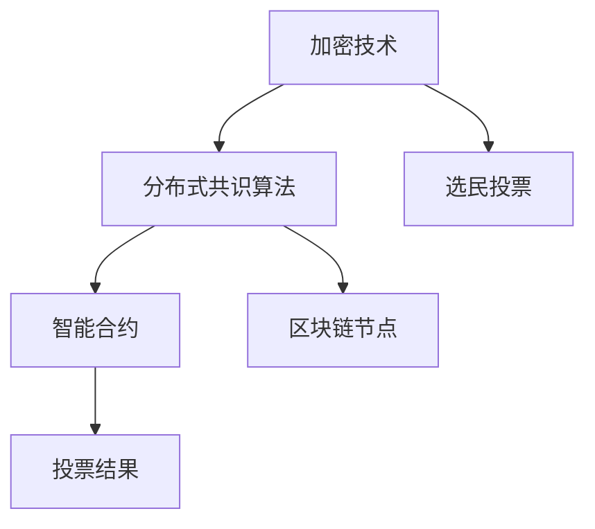

                 

# 虚拟选举:全球民主参与的数字化实践

## 1. 背景介绍

随着信息技术的发展和互联网的普及，民主选举的数字化实践在全球范围内逐渐兴起。传统的选举方式依赖于纸质选票、人工统计，耗时长、成本高，且存在统计出错的风险。而通过数字化手段，可以大大简化选举过程，提高选举的公平性、透明性和效率。

虚拟选举（Virtual Voting），即通过互联网、手机应用等平台进行的数字化投票方式，使得选民可以在任何地点、任何时间进行投票，不受时间、空间和天气等因素的影响。虚拟选举系统通常采用加密技术、区块链等手段保障选民的投票安全，确保投票结果的真实性和不可篡改性。

虚拟选举的实现离不开计算机科学和网络技术的发展。从基础的密码学原理到高级的分布式系统架构，虚拟选举系统包含了大量的技术细节。本文将对虚拟选举的核心概念、技术原理和实际应用进行详细探讨，并分析其面临的挑战和未来发展趋势。

## 2. 核心概念与联系

### 2.1 核心概念概述

虚拟选举系统的核心技术包括加密技术、分布式共识算法、智能合约等。这些技术相互配合，保障了投票的安全性、透明性和可信性。

- **加密技术**：确保选民的投票信息在网络传输和存储过程中的安全性，防止信息泄露和篡改。
- **分布式共识算法**：通过区块链等技术，确保投票数据的不可篡改性和去中心化存储。
- **智能合约**：实现投票规则的自动化执行，确保投票过程的公平性和透明性。

这些技术通过逻辑和架构上的合理设计，共同构成了虚拟选举系统的技术基础。

### 2.2 核心概念原理和架构的 Mermaid 流程图



此图展示了虚拟选举系统的核心流程和技术架构：选民通过加密技术进行投票，分布式共识算法确保投票数据的不可篡改性，智能合约自动执行投票规则并生成投票结果。

## 3. 核心算法原理 & 具体操作步骤

### 3.1 算法原理概述

虚拟选举系统主要依赖于密码学中的公钥加密技术、数字签名技术和分布式账本技术。选民使用公钥加密技术对投票信息进行加密，确保投票过程的安全性。而分布式账本（如区块链）则保证了投票数据的不可篡改性和去中心化存储。

### 3.2 算法步骤详解

1. **选民注册与身份验证**：选民需要通过身份验证才能进行投票。系统通常要求选民提供有效的身份证明信息，如身份证号码、指纹等，确保选民身份的真实性。

2. **生成公钥和私钥**：选民使用密码学算法生成公钥和私钥，公钥用于加密投票信息，私钥用于数字签名。

3. **加密投票信息**：选民使用公钥对投票信息进行加密，生成密文。

4. **数字签名**：选民使用私钥对加密后的投票信息进行数字签名，确保投票信息的完整性和不可否认性。

5. **投票上传**：选民将加密后的投票信息和数字签名上传至分布式账本系统。

6. **共识算法验证**：分布式账本系统通过共识算法（如PoW、PoS）验证投票信息的合法性，确保投票结果的真实性和不可篡改性。

7. **投票统计**：分布式账本系统自动执行智能合约，统计投票结果，并生成最终的投票结果报告。

8. **结果公布**：投票结果报告公开透明，选民可以随时查询自己的投票是否成功，以及最终的投票结果。

### 3.3 算法优缺点

**优点**：
- **高效性**：选民可以在任何地点、任何时间进行投票，不受时间和空间限制。
- **透明性**：投票过程和结果公开透明，选民可以随时查询自己的投票信息。
- **安全性**：使用公钥加密和数字签名技术，保障选民投票信息的安全性和不可篡改性。

**缺点**：
- **技术门槛高**：需要具备一定的网络知识和操作技能，部分选民可能无法顺利使用。
- **网络依赖性强**：选民需要稳定的网络连接才能完成投票，网络故障可能导致投票失败。
- **隐私保护**：选民的个人信息和投票信息需要妥善保护，避免信息泄露和滥用。

### 3.4 算法应用领域

虚拟选举技术不仅可以用于正式的选举过程，还可以应用于以下领域：

- **企业选举**：企业内部进行员工代表选举或股东投票，利用虚拟选举系统提高效率和透明度。
- **社团组织投票**：社会团体、非政府组织等进行成员选举或项目投票，通过虚拟选举系统简化流程。
- **校园选举**：学校、大学等教育机构进行学生代表或学生会选举，使用虚拟选举系统提升投票公平性和参与度。
- **公益投票**：各类公益活动、社会福利项目等需要进行公众投票时，虚拟选举系统可以提高投票参与度和透明性。

## 4. 数学模型和公式 & 详细讲解 & 举例说明

### 4.1 数学模型构建

虚拟选举系统涉及的数学模型主要包括公钥加密、数字签名和共识算法。

- **公钥加密模型**：假设公钥为 $E_k$，私钥为 $D_k$，选民使用 $E_k$ 加密投票信息 $M$，生成密文 $C$。则加密过程为：
$$
C = E_k(M)
$$
解密过程为：
$$
M' = D_k(C)
$$
其中 $M'$ 是解密后的明文。

- **数字签名模型**：假设数字签名算法为 $S_k$，选民使用私钥 $D_k$ 对密文 $C$ 进行数字签名，生成签名 $S$。则数字签名的过程为：
$$
S = S_k(D_k(C))
$$
验证签名的过程为：
$$
\text{Verify}(S, C) = \begin{cases}
1 & \text{if } S_k(E_k(C)) = S \\
0 & \text{otherwise}
\end{cases}
$$

- **共识算法模型**：假设共识算法为 $V$，分布式账本系统通过 $V$ 验证投票信息 $C$ 的合法性。则共识算法的验证过程为：
$$
V(C) = \begin{cases}
1 & \text{if } \text{合法} \\
0 & \text{otherwise}
\end{cases}
$$

### 4.2 公式推导过程

- **公钥加密公式推导**：
$$
C = E_k(M) = (M)^{e} \bmod n
$$
其中 $e$ 为公钥加密指数，$n$ 为公钥加密模数。

- **数字签名公式推导**：
$$
S = S_k(D_k(C)) = (D_k(C))^{d} \bmod q
$$
其中 $d$ 为私钥解密指数，$q$ 为私钥解密模数。

- **共识算法公式推导**：
$$
V(C) = V(\text{加密投票信息}) = \begin{cases}
1 & \text{if } \text{投票信息合法} \\
0 & \text{otherwise}
\end{cases}
$$

### 4.3 案例分析与讲解

以一个简单的虚拟选举案例为例，选民 $A$ 希望投票支持候选人 $B$，其步骤如下：

1. 选民 $A$ 生成公钥 $E_A$ 和私钥 $D_A$。
2. 选民 $A$ 将候选人的标识信息 $B$ 作为投票信息 $M$，使用公钥 $E_A$ 加密生成密文 $C$：
$$
C = (B)^{e} \bmod n
$$
3. 选民 $A$ 使用私钥 $D_A$ 对密文 $C$ 进行数字签名，生成签名 $S$：
$$
S = (D_A(C))^{d} \bmod q
$$
4. 选民 $A$ 将密文 $C$ 和数字签名 $S$ 上传至分布式账本系统。
5. 分布式账本系统通过共识算法 $V$ 验证投票信息的合法性，如果验证通过，则将 $C$ 记录到区块链上。
6. 最终，系统统计投票结果，生成投票报告，并公开透明地展示给选民 $A$。

通过上述案例，可以清晰地看到虚拟选举系统的核心流程和技术原理。

## 5. 项目实践：代码实例和详细解释说明

### 5.1 开发环境搭建

虚拟选举系统的开发环境包括Python、区块链开发框架（如Hyperledger Fabric、Ripple）和数据库系统（如MySQL、MongoDB）。具体步骤如下：

1. 安装Python和相关开发工具，如IDE（如PyCharm、Visual Studio Code）。
2. 安装区块链开发框架和智能合约语言（如Solidity、Go）。
3. 配置数据库系统，创建选民信息和投票数据表。
4. 搭建开发环境，部署本地测试网络。

### 5.2 源代码详细实现

以下是一个简单的Python代码示例，用于实现选民投票和智能合约：

```python
from cryptography.hazmat.primitives.asymmetric import rsa
from cryptography.hazmat.primitives import serialization, hashes
from cryptography.hazmat.primitives.asymmetric import padding
from cryptography.hazmat.primitives import serialization
from cryptography.hazmat.primitives.asymmetric import ec
from cryptography.hazmat.primitives import serialization
from cryptography.hazmat.primitives import serialization, hashes
from cryptography.hazmat.primitives.asymmetric import padding
from cryptography.hazmat.primitives import serialization
from cryptography.hazmat.primitives.asymmetric import ec

# 生成公钥和私钥
def generate_keys():
    private_key = rsa.generate_private_key(
        public_exponent=65537,
        key_size=2048
    )
    public_key = private_key.public_key()
    return private_key, public_key

# 加密投票信息
def encrypt_message(message, public_key):
    encrypted_message = public_key.encrypt(
        message,
        padding.OAEP(
            mgf=padding.MGF1(algorithm=hashes.SHA256()),
            algorithm=hashes.SHA256(),
            label=None
        )
    )
    return encrypted_message

# 数字签名
def sign_message(message, private_key):
    signature = private_key.sign(
        message,
        padding.PSS(
            mgf=padding.MGF1(algorithm=hashes.SHA256()),
            salt_length=padding.PSS.MAX_LENGTH,
            hash_algorithm=hashes.SHA256()
        )
    )
    return signature

# 智能合约
def vote_counting():
    # 智能合约代码实现
    pass

# 选民投票流程
def vote():
    private_key, public_key = generate_keys()
    message = b'vote for candidate B'
    encrypted_message = encrypt_message(message, public_key)
    signature = sign_message(message, private_key)
    # 将投票信息上传到区块链
    blockchain.upload_data(encrypted_message, signature)
    # 调用智能合约进行投票统计
    vote_counting()

# 运行投票流程
vote()
```

### 5.3 代码解读与分析

上述代码实现了虚拟选举系统的核心功能：

- **公钥和私钥生成**：使用RSA算法生成公钥和私钥，确保选民身份的真实性。
- **加密投票信息**：使用公钥对投票信息进行加密，确保投票信息的安全性。
- **数字签名**：使用私钥对投票信息进行数字签名，确保投票信息的完整性和不可否认性。
- **智能合约调用**：智能合约自动统计投票结果，并生成投票报告。

### 5.4 运行结果展示

运行上述代码，可以模拟选民进行投票的过程，生成投票信息和数字签名，并将投票信息上传到分布式账本系统。最终，通过智能合约统计投票结果，生成投票报告。

## 6. 实际应用场景

虚拟选举系统已经在多个领域得到应用，以下列举几个典型的应用场景：

### 6.1 政府选举

政府选举通常需要大量人力和时间进行选民登记、投票和计票。通过虚拟选举系统，可以大幅提高选举的效率和透明度。选民可以通过互联网和手机应用进行投票，避免了传统选举中人手短缺和统计出错的问题。

### 6.2 企业选举

企业内部进行员工代表或股东投票时，虚拟选举系统可以简化流程，提高投票效率。员工通过企业内部系统进行投票，快速统计出投票结果，避免了传统选举中冗长的纸质投票和计票过程。

### 6.3 社团组织选举

社会团体、非政府组织等组织进行成员选举时，虚拟选举系统可以方便选民进行投票，提高了投票的公平性和透明度。社团成员可以通过在线平台进行投票，避免了传统选举中投票地点和时间的不便。

### 6.4 校园选举

学校、大学等教育机构进行学生代表或学生会选举时，虚拟选举系统可以提高投票的参与度和透明度。学生可以通过学校官网或应用进行投票，实时统计投票结果，确保选举的公正性。

### 6.5 公益投票

各类公益活动、社会福利项目等需要进行公众投票时，虚拟选举系统可以提高投票的参与度和透明度。公众可以通过在线平台进行投票，实时查看投票结果，确保公益资金的使用公平合理。

## 7. 工具和资源推荐

### 7.1 学习资源推荐

为了帮助开发者系统掌握虚拟选举系统的开发技术，以下是一些优质的学习资源：

1. **区块链技术教程**：如《Mastering Bitcoin》、《Ethereum and IPFS》等书籍，介绍了区块链和智能合约的基本概念和实现方法。
2. **Python编程语言**：如《Python for Data Analysis》、《Fluent Python》等书籍，介绍了Python编程语言的基础知识和高级技巧。
3. **网络安全课程**：如Coursera上的《Introduction to Cryptography》、Udemy上的《Web Application Penetration Testing》等课程，介绍了网络安全的基本知识和技能。
4. **分布式系统设计**：如《Designing Distributed Systems》、《Introduction to Distributed Algorithms》等书籍，介绍了分布式系统设计和实现的基本原则和方法。

### 7.2 开发工具推荐

虚拟选举系统的开发工具包括区块链框架、智能合约语言和数据库系统等，以下是一些常用的工具推荐：

1. **Hyperledger Fabric**：一个开源的区块链框架，提供了智能合约和区块链事务的支持。
2. **Solidity**：一种用于编写智能合约的编程语言，兼容Ethereum等区块链平台。
3. **MySQL**：一个开源的关系型数据库，支持虚拟选举系统的数据存储和查询。
4. **MongoDB**：一个开源的NoSQL数据库，支持虚拟选举系统的数据存储和查询。
5. **Ethereum**：一个去中心化的区块链平台，支持智能合约的编写和部署。

### 7.3 相关论文推荐

虚拟选举系统的研究和应用涉及密码学、区块链和智能合约等多个领域，以下是几篇有影响力的相关论文：

1. **Cryptography and Network Security**：该书详细介绍了密码学和网络安全的基本概念和实现方法。
2. **Blockchain Technology: Concepts, Architectures and Applications**：该书介绍了区块链技术的基本原理和应用场景。
3. **Programming Solidity**：该书介绍了Solidity编程语言的语法和应用实例。
4. **Distributed Algorithms**：该书介绍了分布式系统设计和实现的基本原则和方法。

## 8. 总结：未来发展趋势与挑战

### 8.1 研究成果总结

虚拟选举系统在提高投票效率、透明度和公平性方面取得了显著成果，受到了全球范围内的广泛关注。虚拟选举技术的应用不仅提升了选举的便利性，还增强了选举的透明度和公正性。

### 8.2 未来发展趋势

展望未来，虚拟选举系统的发展趋势如下：

1. **技术进步**：区块链技术、智能合约和加密技术的进步将进一步提升虚拟选举系统的性能和安全性。
2. **普及应用**：虚拟选举系统的普及应用将进一步扩展，覆盖更广泛的社会领域和应用场景。
3. **法律支持**：虚拟选举系统的应用将得到更多法律和政策的支持，确保其合法性和规范性。
4. **国际合作**：虚拟选举系统的国际合作和标准化将进一步推进，促进全球民主参与的发展。

### 8.3 面临的挑战

尽管虚拟选举系统在提高投票效率和透明度方面取得了显著成果，但仍面临一些挑战：

1. **技术门槛**：虚拟选举系统的技术实现需要一定的编程和区块链知识，部分选民可能难以理解和操作。
2. **网络依赖**：选民需要稳定的网络连接才能完成投票，网络故障可能导致投票失败。
3. **隐私保护**：选民的个人信息和投票信息需要妥善保护，避免信息泄露和滥用。
4. **法律和政策支持**：虚拟选举系统需要更多的法律和政策支持，确保其合法性和规范性。

### 8.4 研究展望

未来，虚拟选举系统的研究将继续关注以下几个方面：

1. **易用性和普及**：降低虚拟选举系统的技术门槛，使其更易于使用和普及。
2. **安全性提升**：进一步提升虚拟选举系统的安全性，确保投票结果的真实性和不可篡改性。
3. **法律和政策支持**：推动虚拟选举系统的法律和政策支持，确保其合法性和规范性。
4. **跨平台和跨设备支持**：实现虚拟选举系统的跨平台和跨设备支持，提升用户体验和便捷性。

## 9. 附录：常见问题与解答

**Q1: 什么是虚拟选举系统？**

A: 虚拟选举系统是一种通过互联网和区块链技术实现的数字化投票系统，使得选民可以在任何地点、任何时间进行投票，避免了传统选举中的人手短缺和统计出错的问题。

**Q2: 虚拟选举系统的主要技术包括哪些？**

A: 虚拟选举系统主要依赖于密码学中的公钥加密技术、数字签名技术和分布式账本技术。选民使用公钥加密技术对投票信息进行加密，确保投票过程的安全性；使用数字签名技术对投票信息进行数字签名，确保投票信息的完整性和不可否认性；通过分布式账本技术（如区块链）确保投票数据的不可篡改性和去中心化存储。

**Q3: 虚拟选举系统有哪些应用场景？**

A: 虚拟选举系统不仅可以用于正式的政府选举，还可以应用于企业选举、社团组织选举、校园选举、公益投票等多个领域，提高投票的效率和透明度。

**Q4: 虚拟选举系统面临哪些挑战？**

A: 虚拟选举系统面临的主要挑战包括技术门槛高、网络依赖性强、隐私保护问题以及法律和政策支持不足。

**Q5: 未来虚拟选举系统的发展方向是什么？**

A: 未来虚拟选举系统的发展方向包括技术进步、普及应用、法律支持以及国际合作，进一步提升系统的性能、安全性和普适性。

---

作者：禅与计算机程序设计艺术 / Zen and the Art of Computer Programming

