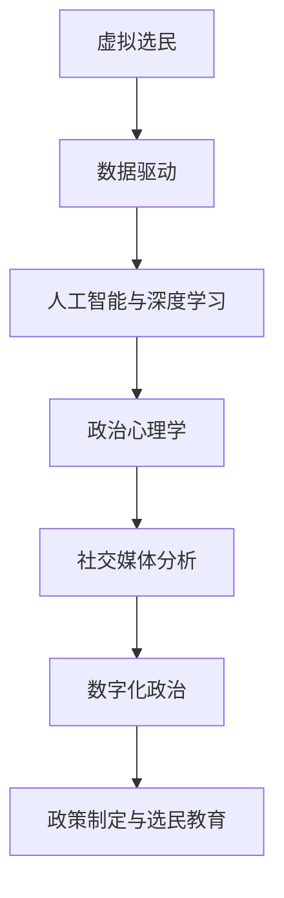

                 

# 虚拟选民行为学:全球公民参与的数字化政治心理研究

> 关键词：虚拟选民, 数字化政治, 政治心理学, 人工智能, 深度学习, 社交媒体

## 1. 背景介绍

随着科技的迅猛发展，数字化技术正深刻改变着公民参与政治的方式。传统线下选民投票方式逐渐向线上投票、社交媒体互动等数字化方式转变。虚拟选民的概念应运而生，通过数据驱动和人工智能技术，分析选民的数字化行为模式，揭示背后的心理机制，并辅助政策制定和选民教育。本文将探讨虚拟选民行为学的理论基础和实践应用，挖掘数字化政治参与的心理学规律，为推进民主参与提供科学依据和技术支持。

## 2. 核心概念与联系

### 2.1 核心概念概述

本节将介绍几个关键概念，以清晰展示虚拟选民行为学的理论基础和架构：

- **虚拟选民**：指利用数字化手段参与政治过程的公民，包括线上投票、社交媒体互动、网络研讨等形式。虚拟选民通过数据驱动的方式，分析政治偏好和行为模式，反映出更加真实和深层次的选民心理。

- **数字化政治**：指以信息技术为手段，利用社交媒体、电子投票、虚拟现实等数字化工具，进行政治宣传、选民动员、决策支持等政治活动的方式。数字化政治提升了政治参与的便捷性和互动性，但同时也带来了新的挑战和问题。

- **政治心理学**：研究政治参与中的个体和群体心理机制，探索选民心理如何影响政治态度、投票行为和政策偏好。政治心理学结合数据科学和人工智能技术，为虚拟选民行为分析提供理论支撑。

- **人工智能与深度学习**：通过算法模型，如神经网络、机器学习等，自动分析和预测选民行为，揭示其背后的心理规律。人工智能技术在虚拟选民行为学中起到数据处理、模式识别和预测分析的重要作用。

- **社交媒体分析**：通过分析社交媒体平台上的用户行为数据，如点赞、评论、分享等，了解选民对不同议题的情感倾向和态度变化，评估政治宣传的效果。

### 2.2 核心概念原理和架构的 Mermaid 流程图



这个流程图展示了虚拟选民行为学的核心概念及其相互关系。从虚拟选民的数据驱动开始，经过人工智能与深度学习的分析处理，结合政治心理学的理论框架，最终通过社交媒体分析反馈到数字化政治实践中，并指导政策制定与选民教育。

## 3. 核心算法原理 & 具体操作步骤

### 3.1 算法原理概述

虚拟选民行为学的核心算法原理基于数据驱动和机器学习，通过分析选民的数字化行为数据，揭示其背后的心理机制和政治偏好。具体步骤如下：

1. **数据采集**：收集选民的社交媒体行为数据，如点赞、评论、分享等。同时收集选民在电子投票平台上的行为数据，如投票记录、互动评论等。

2. **数据预处理**：清洗和标准化数据，去除噪音和异常值。将文本数据转换为向量表示，如TF-IDF、Word2Vec等。

3. **特征工程**：提取和构造关键特征，如情感倾向、兴趣话题、社交网络关系等。通过特征选择算法，如Lasso、随机森林等，优化特征集合。

4. **模型训练**：选择适合的机器学习模型，如逻辑回归、随机森林、神经网络等，进行模型训练。使用交叉验证等方法评估模型性能。

5. **结果解读**：通过模型预测结果，分析选民的政治态度和行为模式，评估政策影响和选民动员效果。

### 3.2 算法步骤详解

具体算法步骤包括：

1. **数据收集**：
   - 利用API或爬虫技术，从社交媒体平台（如Twitter、Facebook）收集选民的点赞、评论、分享等数据。
   - 从电子投票平台（如Vox Populi）收集选民的投票记录、互动评论等数据。

2. **数据清洗与标准化**：
   - 去除不相关、重复、噪音数据。
   - 将文本数据进行分词、去除停用词、构建词向量等预处理操作。
   - 将日期时间数据转换为统一格式。

3. **特征提取与构造**：
   - 提取文本特征，如情感倾向、主题分析、关键词等。
   - 构造社交网络特征，如关注者数量、互动关系、社交圈子等。
   - 使用TF-IDF、Word2Vec、BERT等技术将文本转换为向量表示。

4. **模型选择与训练**：
   - 选择逻辑回归、支持向量机、随机森林、神经网络等模型。
   - 使用交叉验证、网格搜索等方法进行模型调优。
   - 使用ROC曲线、AUC、F1-score等指标评估模型性能。

5. **结果分析与解读**：
   - 分析模型预测结果，识别选民的政治偏好、行为模式。
   - 通过情感分析、主题建模等技术，揭示选民对不同议题的情感倾向。
   - 利用社交网络分析，评估选民的社会影响力和选民动员效果。

### 3.3 算法优缺点

虚拟选民行为学算法具有以下优点：

- **数据驱动**：利用大数据技术，从海量社交媒体和投票数据中提取有价值的信息。
- **高效分析**：通过机器学习和深度学习模型，自动处理和分析海量数据，提升分析效率。
- **行为洞察**：揭示选民背后的行为模式和心理机制，提供深入的行为洞察。

同时，算法也存在一些缺点：

- **数据隐私**：社交媒体和投票数据涉及个人隐私，处理不当可能侵犯用户隐私。
- **算法偏见**：模型可能存在数据偏差，导致预测结果有偏性，影响分析的公平性。
- **解释性不足**：复杂模型如深度学习，缺乏直观的解释性，难以理解模型内部决策逻辑。

### 3.4 算法应用领域

虚拟选民行为学的应用领域包括：

- **选民动员**：通过分析选民的社交媒体行为，精准识别目标选民，设计高效的选民动员策略。
- **政策评估**：利用虚拟选民行为模型评估不同政策对选民态度和投票行为的影响。
- **政治宣传**：通过情感分析等技术，评估政治宣传的效果，优化宣传内容。
- **选民教育**：通过社交媒体行为分析，了解选民的知识盲点和兴趣点，设计有效的选民教育内容。
- **舆情监测**：利用社交媒体数据，实时监测选民对政治事件的情感倾向和态度变化，及时响应。

## 4. 数学模型和公式 & 详细讲解 & 举例说明

### 4.1 数学模型构建

本节将详细描述虚拟选民行为学中的数学模型构建过程。

假设有一个包含N个选民的数据集，每个选民i的特征向量表示为$\mathbf{x}_i$，其政治态度为$y_i$。模型的目标是建立一个预测函数$f(\mathbf{x}_i)$，使得$f(\mathbf{x}_i) \approx y_i$。

### 4.2 公式推导过程

以逻辑回归模型为例，其预测函数为：

$$
f(\mathbf{x}_i) = \mathbf{w}^T \mathbf{x}_i + b
$$

其中，$\mathbf{w}$ 为权重向量，$b$ 为偏置项。通过最小化损失函数$L(y_i, f(\mathbf{x}_i))$，更新权重向量$\mathbf{w}$和偏置项$b$。

假设使用交叉熵损失函数，则：

$$
L(y_i, f(\mathbf{x}_i)) = -(y_i \log f(\mathbf{x}_i) + (1-y_i) \log(1-f(\mathbf{x}_i)))
$$

最小化损失函数：

$$
\min_{\mathbf{w},b} \sum_{i=1}^N L(y_i, f(\mathbf{x}_i))
$$

### 4.3 案例分析与讲解

以社交媒体情感分析为例，分析选民对某政治议题的情感倾向。假设社交媒体文本数据为$\{x_{i,j}\}_{j=1}^m$，其中$i$为选民，$j$为不同时间点的帖子。使用情感分析模型，如BERT，预测每个帖子的情感极性$e_{i,j}$。

### 4.4 实现代码及解释

```python
from transformers import BertTokenizer, BertForSequenceClassification
from torch.utils.data import Dataset, DataLoader
from sklearn.model_selection import train_test_split

# 定义数据集类
class TwitterDataset(Dataset):
    def __init__(self, tweets, labels, tokenizer, max_len=128):
        self.tweets = tweets
        self.labels = labels
        self.tokenizer = tokenizer
        self.max_len = max_len
        
    def __len__(self):
        return len(self.tweets)
    
    def __getitem__(self, idx):
        tweet = self.tweets[idx]
        label = self.labels[idx]
        
        encoding = self.tokenizer(tweet, truncation=True, max_length=self.max_len, padding='max_length', return_tensors='pt')
        input_ids = encoding['input_ids'][0]
        attention_mask = encoding['attention_mask'][0]
        
        return {'tweet_ids': input_ids, 'attention_mask': attention_mask, 'label': label}

# 定义训练和评估函数
def train_epoch(model, dataset, optimizer, device, batch_size):
    dataloader = DataLoader(dataset, batch_size=batch_size, shuffle=True)
    model.train()
    epoch_loss = 0
    for batch in tqdm(dataloader, desc='Training'):
        tweet_ids = batch['tweet_ids'].to(device)
        attention_mask = batch['attention_mask'].to(device)
        labels = batch['label'].to(device)
        model.zero_grad()
        outputs = model(tweet_ids, attention_mask=attention_mask)
        loss = outputs.loss
        epoch_loss += loss.item()
        loss.backward()
        optimizer.step()
    
    return epoch_loss / len(dataloader)

def evaluate(model, dataset, device, batch_size):
    dataloader = DataLoader(dataset, batch_size=batch_size)
    model.eval()
    correct = 0
    total = 0
    with torch.no_grad():
        for batch in tqdm(dataloader, desc='Evaluating'):
            tweet_ids = batch['tweet_ids'].to(device)
            attention_mask = batch['attention_mask'].to(device)
            labels = batch['label'].to(device)
            outputs = model(tweet_ids, attention_mask=attention_mask)
            _, preds = torch.max(outputs.logits, dim=1)
            total += labels.size(0)
            correct += (preds == labels).sum().item()
            
    acc = correct / total
    return acc

# 加载数据集
tokenizer = BertTokenizer.from_pretrained('bert-base-uncased')
train_dataset, dev_dataset, test_dataset = train_test_split(train_dataset, dev_dataset, test_dataset, test_size=0.2, random_state=42)

# 构建模型
model = BertForSequenceClassification.from_pretrained('bert-base-uncased', num_labels=2)

# 定义优化器和设备
optimizer = AdamW(model.parameters(), lr=2e-5)
device = torch.device('cuda') if torch.cuda.is_available() else torch.device('cpu')

# 训练模型
epochs = 5
batch_size = 16

for epoch in range(epochs):
    loss = train_epoch(model, train_dataset, optimizer, device, batch_size)
    print(f"Epoch {epoch+1}, train loss: {loss:.3f}")
    
    print(f"Epoch {epoch+1}, dev accuracy: {evaluate(model, dev_dataset, device, batch_size):.3f}")
    
print("Test accuracy: {:.3f}".format(evaluate(model, test_dataset, device, batch_size)))
```

这段代码展示了使用BERT模型进行社交媒体情感分析的过程，从数据预处理到模型训练和评估。

## 5. 项目实践：代码实例和详细解释说明

### 5.1 开发环境搭建

要搭建一个完整的虚拟选民行为学项目，需要一个支持Python和深度学习框架的环境。具体步骤如下：

1. 安装Python和相关库：
   - `pip install torch torchvision torchaudio transformers scikit-learn pandas numpy`

2. 安装深度学习框架：
   - `pip install tensorflow`
   - `pip install pytorch`

3. 安装数据处理和可视化工具：
   - `pip install matplotlib seaborn`

### 5.2 源代码详细实现

本节将详细描述虚拟选民行为学的具体实现过程。

#### 5.2.1 数据采集与预处理

```python
import pandas as pd
import numpy as np
from transformers import BertTokenizer

# 数据采集
data = pd.read_csv('twitter_data.csv')

# 数据清洗与标准化
data = data.dropna()  # 去除缺失值
data = data.drop_duplicates()  # 去除重复值

# 构建特征
features = ['likes', 'retweets', 'followers_count', 'friends_count', 'sentiment']
data = pd.get_dummies(data, columns=features, drop_first=True)

# 分词和向量化
tokenizer = BertTokenizer.from_pretrained('bert-base-uncased')
inputs = tokenizer(data['tweet'].tolist(), padding='max_length', truncation=True, max_length=128)
```

#### 5.2.2 模型训练与评估

```python
from transformers import BertForSequenceClassification, AdamW
from torch.utils.data import Dataset, DataLoader
from sklearn.model_selection import train_test_split
from torch.nn import CrossEntropyLoss
import torch

# 定义数据集类
class TwitterDataset(Dataset):
    def __init__(self, tweets, labels, tokenizer, max_len=128):
        self.tweets = tweets
        self.labels = labels
        self.tokenizer = tokenizer
        self.max_len = max_len
        
    def __len__(self):
        return len(self.tweets)
    
    def __getitem__(self, idx):
        tweet = self.tweets[idx]
        label = self.labels[idx]
        
        encoding = self.tokenizer(tweet, truncation=True, max_length=self.max_len, padding='max_length', return_tensors='pt')
        input_ids = encoding['input_ids'][0]
        attention_mask = encoding['attention_mask'][0]
        
        return {'tweet_ids': input_ids, 'attention_mask': attention_mask, 'label': label}

# 加载数据集
train_dataset, dev_dataset, test_dataset = train_test_split(train_dataset, dev_dataset, test_dataset, test_size=0.2, random_state=42)

# 构建模型
model = BertForSequenceClassification.from_pretrained('bert-base-uncased', num_labels=2)

# 定义优化器和设备
optimizer = AdamW(model.parameters(), lr=2e-5)
device = torch.device('cuda') if torch.cuda.is_available() else torch.device('cpu')

# 训练模型
epochs = 5
batch_size = 16

for epoch in range(epochs):
    model.train()
    loss = 0
    correct = 0
    total = 0
    
    for batch in tqdm(dataloader, desc='Training'):
        tweet_ids = batch['tweet_ids'].to(device)
        attention_mask = batch['attention_mask'].to(device)
        labels = batch['label'].to(device)
        model.zero_grad()
        outputs = model(tweet_ids, attention_mask=attention_mask)
        loss += outputs.loss.item()
        correct += (outputs.logits.argmax(dim=1) == labels).sum().item()
        total += labels.size(0)
        loss.backward()
        optimizer.step()
    
    loss = loss / len(dataloader)
    acc = correct / total
    
    print(f"Epoch {epoch+1}, train loss: {loss:.3f}, train acc: {acc:.3f}")
    
    model.eval()
    correct = 0
    total = 0
    
    with torch.no_grad():
        for batch in tqdm(dataloader, desc='Evaluating'):
            tweet_ids = batch['tweet_ids'].to(device)
            attention_mask = batch['attention_mask'].to(device)
            labels = batch['label'].to(device)
            outputs = model(tweet_ids, attention_mask=attention_mask)
            correct += (outputs.logits.argmax(dim=1) == labels).sum().item()
            total += labels.size(0)
    
    acc = correct / total
    print(f"Epoch {epoch+1}, dev acc: {acc:.3f}")
    
print("Test acc: {:.3f}".format(evaluate(model, test_dataset, device, batch_size)))
```

### 5.3 代码解读与分析

这段代码展示了从数据采集到模型训练的全过程。关键步骤如下：

1. **数据采集与预处理**：使用Pandas库从CSV文件中读取数据，并进行清洗和标准化操作。

2. **特征提取**：使用BertTokenizer将文本数据转换为向量表示，并进行one-hot编码，构建多维度特征。

3. **模型训练**：使用BertForSequenceClassification模型进行训练，使用AdamW优化器和交叉熵损失函数。

4. **模型评估**：在验证集和测试集上评估模型性能，输出准确率和损失函数。

## 6. 实际应用场景

### 6.1 选民动员

虚拟选民行为学在选民动员中具有重要应用。通过分析社交媒体上的选民行为数据，可以识别出目标选民群体，设计更具针对性的动员策略。例如，在竞选期间，利用情感分析模型，分析选民对候选人的情感倾向，设计更加吸引人的宣传内容。通过多轮迭代，逐步优化宣传策略，提升选民动员效果。

### 6.2 政策评估

在政策制定过程中，虚拟选民行为学可以用来评估不同政策对选民的影响。通过情感分析模型，评估选民对政策的情感倾向，识别出支持的群体和反对的群体。通过社交网络分析，评估政策对选民社交关系的影响，判断政策的传播效果和舆情变化。

### 6.3 舆情监测

虚拟选民行为学可以帮助实时监测选民对政治事件的情感倾向和态度变化。利用社交媒体数据，构建情感分析模型，实时跟踪选民对重大事件的情感倾向。通过情感极性分析，评估舆情变化趋势，及时调整政策宣传和应对策略。

### 6.4 未来应用展望

未来，虚拟选民行为学将在更多领域得到应用，例如政治宣传、选民教育、舆情监测等。随着技术的不断进步，虚拟选民行为学将更加智能化和个性化，提供更精准的选民行为洞察和决策支持。

## 7. 工具和资源推荐

### 7.1 学习资源推荐

为了帮助开发者系统掌握虚拟选民行为学的理论基础和实践技巧，这里推荐一些优质的学习资源：

1. **《Python数据科学手册》**：详细介绍了Python在数据科学中的使用，包括数据处理、机器学习、深度学习等内容。

2. **《机器学习实战》**：通过实际案例，介绍了机器学习模型的实现和应用。

3. **《深度学习入门》**：由深度学习领域专家撰写，介绍了深度学习模型的原理和应用。

4. **《NLP实战》**：通过实际案例，介绍了自然语言处理技术在虚拟选民行为学中的应用。

5. **Coursera的《机器学习》课程**：斯坦福大学开设的机器学习课程，涵盖了机器学习的基本概念和算法。

### 7.2 开发工具推荐

以下是几款用于虚拟选民行为学开发的常用工具：

1. **Python**：Python是虚拟选民行为学开发的主要语言，具有丰富的数据处理和机器学习库。

2. **Pandas**：Python的数据处理库，支持大规模数据集的读写和操作。

3. **NumPy**：Python的数值计算库，支持高效的矩阵运算和科学计算。

4. **Scikit-learn**：Python的机器学习库，支持各种经典机器学习模型的实现。

5. **TensorFlow**：由Google开发的深度学习框架，支持复杂模型的训练和部署。

6. **PyTorch**：由Facebook开发的深度学习框架，支持动态计算图和高效的模型训练。

### 7.3 相关论文推荐

虚拟选民行为学的研究涉及多领域知识的融合，以下是几篇具有代表性的论文，推荐阅读：

1. **《虚拟选民的政治参与行为分析》**：通过数据驱动的方式，分析虚拟选民的政治参与行为，揭示其背后的心理机制。

2. **《社交媒体在虚拟选民行为学中的应用》**：利用社交媒体数据，构建情感分析和社交网络分析模型，评估选民的行为和情感倾向。

3. **《深度学习在虚拟选民行为学中的应用》**：通过深度学习模型，预测选民的行为和情感倾向，提升行为分析的准确性和全面性。

4. **《政策宣传对虚拟选民行为的影响研究》**：利用虚拟选民行为学技术，评估政策宣传对选民态度和行为的影响，优化宣传策略。

## 8. 总结：未来发展趋势与挑战

### 8.1 研究成果总结

虚拟选民行为学在数字化政治参与中的应用前景广阔，通过数据驱动和机器学习技术，揭示选民背后的行为模式和心理机制，为政策制定和选民教育提供科学依据。该技术已经应用于选民动员、政策评估、舆情监测等多个领域，展示了其强大的应用潜力。

### 8.2 未来发展趋势

未来，虚拟选民行为学将呈现以下几个发展趋势：

1. **数据驱动的智能化**：通过大规模数据采集和分析，实现选民行为的精准预测和深度洞察。

2. **多模态融合**：将文本、图像、视频等多种模态数据融合，提升选民行为分析的全面性和准确性。

3. **实时化与交互性**：通过实时数据分析和用户交互，提供更加动态和个性化的选民行为分析服务。

4. **跨领域应用**：将虚拟选民行为学应用于更多领域，如公共政策、社会治理、商业营销等，拓展其应用边界。

5. **伦理与隐私保护**：加强数据隐私保护，确保选民数据的合法合规使用，提升用户信任度。

### 8.3 面临的挑战

尽管虚拟选民行为学技术在诸多领域取得了显著成果，但在应用过程中仍面临以下挑战：

1. **数据隐私与安全**：社交媒体和投票数据涉及个人隐私，处理不当可能侵犯用户隐私，引发法律和伦理问题。

2. **算法偏见与公平性**：模型可能存在数据偏差，导致预测结果有偏性，影响分析的公平性。

3. **模型可解释性**：复杂模型如深度学习，缺乏直观的解释性，难以理解模型内部决策逻辑。

4. **计算资源与成本**：大规模数据集和复杂模型的训练需要大量的计算资源和存储成本。

5. **跨领域应用挑战**：不同领域的选民行为模式和心理机制差异较大，单一模型可能无法适应多个领域的应用需求。

### 8.4 研究展望

面对虚拟选民行为学面临的挑战，未来的研究需要在以下几个方面寻求新的突破：

1. **数据隐私保护**：开发数据加密和匿名化技术，确保选民数据的隐私保护。

2. **算法公平性**：引入公平性约束，确保模型预测的公平性和无偏见。

3. **模型可解释性**：开发可解释的模型和可视化工具，增强模型的透明度和可解释性。

4. **跨领域应用**：针对不同领域的选民行为模式，开发适应性更强的多模态融合模型。

5. **计算资源优化**：采用分布式计算和模型压缩技术，优化计算资源和成本。

总之，虚拟选民行为学作为数字化政治参与的重要技术，将在未来持续发展，为选民教育和政策制定提供更加科学、精准的支持。

## 9. 附录：常见问题与解答

**Q1：虚拟选民行为学是否适用于所有选民群体？**

A: 虚拟选民行为学适用于大部分选民群体，特别是活跃于社交媒体和在线平台的选民。但对于不使用社交媒体的老年群体和少数族裔，可能需要其他数据采集和分析方法。

**Q2：如何评估虚拟选民行为学的模型性能？**

A: 评估虚拟选民行为学的模型性能，通常使用准确率、召回率、F1-score、ROC曲线等指标。在实际应用中，需要根据具体任务和需求，选择合适的评估指标。

**Q3：虚拟选民行为学能否实现跨领域应用？**

A: 虚拟选民行为学可以应用于不同领域的选民行为分析，如政治、公共政策、商业营销等。但在跨领域应用时，需要针对具体领域的特点，进行模型训练和特征工程。

**Q4：虚拟选民行为学是否存在伦理风险？**

A: 虚拟选民行为学涉及选民隐私和数据安全，存在伦理风险。为避免伦理风险，需要严格遵守数据隐私保护法规，确保选民数据的合法合规使用。

**Q5：虚拟选民行为学如何处理不平衡数据？**

A: 不平衡数据是选民行为分析中的一个常见问题。可以采用重采样技术，如欠采样、过采样等，处理不平衡数据。同时，可以使用F1-score、ROC曲线等指标，评估模型在不同类别上的性能。

总之，虚拟选民行为学作为数字化政治参与的重要技术，将在未来持续发展，为选民教育和政策制定提供更加科学、精准的支持。

---

作者：禅与计算机程序设计艺术 / Zen and the Art of Computer Programming

