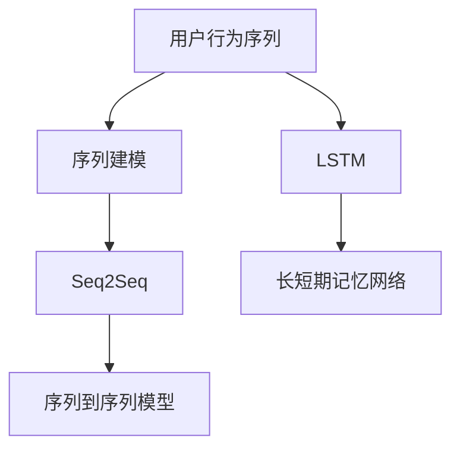

                 

# 融合AI大模型的用户行为序列分析

> 关键词：用户行为序列分析, AI大模型, 序列建模, 深度学习, 长短期记忆网络(LSTM), 时间序列预测, 个性化推荐, 电商行为分析

## 1. 背景介绍

### 1.1 问题由来

随着互联网和移动互联网的快速发展，用户行为数据日益丰富，如何高效地分析和利用这些数据，成为了企业和学术界共同关注的热点问题。用户行为序列分析（User Behavior Sequence Analysis）就是其中的一个重要研究方向。通过分析用户的行为序列，可以洞察用户行为模式，预测未来行为，从而实现个性化推荐、电商行为分析等应用，极大地提升了企业的运营效率和用户体验。

然而，用户行为序列数据通常具有高维、稀疏、非线性的特点，传统统计方法难以应对，而基于机器学习的方法则可以有效地处理这些问题。近年来，深度学习技术在用户行为序列分析领域得到了广泛应用，尤其是序列建模方法，在电商推荐、社交网络分析等场景中表现优异。

### 1.2 问题核心关键点

用户行为序列分析的核心目标是通过学习用户的过去行为，预测其未来的行为，从而实现个性化推荐、用户画像构建等应用。主要面临的问题包括：

- 高维稀疏数据的处理。用户行为数据往往包含大量稀疏特征，如何高效地表示和建模这些数据是一个挑战。
- 序列建模的复杂性。用户行为序列数据通常具有复杂的非线性关系，如何设计合适的模型进行序列建模是一个难点。
- 实时性和计算效率。大规模用户行为数据通常需要实时处理和分析，如何提高模型的计算效率和实时响应能力是另一个关键问题。
- 模型的可解释性和稳定性。用户行为分析常常需要解释模型行为，如何设计可解释性强的模型并保证其稳定性是必须解决的问题。

### 1.3 问题研究意义

用户行为序列分析对于企业用户运营和产品推荐具有重要意义，具体体现在以下几个方面：

- 提升用户个性化推荐。通过分析用户行为序列，可以挖掘用户偏好和行为模式，为用户提供精准的个性化推荐，提高用户满意度和留存率。
- 优化电商运营策略。电商企业可以通过用户行为序列分析，了解用户购买行为规律，优化库存管理、商品定价、促销策略等，提升销售额和利润率。
- 提升社交网络分析能力。社交网络平台可以通过用户行为序列分析，构建用户画像，优化推荐系统，提高用户粘性和活跃度。
- 推动科学研究发展。用户行为序列分析不仅可以应用于商业领域，还能推动心理学、社会学等学科的研究，为学术研究提供新的数据和视角。

## 2. 核心概念与联系

### 2.1 核心概念概述

为了更好地理解用户行为序列分析的核心方法，我们首先需要介绍几个关键概念：

- **用户行为序列**：用户在一定时间段内的一系列行为记录，例如网页浏览、购买记录、社交媒体互动等。
- **序列建模**：通过序列建模方法，将用户行为序列转化为模型可处理的数据形式，并预测用户未来的行为。
- **长短期记忆网络（LSTM）**：一种特殊的循环神经网络，具有处理序列数据的能力，适用于用户行为序列分析。
- **序列到序列模型（Seq2Seq）**：一种端到端的序列建模方法，可以将序列数据映射到另一个序列，如用户行为预测、文本翻译等。
- **深度学习**：一种基于神经网络的机器学习方法，通过多层次的非线性变换，学习数据的复杂表示。

这些核心概念之间的逻辑关系可以通过以下Mermaid流程图来展示：



这个流程图展示了从用户行为序列到序列建模的过程，以及常用的两种序列建模方法：LSTM和Seq2Seq。

## 3. 核心算法原理 & 具体操作步骤

### 3.1 算法原理概述

用户行为序列分析的算法原理主要基于深度学习中的序列建模方法。以LSTM为例，其核心思想是将用户行为序列转化为序列形式，通过多层LSTM网络进行建模，并利用后向传播算法更新模型参数，最小化预测误差。

具体来说，LSTM模型通过门控机制（如输入门、遗忘门、输出门），可以控制信息的流向和存储，从而适应不同长度的序列数据。在预测阶段，LSTM模型会根据当前的行为状态和历史行为信息，预测未来的行为。

### 3.2 算法步骤详解

用户行为序列分析的LSTM建模过程主要包括以下几个步骤：

**Step 1: 数据预处理**

- 收集用户行为序列数据，包括用户的各项行为记录，如点击、购买、浏览等。
- 对数据进行清洗和归一化处理，去除噪声和异常值。
- 将用户行为序列转化为序列形式，并进行数据增强和序列补全，以增加数据多样性。

**Step 2: 构建LSTM模型**

- 设计LSTM模型的网络结构，包括输入层、隐藏层和输出层。
- 选择合适的损失函数和优化器，如交叉熵损失、Adam优化器等。
- 定义模型的超参数，如学习率、批大小、隐藏层大小等。

**Step 3: 训练模型**

- 使用训练集数据进行模型训练，通过前向传播和反向传播更新模型参数。
- 使用验证集数据对模型进行调参和评估，防止过拟合。
- 保存最优模型参数，用于预测和推理。

**Step 4: 预测与推理**

- 将测试集数据输入到训练好的LSTM模型中，进行预测。
- 使用预测结果进行用户行为分析，如个性化推荐、用户画像构建等。

### 3.3 算法优缺点

LSTM模型在用户行为序列分析中具有以下优点：

- 能够处理长序列数据。LSTM模型可以适应不同长度的序列数据，并捕捉长时依赖关系。
- 具有门控机制。LSTM模型通过门控机制控制信息的流向和存储，可以避免梯度消失和梯度爆炸问题。
- 适用于多种任务。LSTM模型不仅适用于序列预测，还可以应用于文本生成、语音识别等任务。

但LSTM模型也存在一些缺点：

- 计算复杂度高。LSTM模型参数较多，训练和推理速度较慢。
- 容易过拟合。LSTM模型在面对高维稀疏数据时，容易出现过拟合问题。
- 可解释性差。LSTM模型的内部机制较为复杂，难以解释其预测过程。

### 3.4 算法应用领域

用户行为序列分析的LSTM模型在多个领域都有广泛的应用：

- 个性化推荐系统：通过分析用户行为序列，预测用户未来的购买行为，实现个性化推荐。
- 电商行为分析：分析用户的浏览、点击、购买等行为，优化电商运营策略。
- 社交网络分析：通过分析用户社交行为序列，构建用户画像，优化社交推荐系统。
- 金融风险管理：分析用户的交易行为序列，预测用户信用风险，优化贷款审批流程。
- 医疗健康分析：分析用户的健康行为序列，预测用户的健康状态，提供个性化健康建议。

## 4. 数学模型和公式 & 详细讲解 & 举例说明

### 4.1 数学模型构建

LSTM模型的数学模型主要包括以下几个部分：

- **输入层**：将用户行为序列转化为向量形式，表示为 $x_t = (x_{t-1}, x_{t-2}, \dots, x_1)$，其中 $x_t$ 表示第 $t$ 个时间步的行为向量。
- **LSTM层**：通过多层LSTM网络对输入序列进行建模，输出序列 $\hat{y} = (\hat{y}_1, \hat{y}_2, \dots, \hat{y}_T)$，其中 $\hat{y}_t$ 表示在第 $t$ 个时间步的预测结果。
- **损失函数**：常用的损失函数包括均方误差（MSE）、交叉熵（Cross-Entropy）等，用于衡量预测结果与真实结果之间的差异。
- **优化器**：常用的优化器包括随机梯度下降（SGD）、Adam等，用于最小化损失函数。

### 4.2 公式推导过程

以交叉熵损失函数为例，LSTM模型的数学公式推导如下：

$$
L(y, \hat{y}) = -\frac{1}{T} \sum_{t=1}^T y_t \log \hat{y}_t
$$

其中 $y_t$ 为真实标签，$\hat{y}_t$ 为预测结果，$T$ 为时间步长。

在训练过程中，使用反向传播算法更新模型参数，通过链式法则计算梯度：

$$
\frac{\partial L(y, \hat{y})}{\partial \theta} = -\frac{1}{T} \sum_{t=1}^T \left(\frac{\partial L(y, \hat{y})}{\partial y_t} \frac{\partial y_t}{\partial \hat{y}_t} \frac{\partial \hat{y}_t}{\partial \theta}\right)
$$

其中 $\frac{\partial L(y, \hat{y})}{\partial y_t} = y_t - \hat{y}_t$，表示真实标签与预测结果之间的差异。

### 4.3 案例分析与讲解

以电商行为预测为例，具体分析LSTM模型在电商行为分析中的应用：

- **数据预处理**：收集电商用户的购买行为序列，并进行清洗和归一化处理。
- **模型构建**：设计LSTM模型，包含输入层、LSTM层和输出层，定义交叉熵损失和Adam优化器。
- **训练模型**：使用历史购买行为序列数据进行模型训练，通过验证集数据进行调参。
- **预测与推理**：使用训练好的LSTM模型，对新用户的购买行为序列进行预测，生成个性化推荐。

## 5. 项目实践：代码实例和详细解释说明

### 5.1 开发环境搭建

在进行用户行为序列分析的LSTM模型开发前，我们需要准备好开发环境。以下是使用Python进行TensorFlow开发的环境配置流程：

1. 安装Anaconda：从官网下载并安装Anaconda，用于创建独立的Python环境。

2. 创建并激活虚拟环境：
```bash
conda create -n tf-env python=3.8 
conda activate tf-env
```

3. 安装TensorFlow：根据CUDA版本，从官网获取对应的安装命令。例如：
```bash
pip install tensorflow tensorflow-addons -f https://storage.googleapis.com/tensorflow/additional_tf_models/index.html
```

4. 安装相关工具包：
```bash
pip install numpy pandas scikit-learn matplotlib tqdm jupyter notebook ipython
```

完成上述步骤后，即可在`tf-env`环境中开始LSTM模型的开发。

### 5.2 源代码详细实现

下面我们以电商行为预测为例，给出使用TensorFlow实现LSTM模型的完整代码：

```python
import tensorflow as tf
from tensorflow.keras.layers import Input, LSTM, Dense, Dropout
from tensorflow.keras.models import Model
from tensorflow.keras.optimizers import Adam

# 定义模型输入层
input_layer = Input(shape=(None, 3))

# 添加LSTM层
lstm_layer = LSTM(units=64, dropout=0.2, recurrent_dropout=0.2)(input_layer)

# 添加全连接层
output_layer = Dense(units=1, activation='sigmoid')(lstm_layer)

# 定义模型输出层
output = Dense(units=1, activation='sigmoid')(lstm_layer)

# 构建模型
model = Model(inputs=input_layer, outputs=output)

# 定义损失函数和优化器
loss = 'binary_crossentropy'
optimizer = Adam(learning_rate=0.001)

# 编译模型
model.compile(optimizer=optimizer, loss=loss)

# 训练模型
model.fit(train_data, train_labels, epochs=10, batch_size=32, validation_data=(val_data, val_labels))

# 预测和推理
test_predictions = model.predict(test_data)
```

以上代码展示了从模型构建、编译、训练到预测的完整流程。其中，LSTM层通过设置`units`参数来指定隐藏层大小，`dropout`参数和`recurrent_dropout`参数用于防止过拟合。

### 5.3 代码解读与分析

让我们再详细解读一下关键代码的实现细节：

- **输入层定义**：使用`Input`函数定义输入层，设置输入数据形状为`(None, 3)`，表示序列长度为任意，每条序列包含3个特征。
- **LSTM层定义**：使用`LSTM`函数定义LSTM层，设置隐藏层大小为64，并添加dropout机制以防止过拟合。
- **全连接层定义**：使用`Dense`函数定义输出层，设置输出节点数为1，激活函数为sigmoid，用于二分类任务。
- **模型构建**：通过`Model`函数将输入层和输出层连接起来，形成完整的LSTM模型。
- **优化器和损失函数定义**：使用`Adam`优化器和`binary_crossentropy`损失函数，适用于二分类任务。
- **模型编译和训练**：使用`compile`函数编译模型，并使用`fit`函数进行训练。
- **预测和推理**：使用`predict`函数对测试集数据进行预测，并返回预测结果。

可以看到，TensorFlow提供了强大的API支持，使得LSTM模型的构建和训练变得简洁高效。开发者可以专注于模型设计和调参，而不必过多关注底层实现细节。

## 6. 实际应用场景

### 6.1 智能推荐系统

用户行为序列分析在智能推荐系统中的应用极为广泛。通过分析用户的行为序列，推荐系统可以了解用户的兴趣和偏好，从而提供个性化的推荐内容。

例如，电商推荐系统可以通过分析用户的浏览、点击、购买行为序列，预测用户对某个商品的购买意愿，并生成个性化推荐。通过引入LSTM模型，推荐系统可以捕捉用户的长期行为模式，提升推荐的准确性和效果。

### 6.2 金融风险管理

在金融领域，用户行为序列分析可以用于风险管理和贷款审批。通过分析用户的交易行为序列，金融机构可以预测用户的信用风险，优化贷款审批流程。

例如，银行可以通过分析用户的交易记录和信用评分，构建用户的信用行为序列，使用LSTM模型预测用户的违约概率，并根据预测结果进行贷款审批。通过引入LSTM模型，金融风险管理可以更加精准地评估用户的信用风险，减少贷款坏账率。

### 6.3 社交网络分析

社交网络平台可以通过用户行为序列分析，构建用户画像，优化推荐系统。例如，社交平台可以通过分析用户的社交行为序列，预测用户的兴趣和行为，提供个性化的社交推荐。

### 6.4 医疗健康分析

在医疗健康领域，用户行为序列分析可以用于个性化健康建议和疾病预测。例如，医疗机构可以通过分析患者的健康行为序列，预测患者的健康状态，提供个性化的健康建议。

## 7. 工具和资源推荐

### 7.1 学习资源推荐

为了帮助开发者系统掌握LSTM模型在用户行为序列分析中的应用，这里推荐一些优质的学习资源：

1. **《深度学习》书籍**：Ian Goodfellow所著的经典深度学习教材，涵盖了深度学习的基本概念和LSTM模型的详细讲解。
2. **Coursera《Sequence Models》课程**：斯坦福大学开设的深度学习课程，包含LSTM模型的详细介绍和实践案例。
3. **TensorFlow官方文档**：TensorFlow的官方文档，提供了丰富的API和示例代码，是学习LSTM模型的重要资源。
4. **Kaggle竞赛**：Kaggle平台上的用户行为序列分析竞赛，提供了大量的数据集和预训练模型，可以实践LSTM模型应用。

通过这些资源的学习实践，相信你一定能够快速掌握LSTM模型在用户行为序列分析中的应用。

### 7.2 开发工具推荐

高效的开发离不开优秀的工具支持。以下是几款用于LSTM模型开发和部署的工具：

1. **TensorFlow**：由Google主导开发的深度学习框架，具有强大的API支持和丰富的预训练模型资源。
2. **PyTorch**：由Facebook开发的深度学习框架，易于使用，支持动态图和静态图。
3. **Keras**：一个高层次的深度学习API，提供了简单易用的接口，适合快速原型开发。
4. **TensorBoard**：TensorFlow配套的可视化工具，可以实时监测模型训练状态，提供丰富的图表呈现方式。
5. **Weights & Biases**：模型训练的实验跟踪工具，可以记录和可视化模型训练过程中的各项指标，方便对比和调优。

合理利用这些工具，可以显著提升LSTM模型的开发效率，加快创新迭代的步伐。

### 7.3 相关论文推荐

LSTM模型在用户行为序列分析领域得到了广泛研究。以下是几篇奠基性的相关论文，推荐阅读：

1. **Long Short-Term Memory**：Hochreiter和Schmidhuber所著的LSTM论文，提出了LSTM模型的基本结构和原理。
2. **Sequence to Sequence Learning with Neural Networks**：Cho等人所著的Seq2Seq论文，介绍了LSTM在序列到序列任务中的应用。
3. **Attention Is All You Need**：Vaswani等人所著的Transformer论文，提出了基于注意力机制的Transformer模型，适用于长序列数据建模。
4. **Neural Machine Translation by Jointly Learning to Align and Translate**：Bahdanau等人所著的Seq2Seq论文，介绍了LSTM在机器翻译中的应用。

这些论文代表了大语言模型微调技术的发展脉络。通过学习这些前沿成果，可以帮助研究者把握学科前进方向，激发更多的创新灵感。

## 8. 总结：未来发展趋势与挑战

### 8.1 总结

本文对LSTM模型在用户行为序列分析中的应用进行了全面系统的介绍。首先阐述了用户行为序列分析的研究背景和意义，明确了LSTM模型在序列建模中的重要作用。其次，从原理到实践，详细讲解了LSTM模型的数学原理和关键步骤，给出了LSTM模型在电商行为预测中的完整代码实现。同时，本文还广泛探讨了LSTM模型在智能推荐、金融风险管理、社交网络分析等多个领域的应用前景，展示了LSTM模型的巨大潜力。

通过本文的系统梳理，可以看到，LSTM模型在用户行为序列分析中的应用具有广泛的前景，极大地提升了企业的运营效率和用户体验。未来，伴随LSTM模型的持续演进，相信用户行为序列分析技术将能够更深入地应用于各种垂直行业，推动人工智能技术的发展。

### 8.2 未来发展趋势

展望未来，LSTM模型在用户行为序列分析中呈现以下几个发展趋势：

1. **深度学习与多模态融合**：未来的LSTM模型将与其他深度学习模型（如CNN、Transformer等）进行更加紧密的融合，同时引入多模态信息（如文本、图像、语音等），提升模型的综合建模能力。
2. **时间序列预测与异常检测**：除了用户行为预测，LSTM模型还可以应用于时间序列预测、异常检测等任务，帮助企业及时发现和应对潜在风险。
3. **跨领域迁移学习**：LSTM模型可以跨领域迁移，应用于金融、医疗、教育等多个领域，实现数据的泛化利用。
4. **自动化模型调参**：通过自动化模型调参技术，如贝叶斯优化、超参数搜索等，优化LSTM模型的超参数，提升模型的泛化能力。
5. **联邦学习与边缘计算**：在数据分布不均匀或隐私保护要求高的场景下，LSTM模型可以通过联邦学习与边缘计算技术，实现分布式训练和推理。

以上趋势凸显了LSTM模型在用户行为序列分析中的广阔前景。这些方向的探索发展，必将进一步提升用户行为序列分析技术的性能和应用范围，为人工智能技术的发展注入新的动力。

### 8.3 面临的挑战

尽管LSTM模型在用户行为序列分析中取得了显著成果，但在迈向更加智能化、普适化应用的过程中，仍面临一些挑战：

1. **高维稀疏数据的处理**：用户行为数据通常具有高维、稀疏的特点，如何高效地表示和建模这些数据是一个挑战。
2. **模型的可解释性和稳定性**：LSTM模型的内部机制较为复杂，难以解释其预测过程，同时模型的稳定性也是一个重要问题。
3. **实时性和计算效率**：大规模用户行为数据通常需要实时处理和分析，如何提高模型的计算效率和实时响应能力是另一个关键问题。
4. **数据隐私和安全**：用户行为数据的隐私和安全问题需要得到充分考虑，如何设计安全可靠的算法，保护用户隐私是必须解决的问题。

### 8.4 研究展望

面对LSTM模型在用户行为序列分析中面临的挑战，未来的研究需要在以下几个方面寻求新的突破：

1. **多模态数据的融合**：引入图像、语音等多模态信息，提升LSTM模型的综合建模能力。
2. **可解释性强的模型设计**：设计可解释性强的模型，解释模型的决策过程，提高模型的可信度。
3. **高效实时推理算法**：开发高效的实时推理算法，提升模型的计算效率和实时响应能力。
4. **安全可靠的算法设计**：设计安全可靠的算法，保护用户隐私，提升算法的鲁棒性。

这些研究方向的探索，必将引领LSTM模型在用户行为序列分析中走向更高的台阶，为构建安全、可靠、高效的用户行为分析系统铺平道路。面向未来，LSTM模型在用户行为序列分析中的应用将不断拓展，推动人工智能技术的进步和发展。

## 9. 附录：常见问题与解答

**Q1：LSTM模型在电商行为预测中的应用效果如何？**

A: LSTM模型在电商行为预测中表现优异，可以通过分析用户的浏览、点击、购买行为序列，预测用户的购买意愿，生成个性化推荐。然而，由于电商数据通常具有高维、稀疏的特点，LSTM模型在面对高维稀疏数据时，容易出现过拟合问题，需要通过正则化技术（如dropout）进行控制。

**Q2：LSTM模型在处理长序列数据时，如何防止梯度消失问题？**

A: LSTM模型通过门控机制控制信息的流向和存储，可以有效防止梯度消失问题。然而，在面对特别长的序列数据时，仍可能出现梯度消失问题，可以通过增加隐藏层大小、使用梯度裁剪等技术进行优化。

**Q3：LSTM模型在训练过程中，如何选择合适的时间步长？**

A: 时间步长的选择需要根据具体任务进行调整。对于时间序列预测任务，时间步长通常设置为序列长度的一半。对于序列分类任务，时间步长通常设置为1或2。

**Q4：LSTM模型在预测过程中，如何进行序列补全？**

A: 序列补全可以通过插值、平移、旋转等方式，对缺失的序列数据进行补充。常用的序列补全方法包括：
1. 插值法：使用线性插值或样条插值，对缺失的序列数据进行补充。
2. 平移法：将缺失的数据平移到序列的末尾，重新计算预测结果。
3. 旋转法：将缺失的数据旋转到序列的开头，重新计算预测结果。

**Q5：LSTM模型在预测过程中，如何控制模型的过拟合？**

A: 控制模型的过拟合可以通过以下方法：
1. 数据增强：通过回译、近义替换等方式扩充训练集。
2. 正则化：使用L2正则、Dropout等技术防止过拟合。
3. 早停机制：在验证集上监测模型性能，当性能不再提升时，停止训练。

这些方法可以结合使用，根据具体任务进行灵活调整，以最大限度地提升模型性能。

---

作者：禅与计算机程序设计艺术 / Zen and the Art of Computer Programming

