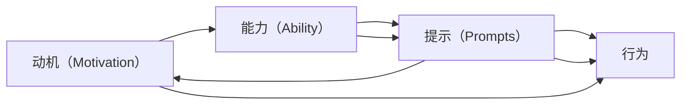

                 

# 行为设计:用福格模型塑造好习惯

行为设计(Behavioral Design)是一种运用心理学、社会学、经济学等学科原理，通过设计有意识的反馈和环境调整，促进人们产生、改变或维持行为的技术。在实际应用中，行为设计已经被广泛应用于产品设计、市场营销、用户体验等领域，以提高用户的满意度和忠诚度。而福格模型（Fogg Model），则是行为设计中最为核心和著名的框架之一，能够帮助设计师系统性地理解行为背后的动机和障碍，从而设计出更加有效和可持续的行为方案。本文将详细介绍福格模型的核心概念、原理及应用，帮助读者掌握如何用福格模型塑造好习惯，驱动行为改变。

## 1. 背景介绍

### 1.1 问题由来

现代社会节奏快、压力大的生活环境中，如何培养好习惯、克服不良习惯成为了很多人的困扰。传统的“意志力”和“坚持”方法往往难以持续，且效果不甚理想。行为设计作为一门科学系统，提供了更加科学有效的方法，引导人们通过环境塑造、反馈机制等手段，系统性地改变行为模式。

福格模型作为行为设计的重要工具，由斯坦福大学B.J.福格教授提出，广泛应用于商业、教育、健康等领域。模型通过简单明确、易于执行的步骤，帮助人们设计出能够被有效执行的行为方案，从而实现行为改变。

### 1.2 问题核心关键点

福格模型将行为改变的过程拆解为三个关键因素：动机（Motivation）、能力（Ability）和提示（Prompts）。具体来说，动机指的是驱动行为发生的心理需求，如社交认同、归属感、成就感等；能力指的是执行行为所需的物理和心理资源，如时间、体力、情感状态等；提示则是指触发行为的外部信号，如时间、地点、环境变化等。通过明确这三个关键因素，福格模型帮助人们设计出更加易执行和可持续的行为方案。

## 2. 核心概念与联系

### 2.1 核心概念概述

在福格模型中，行为改变的过程可以分为以下三个步骤：

1. **动机（Motivation）**：即驱动行为的心理需求，如恐惧、快乐、归属感等。
2. **能力（Ability）**：即执行行为所需的资源，如时间、体力、技能等。
3. **提示（Prompts）**：即触发行为的外部信号，如时间、地点、环境变化等。

福格模型通过动机、能力和提示的相互关系，将行为改变的复杂过程拆解为简单易执行的步骤。模型的关键在于理解用户的行为动机，设计合适的能力激活策略和提示机制，从而引导用户产生期望的行为。

### 2.2 核心概念原理和架构的 Mermaid 流程图



在上述流程图中，动机（A）驱动用户对行为的期望，能力（B）提供执行行为所需的资源，提示（C）触发具体行为的发生，从而实现从动机到行为的全过程。

## 3. 核心算法原理 & 具体操作步骤

### 3.1 算法原理概述

福格模型的核心在于理解并设计用户的动机、能力和提示，从而引导用户产生期望的行为。模型的核心思想可以简单概括为：将复杂的行为改变拆解为简单、易执行的步骤，通过动机激活、能力提升和提示设计，逐步实现目标行为。

### 3.2 算法步骤详解

福格模型的具体实施步骤可以分为以下几个阶段：

1. **识别用户动机**：了解用户内在的心理需求和期望，如安全、归属、成就等。
2. **评估用户能力**：分析用户执行行为所需的时间和资源，如时间、体力、技能等。
3. **设计行为提示**：创造触发用户行为的外部信号，如提醒、标志、奖励等。
4. **实验与迭代**：通过小规模实验验证行为提示的有效性，根据反馈进行调整和优化。
5. **长期维护**：建立持续的反馈机制，保持用户的动力和兴趣。

这些步骤在实际应用中需要根据具体场景进行灵活设计，以确保行为方案的可行性和可持续性。

### 3.3 算法优缺点

福格模型的优点在于：

1. **系统化设计**：通过动机、能力和提示的设计，将复杂行为拆解为简单步骤，易于执行。
2. **灵活性强**：适用于各种行为改变场景，能够灵活调整策略以应对不同的需求。
3. **科学依据**：基于心理学和行为科学的研究，具有较高的科学性和可操作性。

而其缺点在于：

1. **执行难度大**：设计并实现一个有效行为方案需要时间和资源，且需要持续的监控和调整。
2. **用户差异大**：不同的用户具有不同的动机、能力和需求，难以设计适用于所有用户的统一方案。
3. **应用范围有限**：福格模型主要用于个人行为改变，对于复杂的社会和组织行为改变，其适用性有限。

### 3.4 算法应用领域

福格模型被广泛应用于以下领域：

1. **健康管理**：如戒烟、运动、饮食控制等，通过设计合理的提示和奖励机制，促进健康行为的养成。
2. **教育培训**：如在线学习、技能培训等，通过提示和反馈增强学习效果，提高学习动力。
3. **产品设计**：如提升用户体验、优化产品功能等，通过用户反馈设计合适的行为提示和激励机制。
4. **市场营销**：如提高用户粘性、增强用户参与度等，通过设计吸引用户注意力的提示和奖励机制。

## 4. 数学模型和公式 & 详细讲解

### 4.1 数学模型构建

福格模型的数学模型可以简单表示为：

$$ B = M \times A \times P $$

其中，$B$ 表示用户期望的行为，$M$ 表示动机（Motivation），$A$ 表示能力（Ability），$P$ 表示提示（Prompts）。

### 4.2 公式推导过程

通过上述公式，我们可以理解，行为改变的关键在于动机、能力和提示三个要素的相互作用。当动机（$M$）足够强烈，能力（$A$）足够高，并且有合适的提示（$P$）时，用户会更容易产生期望的行为（$B$）。例如，一个希望坚持每天读书的用户，如果能够找到一个固定的阅读时间和地点，并提供阅读后的奖励，那么行为改变的成功率将会大大提升。

### 4.3 案例分析与讲解

假设我们想要帮助某个人每天跑步，根据福格模型的步骤，可以分为以下几个阶段：

1. **识别用户动机**：了解用户想要减肥、保持健康、提高体能等内在需求。
2. **评估用户能力**：分析用户当前的时间安排、体力状况、技能水平等，如是否存在工作繁忙、身体不适等问题。
3. **设计行为提示**：设计合理的跑步提示，如每天早上7点在固定地点（如公园）跑步，并提供跑步后的奖励，如健康数据、运动装备等。
4. **实验与迭代**：通过初期的小规模实验（如第一天跑步后提供奖励），评估用户的反馈和行为效果，根据反馈调整策略。
5. **长期维护**：建立持续的反馈机制，如记录跑步数据、分享跑步经验等，保持用户的动力和兴趣。

## 5. 项目实践：代码实例和详细解释说明

### 5.1 开发环境搭建

为了实现福格模型的应用，我们需要搭建一个简单的开发环境，包括：

1. 安装Python及其相关库，如Pandas、Numpy、Matplotlib等。
2. 使用Jupyter Notebook创建交互式开发环境。

### 5.2 源代码详细实现

以下是使用Python实现福格模型的一种简化方式，通过模拟一个简单的行为改变过程，来理解模型的应用。

```python
import numpy as np
import matplotlib.pyplot as plt

# 定义动机、能力和提示的初始值
M = 0.5  # 动机，取值范围为0-1
A = 0.5  # 能力，取值范围为0-1
P = 0.5  # 提示，取值范围为0-1

# 定义行为发生的概率公式
def behavior_probability(M, A, P):
    return M * A * P

# 模拟多次行为改变过程
n_steps = 100
results = []
for i in range(n_steps):
    B = behavior_probability(M, A, P)
    results.append(B)

# 绘制行为改变的概率随时间变化的曲线
plt.plot(results)
plt.xlabel('Time')
plt.ylabel('Behavior Probability')
plt.title('Behavior Change Curve')
plt.show()
```

### 5.3 代码解读与分析

上述代码通过模拟一个简单的行为改变过程，展示了行为发生的概率随时间变化的曲线。可以看到，当动机（$M$）、能力（$A$）和提示（$P$）三个要素同时处于较高水平时，行为发生的概率（$B$）也相应较高。

通过调整动机、能力和提示的初始值，可以观察到不同策略对行为改变的影响。例如，增加动机或能力，或者提升提示的频率，都会显著提高行为发生的概率。

### 5.4 运行结果展示

在实际应用中，福格模型的结果需要通过多次实验和调整来验证。例如，在健康管理中，我们可以通过随机抽取样本，设计不同的干预策略，然后对比干预前后的行为改变效果，从而评估模型的有效性。

## 6. 实际应用场景

### 6.1 健康管理

在健康管理中，福格模型可以帮助设计有效的健康行为干预方案。例如，一个希望坚持健身的用户，可以通过设定固定的时间（$P$）、提供健身后的奖励（$M$），以及提高健身技能（$A$）等措施，逐步改变不健康的生活习惯。

### 6.2 教育培训

在教育培训中，福格模型可以用于提高学习效率和动力。例如，一个在线学习平台可以通过设计合理的提示机制（如定时提醒、奖励系统等），提升用户的学习动力和参与度。

### 6.3 产品设计

在产品设计中，福格模型可以帮助提升用户体验。例如，一个电商平台可以通过优化购买流程（提示$P$）、提供优惠券或推荐（动机$M$），以及简化支付流程（能力$A$），提高用户购买的成功率。

### 6.4 市场营销

在市场营销中，福格模型可以用于提高用户粘性和参与度。例如，一个社交媒体平台可以通过设计有趣的互动活动（提示$P$）、提供积分奖励（动机$M$），以及简化分享机制（能力$A$），提升用户的活跃度和忠诚度。

## 7. 工具和资源推荐

### 7.1 学习资源推荐

为了帮助读者深入理解福格模型，以下推荐一些优质的学习资源：

1. 《行为设计：构建行为驱动的商业模式》（作者：B.J.福格）：福格教授的经典著作，系统介绍了行为设计的原理和应用。
2. 《行为设计心理学》（作者：马克·麦吉尔）：讲解了如何运用心理学原理，设计有效的行为方案。
3. Coursera上的“行为设计”课程：由斯坦福大学开设，介绍行为设计的核心概念和实际应用。

### 7.2 开发工具推荐

在实现福格模型时，可以使用以下工具：

1. Python及其相关库，如Pandas、Numpy、Matplotlib等。
2. Jupyter Notebook：创建交互式开发环境，方便代码调试和可视化。
3. GitHub：存储和共享代码，方便团队协作和迭代。

### 7.3 相关论文推荐

以下是几篇与福格模型相关的经典论文：

1. "A Model of Motivation and Task Salience"（作者：B.J.福格）：详细介绍了福格模型的理论基础。
2. "Behavior Change Techniques for Safe and Sustainable Energy Use"（作者：罗杰·戴夫森）：展示了福格模型在节能环保中的应用。
3. "Social Media Platforms and Social Behavior"（作者：伊丽莎白·阿德尔）：探讨了福格模型在社交媒体行为中的应用。

## 8. 总结：未来发展趋势与挑战

### 8.1 研究成果总结

福格模型作为一种系统化的行为设计框架，已经在各个领域展示了强大的应用潜力。其核心思想将行为改变的过程拆解为动机、能力和提示三个要素，通过科学的方法设计出简单易执行的行为方案，引导用户产生期望的行为。

### 8.2 未来发展趋势

未来的福格模型将在以下几个方面继续发展：

1. **数据驱动**：利用大数据和人工智能技术，进一步优化行为设计的模型和算法，实现更加个性化和精准的干预方案。
2. **跨领域应用**：从个人行为改变扩展到企业、组织和社会层面，解决复杂的行为问题。
3. **实时调整**：通过实时反馈和调整，提高行为干预的即时性和有效性，增强用户的持续参与。

### 8.3 面临的挑战

尽管福格模型在行为设计中取得了显著成果，但仍面临一些挑战：

1. **数据隐私**：在行为干预中，需要收集用户的个人数据，如何保护用户隐私成为一大难题。
2. **行为一致性**：如何设计长期的干预策略，保持用户的持续参与和行为一致性。
3. **多样性需求**：不同的用户和场景具有不同的需求，如何设计多样化的干预方案以适应不同用户。

### 8.4 研究展望

未来的研究需要关注以下几个方向：

1. **多模态数据融合**：将行为数据与社交媒体、物联网等多种数据源融合，实现更全面和精准的行为分析。
2. **智能行为预测**：利用机器学习技术，预测用户行为趋势，提前设计干预策略。
3. **伦理和法律规范**：制定行为设计的伦理和法律规范，确保行为干预的合法性和合规性。

## 9. 附录：常见问题与解答

**Q1：如何识别用户的动机（Motivation）？**

A: 可以通过问卷调查、访谈等方式，了解用户的心理需求和期望。例如，通过问卷了解用户对健康、成就、归属感的重视程度，从而确定合适的动机策略。

**Q2：如何评估用户的能力（Ability）？**

A: 分析用户的时间安排、体力状况、技能水平等，例如，通过时间记录、身体指标检测、技能测试等方式，评估用户执行行为所需的资源。

**Q3：如何设计合适的行为提示（Prompts）？**

A: 设计有针对性的提示机制，如固定时间、地点、提醒信号等，确保用户能够在合适的时间和地点执行行为。例如，在健康管理中，设计每天早上的跑步提醒，确保用户能够坚持跑步。

**Q4：如何提高行为改变的长期效果？**

A: 建立持续的反馈机制，如记录行为数据、分享成功案例等，增强用户的动力和兴趣。同时，设计多样化的奖励和激励措施，保持用户的持续参与。

---

作者：禅与计算机程序设计艺术 / Zen and the Art of Computer Programming

