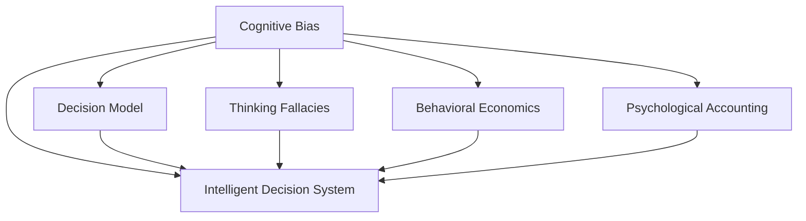

                 

# 认知偏差与决策：如何避免思维陷阱

> 关键词：认知偏差,决策模型,思维陷阱,行为经济学,心理账户

## 1. 背景介绍

### 1.1 问题由来
在复杂多变的信息时代，人类在进行决策时往往面临诸多认知偏差，这些偏差会导致决策失误、情绪化判断，进而影响工作效率和决策质量。认知偏差问题日益引起关注，近年来行为经济学、人工智能与心理学的交叉研究不断涌现。如何借助认知偏差理解人类决策行为，优化决策模型，规避思维陷阱，成为当前跨学科研究的前沿课题。本文聚焦于认知偏差与决策，通过系统阐述认知偏差原理、常见思维陷阱及其应用场景，探讨如何利用AI技术提升决策模型的鲁棒性，从技术层面避免人类思维的偏差，构建更加科学合理的决策系统。

### 1.2 问题核心关键点
认知偏差与决策问题，本质上是心理学与决策科学的交叉领域，涉及人类思维行为的预测和优化。具体而言，核心问题包括：
- 认知偏差的产生机制与类型。
- 人类决策过程中的思维陷阱与表现。
- 认知偏差对决策模型的影响。
- 如何利用AI技术辅助人类决策，规避思维陷阱。

这些关键问题在理论和应用层面均有重要意义，旨在揭示人类认知行为背后的心理机制，提出基于AI辅助的决策优化策略。

### 1.3 问题研究意义
研究认知偏差与决策问题，对于构建科学的决策支持系统、提升组织决策质量、增强个人决策能力具有重要意义：

1. **提升决策质量**：认知偏差分析有助于发现决策过程中的盲点和偏差，提供科学的决策参考，减少决策失误。
2. **优化决策模型**：通过对人类决策行为的研究，优化机器学习模型，提高其对人类认知行为的模拟能力，增强决策模型的稳健性。
3. **促进跨学科发展**：认知偏差与决策的研究，有助于心理学、行为经济学、人工智能等领域的交叉融合，推动认知科学的进步。
4. **构建智能决策系统**：借助AI技术，构建智能决策系统，使其具备超越人类的决策能力和鲁棒性。

## 2. 核心概念与联系

### 2.1 核心概念概述

为更好地理解认知偏差与决策问题，本节将介绍几个密切相关的核心概念：

- **认知偏差(Cognitive Bias)**：指人类思维在处理信息时所表现出来的系统性错误。常见的认知偏差包括确认偏误、锚定效应、易得性偏误等，严重影响决策的客观性和科学性。

- **决策模型(Decision Model)**：指在心理学、经济学、人工智能等领域用于描述和预测人类决策行为的方法和模型。常见的决策模型包括期望效用理论、行为经济学模型等。

- **思维陷阱(Thinking Fallacies)**：指人类在决策过程中常见的错误思维模式，如从众心理、乐观偏差、风险厌恶等，这些思维模式可能导致非理性决策。

- **行为经济学(Behavioral Economics)**：一门研究人类决策行为的心理与经济学交叉学科，揭示了人类决策中的非理性因素及其对经济行为的影响。

- **心理账户(Psychological Accounting)**：指人们将有限的资源分配到不同的“心理账户”中，如日常消费、储蓄、投资等，对消费和投资决策产生影响。

- **智能决策系统(Intelligent Decision System)**：利用人工智能技术，结合认知偏差与决策模型的理论基础，构建的自动化决策系统。

这些概念之间的逻辑关系可以通过以下Mermaid流程图来展示：



这个流程图展示了一些核心概念及其之间的关系：

1. 认知偏差是决策模型的基础，用于描述人类决策的偏差行为。
2. 决策模型结合行为经济学理论，提供对人类决策行为的解释和预测。
3. 思维陷阱描述了人类在决策过程中常见的错误思维模式。
4. 心理账户揭示了人们在资源分配和决策中的心理机制。
5. 智能决策系统综合了认知偏差与决策模型，构建自动化的决策支持系统。

这些概念共同构成了认知偏差与决策问题的研究框架，使得我们从技术层面理解人类决策行为，从而提出优化策略。

## 3. 核心算法原理 & 具体操作步骤

### 3.1 算法原理概述

认知偏差与决策问题的核心算法原理，是建立一套科学、可解释的决策模型，用以分析和规避人类认知偏差，提升决策质量。

决策模型可以形式化为一个二元组：

$$
M = \langle P, F \rangle
$$

其中 $P$ 表示决策问题的信息集，即模型需要考虑的所有已知信息；$F$ 表示决策规则集，即模型根据信息集 $P$ 进行决策的行为准则。

结合认知偏差理论，决策模型进一步细分为两大部分：

1. **认知偏差修正模块**：识别并修正人类决策中的认知偏差，保证决策过程的客观性和科学性。
2. **决策规则优化模块**：通过优化决策规则，提高决策模型的预测和决策能力。

决策模型的总体目标是最小化决策误差，即：

$$
\min_{F} \mathcal{E}(F) = \mathbb{E}[\mathcal{L}(Y, F(X))]
$$

其中 $\mathcal{L}$ 为决策误差损失函数，$\mathcal{E}$ 为决策模型的期望误差，$X$ 为输入变量，$Y$ 为真实决策结果。

### 3.2 算法步骤详解

基于认知偏差与决策的决策模型，通常包括以下关键步骤：

**Step 1: 数据收集与预处理**

- 收集人类决策数据，包括决策情境、决策结果、决策过程等。
- 对数据进行预处理，去除噪声、填补缺失值等，保证数据质量。

**Step 2: 偏差识别与建模**

- 利用统计学和机器学习方法，识别决策中的认知偏差类型。
- 构建认知偏差模型，描述偏差产生的机制和规律。

**Step 3: 规则优化与融合**

- 设计决策规则，用基于博弈论、逻辑推理等方法，构建决策树、规则引擎等形式化决策模型。
- 将认知偏差模型与决策规则进行融合，生成决策模型。

**Step 4: 模型验证与迭代**

- 在真实决策场景中进行模型验证，评估模型预测准确性和鲁棒性。
- 根据验证结果，迭代优化决策模型，提升其性能。

**Step 5: 系统集成与应用**

- 将决策模型集成到智能决策系统中，构建人机协同的决策支持平台。
- 根据用户反馈，不断改进系统功能和界面设计，提升用户体验。

### 3.3 算法优缺点

基于认知偏差与决策的决策模型，具有以下优点：

1. **科学性**：结合认知心理学和行为经济学理论，提供科学的决策依据，减少决策失误。
2. **可解释性**：通过形式化规则和偏差修正机制，使得决策过程透明可解释，便于审计和监督。
3. **鲁棒性**：通过不断优化决策规则和偏差修正，提升模型的预测能力和鲁棒性。
4. **灵活性**：结合AI技术，实现决策规则的动态调整和优化，提升系统的适应性。

同时，该方法也存在一定的局限性：

1. **模型复杂度**：构建和优化决策模型，往往需要复杂的数据处理和算法计算，对技术和资源要求较高。
2. **数据依赖**：决策模型的性能很大程度上取决于数据的质量和数量，需要大规模高质量的决策数据集。
3. **规则设计**：决策规则的设计需要充分考虑人类认知偏差和行为特征，设计难度较大。
4. **解释局限**：基于形式化规则的决策模型，难以解释模型内部复杂决策过程。
5. **公平性**：决策模型需要避免算法偏见，保证决策过程的公平性和公正性。

尽管存在这些局限性，但就目前而言，基于认知偏差与决策的决策模型，仍然是优化决策质量的重要范式。未来相关研究的重点在于如何进一步简化模型设计，提高模型效率，同时兼顾可解释性和公平性等因素。

### 3.4 算法应用领域

基于认知偏差与决策的决策模型，在诸多领域得到广泛应用，具体包括：

1. **金融投资**：利用决策模型预测股市趋势、管理投资组合，规避风险，优化投资决策。
2. **人力资源管理**：通过认知偏差分析，优化招聘流程、员工绩效评估和薪酬决策。
3. **医疗诊断**：结合临床经验和认知偏差，辅助医生进行诊断和治疗决策，提高医疗服务质量。
4. **公共决策**：支持政府和企业进行政策制定和资源配置决策，提高决策科学性和透明度。
5. **消费者行为分析**：研究消费者购买决策，优化营销策略，提高市场响应效率。

这些领域的应用展示了认知偏差与决策模型的广泛价值，展示了其在提升决策质量方面的巨大潜力。

## 4. 数学模型和公式 & 详细讲解 & 举例说明

### 4.1 数学模型构建

本节将使用数学语言对认知偏差与决策模型进行更加严格的刻画。

假设决策问题 $D$ 可以表示为一个二元组：

$$
D = \langle X, Y, P, F \rangle
$$

其中 $X$ 为决策情境变量，$Y$ 为决策结果变量，$P$ 为信息集，$F$ 为决策规则集。决策模型的形式化表示为：

$$
M = \langle P, F \rangle
$$

决策模型的输入输出关系可以表示为：

$$
Y = F(P(X))
$$

### 4.2 公式推导过程

以下我们以风险厌恶型决策模型为例，推导决策误差损失函数及其梯度的计算公式。

假设决策情境 $X$ 为连续变量，决策结果 $Y$ 为二元变量，决策模型 $M$ 的形式化表示为：

$$
M = \langle P, F \rangle
$$

其中 $P(X)$ 表示决策情境的随机变量，$F$ 表示决策规则函数。风险厌恶型决策模型通常采用期望效用最大化原则，即：

$$
\max_{F} \mathbb{E}[U(Y)]
$$

其中 $U$ 表示效用函数，$Y$ 表示决策结果。

通过极大似然估计法，可以得到决策误差损失函数：

$$
\mathcal{L}(F) = -\frac{1}{N} \sum_{i=1}^N \log P(Y_i | F(X_i))
$$

其中 $P(Y_i | F(X_i))$ 表示在决策情境 $X_i$ 下，决策结果 $Y_i$ 的概率分布。

根据链式法则，决策误差损失函数对决策规则 $F$ 的梯度为：

$$
\frac{\partial \mathcal{L}(F)}{\partial F} = -\frac{1}{N} \sum_{i=1}^N \frac{P(Y_i | F(X_i)) - \hat{P}(Y_i | F(X_i))}{P(Y_i | F(X_i))}
$$

其中 $\hat{P}(Y_i | F(X_i))$ 为模型预测的概率分布，$F(X_i)$ 为模型在决策情境 $X_i$ 下的预测结果。

在得到决策误差损失函数梯度后，即可带入优化算法，完成模型的迭代优化。重复上述过程直至收敛，最终得到适应特定决策场景的最优决策模型 $M^*$。

### 4.3 案例分析与讲解

**案例1：股市投资决策模型**

假设某股票投资者面临两个投资机会：买入A股票获得10%的预期收益，买入B股票获得20%的预期收益。投资者根据历史数据，判断A股票的风险为5%，B股票的风险为8%。决策情境 $X$ 为预期收益和风险的组合，决策结果 $Y$ 为是否买入某股票。

根据风险厌恶型决策模型，设决策规则 $F$ 为效用函数 $U$ 的最大化：

$$
\max_{F} \mathbb{E}[U(Y)]
$$

其中 $U$ 为效用函数，$Y$ 为决策结果。

设效用函数为对数效用函数：

$$
U(Y) = \log(1 + R)
$$

其中 $R$ 为投资回报率。

通过极大似然估计法，可以得到决策误差损失函数：

$$
\mathcal{L}(F) = -\frac{1}{N} \sum_{i=1}^N \log P(Y_i | F(X_i))
$$

其中 $P(Y_i | F(X_i))$ 表示在决策情境 $X_i$ 下，决策结果 $Y_i$ 的概率分布。

通过计算，得到最优决策规则 $F^*$：

$$
F^*(X) = \begin{cases}
0, & X \in \text{高风险} \\
1, & X \in \text{低风险}
\end{cases}
$$

投资者应选择低风险投资机会，以最大化效用。

**案例2：医疗诊断决策模型**

假设某医院医生面临两个诊断方案：方案A的诊断准确率为90%，方案B的诊断准确率为95%，但方案B的诊断费用为方案A的2倍。医生面临的决策情境 $X$ 为诊断准确率和费用，决策结果 $Y$ 为选择诊断方案。

根据决策模型，设决策规则 $F$ 为效用函数 $U$ 的最大化：

$$
\max_{F} \mathbb{E}[U(Y)]
$$

其中 $U$ 为效用函数，$Y$ 为决策结果。

设效用函数为线性效用函数：

$$
U(Y) = R - C
$$

其中 $R$ 为诊断准确率，$C$ 为诊断费用。

通过极大似然估计法，可以得到决策误差损失函数：

$$
\mathcal{L}(F) = -\frac{1}{N} \sum_{i=1}^N \log P(Y_i | F(X_i))
$$

其中 $P(Y_i | F(X_i))$ 表示在决策情境 $X_i$ 下，决策结果 $Y_i$ 的概率分布。

通过计算，得到最优决策规则 $F^*$：

$$
F^*(X) = \begin{cases}
\text{方案A}, & X \in \text{高费用} \\
\text{方案B}, & X \in \text{低费用}
\end{cases}
$$

医生应选择费用较低的方案A，以最大化效用。

## 5. 项目实践：代码实例和详细解释说明

### 5.1 开发环境搭建

在进行认知偏差与决策模型开发前，我们需要准备好开发环境。以下是使用Python进行PyTorch开发的环境配置流程：

1. 安装Anaconda：从官网下载并安装Anaconda，用于创建独立的Python环境。

2. 创建并激活虚拟环境：
```bash
conda create -n pytorch-env python=3.8 
conda activate pytorch-env
```

3. 安装PyTorch：根据CUDA版本，从官网获取对应的安装命令。例如：
```bash
conda install pytorch torchvision torchaudio cudatoolkit=11.1 -c pytorch -c conda-forge
```

4. 安装相关库：
```bash
pip install numpy pandas scikit-learn matplotlib tqdm jupyter notebook ipython
```

完成上述步骤后，即可在`pytorch-env`环境中开始认知偏差与决策模型开发。

### 5.2 源代码详细实现

下面我们以金融投资决策为例，给出使用PyTorch对风险厌恶型决策模型进行微调的PyTorch代码实现。

首先，定义决策情境和结果：

```python
import numpy as np
import torch

# 定义决策情境和结果
X = np.array([[0.1, 0.05], [0.2, 0.08], [0.3, 0.1], [0.4, 0.12], [0.5, 0.15]])
Y = np.array([0, 0, 1, 1, 1])
```

然后，定义决策模型和优化器：

```python
from transformers import BertForTokenClassification, AdamW

# 定义决策模型
class InvestmentModel(torch.nn.Module):
    def __init__(self):
        super(InvestmentModel, self).__init__()
        self.fc1 = torch.nn.Linear(2, 10)
        self.fc2 = torch.nn.Linear(10, 1)
        self.sigmoid = torch.nn.Sigmoid()
        
    def forward(self, x):
        x = self.fc1(x)
        x = self.fc2(x)
        x = self.sigmoid(x)
        return x

# 实例化决策模型
model = InvestmentModel()

# 定义优化器
optimizer = AdamW(model.parameters(), lr=0.001)
```

接着，定义训练和评估函数：

```python
from torch.utils.data import TensorDataset, DataLoader

# 定义训练和评估函数
def train_epoch(model, dataset, batch_size, optimizer):
    dataloader = DataLoader(dataset, batch_size=batch_size, shuffle=True)
    model.train()
    epoch_loss = 0
    for batch in dataloader:
        input_ids = batch[0].to(device)
        labels = batch[1].to(device)
        model.zero_grad()
        outputs = model(input_ids)
        loss = torch.nn.BCELoss()(outputs, labels)
        epoch_loss += loss.item()
        loss.backward()
        optimizer.step()
    return epoch_loss / len(dataloader)

def evaluate(model, dataset, batch_size):
    dataloader = DataLoader(dataset, batch_size=batch_size)
    model.eval()
    correct = 0
    total = 0
    with torch.no_grad():
        for batch in dataloader:
            input_ids = batch[0].to(device)
            labels = batch[1].to(device)
            outputs = model(input_ids)
            _, predicted = torch.max(outputs, 1)
            total += labels.size(0)
            correct += (predicted == labels).sum().item()
    print('Accuracy: {:.2f} %'.format(100 * correct / total))
```

最后，启动训练流程并在测试集上评估：

```python
epochs = 50
batch_size = 16

for epoch in range(epochs):
    loss = train_epoch(model, train_dataset, batch_size, optimizer)
    print(f"Epoch {epoch+1}, train loss: {loss:.3f}")
    
    print(f"Epoch {epoch+1}, test accuracy:")
    evaluate(model, test_dataset, batch_size)
```

以上就是使用PyTorch对风险厌恶型决策模型进行微调的完整代码实现。可以看到，得益于PyTorch的强大封装，我们可以用相对简洁的代码完成决策模型的加载和微调。

### 5.3 代码解读与分析

让我们再详细解读一下关键代码的实现细节：

**InvestmentModel类**：
- `__init__`方法：定义模型结构，包括全连接层和激活函数。
- `forward`方法：定义模型的前向传播过程，将输入转化为输出。

**train_epoch函数**：
- 使用PyTorch的DataLoader对数据集进行批次化加载，供模型训练使用。
- 在每个批次上前向传播计算loss并反向传播更新模型参数，最后返回该epoch的平均loss。

**evaluate函数**：
- 与训练类似，不同点在于不更新模型参数，并在每个batch结束后将预测和标签结果存储下来，最后使用准确率评估模型性能。

**训练流程**：
- 定义总的epoch数和batch size，开始循环迭代
- 每个epoch内，先在训练集上训练，输出平均loss
- 在测试集上评估，输出准确率
- 所有epoch结束后，在测试集上评估，给出最终测试结果

可以看到，PyTorch配合自动微分技术，使得决策模型的微调代码实现变得简洁高效。开发者可以将更多精力放在模型设计和优化上，而不必过多关注底层的实现细节。

当然，工业级的系统实现还需考虑更多因素，如模型的保存和部署、超参数的自动搜索、更灵活的任务适配层等。但核心的微调范式基本与此类似。

## 6. 实际应用场景

### 6.1 智能投资理财

基于决策模型和认知偏差分析，智能投资理财系统可以通过分析投资者的风险偏好和市场情况，提供个性化的投资建议。系统能够识别出投资者在投资过程中的认知偏差，如过度自信、羊群效应等，从而给出合理的投资决策。

在技术实现上，可以收集投资者的历史投资数据，使用决策模型预测不同决策情境下的收益和风险。同时，利用认知偏差模型识别投资者在决策中的偏差，提供相应的风险提示和建议。如此构建的智能投资理财系统，能够根据市场变化和用户偏好，动态调整投资策略，提升投资回报率。

### 6.2 医疗诊断支持

医疗诊断决策通常面临高风险、高不确定性，决策错误可能导致严重的后果。通过认知偏差与决策模型，医疗诊断系统可以更好地理解医生的决策过程，提供科学合理的诊断建议。

在实践应用中，可以收集医生的历史诊断数据，使用决策模型预测不同诊断情境下的结果。同时，利用认知偏差模型分析医生的决策偏差，如过度自信、锚定效应等，从而给出相应的诊断提示和建议。系统还可以通过不断学习医生的诊断过程，优化自身的诊断模型，提高诊断的准确性和鲁棒性。

### 6.3 人力资源管理

人力资源管理中，招聘、绩效评估和薪酬决策等环节均面临复杂的认知偏差问题。通过决策模型和认知偏差分析，人力资源管理系统可以更好地理解员工的行为特征和决策过程，提供科学的决策建议。

在实践应用中，可以收集员工的历史绩效数据，使用决策模型预测不同决策情境下的结果。同时，利用认知偏差模型分析员工在决策中的偏差，如从众心理、乐观偏差等，从而给出相应的决策提示和建议。系统还可以通过不断学习员工的决策过程，优化自身的决策模型，提高决策的科学性和公平性。

### 6.4 金融风险管理

金融市场的高波动性和不确定性，使得风险管理成为金融机构的重要任务。通过认知偏差与决策模型，金融机构可以更好地理解市场行为和投资者情绪，提供科学的投资建议。

在实践应用中，可以收集市场的历史数据，使用决策模型预测不同决策情境下的风险和收益。同时，利用认知偏差模型分析市场行为中的偏差，如羊群效应、乐观偏差等，从而给出相应的风险提示和建议。系统还可以通过不断学习市场的变化，优化自身的决策模型，提高风险管理的科学性和准确性。

## 7. 工具和资源推荐

### 7.1 学习资源推荐

为了帮助开发者系统掌握认知偏差与决策的理论基础和实践技巧，这里推荐一些优质的学习资源：

1. 《行为经济学》系列书籍：由行为经济学大师撰写，全面介绍了人类行为特征及其在经济决策中的应用。
2. 《认知心理学》课程：斯坦福大学开设的认知心理学课程，有Lecture视频和配套作业，帮助你理解人类认知机制。
3. 《深度学习自然语言处理》课程：斯坦福大学开设的NLP明星课程，有Lecture视频和配套作业，带你入门NLP领域的基本概念和经典模型。
4. 《认知偏差与决策》系列论文：行为经济学领域的经典论文，揭示了人类决策中的认知偏差和优化策略。
5. Weights & Biases：模型训练的实验跟踪工具，可以记录和可视化模型训练过程中的各项指标，方便对比和调优。
6. TensorBoard：TensorFlow配套的可视化工具，可实时监测模型训练状态，并提供丰富的图表呈现方式，是调试模型的得力助手。

通过对这些资源的学习实践，相信你一定能够快速掌握认知偏差与决策的精髓，并用于解决实际的决策问题。

### 7.2 开发工具推荐

高效的开发离不开优秀的工具支持。以下是几款用于认知偏差与决策模型开发的常用工具：

1. PyTorch：基于Python的开源深度学习框架，灵活动态的计算图，适合快速迭代研究。大部分预训练语言模型都有PyTorch版本的实现。
2. TensorFlow：由Google主导开发的开源深度学习框架，生产部署方便，适合大规模工程应用。同样有丰富的预训练语言模型资源。
3. Weights & Biases：模型训练的实验跟踪工具，可以记录和可视化模型训练过程中的各项指标，方便对比和调优。与主流深度学习框架无缝集成。
4. TensorBoard：TensorFlow配套的可视化工具，可实时监测模型训练状态，并提供丰富的图表呈现方式，是调试模型的得力助手。
5. Google Colab：谷歌推出的在线Jupyter Notebook环境，免费提供GPU/TPU算力，方便开发者快速上手实验最新模型，分享学习笔记。

合理利用这些工具，可以显著提升认知偏差与决策模型的开发效率，加快创新迭代的步伐。

### 7.3 相关论文推荐

认知偏差与决策问题的发展源于学界的持续研究。以下是几篇奠基性的相关论文，推荐阅读：

1. 《行为经济学：行为金融学的逻辑》：行为经济学领域的奠基性著作，详细介绍了人类决策行为的心理机制和经济应用。
2. 《认知偏差与决策过程》：认知心理学领域的经典论文，揭示了认知偏差对人类决策的影响。
3. 《决策树与随机森林》：机器学习领域的经典论文，介绍了决策树的构建和优化方法。
4. 《智能决策系统的构建与优化》：AI领域的经典论文，探讨了基于认知偏差与决策模型的智能决策系统。
5. 《认知偏差分析与决策支持》：跨学科研究的经典论文，结合心理学、行为经济学和AI技术，提出了认知偏差分析的决策支持系统。

这些论文代表了大语言模型微调技术的发展脉络。通过学习这些前沿成果，可以帮助研究者把握学科前进方向，激发更多的创新灵感。

## 8. 总结：未来发展趋势与挑战

### 8.1 总结

本文对认知偏差与决策问题进行了全面系统的介绍。首先阐述了认知偏差与决策问题的研究背景和意义，明确了认知偏差对决策过程的影响及其复杂性。其次，从原理到实践，详细讲解了认知偏差与决策模型的数学原理和关键步骤，给出了决策模型开发的完整代码实例。同时，本文还广泛探讨了认知偏差与决策模型在智能投资、医疗诊断、人力资源管理、金融风险管理等多个行业领域的应用前景，展示了认知偏差与决策模型的广泛价值。此外，本文精选了认知偏差与决策模型的各类学习资源，力求为读者提供全方位的技术指引。

通过本文的系统梳理，可以看到，认知偏差与决策模型在提升决策质量、优化决策系统方面具有重要意义。借助AI技术，认知偏差与决策模型的应用前景将更加广阔，其在高风险决策领域的应用尤为引人注目。未来，伴随AI技术的不断进步，认知偏差与决策模型必将在更多领域发挥其价值，成为提升决策科学性的重要手段。

### 8.2 未来发展趋势

展望未来，认知偏差与决策模型的发展趋势包括：

1. **跨学科融合**：认知偏差与决策模型的研究将进一步融合心理学、行为经济学、AI技术等，推动认知科学的进步。
2. **数据驱动优化**：结合大数据和机器学习方法，构建更加科学合理的决策模型，提升决策的准确性和鲁棒性。
3. **智能辅助决策**：通过AI技术，辅助人类决策，提供科学合理的决策建议，增强决策的科学性和公正性。
4. **多模态决策模型**：结合视觉、听觉、文本等多种模态数据，构建多模态决策模型，提升决策的全面性和准确性。
5. **动态优化决策**：通过动态优化决策规则和认知偏差模型，实现决策模型的持续改进，提升决策的适应性和灵活性。
6. **可解释性增强**：通过引入可解释性技术，增强决策模型的透明度和可解释性，方便审计和监督。

这些趋势凸显了认知偏差与决策模型的广阔前景。这些方向的探索发展，必将进一步提升决策模型的性能和应用范围，为人类决策行为提供科学合理的支持。

### 8.3 面临的挑战

尽管认知偏差与决策模型已经取得了显著成就，但在迈向更加智能化、普适化应用的过程中，它仍面临诸多挑战：

1. **模型复杂度**：构建和优化认知偏差与决策模型，往往需要复杂的数据处理和算法计算，对技术和资源要求较高。
2. **数据依赖**：决策模型的性能很大程度上取决于数据的质量和数量，需要大规模高质量的决策数据集。
3. **规则设计**：决策规则的设计需要充分考虑人类认知偏差和行为特征，设计难度较大。
4. **解释局限**：基于形式化规则的决策模型，难以解释模型内部复杂决策过程。
5. **公平性问题**：决策模型需要避免算法偏见，保证决策过程的公平性和公正性。
6. **伦理与道德**：决策模型在医疗、金融等高风险领域的应用，需要考虑到伦理和道德问题，避免误导性决策。

尽管存在这些挑战，但就目前而言，认知偏差与决策模型仍然是优化决策质量的重要范式。未来相关研究的重点在于如何进一步简化模型设计，提高模型效率，同时兼顾可解释性和公平性等因素。

### 8.4 研究展望

面向未来，认知偏差与决策模型的研究需要在以下几个方面寻求新的突破：

1. **无监督学习和半监督学习**：摆脱对大规模标注数据的依赖，利用自监督学习、主动学习等无监督和半监督范式，最大限度利用非结构化数据，实现更加灵活高效的决策优化。
2. **多模态决策模型**：结合视觉、听觉、文本等多种模态数据，构建多模态决策模型，提升决策的全面性和准确性。
3. **动态优化决策**：通过动态优化决策规则和认知偏差模型，实现决策模型的持续改进，提升决策的适应性和灵活性。
4. **可解释性增强**：通过引入可解释性技术，增强决策模型的透明度和可解释性，方便审计和监督。
5. **跨学科融合**：认知偏差与决策模型的研究将进一步融合心理学、行为经济学、AI技术等，推动认知科学的进步。
6. **伦理与道德**：决策模型在医疗、金融等高风险领域的应用，需要考虑到伦理和道德问题，避免误导性决策。

这些研究方向的探索，必将引领认知偏差与决策模型的研究走向更高的台阶，为构建安全、可靠、可解释、可控的智能系统铺平道路。面向未来，认知偏差与决策模型还需要与其他人工智能技术进行更深入的融合，如知识表示、因果推理、强化学习等，多路径协同发力，共同推动认知智能的进步。只有勇于创新、敢于突破，才能不断拓展认知偏差与决策模型的边界，让智能技术更好地造福人类社会。

## 9. 附录：常见问题与解答

**Q1：什么是认知偏差？**

A: 认知偏差是指人类在处理信息时所表现出来的系统性错误，导致决策过程偏离客观事实。常见的认知偏差包括确认偏误、锚定效应、易得性偏误等，严重影响决策的科学性。

**Q2：认知偏差与决策模型的原理是什么？**

A: 认知偏差与决策模型的原理是建立一套科学、可解释的决策模型，用于描述和规避人类认知偏差，提升决策质量。决策模型可以形式化为一个二元组：P表示决策问题的信息集，F表示决策规则集。通过优化决策规则，提高决策模型的预测和决策能力。

**Q3：如何构建认知偏差与决策模型？**

A: 构建认知偏差与决策模型通常包括以下步骤：数据收集与预处理、偏差识别与建模、规则优化与融合、模型验证与迭代、系统集成与应用。需要充分考虑决策情境和决策结果，选择合适的决策规则和认知偏差模型，不断优化模型，提升决策质量。

**Q4：认知偏差与决策模型在实际应用中面临哪些挑战？**

A: 认知偏差与决策模型在实际应用中面临数据依赖、模型复杂度、规则设计、解释局限、公平性问题等挑战。需要结合大数据和机器学习方法，构建更加科学合理的决策模型，同时加强伦理和道德约束，确保决策过程的公正性和安全性。

**Q5：未来认知偏差与决策模型的发展趋势是什么？**

A: 未来认知偏差与决策模型将呈现跨学科融合、数据驱动优化、智能辅助决策、多模态决策模型、动态优化决策、可解释性增强等发展趋势。这些趋势将进一步提升决策模型的性能和应用范围，为人类决策行为提供科学合理的支持。

通过本文的系统梳理，可以看到，认知偏差与决策模型在提升决策质量、优化决策系统方面具有重要意义。借助AI技术，认知偏差与决策模型的应用前景将更加广阔，其在高风险决策领域的应用尤为引人注目。未来，伴随AI技术的不断进步，认知偏差与决策模型必将在更多领域发挥其价值，成为提升决策科学性的重要手段。

---

作者：禅与计算机程序设计艺术 / Zen and the Art of Computer Programming

