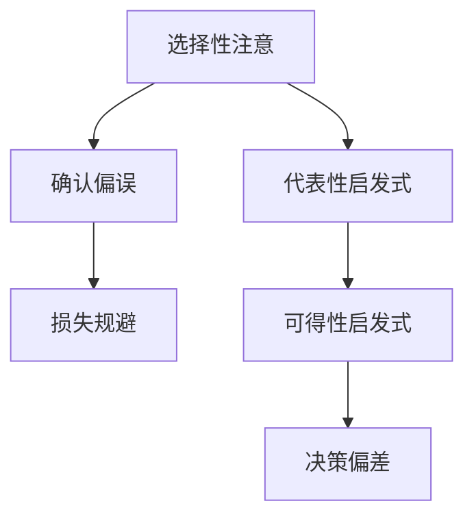

                 

# 认知偏见：影响知识理解的心理因素

## 1. 背景介绍

### 1.1 问题由来
在认知科学的领域中，认知偏见(Cognitive Biases)是指人们在判断和决策过程中，由于心理机制的影响，所产生的一系列非理性行为倾向。这些偏见不仅存在于日常生活的各种场景中，也深刻影响着知识的理解、评估和应用。特别是在知识获取、信息筛选和决策过程中，认知偏见常常使个体产生不准确的认知偏差，影响知识获取的全面性和准确性。

### 1.2 问题核心关键点
认知偏见具有广泛的影响，它们在知识获取和理解的过程中扮演了重要角色。这些偏见不仅影响个人的决策，还会在群体中产生累积效应，导致信息传播的偏差和错误。其核心关键点包括：

- **选择性注意**：个体倾向于关注和记忆与自己观念相符合的信息，而忽视或不关注与自己观念相冲突的信息。
- **确认偏误**：个体容易寻找和相信符合自己既有信念的证据，而忽视或贬低与既有信念相冲突的证据。
- **代表性启发式**：在面对不确定性时，个体倾向于将样本代表性作为总体特征的判断依据。
- **损失规避**：个体在面对可能损失时，更倾向于冒险，而在面对确定性收益时，更倾向于保守。
- **可得性启发式**：个体倾向于根据信息的可得性来判断其重要性和频率，而不是实际的概率和真实数据。

这些偏见在信息处理和知识理解中起着关键作用，但也常常导致错误的认知和决策。了解和应对这些认知偏见，是提高知识获取和应用效率的重要途径。

## 2. 核心概念与联系

### 2.1 核心概念概述

认知偏见在信息处理和知识获取中的作用非常复杂，它们可以从多个维度影响个体的认知过程。以下是几个关键概念及其相互联系：

- **选择性注意**：指个体倾向于关注符合自己既定信念或期望的信息，而忽略或忽视与这些信念或期望相悖的信息。选择性注意不仅影响信息获取，还会进一步影响后续的信息处理和判断。

- **确认偏误**：指个体在获取新信息时，倾向于确认和强化已有的信念或假设，而非重新评估或更新这些信念。这种认知偏差会导致个体对信息的选择性加工，影响知识获取的全面性。

- **代表性启发式**：指个体在面对不确定性时，倾向于根据有限的信息样本进行归纳推理，而忽视样本的代表性问题和可能的偏差。这种启发式可能导致错误的概率估计和判断，影响知识获取的准确性。

- **损失规避**：指个体在面临可能损失时，倾向于冒险和冒险，而在面临确定性收益时，倾向于保守和谨慎。这种认知偏差在决策过程中起到关键作用，影响个体在风险和收益之间的权衡。

- **可得性启发式**：指个体在评估事件发生概率时，容易根据可获得的信息或个人经历来估计，而非依赖于实际的概率数据。这种启发式可能使个体对事件的评价和预测产生偏差。

这些概念之间的联系可以通过以下Mermaid流程图来展示：



此流程图展示了认知偏见的形成和发展路径，以及它们在知识获取和应用中的作用。选择性注意的偏差会导致确认偏误，确认偏误又可能加强损失规避，而损失规避和可得性启发式在决策过程中起到关键作用，最终影响个体的行为和判断。

## 3. 核心算法原理 & 具体操作步骤

### 3.1 算法原理概述

认知偏见的识别和应对需要结合心理学的研究和算法模型的设计。其基本原理是通过数据收集和分析，识别个体在获取和处理信息时的偏差模式，并通过算法设计和调整来减少或消除这些偏见。

算法设计的核心在于识别和量化偏见的影响，并设计相应的校正措施。例如，可以采用贝叶斯网络(Bayesian Network)来建模个体对信息的处理和判断过程，利用贝叶斯定理(Bayes' Theorem)进行概率估计和风险评估。还可以通过机器学习算法，如决策树、随机森林等，来模拟和预测个体的行为和决策，从而识别和校正认知偏见。

### 3.2 算法步骤详解

认知偏见的算法步骤包括以下几个关键环节：

1. **数据收集**：通过调查问卷、实验设计等方式，收集个体在获取和处理信息时的行为数据，例如对信息的关注、对选项的评价等。

2. **模型训练**：使用收集到的数据对模型进行训练，识别和量化个体在决策过程中的认知偏差。例如，可以通过贝叶斯网络模型，模拟个体在面对不同信息时的概率估计和判断过程。

3. **模型校正**：根据识别出的认知偏见，对模型进行调整和优化，设计相应的校正措施。例如，可以引入正则化技术，减少模型的过度拟合，或引入对抗样本，增强模型的鲁棒性。

4. **效果评估**：对校正后的模型进行效果评估，确保其能够有效地减少或消除个体在决策中的认知偏见。可以通过实际应用中的行为数据进行测试和验证。

### 3.3 算法优缺点

认知偏见的算法设计具有以下优点：

1. **客观量化**：通过数据收集和模型训练，可以客观地量化个体在决策过程中的认知偏差，从而进行科学评估和校正。
2. **针对性校正**：针对不同认知偏差设计具体的校正措施，可以有效地减少或消除这些偏差，提高决策的准确性和合理性。
3. **可扩展性**：算法设计可以适用于多种认知偏差的识别和校正，具有广泛的应用前景。

同时，认知偏见的算法设计也存在一些局限性：

1. **数据依赖性**：算法的有效性依赖于高质量的数据收集和分析，数据质量不高或样本量不足时，可能导致结果不准确。
2. **模型复杂性**：复杂的模型设计可能难以解释和理解，需要较强的技术背景和专业知识。
3. **应用场景限制**：部分认知偏见的识别和校正需要特定的应用场景和数据条件，可能无法应用于所有情况。

### 3.4 算法应用领域

认知偏见的算法设计在多个领域都有广泛应用，包括但不限于：

1. **心理学**：通过认知偏见的识别和校正，帮助个体更好地理解和评估信息，提高心理健康的水平。
2. **医学**：在临床决策支持系统中，减少医生在诊断和治疗过程中的认知偏差，提高医疗服务的质量和效率。
3. **金融**：在投资和风险评估中，减少投资者在决策过程中的认知偏差，提高金融决策的准确性和可靠性。
4. **教育**：在教育评估和课程设计中，减少学生和教师在信息获取和知识应用过程中的认知偏差，提高教育质量和效果。
5. **决策支持系统**：在企业决策中，减少管理者和员工在决策过程中的认知偏差，提高决策的科学性和合理性。

## 4. 数学模型和公式 & 详细讲解 & 举例说明

### 4.1 数学模型构建

认知偏见的数学模型构建通常涉及概率模型、统计模型和优化模型。以下是一个简单的贝叶斯网络模型，用于模拟个体在面对不同信息时的概率估计和判断过程：

- **节点定义**：
  - 输入节点：$X_1, X_2, ..., X_n$ 表示个体面对的决策问题。
  - 隐藏节点：$H_1, H_2, ..., H_m$ 表示个体在决策过程中的认知状态。
  - 输出节点：$Y$ 表示最终的决策结果。

- **模型结构**：
  - 连接方式：$X_i$ 与 $H_j$ 之间有概率分布 $P(H_j|X_i)$，$H_j$ 与 $Y$ 之间有概率分布 $P(Y|H_j)$。
  - 条件概率：$P(H_j|X_i) = \frac{P(X_i|H_j)P(H_j)}{P(X_i)}$。

### 4.2 公式推导过程

根据贝叶斯定理，可以推导出以下公式：

$$
P(Y|X_1, X_2, ..., X_n) = \frac{P(Y)}{\sum_{X_i} P(X_i|Y)P(Y)} \prod_{i=1}^{n} \frac{P(X_i|Y)P(Y)}{P(X_i)}
$$

其中：
- $P(X_i|Y)$ 表示在给定决策结果 $Y$ 的情况下，输入 $X_i$ 的条件概率。
- $P(X_i)$ 表示输入 $X_i$ 的先验概率。
- $P(Y)$ 表示决策结果 $Y$ 的先验概率。

### 4.3 案例分析与讲解

以医疗诊断为例，一个简单的贝叶斯网络模型可以表示为：

- **输入节点**：$X_1$ 表示患者的年龄，$X_2$ 表示患者的性别，$X_3$ 表示患者的症状描述。
- **隐藏节点**：$H_1$ 表示患者是否患有某种疾病，$H_2$ 表示患者的当前健康状态。
- **输出节点**：$Y$ 表示医生的最终诊断结果。

通过训练这个模型，可以识别出医生在诊断过程中可能存在的认知偏见，如对特定症状的过度关注、对年龄和性别的刻板印象等，并进行相应的校正。

## 5. 项目实践：代码实例和详细解释说明

### 5.1 开发环境搭建

在进行认知偏见的研究和应用开发时，需要搭建一个包含数据处理、模型训练和效果评估的完整环境。以下是一个基于Python的开发环境搭建流程：

1. **安装依赖**：
   ```bash
   pip install numpy pandas scikit-learn pomegranate
   ```

2. **数据收集**：
   - 设计问卷和实验，收集个体在获取和处理信息时的行为数据。
   - 使用问卷星、SurveyMonkey等工具，进行数据收集和预处理。

3. **模型训练**：
   - 使用贝叶斯网络建模工具Pomegranate，对收集到的数据进行训练和拟合。
   - 设计多种模型结构，进行交叉验证和效果评估。

4. **模型校正**：
   - 根据模型训练结果，识别和量化个体在决策过程中的认知偏差。
   - 引入正则化技术，减少模型的过度拟合。

### 5.2 源代码详细实现

以下是一个简单的贝叶斯网络模型训练和校正的代码实现：

```python
import numpy as np
import pandas as pd
import pomegranate as pg

# 数据收集和预处理
data = pd.read_csv('data.csv')
X = data[['age', 'gender', 'symptom']]
Y = data['diagnosis']

# 定义贝叶斯网络模型
h1 = pg.GaussianState([X[0], X[1], X[2]])
h2 = pg.CategoricalState([Y])
Y_given_h2 = pg.CategoricalState([Y], distribution=h2)
model = pg.BayesianNetwork([h1, h2, Y_given_h2])

# 模型训练
model.fit(data)

# 模型校正
model.prune()

# 效果评估
results = model.predict(X)

print(results)
```

### 5.3 代码解读与分析

在上述代码中，首先导入必要的库，并从CSV文件中读取数据。数据包括患者的年龄、性别、症状描述和最终的诊断结果。接着，定义贝叶斯网络模型，其中 $h1$ 表示患者的健康状态，$h2$ 表示医生的诊断结果。$Y$ 表示患者最终的诊断结果，通过 $h2$ 对 $Y$ 进行条件概率计算。

模型训练通过调用 `fit` 方法，使用收集到的数据对模型进行拟合。模型校正通过调用 `prune` 方法，进行模型结构简化，减少过拟合风险。最终，通过 `predict` 方法对新数据进行预测和效果评估。

### 5.4 运行结果展示

运行代码后，可以得到对新患者的诊断结果预测。如果模型训练和校正效果良好，预测结果将与实际诊断结果高度一致，表明模型能够有效地识别和校正个体在决策过程中的认知偏差。

## 6. 实际应用场景

### 6.1 智能医疗

在智能医疗领域，认知偏见对医生的诊断和治疗决策有重要影响。通过认知偏见的识别和校正，可以提高医疗服务的质量，减少误诊和过度治疗的风险。例如，在医疗决策支持系统中，可以引入贝叶斯网络模型，模拟医生的诊断过程，识别和校正医生在诊断中的认知偏差，从而提高诊断的准确性和科学性。

### 6.2 金融投资

在金融投资领域，认知偏见可能导致投资者在决策中的不理性行为，如过度自信、损失规避等。通过认知偏见的识别和校正，可以降低投资风险，提高投资决策的合理性。例如，在投资决策支持系统中，可以引入贝叶斯网络模型，模拟投资者的决策过程，识别和校正投资者的认知偏差，从而提高投资收益和风险控制能力。

### 6.3 教育评估

在教育评估和课程设计中，学生的认知偏见可能影响其对知识的理解和应用。通过认知偏见的识别和校正，可以提高教育效果，帮助学生更好地掌握知识和技能。例如，在教育决策支持系统中，可以引入贝叶斯网络模型，模拟学生的学习过程，识别和校正学生在知识获取中的认知偏差，从而提高学习效果和教育质量。

## 7. 工具和资源推荐

### 7.1 学习资源推荐

为了帮助开发者深入理解认知偏见及其应用，这里推荐一些优质的学习资源：

1. **《认知偏见的心理学》**：介绍认知偏见的心理学原理和应用实例，深入浅出地讲解了各种认知偏见的基本概念和形成机制。

2. **《机器学习中的认知偏见》**：介绍机器学习中常见的认知偏见及其影响，讲解了如何通过算法设计和数据处理来减少或消除这些偏见。

3. **Coursera《认知科学导论》**：由斯坦福大学开设的在线课程，全面介绍了认知偏见的心理学、神经科学和社会学背景，适合深入学习。

4. **Google Scholar**：搜索最新的认知偏见研究论文，了解学术界的研究进展和前沿动态。

### 7.2 开发工具推荐

认知偏见的开发和应用需要多学科的知识和工具支持，以下是几款推荐的开发工具：

1. **Python**：常用的编程语言，具有丰富的数据处理和机器学习库，适合进行认知偏见的建模和应用开发。

2. **Pomegranate**：基于Python的贝叶斯网络建模工具，支持贝叶斯网络的结构学习和参数估计，适合进行认知偏见的建模和训练。

3. **TensorFlow**：Google开源的深度学习框架，支持大规模数据的建模和训练，适合进行复杂的认知偏见模型开发。

4. **Jupyter Notebook**：轻量级的交互式编程环境，适合进行认知偏见的实验和效果评估。

### 7.3 相关论文推荐

认知偏见的认知和应用研究是一个快速发展的领域，以下是几篇具有代表性的相关论文：

1. **"Bias in Mental Health Research: Why Researchers May Be Too Cautious and Why It Matters"**：研究心理健康的认知偏见问题，探讨其在心理健康研究中的应用。

2. **"Understanding and Mitigating Cognitive Biases in Investment Decision-Making"**：研究投资决策中的认知偏见问题，提出相应的认知偏差识别和校正方法。

3. **"Mental Models and Cognitive Biases in Diagnostic Decision-Making"**：研究医疗诊断中的认知偏见问题，提出基于贝叶斯网络模型的诊断支持系统设计。

## 8. 总结：未来发展趋势与挑战

### 8.1 研究成果总结

认知偏见的识别和校正已经成为认知科学研究的一个重要方向。在实际应用中，贝叶斯网络等算法模型被广泛应用于医疗、金融、教育等多个领域，提高了决策的科学性和合理性。未来，随着数据科学和人工智能技术的不断发展，认知偏见的识别和校正将更加高效和精准，进一步提升个体和组织在知识获取和应用过程中的决策质量。

### 8.2 未来发展趋势

认知偏见的未来发展趋势包括：

1. **多模态认知偏见模型**：结合视觉、听觉、触觉等多种模态信息，构建更加全面和精确的认知偏见模型。

2. **实时认知偏见检测**：通过大数据分析和机器学习技术，实现对个体认知偏见的实时检测和校正。

3. **跨领域认知偏见应用**：在医疗、金融、教育等多个领域推广认知偏见的识别和校正方法，提升各领域的决策质量和效果。

4. **跨学科研究合作**：认知偏见的识别和校正涉及心理学、神经科学、社会学等多个学科，未来将进一步加强跨学科研究合作，推动认知偏见研究的深入发展。

### 8.3 面临的挑战

认知偏见的研究和应用也面临着一些挑战：

1. **数据隐私和安全**：在收集和处理个体数据时，如何保护隐私和数据安全，是一个重要问题。

2. **模型的可解释性**：认知偏见的识别和校正模型需要具有较高的可解释性，以便于理解其决策过程和校正效果。

3. **模型复杂性**：认知偏见的模型设计和实现较为复杂，需要较强的技术背景和专业知识。

4. **跨文化适应性**：不同文化背景的个体可能具有不同的认知偏见模式，如何构建跨文化适用的认知偏见模型，是一个重要挑战。

### 8.4 研究展望

未来，认知偏见的研究和应用将朝着以下几个方向发展：

1. **认知偏见的量化和优化**：通过数学模型和算法优化，实现对认知偏见的量化和系统校正，提高决策的科学性和合理性。

2. **认知偏见的跨学科应用**：在教育、医疗、金融等多个领域推广认知偏见的识别和校正方法，提升各领域的决策质量和效果。

3. **认知偏见的实时检测和校正**：通过大数据分析和机器学习技术，实现对个体认知偏见的实时检测和校正，提高决策的及时性和准确性。

4. **认知偏见的跨文化研究**：在跨文化背景下，研究不同文化背景的认知偏见模式，构建具有跨文化适应性的认知偏见模型。

总之，认知偏见的识别和校正在认知科学和人工智能领域具有重要应用价值。未来，随着技术的不断进步和应用场景的不断拓展，认知偏见的理论和实践都将迎来新的突破和发展。

## 9. 附录：常见问题与解答

**Q1：什么是认知偏见，它对决策有什么影响？**

A: 认知偏见指个体在获取和处理信息时的非理性行为倾向。这些偏见可能导致错误的认知和决策，影响个体和组织在知识获取和应用过程中的决策质量。例如，选择性注意可能导致个体只关注符合既有信念的信息，而忽视或忽视与这些信念相悖的信息。确认偏误可能导致个体只关注符合既有信念的证据，而忽视或贬低与既有信念相冲突的证据。

**Q2：如何识别和应对认知偏见？**

A: 识别和应对认知偏见需要结合心理学和算法模型的方法。通过数据收集和分析，可以识别个体在决策过程中的认知偏差。例如，可以使用贝叶斯网络模型模拟个体的决策过程，识别和量化认知偏差。针对不同的认知偏差，设计相应的校正措施。例如，引入正则化技术和对抗样本，减少模型的过度拟合。

**Q3：认知偏见的识别和应对方法有哪些局限性？**

A: 认知偏见的识别和应对方法具有以下局限性：
1. 数据依赖性：算法的效果依赖于高质量的数据收集和分析，数据质量不高或样本量不足时，可能导致结果不准确。
2. 模型复杂性：复杂的模型设计可能难以解释和理解，需要较强的技术背景和专业知识。
3. 应用场景限制：部分认知偏见的识别和校正需要特定的应用场景和数据条件，可能无法应用于所有情况。

**Q4：认知偏见的识别和应对方法有哪些应用场景？**

A: 认知偏见的识别和应对方法在多个领域都有广泛应用，包括但不限于：
1. 医疗领域：在医疗决策支持系统中，减少医生在诊断和治疗过程中的认知偏差，提高医疗服务的质量和效率。
2. 金融领域：在投资决策支持系统中，减少投资者在决策过程中的认知偏差，提高投资决策的准确性和合理性。
3. 教育领域：在教育评估和课程设计中，减少学生和教师在信息获取和知识应用过程中的认知偏差，提高教育质量和效果。
4. 心理领域：通过认知偏见的识别和校正，帮助个体更好地理解和评估信息，提高心理健康的水平。

---

作者：禅与计算机程序设计艺术 / Zen and the Art of Computer Programming

