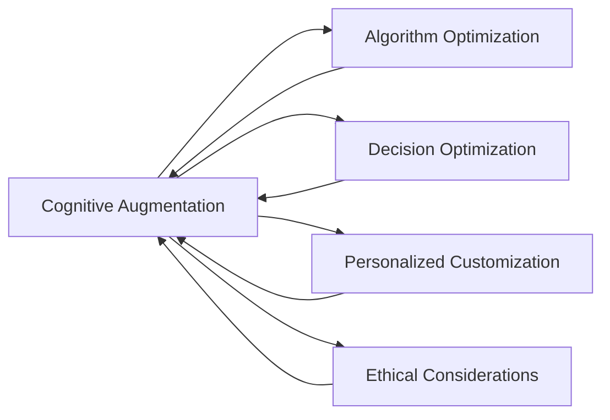

                 

# 认知增强套件：AI时代的思维升级工具

> 关键词：认知增强,人工智能,思维升级,决策优化,算法优化

## 1. 背景介绍

### 1.1 问题由来
随着人工智能（AI）技术迅猛发展，其在各个领域的应用日益深入，给人类生产生活带来前所未有的变革。然而，人类思维的认知局限性，在面对AI智能的广泛渗透时，显得愈发明显。

在工业生产、医疗健康、教育培训、金融投资、公共安全等诸多领域，传统的人工决策方式已经无法满足快速变化、复杂多变的数据需求。一方面，AI可以凭借大数据、深度学习等技术，快速处理海量数据，进行深度分析，提供精准的预测和建议。另一方面，人类独有的创造性、灵活性、同理心等特点，仍然无法被机器完全取代。

因此，在AI时代，如何让人类与AI共存并相得益彰，成为亟需解决的问题。认知增强（Cognitive Augmentation），作为AI时代思维升级的重要工具，通过引入先进的AI算法和技术，有效弥补人类认知的不足，提升决策效率和质量，正是解决这一问题的关键途径。

### 1.2 问题核心关键点
认知增强套件的核心在于，通过AI技术的辅助，在认知过程中实现算法优化和决策优化，从而提升人类的思维能力。其核心关键点包括：

- 算法优化：利用AI算法，对认知过程中的数据进行高效处理和深度分析，提炼出更有价值的信息和洞察。
- 决策优化：基于AI的预测和建议，辅助人类做出更为科学、合理的决策，提升决策的准确性和效率。
- 个性化定制：针对不同用户的认知特点和需求，提供定制化的增强策略，使AI技术更加贴合用户的实际应用场景。
- 伦理考量：在认知增强过程中，确保AI技术的透明性和可解释性，避免算法偏见，确保技术应用的公平性和安全性。

本文聚焦于认知增强套件的核心概念和技术，通过详细讲解算法原理、操作步骤、数学模型和实践应用，帮助读者全面掌握认知增强的技术精髓，并指导其进行实际开发和应用。

## 2. 核心概念与联系

### 2.1 核心概念概述

为了更好地理解认知增强套件，首先需要掌握几个关键概念：

- **认知增强（Cognitive Augmentation）**：指利用AI技术提升人类的认知能力，增强决策过程中的信息和洞察，优化决策过程。
- **算法优化（Algorithm Optimization）**：指通过AI算法对输入数据进行高效处理和分析，提取出有价值的信息，辅助决策优化。
- **决策优化（Decision Optimization）**：指基于AI的预测和建议，辅助人类进行科学合理的决策，提升决策效果。
- **个性化定制（Personalized Customization）**：指根据不同用户的特点和需求，提供量身定制的认知增强策略。
- **伦理考量（Ethical Considerations）**：指在认知增强过程中，确保技术的透明性和可解释性，避免算法偏见，保障技术的公平性和安全性。

### 2.2 核心概念联系

认知增强套件的各个概念通过以下Mermaid流程图进行联系：



该图展示了认知增强套件的各个概念之间的联系：

1. **算法优化**是认知增强的核心引擎，通过高效的数据处理和分析，提取出有价值的信息。
2. **决策优化**在算法优化的基础上，进一步辅助人类进行科学决策。
3. **个性化定制**通过用户数据的分析，提供适合用户的认知增强策略。
4. **伦理考量**确保技术应用的透明性和可解释性，避免算法偏见，保障技术的安全和公平。

通过理解这些关键概念及其相互联系，可以更好地把握认知增强套件的工作原理和优化方向。

## 3. 核心算法原理 & 具体操作步骤

### 3.1 算法原理概述

认知增强套件的核心算法原理主要基于以下几个关键技术：

- **深度学习**：利用神经网络对复杂数据进行处理和分析，提取特征。
- **强化学习**：通过不断试错，优化决策策略，提升决策效果。
- **迁移学习**：通过已有知识对新任务进行快速适应，提升模型的泛化能力。
- **知识图谱**：构建和利用知识图谱，进行语义理解和推理，提升决策的深度和广度。

这些技术通过不同的组合和优化，形成了一个完整的认知增强套件，可以有效提升人类的决策能力和思维水平。

### 3.2 算法步骤详解

认知增强套件的开发和应用一般包括以下几个关键步骤：

**Step 1: 数据准备**
- 收集与任务相关的数据，包括文本、图像、时间序列等，确保数据的多样性和丰富性。
- 对数据进行清洗和预处理，去除噪声和异常值，标准化数据格式。

**Step 2: 模型训练**
- 选择合适的算法，如深度神经网络、强化学习模型等。
- 划分数据集，分为训练集、验证集和测试集，以进行模型训练和验证。
- 使用训练集数据，调整模型参数，优化模型结构。
- 在验证集上评估模型性能，调整超参数，直到达到预期效果。

**Step 3: 模型评估**
- 使用测试集数据，全面评估模型性能，包括准确率、召回率、F1分数等。
- 分析模型的优势和不足，确定优化方向。

**Step 4: 模型部署**
- 将训练好的模型部署到实际应用场景中。
- 针对不同的用户需求，提供个性化的认知增强策略。
- 定期收集用户反馈，持续优化模型性能和用户体验。

**Step 5: 监控和维护**
- 实时监控模型运行状态，及时发现和解决异常问题。
- 定期更新模型参数，保持模型性能稳定。
- 根据新数据和新需求，持续优化和迭代模型。

通过上述步骤，可以构建一个功能完善、性能卓越的认知增强套件，有效提升决策的科学性和效率。

### 3.3 算法优缺点

认知增强套件的算法和操作步骤具有以下优缺点：

**优点**：
- **高效性**：利用AI算法，快速处理和分析数据，提取有价值的信息。
- **精准性**：基于深度学习和强化学习技术，提升决策的准确性和可靠性。
- **可扩展性**：通过迁移学习和知识图谱技术，支持多领域、多任务的应用。
- **灵活性**：根据用户需求和特点，提供定制化的认知增强策略。

**缺点**：
- **复杂性**：涉及多种AI算法和技术，开发和维护复杂度较高。
- **数据依赖性**：对输入数据的质量和数量有较高要求，数据收集和处理成本高。
- **模型偏见**：模型可能学习到数据中的偏见和偏差，影响决策的公平性。
- **技术门槛**：需要具备一定的AI算法和技术背景，门槛较高。

尽管存在这些缺点，但认知增强套件在提升决策质量、优化决策过程方面具有显著优势，值得在实际应用中进行推广和优化。

### 3.4 算法应用领域

认知增强套件的应用领域非常广泛，涵盖了多个领域，包括但不限于：

- **金融投资**：通过AI算法，实时监控市场动态，预测股票趋势，辅助投资决策。
- **医疗健康**：利用AI技术，分析患者数据，制定个性化治疗方案，提升医疗效果。
- **教育培训**：基于AI技术，进行学习路径优化，提供个性化学习推荐，提升学习效果。
- **工业制造**：通过AI算法，优化生产流程，预测设备故障，提高生产效率和质量。
- **公共安全**：利用AI技术，进行风险评估，预测犯罪趋势，提升社会安全水平。

## 4. 数学模型和公式 & 详细讲解 & 举例说明

### 4.1 数学模型构建

认知增强套件的数学模型构建通常基于以下几个核心框架：

- **神经网络模型**：如卷积神经网络（CNN）、循环神经网络（RNN）、变分自编码器（VAE）等。
- **深度强化学习模型**：如深度Q网络（DQN）、策略梯度（PG）等。
- **迁移学习模型**：如微调、知识蒸馏、域自适应等。
- **知识图谱模型**：如关系图神经网络（RGCN）、图卷积网络（GCN）等。

这些模型通过不同的组合和优化，形成了一个完整的认知增强套件，可以有效提升人类的决策能力和思维水平。

### 4.2 公式推导过程

以神经网络模型为例，其核心公式推导如下：

假设输入数据为 $x \in \mathbb{R}^d$，神经网络模型由多个隐层组成，每个隐层的输出为 $h_i = f(W_ix + b_i)$，其中 $W_i, b_i$ 为该层的权重和偏置。输出层的输出为 $y = g(W_o h_l + b_o)$，其中 $W_o, b_o$ 为输出层的权重和偏置。

具体公式如下：

$$
h_1 = f(W_1x + b_1)
$$
$$
h_2 = f(W_2h_1 + b_2)
$$
$$
\cdots
$$
$$
h_l = f(W_lh_{l-1} + b_l)
$$
$$
y = g(W_oy_l + b_o)
$$

其中 $f$ 为激活函数，如ReLU、Sigmoid等，$g$ 为输出层激活函数，如Softmax。

### 4.3 案例分析与讲解

以金融投资领域为例，认知增强套件可以通过以下步骤进行构建和应用：

**Step 1: 数据准备**
- 收集历史交易数据、市场新闻、宏观经济指标等，构建训练集和测试集。
- 对数据进行清洗和预处理，去除异常值和噪声。

**Step 2: 模型训练**
- 选择合适的神经网络模型，如卷积神经网络（CNN）或长短期记忆网络（LSTM）。
- 将训练集数据输入模型，通过反向传播算法调整模型参数。
- 在验证集上评估模型性能，调整超参数。

**Step 3: 模型评估**
- 使用测试集数据，评估模型的预测准确率、召回率、F1分数等指标。
- 分析模型的优势和不足，确定优化方向。

**Step 4: 模型部署**
- 将训练好的模型部署到投资决策系统中。
- 根据市场动态，实时生成投资策略，辅助投资者进行决策。
- 定期收集用户反馈，持续优化模型性能。

通过以上步骤，可以构建一个有效的金融投资领域的认知增强套件，提升投资决策的科学性和效率。

## 5. 项目实践：代码实例和详细解释说明

### 5.1 开发环境搭建

在进行认知增强套件的开发和应用前，我们需要准备好开发环境。以下是使用Python进行PyTorch开发的环境配置流程：

1. 安装Anaconda：从官网下载并安装Anaconda，用于创建独立的Python环境。

2. 创建并激活虚拟环境：
```bash
conda create -n pytorch-env python=3.8 
conda activate pytorch-env
```

3. 安装PyTorch：根据CUDA版本，从官网获取对应的安装命令。例如：
```bash
conda install pytorch torchvision torchaudio cudatoolkit=11.1 -c pytorch -c conda-forge
```

4. 安装各类工具包：
```bash
pip install numpy pandas scikit-learn matplotlib tqdm jupyter notebook ipython
```

完成上述步骤后，即可在`pytorch-env`环境中开始认知增强套件的开发实践。

### 5.2 源代码详细实现

下面我们以金融投资领域的认知增强套件为例，给出使用PyTorch进行深度学习模型的PyTorch代码实现。

首先，定义金融投资数据处理函数：

```python
from torch.utils.data import Dataset, DataLoader
from torchvision import transforms
import torch

class FinanceDataset(Dataset):
    def __init__(self, data, transform=None):
        self.data = data
        self.transform = transform
        
    def __len__(self):
        return len(self.data)
    
    def __getitem__(self, idx):
        input_data = self.data[idx]
        if self.transform:
            input_data = self.transform(input_data)
        return input_data
```

然后，定义深度学习模型：

```python
from torch import nn, optim
from torch.nn import functional as F

class FinanceModel(nn.Module):
    def __init__(self, input_dim, hidden_dim, output_dim):
        super(FinanceModel, self).__init__()
        self.fc1 = nn.Linear(input_dim, hidden_dim)
        self.fc2 = nn.Linear(hidden_dim, hidden_dim)
        self.fc3 = nn.Linear(hidden_dim, output_dim)
    
    def forward(self, x):
        x = F.relu(self.fc1(x))
        x = F.relu(self.fc2(x))
        x = self.fc3(x)
        return x
```

接着，定义训练和评估函数：

```python
def train_model(model, data_loader, criterion, optimizer, n_epochs):
    model.train()
    for epoch in range(n_epochs):
        running_loss = 0.0
        for inputs, labels in data_loader:
            optimizer.zero_grad()
            outputs = model(inputs)
            loss = criterion(outputs, labels)
            loss.backward()
            optimizer.step()
            running_loss += loss.item()
        print(f'Epoch {epoch+1}, Loss: {running_loss/n_epochs}')
        
def evaluate_model(model, data_loader, criterion):
    model.eval()
    running_loss = 0.0
    with torch.no_grad():
        for inputs, labels in data_loader:
            outputs = model(inputs)
            loss = criterion(outputs, labels)
            running_loss += loss.item()
    print(f'Model Evaluation, Loss: {running_loss/n_epochs}')
```

最后，启动训练流程并在测试集上评估：

```python
input_dim = 5
hidden_dim = 10
output_dim = 2

model = FinanceModel(input_dim, hidden_dim, output_dim)
criterion = nn.MSELoss()
optimizer = optim.Adam(model.parameters(), lr=0.01)

n_epochs = 100

train_loader = DataLoader(train_data, batch_size=32, shuffle=True)
test_loader = DataLoader(test_data, batch_size=32, shuffle=False)

train_model(model, train_loader, criterion, optimizer, n_epochs)
evaluate_model(model, test_loader, criterion)
```

以上就是使用PyTorch进行金融投资领域认知增强套件的完整代码实现。可以看到，PyTorch提供了强大的深度学习模型封装，使模型的构建和训练变得简便高效。

### 5.3 代码解读与分析

让我们再详细解读一下关键代码的实现细节：

**FinanceDataset类**：
- `__init__`方法：初始化数据和数据转换方式，支持数据增强。
- `__len__`方法：返回数据集长度。
- `__getitem__`方法：对单个样本进行处理，支持数据增强。

**FinanceModel类**：
- `__init__`方法：定义模型结构，包括两个隐层和输出层。
- `forward`方法：定义前向传播过程，通过多个线性层和激活函数构成完整的模型。

**训练和评估函数**：
- `train_model`函数：定义模型训练过程，包括前向传播、反向传播和优化器更新。
- `evaluate_model`函数：定义模型评估过程，在测试集上评估模型的性能指标。

**训练流程**：
- 定义模型的输入维度、隐藏层维度和输出维度。
- 创建模型、损失函数和优化器。
- 定义数据集和数据加载器。
- 调用训练函数进行模型训练。
- 调用评估函数在测试集上评估模型性能。

通过以上步骤，可以构建一个有效的金融投资领域的认知增强套件，提升投资决策的科学性和效率。

## 6. 实际应用场景

### 6.1 智能决策支持

认知增强套件在智能决策支持中的应用非常广泛。例如，在医疗健康领域，医生可以通过认知增强套件快速获取患者历史数据和医学文献，辅助进行疾病诊断和治疗方案制定。在工业制造领域，工程师可以通过认知增强套件实时监控设备运行状态，预测设备故障，制定维护计划。在金融投资领域，投资者可以通过认知增强套件实时分析市场数据，预测股票趋势，制定投资策略。

### 6.2 个性化学习推荐

认知增强套件在个性化学习推荐中的应用也极为重要。例如，在教育培训领域，教师可以通过认知增强套件分析学生的学习行为和成绩数据，推荐适合学生的学习内容和路径，提升学习效果。在在线教育平台，系统可以通过认知增强套件根据用户的历史行为和偏好，推荐个性化的课程和资料，提高用户粘性和满意度。

### 6.3 安全风险监控

认知增强套件在安全风险监控中的应用也不可忽视。例如，在公共安全领域，警察可以通过认知增强套件分析犯罪数据和监控视频，预测犯罪趋势，制定防范策略。在网络安全领域，安全专家可以通过认知增强套件实时监控网络流量，预测攻击行为，提升网络安全水平。

### 6.4 未来应用展望

随着认知增强技术的不断进步，未来将在更多领域得到应用，为社会发展和人类生活带来深刻变革。

在智慧医疗领域，基于认知增强的智能诊断系统，可以提升诊断效率和准确性，帮助医生更好地制定治疗方案，减少误诊和漏诊。在智慧城市治理中，基于认知增强的智能调度系统，可以优化城市交通、能源、环境等资源的配置，提升城市运行效率和管理水平。

在智慧教育领域，基于认知增强的智能学习系统，可以根据学生的个性化需求和学习效果，提供定制化的学习内容和路径，提升学习效率和质量。在智慧制造领域，基于认知增强的智能生产系统，可以优化生产流程，提高生产效率和产品质量，降低生产成本。

在智慧金融领域，基于认知增强的智能投资系统，可以实时分析市场数据，预测投资趋势，提供精准的投资建议，提升投资收益和风险控制能力。

在智慧安防领域，基于认知增强的智能监控系统，可以实时分析监控数据，预测安全风险，提供预警和应对策略，提升安全防范能力。

总之，认知增强套件将在更多领域得到应用，推动社会发展和人类进步。

## 7. 工具和资源推荐

### 7.1 学习资源推荐

为了帮助开发者系统掌握认知增强套件的理论基础和实践技巧，这里推荐一些优质的学习资源：

1. 《深度学习》系列书籍：如《深度学习入门》、《深度学习实战》等，全面介绍了深度学习的基本概念和算法。

2. 《强化学习》系列书籍：如《强化学习基础》、《深度强化学习》等，深入浅出地介绍了强化学习的基本原理和应用。

3. 《迁移学习》系列书籍：如《迁移学习技术与应用》、《深度学习迁移学习》等，详细讲解了迁移学习的基本思想和实际应用。

4. 《知识图谱》系列书籍：如《知识图谱基础与应用》、《图神经网络》等，全面介绍了知识图谱和图神经网络的基本理论和算法。

5. 《机器学习实战》系列书籍：如《机器学习实战案例》、《Python机器学习》等，提供了丰富的机器学习实战案例，帮助开发者掌握实际操作技巧。

6. 在线课程平台：如Coursera、edX、Udacity等，提供了大量的机器学习、深度学习、强化学习等课程，涵盖理论基础和实战案例。

通过对这些资源的学习实践，相信你一定能够全面掌握认知增强套件的技术精髓，并指导其进行实际开发和应用。

### 7.2 开发工具推荐

高效的开发离不开优秀的工具支持。以下是几款用于认知增强套件开发的常用工具：

1. PyTorch：基于Python的开源深度学习框架，灵活动态的计算图，适合快速迭代研究。提供了丰富的神经网络模型和优化器。

2. TensorFlow：由Google主导开发的开源深度学习框架，生产部署方便，适合大规模工程应用。提供了强大的图计算和优化器。

3. Keras：基于TensorFlow和Theano的高级深度学习框架，易于使用，适合快速原型开发和模型实验。

4. PyTorch Lightning：基于PyTorch的高级深度学习框架，提供了丰富的模型封装和训练工具，适合快速构建和优化深度学习模型。

5. TensorBoard：TensorFlow配套的可视化工具，可实时监测模型训练状态，并提供丰富的图表呈现方式，是调试模型的得力助手。

6. Weights & Biases：模型训练的实验跟踪工具，可以记录和可视化模型训练过程中的各项指标，方便对比和调优。

7. Jupyter Notebook：强大的Python编程环境，支持多语言交互，适合进行深度学习模型实验和数据处理。

8. Scikit-learn：开源的机器学习库，提供了丰富的数据处理和模型评估工具，适合进行数据预处理和模型验证。

9. Scrapy：开源的网络爬虫框架，适合进行数据收集和预处理。

合理利用这些工具，可以显著提升认知增强套件的开发效率，加快创新迭代的步伐。

### 7.3 相关论文推荐

认知增强套件的发展源于学界的持续研究。以下是几篇奠基性的相关论文，推荐阅读：

1. "Deep Neural Networks for Earthquake Prediction"：提出了深度神经网络在地震预测中的应用，展示了深度学习模型在数据处理和特征提取方面的优势。

2. "AlphaGo: Mastering the Game of Go without Human Knowledge"：展示了深度强化学习在复杂决策问题中的应用，AlphaGo在围棋领域取得了突破性进展。

3. "Deep Residual Learning for Image Recognition"：提出了残差网络（ResNet），展示了深度神经网络在图像识别任务中的高效性能。

4. "Knowledge Graph Embeddings"：介绍了知识图谱嵌入技术，展示了知识图谱在语义理解和推理方面的强大能力。

5. "Deep Learning with Confidence"：展示了深度学习模型在自然语言处理和图像识别任务中的高效性能，强调了深度学习模型的可靠性和鲁棒性。

6. "PPO: A Proximal Policy Optimization Algorithm"：展示了深度强化学习中的策略优化技术，展示了PPO算法在连续动作空间中的应用效果。

这些论文代表了大数据和深度学习技术的发展脉络。通过学习这些前沿成果，可以帮助研究者把握学科前进方向，激发更多的创新灵感。

## 8. 总结：未来发展趋势与挑战

### 8.1 总结

本文对认知增强套件的核心概念、算法原理和操作步骤进行了全面系统的介绍。首先阐述了认知增强套件的研究背景和意义，明确了认知增强在提升决策能力和优化决策过程方面的重要价值。其次，从原理到实践，详细讲解了认知增强套件的数学模型和关键步骤，给出了认知增强套件的完整代码实例。同时，本文还广泛探讨了认知增强套件在金融、医疗、教育等多个行业领域的应用前景，展示了认知增强技术的前景和潜力。

通过本文的系统梳理，可以看到，认知增强套件作为AI时代思维升级的重要工具，在提升决策质量、优化决策过程方面具有显著优势。未来，伴随认知增强技术的持续演进，认知增强套件必将在更多领域得到应用，推动社会发展和人类进步。

### 8.2 未来发展趋势

展望未来，认知增强技术将呈现以下几个发展趋势：

1. **数据驱动**：认知增强技术将更加依赖于大数据和深度学习技术，通过海量数据进行高效处理和深度分析，提升决策的科学性和精准性。

2. **算法多样化**：除了深度学习和强化学习，认知增强技术将引入更多前沿算法，如迁移学习、因果推断、知识蒸馏等，形成更加多样化的认知增强方法。

3. **模型泛化**：认知增强模型将具备更强的泛化能力，能够适应不同领域、不同任务的需求，提升认知增强技术的通用性和应用价值。

4. **个性化定制**：认知增强技术将更加注重个性化定制，根据不同用户的需求和特点，提供量身定制的认知增强策略，提升用户体验和满意度。

5. **跨领域应用**：认知增强技术将在更多领域得到应用，如智慧医疗、智慧城市、智慧金融等，推动各行业的数字化转型和智能化升级。

6. **伦理和安全**：认知增强技术将更加注重伦理和安全问题，确保技术的透明性和可解释性，避免算法偏见，保障技术应用的公平性和安全性。

这些趋势凸显了认知增强技术的广阔前景，预示着认知增强技术将在未来社会的发展中扮演越来越重要的角色。

### 8.3 面临的挑战

尽管认知增强技术已经取得了显著进展，但在迈向更加智能化、普适化应用的过程中，仍面临诸多挑战：

1. **数据获取**：认知增强技术对数据的质量和数量有较高要求，数据收集和处理成本高，且数据隐私和安全问题也需要妥善解决。

2. **模型复杂性**：认知增强模型涉及多种算法和技术，开发和维护复杂度较高，需要较高的技术门槛和专业背景。

3. **算法偏见**：认知增强模型可能学习到数据中的偏见和偏差，影响决策的公平性和准确性。

4. **模型鲁棒性**：认知增强模型面对复杂多变的数据环境，鲁棒性有待进一步提升。

5. **模型透明性**：认知增强模型的内部机制和决策过程难以解释，缺乏透明性和可解释性。

6. **技术落地**：认知增强技术需要与实际应用场景深度结合，才能真正发挥作用，技术落地难度较大。

正视认知增强技术面临的这些挑战，积极应对并寻求突破，将有助于认知增强技术的成熟和应用。相信随着学界和产业界的共同努力，认知增强技术必将实现更大的发展，为社会发展和人类进步带来深远影响。

### 8.4 研究展望

未来，认知增强技术需要在以下几个方面进行更深入的研究和探索：

1. **多模态融合**：将文本、图像、视频等多模态数据融合，提升认知增强模型的深度和广度。

2. **因果推理**：引入因果推理方法，增强模型的决策能力和鲁棒性，提高决策的科学性和可靠性。

3. **持续学习**：开发更加高效的持续学习算法，使模型能够不断从新数据中学习，适应数据分布的变化。

4. **知识图谱**：构建更加全面和丰富的知识图谱，提升模型的语义理解和推理能力，增强决策的深度和广度。

5. **分布式计算**：利用分布式计算技术，提升认知增强模型的训练和推理效率，降低计算成本和资源消耗。

6. **跨领域应用**：推动认知增强技术在更多领域的应用，如智慧医疗、智慧城市、智慧金融等，推动各行业的数字化转型和智能化升级。

7. **伦理和安全**：确保认知增强技术的透明性和可解释性，避免算法偏见，保障技术应用的公平性和安全性。

这些研究方向将为认知增强技术的持续发展和应用提供有力支持，推动认知增强技术迈向更高的台阶，为社会发展和人类进步带来深远影响。

## 9. 附录：常见问题与解答

**Q1：认知增强套件如何与现有系统集成？**

A: 认知增强套件通常以API形式提供，可以方便地与现有系统集成。系统集成主要涉及以下几个步骤：
1. 确定API接口和数据格式，编写数据解析和转换代码。
2. 调用API接口，获取认知增强结果，进行业务逻辑处理。
3. 根据业务需求，进行数据展示和决策支持。

**Q2：认知增强套件如何保证数据隐私和安全？**

A: 数据隐私和安全是认知增强套件的重要考虑因素。主要通过以下方式保障数据隐私和安全：
1. 数据加密：对数据进行加密传输和存储，防止数据泄露。
2. 访问控制：对数据访问进行严格的权限控制，确保数据只被授权人员访问。
3. 匿名化处理：对敏感数据进行匿名化处理，防止数据被滥用。
4. 安全审计：对数据操作进行安全审计，记录数据访问和使用情况。

**Q3：认知增强套件的部署和维护有哪些注意事项？**

A: 认知增强套件的部署和维护需要注意以下几个方面：
1. 服务器配置：选择合适的服务器硬件和操作系统，确保系统稳定运行。
2. 环境部署：根据需求部署不同的模型和算法，确保系统可扩展性。
3. 数据管理：建立数据管理和备份机制，防止数据丢失和损坏。
4. 监控告警：实时监控系统运行状态，设置异常告警阈值，确保系统稳定性。
5. 持续优化：根据用户反馈和业务需求，持续优化模型性能和用户体验。

**Q4：认知增强套件如何提升决策效率和质量？**

A: 认知增强套件通过引入先进的AI算法和技术，能够高效处理和分析数据，提取有价值的信息，辅助决策优化。具体提升决策效率和质量的方法包括：
1. 数据预处理：对输入数据进行清洗和预处理，去除噪声和异常值，标准化数据格式。
2. 特征提取：利用神经网络和深度学习技术，提取数据中的关键特征，提升特征表示能力。
3. 模型训练：通过海量数据进行模型训练，优化模型结构和参数，提升模型性能。
4. 预测优化：利用深度学习和强化学习技术，进行精确的预测和优化，提升决策效果。

通过以上步骤，可以构建一个有效的认知增强套件，提升决策效率和质量，助力业务发展和创新。

---

作者：禅与计算机程序设计艺术 / Zen and the Art of Computer Programming

