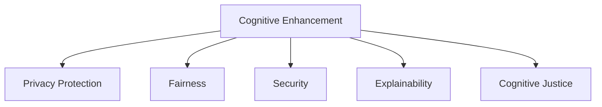

                 

# 认知增强技术的伦理考量

> 关键词：认知增强,人工智能,伦理,隐私保护,公平性,安全性,可解释性

## 1. 背景介绍

### 1.1 问题由来

随着人工智能(AI)技术的迅猛发展，认知增强技术（Cognitive Enhancement）逐渐成为热点领域。认知增强旨在通过先进的计算和数据技术，增强人类认知能力，提升学习、决策、创造等方面的表现。这一技术涵盖从神经网络、深度学习到自然语言处理、计算机视觉等多个前沿方向，具有广泛的应用前景和巨大的社会价值。

然而，认知增强技术在带来显著效益的同时，也引发了一系列伦理问题。包括隐私保护、公平性、安全性、可解释性等方面的挑战，亟待解决。如何在技术创新和社会伦理之间找到平衡，是当前认知增强技术研究的重要课题。

### 1.2 问题核心关键点

当前认知增强技术在伦理考量上的核心问题主要包括：
- **隐私保护**：如何保护用户隐私，防止个人数据被滥用或泄露。
- **公平性**：认知增强是否会加剧现有的社会不平等，产生新的偏见和歧视。
- **安全性**：认知增强技术是否会带来新的安全风险，被恶意利用。
- **可解释性**：认知增强系统是否可解释，用户是否能够理解和信任其输出。

这些关键问题不仅关系到技术能否被广泛接受和使用，也直接关系到技术的社会影响和长期发展。因此，本文将深入探讨这些问题，并提出相应的解决方案，以期为认知增强技术的应用提供有力的伦理指导。

## 2. 核心概念与联系

### 2.1 核心概念概述

为更好地理解认知增强技术的伦理考量，本节将介绍几个关键概念：

- **认知增强（Cognitive Enhancement）**：通过人工智能技术，提升人类的认知能力，包括学习、记忆、决策等方面的增强。常见的认知增强技术包括神经网络、深度学习、自然语言处理等。

- **隐私保护（Privacy Protection）**：保护个人数据不被未经授权的访问和使用，防止数据泄露和滥用。特别是在使用个人数据进行训练和推理时，需特别关注隐私保护。

- **公平性（Fairness）**：确保认知增强技术在应用过程中不会产生新的偏见和歧视，保障不同群体、不同背景的用户享有平等的权益。

- **安全性（Security）**：保障认知增强技术不被恶意利用，避免因技术漏洞导致的安全问题。

- **可解释性（Explainability）**：使认知增强系统的决策过程和输出结果易于理解和解释，增强用户信任和系统的透明性。

- **认知公正（Cognitive Justice）**：认知增强技术应促进认知资源的公平分配，确保不同社会成员都能够受益。

这些核心概念之间的逻辑关系可以通过以下Mermaid流程图来展示：



这个流程图展示了认知增强技术与其伦理考量之间的关键联系：

1. 认知增强技术是核心的技术手段，通过提升认知能力来解决问题。
2. 隐私保护、公平性、安全性、可解释性和认知公正，是认知增强技术应用过程中需要考虑的伦理维度。
3. 这些伦理维度相互影响，共同构成认知增强技术的伦理考量体系。

## 3. 核心算法原理 & 具体操作步骤
### 3.1 算法原理概述

认知增强技术的伦理考量，本质上涉及技术手段、伦理规范和实际应用三个层面的相互作用。本文将从这三个层面分别介绍相关算法原理。

1. **技术手段**：基于神经网络、深度学习等技术，通过数据驱动的方式提升认知能力。这些算法通常包括特征提取、模型训练、推理预测等步骤。
2. **伦理规范**：涉及隐私保护、公平性、安全性、可解释性等原则，指导认知增强技术的应用和开发。
3. **实际应用**：如何在特定场景下应用认知增强技术，并保证其伦理可行。

### 3.2 算法步骤详解

**Step 1: 数据收集与预处理**

- 数据收集：根据具体应用场景，收集相关数据。例如，对于学习增强，可以收集教育视频、习题、书籍等数据。
- 数据预处理：清洗数据，处理缺失值、异常值等，将数据转化为算法可处理的形式。

**Step 2: 模型训练与优化**

- 模型选择：根据应用需求，选择合适的模型架构和算法。
- 训练数据：将预处理后的数据输入模型进行训练。
- 模型优化：使用适当的损失函数和优化算法，对模型进行优化，提高其性能和泛化能力。

**Step 3: 模型评估与测试**

- 模型评估：在验证集上评估模型性能，选择最优模型。
- 模型测试：在新数据集上进行测试，验证模型泛化能力。

**Step 4: 实际应用**

- 应用场景：根据具体需求，设计应用场景和任务。
- 数据收集：在实际应用中，收集新数据。
- 模型推理：使用训练好的模型对新数据进行推理和预测。

### 3.3 算法优缺点

认知增强技术在提升认知能力的同时，也带来了以下优缺点：

#### 优点

- **提升效率**：显著提高学习、工作等任务的效率，缩短完成时间。
- **减少错误**：通过数据驱动的方式，减少人为判断错误。
- **创新能力**：使人类能够更自由地探索新知识和新领域。

#### 缺点

- **隐私风险**：使用个人数据进行训练和推理，可能引发隐私保护问题。
- **公平性问题**：算法偏见可能导致新形式的歧视和偏见。
- **安全性问题**：技术漏洞可能被恶意利用，带来新的安全风险。
- **可解释性不足**：复杂模型难以解释其内部工作机制和决策过程。

### 3.4 算法应用领域

认知增强技术已经广泛应用于多个领域，包括但不限于：

- **教育**：通过学习增强技术，帮助学生更好地掌握知识和技能。
- **医疗**：通过认知增强技术，提升医生的诊断和治疗能力。
- **金融**：通过决策增强技术，优化投资决策和风险管理。
- **艺术**：通过创造增强技术，激发艺术家的创作灵感。

## 4. 数学模型和公式 & 详细讲解 & 举例说明

### 4.1 数学模型构建

认知增强技术的伦理考量涉及多个子领域，以下是几个关键领域的数学模型构建：

#### 隐私保护

- **差分隐私（Differential Privacy）**：通过在数据处理中添加噪声，保护个体数据不被识别。
- **同态加密（Homomorphic Encryption）**：在加密数据上进行计算，避免数据泄露。

#### 公平性

- **公平性度量（Fairness Metric）**：使用统计指标评估模型的公平性，如均方误差、精确度、召回率等。
- **公平性约束（Fairness Constraint）**：通过约束模型的输出，确保不同群体之间的公平性。

#### 安全性

- **对抗攻击检测（Adversarial Attack Detection）**：检测和防御对抗样本的攻击，保护模型的安全性。
- **安全评估（Security Assessment）**：通过漏洞扫描、安全测试等手段，评估模型的安全性。

#### 可解释性

- **可解释模型（Explainable Model）**：选择可解释性强的模型，如决策树、线性回归等。
- **解释工具（Explanation Tools）**：使用可解释性工具，如LIME、SHAP等，辅助解释模型的决策过程。

### 4.2 公式推导过程

#### 差分隐私

- **定义**：对于两个相似的数据集 $D$ 和 $D'$，如果存在一个 $\epsilon$ 值，使得对于任意输出 $S$，有 $P(S \mid D) \leq e^{\epsilon} P(S \mid D')$。
- **推导**：差分隐私的数学表达式为 $\mathcal{L}(D) \leq \mathcal{L}(D') + \epsilon$。

#### 公平性约束

- **定义**：对于两个不同的群体 $G_1$ 和 $G_2$，如果模型 $M$ 对这两个群体的输出相等，则认为模型是公平的。
- **推导**：公平性约束的数学表达式为 $\mathbb{E}_M[y \mid X=x] = \mathbb{E}_M[y \mid X=x']$。

#### 安全评估

- **定义**：通过漏洞扫描、安全测试等手段，评估模型的安全性。
- **推导**：安全评估的数学表达式为 $Sec = \sum_{i} P(V_i)$，其中 $V_i$ 为第 $i$ 个安全漏洞。

#### 可解释性工具

- **LIME**：局部可解释模型-不可知解释（Local Interpretable Model-agnostic Explanations），通过对局部模型进行解释，提供局部解释。
- **SHAP**：SHapley Additive exPlanations，通过计算每个特征对输出的贡献，提供全局解释。

### 4.3 案例分析与讲解

#### 隐私保护案例

- **例子**：某学习平台使用用户历史数据进行推荐，如何保护用户隐私？
- **解决方案**：使用差分隐私技术，在数据处理过程中添加噪声，保护用户数据不被识别。

#### 公平性案例

- **例子**：某招聘网站使用预测模型筛选简历，如何避免偏见？
- **解决方案**：使用公平性度量和约束，评估模型的公平性，并对模型进行调整，确保不同性别、种族等群体的公平性。

#### 安全性案例

- **例子**：某金融公司使用机器学习进行信用评估，如何防止模型被攻击？
- **解决方案**：使用对抗攻击检测工具，定期进行安全评估，确保模型的安全性。

#### 可解释性案例

- **例子**：某医疗平台使用深度学习进行疾病诊断，如何解释模型的诊断结果？
- **解决方案**：使用可解释性工具，如LIME或SHAP，对模型的决策过程进行解释，增加医生的信任和理解。

## 5. 项目实践：代码实例和详细解释说明

### 5.1 开发环境搭建

在进行认知增强技术项目实践前，我们需要准备好开发环境。以下是使用Python进行TensorFlow和Keras开发的环境配置流程：

1. 安装Anaconda：从官网下载并安装Anaconda，用于创建独立的Python环境。
2. 创建并激活虚拟环境：
```bash
conda create -n my_env python=3.8 
conda activate my_env
```
3. 安装TensorFlow和Keras：
```bash
conda install tensorflow==2.6 keras==2.6.0
```

4. 安装必要的第三方库：
```bash
pip install numpy pandas matplotlib scikit-learn tensorflow-addons
```

完成上述步骤后，即可在`my_env`环境中开始认知增强技术项目实践。

### 5.2 源代码详细实现

以下是一个基于深度学习的认知增强项目示例，使用TensorFlow和Keras实现：

**数据准备**

```python
import pandas as pd
from sklearn.model_selection import train_test_split
from sklearn.preprocessing import StandardScaler

# 读取数据集
data = pd.read_csv('data.csv')

# 划分训练集和测试集
train_data, test_data = train_test_split(data, test_size=0.2, random_state=42)

# 标准化数据
scaler = StandardScaler()
train_data = scaler.fit_transform(train_data)
test_data = scaler.transform(test_data)

# 分割特征和标签
X_train = train_data[:, :-1]
y_train = train_data[:, -1]
X_test = test_data[:, :-1]
y_test = test_data[:, -1]
```

**模型构建**

```python
from tensorflow.keras.models import Sequential
from tensorflow.keras.layers import Dense, Dropout, Input
from tensorflow.keras.optimizers import Adam

# 构建模型
model = Sequential([
    Input(shape=(X_train.shape[1],)),
    Dense(128, activation='relu'),
    Dropout(0.5),
    Dense(64, activation='relu'),
    Dropout(0.5),
    Dense(1, activation='sigmoid')
])

# 编译模型
model.compile(optimizer=Adam(learning_rate=0.001), loss='binary_crossentropy', metrics=['accuracy'])
```

**模型训练**

```python
# 训练模型
model.fit(X_train, y_train, batch_size=32, epochs=10, validation_data=(X_test, y_test))
```

**模型评估**

```python
# 评估模型
loss, acc = model.evaluate(X_test, y_test)
print(f'Test loss: {loss:.4f}')
print(f'Test accuracy: {acc:.4f}')
```

**模型应用**

```python
# 应用模型
new_data = [[0.5, 0.8, 0.3]]
prediction = model.predict(new_data)
print(f'Prediction: {prediction}')
```

### 5.3 代码解读与分析

让我们再详细解读一下关键代码的实现细节：

**数据准备**

- **数据读取**：使用Pandas库读取数据集，分为训练集和测试集。
- **数据标准化**：使用Scikit-learn库对数据进行标准化处理，防止数据量级差异影响模型效果。

**模型构建**

- **模型定义**：使用Keras库定义一个简单的神经网络模型，包含输入层、隐藏层和输出层。
- **模型编译**：使用Adam优化器和二元交叉熵损失函数编译模型。

**模型训练**

- **模型拟合**：使用训练集对模型进行拟合，设定批量大小和训练轮数。

**模型评估**

- **模型评估**：在测试集上评估模型性能，输出损失和准确率。

**模型应用**

- **模型预测**：对新数据进行预测，输出预测结果。

## 6. 实际应用场景

### 6.1 医疗领域

在医疗领域，认知增强技术可以用于提升医生的诊断和治疗能力，加速新药研发进程。例如，通过自然语言处理技术，帮助医生理解和分析病历，提高诊断准确率。通过深度学习技术，挖掘大规模生物数据，发现新药靶点，加速新药开发。

### 6.2 教育领域

在教育领域，认知增强技术可以用于个性化教育、智能辅导等。通过分析学生的学习行为和成绩，为每个学生定制个性化学习计划，提高学习效率。通过智能辅导系统，实时解答学生问题，提供个性化辅导。

### 6.3 金融领域

在金融领域，认知增强技术可以用于风险评估、投资决策等。通过分析历史交易数据，预测股票价格和市场趋势，优化投资组合。通过自然语言处理技术，分析新闻和社交媒体，实时监控市场舆情。

### 6.4 未来应用展望

随着认知增强技术的发展，未来将有更多的应用场景被探索和实现。认知增强技术有望在医疗、教育、金融、艺术等多个领域产生深远影响，为社会带来巨大的经济和社会效益。

## 7. 工具和资源推荐

### 7.1 学习资源推荐

为了帮助开发者系统掌握认知增强技术的伦理考量，这里推荐一些优质的学习资源：

1. **《人工智能伦理指南》**：深入探讨人工智能技术的伦理问题，提供系统的解决方案。
2. **《深度学习伦理》**：介绍深度学习技术的伦理挑战，强调公平性、可解释性和隐私保护。
3. **Kaggle竞赛平台**：提供大量的数据集和竞赛，帮助开发者实践和应用认知增强技术。

### 7.2 开发工具推荐

高效的开发离不开优秀的工具支持。以下是几款用于认知增强技术开发的常用工具：

1. **TensorFlow**：基于Python的开源深度学习框架，生产部署方便，适合大规模工程应用。
2. **Keras**：高级神经网络API，易于使用，适合快速迭代研究。
3. **PyTorch**：灵活的深度学习框架，适合研究实验和原型开发。
4. **Jupyter Notebook**：交互式的代码编写和展示环境，便于分享和协作。

### 7.3 相关论文推荐

认知增强技术的伦理考量涉及多个前沿领域，以下是几篇奠基性的相关论文，推荐阅读：

1. **《人工智能伦理：挑战与前景》**：探讨人工智能技术的伦理挑战，提供解决方案。
2. **《公平性在机器学习中的作用》**：介绍机器学习中的公平性问题，强调公平性的重要性和实现方法。
3. **《可解释的AI：理论与实践》**：介绍可解释AI的研究现状和技术方法，强调可解释性对AI系统的信任和应用的重要性。

## 8. 总结：未来发展趋势与挑战

### 8.1 总结

本文对认知增强技术的伦理考量进行了全面系统的介绍。首先阐述了认知增强技术的背景和应用意义，明确了隐私保护、公平性、安全性、可解释性等伦理维度的重要性。其次，从技术手段、伦理规范和实际应用三个层面，详细讲解了认知增强技术的伦理考量方法。最后，通过数据准备、模型构建、模型训练等步骤，给出了认知增强技术的项目实践代码示例。

通过本文的系统梳理，可以看到，认知增强技术在提升人类认知能力的同时，也引发了一系列伦理问题。如何在技术创新和社会伦理之间找到平衡，是当前认知增强技术研究的重要课题。未来，认知增强技术需要在隐私保护、公平性、安全性、可解释性等方面进行深入研究，以期构建更加公正、透明、可信的认知增强系统。

### 8.2 未来发展趋势

展望未来，认知增强技术将呈现以下几个发展趋势：

1. **隐私保护技术**：随着数据隐私法规的不断完善，隐私保护技术将日益成熟，确保数据安全和个人隐私。
2. **公平性算法**：认知增强技术将更加注重公平性，通过算法设计消除偏见和歧视，保障不同群体的权益。
3. **安全性技术**：认知增强技术将采用更加复杂的安全防护措施，防止恶意攻击和数据泄露。
4. **可解释性技术**：通过引入可解释性工具和方法，认知增强系统将变得更加透明和可信。
5. **跨领域应用**：认知增强技术将在更多领域推广应用，带来更广泛的社会效益和经济价值。

以上趋势凸显了认知增强技术的发展方向，预示着未来认知增强技术将更加全面、深入地影响社会生活的方方面面。

### 8.3 面临的挑战

尽管认知增强技术已经取得了一定的进展，但在迈向更加智能化、普适化应用的过程中，仍面临诸多挑战：

1. **隐私保护挑战**：在数据收集、存储和处理过程中，如何保护用户隐私，防止数据泄露和滥用，是认知增强技术面临的重要挑战。
2. **公平性问题**：认知增强技术可能加剧现有的社会不平等，产生新的偏见和歧视，需要进一步研究和优化。
3. **安全性风险**：认知增强技术可能面临新的安全威胁，需要采用更加复杂的防护措施。
4. **可解释性难题**：复杂认知增强系统的决策过程难以解释，如何增强系统的透明度和可信度，是一个亟待解决的问题。
5. **伦理规范困境**：如何在技术创新和社会伦理之间找到平衡，制定合理的伦理规范，是一个需要广泛讨论和探讨的问题。

### 8.4 研究展望

面对认知增强技术面临的挑战，未来的研究需要在以下几个方面寻求新的突破：

1. **隐私保护技术**：探索更加先进和灵活的隐私保护方法，确保数据隐私和安全。
2. **公平性算法**：研究更加公平和透明的算法设计，消除偏见和歧视。
3. **安全性技术**：采用更加复杂和全面的安全防护措施，防止攻击和滥用。
4. **可解释性方法**：开发更加可解释和透明的模型，增强系统的信任度和透明度。
5. **伦理规范制定**：制定合理的伦理规范和指导原则，指导认知增强技术的开发和应用。

这些研究方向的探索，必将引领认知增强技术走向更加全面、深入和可靠的应用。面向未来，认知增强技术需要在隐私保护、公平性、安全性、可解释性等方面进行更深入的研究和优化，为构建公正、透明、可信的认知增强系统提供坚实的保障。

## 9. 附录：常见问题与解答

**Q1：认知增强技术是否适用于所有领域？**

A: 认知增强技术在许多领域都有广泛的应用前景，但也存在一些局限性。例如，在涉及高度隐私和安全的领域，如医疗、金融等，需要谨慎使用。在需要高度可解释性的领域，如教育、司法等，也需要仔细考虑其适用性。

**Q2：认知增强技术如何确保隐私保护？**

A: 确保隐私保护可以通过差分隐私、同态加密等技术实现。差分隐私通过在数据处理过程中添加噪声，保护个体数据不被识别。同态加密则可以在加密数据上进行计算，避免数据泄露。

**Q3：如何确保认知增强技术的公平性？**

A: 确保公平性可以通过公平性度量和约束实现。在模型训练过程中，使用公平性度量评估模型的公平性，并通过公平性约束调整模型参数，确保不同群体的公平性。

**Q4：如何增强认知增强系统的安全性？**

A: 增强安全性可以通过对抗攻击检测和安全评估实现。使用对抗攻击检测工具，定期进行安全评估，确保模型的安全性。

**Q5：认知增强系统的可解释性如何提高？**

A: 提高可解释性可以通过使用可解释性工具和方法实现。例如，使用LIME、SHAP等工具对模型进行解释，提供局部和全局解释。

---

作者：禅与计算机程序设计艺术 / Zen and the Art of Computer Programming

