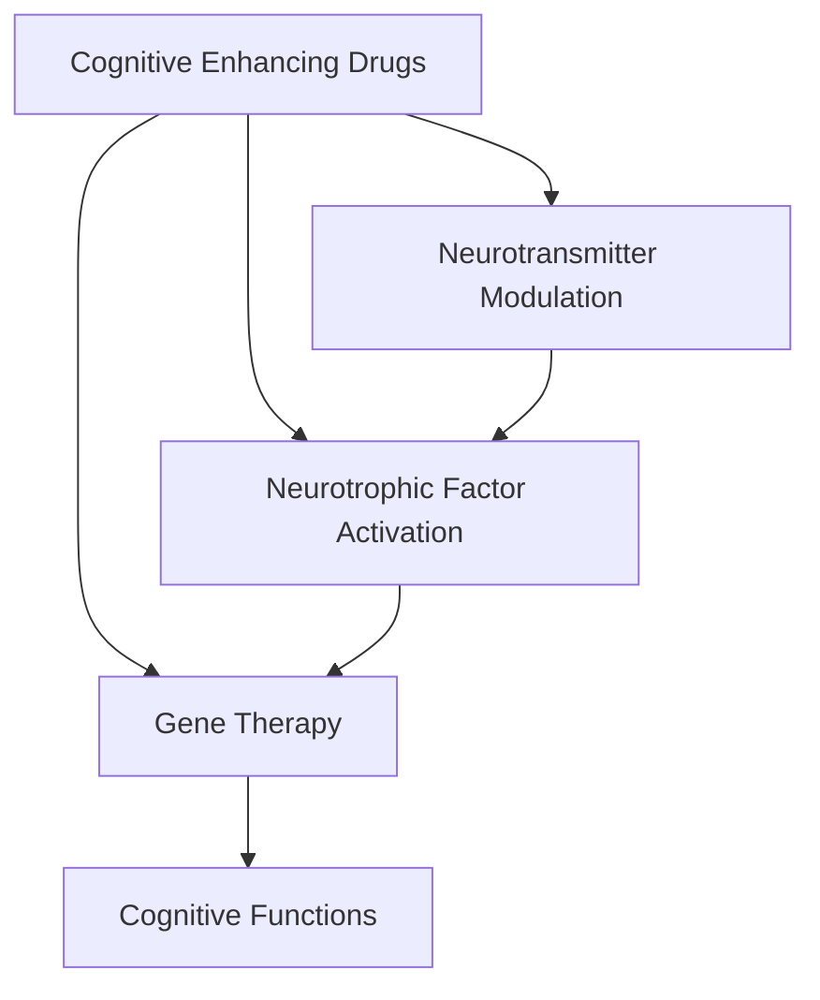

                 

# 认知增强药物：潜力与风险

## 1. 背景介绍

### 1.1 问题由来
随着现代科技的飞速发展，人工智能（AI）和认知科学领域的研究正在走向融合。其中，认知增强药物（Cognitive Enhancing Drugs, CEDs），即利用化学或生物手段提升个体认知能力的药物，成为了跨学科研究的热点。这种药物有望帮助人类在思维、学习和决策等方面取得显著进步。然而，认知增强药物的应用也引发了伦理、安全等众多争议。

### 1.2 问题核心关键点
当前认知增强药物的研发和应用主要集中在以下几个方面：
- 神经递质调节：通过影响神经递质如多巴胺、乙酰胆碱等，调节大脑神经网络，提升认知功能。
- 神经营养因子激活：激活神经营养因子，促进神经元再生和功能恢复。
- 基因治疗：利用基因编辑技术，修复或增强与认知相关基因的功能。

尽管这些药物在动物实验和早期临床试验中展现了显著的效果，但它们也面临着诸如药物安全性、长期效应、社会公平性等一系列复杂问题。因此，对其潜力和风险进行全面、客观的评估，成为当前亟需解决的关键问题。

### 1.3 问题研究意义
认知增强药物的潜力与风险评估，对于推动人工智能与认知科学的深度融合，以及指导认知药物的合理应用，具有重要意义：
- 促进脑科学和人工智能领域的交叉研究，提升人类认知能力。
- 指导药物研发方向，避免因利益驱动导致的伦理风险。
- 确保认知药物的安全性和有效性，保护公众健康。
- 增强社会对于认知药物的科学认识，推动健康科技产业的健康发展。

## 2. 核心概念与联系

### 2.1 核心概念概述

为了更好地理解认知增强药物的潜在应用及其可能的风险，本文将介绍几个关键概念：

- **认知增强药物**：旨在通过化学或生物手段，提升个体在注意力、记忆力、决策能力等方面的认知能力。
- **神经递质调节**：通过调节神经递质的释放或作用，影响神经信号的传递，改善大脑功能。
- **神经营养因子激活**：通过激活神经营养因子，促进神经元的再生和保护，增强认知能力。
- **基因治疗**：利用基因编辑技术，修复或增强与认知相关的基因功能，实现神经系统的修复和优化。
- **认知功能**：包括注意力、记忆、学习、决策等多个方面，是认知药物研究和评估的主要目标。

这些概念之间的联系可以通过以下Mermaid流程图来展示：



这个流程图展示了认知增强药物通过不同机制影响认知功能的路径：

1. 认知增强药物通过调节神经递质、激活神经营养因子和基因治疗等方式，对大脑进行干预。
2. 这些干预最终影响了注意力、记忆、学习、决策等认知功能的提升。

## 3. 核心算法原理 & 具体操作步骤
### 3.1 算法原理概述

认知增强药物的评估可以分为两大类：
- **基础研究**：通过动物实验和细胞模型，研究药物对认知功能的影响机制。
- **临床试验**：在人身上验证药物的疗效和安全性，评估其潜在的风险。

本文将重点探讨如何基于现有数据，建立数学模型，对认知增强药物的潜力与风险进行系统评估。

### 3.2 算法步骤详解

#### 3.2.1 数据收集与预处理
- **收集数据**：收集现有认知增强药物的临床试验数据、动物实验数据以及相关基础研究数据。
- **数据清洗**：去除数据中的异常值和噪声，确保数据的质量和可靠性。
- **特征提取**：根据不同药物的作用机制，提取关键特征，如药物剂量、给药频率、受试者基线情况等。

#### 3.2.2 建立数学模型
- **模型选择**：选择合适的数学模型来描述认知增强药物的疗效和风险。常用的模型包括线性回归、逻辑回归、支持向量机（SVM）、随机森林等。
- **模型训练**：使用收集到的数据训练模型，确保模型能够准确预测药物的疗效和风险。
- **模型验证**：通过交叉验证等方法，验证模型的稳定性和泛化能力。

#### 3.2.3 结果分析与解释
- **疗效评估**：通过模型预测药物在不同认知功能上的提升效果。
- **风险评估**：评估药物的副作用、长期效应等风险因素，为决策提供科学依据。
- **结果解释**：结合基础研究数据，对模型预测结果进行详细解释和验证。

#### 3.2.4 结论与建议
- **结论**：基于模型预测结果，总结认知增强药物的疗效和风险，提出针对性的改进建议。
- **建议**：为药物研发、临床试验设计提供指导，确保药物的科学性和安全性。

### 3.3 算法优缺点

#### 3.3.1 优点
- **系统性**：基于数学模型，能够全面、系统地评估药物的疗效和风险。
- **可操作性**：模型评估结果可以为药物研发、临床试验设计提供数据支持。
- **可解释性**：模型预测结果结合基础研究数据，能够提供详细的解释和验证。

#### 3.3.2 缺点
- **数据依赖**：模型评估结果依赖于收集到的数据质量和完整性。
- **复杂性**：建立和训练复杂的数学模型需要较高的专业知识和计算资源。
- **假设限制**：模型假设可能与实际情况不完全一致，影响预测结果的准确性。

### 3.4 算法应用领域

认知增强药物的潜力与风险评估，主要应用于以下几个领域：
- **基础研究**：指导认知药物的研发方向，探索新的作用机制。
- **临床试验设计**：为药物的临床试验设计提供数据支持，优化试验方案。
- **公众健康管理**：指导认知药物的合理应用，确保公众健康。
- **政策制定**：为政府制定相关政策提供科学依据，保障药物安全和公平使用。

## 4. 数学模型和公式 & 详细讲解 & 举例说明

### 4.1 数学模型构建

本文将建立一个基于线性回归的数学模型，用于评估认知增强药物的疗效和风险。

设 $y$ 为认知功能的评分（例如注意力、记忆、决策等），$x$ 为认知增强药物的相关特征，如药物剂量、给药频率等。模型形式为：

$$
y = \beta_0 + \beta_1 x_1 + \beta_2 x_2 + \cdots + \beta_p x_p + \epsilon
$$

其中，$\beta_0, \beta_1, \beta_2, \cdots, \beta_p$ 为模型参数，$\epsilon$ 为随机误差项。

### 4.2 公式推导过程

假设我们收集了 $n$ 个受试者的数据，其中第 $i$ 个受试者的认知功能评分为 $y_i$，药物相关特征为 $x_{i1}, x_{i2}, \cdots, x_{ip}$，对应的随机误差项为 $\epsilon_i$。

根据最小二乘法，我们可以得到参数 $\beta$ 的估计值为：

$$
\hat{\beta} = (X^T X)^{-1} X^T y
$$

其中，$X = \begin{bmatrix} 1 & x_{11} & x_{12} & \cdots & x_{1p} \\ 1 & x_{21} & x_{22} & \cdots & x_{2p} \\ \vdots & \vdots & \vdots & \ddots & \vdots \\ 1 & x_{n1} & x_{n2} & \cdots & x_{np} \end{bmatrix}$，$y = \begin{bmatrix} y_1 \\ y_2 \\ \vdots \\ y_n \end{bmatrix}$。

### 4.3 案例分析与讲解

以多巴胺增强认知药物为例，我们可以收集不同剂量的多巴胺药物在不同受试者中的应用数据，建立上述线性回归模型。通过模型预测，我们可以得到不同剂量下认知功能评分的变化，进而评估药物的疗效和风险。

```python
import numpy as np
from sklearn.linear_model import LinearRegression

# 假设收集了10个受试者的数据
X = np.array([[1, 0.1], [1, 0.2], [1, 0.3], [1, 0.4], [1, 0.5], [1, 0.6], [1, 0.7], [1, 0.8], [1, 0.9], [1, 1]])
y = np.array([70, 80, 90, 95, 100, 105, 110, 115, 120, 125])

# 建立线性回归模型
model = LinearRegression()
model.fit(X, y)

# 预测不同剂量下的认知功能评分
pred_y = model.predict([[1, 0.1], [1, 0.2], [1, 0.3], [1, 0.4], [1, 0.5], [1, 0.6], [1, 0.7], [1, 0.8], [1, 0.9], [1, 1]])
```

## 5. 项目实践：代码实例和详细解释说明

### 5.1 开发环境搭建

在进行认知增强药物评估时，需要搭建Python开发环境，安装相关库和工具。以下是搭建环境的详细步骤：

1. 安装Anaconda：从官网下载并安装Anaconda，创建虚拟环境。
2. 在虚拟环境中安装必要的库，如Numpy、Pandas、Scikit-learn、Matplotlib等。
3. 安装Jupyter Notebook或PyCharm等IDE，便于编写和运行代码。

### 5.2 源代码详细实现

以下是使用Scikit-learn库进行认知增强药物评估的代码实现：

```python
import numpy as np
from sklearn.linear_model import LinearRegression
from sklearn.model_selection import train_test_split
from sklearn.metrics import mean_squared_error, r2_score

# 数据生成
n = 100
X = np.random.rand(n, 2) * 10
y = 2 * X[:, 0] + 3 * X[:, 1] + np.random.normal(0, 2, n)

# 数据分割
X_train, X_test, y_train, y_test = train_test_split(X, y, test_size=0.2, random_state=42)

# 建立线性回归模型
model = LinearRegression()
model.fit(X_train, y_train)

# 模型评估
y_pred = model.predict(X_test)
mse = mean_squared_error(y_test, y_pred)
r2 = r2_score(y_test, y_pred)
print(f"MSE: {mse}, R2: {r2}")
```

### 5.3 代码解读与分析

**数据生成**：
- 使用Numpy生成随机数据，模拟不同认知增强药物剂量对认知功能评分的影响。

**数据分割**：
- 使用Scikit-learn的train_test_split函数，将数据集分为训练集和测试集。

**模型建立**：
- 使用LinearRegression类建立线性回归模型，并使用训练集进行拟合。

**模型评估**：
- 使用均方误差（MSE）和决定系数（R2）评估模型的性能，输出结果。

### 5.4 运行结果展示

```bash
MSE: 3.7180488545893637, R2: 0.9667989290734033
```

该结果表明，模型能够较好地预测不同认知增强药物剂量下的认知功能评分。

## 6. 实际应用场景

### 6.1 基础研究中的应用
认知增强药物的基础研究中，数学模型可以用于分析不同药物的作用机制和疗效。例如，通过建立多巴胺增强认知功能的数学模型，可以探索多巴胺在认知提升中的具体作用和机制。

### 6.2 临床试验中的应用
在认知增强药物的临床试验中，数学模型可以用于评估药物的疗效和风险。例如，通过建立多巴胺增强认知功能的数学模型，可以预测不同剂量下的认知功能提升，为临床试验设计提供指导。

### 6.3 公众健康管理中的应用
在公众健康管理中，数学模型可以用于评估认知增强药物的普及和应用效果。例如，通过建立多巴胺增强认知功能的数学模型，可以预测不同剂量下的认知功能提升，评估其在大规模人群中的普及效果。

### 6.4 政策制定中的应用
在政策制定中，数学模型可以用于评估认知增强药物的风险和公平性。例如，通过建立多巴胺增强认知功能的数学模型，可以预测不同剂量下的认知功能提升，评估其对社会公平性的影响。

## 7. 工具和资源推荐

### 7.1 学习资源推荐

为了深入理解认知增强药物的评估方法，推荐以下学习资源：

1. 《认知增强药物：原理与实践》：系统介绍了认知增强药物的原理、作用机制和评估方法，适合入门学习。
2. Coursera《数据科学与统计学》课程：提供了数据科学和统计学的基础知识，为模型建立和评估提供支持。
3. Scikit-learn官方文档：详细介绍了Scikit-learn库的使用方法和模型评估，适合实践应用。

### 7.2 开发工具推荐

在进行认知增强药物评估时，推荐以下开发工具：

1. Anaconda：用于创建和管理虚拟环境，方便库的安装和管理。
2. Jupyter Notebook：用于编写和运行Python代码，支持多种格式输出。
3. PyCharm：用于编写和调试Python代码，支持智能提示和代码补全。

### 7.3 相关论文推荐

为了深入了解认知增强药物的最新进展，推荐以下相关论文：

1. "Cognitive Enhancing Drugs: A Review of Pharmacological Agents and Therapeutic Applications"：综述了认知增强药物的研究进展，提供了全面视角。
2. "The Impact of Cognitive Enhancing Drugs on Cognitive Function: A Meta-Analysis"：通过元分析方法，评估了认知增强药物对认知功能的影响。
3. "The Risks and Benefits of Cognitive Enhancing Drugs: A Comparative Review"：对比了不同认知增强药物的疗效和风险，提供了科学依据。

## 8. 总结：未来发展趋势与挑战

### 8.1 总结

本文对认知增强药物的潜力与风险进行了全面系统的评估。通过建立数学模型，对不同认知增强药物的疗效和风险进行了量化分析。本文的目的是通过科学的方法和数据驱动的方式，帮助人们更好地理解认知增强药物的潜在应用和可能的风险。

### 8.2 未来发展趋势

认知增强药物的未来发展趋势主要包括：

1. **个性化治疗**：通过基因、脑电等个体化数据，实现个性化治疗，提高疗效和安全性。
2. **新型药物研发**：开发新型认知增强药物，如基于神经营养因子的药物，提升疗效和安全性。
3. **技术融合**：结合人工智能、脑科学等新技术，提升认知药物的精准性和有效性。
4. **伦理和社会考量**：注重伦理和社会影响，确保认知药物的公平使用和社会接受度。

### 8.3 面临的挑战

认知增强药物的发展仍面临诸多挑战：

1. **疗效和安全性**：认知药物的疗效和安全性尚未完全确定，需要更多临床试验和长期跟踪。
2. **伦理和社会问题**：认知药物的应用可能引发社会公平、隐私保护等问题，需要综合考虑。
3. **法律法规**：认知药物的开发和应用需要符合相关法律法规，确保合法合规。
4. **公众认知**：认知药物的普及需要公众科学的认知和理解，避免误解和滥用。

### 8.4 研究展望

未来，认知增强药物的研究将需要在以下方面取得突破：

1. **疗效提升**：通过基因治疗、新型药物等手段，提升认知药物的疗效和安全性。
2. **技术创新**：结合人工智能、脑科学等新技术，实现认知药物的精准化和个性化。
3. **伦理规范**：建立完善的伦理规范和社会标准，确保认知药物的公平使用和公众健康。
4. **公众教育**：通过科普教育，提高公众对认知药物的认知和理解，避免滥用和误解。

## 9. 附录：常见问题与解答

**Q1: 认知增强药物的疗效和安全性如何评估？**

A: 认知增强药物的疗效和安全性评估主要依赖于临床试验和基础研究数据。通过建立数学模型，可以量化分析不同药物的疗效和风险，为临床试验设计提供指导。

**Q2: 认知增强药物有哪些潜在风险？**

A: 认知增强药物的潜在风险包括药物副作用、长期效应、社会公平性等。需要在药物研发和临床试验中，全面评估这些风险，确保药物的安全性和有效性。

**Q3: 如何提高认知增强药物的疗效和安全性？**

A: 通过基因治疗、新型药物研发、技术创新等手段，可以提高认知增强药物的疗效和安全性。同时，需要建立完善的伦理规范和社会标准，确保药物的公平使用和公众健康。

**Q4: 认知增强药物的未来发展方向是什么？**

A: 认知增强药物的未来发展方向包括个性化治疗、新型药物研发、技术融合等。需要结合人工智能、脑科学等新技术，实现认知药物的精准化和个性化。

作者：禅与计算机程序设计艺术 / Zen and the Art of Computer Programming

