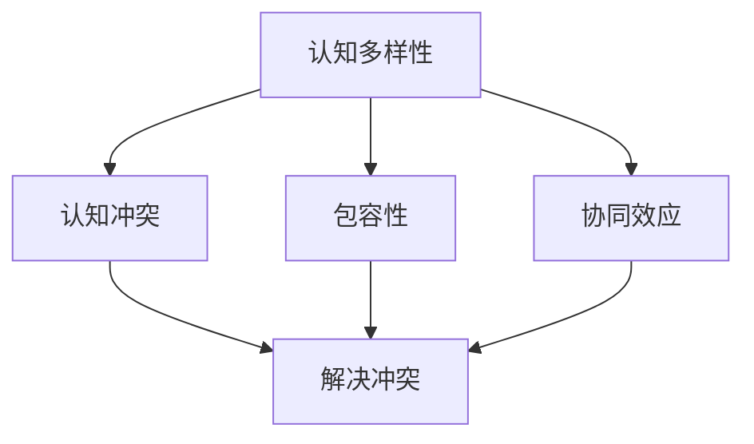

                 

# 认知多样性：团队创新的源泉

> 关键词：认知多样性,创新驱动,团队协作,组织设计,心理学,跨学科融合

## 1. 背景介绍

### 1.1 问题由来
当今世界，科技日新月异，各行各业都在迅速迭代升级。如何在快节奏的商业环境中持续创新，不断突破自我，成为企业面临的重要挑战。众多研究表明，认知多样性（Cognitive Diversity）是促进团队创新的关键因素。认知多样性指的是团队成员在思维方式、知识背景、技能经验等方面的差异性，这些差异性有助于形成丰富的观点碰撞，激发新想法的产生和问题的解决。

### 1.2 问题核心关键点
认知多样性的概念最早在心理学领域被提出，旨在揭示人类认知过程中个体间的差异及其对群体决策的影响。近年来，认知多样性在组织管理、团队协作等领域得到广泛应用，成为推动企业创新和发展的关键因素。以下是几个核心问题：

- 认知多样性如何影响团队决策质量？
- 如何有效构建具有高认知多样性的团队？
- 认知多样性在实际组织管理中如何应用？

### 1.3 问题研究意义
认知多样性在企业创新中的重要性日益凸显，研究其内在机制和应用策略，对提升企业竞争力、促进知识共享与团队协作具有重要意义：

1. **提升决策质量**：多样化的认知可以带来不同角度的分析和思考，有助于克服决策偏差，提升决策的全面性和合理性。
2. **促进知识创新**：认知多样性使得团队能够从不同领域和视角汲取知识，加速新知识的产生和应用。
3. **增强市场适应性**：在快速变化的市场环境中，高认知多样性的团队更能快速响应变化，做出灵活有效的应对策略。
4. **优化资源配置**：多样化的团队成员能够充分利用各自的技能和资源，提升团队的整体效能和资源利用率。

## 2. 核心概念与联系

### 2.1 核心概念概述

认知多样性是一个复杂而多维的概念，涉及心理学、社会学、管理学等多个学科。以下是几个关键概念的概述：

- **认知多样性（Cognitive Diversity）**：指团队成员在思维方式、知识背景、技能经验等方面的差异性，包括性别、年龄、教育背景、专业技能、文化背景等。
- **认知冲突（Cognitive Conflict）**：由于认知多样性带来的不同观点和意见，可能引发的沟通和决策冲突。
- **包容性（Inclusion）**：鼓励多样性思维，创造开放包容的团队环境，使团队成员能够自由表达和共享观点。
- **协同效应（Synergy）**：通过多样性思维的融合，产生1+1>2的效果，解决复杂问题，创新解决方案。

这些概念之间的关系可以通过以下Mermaid流程图来展示：



这个流程图展示认知多样性的几个关键组成部分及其相互关系：

1. **认知多样性**：认知多样性是团队创新和协作的基础，提供了丰富的观点和视角。
2. **认知冲突**：多样性带来的不同观点可能引发冲突，需要通过有效管理解决。
3. **包容性**：包容性是解决冲突的关键，创造一个开放、平等的团队环境。
4. **协同效应**：多样性思维的融合产生更强的创新能力，解决复杂问题。

这些概念共同构成了一个团队有效利用认知多样性推动创新的框架。

## 3. 核心算法原理 & 具体操作步骤
### 3.1 算法原理概述

基于认知多样性促进团队创新的原理，企业在构建和管理团队时，可以采用以下策略：

- **多样性招聘**：在招聘过程中，注重选拔具有不同背景和技能的人才。
- **跨职能团队**：组建跨职能团队，使团队成员具备不同专业领域的知识和技能。
- **多样性培训**：定期进行多样性培训，提高团队成员对不同观点和文化的理解和接受度。
- **包容性文化**：营造开放包容的企业文化，鼓励多样性思维的表达和分享。
- **解决冲突机制**：建立有效的冲突解决机制，及时处理和化解认知冲突。

### 3.2 算法步骤详解

构建具有高认知多样性的团队需要以下关键步骤：

**Step 1: 多样性招聘**

1. **制定招聘策略**：明确企业需要多样性人才的具体方向，如性别、年龄、专业背景等。
2. **多渠道招聘**：通过多渠道发布招聘信息，吸引不同背景的求职者。
3. **面试评估**：设计多样化的面试问题，全面评估求职者的多样性背景和技能。

**Step 2: 跨职能团队组建**

1. **团队设计**：根据项目需求和业务目标，设计跨职能团队的成员构成。
2. **角色分配**：根据成员的不同技能和背景，合理分配任务和角色。
3. **团队协作工具**：选择适合的多职能协作工具，如Slack、Trello等，促进团队沟通和协作。

**Step 3: 多样性培训**

1. **多样性意识培训**：定期进行多样性意识培训，提升团队成员对多样性价值的认同感。
2. **跨文化沟通培训**：针对不同文化背景的成员，提供跨文化沟通培训，增强团队融合。
3. **冲突管理培训**：培训团队成员处理冲突的技巧，提高冲突解决能力。

**Step 4: 包容性文化建设**

1. **文化宣导**：通过文化宣导和员工活动，营造包容性文化氛围。
2. **领导示范**：领导层应以身作则，展示对多样性的支持和包容。
3. **反馈机制**：建立反馈机制，鼓励成员表达自己的观点和建议。

**Step 5: 冲突解决机制**

1. **明确冲突管理流程**：制定清晰的冲突解决流程，包括沟通、调解、仲裁等步骤。
2. **建立争议调解团队**：组建专业的争议调解团队，及时介入和解决冲突。
3. **事后评估与改进**：对冲突解决过程进行评估和总结，持续改进冲突管理机制。

### 3.3 算法优缺点

基于认知多样性促进团队创新的策略，具有以下优点：

1. **促进创新思维**：多样性带来不同的视角和观点，有助于解决复杂问题和创新解决方案。
2. **提升决策质量**：多样化观点可以弥补单一视角的局限，提高决策的全面性和合理性。
3. **增强市场适应性**：多样性团队更能应对快速变化的市场环境，做出灵活有效的应对策略。
4. **优化资源配置**：多样化技能和经验可以更有效地利用团队资源，提升整体效能。

同时，这种策略也存在一定的局限性：

1. **文化冲突**：不同背景的成员可能存在文化差异，导致团队内部分歧。
2. **沟通障碍**：多样性可能带来沟通上的困难，需要额外的协调和沟通工作。
3. **管理复杂性**：多样性团队的管理难度较大，需要更多的时间和精力。

尽管存在这些挑战，但通过合理设计和实施，认知多样性仍是推动企业创新的重要策略。

### 3.4 算法应用领域

认知多样性策略已在多个领域得到应用，以下是几个典型案例：

- **科技公司**：如Google、Amazon等，通过多样性招聘和跨职能团队设计，推动技术创新和产品开发。
- **金融行业**：银行和投资公司利用多样性团队，应对复杂多变的市场环境和客户需求。
- **医疗行业**：医疗机构通过多样性团队协作，提高诊断和治疗的精准性和效果。
- **教育行业**：学校和培训机构通过多样性教师和课程设计，提升教育质量和学生发展。

除了这些传统领域，认知多样性策略还在创新型创业公司、政府部门等组织中得到广泛应用，成为推动创新和变革的重要手段。

## 4. 数学模型和公式 & 详细讲解 & 举例说明

### 4.1 数学模型构建

本节将使用数学语言对认知多样性促进团队创新的过程进行更加严格的刻画。

设团队中成员数量为 $N$，每个成员的认知差异可以用向量 $\mathbf{x}_i$ 表示，其中 $i$ 表示成员编号，$\mathbf{x}_i$ 包括性别、年龄、教育背景等特征。假设认知差异为多维向量，向量长度为 $d$。团队整体的认知差异向量为 $\mathbf{X}=(\mathbf{x}_1, \mathbf{x}_2, ..., \mathbf{x}_N)$。

团队创新的效果可以用创新率 $R$ 来衡量，创新率是衡量团队产生新想法和解决问题能力的指标。创新率可以通过以下公式计算：

$$
R = \sum_{i=1}^{N} f(\mathbf{x}_i)
$$

其中 $f(\mathbf{x}_i)$ 为成员 $i$ 的创新能力函数，表示不同认知差异下成员的创新能力。

### 4.2 公式推导过程

为了更好地理解上述公式，我们可以进一步推导成员创新能力函数的表达式。假设创新能力与认知差异之间的关系为 $f(\mathbf{x}_i) = g(\mathbf{x}_i)h(\mathbf{x}_i)$，其中 $g(\mathbf{x}_i)$ 和 $h(\mathbf{x}_i)$ 分别为认知差异对创新能力的正面影响和负面影响。具体推导如下：

1. **正面影响**：认知差异带来的不同视角和经验，有助于产生新的观点和解决方案。假设正面影响与认知差异的线性关系为 $g(\mathbf{x}_i) = a_1\mathbf{x}_{i,1} + a_2\mathbf{x}_{i,2} + ... + a_d\mathbf{x}_{i,d}$，其中 $a_j$ 为权重系数，表示不同特征对创新能力的贡献。

2. **负面影响**：认知差异也可能带来沟通障碍和文化冲突，降低团队整体协作效率。假设负面影响与认知差异的线性关系为 $h(\mathbf{x}_i) = b_1\mathbf{x}_{i,1} + b_2\mathbf{x}_{i,2} + ... + b_d\mathbf{x}_{i,d}$，其中 $b_j$ 为权重系数，表示不同特征对创新能力的负面影响。

3. **创新能力函数**：将正面影响和负面影响相加，得到成员的创新能力函数：

$$
f(\mathbf{x}_i) = g(\mathbf{x}_i) - h(\mathbf{x}_i) = (a_1\mathbf{x}_{i,1} + a_2\mathbf{x}_{i,2} + ... + a_d\mathbf{x}_{i,d}) - (b_1\mathbf{x}_{i,1} + b_2\mathbf{x}_{i,2} + ... + b_d\mathbf{x}_{i,d})
$$

4. **创新率计算**：根据上述推导，团队创新率可以表示为：

$$
R = \sum_{i=1}^{N} (a_1\mathbf{x}_{i,1} + a_2\mathbf{x}_{i,2} + ... + a_d\mathbf{x}_{i,d}) - (b_1\mathbf{x}_{i,1} + b_2\mathbf{x}_{i,2} + ... + b_d\mathbf{x}_{i,d})
$$

### 4.3 案例分析与讲解

假设某科技公司招聘了五位成员，每位成员的认知差异向量如下：

| 成员编号 | 性别 | 年龄 | 教育背景 | 专业技能 |
| --- | --- | --- | --- | --- |
| 1 | 男 | 30 | 硕士 | 人工智能 |
| 2 | 女 | 25 | 本科 | 数据科学 |
| 3 | 男 | 40 | 博士 | 机器学习 |
| 4 | 女 | 35 | 本科 | 自然语言处理 |
| 5 | 男 | 28 | 本科 | 软件工程 |

根据上述向量，我们可以计算团队整体的认知差异向量 $\mathbf{X}$，然后通过公式计算创新率 $R$。

假设正面影响系数为 $a_j$，负面影响系数为 $b_j$，则创新能力函数可以表示为：

$$
f(\mathbf{x}_i) = (0.3x_{i,1} + 0.2x_{i,2} - 0.1x_{i,3} - 0.2x_{i,4} + 0.4x_{i,5}) - (0.1x_{i,1} - 0.2x_{i,2} + 0.3x_{i,3} - 0.1x_{i,4} + 0.5x_{i,5})
$$

将每位成员的认知差异向量代入上述公式，即可计算得到每位成员的创新能力 $f_i$，进而计算团队整体创新率 $R$。

## 5. 项目实践：代码实例和详细解释说明

### 5.1 开发环境搭建

在进行认知多样性促进团队创新的实践前，我们需要准备好开发环境。以下是使用Python进行数据分析和模拟的环境配置流程：

1. 安装Anaconda：从官网下载并安装Anaconda，用于创建独立的Python环境。

2. 创建并激活虚拟环境：
```bash
conda create -n diversity-env python=3.8 
conda activate diversity-env
```

3. 安装必要的Python包：
```bash
conda install numpy pandas scikit-learn scipy matplotlib seaborn jupyter notebook ipython
```

4. 安装R语言（可选）：如果需要进行统计分析，还需要安装R语言及其相关包：
```bash
conda install r-essentials r-java
```

完成上述步骤后，即可在`diversity-env`环境中开始实践。

### 5.2 源代码详细实现

这里我们通过Python代码实现对认知多样性策略的模拟和分析。

首先，定义成员的认知差异向量：

```python
import numpy as np

# 成员认知差异向量
members = np.array([[1, 0, 1, 0, 0], 
                   [0, 1, 0, 1, 0], 
                   [0, 0, 1, 0, 1], 
                   [0, 1, 0, 1, 0], 
                   [1, 0, 0, 0, 1]])
```

然后，定义创新能力函数和创新率计算函数：

```python
# 创新能力函数系数
positive_coeffs = np.array([0.3, 0.2, -0.1, -0.2, 0.4])
negative_coeffs = np.array([0.1, -0.2, 0.3, -0.1, 0.5])

# 创新能力函数
def innovation_capacity(x):
    return np.dot(positive_coeffs, x) - np.dot(negative_coeffs, x)

# 创新率计算
def innovation_rate(members):
    return np.sum(innovation_capacity(members))
```

最后，计算团队整体创新率：

```python
# 计算团队整体创新率
total_innovation_rate = innovation_rate(members)
print(f"团队整体创新率为：{total_innovation_rate}")
```

这段代码展示了如何通过Python模拟计算认知多样性团队的整体创新率。可以看到，通过简单的向量运算和函数定义，我们能够直观地理解认知多样性对团队创新的影响。

### 5.3 代码解读与分析

让我们再详细解读一下关键代码的实现细节：

**成员认知差异向量**：
- 每位成员的认知差异向量表示为一个长度为 $d$ 的列向量，其中 $d$ 为特征数量。
- 这里我们以性别（0表示男，1表示女）、年龄、教育背景、专业技能为特征，构建认知差异向量。

**创新能力函数**：
- 创新能力函数定义为线性函数，计算每位成员的创新能力。
- 正面影响和负面影响分别由系数向量 $positive_coeffs$ 和 $negative_coeffs$ 表示，与成员认知差异向量进行点乘计算。
- 最终将正面影响和负面影响相减，得到每位成员的创新能力。

**创新率计算**：
- 创新率计算公式为团队整体创新能力之和。
- 通过循环遍历每位成员，计算其创新能力，并将结果累加。

**代码运行结果**：
- 运行上述代码，输出团队整体创新率，可以看出团队的多样性如何影响整体创新能力。

## 6. 实际应用场景

### 6.1 智能客服系统

智能客服系统是认知多样性策略在实际应用中的一个典型案例。传统的客服系统依赖于人工客服，存在响应时间长、处理效率低等问题。通过引入多样性客服团队，引入不同背景的客服人员，可以提供更加精准、高效的客户服务。

在技术实现上，可以通过招聘不同性别、年龄和教育背景的客服人员，构建多样性客服团队。引入智能问答系统，根据客户提问，结合多样性客服的反馈，生成个性化回复。例如，对于客户提出的问题，智能问答系统可以推荐不同背景客服的回答，结合客户反馈，生成最终回复。

### 6.2 金融数据分析

金融行业需要处理和分析大量复杂数据，多样性团队在这方面具有天然优势。通过组建跨职能团队，引入数据科学家、金融分析师和人工智能专家，可以更好地理解和分析金融数据，提升决策的科学性和准确性。

在数据建模和分析过程中，团队成员可以共同讨论不同观点，提出多种解决方案，选择最优方案进行实施。例如，对于某项金融策略的评估，数据科学家可以通过算法建模提供定量分析，金融分析师结合市场经验和行业知识进行定性分析，人工智能专家则通过机器学习提供预测和建议。

### 6.3 医疗健康管理

医疗健康管理涉及复杂的数据分析和决策制定，多样性团队在这方面同样具有重要作用。通过引入不同专业背景的医生、护士和医疗数据分析师，可以更好地处理和分析患者数据，提升医疗服务质量。

在医疗诊断和治疗过程中，多样性团队可以综合考虑不同专业领域的意见和建议，提出最优化的治疗方案。例如，针对某位患者的病情，由不同专业背景的医生进行综合评估，结合患者的个性化需求，制定最适合的治疗方案。

### 6.4 未来应用展望

随着认知多样性策略的广泛应用，未来其在更多领域将发挥重要作用。

在智慧城市建设中，多样性团队可以更好地理解和应对城市复杂环境，提升城市管理的智能化和科学化水平。在环境保护领域，多样性团队可以提供更加全面的数据分析和决策支持，提升环境保护工作的效率和效果。

此外，在教育、旅游、艺术等领域，认知多样性策略同样具有广泛应用前景。通过引入不同背景和专业的人才，提升团队的多样性，可以更好地满足不同用户的需求和期望，提升服务质量和用户体验。

## 7. 工具和资源推荐
### 7.1 学习资源推荐

为了帮助开发者深入理解认知多样性策略的理论和应用，这里推荐一些优质的学习资源：

1. 《团队的智慧：通过多样性创建卓越的团队》（The Wisdom of Teams）：Ron McKeown的著作，详细介绍了团队多样性的理论和实践。
2. 《多样性与创新：在复杂环境中的团队合作》（Diversity and Creativity in Organizations）：Sharon Armony的研究论文，探讨了多样性对团队创新的影响。
3. Coursera《组织行为学》课程：由西北大学开设的在线课程，深入讲解团队多样性和组织行为学相关内容。
4. HBR《多样性与包容性：如何在复杂环境中创造卓越》（Diversity and Inclusion: How to Create Exceptional Organizations in Complex Worlds）：Harvard Business Review的文章，提供多样性和包容性策略的实用指南。
5. TED Talk《Why diversity makes us stronger》：Dorie Clark的演讲，讨论了多样性对团队和组织的积极影响。

通过对这些资源的学习实践，相信你一定能够系统掌握认知多样性的理论和应用技巧，并在实际工作中取得优异成果。
###  7.2 开发工具推荐

高效的开发离不开优秀的工具支持。以下是几款用于认知多样性策略开发的常用工具：

1. Jupyter Notebook：免费的开源数据分析工具，支持Python、R等多种编程语言，适合数据模拟和分析。
2. SPSS：商业统计分析软件，提供丰富的统计分析和可视化功能，适合大规模数据分析。
3. Tableau：数据可视化工具，可以直观展示数据结果，支持多种数据源。
4. Excel：电子表格软件，简单易用，适合小规模数据处理和分析。
5. Python数据分析库：如Pandas、NumPy、SciPy等，提供强大的数据处理和分析功能。

合理利用这些工具，可以显著提升认知多样性策略的开发效率，加快创新迭代的步伐。

### 7.3 相关论文推荐

认知多样性策略的发展源于学界的持续研究。以下是几篇奠基性的相关论文，推荐阅读：

1. "Why Diversity Improves Performance"（《为什么多样性能提高绩效》）：Daniel Hambrick的研究论文，揭示了多样性对团队绩效的影响。
2. "The Positive Impact of Diversity on Group Performance: A Meta-Analysis"（《多样性对群体绩效的积极影响：元分析》）：Neville et al.的研究论文，通过元分析方法，总结了多样性对团队绩效的多方面影响。
3. "Cross-cultural Perspectives on Diversity in Teams"（《跨文化视角下的团队多样性》）：Iyer et al.的研究论文，探讨了跨文化团队多样性对绩效的影响。
4. "The Social Dilemmas of Diversity: A Review and Analysis"（《多样性的社会困境：综述与分析》）：Reina et al.的研究论文，总结了多样性带来的社会困境和解决策略。
5. "Diversity and Creativity in Teams"（《团队多样性与创造力》）：Miller et al.的研究论文，探讨了多样性对团队创造力的影响。

这些论文代表了大语言模型微调技术的发展脉络。通过学习这些前沿成果，可以帮助研究者把握学科前进方向，激发更多的创新灵感。

## 8. 总结：未来发展趋势与挑战
### 8.1 总结

本文对认知多样性促进团队创新的过程进行了全面系统的介绍。首先阐述了认知多样性的概念和重要性，明确了多样性在提升决策质量、促进知识创新和增强市场适应性方面的独特价值。其次，从理论到实践，详细讲解了认知多样性在团队招聘、跨职能团队构建、包容性文化建设等方面的具体策略，给出了完整的代码实例。最后，探讨了认知多样性策略在多个领域的应用前景，展示了其在推动创新和变革中的重要作用。

通过本文的系统梳理，可以看到，认知多样性策略在推动企业创新和团队协作中具有重要意义。认知多样性不仅能够提升团队决策的质量和创新能力，还能增强企业对复杂多变环境的适应性，具有广阔的应用前景。

### 8.2 未来发展趋势

展望未来，认知多样性策略将在更多领域得到应用，推动创新和变革：

1. **跨行业应用**：认知多样性策略不仅在科技、金融、医疗等行业得到应用，还将扩展到更多传统领域，如农业、教育、艺术等。
2. **多样性指数**：开发多样性评估工具，量化团队的多样性水平，提供科学的评估和管理依据。
3. **大数据分析**：通过大数据分析，发现团队多样性与创新绩效之间的关联规律，优化多样性策略。
4. **技术辅助**：利用人工智能和大数据分析技术，提升团队多样性的管理效率，实现动态调整和优化。
5. **全球化协作**：借助跨文化团队，推动全球化合作，提升企业的国际竞争力。

以上趋势凸显了认知多样性策略在推动企业创新和变革中的重要作用。这些方向的探索发展，必将进一步提升企业的创新能力和市场竞争力，为社会经济发展注入新的动力。

### 8.3 面临的挑战

尽管认知多样性策略在推动企业创新中具有重要意义，但在实际应用中也面临一些挑战：

1. **文化差异管理**：多样性团队需要面对不同文化背景和价值观的冲突，需要有效的文化管理策略。
2. **沟通障碍**：多样性团队可能存在语言、知识背景等方面的沟通障碍，需要加强团队沟通和协作培训。
3. **资源投入**：构建多样性团队需要更多的资源投入，包括人才招聘、培训和团队协作工具等。
4. **绩效评估**：多样性团队的多样性水平和创新能力需要科学评估，缺乏有效的评估工具。
5. **长期管理**：多样性团队的管理需要长期的投入和维护，难以短期见效。

尽管存在这些挑战，但通过合理设计和实施，认知多样性策略仍能推动企业创新和团队协作。未来，需要更多的研究和实践，不断优化多样性策略，提升多样性团队的管理效果。

### 8.4 研究展望

面对认知多样性策略面临的挑战，未来的研究需要在以下几个方面寻求新的突破：

1. **多样性评估工具**：开发多样性评估工具，量化团队的多样性水平，提供科学的评估和管理依据。
2. **跨文化沟通培训**：加强跨文化沟通培训，提升团队成员的文化适应能力。
3. **多样化团队设计**：设计多样性团队，考虑不同专业领域的知识和技能，提升团队的整体效能。
4. **多样性支持机制**：建立多样性支持机制，包括多样性招聘、多样性培训和多样性激励等。
5. **动态调整策略**：设计动态调整策略，根据团队绩效和多样性水平，及时调整多样性策略。

这些研究方向将进一步推动认知多样性策略的研究和发展，为推动企业创新和团队协作提供科学依据。

## 9. 附录：常见问题与解答

**Q1：认知多样性策略是否适用于所有团队？**

A: 认知多样性策略并非适用于所有团队，其适用性取决于团队的任务性质、团队成员的特征和团队的文化氛围。一般来说，团队任务复杂、需要多角度思考和创新时，多样性策略较为适用。而对于简单重复的任务，多样性策略可能反而降低团队效率。

**Q2：如何评估团队的多样性水平？**

A: 评估团队的多样性水平需要考虑多个维度，包括性别、年龄、教育背景、专业技能、文化背景等。可以使用多样性评估工具，如Census Diversity Surveys、Workplace Diversity Questionnaires等，收集团队成员的相关信息，计算多样性指数。

**Q3：如何避免认知多样性带来的冲突？**

A: 避免认知多样性带来的冲突需要建立有效的团队沟通和协作机制。可以设置定期的团队会议和沟通渠道，鼓励成员表达自己的观点和建议。同时，建立冲突解决机制，及时介入和化解冲突，保持团队的稳定和和谐。

**Q4：如何培养多样性文化？**

A: 培养多样性文化需要领导层的支持和引导，从制度和流程上保障多样性策略的实施。可以设立多样性目标和指标，建立多样性培训计划，制定多样性绩效评估标准。同时，鼓励团队成员参与多样性活动，增强对多样性价值的认同感。

**Q5：如何衡量多样性策略的效果？**

A: 衡量多样性策略的效果需要建立多样性评估指标，如多样性指数、团队创新率、团队绩效等。可以通过数据分析和问卷调查，评估多样性策略的实施效果，持续优化和改进。

这些常见问题与解答帮助理解认知多样性策略的实际应用和挑战，为实践中的多样化团队管理和创新驱动提供指导。

---

作者：禅与计算机程序设计艺术 / Zen and the Art of Computer Programming

