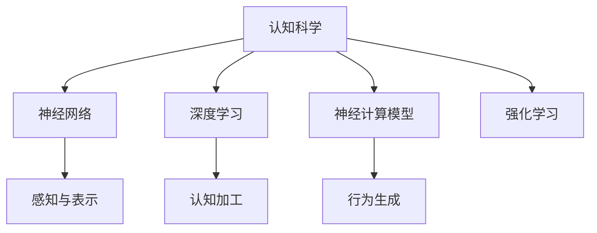

                 

# 认知科学与人工智能：模拟人类思维

## 1. 背景介绍

### 1.1 问题由来
人类认知科学是一个高度复杂和广大的领域，涵盖了心理、神经、语言、感知等多个维度，研究人类如何获取信息、处理信息和产生行为。近年来，随着人工智能(AI)技术的飞速发展，科学家们开始尝试将认知科学理论应用到人工智能系统，希望构建能够模拟人类思维的智能模型。

该领域的研究具有重要意义：
1. **增进理解**：揭示人类思维的机制，从而更好地理解和解决复杂的认知问题。
2. **提升性能**：通过模拟人类思维过程，构建更加高效和智能的人工智能系统。
3. **跨学科融合**：促进认知科学与计算机科学的深度融合，推动更多交叉学科的发展。
4. **应用拓展**：将研究成果应用于诸如医疗、教育、法律等众多领域，提高社会生产力。

### 1.2 问题核心关键点
模拟人类思维的核心关键点包括：
1. **感知与表示**：如何准确地感知外界环境信息，并转化为系统可以处理的形式。
2. **认知加工**：如何模拟人类大脑的认知加工过程，包括记忆、推理、决策等。
3. **行为生成**：如何将认知加工结果转化为具体的行为输出，实现智能系统的自主决策。

## 2. 核心概念与联系

### 2.1 核心概念概述

为更好地理解认知科学与人工智能的模拟过程，本节将介绍几个密切相关的核心概念：

- **认知科学**：研究人类认知过程，包括感知、记忆、学习、思维等。
- **神经网络**：模拟人类神经系统的计算模型，通过层层神经元之间的连接和信息传递，进行复杂的计算和决策。
- **深度学习**：一种基于多层神经网络的学习方法，通过大量数据训练，自动学习到特征和模式。
- **神经计算模型**：基于神经网络理论构建的计算模型，包括神经元、连接权重、激活函数等。
- **强化学习**：通过与环境的互动，优化模型的行为策略，实现自主学习和适应。

这些核心概念之间的逻辑关系可以通过以下Mermaid流程图来展示：



这个流程图展示了几大核心概念的相互关系：

1. 认知科学是基础，理解人类思维的机制。
2. 神经网络和深度学习是实现的工具，用于模拟人类大脑的计算过程。
3. 神经计算模型是具体实现形式，描述神经元和连接的计算方式。
4. 强化学习是学习策略，使系统能够自主适应和优化行为。
5. 感知与表示、认知加工、行为生成是主要环节，共同构成智能系统的运行流程。

## 3. 核心算法原理 & 具体操作步骤
### 3.1 算法原理概述

模拟人类思维的算法原理主要基于认知神经科学和计算神经科学的研究成果，通过构建神经网络模型来模拟人类大脑的计算过程。在实际应用中，一般分为以下几个关键步骤：

1. **感知与表示**：通过视觉、听觉、触觉等感官输入，将外界信息转化为神经网络可以处理的形式。
2. **认知加工**：利用深度学习模型进行信息处理，包括特征提取、模式识别、记忆存储等。
3. **行为生成**：根据认知加工的结果，生成具体的行为输出，如决策、语言生成等。

### 3.2 算法步骤详解

#### 步骤1：感知与表示
将外界信息转化为神经网络可处理的信号形式，通常通过传感器和信号处理实现。以下是一个简单的例子，使用摄像头捕捉图像，并将其转换为神经网络的输入。

1. **图像采集**：使用摄像头捕捉实时图像。
2. **预处理**：对图像进行灰度化、归一化等预处理，减少噪声。
3. **特征提取**：使用CNN模型提取图像的特征，转化为神经网络的输入。

#### 步骤2：认知加工
使用深度学习模型进行信息处理和认知加工。以下是一个简单的例子，使用卷积神经网络(CNN)进行图像分类。

1. **构建模型**：搭建多层卷积神经网络，包括卷积层、池化层、全连接层等。
2. **数据训练**：使用标注数据训练模型，优化模型参数，提高分类准确率。
3. **特征映射**：通过模型提取图像的特征表示，用于后续认知加工。

#### 步骤3：行为生成
根据认知加工的结果，生成具体的行为输出。以下是一个简单的例子，使用循环神经网络(RNN)进行文本生成。

1. **构建模型**：搭建循环神经网络，包括编码器、解码器等。
2. **训练模型**：使用文本数据训练模型，优化模型参数，提高生成效果。
3. **文本生成**：输入前缀文本，模型生成后续文本，实现自然语言生成。

### 3.3 算法优缺点

模拟人类思维的算法优点包括：
1. **高效性**：利用神经网络和深度学习模型的高效计算能力，可以处理大量数据。
2. **灵活性**：能够适应各种不同的感知和认知任务，灵活调整模型结构。
3. **可扩展性**：可以构建多层次、多模态的神经网络模型，支持复杂的认知任务。

同时，该算法也存在一些缺点：
1. **复杂性**：神经网络模型结构和参数复杂，训练和优化难度较大。
2. **黑箱性**：深度学习模型通常是黑箱系统，难以解释内部工作机制。
3. **数据依赖**：需要大量标注数据进行训练，获取数据成本高。
4. **资源消耗**：高计算量和内存消耗，对硬件要求较高。

### 3.4 算法应用领域

模拟人类思维的算法主要应用于以下几个领域：

- **计算机视觉**：通过神经网络模型处理图像和视频数据，实现物体识别、场景理解、目标跟踪等。
- **自然语言处理**：利用深度学习模型处理文本数据，实现语言理解、自动翻译、文本生成等。
- **智能机器人**：结合视觉、听觉、触觉等多模态信息，实现自主导航、物体抓取、人机交互等。
- **医疗诊断**：使用神经网络模型分析医疗影像、文本等数据，辅助医生进行诊断和治疗。
- **游戏智能**：构建智能游戏角色，模拟人类游戏行为，实现自动决策和策略优化。

## 4. 数学模型和公式 & 详细讲解 & 举例说明

### 4.1 数学模型构建

在模拟人类思维的过程中，我们通常使用神经网络模型进行表示和处理。这里以一个简单的卷积神经网络(CNN)为例，展示其数学模型构建过程。

假设输入数据为二维图像 $X \in \mathbb{R}^{H\times W \times C}$，其中 $H$ 和 $W$ 为图像高度和宽度，$C$ 为通道数。卷积层通过以下公式对输入数据进行卷积计算：

$$
Y_{h,w}^{c'} = \sum_{h'=-\frac{k-1}{2}}^{\frac{H-k}{2}} \sum_{w'=-\frac{k-1}{2}}^{\frac{W-k}{2}} \sum_{c=0}^{C-1} W_{c,c'} X_{h+h', w+w', c} + B_{c'}
$$

其中 $Y_{h,w}^{c'}$ 为卷积层输出的特征图，$k$ 为卷积核大小，$W_{c,c'}$ 和 $B_{c'}$ 为卷积核的权重和偏置。

### 4.2 公式推导过程

在卷积层之后，通常会进行池化操作。常用的池化操作有最大池化和平均池化，其公式分别为：

$$
Y_{h,w}^{c'} = \max\limits_{i,j}\{X_{h+i, w+j}^{c}\}
$$

和

$$
Y_{h,w}^{c'} = \frac{1}{k^2}\sum\limits_{i=0}^{k-1}\sum\limits_{j=0}^{k-1}X_{h+i, w+j}^{c}
$$

在得到池化层的输出后，通常会添加全连接层，使用以下公式进行分类：

$$
Z = W_0 Y + B_0
$$

$$
\hat{y} = softmax(Z)
$$

其中 $W_0$ 和 $B_0$ 为全连接层的权重和偏置，$\hat{y}$ 为预测结果。

### 4.3 案例分析与讲解

以图像分类为例，分析卷积神经网络在图像分类任务中的作用。

假设输入图像为一张猫的图片，卷积层通过滤波器提取图片的边缘和纹理特征，池化层对特征图进行下采样，减少计算量和参数数量。全连接层将池化层的输出进行线性变换和激活函数处理，得到最终的分类结果。

## 5. 项目实践：代码实例和详细解释说明

### 5.1 开发环境搭建

在进行认知科学和人工智能的模拟实践前，我们需要准备好开发环境。以下是使用Python进行TensorFlow开发的环境配置流程：

1. 安装Anaconda：从官网下载并安装Anaconda，用于创建独立的Python环境。

2. 创建并激活虚拟环境：
```bash
conda create -n tf-env python=3.8 
conda activate tf-env
```

3. 安装TensorFlow：根据CUDA版本，从官网获取对应的安装命令。例如：
```bash
conda install tensorflow -c tf -c conda-forge
```

4. 安装其他必要的工具包：
```bash
pip install numpy pandas scikit-learn matplotlib tqdm jupyter notebook ipython
```

完成上述步骤后，即可在`tf-env`环境中开始模拟实践。

### 5.2 源代码详细实现

下面我们以图像分类为例，给出使用TensorFlow实现卷积神经网络的代码实现。

首先，定义卷积神经网络的模型：

```python
import tensorflow as tf
from tensorflow.keras.layers import Conv2D, MaxPooling2D, Flatten, Dense

model = tf.keras.Sequential([
    Conv2D(32, (3,3), activation='relu', input_shape=(28,28,1)),
    MaxPooling2D((2,2)),
    Flatten(),
    Dense(10, activation='softmax')
])
```

然后，定义数据集并进行模型训练：

```python
from tensorflow.keras.datasets import mnist
(x_train, y_train), (x_test, y_test) = mnist.load_data()
x_train = x_train.reshape((-1, 28, 28, 1)) / 255.0
x_test = x_test.reshape((-1, 28, 28, 1)) / 255.0

model.compile(optimizer='adam', loss='sparse_categorical_crossentropy', metrics=['accuracy'])
model.fit(x_train, y_train, epochs=10, validation_data=(x_test, y_test))
```

最后，评估模型性能：

```python
test_loss, test_acc = model.evaluate(x_test, y_test)
print(f'Test accuracy: {test_acc:.2f}')
```

### 5.3 代码解读与分析

让我们再详细解读一下关键代码的实现细节：

**Sequential模型**：
- 定义了三层卷积神经网络模型，包括两个卷积层和一个全连接层。

**卷积层**：
- 使用`Conv2D`层进行卷积计算，通过指定卷积核大小、通道数等参数，计算卷积层的输出。

**池化层**：
- 使用`MaxPooling2D`层进行池化操作，减小特征图的尺寸，降低计算量。

**全连接层**：
- 使用`Dense`层进行线性变换和激活函数处理，得到最终的分类结果。

**数据集加载**：
- 使用`mnist.load_data()`加载手写数字数据集，并进行预处理，将图像数据转化为浮点型并归一化。

**模型编译与训练**：
- 使用`compile()`方法定义优化器、损失函数和评估指标，使用`fit()`方法进行模型训练，并在验证集上评估模型性能。

可以看到，使用TensorFlow进行卷积神经网络的实现相对简单，通过组合不同的神经网络层，即可构建高效的图像分类模型。

当然，工业级的系统实现还需考虑更多因素，如模型的保存和部署、超参数的自动搜索、更灵活的任务适配层等。但核心的神经网络建模基本与此类似。

## 6. 实际应用场景
### 6.1 智能客服系统

智能客服系统可以模拟人类的感知和认知过程，通过处理用户输入的语音、文本信息，生成相应的回复，提高客服效率和客户满意度。

在技术实现上，可以使用语音识别技术将用户的语音转化为文本，通过NLP模型分析文本意图，再使用对话生成模型生成回复。微调后的模型能够自动理解用户意图，匹配最合适的回复，提升客服系统的智能化水平。

### 6.2 医疗诊断系统

医疗诊断系统可以模拟医生的感知和认知过程，通过处理影像、文本等多模态信息，辅助医生进行诊断和治疗。

在技术实现上，可以使用卷积神经网络处理医疗影像数据，通过全连接层进行诊断决策。结合自然语言处理技术，处理病历和临床报告，使用预训练的模型进行诊断。微调后的模型能够理解医疗文本信息，提取关键特征，辅助医生进行诊断。

### 6.3 自动驾驶系统

自动驾驶系统需要模拟人类的感知和决策过程，通过处理传感器数据，实时决策行车路线和动作。

在技术实现上，可以使用卷积神经网络处理图像和雷达数据，通过递归神经网络进行决策。结合强化学习技术，让模型在模拟环境中学习和优化决策策略，提升自动驾驶系统的安全性和鲁棒性。

### 6.4 未来应用展望

随着认知科学与人工智能的结合，模拟人类思维的应用场景将更加广泛。

在智慧城市治理中，智能监控系统可以模拟人类感知和行为，实时监测城市事件和异常情况，提高城市管理的自动化和智能化水平。

在金融领域，智能投资系统可以模拟人类决策和风险管理，实时分析市场数据，进行投资决策和风险控制。

在教育领域，智能辅导系统可以模拟人类教学和评估过程，个性化推荐学习资源，提升教学效果和学生学习体验。

此外，在创意产业、机器人控制、虚拟现实等领域，模拟人类思维的技术也将发挥重要作用。相信随着技术的不断进步，认知科学与人工智能的结合将带来更多创新的应用场景。

## 7. 工具和资源推荐
### 7.1 学习资源推荐

为了帮助开发者系统掌握认知科学与人工智能的模拟理论基础和实践技巧，这里推荐一些优质的学习资源：

1. 《深度学习》书籍：由Goodfellow等人合著的经典教材，全面介绍了深度学习的基本概念和算法。

2. 《认知计算：认知过程的计算建模》书籍：探讨了认知过程的计算建模方法，展示了认知科学和计算机科学的交叉应用。

3. 《TensorFlow官方文档》：提供了丰富的TensorFlow库的使用指南和示例代码，适合初学者和高级开发者。

4. 《PyTorch官方文档》：提供了丰富的PyTorch库的使用指南和示例代码，适合初学者和高级开发者。

5. Coursera的《深度学习专项课程》：由斯坦福大学的Andrew Ng教授讲授，涵盖了深度学习的各个方面，适合全面学习深度学习。

6. Kaggle平台：提供了大量的数据集和竞赛项目，可以帮助开发者进行实践和创新。

通过对这些资源的学习实践，相信你一定能够快速掌握认知科学与人工智能的模拟技术，并用于解决实际的认知问题。

### 7.2 开发工具推荐

高效的开发离不开优秀的工具支持。以下是几款用于认知科学与人工智能模拟开发的常用工具：

1. TensorFlow：由Google主导开发的开源深度学习框架，支持CPU、GPU和TPU计算，适合大规模工程应用。

2. PyTorch：由Facebook主导开发的开源深度学习框架，灵活的计算图和动态计算图，适合快速迭代研究。

3. Keras：基于TensorFlow和Theano等后端，提供了简单易用的接口，适合快速开发和调试。

4. MXNet：由Apache开发的深度学习框架，支持分布式计算和多语言，适合大规模工程应用。

5. Jupyter Notebook：轻量级的交互式编程环境，支持代码和结果的在线展示和保存，适合快速开发和协作。

6. Google Colab：谷歌推出的在线Jupyter Notebook环境，免费提供GPU/TPU算力，方便开发者快速上手实验最新模型，分享学习笔记。

合理利用这些工具，可以显著提升认知科学与人工智能模拟的开发效率，加快创新迭代的步伐。

### 7.3 相关论文推荐

认知科学与人工智能的模拟技术发展迅速，以下是几篇奠基性的相关论文，推荐阅读：

1. 《深度学习与人类智能》：探讨了深度学习与人类智能的对比和融合，提出了深度学习模拟人类智能的新方向。

2. 《认知计算：一个新领域的介绍》：介绍了认知计算的概念、方法和应用，展示了认知科学和计算机科学的交叉应用。

3. 《模拟大脑的计算》：讨论了大脑的计算机制和认知过程，提出了模拟大脑计算的算法和模型。

4. 《神经计算》：介绍了神经计算的基本原理和应用，展示了神经网络在模拟人类思维中的作用。

5. 《认知与计算：探索认知过程的计算建模》：探讨了认知过程的计算建模方法，展示了认知科学和计算机科学的交叉应用。

这些论文代表了大语言模型微调技术的发展脉络。通过学习这些前沿成果，可以帮助研究者把握学科前进方向，激发更多的创新灵感。

## 8. 总结：未来发展趋势与挑战
### 8.1 研究成果总结

本文对认知科学与人工智能的模拟方法进行了全面系统的介绍。首先阐述了认知科学与人工智能的模拟背景和意义，明确了模拟人类思维的独特价值。其次，从原理到实践，详细讲解了认知加工的数学原理和关键步骤，给出了认知科学与人工智能模拟的完整代码实例。同时，本文还广泛探讨了模拟技术在智能客服、医疗诊断、自动驾驶等多个领域的应用前景，展示了模拟范式的巨大潜力。此外，本文精选了认知科学与人工智能模拟技术的各类学习资源，力求为读者提供全方位的技术指引。

通过本文的系统梳理，可以看到，认知科学与人工智能的模拟技术正在成为人工智能领域的重要范式，极大地拓展了认知科学与计算机科学的交叉应用。

### 8.2 未来发展趋势

展望未来，认知科学与人工智能的模拟技术将呈现以下几个发展趋势：

1. **多模态模拟**：结合视觉、听觉、触觉等多模态信息，构建更加全面、真实的模拟系统。

2. **实时模拟**：实现高并发的实时模拟，提高系统的反应速度和决策效率。

3. **动态调整**：根据环境变化动态调整模拟策略，提高系统的适应性和灵活性。

4. **跨学科融合**：促进认知科学与人工智能的深度融合，推动更多交叉学科的发展。

5. **社会应用**：将模拟技术应用到社会治理、文化创意等领域，提升社会生产力。

### 8.3 面临的挑战

尽管认知科学与人工智能的模拟技术已经取得了瞩目成就，但在迈向更加智能化、普适化应用的过程中，它仍面临着诸多挑战：

1. **数据获取难度**：获取高质量的多模态数据成本高，数据量有限，难以支持大规模训练。

2. **模型复杂度**：高维度的多模态数据处理复杂，模型计算量大，难以优化。

3. **计算资源要求**：大规模多模态数据处理需要高性能计算资源，硬件要求高。

4. **实时性要求**：多模态数据处理需要实时计算，难以满足实时性要求。

5. **跨领域应用**：多模态数据处理需要跨领域的应用场景，难以泛化。

### 8.4 研究展望

面对认知科学与人工智能模拟面临的挑战，未来的研究需要在以下几个方面寻求新的突破：

1. **数据获取技术**：研究高效的数据获取技术，利用大数据、云计算等手段，获取更多高质量的多模态数据。

2. **模型优化方法**：研究高效的模型优化方法，降低计算复杂度，提高模型实时性。

3. **跨领域应用**：研究跨领域的应用场景，提升多模态数据处理的泛化能力。

4. **计算硬件改进**：研究高性能计算硬件的改进方法，提升多模态数据处理的效率。

5. **实时模拟技术**：研究实时模拟技术，提高系统的反应速度和决策效率。

6. **跨学科融合**：促进认知科学与人工智能的深度融合，推动更多交叉学科的发展。

这些研究方向的探索，必将引领认知科学与人工智能模拟技术迈向更高的台阶，为构建更加智能化、普适化的模拟系统铺平道路。面向未来，认知科学与人工智能模拟技术还需要与其他人工智能技术进行更深入的融合，如知识表示、因果推理、强化学习等，多路径协同发力，共同推动认知科学与人工智能的创新发展。

## 9. 附录：常见问题与解答

**Q1：认知科学与人工智能的模拟技术是否适用于所有任务？**

A: 认知科学与人工智能的模拟技术在大多数任务上都能取得不错的效果，特别是对于复杂的多模态数据处理任务。但对于一些特定领域的任务，如生物医药、物理化学等，模拟难度较大，需要结合专业领域知识进行优化。

**Q2：认知科学与人工智能的模拟技术如何降低计算资源消耗？**

A: 降低计算资源消耗是模拟技术的一个重要研究方向。可以通过以下几个方法来实现：

1. **数据压缩**：采用数据压缩技术，减少数据存储空间和传输带宽。

2. **模型压缩**：采用模型压缩技术，减少模型参数量和计算量。

3. **计算加速**：采用计算加速技术，如GPU加速、分布式计算等，提高计算效率。

4. **模型融合**：采用模型融合技术，将多个小模型合并成一个大模型，降低计算资源消耗。

**Q3：认知科学与人工智能的模拟技术如何实现多模态数据的处理？**

A: 实现多模态数据处理的关键在于构建多模态神经网络模型。以下是一个简单的多模态数据处理流程：

1. **数据融合**：将多种模态的数据融合为一个统一的表示形式，如将图像和文本数据融合为图像-文本对。

2. **特征提取**：使用多模态神经网络提取融合数据的特征，如使用CNN提取图像特征，使用RNN提取文本特征。

3. **认知加工**：使用深度学习模型进行多模态数据的认知加工，如使用LSTM模型处理多模态数据。

4. **行为生成**：根据认知加工的结果，生成具体的行为输出，如使用RNN生成多模态数据的描述。

**Q4：认知科学与人工智能的模拟技术如何应对数据分布的变化？**

A: 应对数据分布的变化是模拟技术的一个重要研究方向。可以通过以下几个方法来实现：

1. **动态模型更新**：根据数据分布的变化，动态更新模型参数，提高模型的适应性。

2. **多模态数据融合**：使用多模态数据融合技术，结合多种数据源的信息，提高模型的泛化能力。

3. **迁移学习**：使用迁移学习技术，将预训练的模型应用于新的任务，提高模型的泛化能力。

4. **多领域应用**：在多个领域应用模拟技术，获取更多的数据和知识，提高模型的泛化能力。

**Q5：认知科学与人工智能的模拟技术如何提升系统的实时性？**

A: 提升系统的实时性是模拟技术的一个重要研究方向。可以通过以下几个方法来实现：

1. **模型加速**：使用模型加速技术，如量化加速、模型剪枝等，提高模型的推理速度。

2. **硬件加速**：使用高性能硬件，如GPU、TPU等，提高系统的计算效率。

3. **并行计算**：使用并行计算技术，如分布式计算、并行计算等，提高系统的计算效率。

4. **实时数据处理**：使用实时数据处理技术，如流式数据处理、在线学习等，提高系统的实时性。

5. **缓存机制**：使用缓存机制，减少数据的重复计算，提高系统的实时性。

**Q6：认知科学与人工智能的模拟技术如何保证模型的可解释性？**

A: 保证模型的可解释性是模拟技术的一个重要研究方向。可以通过以下几个方法来实现：

1. **模型简化**：使用模型简化技术，如模型剪枝、参数共享等，提高模型的可解释性。

2. **可视化技术**：使用可视化技术，如特征可视化、梯度可视化等，帮助理解和解释模型的决策过程。

3. **符号逻辑推理**：使用符号逻辑推理技术，将模型的决策过程映射到符号逻辑表达式，提高模型的可解释性。

4. **可解释模型设计**：在设计模型时，加入可解释性约束，如使用可解释的神经网络结构，提高模型的可解释性。

总之，认知科学与人工智能的模拟技术需要不断优化和改进，以应对不断变化的实际应用场景，提高系统的性能和可靠性。

---

作者：禅与计算机程序设计艺术 / Zen and the Art of Computer Programming

