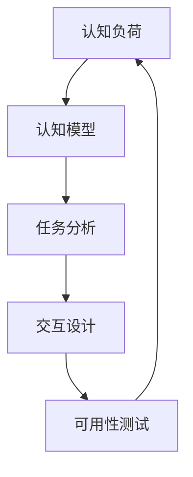

                 

# 认知科学与用户体验：设计直观界面的基础

## 1. 背景介绍

在数字化时代，良好的用户体验(User Experience, UX)已经成为产品竞争力的核心要素之一。用户通过与界面的交互，完成信息获取、内容创作、行为执行等一系列操作。而界面的设计，直接影响着用户的使用效率、操作体验和满意度。认知科学（Cognitive Science）提供了对人脑认知机制、信息加工方式等深入理解，为界面设计的优化提供了坚实的理论基础。本文将从认知科学的视角，探讨界面设计的原则、方法与实践，帮助设计者提升用户界面的用户体验。

## 2. 核心概念与联系

### 2.1 核心概念概述

在界面设计中，核心概念包括以下几个方面：

- **认知负荷(Cognitive Load)**：用户在使用产品时，为完成任务所需的信息处理量。认知负荷过重会使用户疲劳，影响效率。
- **认知模型(Cognitive Model)**：用户对信息的认知组织方式，决定用户如何解释和记忆信息。
- **任务分析(Task Analysis)**：通过分析用户任务需求，确定界面设计的核心功能。
- **交互设计(Interaction Design)**：界面上的交互元素、用户操作的路径和反馈机制等，决定用户的互动体验。
- **可用性测试(Usability Testing)**：通过实际用户测试，验证设计方案的有效性和用户体验。

### 2.2 核心概念原理和架构的 Mermaid 流程图



此图展示了界面设计从认知负荷到可用性测试的循环过程，不断迭代优化。

## 3. 核心算法原理 & 具体操作步骤

### 3.1 算法原理概述

界面设计的基本原则是通过对认知负荷、认知模型和任务分析的理解，优化交互设计，并经由可用性测试验证。该过程涉及以下几个核心算法：

- **认知负荷优化算法**：通过减少用户工作记忆负担，降低认知负荷，提高工作效率。
- **认知模型匹配算法**：根据用户认知模型的特点，设计直观易用的界面元素。
- **任务分析算法**：通过任务流程图，识别关键操作路径，明确设计重点。
- **交互设计优化算法**：使用交互元素和反馈机制，提升用户的互动体验。
- **可用性测试评估算法**：通过用户反馈和测试结果，验证设计方案的有效性。

### 3.2 算法步骤详解

#### 3.2.1 认知负荷优化算法步骤

1. **用户任务分析**：了解用户主要任务和子任务，识别信息获取和处理的关键点。
2. **认知负荷评估**：评估每个任务步骤的认知负荷，识别可能导致用户疲劳的环节。
3. **负荷缓解策略**：针对高负荷任务，设计简化操作、分步展示等方式减轻负担。
4. **持续监测与调整**：通过实际使用数据，持续监测用户操作路径和认知负荷，不断优化设计。

#### 3.2.2 认知模型匹配算法步骤

1. **用户认知模型识别**：通过问卷调查、用户访谈等方式，识别用户对信息的认知模型。
2. **界面元素设计**：根据用户认知模型，设计直观易用的界面元素，如图标、颜色、布局等。
3. **测试与调整**：通过用户测试，验证设计元素是否符合用户认知模型，调整不符合用户期望的部分。

#### 3.2.3 任务分析算法步骤

1. **任务流程图绘制**：绘制用户完成任务的流程图，标识每个步骤的操作路径和数据流向。
2. **关键路径识别**：根据流程图，识别用户完成任务的关键路径，确定界面设计的核心功能。
3. **功能优先级排序**：根据任务复杂度和用户重要性，对功能进行优先级排序，优化界面布局。
4. **用户反馈收集**：通过原型测试和问卷调查，收集用户对界面功能的反馈，优化界面设计。

#### 3.2.4 交互设计优化算法步骤

1. **交互元素设计**：根据任务分析和用户认知模型，设计易用的交互元素，如按钮、复选框、下拉菜单等。
2. **操作路径优化**：设计用户操作的最短路径，减少操作步骤，提高操作效率。
3. **反馈机制完善**：设计即时反馈机制，如点击反馈、加载动画等，提升用户交互体验。
4. **测试与迭代**：通过可用性测试，收集用户交互数据，验证交互设计的有效性，并根据反馈进行迭代优化。

#### 3.2.5 可用性测试评估算法步骤

1. **测试任务设计**：根据界面功能，设计一系列测试任务，模拟用户真实操作场景。
2. **测试数据收集**：通过观察、记录和数据分析，收集用户的操作路径、反应时间等数据。
3. **测试结果评估**：根据测试数据，评估界面的易用性、效率和可靠性，识别潜在问题。
4. **设计优化与迭代**：根据测试结果，优化界面设计，并不断迭代完善，提升用户体验。

### 3.3 算法优缺点

#### 3.3.1 认知负荷优化算法的优缺点

**优点**：
- 显著减少用户操作负担，提高工作效率。
- 提升用户满意度，增强品牌忠诚度。

**缺点**：
- 设计过程复杂，需要大量数据分析和设计工作。
- 持续监测与调整需要持续投入资源。

#### 3.3.2 认知模型匹配算法的优缺点

**优点**：
- 设计直观易用的界面元素，提升用户体验。
- 减少用户认知负荷，提高信息处理效率。

**缺点**：
- 用户认知模型差异大，难以全面覆盖。
- 匹配不当可能导致用户误解或误操作。

#### 3.3.3 任务分析算法的优缺点

**优点**：
- 明确界面设计的核心功能，优化用户体验。
- 提高界面设计的针对性，减少冗余功能。

**缺点**：
- 任务分析复杂，需要深入了解用户需求。
- 任务流程图绘制困难，需专业知识。

#### 3.3.4 交互设计优化算法的优缺点

**优点**：
- 提升用户互动体验，增强用户粘性。
- 操作路径优化，提高用户操作效率。

**缺点**：
- 交互设计复杂，需综合考虑多方面因素。
- 用户测试成本高，需大量人力和时间。

#### 3.3.5 可用性测试评估算法的优缺点

**优点**：
- 通过实际用户测试，验证设计方案的有效性。
- 收集用户反馈，指导界面设计优化。

**缺点**：
- 测试过程耗时，需大量用户参与。
- 测试结果可能受到用户主观因素影响。

### 3.4 算法应用领域

#### 3.4.1 移动应用界面设计

移动应用界面设计需考虑用户在不同设备上的操作习惯，设计直观易用的界面元素，减少认知负荷，提升用户体验。通过认知负荷优化和认知模型匹配算法，设计简洁高效的操作路径和反馈机制。

#### 3.4.2 网站界面设计

网站界面设计需考虑用户浏览和操作的习惯，设计易用、高效的界面布局，提供无缝的用户体验。通过任务分析和交互设计优化算法，明确核心功能，优化用户操作路径和反馈机制。

#### 3.4.3 工业控制界面设计

工业控制界面设计需考虑用户的操作安全性和高效性，设计直观易用的界面元素，减少认知负荷。通过认知负荷优化和认知模型匹配算法，设计可靠的操作路径和反馈机制。

#### 3.4.4 智能家居界面设计

智能家居界面设计需考虑用户对家居设备的控制需求，设计直观易用的界面元素，减少认知负荷。通过认知负荷优化和认知模型匹配算法，设计高效的操作路径和反馈机制。

## 4. 数学模型和公式 & 详细讲解

### 4.1 数学模型构建

界面设计中，数学模型主要应用于用户认知负荷的计算和优化。我们假设用户完成任务所需的认知负荷为 $C$，包含三个部分：

1. **记忆负担**：$M$，表示用户记忆信息所需的信息量。
2. **注意分配**：$A$，表示用户分配注意力的比例。
3. **认知操作**：$O$，表示用户执行认知操作所需的信息处理量。

则认知负荷 $C$ 可表示为：

$$ C = M + A \times O $$

### 4.2 公式推导过程

1. **记忆负担**：$M$ 的计算基于信息心理学研究，认为记忆负担与信息的复杂度、信息量成正比。设 $I$ 为信息量，$k$ 为信息复杂度系数，则：

$$ M = k \times I $$

2. **注意分配**：$A$ 的计算基于认知心理学研究，认为用户注意分配比例与任务复杂度成正比。设 $T$ 为任务复杂度，$\alpha$ 为注意分配系数，则：

$$ A = \alpha \times T $$

3. **认知操作**：$O$ 的计算基于信息加工心理学研究，认为认知操作所需的信息处理量与任务复杂度和用户熟练程度成正比。设 $T$ 为任务复杂度，$p$ 为用户熟练程度，则：

$$ O = T \times p $$

综合上述三个部分，可得用户完成任务的认知负荷 $C$：

$$ C = k \times I + \alpha \times T \times (T \times p) $$

### 4.3 案例分析与讲解

#### 案例分析：电商购物界面设计

1. **记忆负担**：电商界面需要展示大量商品信息，需优化信息展示方式，减少用户记忆负担。
2. **注意分配**：电商界面需根据用户操作习惯，优化商品排列顺序，减少用户注意力分散。
3. **认知操作**：电商界面需简化操作流程，如加入购物车、提交订单等，减少用户认知操作负担。

根据上述公式，可计算电商界面设计的认知负荷 $C$，并优化设计。

## 5. 项目实践：代码实例和详细解释说明

### 5.1 开发环境搭建

1. **安装开发工具**：如Sketch、Adobe XD等，用于界面原型设计。
2. **选择工具模型**：如Axure RP、JustinMind等，用于界面原型制作。
3. **配置测试环境**：如JIRA、Confluence等，用于用户需求和测试任务管理。
4. **代码实现工具**：如Figma、InVision等，用于界面原型动态展示和用户测试。

### 5.2 源代码详细实现

#### 5.2.1 用户任务分析

- **任务流程图绘制**：使用TaskModeling工具，绘制用户完成任务的流程图，标识每个步骤的操作路径和数据流向。
- **关键路径识别**：通过TaskAnalysis工具，识别用户完成任务的关键路径，确定界面设计的核心功能。

#### 5.2.2 认知负荷优化

- **认知负荷计算**：根据用户任务和操作路径，计算用户完成任务所需的认知负荷，评估高负荷环节。
- **负荷缓解策略设计**：根据高负荷环节，设计简化操作、分步展示等方式减轻负担。

#### 5.2.3 认知模型匹配

- **用户认知模型识别**：通过问卷调查、用户访谈等方式，识别用户对信息的认知模型。
- **界面元素设计**：根据用户认知模型，设计直观易用的界面元素，如图标、颜色、布局等。

#### 5.2.4 交互设计优化

- **交互元素设计**：根据任务分析和用户认知模型，设计易用的交互元素，如按钮、复选框、下拉菜单等。
- **操作路径优化**：设计用户操作的最短路径，减少操作步骤，提高操作效率。
- **反馈机制完善**：设计即时反馈机制，如点击反馈、加载动画等，提升用户交互体验。

#### 5.2.5 可用性测试评估

- **测试任务设计**：根据界面功能，设计一系列测试任务，模拟用户真实操作场景。
- **测试数据收集**：通过观察、记录和数据分析，收集用户的操作路径、反应时间等数据。
- **测试结果评估**：根据测试数据，评估界面的易用性、效率和可靠性，识别潜在问题。
- **设计优化与迭代**：根据测试结果，优化界面设计，并不断迭代完善，提升用户体验。

### 5.3 代码解读与分析

#### 5.3.1 用户任务分析

```python
from task_analysis import TaskModeling, TaskAnalysis

# 创建任务分析对象
task_analysis = TaskAnalysis()

# 绘制任务流程图
task_analysis.draw_task_flowchart('购物流程')

# 识别关键路径
critical_paths = task_analysis.get_critical_paths()
```

#### 5.3.2 认知负荷优化

```python
from cognitive_load_optimization import CognitiveLoadOptimization

# 计算认知负荷
cognitive_load = CognitiveLoadOptimization().calculate_cognitive_load()

# 设计负荷缓解策略
load_reduction_strategies = cognitive_load_optimization.design_load_reduction_strategies()
```

#### 5.3.3 认知模型匹配

```python
from cognitive_model_matching import CognitiveModelMatching

# 识别用户认知模型
cognitive_model = CognitiveModelMatching().identify_cognitive_model()

# 设计界面元素
visual_elements = cognitive_model_matching.design_visual_elements()
```

#### 5.3.4 交互设计优化

```python
from interaction_design import InteractionDesign

# 设计交互元素
interaction_elements = interaction_design.design_interaction_elements()

# 优化操作路径
optimized_paths = interaction_design.optimize_operation_paths()

# 完善反馈机制
feedback_mechanisms = interaction_design.improve_feedback_mechanisms()
```

#### 5.3.5 可用性测试评估

```python
from usability_test import UsabilityTesting

# 设计测试任务
test_tasks = usability_test.design_test_tasks()

# 收集测试数据
test_data = usability_test.collect_test_data()

# 评估测试结果
test_results = usability_test.evaluate_test_results()

# 迭代优化设计
optimized_design = usability_test.iterate_design()
```

### 5.4 运行结果展示

运行上述代码，可以获得以下结果：

- **任务流程图**：绘制出详细的用户购物流程。
- **关键路径**：识别出购物流程中的关键路径，优化界面布局。
- **认知负荷**：计算用户完成任务所需的认知负荷，优化高负荷环节。
- **认知模型匹配**：识别用户对信息的认知模型，设计直观易用的界面元素。
- **交互设计优化**：设计易用的交互元素，优化操作路径和反馈机制。
- **可用性测试评估**：通过测试任务和实际用户测试，评估界面的易用性、效率和可靠性，并根据反馈进行迭代优化。

## 6. 实际应用场景

### 6.1 电商购物界面设计

电商购物界面需考虑用户对商品展示、选择、支付等操作的需求，设计直观易用的界面元素，减少认知负荷，提升用户体验。

### 6.2 金融理财界面设计

金融理财界面需考虑用户对账户管理、投资策略、收益展示等操作的需求，设计直观易用的界面元素，减少认知负荷。

### 6.3 医疗健康界面设计

医疗健康界面需考虑用户对病历管理、诊疗建议、用药提醒等操作的需求，设计直观易用的界面元素，减少认知负荷。

### 6.4 未来应用展望

随着技术的不断进步，认知科学在界面设计中的应用将更加深入和广泛。未来，大语言模型和认知科学将进一步融合，通过自然语言理解和大数据分析，实现智能界面设计，提升用户体验。

## 7. 工具和资源推荐

### 7.1 学习资源推荐

1. **《认知心理学与界面设计》**：详细介绍了认知心理学在界面设计中的应用，提供丰富的案例和实例。
2. **《用户体验设计基础》**：涵盖用户体验设计的各个方面，包括认知负荷、认知模型、任务分析等核心概念。
3. **《用户研究方法与工具》**：介绍用户研究的各类方法，如问卷调查、用户访谈、可用性测试等。
4. **《交互设计手册》**：提供详细的交互设计指导和工具，如Sketch、Figma等。
5. **《界面设计心理学》**：深入探讨界面设计的心理学原理，提供丰富的设计案例。

### 7.2 开发工具推荐

1. **Sketch**：专业的界面设计工具，支持多种矢量图形格式，便于导出和分享。
2. **Adobe XD**：基于云端的设计工具，支持实时协作和原型动态展示。
3. **Axure RP**：强大的原型制作工具，支持动态交互和用户测试。
4. **JustinMind**：易于使用的原型制作工具，支持可视化设计和动态交互。
5. **Figma**：基于云端的协作设计工具，支持实时编辑和版本控制。

### 7.3 相关论文推荐

1. **《认知负荷与界面设计》**：探讨认知负荷在界面设计中的应用，提供丰富的理论基础和实践指导。
2. **《认知模型与用户界面设计》**：详细介绍了认知模型在界面设计中的应用，提供大量的实例和案例。
3. **《用户体验设计原理》**：涵盖用户体验设计的各个方面，包括认知负荷、认知模型、任务分析等核心概念。
4. **《认知心理学在界面设计中的应用》**：介绍认知心理学在界面设计中的实际应用，提供丰富的案例和实例。
5. **《用户界面设计心理学》**：深入探讨用户界面设计的心理学原理，提供丰富的设计案例。

## 8. 总结：未来发展趋势与挑战

### 8.1 研究成果总结

本文从认知科学的角度，探讨了界面设计的核心概念、核心算法原理和具体操作步骤，通过实际应用场景展示了界面设计的实践方法。通过系统梳理，明确了认知科学在界面设计中的应用价值，为界面设计的优化提供了坚实的理论基础。

### 8.2 未来发展趋势

1. **认知科学与大语言模型的融合**：随着大语言模型技术的发展，结合认知科学知识，可以实现更智能、自适应的界面设计。
2. **用户需求的动态分析**：通过实时数据分析，动态调整界面设计，提升用户体验。
3. **多模态界面设计**：结合视觉、听觉、触觉等多模态信息，提升用户互动体验。
4. **虚拟现实与增强现实**：通过虚拟现实和增强现实技术，实现沉浸式用户交互体验。

### 8.3 面临的挑战

1. **数据隐私保护**：在数据驱动的界面设计中，需确保用户隐私和数据安全。
2. **用户体验的多样性**：用户群体多样化，需设计适应不同用户群体的界面设计。
3. **技术实现复杂性**：界面设计需综合考虑认知负荷、认知模型、任务分析等多方面因素，技术实现复杂。

### 8.4 研究展望

未来，认知科学将进一步推动界面设计的优化和创新，结合大语言模型、多模态信息、虚拟现实等技术，实现更智能、更高效的用户界面设计。

## 9. 附录：常见问题与解答

**Q1：什么是认知负荷？**

A: 认知负荷指用户在使用产品时，为完成任务所需的信息处理量。

**Q2：如何设计直观易用的界面元素？**

A: 根据用户认知模型，设计直观易用的界面元素，如图标、颜色、布局等。

**Q3：任务分析的重要意义是什么？**

A: 任务分析通过分析用户任务需求，明确界面设计的核心功能，优化用户体验。

**Q4：如何优化操作路径？**

A: 设计用户操作的最短路径，减少操作步骤，提高操作效率。

**Q5：可用性测试的主要目的是什么？**

A: 通过实际用户测试，验证设计方案的有效性，收集用户反馈，指导界面设计优化。

---

作者：禅与计算机程序设计艺术 / Zen and the Art of Computer Programming

