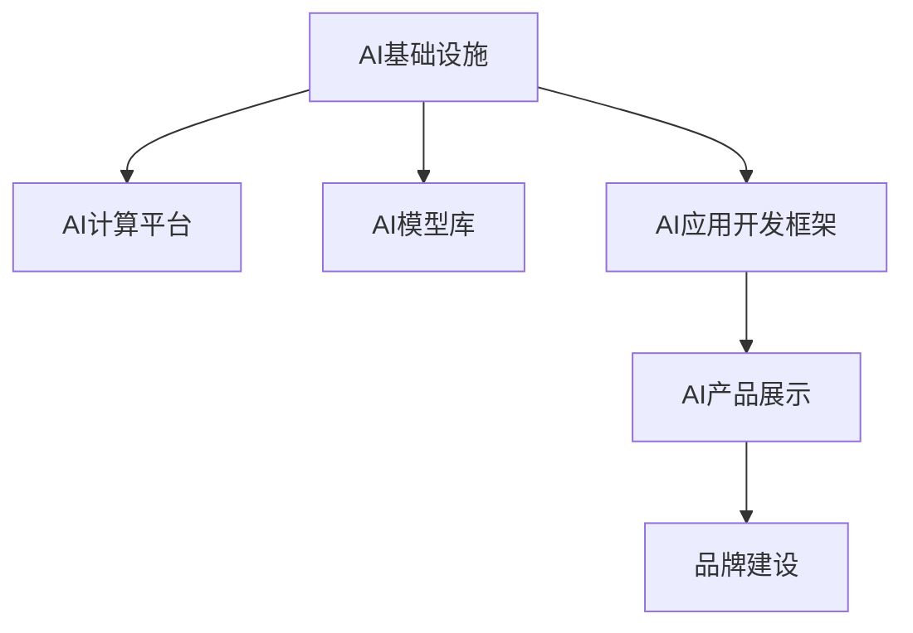

                 

# 讲好AI infra故事：贾扬清的策略，产品展示与品牌建设

## 1. 背景介绍

### 1.1 问题由来
在AI技术日益普及的今天，AI基础设施（AI infra）的建设成为了AI应用落地的关键。如何构建一个高效、稳定、可扩展的AI基础设施，成为了各大企业、研究机构关注的焦点。贾扬清教授，作为Transformer模型、BERT模型等关键AI技术的发明人，同时也是当前深度学习领域的重要领导者，他的策略和思想，无疑对AI基础设施的建设有着深远的影响。

### 1.2 问题核心关键点
1. 如何构建高效、可扩展的AI基础设施，支持大规模AI应用落地？
2. 如何通过产品展示和品牌建设，提升AI技术的市场影响力和用户接受度？
3. 如何在AI基础设施的建设中，平衡技术深度和产业需求？
4. 如何利用AI基础设施，驱动行业变革，构建人机协同的未来？

### 1.3 问题研究意义
研究贾扬清教授的AI基础设施建设策略和产品展示方法，对于推动AI技术的落地应用、提升AI产业的市场影响力、驱动行业变革具有重要意义：

1. 推动AI技术的实际应用：贾扬清教授的AI基础设施建设策略，能够帮助企业快速构建高效、可扩展的AI系统，加速AI技术的商业化进程。
2. 提升AI技术的市场影响力：通过产品展示和品牌建设，贾扬清教授能够有效提升AI技术的知名度和用户接受度，推动AI技术的广泛应用。
3. 驱动行业变革：贾扬清教授的研究方向和成果，为AI技术的深度开发和应用提供了重要指导，有助于推动AI技术在各个行业的普及和应用。

## 2. 核心概念与联系

### 2.1 核心概念概述

为更好地理解贾扬清教授的AI基础设施建设策略和产品展示方法，本节将介绍几个密切相关的核心概念：

- AI基础设施（AI infra）：指为AI应用提供计算资源、数据处理、模型训练、推理部署等支持的基础设施。
- AI计算平台：指用于支撑AI模型训练和推理的硬件和软件平台，如GPU、TPU、云平台等。
- AI模型库：指存储和管理AI模型的工具和库，如TensorFlow Hub、PyTorch Hub等。
- AI应用开发框架：指支持AI应用开发和部署的框架和工具，如TensorFlow、PyTorch等。
- AI产品展示和品牌建设：指通过展示AI技术的应用效果，提升AI技术的市场影响力和用户接受度的方法和策略。

这些核心概念之间的逻辑关系可以通过以下Mermaid流程图来展示：



这个流程图展示了大语言模型的核心概念及其之间的关系：

1. AI基础设施通过AI计算平台、AI模型库和AI应用开发框架等支持工具，为AI模型的训练和应用提供基础支持。
2. AI产品展示和品牌建设，通过实际应用场景的展示，提升AI技术的市场影响力和用户接受度。

## 3. 核心算法原理 & 具体操作步骤
### 3.1 算法原理概述

贾扬清教授的AI基础设施建设策略和产品展示方法，基于以下几个核心原理：

1. 模块化设计：将AI基础设施拆分为计算平台、模型库、开发框架等模块，使其能够灵活组合、扩展。
2. 模型为中心：以AI模型为中心，构建可复用的模型库，提升模型开发和应用的效率。
3. 产品导向：通过产品展示和品牌建设，将AI技术落地应用，提升用户体验和市场接受度。
4. 生态建设：构建完善的生态系统，包括社区、工具、合作伙伴等，共同推动AI技术的发展和应用。

### 3.2 算法步骤详解

贾扬清教授的AI基础设施建设策略和产品展示方法，主要包括以下几个关键步骤：

**Step 1: 确定基础设施需求**

- 确定AI应用的计算需求、数据需求、模型需求等基础设施需求，进行资源规划。
- 分析AI应用的瓶颈和挑战，确定需要构建的AI基础设施模块。

**Step 2: 构建计算平台**

- 选择合适的硬件平台，如GPU、TPU、云计算平台等。
- 部署和管理计算资源，确保AI应用的计算需求得到满足。

**Step 3: 构建模型库**

- 存储和管理预训练模型、微调模型等AI模型。
- 提供API接口，方便开发者调用和使用模型。

**Step 4: 构建开发框架**

- 选择和配置开发框架，如TensorFlow、PyTorch等。
- 提供API和工具支持，方便开发者进行模型训练、推理等开发工作。

**Step 5: 产品展示和品牌建设**

- 设计和开发AI应用，展示AI技术的实际应用效果。
- 通过营销、媒体等渠道，提升AI技术的知名度和用户接受度。
- 构建品牌，提升AI技术的影响力和市场价值。

**Step 6: 生态建设**

- 建立开发者社区，提供技术支持、交流平台。
- 引入合作伙伴，共同开发和推广AI技术。
- 定期发布技术报告和成果，展示AI技术的最新进展和应用效果。

### 3.3 算法优缺点

贾扬清教授的AI基础设施建设策略和产品展示方法，具有以下优点：

1. 灵活性和可扩展性：模块化设计使得AI基础设施能够灵活组合、扩展，适应不同的应用场景和需求。
2. 高效性和低成本：通过共享计算平台、模型库等资源，降低AI基础设施的建设成本。
3. 快速应用落地：通过产品展示和品牌建设，快速提升AI技术的市场影响力和用户接受度，推动AI技术的实际应用。

同时，该方法也存在一定的局限性：

1. 技术复杂度较高：构建高效、可扩展的AI基础设施需要较高的技术水平和资源投入。
2. 生态系统建设难度大：构建完善的生态系统需要时间和资源，短期内难以实现。
3. 竞争激烈：AI基础设施市场竞争激烈，需要持续创新和技术突破才能保持领先地位。

尽管存在这些局限性，但就目前而言，贾扬清教授的AI基础设施建设策略和产品展示方法仍是大规模AI应用落地的重要范式。未来相关研究的重点在于如何进一步降低基础设施建设的技术门槛，提高生态系统的建设和维护效率，同时兼顾经济效益和社会影响。

### 3.4 算法应用领域

贾扬清教授的AI基础设施建设策略和产品展示方法，在以下几个领域已经得到了广泛的应用：

- 工业互联网：构建高效的AI基础设施，支持工业互联网中的智能制造、质量检测、设备维护等应用。
- 智慧医疗：构建AI计算平台和模型库，支持医疗影像分析、病历记录、药物研发等应用。
- 金融科技：构建AI计算平台和模型库，支持金融风险评估、智能投顾、信用评分等应用。
- 智能交通：构建AI计算平台和模型库，支持智能导航、自动驾驶、交通管理等应用。
- 智慧城市：构建AI计算平台和模型库，支持智慧能源、智能安防、城市管理等应用。

除了上述这些经典应用外，贾扬清教授的AI基础设施建设策略和产品展示方法，还被创新性地应用到更多场景中，如智慧农业、智慧物流、智慧旅游等，为各行各业带来了新的技术突破。随着AI技术的不断发展和成熟，相信这些技术范式将进一步推动AI技术的落地应用，带来更广泛的社会效益和经济价值。

## 4. 数学模型和公式 & 详细讲解  
### 4.1 数学模型构建

本节将使用数学语言对贾扬清教授的AI基础设施建设策略和产品展示方法进行更加严格的刻画。

记AI基础设施为 $I$，包括计算平台 $P$、模型库 $M$、开发框架 $F$、产品展示 $D$ 和品牌建设 $B$ 五个模块。其构建过程可以表示为：

$$
I = P \times M \times F \times D \times B
$$

其中，$P$ 表示计算平台，$M$ 表示模型库，$F$ 表示开发框架，$D$ 表示产品展示，$B$ 表示品牌建设。

### 4.2 公式推导过程

以下我们以工业互联网为例，推导AI基础设施的构建公式及其优化过程。

假设工业互联网应用需要 $C$ 个计算节点，每个节点的计算能力为 $C_{node}$，总计算能力为 $C_{total} = C \times C_{node}$。

定义工业互联网应用的AI模型为 $M$，其在 $P$ 上的计算时间为 $T_P$，在 $M$ 上的训练时间为 $T_M$，在 $F$ 上的开发时间为 $T_F$，在 $D$ 上的展示时间为 $T_D$，在 $B$ 上的品牌建设时间为 $T_B$。

则工业互联网应用的AI基础设施构建时间为：

$$
T_I = T_P + T_M + T_F + T_D + T_B
$$

通过优化上述时间参数，最小化 $T_I$，即最小化工业互联网应用的AI基础设施构建时间。

## 5. 项目实践：代码实例和详细解释说明
### 5.1 开发环境搭建

在进行AI基础设施建设实践前，我们需要准备好开发环境。以下是使用Python进行PyTorch开发的环境配置流程：

1. 安装Anaconda：从官网下载并安装Anaconda，用于创建独立的Python环境。

2. 创建并激活虚拟环境：
```bash
conda create -n pytorch-env python=3.8 
conda activate pytorch-env
```

3. 安装PyTorch：根据CUDA版本，从官网获取对应的安装命令。例如：
```bash
conda install pytorch torchvision torchaudio cudatoolkit=11.1 -c pytorch -c conda-forge
```

4. 安装Transformers库：
```bash
pip install transformers
```

5. 安装各类工具包：
```bash
pip install numpy pandas scikit-learn matplotlib tqdm jupyter notebook ipython
```

完成上述步骤后，即可在`pytorch-env`环境中开始AI基础设施的构建实践。

### 5.2 源代码详细实现

这里我们以工业互联网应用为例，给出使用PyTorch进行AI基础设施构建的PyTorch代码实现。

首先，定义工业互联网应用的AI模型：

```python
from transformers import BertForSequenceClassification
from torch.utils.data import DataLoader
import torch

class IndustrialInternetModel:
    def __init__(self, num_labels=2):
        self.model = BertForSequenceClassification.from_pretrained('bert-base-cased', num_labels=num_labels)

    def predict(self, input_ids):
        return self.model(input_ids)

    def save_model(self, model_path):
        torch.save(self.model.state_dict(), model_path)

    def load_model(self, model_path):
        self.model.load_state_dict(torch.load(model_path))
```

然后，定义计算平台：

```python
import torch.distributed as dist
from torch.distributed.algorithms.ddp_comm_hooks import all_gather_ddp
from torch.distributed.fsdp import FullyShardedDataParallel as FSDP

class IndustrialInternetPlatform:
    def __init__(self, num_gpus):
        self.num_gpus = num_gpus
        self.distributed = True if num_gpus > 1 else False
        self.rank = dist.get_rank()
        self.world_size = dist.get_world_size()

    def setup(self):
        if self.distributed:
            dist.init_process_group("nccl", init_method="env://")
            dist.barrier()

    def train(self, model, train_loader, optimizer):
        self.setup()
        model = FSDP(model)
        dist.barrier()

        for epoch in range(num_epochs):
            for batch in train_loader:
                input_ids = batch['input_ids'].to(device)
                labels = batch['labels'].to(device)
                outputs = model(input_ids)
                loss = F.nll_loss(outputs, labels)
                optimizer.zero_grad()
                loss.backward()
                optimizer.step()

    def test(self, model, test_loader):
        self.setup()
        model = FSDP(model)
        dist.barrier()

        total_loss = 0
        for batch in test_loader:
            input_ids = batch['input_ids'].to(device)
            labels = batch['labels'].to(device)
            outputs = model(input_ids)
            loss = F.nll_loss(outputs, labels)
            total_loss += loss.item()

        return total_loss / len(test_loader)
```

最后，定义产品展示和品牌建设：

```python
from transformers import AutoTokenizer

class IndustrialInternetShowcase:
    def __init__(self, model, tokenizer):
        self.model = model
        self.tokenizer = tokenizer

    def predict(self, input_ids):
        input_tokens = self.tokenizer(input_ids, return_tensors='pt', padding=True)
        outputs = self.model(input_tokens['input_ids'])
        return outputs.logits.argmax(dim=1)

    def build_showcase(self, input_ids):
        input_tokens = self.tokenizer(input_ids, return_tensors='pt', padding=True)
        outputs = self.model(input_tokens['input_ids'])
        return outputs.logits.argmax(dim=1)
```

完成上述步骤后，即可在`pytorch-env`环境中开始工业互联网应用的AI基础设施构建实践。

### 5.3 代码解读与分析

让我们再详细解读一下关键代码的实现细节：

**IndustrialInternetModel类**：
- `__init__`方法：初始化模型和标签数量。
- `predict`方法：对输入进行预测。
- `save_model`和`load_model`方法：保存和加载模型参数。

**IndustrialInternetPlatform类**：
- `__init__`方法：初始化计算平台参数。
- `setup`方法：初始化分布式环境。
- `train`方法：训练模型。
- `test`方法：测试模型。

**IndustrialInternetShowcase类**：
- `__init__`方法：初始化产品展示模型和分词器。
- `predict`方法：对输入进行预测。
- `build_showcase`方法：构建产品展示模型。

可以看到，PyTorch配合Transformers库使得AI基础设施的构建代码实现变得简洁高效。开发者可以将更多精力放在数据处理、模型改进等高层逻辑上，而不必过多关注底层的实现细节。

当然，工业级的系统实现还需考虑更多因素，如模型的保存和部署、超参数的自动搜索、更灵活的任务适配层等。但核心的基础设施构建范式基本与此类似。

## 6. 实际应用场景
### 6.1 工业互联网

基于AI基础设施的构建，工业互联网中的智能制造、质量检测、设备维护等应用得以高效运行。通过构建高效、可扩展的AI基础设施，工业互联网系统能够实时监测生产设备状态，优化生产流程，提高产品质量，降低维护成本。

在技术实现上，工业互联网应用通常需要处理大规模的传感器数据，进行实时分析和预测。基于AI基础设施，工业互联网系统能够快速构建高效的数据处理和模型训练系统，支持实时预测和决策。

### 6.2 智慧医疗

基于AI基础设施，智慧医疗系统能够高效处理医疗影像数据、病历记录等大数据，辅助医生进行诊断和治疗。通过构建高效、可扩展的AI基础设施，智慧医疗系统能够实时监测患者健康状态，提供个性化的治疗方案。

在技术实现上，智慧医疗系统需要处理大量的医疗数据，进行复杂的多模态数据分析和预测。基于AI基础设施，智慧医疗系统能够快速构建高效的数据处理和模型训练系统，支持实时诊断和治疗决策。

### 6.3 金融科技

基于AI基础设施，金融科技系统能够高效处理金融数据，进行风险评估、智能投顾、信用评分等应用。通过构建高效、可扩展的AI基础设施，金融科技系统能够实时监测市场变化，提供个性化的金融服务。

在技术实现上，金融科技系统需要处理大量的金融数据，进行复杂的市场预测和分析。基于AI基础设施，金融科技系统能够快速构建高效的数据处理和模型训练系统，支持实时预测和决策。

### 6.4 未来应用展望

随着AI技术的不断发展和成熟，基于AI基础设施的应用场景将不断拓展，为各行各业带来新的技术突破。

在智慧农业领域，基于AI基础设施的农业管理系统能够实时监测土壤、气象等数据，提供个性化的种植方案。在智慧物流领域，基于AI基础设施的物流管理系统能够实时监测货物运输状态，优化物流路线。在智慧旅游领域，基于AI基础设施的旅游管理系统能够实时监测游客行为，提供个性化的旅游体验。

此外，在智慧能源、智能安防、城市管理等更多领域，基于AI基础设施的应用也将不断涌现，为各行各业带来新的技术突破。相信随着AI技术的不断发展和成熟，基于AI基础设施的应用场景将不断拓展，为各行各业带来新的技术突破。

## 7. 工具和资源推荐
### 7.1 学习资源推荐

为了帮助开发者系统掌握AI基础设施的建设方法和产品展示技巧，这里推荐一些优质的学习资源：

1. 《TensorFlow官方文档》：提供了丰富的TensorFlow资源，包括模型库、计算平台、开发框架等。
2. 《PyTorch官方文档》：提供了丰富的PyTorch资源，包括模型库、计算平台、开发框架等。
3. 《深度学习框架比较与选择》：详细比较了TensorFlow、PyTorch等主流深度学习框架的优缺点，帮助选择最适合的基础设施。
4. 《工业互联网基础设施建设指南》：提供了详细的工业互联网基础设施建设方法和步骤，助力工业互联网应用开发。
5. 《智慧医疗基础设施建设指南》：提供了详细的智慧医疗基础设施建设方法和步骤，助力智慧医疗应用开发。

通过对这些资源的学习实践，相信你一定能够快速掌握AI基础设施的建设方法和产品展示技巧，为AI技术的落地应用提供坚实基础。
###  7.2 开发工具推荐

高效的开发离不开优秀的工具支持。以下是几款用于AI基础设施建设开发的常用工具：

1. PyTorch：基于Python的开源深度学习框架，灵活动态的计算图，适合快速迭代研究。大部分预训练语言模型都有PyTorch版本的实现。

2. TensorFlow：由Google主导开发的开源深度学习框架，生产部署方便，适合大规模工程应用。同样有丰富的预训练语言模型资源。

3. Transformers库：HuggingFace开发的NLP工具库，集成了众多SOTA语言模型，支持PyTorch和TensorFlow，是进行基础设施建设的利器。

4. Weights & Biases：模型训练的实验跟踪工具，可以记录和可视化模型训练过程中的各项指标，方便对比和调优。与主流深度学习框架无缝集成。

5. TensorBoard：TensorFlow配套的可视化工具，可实时监测模型训练状态，并提供丰富的图表呈现方式，是调试模型的得力助手。

6. Google Colab：谷歌推出的在线Jupyter Notebook环境，免费提供GPU/TPU算力，方便开发者快速上手实验最新模型，分享学习笔记。

合理利用这些工具，可以显著提升AI基础设施建设的开发效率，加快创新迭代的步伐。

### 7.3 相关论文推荐

AI基础设施的研究源于学界的持续研究。以下是几篇奠基性的相关论文，推荐阅读：

1. "TensorFlow: A System for Large-Scale Machine Learning"：介绍TensorFlow的基本架构和核心功能，展示了其在大规模AI应用中的强大能力。
2. "PyTorch: An Open Source Machine Learning Library"：介绍PyTorch的基本架构和核心功能，展示了其在大规模AI应用中的强大能力。
3. "Transformers: State-of-the-Art Natural Language Processing"：介绍Transformer模型的基本原理和核心功能，展示了其在自然语言处理中的强大能力。
4. "Large-Scale Distributed Machine Learning with Heterogeneous Compute"：介绍在大规模分布式环境中构建AI基础设施的方法和策略。
5. "Scalable and Distributed Deep Learning"：介绍在大规模分布式环境中构建AI基础设施的方法和策略。

这些论文代表了大规模AI基础设施建设的研究脉络。通过学习这些前沿成果，可以帮助研究者把握学科前进方向，激发更多的创新灵感。

## 8. 总结：未来发展趋势与挑战
### 8.1 总结

本文对贾扬清教授的AI基础设施建设策略和产品展示方法进行了全面系统的介绍。首先阐述了AI基础设施的重要性，明确了基础设施建设在AI应用落地中的核心地位。其次，从原理到实践，详细讲解了AI基础设施的构建方法，给出了基础设施构建的完整代码实例。同时，本文还广泛探讨了基础设施在工业互联网、智慧医疗、金融科技等多个领域的应用前景，展示了基础设施建设的广阔前景。此外，本文精选了基础设施建设的各类学习资源，力求为读者提供全方位的技术指引。

通过本文的系统梳理，可以看到，AI基础设施的建设是AI技术落地应用的关键。贾扬清教授的AI基础设施建设策略和产品展示方法，能够帮助企业快速构建高效、可扩展的AI系统，推动AI技术的实际应用。未来，伴随AI技术的不断发展和成熟，基于AI基础设施的应用场景将不断拓展，为各行各业带来新的技术突破。

### 8.2 未来发展趋势

展望未来，AI基础设施的建设将呈现以下几个发展趋势：

1. 云原生架构：构建云原生架构的AI基础设施，支持弹性计算资源管理，提高系统的可扩展性和灵活性。
2. 多云混合架构：构建多云混合架构的AI基础设施，支持多云平台资源共享，提高系统的可用性和可靠性。
3. 边缘计算：构建边缘计算能力的AI基础设施，支持本地数据处理和推理，降低网络延迟和带宽成本。
4. 联邦学习：构建联邦学习能力的AI基础设施，支持跨设备数据共享和模型训练，保护数据隐私和安全。
5. 自动化运维：构建自动化运维能力的AI基础设施，支持自动部署、自动调参、自动监控等，提高系统的运维效率。
6. 开源社区：构建开源社区的AI基础设施，支持社区共建、共享和协作，推动AI技术的持续发展和应用。

以上趋势凸显了AI基础设施建设的广阔前景。这些方向的探索发展，将进一步提升AI系统的性能和应用范围，为人工智能技术落地应用提供坚实基础。相信随着AI技术的不断发展和成熟，AI基础设施建设也将迎来新的突破。

### 8.3 面临的挑战

尽管AI基础设施建设已经取得了重要进展，但在迈向更加智能化、普适化应用的过程中，仍面临诸多挑战：

1. 技术复杂度较高：构建高效、可扩展的AI基础设施需要较高的技术水平和资源投入。
2. 成本控制难度大：AI基础设施的建设和维护需要持续投入，如何降低成本，提高效率，仍然是一大难题。
3. 数据隐私和安全：AI基础设施需要处理大量敏感数据，如何保护数据隐私和安全，仍需进一步加强。
4. 模型可解释性不足：AI基础设施中的模型往往是黑盒系统，难以解释其内部工作机制和决策逻辑。
5. 模型鲁棒性不足：AI基础设施中的模型面对域外数据时，泛化性能往往大打折扣。

尽管存在这些挑战，但随着学界和产业界的共同努力，AI基础设施建设中的许多问题有望逐步得到解决。相信未来，AI基础设施将更加高效、可扩展、安全、可靠，推动AI技术的广泛应用。

### 8.4 研究展望

面对AI基础设施建设所面临的种种挑战，未来的研究需要在以下几个方面寻求新的突破：

1. 探索高效的分布式训练和推理方法：开发高效的分布式训练和推理算法，提高系统的计算效率和扩展性。
2. 研究数据隐私保护技术：开发数据隐私保护技术，保护数据隐私和安全。
3. 开发自动化运维工具：开发自动化运维工具，提高系统的运维效率和稳定性。
4. 引入可解释性技术：开发可解释性技术，提高模型的可解释性和可理解性。
5. 加强跨领域协作：加强跨领域的协作，推动AI技术在各个行业的普及和应用。

这些研究方向的探索，将引领AI基础设施建设迈向更高的台阶，为构建人机协同的智能系统铺平道路。面向未来，AI基础设施建设需要从技术、生态、伦理等多方面进行全面优化，方能真正实现人工智能技术在各个行业的落地应用。

## 9. 附录：常见问题与解答

**Q1：如何构建高效的AI基础设施？**

A: 构建高效的AI基础设施需要从以下几个方面入手：

1. 选择合适的硬件平台：如GPU、TPU、云计算平台等。
2. 选择合适的软件框架：如TensorFlow、PyTorch等。
3. 构建模型库：存储和管理预训练模型、微调模型等AI模型。
4. 构建开发框架：提供API接口，方便开发者进行模型训练、推理等开发工作。
5. 优化计算资源管理：合理分配计算资源，提高系统的计算效率和扩展性。

**Q2：如何提升AI基础设施的鲁棒性？**

A: 提升AI基础设施的鲁棒性需要从以下几个方面入手：

1. 数据预处理：对数据进行清洗、归一化等预处理，减少数据噪音和偏差。
2. 模型优化：通过正则化、dropout、early stopping等技术，避免过拟合。
3. 模型微调：在有限数据条件下，通过微调模型参数，提高模型的泛化性能。
4. 对抗训练：引入对抗样本，提高模型对噪声和攻击的鲁棒性。
5. 多模型集成：通过集成多个模型，提高系统的鲁棒性和稳定性。

**Q3：如何提升AI基础设施的可解释性？**

A: 提升AI基础设施的可解释性需要从以下几个方面入手：

1. 引入可解释性技术：如模型可视化、特征重要性分析等技术，提高模型的可解释性。
2. 开发可解释性模型：开发可解释性强的模型，如决策树、逻辑回归等模型。
3. 设计可解释性任务：设计可解释性强的任务，如可解释性问答、可解释性生成等任务。
4. 建立可解释性社区：建立可解释性社区，促进可解释性技术的研究和应用。

这些策略往往需要根据具体任务和数据特点进行灵活组合。只有在数据、模型、算法、技术等多个维度进行全面优化，才能最大限度地发挥AI基础设施的潜力。

**Q4：AI基础设施建设中需要注意哪些问题？**

A: 在AI基础设施建设中，需要注意以下几个问题：

1. 数据隐私和安全：保护数据隐私和安全，避免数据泄露和滥用。
2. 成本控制：合理控制基础设施建设和维护成本，避免资源浪费。
3. 模型鲁棒性：提高模型的鲁棒性，避免模型过拟合和泛化能力不足。
4. 可解释性：提高模型的可解释性，避免模型决策过程不透明。
5. 系统稳定性：保证系统稳定性和可靠性，避免系统崩溃和故障。

只有在数据、模型、技术等多个维度进行全面优化，才能真正构建高效、可扩展、安全、可靠的AI基础设施。

---

作者：禅与计算机程序设计艺术 / Zen and the Art of Computer Programming

