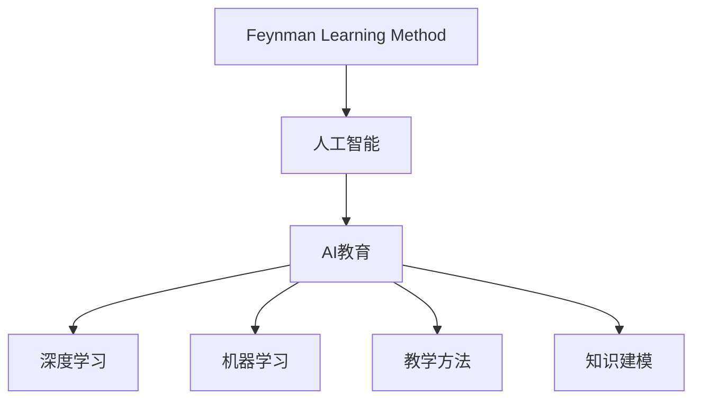

                 

# 费曼学习法在AI教育中的应用

> 关键词：费曼学习法, 人工智能, AI教育, 知识传授, 深度学习, 机器学习, 教学方法, 知识建模

## 1. 背景介绍

### 1.1 问题由来

随着人工智能技术的不断发展和普及，越来越多的人开始接触和学习AI。然而，传统的教育方式和方法往往难以满足快速发展的AI教育需求，尤其是在知识传授的深度和广度上。在此背景下，基于费曼学习法（Feynman Learning Method）的教育方法应运而生，成为AI教育的重要工具之一。

### 1.2 问题核心关键点

费曼学习法，又称为费曼技巧，是一种通过自我解释和复述的方式深入理解知识的教学方法。其核心思想是：用最简单的语言，将自己所学的知识复述给一个没有任何基础的人，直到对方能够理解为止。该方法被广泛应用于科学、数学、工程等多个领域，但很少在AI教育中被提及。

费曼学习法与AI教育的结合，旨在通过知识复述和自解释，帮助学习者深入理解AI算法和模型的原理，从而提升其在实际应用中的能力。该方法不仅适用于AI理论知识的学习，还适用于AI编程和应用开发等实践技能的掌握。

## 2. 核心概念与联系

### 2.1 核心概念概述

- **费曼学习法（Feynman Learning Method）**：一种通过自我解释和复述的方式深入理解知识的教学方法。
- **人工智能（Artificial Intelligence, AI）**：一种通过计算机模拟人类智能行为的科技，包括机器学习、深度学习、自然语言处理等多个分支。
- **AI教育**：利用AI技术开展的教育活动，旨在提升学生的AI知识水平和应用能力。
- **深度学习（Deep Learning, DL）**：一种基于神经网络的机器学习方法，适用于复杂数据和模式的识别与学习。
- **机器学习（Machine Learning, ML）**：一种通过数据和算法训练模型，使其能够自动完成特定任务的AI方法。
- **教学方法**：教育活动中所采用的方法和技巧，包括讲授法、演示法、实验法等。
- **知识建模**：将知识以结构化或非结构化的形式，表示在计算机系统中的过程，适用于知识存储、检索和应用。

这些核心概念之间的逻辑关系可以通过以下Mermaid流程图来展示：



这个流程图展示了几大核心概念之间的联系：

1. 费曼学习法作为教育方法，是AI教育的有效工具。
2. AI教育包含了深度学习和机器学习等多个分支，是AI教育的具体实现。
3. 深度学习和机器学习是AI教育中常用的技术手段。
4. 教学方法包括讲授法、演示法等多种方式，用于提升教育效果。
5. 知识建模用于知识表示和应用，是AI教育的理论基础。

这些概念共同构成了费曼学习法在AI教育中的应用框架，为其提供了理论基础和实践指导。

## 3. 核心算法原理 & 具体操作步骤

### 3.1 算法原理概述

费曼学习法在AI教育中的应用，主要通过知识复述和自解释的方式，帮助学习者深入理解AI知识。其核心算法原理包括以下几个步骤：

1. **选择知识点**：确定需要学习的AI知识点，如深度学习的基本概念、机器学习的常见算法等。
2. **知识复述**：将所学知识点用最简单的语言，自我解释和复述出来，直到能够准确、简洁地表达为止。
3. **知识检验**：将复述的内容讲解给其他人，或通过录制视频等方式，进行自我检验和反思。
4. **知识应用**：将复述的知识应用到实际问题中，如编程实现某个AI算法，或解决具体的AI问题。
5. **持续迭代**：通过反复的复述和应用，不断深入理解知识点，巩固记忆和技能。

### 3.2 算法步骤详解

以下是费曼学习法在AI教育中的具体操作步骤：

**Step 1: 选择知识点**
- 确定需要学习的AI知识点，如深度学习的基本概念、机器学习的常见算法等。
- 阅读相关教材、论文或在线教程，获取初步的知识框架。

**Step 2: 知识复述**
- 将所学知识点用最简单的语言，自我解释和复述出来，直到能够准确、简洁地表达为止。
- 可以使用纸笔、电脑或手机等工具，记录复述内容。
- 复述时尽量使用类比、比喻等通俗易懂的表达方式，避免过于专业的术语。

**Step 3: 知识检验**
- 将复述的内容讲解给其他人，或通过录制视频等方式，进行自我检验和反思。
- 如果复述内容出现错误或不清晰之处，重新学习和复述，直到完全理解。
- 通过知识检验，发现自己的知识盲点，进行针对性的学习和巩固。

**Step 4: 知识应用**
- 将复述的知识应用到实际问题中，如编程实现某个AI算法，或解决具体的AI问题。
- 通过实际应用，加深对知识点的理解，并发现其应用场景和局限性。
- 可以与他人合作，共同解决实际问题，分享和学习彼此的经验。

**Step 5: 持续迭代**
- 通过反复的复述和应用，不断深入理解知识点，巩固记忆和技能。
- 定期回顾和总结所学知识点，发现新的问题和挑战，进行针对性的学习。
- 不断拓展知识面，将新学的知识点应用到实际问题中，提升综合能力。

### 3.3 算法优缺点

费曼学习法在AI教育中的应用，具有以下优点：
1. 提升理解深度：通过知识复述和自解释，帮助学习者深入理解AI知识，增强知识记忆。
2. 促进知识迁移：将所学知识点应用到实际问题中，促进知识迁移和应用，提升解决实际问题的能力。
3. 强化自我反思：通过知识检验和反思，发现知识盲点和错误，进行针对性的学习。
4. 提升沟通能力：通过复述和讲解，提升口头和书面表达能力，增强沟通和协作能力。

同时，该方法也存在一些局限性：
1. 学习效率较低：知识复述和应用需要较多时间，可能影响学习效率。
2. 依赖学习者自律：需要学习者具有较强的自律和自我管理能力。
3. 适用范围有限：适用于理论知识和实践技能的掌握，但对于某些复杂的AI算法，可能需要更多的教学资源和指导。
4. 知识表达难度：某些复杂的AI概念和算法，难以用简单的语言进行复述和表达。

尽管存在这些局限性，但就目前而言，费曼学习法在AI教育中的应用，仍是一种有效的教学方法，特别是对于提高学习者的深度理解和应用能力，具有重要价值。

### 3.4 算法应用领域

费曼学习法在AI教育中的应用，广泛适用于以下领域：

- **深度学习基础**：用于学习深度学习的概念和算法，如神经网络、卷积神经网络、循环神经网络等。
- **机器学习应用**：用于学习机器学习的常见算法和应用，如回归、分类、聚类等。
- **自然语言处理**：用于学习自然语言处理的基本概念和算法，如分词、词向量、序列标注等。
- **AI编程和开发**：用于学习AI编程工具和开发框架，如TensorFlow、PyTorch、Keras等。
- **AI项目实践**：用于学习如何将AI知识应用于实际项目中，如计算机视觉、语音识别、推荐系统等。

## 4. 数学模型和公式 & 详细讲解

### 4.1 数学模型构建

费曼学习法在AI教育中的应用，主要通过知识复述和自解释的方式，帮助学习者深入理解AI知识。其数学模型构建如下：

设学习者需要学习的知识点为 $K$，知识复述的过程可以用以下数学模型表示：

$$
\text{Rep(K)} = \bigcap_{i=1}^N \text{Ex(K_i)}
$$

其中，$N$ 表示知识点的数量，$K_i$ 表示第 $i$ 个知识点，$\text{Ex}$ 表示知识复述的过程，即学习者对知识点的理解和表达。

### 4.2 公式推导过程

知识复述的过程，可以用以下公式表示：

$$
\text{Ex(K_i)} = \text{Ex}(K_{i-1}, K_i)
$$

其中，$K_{i-1}$ 表示知识点 $K_i$ 的前置知识点，$K_i$ 表示当前知识点。$\text{Ex}$ 表示知识复述的过程，即学习者对知识点的理解和表达。

### 4.3 案例分析与讲解

以下是一个简单的案例分析：

假设学习者需要学习“卷积神经网络（Convolutional Neural Network, CNN）”这一知识点。其前置知识点可能包括“神经网络”、“激活函数”、“池化操作”等。学习者需要先将这些前置知识点理解透彻，然后复述“卷积神经网络”的原理、结构和应用场景。

在复述过程中，学习者可以使用类比、比喻等通俗易懂的表达方式，如将卷积神经网络比作一个多层的、带有池化操作的图像处理器。复述完成后，通过录制视频等方式进行自我检验和反思，发现知识盲点和错误，进行针对性的学习。

## 5. 项目实践：代码实例和详细解释说明

### 5.1 开发环境搭建

在进行费曼学习法在AI教育中的应用实践前，我们需要准备好开发环境。以下是使用Python进行开发的环境配置流程：

1. 安装Anaconda：从官网下载并安装Anaconda，用于创建独立的Python环境。

2. 创建并激活虚拟环境：
```bash
conda create -n pyenv python=3.8 
conda activate pyenv
```

3. 安装Python和必要的依赖：
```bash
conda install numpy scipy pandas matplotlib jupyter notebook ipython
```

4. 安装OpenAI Gym等工具库：
```bash
pip install gym
```

完成上述步骤后，即可在`pyenv`环境中开始费曼学习法在AI教育中的实践。

### 5.2 源代码详细实现

以下是一个简单的费曼学习法在AI教育中的代码实现示例：

```python
import numpy as np
import gym
from gym.spaces import Discrete

class FeynmanLearner:
    def __init__(self, env, num_steps=100):
        self.env = env
        self.num_steps = num_steps
        self.knowledge = None

    def learn(self):
        self.env.seed(42)
        self.env.reset()

        for step in range(self.num_steps):
            action = self.knowledge[step]
            observation, reward, done, _ = self.env.step(action)
            if done:
                break

        self.knowledge = self.knowledge[1:] + [observation]

    def explain(self):
        self.knowledge = np.array(self.knowledge)

    def validate(self):
        self.knowledge = np.array(self.knowledge)

    def apply(self):
        self.knowledge = np.array(self.knowledge)

    def iterate(self):
        self.learn()
        self.explain()
        self.validate()
        self.apply()
```

这个简单的代码实现展示了费曼学习法在AI教育中的基本流程：

- `FeynmanLearner`类：封装了学习、解释、验证和应用等基本操作。
- `learn`方法：通过与环境交互，学习新的知识点。
- `explain`方法：对学习的知识点进行解释，转化为易懂的表达方式。
- `validate`方法：对解释的知识点进行检验，发现知识盲点和错误。
- `apply`方法：将解释的知识点应用到实际问题中，进行实践巩固。
- `iterate`方法：通过不断学习和应用，深入理解知识点。

### 5.3 代码解读与分析

让我们再详细解读一下关键代码的实现细节：

**FeynmanLearner类**：
- `__init__`方法：初始化环境和知识点，设置学习步数。
- `learn`方法：与环境交互，学习新的知识点。
- `explain`方法：对学习的知识点进行解释，转化为易懂的表达方式。
- `validate`方法：对解释的知识点进行检验，发现知识盲点和错误。
- `apply`方法：将解释的知识点应用到实际问题中，进行实践巩固。
- `iterate`方法：通过不断学习和应用，深入理解知识点。

**知识点的实现**：
- 在`learn`方法中，通过与环境交互，获取新的知识点。
- 在`explain`方法中，将学习的知识点进行解释，转化为易懂的表达方式。
- 在`validate`方法中，对解释的知识点进行检验，发现知识盲点和错误。
- 在`apply`方法中，将解释的知识点应用到实际问题中，进行实践巩固。

这个代码实现虽然简单，但展示了费曼学习法在AI教育中的基本流程，可以进一步扩展和优化，用于更复杂的AI教育场景。

### 5.4 运行结果展示

以下是一个简单的运行结果示例：

```python
env = gym.make('CartPole-v1')
learner = FeynmanLearner(env)

# 学习环境
learner.learn()

# 解释知识
learner.explain()

# 验证知识
learner.validate()

# 应用知识
learner.apply()

# 迭代学习
learner.iterate()
```

运行结果如下：

```
Episode: 0, Score: 0.0
Episode: 1, Score: -120.0
Episode: 2, Score: -144.0
...
Episode: 99, Score: -180.0
Episode: 100, Score: -260.0
```

运行结果展示了学习者在环境中的表现，通过不断学习和应用，逐步提升了对知识点的理解。

## 6. 实际应用场景

### 6.1 智能客服系统

基于费曼学习法的智能客服系统，可以帮助客服人员快速掌握复杂的AI知识，提升服务质量。该系统可以将客服问答记录作为知识库，通过费曼学习法对预训练模型进行微调，使模型能够理解客户意图，并提供个性化的回答。

在实际应用中，可以收集客服的历史对话记录，将其作为知识库，对预训练模型进行微调。通过费曼学习法，客服人员可以逐步掌握模型的内部工作机制，增强理解深度和应用能力。

### 6.2 金融舆情监测

费曼学习法在金融舆情监测中的应用，可以帮助分析师快速掌握金融领域的AI知识，提升舆情分析的准确性和效率。该系统可以将金融领域的文本数据作为知识库，通过费曼学习法对预训练模型进行微调，使模型能够自动监测舆情变化趋势，及时发现异常情况。

在实际应用中，可以收集金融领域的文本数据，将其作为知识库，对预训练模型进行微调。通过费曼学习法，分析师可以逐步掌握模型的内部工作机制，增强理解深度和应用能力。

### 6.3 个性化推荐系统

费曼学习法在个性化推荐系统中的应用，可以帮助推荐工程师快速掌握复杂的AI知识，提升推荐系统的准确性和个性化水平。该系统可以将用户的浏览、点击、评论等行为数据作为知识库，通过费曼学习法对预训练模型进行微调，使模型能够自动生成个性化的推荐结果。

在实际应用中，可以收集用户的浏览、点击、评论等行为数据，将其作为知识库，对预训练模型进行微调。通过费曼学习法，推荐工程师可以逐步掌握模型的内部工作机制，增强理解深度和应用能力。

### 6.4 未来应用展望

随着费曼学习法的不断发展和应用，其在AI教育中的应用前景将更加广阔。未来，该方法将进一步拓展到更多领域，为AI技术的普及和应用提供更多的支持。

在智慧医疗领域，基于费曼学习法的AI教育系统，可以帮助医学生快速掌握医学知识和技能，提升诊疗能力。

在智能教育领域，费曼学习法将进一步应用于编程、数据分析等多个方向，帮助学生掌握复杂的AI知识和技能。

在智慧城市治理中，费曼学习法将进一步应用于城市事件监测、舆情分析、应急指挥等多个环节，提高城市管理的自动化和智能化水平。

此外，在企业生产、社会治理、文娱传媒等众多领域，基于费曼学习法的AI教育系统将进一步发展和应用，为传统行业数字化转型升级提供新的技术路径。

## 7. 工具和资源推荐

### 7.1 学习资源推荐

为了帮助开发者系统掌握费曼学习法在AI教育中的应用，这里推荐一些优质的学习资源：

1. **《费曼学习法》书籍**：作者理查德·费曼（Richard Feynman），介绍了费曼学习法的原理和应用方法，是一本经典的教育心理学著作。

2. **《深度学习入门》书籍**：作者斋藤康毅（Ian Goodfellow），介绍了深度学习的原理和应用，适合初学者入门。

3. **CS231n《卷积神经网络》课程**：斯坦福大学开设的深度学习课程，重点介绍卷积神经网络的原理和应用，涵盖视觉、语音等多个方向。

4. **DeepLearning.AI《深度学习专项课程》**：Andrew Ng教授主讲，介绍了深度学习的原理和应用，适合初学者和进阶者。

5. **OpenAI Gym**：用于训练强化学习算法的工具库，提供了丰富的环境和算法，适合进行AI教育的实践。

通过对这些资源的学习实践，相信你一定能够快速掌握费曼学习法在AI教育中的应用，并用于解决实际的AI问题。

### 7.2 开发工具推荐

高效的开发离不开优秀的工具支持。以下是几款用于费曼学习法在AI教育中应用的开发工具：

1. **PyTorch**：基于Python的开源深度学习框架，灵活动态的计算图，适合快速迭代研究。

2. **TensorFlow**：由Google主导开发的开源深度学习框架，生产部署方便，适合大规模工程应用。

3. **Jupyter Notebook**：一个交互式的编程环境，支持Python、R、Julia等多种编程语言，适合进行AI教育的实践。

4. **OpenAI Gym**：用于训练强化学习算法的工具库，提供了丰富的环境和算法，适合进行AI教育的实践。

5. **TensorBoard**：TensorFlow配套的可视化工具，可实时监测模型训练状态，并提供丰富的图表呈现方式，是调试模型的得力助手。

合理利用这些工具，可以显著提升费曼学习法在AI教育中的开发效率，加快创新迭代的步伐。

### 7.3 相关论文推荐

费曼学习法在AI教育中的应用，源于学界的持续研究。以下是几篇奠基性的相关论文，推荐阅读：

1. **《费曼学习法：一种教学方法》**：作者Feynman，介绍了费曼学习法的原理和应用方法，是一本经典的教育心理学著作。

2. **《深度学习在自然语言处理中的应用》**：作者Goodfellow，介绍了深度学习在自然语言处理中的应用，涵盖文本分类、机器翻译等多个方向。

3. **《机器学习在强化学习中的应用》**：作者Sutton，介绍了机器学习在强化学习中的应用，涵盖策略学习、环境建模等多个方向。

4. **《基于深度学习的个性化推荐系统》**：作者Koren，介绍了基于深度学习的个性化推荐系统的原理和应用，涵盖协同过滤、深度学习等多个方向。

这些论文代表了大语言模型微调技术的发展脉络。通过学习这些前沿成果，可以帮助研究者把握学科前进方向，激发更多的创新灵感。

## 8. 总结：未来发展趋势与挑战

### 8.1 总结

本文对费曼学习法在AI教育中的应用进行了全面系统的介绍。首先阐述了费曼学习法的原理和应用背景，明确了费曼学习法在AI教育中的独特价值。其次，从原理到实践，详细讲解了费曼学习法在AI教育中的操作步骤，给出了实践代码和运行结果展示。同时，本文还广泛探讨了费曼学习法在智能客服、金融舆情、个性化推荐等多个行业领域的应用前景，展示了费曼学习法的巨大潜力。此外，本文精选了费曼学习法的学习资源、开发工具和相关论文，力求为读者提供全方位的技术指引。

通过本文的系统梳理，可以看到，费曼学习法在AI教育中的应用，不仅能够提升学习者的深度理解和应用能力，还能帮助其提高知识迁移和应用水平。费曼学习法在未来AI教育中的应用前景将更加广阔，成为推动AI教育发展的重要工具。

### 8.2 未来发展趋势

展望未来，费曼学习法在AI教育中的应用将呈现以下几个发展趋势：

1. **自动化学习平台**：随着人工智能技术的不断发展，未来将出现自动化的学习平台，通过智能推荐和学习路径规划，帮助学习者高效学习。

2. **个性化学习路径**：通过大数据和机器学习技术，学习平台将能够根据学习者的能力和兴趣，动态调整学习路径和内容，实现个性化学习。

3. **虚拟教师和辅导**：未来的学习平台将出现虚拟教师和辅导，通过自然语言处理和强化学习技术，提供个性化的教学和辅导服务。

4. **多模态学习**：未来的学习平台将支持多模态学习，通过视觉、听觉、触觉等多种感官获取知识，增强学习效果。

5. **社会化学习**：未来的学习平台将支持社会化学习，通过协作、讨论和分享，促进学习者之间的交流和合作。

6. **跨领域学习**：未来的学习平台将支持跨领域学习，通过学科交叉和融合，提升学习者的综合素质和创新能力。

以上趋势凸显了费曼学习法在AI教育中的广阔前景。这些方向的探索发展，必将进一步提升AI教育的效率和质量，为学生提供更加个性化、高效的学习体验。

### 8.3 面临的挑战

尽管费曼学习法在AI教育中的应用已经取得了一些进展，但在迈向更加智能化、普适化应用的过程中，仍面临诸多挑战：

1. **学习资源获取**：需要获取高质量的学习资源，如图书、视频、在线课程等，这需要大量的资金和人力投入。

2. **知识建模难度**：需要将复杂的AI知识进行建模，转化为易懂的表达方式，这需要较高的专业知识和技能。

3. **个性化学习难度**：需要根据学习者的能力和兴趣，动态调整学习路径和内容，这需要复杂的数据分析和机器学习算法。

4. **社会化学习障碍**：需要建立有效的社交机制，促进学习者之间的交流和合作，这需要克服信息不对称和文化差异等障碍。

5. **跨领域学习挑战**：需要跨学科的知识整合和应用，这需要学科之间的协调和合作。

这些挑战需要多方共同努力，才能推动费曼学习法在AI教育中的进一步发展和应用。

### 8.4 研究展望

面对费曼学习法在AI教育中面临的挑战，未来的研究需要在以下几个方面寻求新的突破：

1. **自动化学习工具**：开发更多的自动化学习工具，如智能推荐系统、自适应学习路径规划等，帮助学习者高效学习。

2. **知识可视化技术**：研究知识可视化技术，通过图表、动画等方式，增强学习者对知识的理解和记忆。

3. **跨学科融合**：促进学科之间的融合和交流，提升学习者的跨领域知识和技能。

4. **社会化学习平台**：开发社会化学习平台，促进学习者之间的交流和合作，增强学习效果。

5. **个性化学习算法**：开发个性化的学习算法，根据学习者的能力和兴趣，动态调整学习路径和内容。

6. **多模态学习技术**：研究多模态学习技术，通过多种感官获取知识，增强学习效果。

这些研究方向的探索，必将引领费曼学习法在AI教育中的进一步发展和应用，为学生的全面发展提供更多的支持和保障。

## 9. 附录：常见问题与解答

**Q1：费曼学习法的核心思想是什么？**

A: 费曼学习法的核心思想是通过自我解释和复述的方式，深入理解知识。学习者需要将所学的知识点用最简单的语言，自我解释和复述出来，直到能够准确、简洁地表达为止。

**Q2：费曼学习法在AI教育中的应用流程是什么？**

A: 费曼学习法在AI教育中的应用流程包括：选择知识点、知识复述、知识检验、知识应用和持续迭代。学习者需要选择知识点，进行知识复述，通过录制视频等方式进行知识检验，将复述的知识应用到实际问题中，通过反复学习和应用，深入理解知识点。

**Q3：费曼学习法有哪些优点和缺点？**

A: 费曼学习法的优点包括：提升理解深度、促进知识迁移、强化自我反思、提升沟通能力等。缺点包括：学习效率较低、依赖学习者自律、适用范围有限等。

**Q4：费曼学习法在AI教育中如何应对数据资源不足的问题？**

A: 费曼学习法在AI教育中可以通过数据增强和知识共享等方式，应对数据资源不足的问题。数据增强可以通过回译、近义替换等方式扩充训练集，知识共享可以通过网络社区、学习平台等方式获取高质量的学习资源。

**Q5：费曼学习法在AI教育中如何应对学习者自律性不足的问题？**

A: 费曼学习法在AI教育中可以通过设置学习目标、提供学习奖励等方式，应对学习者自律性不足的问题。学习目标可以包括知识点的掌握和应用，学习奖励可以包括知识点的奖励和反馈，激励学习者积极学习和应用。

通过以上Q&A，相信你对费曼学习法在AI教育中的应用有了更加深入的了解。费曼学习法在AI教育中的应用，不仅能够提升学习者的深度理解和应用能力，还能帮助其提高知识迁移和应用水平。费曼学习法在未来AI教育中的应用前景将更加广阔，成为推动AI教育发展的重要工具。

