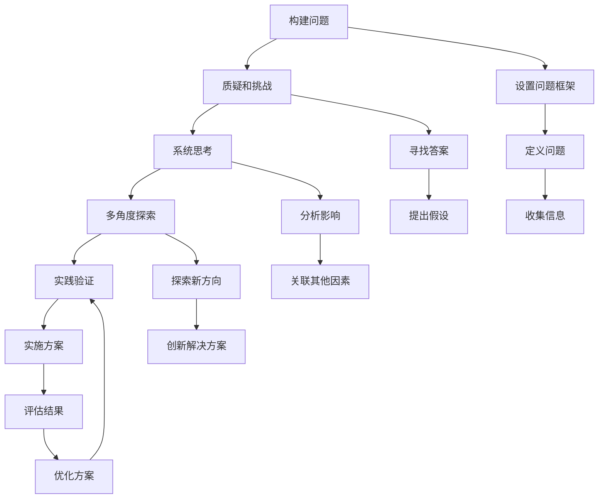

                 

# 费曼提问法:开启管理者思维升级

> 关键词：费曼学习法,问题驱动,管理者,思维提升,批判性思维,决策能力,创新能力

## 1. 背景介绍

### 1.1 问题由来
在快速变化、信息爆炸的今天，管理者的工作越来越复杂和多元化。他们不仅要应对日常的运营挑战，还需要在危机时刻做出正确的决策。然而，许多管理者在忙碌的工作中忽略了最基本的思维提升，这可能导致决策失误、团队士气低落，甚至损害公司的长期发展。

费曼提问法，一种以问题为中心的学习方法，通过不断质疑和挑战已有知识，推动思考和创新。对于管理者而言，掌握这一方法，可以提升决策能力、增强问题解决能力、激发团队创新力，从而在复杂多变的环境中保持竞争力。

### 1.2 问题核心关键点
费曼提问法的核心在于通过“提出问题-寻找答案-验证答案”的循环，不断深入理解和探索问题，从而推动思考的深入和创新。其关键步骤包括：

1. **构建问题框架**：明确问题的定义和范围，确保思考的方向性。
2. **质疑和挑战**：对已有的知识和假设进行质疑，寻找可能的解决方案。
3. **系统思考**：考虑问题的前因后果，理解其复杂性和相互关系。
4. **多角度探索**：从不同角度、层次和维度审视问题，寻找新的突破点。
5. **实践验证**：将解决方案付诸实践，验证其效果，不断迭代优化。

掌握费曼提问法，能够帮助管理者在面对复杂问题时，保持清醒的头脑和开放的心态，从而做出更加明智的决策，推动个人和团队的成长。

### 1.3 问题研究意义
费曼提问法在管理中的应用，能够帮助管理者：

- **提升决策能力**：通过系统化的问题分析和思考，减少决策失误，提高决策的科学性和准确性。
- **增强问题解决能力**：构建系统性问题解决方案，提升解决复杂问题的能力。
- **激发团队创新力**：鼓励团队成员提出创新性问题，培养创新思维。
- **提升个人思维深度**：通过不断提问和思考，深化对问题的理解，拓宽思维的广度和深度。

## 2. 核心概念与联系

### 2.1 核心概念概述

费曼提问法是一种基于质疑和深入思考的学习方法，旨在通过不断构建、挑战和验证问题，推动学习者和管理者深入理解问题本质，激发创新思维。该方法的核心概念包括：

- **问题构建**：明确问题的定义和范围，确定思考的方向。
- **质疑和挑战**：对已有知识和假设进行质疑，寻找可能的解决方案。
- **系统思考**：从整体和系统的视角理解问题，考虑其前因后果和相互关系。
- **多角度探索**：从不同角度、层次和维度审视问题，寻找新的突破点。
- **实践验证**：将解决方案付诸实践，验证其效果，不断迭代优化。

### 2.2 核心概念原理和架构的 Mermaid 流程图(Mermaid 流程节点中不要有括号、逗号等特殊字符)



这个流程图展示了费曼提问法的核心步骤和各个步骤之间的联系。从构建问题到实践验证，每个步骤都有明确的输出，为下一步骤的输入，形成一个完整的循环。

## 3. 核心算法原理 & 具体操作步骤

### 3.1 算法原理概述

费曼提问法基于“提出问题-寻找答案-验证答案”的循环，通过不断构建和挑战问题，推动思考和创新的深入。其核心算法原理包括：

1. **问题构建**：明确问题的定义和范围，构建问题的框架，确保思考的方向性。
2. **质疑和挑战**：对已有知识和假设进行质疑，寻找可能的解决方案。
3. **系统思考**：从整体和系统的视角理解问题，考虑其前因后果和相互关系。
4. **多角度探索**：从不同角度、层次和维度审视问题，寻找新的突破点。
5. **实践验证**：将解决方案付诸实践，验证其效果，不断迭代优化。

### 3.2 算法步骤详解

#### 3.2.1 构建问题

**步骤1：设置问题框架**

构建问题的第一步是设置问题框架，明确问题的定义和范围，确定思考的方向。这可以通过以下几个步骤来实现：

1. **明确目标**：定义问题需要达到的目标和解决的具体问题。
2. **收集信息**：收集与问题相关的背景信息，包括已有数据、文献、专家意见等。
3. **构建框架**：将问题拆分为若干子问题，形成一个系统性的问题框架。

**示例：** 假设公司销售额下降，构建问题框架如下：

1. **目标**：找到销售额下降的原因，并制定提升策略。
2. **背景信息**：收集过去几年的销售数据、市场环境、竞争对手信息等。
3. **子问题框架**：
   - 销售数据分析
   - 市场环境变化
   - 竞争对手策略
   - 内部管理问题

#### 3.2.2 质疑和挑战

**步骤2：质疑和挑战已有知识和假设**

质疑和挑战已有的知识和假设，是费曼提问法的核心步骤。这可以帮助管理者突破思维定势，激发新的思考方向。

1. **质疑已有知识**：对已有的知识、假设和经验进行质疑，找出其中的局限性和不足之处。
2. **提出假设**：基于质疑，提出新的假设和解决方案。
3. **验证假设**：通过实验或分析验证假设的有效性。

**示例：** 在销售额下降问题中，管理者可以质疑现有市场策略的有效性，提出新的市场推广方案，并通过数据分析验证其效果。

#### 3.2.3 系统思考

**步骤3：系统思考**

系统思考要求从整体和系统的视角理解问题，考虑其前因后果和相互关系，确保解决方案的全面性和系统性。

1. **理解系统**：分析问题的各个组成部分，理解其相互关系和影响。
2. **识别关键因素**：找出影响问题的关键因素，确保解决方案的针对性。
3. **设计解决方案**：基于系统思考，设计系统性的解决方案。

**示例：** 在销售额下降问题中，管理者需要理解市场、产品、销售渠道、客户等多方面的因素，设计系统性的市场策略和产品优化方案。

#### 3.2.4 多角度探索

**步骤4：多角度探索**

多角度探索要求从不同角度、层次和维度审视问题，寻找新的突破点，确保解决方案的创新性和全面性。

1. **多角度分析**：从不同的角度和层次分析问题，找出新的视角和方向。
2. **创新解决方案**：基于多角度分析，提出创新的解决方案。
3. **评估创新方案**：评估创新方案的可行性和效果，选择最优方案。

**示例：** 在销售额下降问题中，管理者可以从市场、产品、渠道、客户等多个角度分析问题，提出创新性的市场推广方案和产品优化策略。

#### 3.2.5 实践验证

**步骤5：实践验证**

实践验证是将解决方案付诸实践，验证其效果，并根据反馈不断迭代优化的过程。

1. **实施方案**：将解决方案付诸实践，观察其效果。
2. **收集反馈**：收集实践中的反馈和数据，评估方案的效果。
3. **迭代优化**：根据反馈不断迭代优化方案，确保其有效性。

**示例：** 在销售额下降问题中，管理者实施新的市场推广方案和产品优化策略，收集市场反馈数据，根据数据不断优化方案。

### 3.3 算法优缺点

费曼提问法作为一种基于问题驱动的学习方法，具有以下优点：

1. **深入思考**：通过不断质疑和挑战已有知识和假设，推动思考的深入和创新。
2. **系统性**：从整体和系统的视角理解问题，确保解决方案的全面性和系统性。
3. **多角度探索**：从不同角度、层次和维度审视问题，寻找新的突破点。
4. **实践验证**：通过实践验证，确保解决方案的可行性和有效性。

然而，该方法也存在一些局限性：

1. **需要时间和精力**：构建和挑战问题的过程需要大量的时间和精力投入。
2. **对经验要求高**：管理者需要具备较高的经验和分析能力，才能有效应用费曼提问法。
3. **可能陷入困境**：在问题的多个层次和维度上深入探索，可能导致思维过于发散，难以找到有效的解决方案。

尽管存在这些局限性，费曼提问法仍然是一种非常有效的问题解决和思维提升方法，尤其在管理领域中具有重要的应用价值。

### 3.4 算法应用领域

费曼提问法在管理中的应用，主要涵盖以下几个领域：

- **战略规划**：通过构建和挑战战略问题，制定系统性的战略规划。
- **问题解决**：通过系统思考和多角度探索，解决复杂管理问题。
- **创新管理**：通过不断质疑和创新，推动组织创新和持续改进。
- **决策支持**：通过深入分析和实践验证，提供科学的决策支持。

## 4. 数学模型和公式 & 详细讲解 & 举例说明

### 4.1 数学模型构建

费曼提问法主要通过提出问题、寻找答案和验证答案的方式进行学习，不需要复杂的数学模型。然而，在实际操作中，可以借助数学模型和公式来辅助问题分析和解决方案设计。

### 4.2 公式推导过程

由于费曼提问法主要依赖逻辑思维和系统分析，其公式推导过程相对简单。这里仅举一个简单的例子，说明如何在问题分析和解决方案设计中应用数学模型。

**示例：** 假设公司销售额下降，构建数学模型如下：

设销售额为 $S$，市场份额为 $M$，销售成本为 $C$，则销售额可以表示为：

$$
S = M \times (S_{基线} - C)
$$

其中 $S_{基线}$ 表示基线销售额。

通过分析该公式，可以发现影响销售额的关键因素为市场份额和销售成本。因此，可以从这两个维度入手，提出解决方案。

### 4.3 案例分析与讲解

**案例分析：** 某公司发现销售额连续三个月下降，通过费曼提问法进行分析。

1. **构建问题框架**：
   - 目标：找到销售额下降的原因，并制定提升策略。
   - 背景信息：收集过去三年的销售数据、市场环境、竞争对手信息等。
   - 子问题框架：
     - 销售数据分析
     - 市场环境变化
     - 竞争对手策略
     - 内部管理问题

2. **质疑和挑战已有知识**：
   - 质疑销售数据是否真实反映了市场情况。
   - 质疑市场份额是否受环境因素影响。
   - 质疑竞争对手策略是否有效。
   - 质疑内部管理问题是否影响了销售。

3. **系统思考**：
   - 分析市场、产品、销售渠道、客户等多方面因素，找出影响销售额的关键因素。
   - 识别市场变化、竞争对手策略、内部管理等关键因素。

4. **多角度探索**：
   - 从市场、产品、渠道、客户等多个角度分析问题，找出新的视角和方向。
   - 提出创新的市场推广方案和产品优化策略。

5. **实践验证**：
   - 实施新的市场推广方案和产品优化策略，收集市场反馈数据。
   - 根据反馈不断优化方案，确保其有效性。

## 5. 项目实践：代码实例和详细解释说明

### 5.1 开发环境搭建

进行费曼提问法应用时，主要需要以下开发环境：

- **文本编辑器**：如Visual Studio Code、Sublime Text等，用于编写和管理问题文档。
- **协作工具**：如Trello、Confluence等，用于团队协作和知识共享。
- **数据分析工具**：如Excel、R、Python等，用于数据分析和可视化。

### 5.2 源代码详细实现

费曼提问法的应用不需要编写复杂的代码，但可以通过代码辅助问题分析和解决方案设计。这里提供一个简单的Python代码示例，用于数据处理和分析。

**示例代码：** 

```python
import pandas as pd

# 读取销售数据
data = pd.read_csv('sales_data.csv')

# 数据处理
data['monthly_sales'] = data['sales'] / data['sales'].mean()
data['monthly_sales'].fillna(data['monthly_sales'].mean(), inplace=True)

# 绘制趋势图
data['monthly_sales'].plot()

# 输出分析结果
print('平均月销售额为:', data['monthly_sales'].mean())
print('月销售额变化情况如下:')
print(data['monthly_sales'].describe())
```

**代码解释：**

- **数据读取**：通过Pandas库读取销售数据。
- **数据处理**：计算月销售额的平均值和标准化，并填充缺失值。
- **数据可视化**：绘制月销售额趋势图。
- **结果输出**：输出月销售额的平均值和描述性统计信息。

### 5.3 代码解读与分析

**代码解读：**

- **数据读取**：通过`pd.read_csv`函数读取销售数据，并将其存储在DataFrame对象`data`中。
- **数据处理**：通过`mean`函数计算月销售额的平均值，并将其标准化。使用`fillna`函数填充缺失值。
- **数据可视化**：使用`plot`函数绘制月销售额的趋势图。
- **结果输出**：通过`print`函数输出月销售额的平均值和描述性统计信息。

**代码分析：**

- **数据处理**：通过计算平均值和标准化，可以更好地分析月销售额的变化情况。
- **数据可视化**：通过绘制趋势图，可以直观地观察月销售额的变化趋势。
- **结果输出**：通过输出平均值和描述性统计信息，可以了解月销售额的基本情况。

## 6. 实际应用场景

### 6.1 智能客服系统

智能客服系统是费曼提问法的重要应用场景之一。通过构建和挑战问题，可以不断优化客服系统，提升客户满意度。

**示例：** 假设某电商平台发现客服响应时间过长，客户满意度下降。

1. **构建问题框架**：
   - 目标：缩短客服响应时间，提升客户满意度。
   - 背景信息：收集过去一年的客服响应数据、客户满意度调查结果等。
   - 子问题框架：
     - 响应时间分析
     - 客服系统问题
     - 客户需求分析
     - 解决方案设计

2. **质疑和挑战已有知识**：
   - 质疑客服响应系统是否高效。
   - 质疑客户需求是否得到及时响应。
   - 质疑系统是否能够处理复杂问题。

3. **系统思考**：
   - 分析客服系统的工作流程、响应机制等，找出影响响应时间的关键因素。
   - 识别客户需求的类型和变化，确保系统能够及时响应。

4. **多角度探索**：
   - 从客服系统、客户需求等多个角度分析问题，找出新的视角和方向。
   - 提出新的客服响应策略和系统优化方案。

5. **实践验证**：
   - 实施新的客服响应策略和系统优化方案，收集客户反馈数据。
   - 根据反馈不断优化方案，确保其有效性。

### 6.2 金融舆情监测

金融舆情监测是费曼提问法的另一个重要应用场景。通过构建和挑战问题，可以及时发现和应对潜在的金融风险。

**示例：** 假设某金融公司发现市场舆情突然恶化，股票价格波动剧烈。

1. **构建问题框架**：
   - 目标：及时发现和应对市场舆情变化，稳定股票价格。
   - 背景信息：收集市场舆情数据、新闻报道、客户反馈等。
   - 子问题框架：
     - 舆情数据分析
     - 舆情变化原因
     - 市场反应分析
     - 解决方案设计

2. **质疑和挑战已有知识**：
   - 质疑舆情数据的真实性和完整性。
   - 质疑舆情变化的原因和影响。
   - 质疑市场反应的机制和效果。

3. **系统思考**：
   - 分析舆情数据的来源和质量，找出影响舆情变化的关键因素。
   - 识别舆情变化的原因和影响，确保及时应对。

4. **多角度探索**：
   - 从舆情数据、市场反应等多个角度分析问题，找出新的视角和方向。
   - 提出新的舆情监测和应对策略。

5. **实践验证**：
   - 实施新的舆情监测和应对策略，收集市场反馈数据。
   - 根据反馈不断优化策略，确保其有效性。

### 6.3 个性化推荐系统

个性化推荐系统是费曼提问法的另一个重要应用场景。通过构建和挑战问题，可以不断优化推荐系统，提升用户满意度。

**示例：** 假设某电商网站发现用户流失率上升，用户满意度下降。

1. **构建问题框架**：
   - 目标：降低用户流失率，提升用户满意度。
   - 背景信息：收集用户行为数据、用户评价、流失原因等。
   - 子问题框架：
     - 用户行为分析
     - 用户流失原因
     - 推荐系统问题
     - 解决方案设计

2. **质疑和挑战已有知识**：
   - 质疑用户行为数据的准确性。
   - 质疑用户流失的原因和影响。
   - 质疑推荐系统的推荐效果。

3. **系统思考**：
   - 分析用户行为数据和流失原因，找出影响用户流失的关键因素。
   - 识别推荐系统的推荐策略和效果，确保其能够满足用户需求。

4. **多角度探索**：
   - 从用户行为、流失原因等多个角度分析问题，找出新的视角和方向。
   - 提出新的推荐策略和系统优化方案。

5. **实践验证**：
   - 实施新的推荐策略和系统优化方案，收集用户反馈数据。
   - 根据反馈不断优化方案，确保其有效性。

## 7. 工具和资源推荐

### 7.1 学习资源推荐

掌握费曼提问法需要系统的学习和实践。以下是一些推荐的资源：

1. **《费曼学习法》**：本书详细介绍了费曼学习法的原理和应用方法，适合初学者和进阶者。
2. **Coursera《问题驱动型学习》课程**：通过实际案例讲解问题驱动型学习的应用，适合在线学习。
3. **TED Talks《如何成为更好的思考者》**：TED Talks上关于思考和创新的演讲，有助于提升思维能力。
4. **《深度思考》书籍**：介绍深度思考的原理和应用，适合提高问题解决能力。

### 7.2 开发工具推荐

费曼提问法的应用不需要复杂的代码，但可以通过一些工具来辅助问题分析和解决方案设计。以下是一些推荐的开发工具：

1. **Trello**：用于任务管理和团队协作，适合构建问题框架和管理任务。
2. **Confluence**：用于知识共享和文档管理，适合记录问题和解决方案。
3. **Tableau**：用于数据可视化和分析，适合数据分析和结果展示。
4. **Miro**：用于在线协作和思维导图，适合多角度探索问题。

### 7.3 相关论文推荐

费曼提问法作为一种经典的学习方法，近年来也被广泛应用到各个领域。以下是一些相关的论文推荐：

1. **《费曼学习法在创新思维中的应用》**：介绍费曼学习法在创新思维中的具体应用，适合系统学习和实践。
2. **《问题驱动型学习在项目管理和创新中的作用》**：介绍问题驱动型学习在项目管理和创新中的作用，适合结合实际工作应用。
3. **《深度思考在复杂问题解决中的应用》**：介绍深度思考在复杂问题解决中的应用，适合提升问题解决能力。

## 8. 总结：未来发展趋势与挑战

### 8.1 研究成果总结

费曼提问法作为一种基于问题驱动的学习方法，已经在管理、创新、决策等领域得到了广泛应用。其主要研究成果包括：

1. **问题驱动型学习**：通过构建和挑战问题，推动思维的深入和创新。
2. **系统性思考**：从整体和系统的视角理解问题，确保解决方案的全面性和系统性。
3. **多角度探索**：从不同角度、层次和维度审视问题，寻找新的突破点。
4. **实践验证**：通过实践验证，确保解决方案的可行性和有效性。

### 8.2 未来发展趋势

费曼提问法在未来的发展趋势包括：

1. **人工智能辅助**：结合人工智能技术，自动化构建和挑战问题，提高效率。
2. **多领域应用**：在更多领域，如医疗、教育、金融等，推广应用费曼提问法。
3. **虚拟现实和增强现实**：结合虚拟现实和增强现实技术，增强问题分析和解决方案设计。
4. **跨学科融合**：结合其他学科的知识和方法，推动费曼提问法的多学科融合应用。

### 8.3 面临的挑战

费曼提问法在应用过程中也面临一些挑战：

1. **时间和精力投入**：构建和挑战问题的过程需要大量的时间和精力投入。
2. **对经验要求高**：管理者需要具备较高的经验和分析能力，才能有效应用费曼提问法。
3. **可能陷入困境**：在问题的多个层次和维度上深入探索，可能导致思维过于发散，难以找到有效的解决方案。

### 8.4 研究展望

未来的研究需要关注以下几个方面：

1. **自动化问题构建**：结合人工智能技术，自动化构建和挑战问题，提高效率。
2. **多领域应用推广**：在更多领域，如医疗、教育、金融等，推广应用费曼提问法。
3. **跨学科融合应用**：结合其他学科的知识和方法，推动费曼提问法的多学科融合应用。
4. **虚拟现实和增强现实**：结合虚拟现实和增强现实技术，增强问题分析和解决方案设计。

费曼提问法作为一种基于问题驱动的学习方法，已经在管理、创新、决策等领域得到了广泛应用。通过不断构建和挑战问题，推动思维的深入和创新，提升决策能力、增强问题解决能力、激发团队创新力，从而在复杂多变的环境中保持竞争力。随着技术的发展和应用的推广，费曼提问法必将在更多的领域发挥重要作用，推动个人和团队的成长。

## 9. 附录：常见问题与解答

**Q1：费曼提问法如何帮助提升管理者的决策能力？**

A: 费曼提问法通过构建和挑战问题，推动管理者的深入思考和创新，从而提升决策能力。具体来说：

1. **系统思考**：通过构建问题框架，明确问题的定义和范围，确保思考的方向性。
2. **质疑和挑战**：通过质疑和挑战已有知识和假设，找到新的解决方案。
3. **多角度探索**：从不同角度和层次分析问题，寻找新的突破点。
4. **实践验证**：通过实践验证，确保解决方案的可行性和有效性。

通过系统思考和多角度探索，管理者可以全面了解问题的本质和影响因素，从而做出更加科学和理性的决策。

**Q2：费曼提问法在实际应用中需要注意哪些问题？**

A: 费曼提问法在实际应用中需要注意以下几个问题：

1. **时间和精力投入**：构建和挑战问题的过程需要大量的时间和精力投入，需要管理者具备高效的时间管理能力。
2. **对经验要求高**：费曼提问法对管理者的经验和分析能力要求较高，需要不断学习和积累。
3. **可能陷入困境**：在问题的多个层次和维度上深入探索，可能导致思维过于发散，难以找到有效的解决方案。

因此，管理者需要结合实际工作，灵活应用费曼提问法，确保其有效性和实用性。

**Q3：费曼提问法在创新管理中的应用有哪些？**

A: 费曼提问法在创新管理中的应用主要包括以下几个方面：

1. **问题驱动型创新**：通过构建和挑战问题，推动创新思维的深入，激发团队的创新潜力。
2. **系统思考**：从整体和系统的视角理解问题，确保创新策略的全面性和系统性。
3. **多角度探索**：从不同角度、层次和维度审视问题，寻找新的创新方向。
4. **实践验证**：通过实践验证，确保创新策略的可行性和有效性。

通过费曼提问法，管理者可以系统地推动创新，提升团队的创新能力，从而在竞争激烈的市场中保持领先。

**Q4：费曼提问法如何应用于个性化推荐系统？**

A: 费曼提问法在个性化推荐系统中的应用主要包括以下几个步骤：

1. **构建问题框架**：明确个性化推荐系统的目标和具体问题。
2. **质疑和挑战已有知识**：质疑推荐系统的推荐效果和用户行为数据的准确性。
3. **系统思考**：分析用户行为数据和推荐策略，找出影响推荐效果的关键因素。
4. **多角度探索**：从用户行为、推荐策略等多个角度分析问题，找出新的视角和方向。
5. **实践验证**：实施新的推荐策略和系统优化方案，收集用户反馈数据，不断迭代优化方案。

通过费曼提问法，个性化推荐系统可以不断优化，提升用户满意度，增强系统的推荐效果。

**Q5：费曼提问法在智能客服系统中的应用有哪些？**

A: 费曼提问法在智能客服系统中的应用主要包括以下几个步骤：

1. **构建问题框架**：明确客服系统的问题和目标。
2. **质疑和挑战已有知识**：质疑客服系统的响应时间和效率。
3. **系统思考**：分析客服系统的工作流程和响应机制，找出影响响应时间的关键因素。
4. **多角度探索**：从客服系统、客户需求等多个角度分析问题，找出新的视角和方向。
5. **实践验证**：实施新的客服响应策略和系统优化方案，收集客户反馈数据，不断优化方案。

通过费曼提问法，智能客服系统可以不断优化，提升客户满意度，降低响应时间，增强系统的效率和效果。

---

作者：禅与计算机程序设计艺术 / Zen and the Art of Computer Programming

